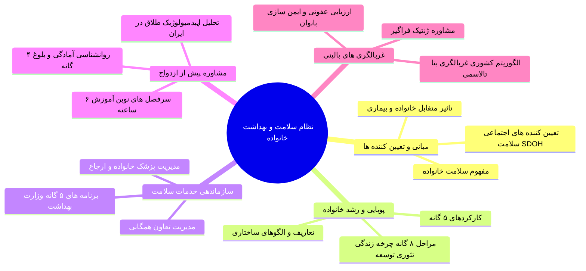
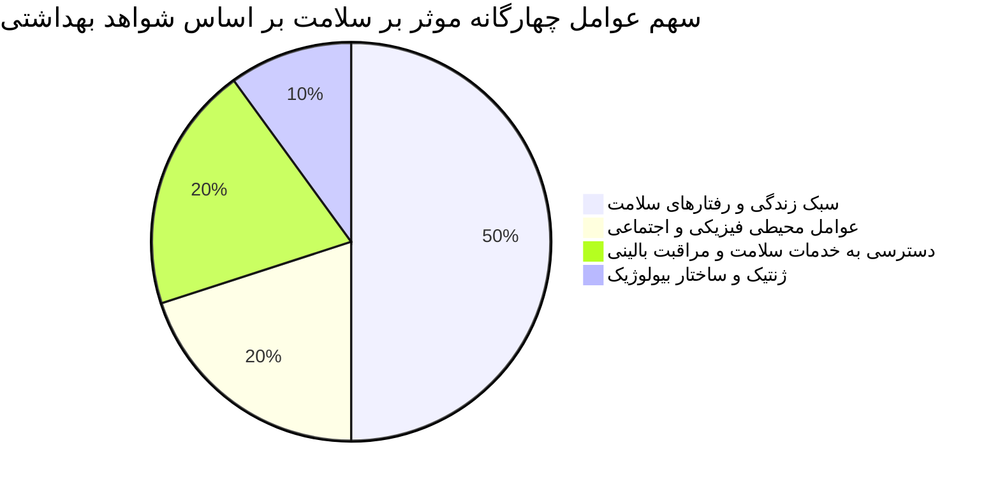
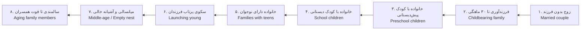
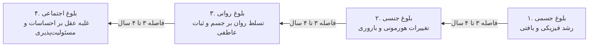
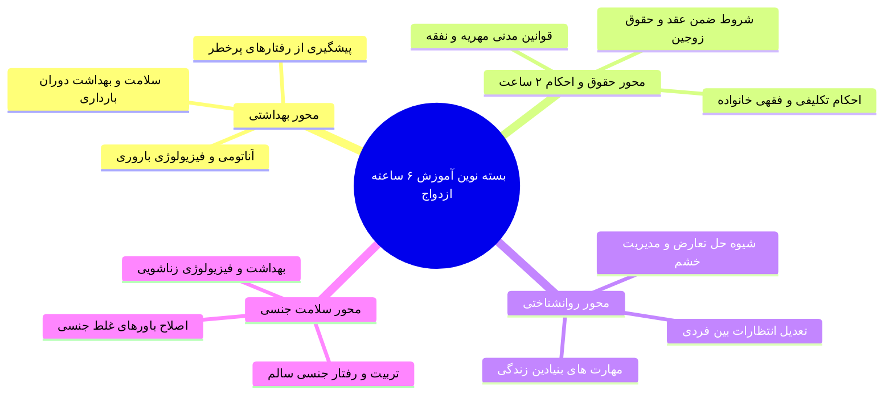
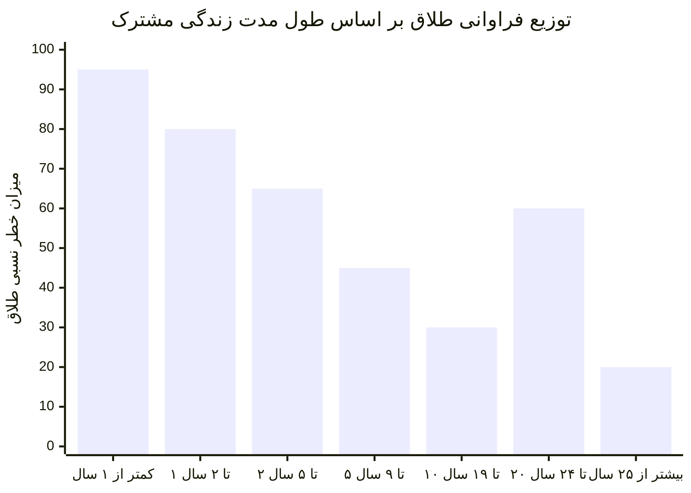
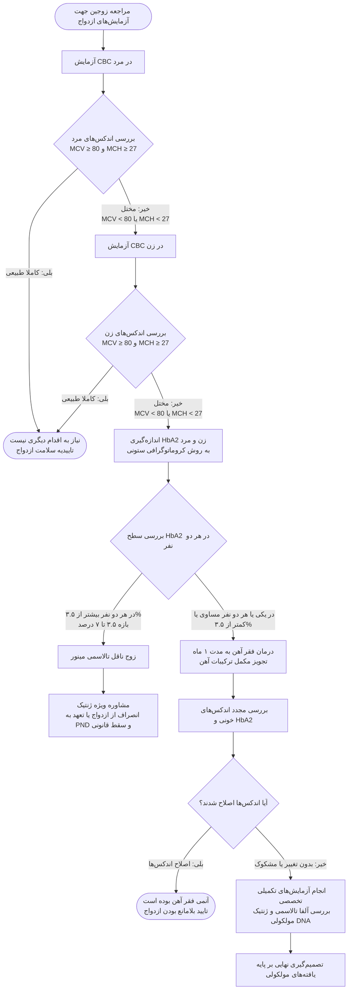

# کلیات بهداشت خانواده و مشاوره پیش از ازدواج

---

## فصل اول: مبانی سلامت خانواده، تعیین‌کننده‌های اجتماعی و تعامل با بیماری

### ۱. مفهوم جامع سلامت خانواده و جایگاه آن در جامعه
سلامت خانواده وضعیتی پویا، چندبعدی و فراتر از حاصل‌جمع ساده سلامت تک‌تک اعضای آن است. در واقع وقتی از سلامت خانواده صحبت می‌کنیم، علاوه بر تندرستی جسمی، روانی، اجتماعی و معنوی تک‌تک افراد در سنین مختلف، *کیفیت تعاملات درون‌گروهی* و *نحوه ارتباط خانواده با محیط پیرامونی* (فیزیکی، زیستی و انسانی) را هم مدنظر قرار می‌دهیم. خانواده مثل یک ارگانیسم زنده عمل می‌کند؛ بنابراین رابطه‌ای دوسویه میان سطح فردی و سازمانی آن برقرار است: سلامت تک‌تک اعضا بر کارکرد خانواده تأثیر می‌گذارد و سلامت کلی خانواده نیز بر تندرستی هر عضو سایه می‌افکند. به همین دلیل در بهداشت عمومی، سلامت خانواده **پل ارتباطی میان سلامت فردی و سلامت کل جامعه** شناخته می‌شود و هرگونه تزلزل در آن، به افت مستقیم سلامت جامعه می‌انجامد.

> [!info] تعریف مفهومی سلامت خانواده
> سلامت خانواده حالتی از تعامل مثبت و سازنده میان اعضای خانواده است که تک‌تک آن‌ها را قادر می‌سازد در تمام موقعیت‌ها، سنین و مراحل مختلف زندگی (از نوزادی و کودکی تا بارداری، میانسالی و سالمندی) به سطوح مطلوب سلامت جسمی، روانی، اجتماعی و معنوی دست یابند.

### ۲. تعیین‌کننده‌های اجتماعی سلامت (SDOH) و وزن مؤلفه‌ها
سلامت ما پیش از آنکه درون مطب‌ها و بیمارستان‌ها رقم بخورد، در محیط‌هایی شکل می‌گیرد که در آن‌ها متولد می‌شویم، زندگی می‌کنیم، درس می‌خوانیم، کار می‌کنیم، تفریح می‌کنیم و پیر می‌شویم. این بسترها همان **تعیین‌کننده‌های اجتماعی سلامت** (Social Determinants of Health یا SDOH) هستند. بر اساس مطالعات بیست سال گذشته، بخش اعظم ۱۰ علت نخست مرگ‌ومیر در جهان ناشی از عوامل اجتماعی قابل‌پیشگیری و سبک زندگی است. محیط اجتماعی-فرهنگی سازنده اصلی شیوه زندگی افراد است؛ تا جایی که سهم انتخاب و اراده فردی در برابر بستر اجتماعی رنگ می‌بازد.

> [!tip] تله تستی در مورد وزن تعیین‌کننده‌ها
> در الگوهای جامع تعیین‌کننده‌های سلامت، **سبک زندگی فردی** ۵۰ درصد از سلامت را شکل می‌دهد، در حالی که عوامل محیطی ۲۰ درصد، دسترسی به خدمات سلامت ۲۰ درصد و ژنتیک ۱۰ درصد وزن دارند. در دسته‌بندی دیگری از مدل‌های تعیین‌کننده، عوامل اجتماعی-اقتصادی ۴۰ درصد، رفتارهای سلامت ۳۰ درصد، خدمات سلامت ۲۰ درصد و محیط فیزیکی ۱۰ درصد لحاظ می‌شوند. نکته مشترک و امتحانی هر دو دیدگاه این است که ژنتیک اگرچه غیرقابل تغییر است، اما بار خطرات ژنتیکی در بیماری‌های مزمن (مانند آسم، دیابت، بیماری‌های قلبی و سرطان‌ها) با اصلاح سبک زندگی در خانواده به‌شدت کاهش می‌یابد.

### ۳. اثر متقابل خانواده و بیماری: سازوکارهای آسیب و التیام
ارتباط خانواده با سلامت در اشتراک ژن‌ها، عادات غذایی، رفتارهای حرکتی، فرهنگ، قومیت، مذهب، حمایت اجتماعی و حتی سطح استرس نهفته است. این رابطه به شدت دوطرفه و پیچیده است:
1. **تأثیر خانواده بر سلامت اعضا:** خانواده بستر نخست الگوبرداری از *رفتار بیماری* (Illness behavior) است. کودک با مشاهده رفتارهای والدین، عاداتی نظیر *خوددرمانی*، استفاده از طب سنتی و مکمل، یا پایبندی به دستورات پزشک را درونی می‌کند. همچنین اگر خانواده دچار اختلال عملکرد (Dysfunctional) باشد، کودک ممکن است در معرض غفلت، آزار جسمی، آزار کلامی یا جنسی قرار گیرد که پیامدهای روانی جبران‌ناپذیری دارد. از سویی، پیوستن خانواده به شبکه‌های حمایتی اجتماعی به ارتقای روانی کمک می‌کند؛ در حالی که افراط در استفاده از فضای مجازی باعث دور شدن اعضا از یکدیگر و انزوای خانوادگی می‌شود.
2. **اثر بیماری بر ساختار و عملکرد خانواده:** ابتلای یکی از والدین یا اعضا به بیماری‌های مزمن، فشار اقتصادی سنگینی تحمیل کرده و موجب فرسایش روانی خانواده می‌گردد. در این میان پدیده‌ای به نام **تغییر نقش** (Role changes) رخ می‌دهد؛ برای نمونه فرزندی ممکن است نقش والدگری را برای پدر یا مادر ناتوان به عهده بگیرد و از تحصیل و رشد بازبماند. بیماری‌هایی نظیر آلزایمر، معلولیت‌های شدید و اختلالات روان‌پزشکی استرس عظیمی به همراه دارند. علاوه بر این، بیماری‌های دارای **استیگما و ننگ اجتماعی** موجب طرد خانواده از سوی اطرافیان و دوستان شده و زمینه انزوای کامل اجتماعی را فراهم می‌آورند. در مقابل، حضور فعال و همدلانه خانواده می‌تواند دوره درمان بیمار را کوتاه کرده و حتی روابط خانوادگی را مستحکم‌تر سازد.

---

## فصل دوم: پویایی‌شناسی و تکامل خانواده (ساختارها، کارکردها و چرخه رشد)

### ۱. تعاریف و الگوهای ساختاری خانواده
تعریف خانواده وابسته به بافت حقوقی و فرهنگی جوامع است. در نگاه زیستی-جامعه‌شناختی، خانواده گروهی متشکل از دو یا چند نفر است که با پیوندهای خونی، ازدواج یا فرزندخواندگی در یک خانه زندگی کرده و در هزینه‌ها مشترک هستند. در برخی کشورهای غربی الگوهای غیررسمی مانند هم‌خانگی بدون تعهد قانونی (Cohabited) یا زوج‌های هم‌جنس (Lesbian/Gay) را در زمره ساختارهای خانواده قلمداد کرده‌اند که در حقوق ایران به رسمیت شناخته نمی‌شوند.

> [!info] تعریف خانواده در مبانی اسلامی
> در دیدگاه اسلامی، خانواده بنیادی‌ترین هسته اجتماعی و نهادی دارای شخصیت مدنی، حقوقی و معنوی است که نقطه آغازین آن **عقد نکاح مشروع** میان زن و مرد است. این پیوند تکالیف و نقش‌های نوین، روابط حقوقی متقابل (نظیر نفقه و احکام ارث) و پیوندهای عاطفی و اخلاقی برقرار می‌سازد که هدف آن پرورش فضایل اخلاقی، تربیت نسل و آماده‌سازی انسان برای ورود به جامعه بزرگتر است.

| ساختار خانواده | اعضای تشکیل‌دهنده | نقاط قوت و فرصت‌ها | چالش‌ها و آسیب‌پذیری‌ها |
| :--- | :--- | :--- | :--- |
| **هسته‌ای (Nuclear)** | پدر، مادر و فرزندان | سازگاری با مدرنیته، استقلال در تصمیم‌گیری، تمرکز بر پیشرفت فرزندان | تجربیات و یادگیری‌های بین‌نسلی محدودتر، وابستگی شدید به والدین، محدود شدن نقش‌ها |
| **گسترده (Extended)** | والدین، فرزندان، پدربزرگ، مادربزرگ و سایر بستگان | شبکه حمایتی قوی، یادگیری بالا از تجارب بزرگترها، اقتصاد اشتراکی در روستاها | سرایت بحران فردی به کل اعضا، دخالت‌های بین‌فردی زیاد، اصطکاک فرهنگی |
| **تک‌والدی (Single parent)** | یک والد همراه با فرزند یا فرزندان | تمرکز بالای والد بر رفع نیازهای فرزند، استقلال شخصیتی زودهنگام | فشار روانی مضاعف بر والد، احتمال وابستگی مفرط عاطفی، کمبود نقش مکمل والد غایب |

### ۲. کارکردهای پنج‌گانه حیاتی خانواده و نشانه‌های خانواده سالم
یک خانواده پویا برای جلوگیری از تبدیل شدن به نهادی ناکارآمد (Dysfunctional)، باید پنج وظیفه بنیادی را ایفا کند:
1. **ایجاد محبت و ارتباط عاطفی پایدار (Companionship):** مبنای تشکیل زندگی که به ازدواج با عشق تعبیر می‌شود. وجود صمیمیت عمیق سبب مقاومت بسیار بالای خانواده در مواجهه با بلایای طبیعی، بیماری و بحران‌های مالی می‌گردد.
2. **تولید مثل و باروری (Reproduction):** تداوم نسل جامعه. در صورت وجود مشکلات بیولوژیک، روش‌های کمک‌باروری (ART) یا فرزندخواندگی خلأ این کارکرد را جبران می‌نمایند.
3. **تربیت و عملکرد جنسی (Sexual function):** آشناسازی صحیح کودک با تفاوت‌ها و هویت جنسی متناسب با جنسیت زیستی از دوران دبستان، بسترساز سلامت جنسی پایدار در بزرگسالی است.
4. **جامعه‌پذیری و اجتماعی شدن فرزندان (Socialization):** آماده‌سازی فرزند برای حضور در اجتماع، تمرین مسئولیت‌پذیری و آموختن حل تعارضات در فضایی ایمن.
5. **حمایت اجتماعی و همکاری اقتصادی (Economic & Social support):** ایجاد شبکه ایمنی در بحران‌ها و یادگیری مدیریت مالی، تعادل دخل و خرج و پس‌انداز توسط اعضا در کانون خانه.

> [!important] شش شاخصه و نشانه کلیدی یک خانواده سالم
> بر اساس اصول بهداشت روان، خانواده‌های سالم دارای ۶ ویژگی مشخص هستند:
> 1. حفظ یک پایه معنوی پایدار
> 2. در اولویت اول قرار دادن خانواده در تمام برنامه‌ریزی‌ها
> 3. جریان دوجانبه احترام گذاشتن و احترام دریافت کردن
> 4. مهارت بالا در ارتباط کلامی و گوش دادن فعال
> 5. ارزش قائل شدن برای خدمت به دیگران و جامعه
> 6. داشتن روحیه پذیرش متقابل در کنار انتظارات واقع‌بینانه

### ۳. مراحل هشت‌گانه چرخه زندگی بر اساس «تئوری توسعه خانواده»
تئوری توسعه خانواده (Family Development Theory) بیان می‌کند که خانواده در طول حیات خود مراحلی پیوسته و تحولی را پشت سر می‌گذارد که هر یک دارای وظایف تکاملی (Developmental tasks) ویژه‌ای هستند:

1. **زوج بدون فرزند (Married couple without children):** وظیفه اصلی تنظیم نحوه زندگی مشترک دوطرفه، بازتعریف روابط با خانواده‌های پدری و شبکه‌های اجتماعی برای پذیرش شریک زندگی است.
2. **خانواده در مرحله فرزندآوری (Childbearing families):** با حضور فرزند ارشد از بدو تولد تا ۳۰ ماهگی مشخص می‌شود. انطباق ساختار خانه با نیازهای نوزاد، تثبیت نقش مادری/پدری و تنظیم نقش با بستگان گسترده در این مرحله قرار دارد.
3. **خانواده با کودکان پیش‌دبستانی (Preschool children):** جامعه‌پذیری اولیه، راهنمایی و تربیت کودک و بازنگری نقش‌های والدگری با اضافه شدن فرزندان بعدی.
4. **خانواده با فرزندان سنین مدرسه (School-age children):** هدایت تحصیلی و تربیتی کودک با همکاری نهادهای بیرونی مدرسه و برنامه‌های فوق‌برنامه.
5. **خانواده دارای فرزند نوجوان (Families with adolescents):** تنظیم رابطه والد-فرزندی جهت اعطای استقلال به نوجوان در چارچوب مرزهای امن، و هم‌زمان رسیدگی والدین به تعارضات شغلی و رابطه زناشویی در آستانه میانسالی.
6. **خانواده در حال پرتاب فرزندان (Launching young):** از زمان استقلال و خروج اولین تا آخرین فرزند از منزل. وظیفه محوری شامل شکل‌دهی ارتباط بالغ-بالغ با فرزندان، حل مسائل میانسالی و آغاز مراقبت از والدین سالمند است.
7. **خانواده‌های میانسال (Middle-age families):** از دوران آشیانه خالی (Empty nest) تا بازنشستگی. سازگاری مجدد با خلوت شدن خانه و مراقبت پیگیر از والدین کهنسال.
8. **خانواده‌های سالمند (Aging families):** از زمان بازنشستگی تا فوت هر دو همسر. پذیرش نقش‌های تازه (مانند پدربزرگ/مادربزرگ شدن)، مواجهه با ناتوانی‌های جسمی ناشی از سن، و کنار آمدن با داغدیدگی ناشی از دست دادن همسر.

> [!warning] اصول تحلیلی و امتحانی تئوری توسعه خانواده
> * عواملی نظیر *بیماری‌های صعب‌العلاج*، *استرس‌های شدید*، *بحران‌های مالی* و *مرگ ناگهانی* چرخه توسعه را مختل می‌سازند.
> * سن شناسنامه‌ای افراد در ورود به مراحل نقشی ندارد (مانند تفاوت فرزندآوری در ۱۸ سالگی با ۴۱ سالگی).
> * **نکته طلایی:** چنانچه مهارتی در یکی از مراحل تکاملی آموخته نشود، به هیچ وجه به معنای بن‌بست نیست؛ بلکه اعضای خانواده می‌توانند آن مهارت‌ها را در مراحل بعدی جبران کرده و فرا بگیرند.
> * رشد کل سیستم خانواده همواره بر رشد مجزای هر یک از اعضا اولویت و ارجحیت دارد.

---

## فصل سوم: الگوهای مدیریت نظام سلامت و جایگاه خدمات خانواده

### ۱. مقایسه جامع دو نظام مدیریتی سلامت در دنیا
نظام‌های سلامت در سراسر جهان خدمات خود را با دو رویکرد کاملاً متمایز عرضه می‌کنند که آگاهی از ویژگی‌ها و نقاط ضعف هر یک، ضرورت پیاده‌سازی برنامه پزشک خانواده را آشکار می‌سازد:

| مؤلفه ارزیابی | سیستم تعاون همگانی (Market/Free choice) | سیستم پزشک خانواده و نظام ارجاع (Referral system) |
| :--- | :--- | :--- |
| **آزادی عمل بیمار** | مراجعه مستقیم به هر سطح از مراکز تشخیصی/درمانی دلخواه | الزام به عبور منظم از سطوح مراقبت و رجوع به پزشک منتخب |
| **شناخت پزشک از بیمار** | شناخت ناپیوسته، مقطعی و فاقد پرونده جامع سلامت | شناخت مستمر، عمیق و چندبعدی از خانواده و زمینه اجتماعی |
| **مصرف دارو و پاراکلینیک** | مصرف القایی و خودسرانه دارو، تکرار آزمایش‌ها و اتلاف منابع | تجویز منطقی دارو و خدمات بر اساس گایدلاین‌های مشخص |
| **تخصیص منابع و کارایی** | هدررفت امکانات پیشرفته برای بیماری‌های ساده و برعکس | توزیع هوشمندانه بر اساس سطح ریسک و اولویت بالینی |
| **پیگیری و ثبت سوابق** | عدم امکان پیگیری بالینی سیستماتیک به علت سرگردانی بیمار | ثبت دقیق الکترونیک سوابق و پیگیری فعال توسط تیم سلامت |
| **مزایای اختصاصی سیستم** | استقلال شغلی کادر درمان و عدم نیاز به بسترسازی فرهنگی | پوشش عادلانه، مقرون‌به‌صرفه و کاهش چشمگیر هزینه‌های کمرشکن |

### ۲. رسالت و برنامه‌های پنج‌گانه واحد سلامت خانواده وزارت بهداشت
رسالت غایی واحد سلامت خانواده، جمعیت و مدارس در نظام بهداشت و درمان، تأمین دسترسی عادلانه، ارتقای کیفیت زندگی و حفظ سلامت اقشار مختلف مبتنی بر گروه‌های سنی هدف است. ساختار این برنامه‌ها شامل ۵ حوزه تخصصی و یکپارچه است:
1. **گروه سلامت کودکان و نوزادان:** متولی برنامه ترویج تغذیه با شیر مادر، مراقبت‌های ادغام‌یافته ناخوشی‌های اطفال (مانا - IMCI)، مراقبت مستمر کودک سالم، برنامه‌های غربالگری تکامل کودکان، و نظام مراقبت و ثبت موارد مرگ کودکان ۱ تا ۵۹ ماهه.
2. **گروه سلامت نوجوانان، جوانان و مدارس:** تمرکز بر آموزش‌های بهداشت بلوغ، رفتارهای پرخطر، غربالگری‌های دوره‌ای مدارس و مشاوره رشد.
3. **گروه سلامت مادران:** پوشش جامع مراقبت‌های سه‌گانه دوران بارداری (پیش از بارداری، حین زایمان و دوران پس از زایمان) به همراه ترویج تغذیه شیردهی.
4. **گروه باروری سالم و جمعیت:** ارائه خدمات سلامت، آموزش‌های تحکیم باروری و مراقبت‌های پیشگیرانه ویژه زنان در سنین باروری در تمامی شرایط به‌جز وضعیت بارداری.
5. **گروه سلامت میانسالان و سالمندان:** اجرای غربالگری‌های بیماری‌های مزمن (دیابت، پرفشاری خون، سرطان‌ها)، مراقبت‌های شناختی و بهبود توانمندی دوره سالمندی.

---

## فصل چهارم: مشاوره پیش از ازدواج و مهارت‌های آمادگی زوجین

### ۱. زمان‌بندی طلایی، فلسفه و مفهوم «درمان‌گرایانه» مشاوره
بسیاری از زوج‌ها ماه‌ها وقت و مبالغ هنگفتی را صرف جزئیات جشن ازدواج می‌کنند، اما برای سال‌های متمادی زندگی مشترک آینده هیچ برنامه مدونی ندارند. مشاوره پیش از ازدواج تضمینی برای ایجاد یک رابطه غنی، صمیمی و پایدار است.

> [!important] زمان‌بندی طلایی برای انجام مشاوره
> زمان ایده‌آل مشاوره پیش از ازدواج، در همان مرحله ابتدایی آشنایی، **پیش از شکل‌گیری الگو و وابستگی عمیق عاطفی** و صرفاً به شرط تمایل متقابل دو طرف برای بررسی یکدیگر به عنوان شریک زندگی است. شکل‌گیری احساسات عمیق زودهنگام سبب خطای شناختی و نادیده گرفتن تعارض‌های بزرگ می‌شود. همچنین جوانان می‌توانند پیش از انتخاب فردی مشخص، برای ارزیابی میزان انطباق‌پذیری و مسئولیت‌پذیری به شکل انفرادی به مشاور مراجعه کنند.

> [!info] چرا به مشاوره پیش از ازدواج «درمان» گفته می‌شود؟
> مقصود از درمان در اینجا تجویزهای دارویی نیست؛ بلکه فرآیند فعال *تشخیص و کشف ناهماهنگی‌ها*، شناسایی شرایط نامساعد برای همزیستی، و درمان و اصلاح تفکرات غیرواقع‌بینانه‌ای است که در صورت ورود به زندگی مشترک سبب فروپاشی رابطه خواهند شد.

### ۲. شروط سه‌گانه آمادگی روانشناختی و مراتب بلوغ
از نظر روانشناسی بالینی، فرد زمانی صلاحیت قانونی و روانی ورود به زندگی زناشویی را دارد که واجد سه مؤلفه بنیادین باشد:
1. رسیدن به بلوغ کامل (به ویژه بلوغ اجتماعی)
2. داشتن انگیزه کافی و درونی برای تشکیل خانواده
3. مجهز بودن به اطلاعات و مهارت‌های لازم پیرامون واقعیت‌های ازدواج

* فاصله زمانی میان هر یک از مراتب بلوغ معمولاً **۳ تا ۴ سال** است.
* نشانه‌های نهایی بلوغ اجتماعی عبارتند از: احساس مسئولیت عمیق در قبال دیگران، تسلط کامل عقل و منطق بر هیجانات زودگذر، و گرایش بالغانه به پیوند پایدار.
* قرار گرفتن در شرایط سخت محیطی و بحران‌ها (نظیر جنگ و فشارهای اجتماعی) رسیدن به بلوغ اجتماعی را تسریع می‌کند؛ در حالی که رفاه افراطی و شرایط بدون چالش این فرایند را به تأخیر می‌اندازد.

### ۳. محورهای تخصصی ارزیابی در اتاق مشاوره
در فرآیند مشاوره، طرفین باید به درک شفافی از واقعیت‌های یکدیگر دست یابند:
* **شبکه‌های ارتباطی و اجتماعی:** سنجش میزان برون‌گرایی، بزرگی شبکه ارتباطی خانواده‌ها و هماهنگی در میزان معاشرت‌های خانوادگی.
* **وضعیت و استقلال مالی:** شفاف‌سازی سطح درآمد، وابستگی یا عدم وابستگی به منابع مالی پدری و نحوه مشارکت در مخارج خانه.
* **نقشه ذهنی باورها و ارزش‌ها:** باورهای مذهبی، اخلاقی و جهان‌بینی سرمنشأ تمام رفتارها هستند؛ زاویه دید متفاوت در این حیطه با گذشت زمان عمیق‌تر و بحران‌سازتر می‌شود.
* **انطباق نقش‌ها (Role compatibility):** سنجش میزان توانایی برای گذار از نقش فرزندی به مسئولیت‌های جدی نقش همسری.
* **مهرورزی و رابطه جنسی:** بررسی نگرش‌ها پیرامون حد و مرز صمیمیت، توافقات پیرامون زمان فرزندآوری و ارتباط با خانواده پیشین.
* **سبک حل تعارض و تصمیم‌گیری:** آیا تصمیمات به شکل فردی اتخاذ می‌شوند یا مشترک؟ واکنش فرد در هنگام خشم چیست و طرف مقابل چقدر توان تحمل آن را دارد؟
* **مدیریت انتظارات و خطاهای شناختی:** پالایش تصورات فانتزی و مبالغه‌آمیز (نظیر فداکاری یا مهربانی نامحدود) و تعدیل آن‌ها به سطح واقعی زندگی روزمره.

### ۴. ساختار نوین آموزش‌های حین ازدواج
کلاس‌های پیش از ثبت رسمی ازدواج در گذشته صرفاً ۲ ساعت بود که به دلیل بی‌علاقگی زوجین و اثربخشی اندک دگرگون شد. دستورالعمل نوین کشوری شامل **دوره‌های ۶ ساعته در ۴ محور تخصصی** است:

---

## فصل پنجم: اپیدمیولوژی ازدواج و تحلیل بحران طلاق در ایران

### ۱. شاخص‌های آماری طلاق و پراکندگی جغرافیایی
بر اساس آمارهای ثبت احوال و جمعیت‌شناختی:
* ۹۷ درصد بزرگسالان جهان در طول عمر حداقل یک‌بار ازدواج را تجربه می‌کنند و این نرخ در سطح جهانی طی ۱۵ سال اخیر پایدار بوده است؛ با این حال نرخ ازدواج در ایران طی دو دهه گذشته سیر نزولی داشته است.
* در بازه ۹ ماهه سال ۱۳۹۵، نسبت کشوری **یک طلاق به ازای هر ۳٫۹ ازدواج** ثبت شده که در سال ۱۳۹۶ این نسبت بحرانی‌تر شده و به کمتر از ۳ ازدواج به ازای هر واقعه طلاق رسیده است.
* **بیشترین نرخ طلاق استانی:** استان‌های تهران، البرز و قم با حدود **یک طلاق به ازای هر ۲ ازدواج** قرار دارند (مهاجرپذیری بالا از عوامل مهم آمار بالای تهران است).
* **کمترین نرخ طلاق استانی:** استان سیستان و بلوچستان با **یک طلاق به ازای هر ۱۷ ازدواج**.

### ۲. سال‌های بحرانی زندگی مشترک و متغیرهای جمعیتی
تحلیل مقاطع زمانی جدایی زوجین دو قله بارز را در طول حیات زناشویی نشان می‌دهد:

> [!warning] دو مقطع زمانی پرخطر طلاق در ایران
> 1. **۵ سال نخست زندگی (به‌ویژه سال اول - سال عسل):** ۵۰ درصد کل طلاق‌های کشور در ۵ سال نخست رخ می‌دهد و **بیشترین آمار متعلق به سال اول ازدواج است!** دلیل اصلی شکست در سال اول، نه مسائل مالی و پیچیدگی‌های اجتماعی، بلکه **عدم شناخت کافی زوجین از یکدیگر** است که اهمیت حیاتی مشاوره پیش از ازدواج را اثبات می‌کند.
> 2. **قله ثانویه (سال‌های ۲۰ تا ۲۴ زندگی):** پس از سال‌ها کاهش طلاق، ناگهان در دهه دوم و سوم زندگی مشترک آمار طلاق بالا می‌رود. جامعه‌شناسان علت آن را پدیده *انتقال جمعیتی*، *تغییر هنجارها و نظام ارزش‌های بین‌نسلی* و عبور فرزندان از سنین حساس می‌دانند.

> [!important] الگوهای سنی مهم در احتمال وقوع طلاق
> * **هم‌سن بودن زوجین:** بالاترین میزان طلاق در کشور مربوط به زوج‌هایی است که هیچ اختلاف سنی با یکدیگر ندارند (تفاوت سنی صفر).
> * **بزرگتر بودن مرد از زن:** از نظر آماری با پایین‌ترین نرخ طلاق همراه است.
> * **بزرگتر بودن زن از مرد:** شیب آماری وقوع طلاق را به صورت معنادار بالا می‌برد.
> * **بیشترین ترکیب سنی ازدواج‌های ثبت‌شده (سال ۱۳۹۴):** پیوند میان *مردان ۲۰ تا ۲۴ ساله* با *زنان ۱۵ تا ۱۹ ساله* با رقمی بالغ بر ۱۰۲ هزار واقعه (حدود ۱۰۸ هزار مورد در آمارهای تفصیلی)، بالاترین سهم ترکیب جمعیتی را داشته است.

---

## فصل ششم: غربالگری‌های پاراکلینیکی و پروتکل‌های مراقبت سلامت

### ۱. ارزیابی‌های سرولوژیک، ایمن‌سازی و مشاوره ژنتیک
خدمات غربالگری بالینی مستقر در مراکز خدمات جامع سلامت شامل سبد مراقبتی دقیقی به شرح زیر است:
1. **تست سرولوژیک VDRL:** آزمایش اختصاصی جهت شناسایی بیماری سیفلیس. اهمیت این تست به این دلیل است که وجود سیفلیس به عنوان شاخص و مارکر همراهی با سایر عفونت‌های منتقله از راه جنسی (STIs) به‌ویژه HIV تلقی می‌شود.
2. **تست اعتیاد:** سنجش سریع از طریق نمونه ادرار جهت احراز عدم سوءمصرف مواد.
3. **ایمن‌سازی بانوان علیه کزاز:** در راستای برنامه ریشه‌کنی کزاز نوزادی؛ در صورت عدم واکسیناسیون قبلی یا گذشت بیش از ۱۰ سال از آخرین نوبت یادآور، تزریق واکسن کزاز الزامی است.
4. **بررسی ایمنی علیه سرخجه:** بررسی سابقه واکسیناسیون یا سطح آنتی‌بادی سرمی در زن؛ در صورت فقدان ایمنی، تزریق واکسن سرخجه جهت پیشگیری از سندرم سرخجه مادرزادی (CRS) و مخاطرات جنینی انجام می‌پذیرد.
5. **مشاوره ژنتیک فراگیر:** در گذشته مشاوره ژنتیک تنها به زوج‌های دارای سابقه ناهنجاری‌های کروموزومی، بیماری‌های ارثی خانوادگی، سقط مکرر یا فرزند معلول محدود بود؛ اما بر اساس دستورالعمل نوین وزارت بهداشت، **انجام غربالگری و مشاوره ژنتیک برای تمامی زوجین پیش از ازدواج الزامی است**.

### ۲. الگوریتم کشوری غربالگری بتا تالاسمی ماژور (مصوب ۱۳۷۲)
شایع‌ترین اختلال تک‌ژنی در کشور تالاسمی است. از سال ۱۳۷۲ برنامه غربالگری کشوری پایه‌ریزی شد. این برنامه به عنوان مناسب‌ترین، ارزان‌ترین و اثربخش‌ترین استراتژی بهداشتی شناخته می‌شود؛ چرا که نیاز به فراخوان عمومی ندارد و به دلیل الزام قانونی ثبت ازدواج، پوشش ۱۰۰ درصدی جامعه هدف را ممکن می‌سازد.

> [!tip] نکات ریز و تست‌خیز الگوریتم تالاسمی
> 1. در گام اول **همیشه آزمایش CBC از مرد آغاز می‌شود**؛ در صورتی که مرد فاقد اختلال باشد، حتی اگر زن ناقل مینور باشد هیچ فرزندی مبتلا به ماژور نخواهد شد و پرونده بدون نیاز به آزمایش زن مختومه می‌گردد.
> 2. مرز خط‌کش تشخیصی برای کم‌خونی میکروسیتیک هایپوکرومیک: **MCV کمتر از 80** و **MCH کمتر از 27** است.
> 3. روش استاندارد اندازه‌گیری هموگلوبین A2 در برنامه کشوری، **کروماتوگرافی ستونی** است.
> 4. اگر HbA2 در هر دو نفر **بیشتر از ۳٫۵ درصد** (تا سقف ۷ درصد) باشد، زوج ناقل قطعی بتا تالاسمی شناخته شده و به «مشاوره ویژه» هدایت می‌شوند.
> 5. اگر سطح HbA2 در یکی یا هر دو **کمتر یا مساوی ۳٫۵ درصد** باشد، احتمال مداخله فقر آهن هم‌زمان مطرح است؛ لذا بیمار ۱ ماه تحت درمان با قرص آهن قرار گرفته و مجدداً اندکس‌ها ارزیابی می‌شوند. در صورت عدم اصلاح، ارزیابی جهش‌های ژنی به وسیله *تکنیک‌های بررسی مولکولی DNA* جهت رد آلفا تالاسمی ضرورت می‌یابد.

---

## جمع‌بندی نهایی و نکات مرور سریع

> [!abstract] کلیدی‌ترین نکات در یک نگاه
> * **سلامت خانواده:** مفهومی کل‌نگر و پیونددهنده سلامت فردی به سلامت جامعه، با تمرکز بر تعاملات درون‌گروهی و تعامل با محیط انسانی، زیستی و فیزیکی.
> * **سهم سبک زندگی:** ۵۰ درصد تعیین‌کننده‌های تندرستی مستقیماً به سبک زندگی بازمی‌گردد که شاکله آن در کانون خانواده پایه‌ریزی می‌شود.
> * **تئوری توسعه خانواده:** متشکل از ۸ مرحله با وظایف رشدی مشخص؛ مهارت‌های از دست رفته یک دوره، در دوره‌های بعدی قابل جبران و یادگیری است.
> * **پزشک خانواده:** نظام ارجاع از اتلاف منابع تشخیصی، درمان‌های تکراری و مصرف بی‌رویه دارو جلوگیری کرده و مراقبت مستمر ارائه می‌دهد.
> * **نقاط اوج طلاق در ایران:** قله نخست در سال اول عقد و زندگی مشترک (به علت فقر شناخت) و قله دوم در ۲۰ تا ۲۴ سالگی ازدواج (به دلیل گذار جمعیتی) است.
> * **غربالگری تالاسمی:** ساده‌ترین روش، آزمایش CBC مرد در ابتدای امر است. شرط ارجاع به مشاوره ویژه، اختلال توأم اندکس‌ها و افزایش HbA2 بالای ۳٫۵ درصد در هر دو زوج است.
