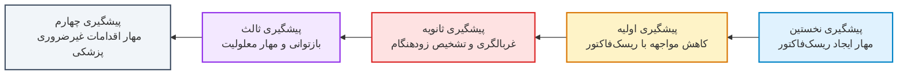
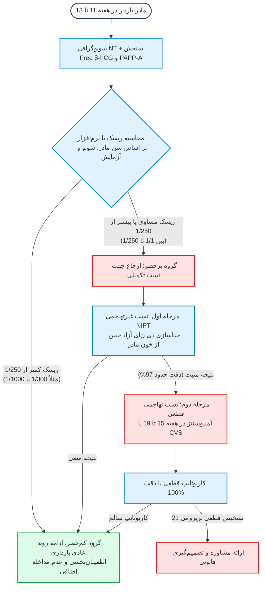
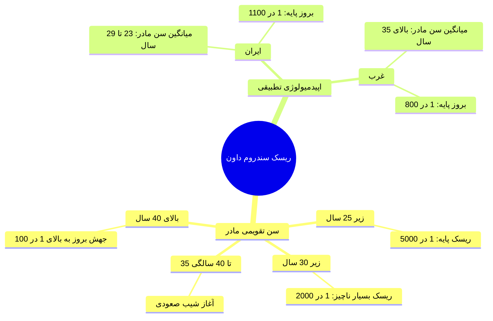
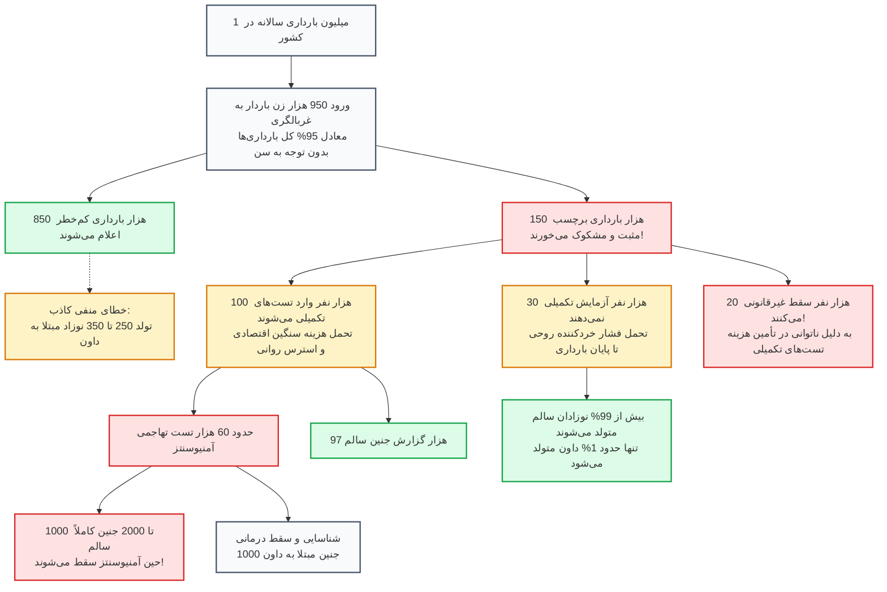
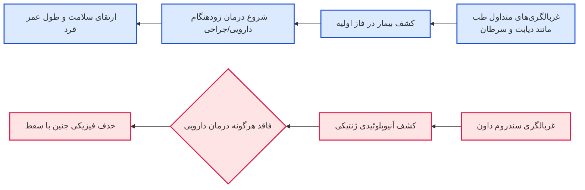
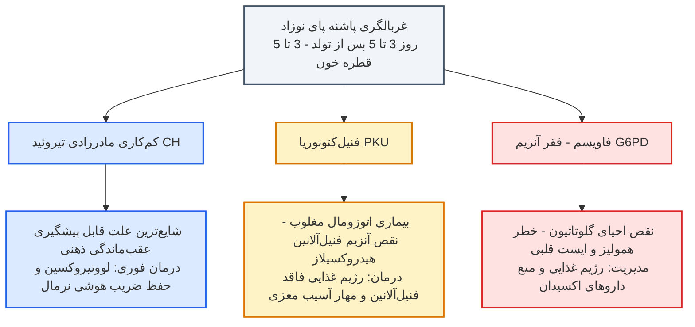

# سطوح پیشگیری و نظام غربالگری (مادران و نوزادان)

## بخش ۱: مبانی اپیدمیولوژی، سطوح پیشگیری و اصول غربالگری

برای تسلط بر مباحث پزشکی اجتماعی، ابتدا باید تمایز دقیق میان سطوح مختلف مواجهه، بروز بیماری و عوارض آن را درک کنیم. ساختار پیشگیری در بهداشت عمومی به پنج طبقه کاملاً متمایز تقسیم می‌شود که تسلط بر خط‌مرزهای آن‌ها از مهم‌ترین مباحث آزمونی است:

1. **سطح نخستین (Primordial Prevention):** تمرکز بنیادین این سطح، *جلوگیری از پیدایش عوامل خطر (Risk Factors)* در سطح جمعیت است؛ یعنی مداخله به‌گونه‌ای انجام می‌شود که اساساً رفتارهای پرخطر یا شرایط آسیب‌زا شکل نگیرند. برای مثال در مبحث دیابت، سیاست‌های مهار چاقی و بسترسازی برای عدم پیدایش اضافه وزن، ترویج تغذیه سالم در مدارس و منع اشاعه رفتارهای بی‌تحرک و مصرف دخانیات در این لایه تعریف می‌شوند.
2. **سطح اولیه (Primary Prevention):** در این لایه، *عامل خطر در فرد ایجاد شده است* (فرد چاق است، سیگار مصرف می‌کند یا رژیم پرچربی و پرکربوهیدرات دارد)، اما هنوز به بیماری تبدیل نشده است. هدف این سطح، کاهش شدید مواجهه، اصلاح سبک زندگی و کنترل ریسک‌فاکتور برای پیشگیری از استقرار قطعی پاتولوژی بیماری است.
3. **سطح ثانویه (Secondary Prevention):** بیماری استقرار یافته، فرد مرحله پیش‌دیابت را رد کرده و به دیابت مبتلا شده است، اما غالباً در فازهای ابتدایی بی‌علامت بوده و خود از بیماری بی‌اطلاع است. راهبرد اصلی در اینجا، **تشخیص زودهنگام و درمان بموقع (Early Diagnosis & Prompt Treatment)** با هدف توقف سیر بیماری و بهبود کیفیت و کمیت عمر است. **تست‌های غربالگری (Screening Tests)** دقیقاً در خط مقدم این سطح قرار دارند.
4. **سطح ثالث (Tertiary Prevention):** زمانی که بیماری تثبیت شده و بیمار تحت درمان قرار دارد، هدف مداخله جلوگیری از ناتوانی، کاهش عوارض پیش‌رونده و **بازتوانی (Rehabilitation)** است. در مثال دیابت، مراقبت وسواسی از زخم پای دیابتی، ویزیت‌های چشمی و کلیوی برای جلوگیری از رتینوپاتی، نفروپاتی و پیشگیری از *آمپوتاسیون (قطع عضو)* در این دسته قرار می‌گیرند.
5. **سطح چهارم (Quaternary Prevention):** راهبرد نوینی که هدف آن شناسایی بیماران در معرض خطر مداخلات پزشکی بیش‌ازحد، جلوگیری از طبابت‌های غیرضروری، مهار خطاهای پزشکی و اجتناب از اقدامات مازاد بالینی اعم از *اورپرکتیس (Over-practice)* و *مل‌ترکتیس (Malpractice)* است.

> [!tip] تعریف استاندارد برنامه غربالگری (Screening)
> برنامه‌ای حاکمیتی و مدون در بهداشت عمومی که با بهره‌گیری از آزمون‌های ساده، سریع، ارزان و با دقت قابل‌قبول، افراد به ظاهر سالم جامعه را ارزیابی کرده و موارد پنهان یا پرخطر بیماری را جهت اقدامات درمانی بموقع از دل جمعیت جدا می‌سازد.

### شروط بنیادین و ملاحظات حاکمیتی یک برنامه غربالگری
طبق متون مرجع سلامت عمومی (از جمله کتاب رفرنس آکسفورد)، برنامه‌های غربالگری برخلاف پژوهش‌های متداول، **به‌هیچ‌وجه مطالعات بالینی خنثی نیستند**؛ بلکه مداخلاتی کاملاً حاکمیتی با پیامدهای مستقیم اقتصادی-اجتماعی به‌شمار می‌روند که در صورت طراحی نادرست، حتی **پتانسیل ایجاد فقر، نابرابری و آسیب همگانی** را دارند. یک برنامه اسکرینینگ تنها در صورتی صلاحیت اجرا دارد که ارکان زیر را توأمان داشته باشد:
1. **دقت بالای آزمون (High Validity):** حساسیت و ویژگی تست باید در کات‌آف تعیین‌شده مطلوب باشد.
2. **عدم تحمیل هزینه قابل‌توجه به مردم:** تست باید ارزان یا رایگان در دسترس باشد و هزینه‌های تشخیص و درمان قطعی نیز تحت پوشش بیمه جامع قرار گیرد.
3. **عدم تحمیل آسیب و مورتالیته:** خود فرایند غربالگری نباید مرگ‌ومیر یا عوارض جانبی مازاد بر بار بیماری تولید کند.
4. **معطوف بودن به گروه‌های در معرض خطر (At-Risk Groups):** انجام غربالگری کور برای تمام آحاد جامعه ناممکن و مردود است. به عنوان مثال، غربالگری سرطان پستان با ماموگرافی در زنان ۲۰ تا ۳۵ ساله بی‌اثر است؛ زیرا بافت پستان در این سن متراکم بوده و اشعه ایکس ماموگرافی توان تفکیک ضایعه را ندارد (روش ارزیابی توده در زنان جوان‌تر سونوگرافی است نه ماموگرافی). همچنین غربالگری دیابت با تست‌های FBS و HbA1c صرفاً باید برای افراد میانسال (۵۰ تا ۵۵ سال) یا سنین پایین‌ترِ دارای سابقه خانوادگی مثبت و عوامل خطر توصیه شود، نه برای جوانان ۱۵ تا ۲۵ ساله سالم.
5. **تضمین ساختار تشخیصی و درمانی پسین:** نمی‌توان بیماران را غربال کرد اما امکانات ارجاع، متخصص، دارو و بیمارستان برای فالوآپ آن‌ها در سطح تمام استان‌ها و مناطق محروم مهیا نباشد.

> [!important] تمایز غربالگری (Screening) با بیماریابی (Case Finding)
> در **بیماریابی (Case Finding)**، بیمار شخصاً با احساس علامت بالینی (مثلاً لمس اتفاقی یک توده پستانی) به درمانگاه مراجعه می‌کند و پزشک پس از معاینه، آزمون‌های اختصاصی برای او درخواست می‌نماید. اما در **برنامه غربالگری (Screening Program)**، نظام سلامت به شکلی فعال و فراگیر، یک پروتکل تشخیصی را به تمام افراد واجد شرایط (Eligible) که بدون هرگونه علامت بالینی و به‌ظاهر سالم هستند، پیشنهاد می‌کند.

### دو ساحت ساختاری برنامه‌های غربالگری: فردی در برابر حاکمیتی
هر برنامه غربالگری دو وجه کاملاً مجزا دارد:
1. **ساحت فردی (عملکرد بالینی / Test Performance):** بعد فنی و تکنیکال که حیطه تصمیم‌گیری بالینی پزشک و آزمایشگاه است؛ نظیر تنظیم نقطه برش قند خون ناشتا (FBS = 126 mg/dL) یا تفسیر مارکرهای اختصاصی توسط متخصص بالینی جهت پیگیری وضعیت بیمار.
2. **ساحت کلان و حاکمیتی (هزینه‌ها، زیرساخت و سیاست‌گذاری):** بعدی مبتنی بر تحلیل‌های سلامت عمومی که مواردی چون ظرفیت تجهیزات پزشکی کشور (تعداد کلونوسکوپ‌ها به ازای جمعیت)، پوشش بیمه‌ای، دسترسی عادلانه در روستاها و شهرها، و از همه مهم‌تر **تحلیل فایده به هزینه (Cost-Benefit)** را ارزیابی می‌کند. بر اساس گایدلاین نظام سلامت انگلستان (NHS)، برنامه‌های غربالگری هیچ‌گاه به تمام جامعه منفعت نمی‌رسانند و خطاهای مثبت کاذب و منفی کاذب پتانسیل آسیب جدی به افراد سالم دارند؛ بنابراین اگر مانیتورینگ‌های ادواری نشان دهند عوارض منفی یا هزینه‌ها از فواید پیشی گرفته، برنامه حاکمیتی باید بدون درنگ محدود یا متوقف شود.

---

## بخش ۲: پروتکل غربالگری ناهنجاری‌های کروموزومی جنین در بارداری (Prenatal)

غربالگری دوران بارداری در ادبیات بهداشت عمومی به‌طور اختصاصی بر شناسایی سه آنیوپلوئیدی شایع کروموزومی تمرکز دارد: تریزومی ۱۳ (سندروم پاتو)، تریزومی ۱۸ (سندروم ادوارد) و تریزومی ۲۱ (سندروم داون). تریزومی‌های ۱۳ و ۱۸ به دلیل نقص‌های ساختاری شدید، عموماً قابلیت حیات ندارند و جنین در طول بارداری سقط شده، مرده متولد می‌شود یا در روزهای آغازین پس از تولد از بین می‌رود. از این رو، **تارگت اصلی و انحصاری غربالگری بارداری از جنبه امکان بقای درازمدت، سندروم داون (تریزومی ۲۱)** است.

### تقویم اجرایی و مؤلفه‌های تشخیصی
برنامه استاندارد بارداری شامل ارزیابی‌های بیوشیمیایی و سونوگرافیک در دو مقطع مجزای زمانی است:

1. **غربالگری سه ماهه اول (First Trimester - هفته ۱۱ تا ۱۳ بارداری):**
   * *سونوگرافی تخصص‌یافته نوکال ترانس‌لوسنسی (NT):* اندازه‌گیری ضخامت چین بافت زیرجلدی پشت گردن جنین توسط سونولوژیست.
   * *دابل مارکر خونی (Double Marker):* شامل سنجش سطوح سرمی PAPP-A (پروتئین A پلاسمایی مرتبط با بارداری) و ساب‌یونیت آزاد β-hCG (Free β-hCG).
1. **غربالگری سه ماهه دوم (Quadruple Marker - هفته ۱۵ به بعد):**
   * چنانچه مادری فرصت طلایی سه ماهه اول را از دست داده باشد، از تست چهارگانه کواد مارکر استفاده می‌شود که مؤلفه‌های آن عبارتند از:
     * *Alpha-Fetoprotein (AFP)*
     * *Human Chorionic Gonadotropin (hCG)*
     * *Unconjugated Estriol (uE3)*
     * *Inhibin-A*
1. **تحلیل ریسک رایانه‌ای:** داده‌های بیوشیمیایی، عدد NT و **سن تقویمی مادر** وارد نرم‌افزارهای استاندارد شده و در قالب یک کسر احتمال (مثلاً 1/250) گزارش می‌شود.

### روش‌های تکمیلی و تمایز آزمون‌های غیرتهاجمی و تهاجمی
* **تست غیرتهاجمی ژنتیکی قبل از تولد (NIPT / cffDNA):** از طریق خون‌گیری ساده از ورید مادر انجام می‌شود. پلاسمای خون سانتریفیوژ شده و قطعات دی‌ان‌ای آزاد جنینی که در گردش خون مادری شناور هستند جداسازی و بررسی ژنتیکی می‌شوند. با اینکه NIPT قدرت بالایی دارد، اما **حساسیت آن حدود 97% بوده و دقت 100% ندارد**؛ لذا جنبه تشخیصی قطعی نداشته و در صورت مثبت شدن، الزاماً باید با آزمایش تهاجمی تأیید گردد.
* **نمونه‌برداری از پرزهای کوریونی (CVS):** نمونه‌برداری بافتی از جفت جنین که تستی کاملاً تهاجمی است.
* **آمنیوسنتز (Amniocentesis):** در هفته‌های ۱۵ تا ۱۹ بارداری با هدایت سوزن بلند به داخل کیسه آمنیوتیک از طریق دیواره شکم انجام گرفته و سلول‌های ریزش‌یافته جنینی در مایع آمنیوتیک کاریوتایپ می‌شوند. **دقت تشخیصی این آزمون 100% است**.

> [!danger] خطر ایاتروژنیک مورتالیته جنینی در تست‌های تهاجمی
> انجام آمنیوسنتز و CVS در پیشرفته‌ترین مراکز درمانی دنیا همراه با **ریسک 0.5% تا 2% سقط جنین کاملاً سالم** بر اثر عوارض فرایند نمونه‌برداری سوزنی (پاره شدن کیسه آب، عفونت، تحریک رحم) است. از این رو سوق دادن بی‌رویه زنان به سمت تست تهاجمی، مستقیماً به قیمت مرگ جنین‌های بی‌گناه و سالم تمام می‌شود.

---

## بخش ۳: ارزیابی اپیدمیولوژیک، اقتصادی و سیستمی غربالگری در ایران و جهان

بررسی شاخص‌های اپیدمیولوژی نشان می‌دهد سندروم داون در مقیاس جمعیتی یک ناهنجاری نسبتاً نادر بوده و نرخ بروز پایه آن حدود **۱ در ۱۰۰۰ تولد زنده** است. در جوامعی که میانگین سن بارداری پایین‌تر است، این ریسک به ۱ در ۱۱۰۰ می‌رسد و در کشورهای با سن بالای مادری به ۱ در ۸۰۰ افزایش می‌یابد. 

> [!note] قاعده بنیادی ارزش اخباری مثبت (PPV) در اپیدمیولوژی
> هرگاه یک آزمون غربالگری در جامعه‌ای با **شیوع بسیار پایینِ بیماری** (مانند زنان باردار جوان ایرانی با میانگین سنی ۲۳ تا ۲۹ سال) به‌‌صورت فراگیر اجرا شود، **ارزش اخباری مثبت تست (PPV) به شدت سقوط کرده و نرخ موارد مثبت کاذب (False Positives) جهش چشمگیری پیدا می‌کند**.

### واکاوی نتایج پیمایش ملی وزارت بهداشت (۲۰۱۸) و مقایسه بین‌المللی
در سال ۲۰۱۸ پیمایش جامعی توسط وزارت بهداشت انجام شد که زوایای انحراف ساختاری برنامه غربالگری در ایران را در مقایسه با کشورهای صنعتی نظیر انگلستان، هلند، کانادا، سوئد و استرالیا آشکار ساخت.

| متغیر مورد سنجش در پیمایش | وضعیت در کشورهای توسعه‌یافته (۲۰۱۷-۲۰۱۸) | وضعیت در ایران (پیمایش ۲۰۱۸) | پیامد اپیدمیولوژیک و ساختاری |
| :--- | :--- | :--- | :--- |
| **درصد پوشش غربالگری بارداری** | ۳۰% تا ۳۴% (هلند: ۳۰%، کانادا: ۳۳.۶%، سوئد: ۳۳%) | **۹۴.۵% (نزدیک به ۹۵% بارداری‌ها)** | اجرای فراگیر بدون توجه به گروه‌های در معرض خطر و سن مادر |
| **متوسط سن مادران باردار** | بالای ۳۵ سال | **۲۳ تا ۲۹ سال (عمدتاً ۲۳ تا ۲۷ سال)** | میانگین سن مادران در ایران ۷ تا ۸ سال جوان‌تر است |
| **نرخ ارجاع به تست تکمیلی (Positive Rate)** | انگلیس: ۱.۸% تا ۲.۵%، استرالیا: ۳% تا ۵%، کانادا: ۵% | **۱۲.۵% تا ۱۶.۵% (بسیار بالا)** | مثبت کاذب وحشتناک و ارجاع بی‌رویه به پروسه‌های تهاجمی |
| **تأمین هزینه‌های غربالگری و تکمیلی** | تماماً بر عهده دولت و صندوق‌های بیمه پایه | **کاملاً بر عهده و از جیب خانواده‌ها** | تحمیل بار سنگین مالی، بدهکاری و ایجاد فقر در طبقات محروم |

### تحلیل فاجعه جمعیتی و جریان ریزش بارداری‌ها در یک سال
اگر جمعیت بارداری کشور را سالانه **یک میلیون نفر** در نظر بگیریم، ورود ۹۵ درصدی مادران به این سیستم غربالگریِ فاقد کنترل، چرخه خسارت‌بار زیر را رقم می‌زند:

> [!danger] برآیند تلفات حیات انسانی در چرخه غربالگری غیراستاندارد
> این مدل غیرنظارت‌شده نشان می‌دهد در ازای ردیابی قانونی ۱۰۰۰ جنین مبتلا به سندروم داون، سالانه **بیش از ۲۱ هزار جنین کاملاً سالم** قربانی می‌شوند (۱۰۰۰ تا ۲۰۰۰ جنین سالم با عوارض سوراخ شدن کیسه آب در آمنیوسنتز، و حدود ۲۰ هزار جنین با سقط غیرقانونی به دلیل هراس مادر و ناتوانی در تأمین هزینه‌های آزمایش تکمیلی).

### تحلیل مقایسه‌ای هزینه-اثربخشی (Cost-Effectiveness)
بررسی شاخص‌های اقتصادی سلامت نشان می‌دهد هزینه صرف‌شده در زنجیره غربالگری برای شناسایی هر یک جنین مبتلا به سندروم داون در کشور بالغ بر **۱۲,۱۰۳,۷۵۰ دلار** تمام می‌شود؛ در حالی که کل سرانه مورد نیاز برای نگهداری، آموزش، توانبخشی و مراقبت ویژه مادام‌العمر از یک فرد مبتلا به سندروم داون (بر اساس بالاترین استانداردهای آموزشی آمریکا) معادل **۱۰۴,۴۳۱ دلار** است. 
به بیانی دیگر، نظام سلامت در این رویکرد غیرعلمی، **۱۲۱ برابر بیشتر هزینه** صرف حذف یک جنین مبتلا نسبت به هزینه کل زیست او می‌کند که از نظر شاخص‌های اقتصاد بهداشت، فاقد هرگونه توجیه عقلانی است.

### چرایی شکست مانیتورینگ و ایجاد بیزینس تجاری
علت اصلی ثبت نرخ مثبت کاذب ۱۲.۵ تا ۱۶.۵ درصدی در ایران، **فقدان نظام نظارت ادواری و آئودیت (Audit) سخت‌گیرانه حاکمیتی** بر آزمایشگاه‌ها در طی سال‌های گذشته بوده است. 
* در سیستم سلامت انگلستان (NHS)، تمام آزمایشگاه‌های ارائه‌دهنده خدمات اسکرینینگ به‌صورت منظم **هر ۳ روز کاری یک‌بار مانیتور می‌شوند**؛ اگر نرخ مثبت کاذب مرکزی بالاتر از حد ۲ تا ۳ درصد برود، اخطار رسمی گرفته و در صورت تکرار، فوراً مجوز آن باطل می‌شود.
* در غیاب این سازوکار نظارتی در کشور، غربالگری به تجارتی پرسود تبدیل شد که در آن شرکت‌های واردکننده تجهیزات و برخی آزمایشگاه‌ها با ایجاد **تقاضای القایی**، پروتکل رسمی وزارت بهداشت را نادیده گرفتند. در شرایطی که کات‌آف رسمی وزارت بهداشت ۱/۲۵۰ تعریف شده، آزمایشگاه‌های تجاری مادران را حتی با ریسک ۱/۲۰۰۰ به سمت انجام تست‌های فوق‌گران NIPT ترغیب می‌کردند.

---

## بخش ۴: ابعاد اخلاق زیستی، حقوقی و تفاوت‌های فلسفه بالینی

یکی از بنیادی‌ترین مباحث پزشکی اجتماعی، درک **تفاوت بنیادین در فلسفه وجودی غربالگری بارداری نسبت به تمام غربالگری‌های دیگر طب** است:

1. **فلسفه غربالگری‌های کلاسیک (مانند دیابت، کانسر کولون یا پستان):** مداخله صورت می‌گیرد تا بیمار پیدا شود، درمان بموقع آغاز گردد و طول و کیفیت زندگی ارتقا یابد.
2. **فلسفه غربالگری سندروم داون:** سندروم داون یک بیماری ساختاری ژنتیکی است و **هیچ‌گونه درمان قطعی پیش یا پس از تولد ندارد**. غربالگری داون منجر به ارتقای بیولوژیک سلامت جنین نمی‌شود؛ بلکه کارکرد آن منحصراً محدود به شناسایی جنین و تصمیم میان ادامه بارداری یا سقط و حذف فیزیکی جنین است.

### تأملات اخلاق پزشکی و تجربیات جهانی
* **اخلاق زیستی (Bioethics):** پایان دادن به حیات یک انسان به دلیل وجود معلولیت‌های کروموزومی، در حوزه تخصص و صلاحیت بالینی پزشک نمی‌گنجد؛ چراکه هدف طبابت احیای حیات است نه سلب آن. برخی مکاتب اخلاق پزشکی معاصر، غربالگری سقط‌محور را بازتولید ایدئولوژی‌های *اصلاح نژاد (Eugenics)* می‌دانند. اصل راهنما این است که خط قرمز پزشکی، **صیانت از جان انسان** است و هر آگاهی‌بخشی تشخیصی، چنانچه به قیمت تلفات هزاران جنین سالم و آسیب‌های اجتماعی تمام شود، نامشروع خواهد بود.
* **حقوق بین‌الملل و تنوع فرهنگی:** در برخی کشورها نظیر ایرلند و کشورهای با بافت سنتی کاتولیک، غربالگری‌های منجر به سقط بسیار محدود یا دارای ممنوعیت‌های سخت‌گیرانه است. در کشورهایی چون کانادا و هلند نیز حدود **۴۰ درصد مادرانی که با قاطعیت وجود تریزومی ۲۱ در جنین‌شان محرز می‌شود، سقط را رد کرده و بارداری را حفظ می‌کنند**؛ این مادران تست غربالگری را صرفاً جهت آمادگی روانی و تمهید زیرساخت حمایتی برای کودک آینده‌شان انجام می‌دهند، نه برای سقط.
* **وضعیت مادرانی که غربالگری نرفته‌اند:** از منظر ارتقای سلامت مادری و جنینی، مادری که تست‌های غربالگری داون را انجام نداده، **هیچ‌‌گونه کوتاهی بهداشتی مرتکب نشده است**؛ زیرا عدم انجام تست هیچ نقصی در روند ارتقای سلامت جسمی وی یا کودکش ایجاد نمی‌کند.

> [!note] سایر تست‌های بالینی مجزا در مراقبت‌های پره‌ناتال
> نباید تست‌های غربالگری کروموزومی را با ارزیابی‌های روتین بالینی مادر اشتباه گرفت. سایر بررسی‌های استاندارد دوران حاملگی شامل **تست چالش گلوکز (GCT)** و **تست تحمل گلوکز خوراکی (OGTT)** برای غربالگری دیابت بارداری، و همچنین **سونوگرافی آنومالی اسکن (هفته ۱۸ تا ۲۲)** برای ارزیابی جامع ارگانوژنز و ساختار ماکروسکوپیک اندام‌ها هستند که اهداف درمانی مستقل دارند.

---

## بخش ۵: برنامه ملی غربالگری دوران نوزادی (Neonatal Screening)

برنامه غربالگری نوزادان با نمونه‌گیری خون از **کف پاشنه پا (Heel Prick) در روزهای سوم تا پنجم پس از تولد (۳ تا ۵ قطره خون روی کاغذ فیلتر)** در مراکز بهداشتی انجام می‌شود. هدف غایی، شناسایی بموقع خطاهای متابولیک و بیماری‌هایی است که در بدو تولد کاملاً خاموش و بدون علامت‌اند، اما در صورت عدم درمان سریع، به ناتوانی‌های غیرقابل برگشت، عقب‌ماندگی شدید ذهنی یا مرگ منتهی می‌شوند. 

### ۱. کم‌کاری مادرزادی تیروئید (Congenital Hypothyroidism)
* **پاتوفیزیولوژی:** غلظت هورمون‌های تیروئیدی در خون نوزاد به دلیل نقص در ساختار آناتومیک غده تیروئید (دیس‌ژنز، آپلازی) یا نقص در بیوسنتز هورمون‌ها بشدت افت می‌کند.
* **اهمیت بالینی:** این بیماری **شایع‌ترین علت قابل پیشگیری عقب‌ماندگی ذهنی نوزادان** در سراسر جهان است.
* **ویژگی کلیدی در آزمون‌ها:** نوزاد در بدو تولد به ظاهر **کاملاً سالم، نرمال و فاقد هرگونه علامت اختصاصی** است. چنانچه در روزهای ابتدایی شناسایی و درمان جایگزین نشود، عقب‌ماندگی ذهنی برگشت‌ناپذیر اتفاق می‌افتد؛ اما با غربالگری سریع پاشنه پا و تجویز قرص لووتیروکسین، کودک بهره هوشی (IQ) کاملاً نرمال به دست آورده و فردی مولد در جامعه خواهد شد.

### ۲. فنیل‌‌کتونوریا (Phenylketonuria - PKU)
* **ژنتیک و پاتوفیزیولوژی:** اختلال متابولیک ارثی با توارث **اتوزومال مغلوب (Autosomal Recessive)**. آنزیم کبدی *فنیل‌آلانین هیدروکسیلاز (PAH)* دچار کمبود است؛ بنابراین اسید آمینه ضروری فنیل‌آلانین تجزیه نشده و در مایعات بدن و خون انباشته می‌شود و متابولیت‌های سمی آن به بافت خاکستری مغز آسیب می‌زنند.
* **پیامدها و درمان:** در صورت عدم مداخله، منجر به معلولیت حرکتی-جسمی و عقب‌افتادگی عمیق ذهنی می‌گردد. با تشخیص زودهنگام از پاشنه پا، تنها با رعایت یک رژیم غذایی فاقد فنیل‌آلانین، تمام این عوارض مهیب مهار می‌شوند.

### ۳. نقص آنزیم گلوکز ۶-فسفات دهیدروژناز (G6PD Deficiency / فاویسم)
* **ژنتیک و اپیدمیولوژی:** در منابع ژنتیک یک صفت وابسته به کروموزوم X مغلوب بوده که در متن مرجع دانشگاهی به عنوان اختلال ارثی با نقص ژنتیکی معرفی شده است. این نقص آنزیمی در **مناطق با شیوع بالای مالاریا** (به دلیل نوعی مصونیت نسبی در برابر انگل مالاریا) شیوع به مراتب بالاتری دارد و در اصطلاح عامیانه ایران به *«بیماری باقلا»* شهرت دارد.
* **مکانیسم سلولی:** آنزیم G6PD اولین آنزیم مسیر پنتوز فسفات است که برای تولید NADPH و متعاقباً احیای ماده حیاتی **گلوتاتیون (Glutathione)** در گلبول‌های قرمز ضروری است. گلوتاتیون احیاشده، اریتروسیت‌ها را از استرس اکسیداتیو محافظت می‌کند. در فقدان این آنزیم، مواجهه با کوچک‌ترین اکسیدان‌ها گلبول قرمز را وارد لیز حاد می‌کند.
* **بحران بالینی (حمله همولیتیک / Favism Attack):** مواجهه با آنتی‌ژن‌ها و سموم اکسیدان (حتی بوییدن مزارع باقلا یا استنشاق بوی غذای پخته‌شده) سبب ترکیدن وسیع گلبول‌های قرمز می‌شود؛ به طوری که هموگلوبین بیمار در بازه‌ای کوتاه از مقادیر طبیعی ۱۳ تا ۱۴ به عدد فاجعه‌بار **۴** افت کرده، زردی شدید، شوک همولیتیک، ایست قلبی و مرگ ناگهانی رخ می‌دهد.

> [!warning] فهرست جامع و تفکیک‌شده ممنوعیت‌های دارویی و غذایی در فقر آنزیم G6PD
> حفظ دقیق این ترکیبات از پرتکرارترین سؤالات امتحانات پره‌‌انترنی و بورد بالینی است:

| دسته‌بندی فارماکولوژیک / بالینی | داروهای اکیداً ممنوع و تحریک‌کننده همولیز | داروهای احتیاطی و موارد خاص |
| :--- | :--- | :--- |
| **داروهای آرام‌بخش و اعصاب** | **دیازپام** (*تنها بنزودیازپین غیرمجاز و ممنوع*) | سایر بنزودیازپین‌ها به طور روتین منع قطعی مشابه دیازپام ندارند |
| **داروهای بیهوشی و بی‌حسی موضعی** | **لیدوکائین**، **پریلوکائین**، گازهای استنشاقی **ایزوفلوران** و **سووفلوران** | سایر بی‌حس‌کننده‌های فاقد گروه اکسیداتیو با پایش دقیق |
| **داروهای گوارشی** | **متوکلوپرامید (Metoclopramide)** | سایر آنتی‌امتیک‌ها نظیر اندانسترون ترجیح داده می‌شوند |
| **آنتی‌بیوتیک‌ها و آنتی‌فولیک‌ها** | **سولفونامیدها (Sulfa drugs)**، **پنی‌سیلین‌ها** و طیف وسیعی از آنتی‌بیوتیک‌های اکسیدان | مصرف سایر رژیم‌های آنتی‌بیوتیکی طبق نظر عفونی |
| **داروهای قلبی و عروقی** | **کینیدین (Quinidine)**، ترکیبات **نیترات** (نظیر نیترات نقره) | داروی **سدیم نیتروپروساید** (احتمالاً خطرناک) |
| **داروهای ضد مالاریا** | **کلروکین، پریماکین و تمام داروهای ضد مالاریا** | مانیتورینگ دقیق هماتولوژیک |
| **رنگ‌ها و ترکیبات تشخیصی** | **متیلن بلو (Methylene Blue)** | منع مصرف مطلق برای درمان متهموگلوبینمی در این افراد |
| **ضد دردها و ضد تب‌ها** | داروهای ضد تب (Antipyretics)، مسکن‌های غیرمخدری | ترکیبات استامینوفن در دوزهای بسیار محدود با کنترل بالینی |
| **ویتامین‌ها و مکمل‌ها** | **مکمل‌های ویتامین C با دوز بالا**، **ویتامین K** و آنالوگ‌های سنتتیک آن | دوزهای بسیار اندک فیزیولوژیک در صورت ضرورت حیاتی |
| **ممنوعیت‌های تغذیه‌ای و محیطی** | **باقالی (خوردن دانه، استنشاق بوی طبخ یا حضور در مزرعه باقلا)** | پرهیز از تمام ترکیبات دارای پتانسیل اکسیداسیون ناشناخته |

### ارزیابی طرح الحاق ۵۰ بیماری متابولیک نادر به غربالگری کشوری
اخیراً پیشنهاداتی مبنی بر گسترش پنل غربالگری نوزادی از ۳ بیماری کنونی به حدود ۵۰ خطای مادرزادی متابولیک طرح شده است. از منظر علم سیاست‌گذاری سلامت، نقد جدی به این تصمیم وارد است:
1. **فقدان شواهد هزینه-اثربخشی:** برای اکثر این ۵۰ بیماری به دلیل شیوع فوق‌العاده نادر در جمعیت، هیچ مطالعه متقنی دال بر مقرون‌به‌صرفه بودن برنامه در دست نیست.
2. **تولید انبوه نتایج مثبت کاذب:** با افزایش بی‌رویه تعداد تست‌ها در یک جمعیت پایه، درصد خطای مثبت کاذب انباشته شده و موج عظیمی از خانواده‌ها با اضطراب شدید روانی وارد دالان تست‌های تاییدی زنجیره‌ای، نایاب و فوق‌العاده گران‌قیمت خواهند شد.
3. **خطر منافع مالی ذی‌نفعان:** در صورت عدم نظارت جامع حاکمیتی، توسعه شتاب‌زده این پنل‌ها بیش از آنکه به سلامت نوزادان یاری رساند، به بازار پرسودی برای واردکنندگان کیت‌های تجاری و آزمایشگاه‌ها تبدیل می‌گردد.
