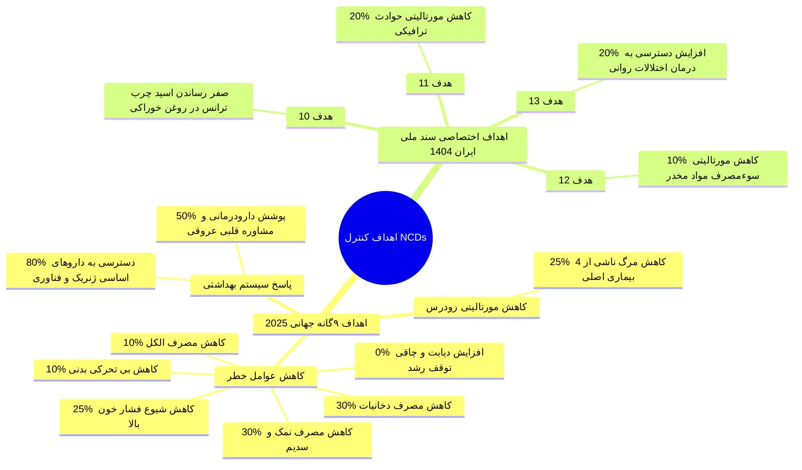
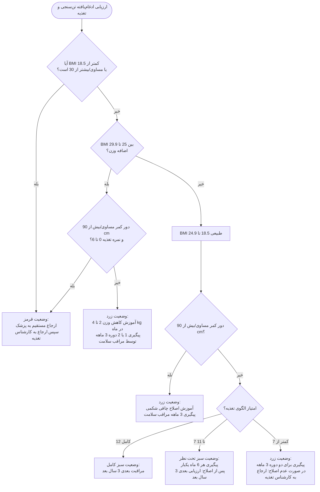
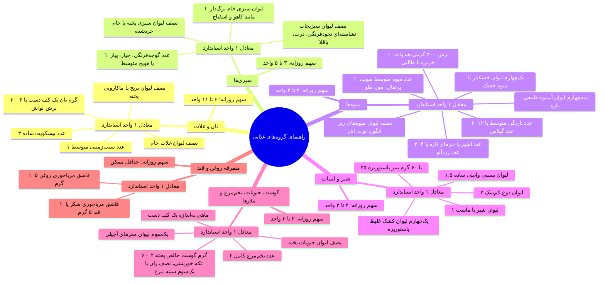
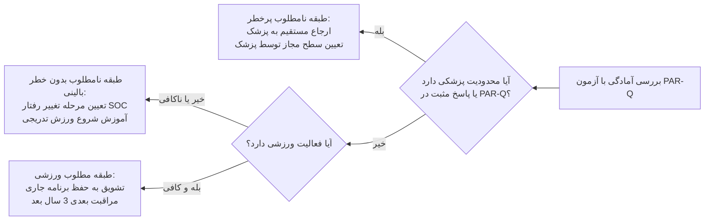
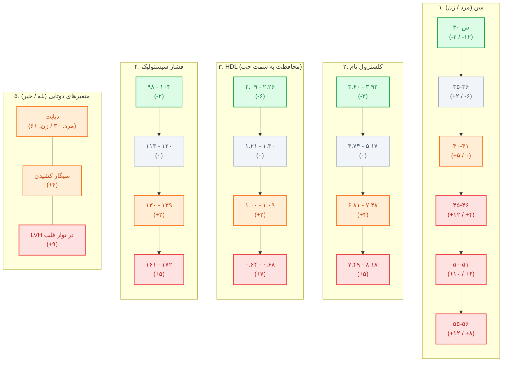

# جلسه ۱۵: سلامت میانسالی زنان

## ۱. تعاریف پایه، بازه‌های سنی و گذارهای جمعیتی

> [!info] تعریف و بازه سنی میانسالی (Midlife)
> - **دیدگاه‌های بالینی متغیر:** شروع از ۴۰، ۴۵ یا ۵۰ سالگی در متون مختلف.
> - **دستورالعمل کشوری جاری وزارت بهداشت:** سن **۳۰ تا ۵۹ سال تمام** (جمعیت هدف رسمی برنامه‌های جامع سلامت).
> - **تاریخچه تغییرات:** پیش از تأسیس اداره سلامت جوانان در سال ۱۳۹۲، بازه سنی میانسالی *۲۵ تا ۵۹ سال* تعریف می‌شد.
> - **تفکیک داخلی بزرگسالی:**
>   1. بزرگسالان جوان (ابتدای بزرگسالی): **۳۰ تا ۴۴ سال**.
>   2. بزرگسالان مسن / میانسالان (انتهای بزرگسالی): **۴۵ تا ۵۹ سال**.


> [!warning] تله تستی بخشنامه جدید جمعیتی سال ۱۴۰۲ (نامه شماره ۳۰۰/۲۱۲۹۵)
> بر اساس مصوبه مرکز جوانی جمعیت (بهمن ۱۴۰۲)، تقسیم‌بندی نظری جدید بر پایه قانون جوانی جمعیت ابلاغ شد، اما **دستورالعمل ارائه خدمت و بسته‌های اجرایی سلامت کماکان منحصراً بر پایه ۳۰ تا ۵۹ سال است**:
> - جنینی: تشکیل نطفه تا تولد | نوزادی: تولد تا ۳۰ روز | شیرخوارگی: ۳۱ روز تا ۲ سال تمام (۱ سال و ۱۱ ماه و ۲۹ روز).
> - کودکی: ۲ تا ۷ سال تمام | نونهالی: ۷ تا ۱۳ سال تمام | نوجوانی: ۱۳ تا ۱۷ سال تمام.
> - جوانی: **۱۷ تا ۴۰ سال تمام** | پیش‌میانسالی: **۴۰ تا ۵۰ سال تمام**.
> - میانسالی: **۵۰ تا ۶۵ سال تمام** (تاکید بخشنامه بر پرهیز از اطلاق واژه میانسال به فرد ۳۰ ساله).
> - نوسالمندی: ۶۵ تا ۷۵ سال | سالخوردگی: ۷۵ تا ۸۵ سال | کهنسالی: بالاتر از ۸۵ سال.

### اهمیت دموگرافیک میانسالان
- بر اساس سرشماری ۱۳۹۰: تشکیل دهنده **یک‌سوم کل جمعیت کشور** (۲۷ میلیون نفر).
- جمعیت ۳۰ تا ۴۴ سال: ۱۷ میلیون نفر | جمعیت ۴۵ تا ۵۹ سال: ۱۰ میلیون نفر.
- گروه **مولد** اقتصادی و بیولوژیک؛ وابستگی شدید سایر سنین به این قشر.
- بیشترین **روزهای کاری ازدست‌رفته** و بالاترین بار **تحمیل فشار اقتصادی ناشی از ناخوشی** به جامعه.
- **گروه فراموش‌شده (Neglected stage):** بیشترین غفلت از سلامت میانسالی زنان در *کشورهای با درآمد کم و متوسط* (LMICs نظیر چین، غنا، مکزیک، روسیه، آفریقای جنوبی و هند).

### گذار دموگرافیک و هرم سنی (Demographic Transition)
- **عوامل شکل‌دهنده هرم سنی:** موالید، مرگ‌ومیر، مهاجرت.
- **تغییرات جمعیتی ایران (۱۳۸۵ تا ۱۳۹۰):** حرکت برآمدگی و پهنای قاعده هرم به میانه (تورم گروه بزرگسالان و حرکت به سمت سالمندی).
```chart
{
  "type": "bar",
  "data": {
    "labels": [
      "۰-۴", "۵-۹", "۱۰-۱۴", "۱۵-۱۹", "۲۰-۲۴", "۲۵-۲۹", 
      "۳۰-۳۴", "۳۵-۳۹", "۴۰-۴۴", "۴۵-۴۹", "۵۰-۵۴", "۵۵-۵۹", 
      "۶۰-۶۴", "۶۵-۶۹", "۷۰-۷۴", "۷۵-۷۹", "۸۰-۸۴", "+۸۵"
    ],
    "datasets": [
      {
        "type": "line",
        "label": "منحنی توزیع مردان ۱۳۹۰",
        "data": [-3.8, -3.7, -3.9, -5.2, -6.9, -7.8, -6.1, -4.5, -3.7, -3.1, -2.6, -2.1, -1.5, -1.1, -0.9, -0.7, -0.4, -0.3],
        "borderColor": "#ad1457",
        "borderWidth": 2.5,
        "tension": 0.35,
        "pointRadius": 2,
        "fill": false
      },
      {
        "type": "line",
        "label": "منحنی توزیع مردان ۱۳۸۵",
        "data": [-3.5, -3.6, -4.7, -6.8, -7.5, -6.2, -4.6, -3.8, -3.2, -2.7, -2.2, -1.5, -1.2, -1.0, -0.8, -0.5, -0.3, -0.2],
        "borderColor": "#00838f",
        "borderWidth": 2.5,
        "tension": 0.35,
        "pointRadius": 2,
        "fill": false
      },
      {
        "type": "line",
        "label": "منحنی توزیع زنان ۱۳۹۰",
        "data": [3.6, 3.5, 3.7, 5.0, 6.7, 7.6, 6.0, 4.4, 3.6, 3.0, 2.5, 2.0, 1.4, 1.0, 0.8, 0.6, 0.4, 0.3],
        "borderColor": "#ad1457",
        "borderWidth": 2.5,
        "tension": 0.35,
        "pointRadius": 2,
        "fill": false
      },
      {
        "type": "line",
        "label": "منحنی توزیع زنان ۱۳۸۵",
        "data": [3.3, 3.4, 4.5, 6.6, 7.3, 6.0, 4.4, 3.7, 3.1, 2.6, 2.1, 1.4, 1.1, 0.9, 0.7, 0.5, 0.3, 0.2],
        "borderColor": "#00838f",
        "borderWidth": 2.5,
        "tension": 0.35,
        "pointRadius": 2,
        "fill": false
      },
      {
        "type": "bar",
        "label": "مردان ۱۳۹۰",
        "data": [-3.8, -3.7, -3.9, -5.2, -6.9, -7.8, -6.1, -4.5, -3.7, -3.1, -2.6, -2.1, -1.5, -1.1, -0.9, -0.7, -0.4, -0.3],
        "backgroundColor": "rgba(233, 30, 99, 0.5)",
        "borderWidth": 0
      },
      {
        "type": "bar",
        "label": "مردان ۱۳۸۵",
        "data": [-3.5, -3.6, -4.7, -6.8, -7.5, -6.2, -4.6, -3.8, -3.2, -2.7, -2.2, -1.5, -1.2, -1.0, -0.8, -0.5, -0.3, -0.2],
        "backgroundColor": "rgba(0, 188, 212, 0.5)",
        "borderWidth": 0
      },
      {
        "type": "bar",
        "label": "زنان ۱۳۹۰",
        "data": [3.6, 3.5, 3.7, 5.0, 6.7, 7.6, 6.0, 4.4, 3.6, 3.0, 2.5, 2.0, 1.4, 1.0, 0.8, 0.6, 0.4, 0.3],
        "backgroundColor": "rgba(233, 30, 99, 0.5)",
        "borderWidth": 0
      },
      {
        "type": "bar",
        "label": "زنان ۱۳۸۵",
        "data": [3.3, 3.4, 4.5, 6.6, 7.3, 6.0, 4.4, 3.7, 3.1, 2.6, 2.1, 1.4, 1.1, 0.9, 0.7, 0.5, 0.3, 0.2],
        "backgroundColor": "rgba(0, 188, 212, 0.5)",
        "borderWidth": 0
      }
    ]
  },
  "options": {
    "indexAxis": "y",
    "responsive": true,
    "plugins": {
      "title": {
        "display": true,
        "text": "مقایسه هرم سنی و منحنی توزیع جمعیت ایران (۱۳۸۵ و ۱۳۹۰)"
      },
      "tooltip": {
        "callbacks": {
          "label": "function(context) { return context.dataset.label + ': ' + Math.abs(context.raw) + '٪'; }"
        }
      }
    },
    "scales": {
      "x": {
        "title": {
          "display": true,
          "text": "جمعیت (مردان ← | → زنان)"
        },
        "ticks": {
          "callback": "function(value) { return Math.abs(value); }"
        }
      },
      "y": {
        "title": {
          "display": true,
          "text": "گروه‌های سنی"
        }
      }
    }
  }
}
```
- **مراحل پنج‌گانه گذار جمعیتی (DTM):**
  1. *مرحله ۱ (High Stationary):* تولد بالا، مرگ بالا؛ رشد جمعیت نزدیک صفر (به‌علت عفونت، فقر، فقدان بهداشت).
  2. *مرحله ۲ (Early Expanding):* تولد بالا، افت سریع مرگ‌ومیر؛ انفجار جمعیت (بهبود درمان و امکانات بهداشتی).
  3. *مرحله ۳ (Late Expanding):* افت سریع موالید، مرگ‌ومیر پایین؛ کاهش تدریجی نرخ رشد (پیشگیری از بارداری، شهرنشینی، خانواده هسته‌ای، سواد زنان).
  4. *مرحله ۴ (Low Stationary):* تولد و مرگ هر دو در سطح پایین؛ رشد جمعیت اندک و تثبیت‌شده.
  5. *مرحله ۵ (Declining):* موالید کمتر از مورتالیتی؛ رشد منفی جمعیت (الگوی برخی کشورهای اروپایی).
```chart
{
  "type": "line",
  "data": {
    "labels": [
      "مرحله ۱ (شروع)",
      "مرحله ۱ (پایان)",
      "مرحله ۲ (میانه)",
      "مرحله ۲ (پایان)",
      "مرحله ۳ (میانه)",
      "مرحله ۳ (پایان)",
      "مرحله ۴ (میانه)",
      "مرحله ۴ (پایان)",
      "مرحله ۵"
    ],
    "datasets": [
      {
        "label": "نرخ موالید (Birth rate)",
        "data": [40, 40, 39, 38, 28, 16, 12, 10, 8],
        "borderColor": "#2e7d32",
        "backgroundColor": "rgba(46, 125, 50, 0.15)",
        "borderWidth": 3,
        "tension": 0.4,
        "fill": false,
        "pointRadius": 3
      },
      {
        "label": "نرخ مرگ‌ومیر (Death rate)",
        "data": [38, 38, 24, 15, 12, 10, 10, 9, 10],
        "borderColor": "#d84315",
        "backgroundColor": "rgba(216, 67, 21, 0.15)",
        "borderWidth": 3,
        "tension": 0.4,
        "fill": false,
        "pointRadius": 3
      },
      {
        "label": "کل جمعیت (Total population)",
        "data": [5, 6, 14, 25, 36, 42, 45, 45, 43],
        "borderColor": "#e65100",
        "backgroundColor": "rgba(255, 183, 77, 0.2)",
        "borderWidth": 3.5,
        "tension": 0.35,
        "fill": false,
        "pointRadius": 0
      }
    ]
  },
  "options": {
    "responsive": true,
    "scales": {
      "x": {
        "title": {
          "display": true,
          "text": "مراحل توسعه جمعیتی (Stages 1 to 5)"
        }
      },
      "y": {
        "min": 0,
        "max": 50,
        "title": {
          "display": true,
          "text": "مقدار شاخص‌ها (نرخ در ۱۰۰۰ نفر / حجم نسبی جمعیت)"
        }
      }
    }
  }
}
```
### گذار اپیدمیولوژیک (Epidemiologic Transition)
- ارائه‌شده توسط **Abdel Omran (1971)** در سه دوره:
  1. *عصر قحطی و طاعون (Age of Pestilence and Famine)*
  2. *عصر فروکش پاندمی‌ها (Age of Receding Pandemics)*
  3. *عصر بیماری‌های مزمن و دژنراتیو (Age of Chronic Diseases)*
- تغییر چهره سیمای مرگ از بیماری‌های عفونی واگیر به بیماری‌های غیرواگیر (NCDs) همگام با افزایش امید به زندگی (*Life Expectancy*).

---

## ۲. اهداف کنترل بیماری‌های غیرواگیر (NCDs)

> [!important] اهداف ۹گانه جهانی WHO تا سال ۲۰۲۵ و الحاقات ملی ایران تا ۱۴۰۴
> **چهار NCD اصلی:** بیماری‌های *قلبی-عروقی* (CVD)، *سرطان‌ها*، *دیابت*، بیماری‌های *مزمن تنفسی* (COPD/CRD).
> **چهار عامل خطر رفتاری مشترک:** *تغذیه* ناسالم، *کم‌تحرکی* فیزیکی، مصرف *دخانیات*، مصرف *الکل* (+ آلودگی هوا).



> [!tip] تمایز مفهومی در هدف ۱۳ ملی
> تفاوت میان **Availability** (موجود بودن دارو و تخت در کشور) و **Accessibility** (دسترسی‌پذیری واقعی بیمار). مانع اصلی درمان در روانپزشکی **انگ اجتماعی (Stigma)** و پنهان‌کاری بیمار است، نه صرفاً کمبود فیزیکی دارو.

---

## ۳. رویکردهای نوین و مقایسه تفاوت‌های جنسیتی

| محور پدیده‌های نوظهور | رویکرد نوین متناظر در خدمات سلامت |
| :--- | :--- |
| **ترکیب جدید سنی جمعیت (تورم میانسالی)** | خدمات مبتنی بر گروه سنی و خدمات مبتنی بر جنسیت |
| **چهره نوین اپیدمیولوژیک بیماری‌ها** | تغییر اولویت‌ها از عفونی به مزمن و پاسخگویی به نیازهای نوین |
| **پزشک خانواده و محدودیت شدید منابع** | ادغام عمودی و افقی و ارتقای جامعیت خدمات سلامت |
| **پیچیدگی و همزمانی بیماری‌ها (Comorbidity)** | توانمندسازی مردم و ادغام *خودمراقبتی* در بسته خدمت |
| **تاثیر فزاینده عوامل اجتماعی بر سلامت (SDH)** | ادغام خدمات سلامت در بسته‌های حمایتی اجتماعی و بین‌بخشی |

### مقایسه ابعاد سلامت و مرگ‌ومیر بر پایه جنسیت

| مولفه مقایسه            | الگوی مردان میانسال                                                                                  | الگوی زنان میانسال                                                                |
| :---------------------- | :--------------------------------------------------------------------------------------------------- | :-------------------------------------------------------------------------------- |
| **مواجهه و حوادث شغلی** | **حوادث ترافیکی** (۵ برابر زنان)، **اعتیاد** (۱۰ برابر زنان)، **سقوط** (۳ برابر زنان)، کار در ارتفاع | مواجهات ارگونومیک خانگی، استرس مراقبت از اعضای خانواده                            |
| **رفتارهای پرخطر**      | مصرف بالاتر **دخانیات**، رفتارهای خشن/مخاطره‌آمیز **رانندگی**، سوءمصرف مواد                          | **کم‌تحرکی** بدنی بالاتر، چاقی شکمی با شیوع بیشتر                                 |
| **علل اصلی مورتالیتی**  | سوانح و حوادث، قتل، تروماهای مکانیکی، بیماری‌های شغلی                                                | بیماری ایسکمیک **قلب** (IHD)، حوادث عروقی **مغز**، عوارض **دیابت**/**فشارخون**    |
| **علل شایع موربیدیتی**  | COPD، سوختگی، اسکیزوفرنی، آسم، خودکشی، عفونت ایدز (HIV)                                              | افسردگی و اضطراب، کمردرد و آرتروز، کم‌خونی، عوارض منوپوز، سرطان پستان و دهانه رحم |
| **عوامل اجتماعی (SDH)** | اجبار نان‌آوری در شرایط پرخطر، استرس مالی، عدم تمایل به مراجعه                                       | خشونت خانگی، وابستگی مالی و عدم استقلال، موانع تردد فیزیکی/امنیتی در LMICs        |

> [!info] اصل راندمان خودمراقبتی (Self-Care)
> در صورت توانمندسازی و آموزش صحیح آحاد جامعه، **۶۵ تا ۸۵ درصد** کل مراقبت‌های سلامت مستقیماً توسط خود فرد و خانواده و بدون نیاز به ورود متخصصین سطح بالا قابل انجام است.

---

## ۴. بسته سلامت باروری، منوپوز و ایمن‌سازی

### مشکلات و عوارض دوره منوپوز
- **علائم سوماتیک/وازوموتور:** گرگرفتگی، تعریق شبانه، بی‌خوابی، دیس‌پارونی، آتروفی اوروژنیتال، ماستالژی، سردردهای میگرنی، آرتریت و دردهای مفصلی.
- **علائم روانی:** اضطراب، تحریک‌پذیری خلقی، خستگی مفرط، افت تمرکز، کاهش میل جنسی، افسردگی، بحران میانسالی (*Midlife Crisis*).
- **عوارض درازمدت سیستمیک:** شتاب‌گیری بیماری‌های عروق کرونر، استئوپروز سریع، بی‌اختیاری ادراری.
- **غربالگری‌های اختصاصی مطب/پایگاه:** پاپ اسمیر و تست مولکولی HPV، معاینه بالینی پستان و ماموگرافی، ارزیابی خونریزی غیرطبیعی رحمی (AUB)، غربالگری خشونت خانگی (*Domestic Violence*).

### ایمن‌سازی در میانسالان
1. **واکسن دوگانه کزاز-دیفتری (Td):** تزریق روتین کشوری با دوز یادآور **هر ۱۰ سال یک‌بار** (پیشگیری قطعی از کزاز نوزادی در بارداری‌های انتهای دوره باروری).
2. **واکسن هپاتیت B:** تزریق الزامی در کلیه گروه‌های پرخطر شغلی، رفتاری و خونی.
3. **واکسن آنفلوانزا:** تزریق **سالیانه پیش از شروع فصل سرما (پاییز)** در گروه‌های واجد شرایط: افراد با سن بالا، مبتلایان به نقایص سیستم ایمنی، بیماران زمینه‌ای مزمن قلبی-ریوی، پرسنل بهداشتی درمانی.
   - *نکته اجرایی:* تامین هزینه واکسن آنفلوانزا در حال حاضر بر عهده خود متقاضی است.

---

## ۵. ارزیابی تن‌سنجی (Anthropometry) و طبقه‌بندی BMI

> [!info] فرمول نمایه توده بدنی
> مقدار نمایه از تقسیم وزن بر حسب کیلوگرم بر توان دوم قد بر حسب متر به دست می‌آید: BMI = وزن (کیلوگرم) / [قد (متر)]²
> - دور کمر آستانه خطر در دستورالعمل کشوری: **۹۰ سانتی‌متر و بیشتر**.

| رده وزنی               | دامنه عددی BMI | دور کمر (cm) | تریاژ رنگی   | مداخله استاندارد                                                                     |
| :--------------------- | :------------- | :----------- | :----------- | :----------------------------------------------------------------------------------- |
| **لاغری (کم‌وزنی)**    | کمتر از ۱۸.۵   | هر اندازه‌ای | **قرمز**     | ارجاع به پزشک جهت بررسی علل زمینه‌ای ⇦ ارجاع به کارشناس تغذیه                        |
| **طبیعی**              | ۱۸.۵ تا ۲۴.۹   | کمتر از ۹۰   | **سبز**      | تشویق به حفظ وضع موجود؛ خودمراقبتی؛ مراقبت دوره‌ای بعدی ۳ سال بعد (در نمره تغذیه ۱۲) |
| **طبیعی با چاقی شکمی** | ۱۸.۵ تا ۲۴.۹   | ۹۰ و بیشتر   | **زرد**      | آموزش عوارض چاقی شکمی و سندرم متابولیک؛ مداخله بر اساس نمره الگوی تغذیه              |
| **اضافه وزن**          | ۲۵.۰ تا ۲۹.۹   | کمتر از ۹۰   | **زرد**      | تجویز کاهش وزن **۲ تا ۴ کیلوگرم در ماه**؛ اصلاح الگوی فعالیت؛ پیگیری دوره‌ای         |
| **اضافه وزن پرخطر**    | ۲۵.۰ تا ۲۹.۹   | ۹۰ و بیشتر   | **زرد/قرمز** | آموزش خطر مازاد بیماری‌های مزمن؛ ارجاع بر اساس جدول تلفیقی تغذیه                     |
| **چاقی درجه ۱**        | ۳۰.۰ تا ۳۴.۹   | هر اندازه‌ای | **قرمز**     | ارجاع به پزشک ⇦ ارجاع از پزشک به کارشناس تغذیه                                       |
| **چاقی درجه ۲**        | ۳۵.۰ تا ۳۹.۹   | هر اندازه‌ای | **قرمز**     | ارجاع به پزشک ⇦ ارجاع از پزشک به کارشناس تغذیه                                       |
| **چاقی درجه ۳ (شدید)** | ۴۰.۰ و بیشتر   | هر اندازه‌ای | **قرمز**     | ارجاع به پزشک ⇦ ارجاع از پزشک به کارشناس تغذیه                                       |

---

## ۶. ارزیابی الگوی تغذیه و استانداردهای مصرف

### پرسشنامه ۶ سوالی ارزیابی الگوی تغذیه
- هر سوال بین **۰ تا ۲ امتیاز**؛ مجموع حداکثر امتیاز = **۱۲ امتیاز** (امتیاز **۸ و بالاتر** مطلوب است):
  1. *میوه:* روزانه $\ge 2$ واحد (۲ امتیاز) | $< 2$ واحد (۱ امتیاز) | بندرت/هرگز (۰ امتیاز).
  2. *سبزی:* روزانه $\ge 3$ واحد (۲ امتیاز) | $< 3$ واحد (۱ امتیاز) | بندرت/هرگز (۰ امتیاز).
  3. *لبنیات:* روزانه $\ge 2$ واحد (۲ امتیاز) | $< 2$ واحد (۱ امتیاز) | بندرت/هرگز (۰ امتیاز).
  4. *نمکدان سر سفره:* بندرت/هرگز (۲ امتیاز) | گاهی (۱ امتیاز) | همیشه (۰ امتیاز).
  5. *فست‌فود و نوشابه گازدار:* بندرت/هرگز (۲ امتیاز) | ۱ تا ۲ بار در ماه (۱ امتیاز) | $\ge 2$ بار در ماه (۰ امتیاز).
  6. *نوع روغن مصرفی:* فقط مایع گیاهی/سرخ‌کردنی (۲ امتیاز) | تلفیقی از مایع و جامد (۱ امتیاز) | فقط روغن جامد/نیمه‌جامد/حیوانی (۰ امتیاز).



### مقادیر مصرف روزانه گروه‌های غذایی اصلی و اندازه هر واحد



> [!tip] مکمل‌یاری ویتامین D و ماهی
> - **ویتامین D:** تحویل یک عدد پرل **۵۰,۰۰۰ واحدی ماهانه** به تمام افراد میانسال بدون نیاز به اندازه‌گیری سطح سرمی در پروتکل پایه بهداشتی.
> - **ماهی:** مصرف حداقل **۲ بار در هفته** (پخت بخارپز، آب‌پز یا تنوری؛ پرهیز کامل از سرخ‌کردن عمیق).

---

## ۷. ارزیابی فعالیت فیزیکی، استعمال دخانیات و پرسشنامه PAR-Q

### فعالیت فیزیکی استاندارد میانسالان
- **توصیه پایه:** حداقل **۵ روز در هفته**، هر بار **حداقل ۳۰ دقیقه** ورزش *هوازی* با شدت *متوسط* (حداقل **۱۵۰ دقیقه در هفته**).
- **شاخص شدت متوسط با Talk Test:** توانایی حفظ مکالمه صوتی حین انجام تمرین بدون به شماره افتادن شدید تنفس طی ۲۰ تا ۶۰ دقیقه پیاده‌روی.
- **معیار عملی:** پیاده‌روی تند مسافت **۲.۵ تا ۳ کیلومتر در مدت ۳۰ دقیقه**.
- **پرسشنامه آمادگی فعالیت بدنی (PAR-Q):** ابزار غربالگری ۱۶ سوالی جهت سنجش ایمنی قلبی-عروقی، اسکلتی-مفصلی، مصرف داروها و علائم گیجی/سنکوپ قبل از شروع ورزش یا ارتقای سطح تمرینات.



### ارزیابی استعمال دخانیات
> [!info] تعاریف مرجع WHO در دخانیات
> - **فرد سیگاری (Current Smoker):** مصرف حداقل **۱۰۰ نخ سیگار** در طول زندگی و استمرار مصرف در زمان حال.
> - **مصرف‌کننده قلیان/پیپ:** مصرف بیش از **۲۰ اونس (معادل ۵۰۰ گرم)** توتون در طول عمر و استمرار مصرف در زمان حال.


> [!danger] تله تستی مقایسه پاتولوژیک قلیان در برابر سیگار
> - **نیکوتین:** یک وعده قلیان کشیدن معادل نیکوتین موجود در **یک بسته کامل سیگار (۲۰ نخ)** است.
> - **حجم دود استنشاقی:** هر تک پُک قلیان **۲۳ برابر** یک پُک سیگار دود به مجاری تنفسی وارد می‌کند.
> - **مونوکسید کربن (CO):** غلظت CO در دود قلیان تا **۳۰ برابر** بیشتر از سیگار است و تمام ترکیبات کارسینوژن دود سیگار را داراست.

### سطوح مواجهه و مدیریت دخانیات
- **دست اول:** فرد مصرف‌کننده فعال.
- **دست دوم:** استنشاق تحمیلی غیرفعال دود اطرافیان در منزل یا محل کار.
- **دست سوم:** رسوب ترکیبات کارسینوژن و ذرات سمی دوده بر دیوارها، مبل، فرش و لباس‌ها که تا *ماه‌ها و سال‌ها* پایدار می‌ماند.

| طبقه‌بندی بالینی | وضعیت مصرف مراجعه‌کننده | تریاژ | اقدام مداخله‌ای استاندارد |
| :--- | :--- | :--- | :--- |
| **مشکوک به وابستگی نیکوتین** | مصرف مستمر روزانه هر ماده دخانی در ۱ ماه اخیر | **قرمز** | ارجاع به کارشناس سلامت روان؛ غربالگری تکمیلی وابستگی؛ مشاوره ترک؛ در صورت لزوم ارجاع به پزشک برای دارودرمانی؛ پیگیری در فواصل ۱ هفته، ۱ ماه، ۳ ماه، ۶ ماه و ۱۲ ماه |
| **در معرض خطر وابستگی** | مصرف تفننی و غیرمستمر در ۱ ماه اخیر | **قرمز** | ارجاع به کارشناس سلامت روان جهت پیشگیری اولیه و قطع کامل مواجهه |
| **مواجهه تحمیلی با دود** | عدم مصرف در ۱ سال اخیر، ولی تماس دست دوم یا سوم در ۱ ماه گذشته | **زرد** | آموزش تکنیک‌های امتناع و اجتناب از دود تحمیلی؛ آموزش عوارض تنفسی و انکولوژیک |
| **غیرسیگاری سالم** | عدم سابقه مصرف (یا گذشت حداقل ۱ سال از ترک کامل) بدون تماس دست دوم/سوم | **سبز** | بازخورد مثبت؛ ترویج خودمراقبتی؛ ارزیابی در دوره مراقبت بعدی |

---

## ۸. ارزیابی ریسک قلبی-عروقی (CVD Risk Chart)

> [!important] پارامترهای ۷گانه جدول فرامینگهام در مدل کشوری
> مجموع امتیازات تعیین‌‌کننده خطر پیش‌بینی‌شده رخداد حوادث کشنده و غیرکشنده قلبی-عروقی در **۵ سال و ۱۰ سال آینده** است:
> 1. سن (محاسبه نمره اختصاصی بر اساس جنسیت).
> 2. سطح کلسترول تام خون (mmol/L).
> 3. سطح کلسترول HDL خون (mmol/L).
> 4. فشار خون سیستولیک (SYS.BP بر حسب mmHg).
> 5. **دیابت:** برای مردان ۳ امتیاز، ولی برای زنان **۶ امتیاز** تعلق می‌گیرد (*نکته به‌شدت تست‌خیز*).
> 6. **استعمال دخانیات:** ۴ امتیاز (برای هر دو جنس یکسان).
> 7. **هایپرتروفی بطن چپ (LVH) در نوار قلب:** ۹ امتیاز.

### جدول امتیازدهی متغیرهای بالینی



### جدول تبدیل مجموع امتیاز به خطر درصدی حوادث CVD

```chart
{
  "type": "line",
  "data": {
    "labels": ["<۱", "۵", "۱۰", "۱۵", "۱۸", "۲۰", "۲۴", "۲۵ (شاخص)", "۲۸", "۳۰", "۳۲+"],
    "datasets": [
      {
        "label": "احتمال خطر ۵ ساله (%)",
        "data": [1, 1, 2, 5, 7, 8, 13, 14, 19, 22, 25],
        "borderColor": "#3b82f6",
        "backgroundColor": "rgba(59, 130, 246, 0.15)",
        "fill": false,
        "tension": 0.25,
        "pointRadius": [4, 4, 4, 4, 4, 4, 4, 11, 4, 4, 4],
        "pointBackgroundColor": [
          "#3b82f6", "#3b82f6", "#3b82f6", "#3b82f6", "#3b82f6", "#3b82f6", "#3b82f6",
          "#ef4444",
          "#3b82f6", "#3b82f6", "#3b82f6"
        ],
        "pointBorderColor": "#ffffff",
        "pointBorderWidth": 2
      },
      {
        "label": "احتمال خطر ۱۰ ساله (%)",
        "data": [2, 3, 6, 10, 14, 18, 25, 27, 33, 38, 42],
        "borderColor": "#f97316",
        "backgroundColor": "rgba(249, 115, 22, 0.15)",
        "fill": false,
        "tension": 0.25,
        "pointRadius": [4, 4, 4, 4, 4, 4, 4, 11, 4, 4, 4],
        "pointBackgroundColor": [
          "#f97316", "#f97316", "#f97316", "#f97316", "#f97316", "#f97316", "#f97316",
          "#dc2626",
          "#f97316", "#f97316", "#f97316"
        ],
        "pointBorderColor": "#ffffff",
        "pointBorderWidth": 2
      }
    ]
  },
  "options": {
    "scales": {
      "y": {
        "title": {
          "display": true,
          "text": "درصد احتمال خطر (%)"
        },
        "beginAtZero": true,
        "max": 50
      },
      "x": {
        "title": {
          "display": true,
          "text": "مجموع امتیازات"
        }
      }
    }
  }
}
```

> [!danger] حل کیس بالینی رفرنس کلاس و امتحانات
> **سناریو:** خانم ۵۰ ساله، مبتلا به دیابت، سیگاری، با HDL برابر با ۱ میلی‌مول بر لیتر، کلسترول تام ۸ میلی‌مول بر لیتر و فشار خون سیستولیک ۱۳۰ میلی‌متر جیوه.
> **محاسبه گام‌به‌گام نمره:**
> - سن ۵۰ سال (زن) = **۶ امتیاز**
> - دیابت در زن = **۶ امتیاز** (تله: در مردان ۳ است)
> - سیگاری بودن = **۴ امتیاز**
> - کلسترول HDL معادل ۱ (بازه ۱.۰۰-۱.۰۹) = **۲ امتیاز**
> - کلسترول تام معادل ۸ (بازه ۷.۴۹-۸.۱۸) = **۵ امتیاز**
> - فشار خون سیستولیک ۱۳۰ (بازه ۱۳۰-۱۳۹) = **۲ امتیاز**
> - مجموع امتیاز: $6 + 6 + 4 + 2 + 5 + 2 = \mathbf{25}$
> - **تفسیر نهایی خطر بیمار:** احتمال رخداد حادثه قلبی عروقی در **۵ سال آینده برابر با ۱۴%** و در **۱۰ سال آینده برابر با ۲۷%** است.

```chart
{
  "type": "bar",
  "data": {
    "labels": ["کاهش مرگ زودرس", "کاهش الکل", "کاهش بی تحرکی", "کاهش سدیم/نمک", "کاهش مصرف دخانیات", "کاهش فشار خون"],
    "datasets": [
      {
        "label": "درصد هدف گذاری جهانی WHO تا 2025 (%)",
        "data": [25, 10, 10, 30, 30, 25],
        "backgroundColor": [
          "rgba(239, 68, 68, 0.7)",
          "rgba(59, 130, 246, 0.7)",
          "rgba(16, 185, 129, 0.7)",
          "rgba(245, 158, 11, 0.7)",
          "rgba(139, 92, 246, 0.7)",
          "rgba(236, 72, 153, 0.7)"
        ],
        "borderColor": [
          "rgb(239, 68, 68)",
          "rgb(59, 130, 246)",
          "rgb(16, 185, 129)",
          "rgb(245, 158, 11)",
          "rgb(139, 92, 246)",
          "rgb(236, 72, 153)"
        ],
        "borderWidth": 1
      }
    ]
  },
  "options": {
    "responsive": true,
    "plugins": {
      "title": {
        "display": true,
        "text": "شاخص‌های کمی اهداف جهانی NCDs تا سال 2025"
      },
      "legend": {
        "display": false
      }
    },
    "scales": {
      "y": {
        "beginAtZero": true,
        "max": 35,
        "ticks": {
          "stepSize": 5
        }
      }
    }
  }
}
```
