# جلسه ۱۲: پیشگیری از بارداری (Contraception)

> [!abstract] تعریف و هدف بالینی
> تدابیر دارویی، مکانیکی یا جراحی جهت جلوگیری از **لقاح (Fertilization)** یا **لانه‌گزینی (Implantation)** سلول تخم در اندومتر رحم؛ دسته‌بندی بنیادین: **برگشت‌پذیر (Reversible)** در برابر **برگشت‌ناپذیر (Irreversible)**.

---

## ۱. درخت جامع طبقه‌بندی روش‌ها (Classification Mindmap)

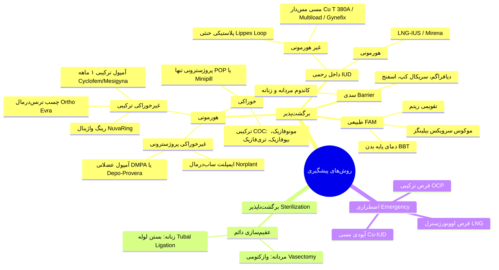

---

## ۲. روش‌های هورمونی ترکیبی (Combined Hormonal Methods)

> [!info] ساختار فارماکولوژیک
> جزء استروژنی پایدار و ثابت: عمدتاً **اتینیل استرادیول (Ethinyl Estradiol - EE)** و گاهی *مسترانول (Mestranol)*.  
> جزء پروژسترونی متغیر: لوونورژسترول (LNG)، دروسپیرنون، دزوژسترل، نورژستیمیت، نورتی‌اندرون، ژستودن.

### مکانیسم سه‌گانه عمل COC
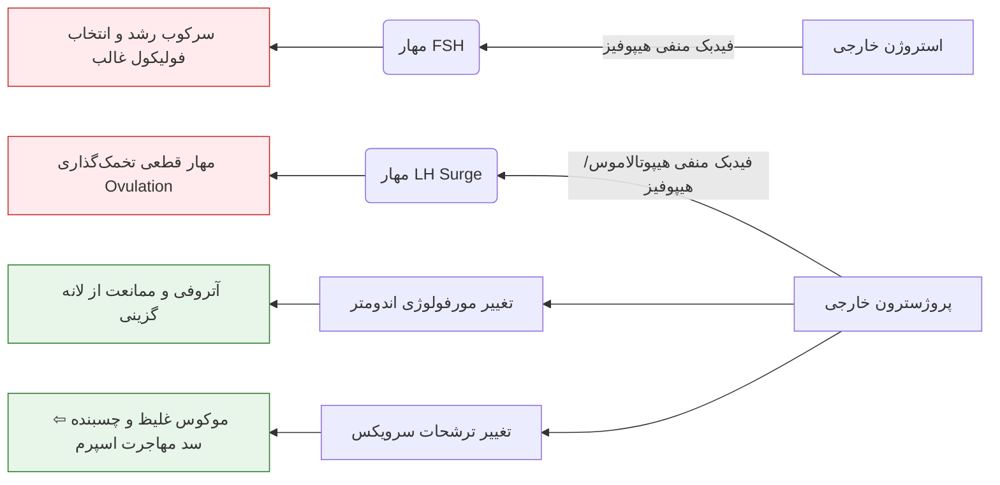

### طبقه‌بندی دوز و نسل‌های قرص ترکیبی
1. **ترکیبات دوز بالا (High-Dose):** حاوی دوز EE مساوی یا بیشتر از 50 میکروگرم؛ کاربرد صرفاً درمانی (خونریزی‌های دیس‌فونfunctional رحمی)، **فاقد اندیکاسیون پیشگیری اولیه**.
2. **ترکیبات دوز پایین (Low-Dose):** حاوی کمتر از 50 میکروگرم اتینیل استرادیول.
3. **قرص‌های نسل اول (First Generation):** حاوی 50 میکروگرم یا بیشتر اتینیل استرادیول.
4. **قرص‌های نسل دوم (Second Generation):** حاوی لوونورژسترول، نورژستیمیت و مشتقات خانواده نورتی‌اندرون همراه با 30 یا 35 میکروگرم اتینیل استرادیول.
5. **قرص‌های نسل سوم (Third Generation):** حاوی دزوژسترل یا ژستودن همراه با 20 یا 30 میکروگرم اتینیل استرادیول.

### رژیم‌های مصرف و فازها
* **مونوفازیک (Monophasic):** مقادیر هورمون استروژن و پروژسترون در تمام 21 قرص فعال یکسان و تک‌رنگ.
* **بی‌فازیک (Biphasic):** تقسیم قرص‌ها به دو فاز مجزا متناسب با نیمه فولیکولار و لوتئال.
* **تری‌فازیک (Triphasic):** قرص‌ها با 3 رنگ متفاوت متناظر با فیزیولوژی طبیعی بدن جهت کاهش عوارض سوخت‌وسازی:
  * *6 قرص اول:* فاز فولیکولار (استروژن بیشتر، پروژسترون کمتر).
  * *5 قرص میانی:* فاز حوالی تخمک‌گذاری (افزایش پروژسترون).
  * *10 قرص پایانی:* فاز لوتئال (افزایش حداکثری پروژسترون).
* **پروتکل استاندارد 21/7:** مصرف مداوم 21 روزه هورمون خارجی، سپس 7 روز استراحت جهت ریزش اندومتر (**خونریزی قطع مصرف / Withdrawal Bleeding**). بروز خونریزی معمولاً 2 تا 8 روز پس از قطع (شروع خونریزی در روز 8 *بسیار دیر و غیرمعمول* است). بسته‌های 28 عددی حاوی 7 قرص دارونما/آهن/روی جهت پایبندی بیمار به مصرف روزانه.

---

## ۳. فواید غیر کنتراسپتیو و عوارض جانبی روش‌های ترکیبی

| حیطه اثر | پیامد بالینی دقیق | مکانیسم پاتوفیزیولوژیک مرتبط |
| :--- | :--- | :--- |
| **خونریزی و خون‌سازی** | کاهش بروز **کم‌خونی فقر آهن** | کاهش حجم و روزهای خونریزی ماهیانه متعاقب آتروفی نسبی اندومتر |
| **درد و علائم سیکلیک** | تسکین شدید یا درمان **دیس‌‌منوره** و علائم **PMS** | مهار تخمک‌گذاری و حذف ترشح دردزای پروستاگلاندین‌های لوتئال |
| **انکولوژی** | کاهش چشمگیر **کانسر اندومتر** و **کانسر اپی‌تلیال تخمدان** | خنثی‌سازی اثر هیپرپلاستیک استروژن توسط پروژسترون و توقف ضربه میتوتیک تخمک‌گذاری |
| **آسیب‌های تخمدانی** | پیشگیری از تشکیل و درمان **کیست‌های تخمدان** | سرکوب هورمون‌های گنادوتروپین و جلوگیری از تشکیل فولیکول‌های فانکشنال |
| **استخوان و مفاصل** | پیشگیری از **استئوپروز** و کاهش شدت **آرتریت روماتوئید** | اثر محافظتی استروژن در بازجذب کلسیم استخوانی و مدولاسیون ایمنی |

> [!warning] تله مهم امتحانی: ریسک کانسر سرویکس
> قرص‌های ترکیبی ابداً از **سرطان سرویکس** محافظت نکرده و در مبتلایان به ریسک‌فاکتورهای نئوپلازی سرویکس حتی ممکن است روند ضایعه دیس‌پلاستیک را **تشدید** نمایند.

### موارد منع مصرف (Contraindications)
* **منع مصرف قطعی (Absolute CI):**
  * سابقه یا ابتلا به **حوادث ترومبوآمبولیک عروقی (VTE)**، ترومبوفلبیت و اختلالات انعقادی.
  * سابقه **بیماری‌های عروقی مغز (CVA)** یا بیماری ایسکمیک قلبی.
  * سابقه **سرطان پستان** و **سرطان اندومتر** یا هر بدخیمی وابسته به استروژن.
  * بیماری فعال کبدی، تومورهای کبدی، سابقه یرقان انسدادی (کلستاز) ناشی از بارداری یا OCP.
  * بارداری قطعی یا مشکوک به بارداری.
  * سابقه **خونریزی غیرطبیعی تناسلی بدون علت مشخص** (خونریزی تشخیص‌داده‌نشده).
* **موارد احتیاط شدید (Relative CI):** سن بالای 35 سال همراه با مصرف سیگار، فشار خون بالا، هیپرلیپیدمی، دیابت ملیتوس و چاقی مفرط مرضی (افزایش ریسک ترومبوآمبولی به میزان **3 تا 4 برابر**).

> [!danger] اصل حیاتی امتحانی: برخورد با خونریزی واژینال نامشخص
> تجویز هرگونه قرص ضدبارداری یا ترکیب هورمونی در خانمی با خونریزی غیرطبیعی رحمی تا زمان **رد قطعی بدخیمی‌های ژنیتال، حاملگی ناشناخته، EP و سقط زودهنگام اکیداً ممنوع** است! تنها پس از اثبات منشأ صرفاً دیس‌فانکشنال هورمونی، تجویز جهت **سیکل‌تراپی (21 روز مصرف/7 روز قطع)** مجاز است.

### تداخلات دارویی ترکیبات خوراکی
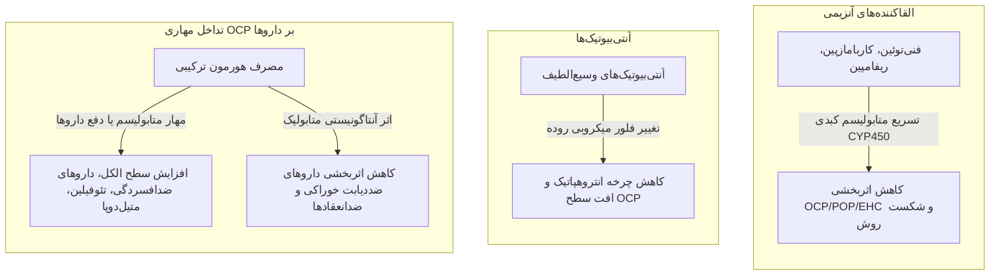

---

## ۴. روش‌های هورمونی غیرخوراکی (Non-Oral Hormonal Contraceptives)

| پارامتر بالینی | چسب پوستی ترنس‌درمال (Ortho Evra) | رینگ داخل واژن (NuvaRing) |
| :--- | :--- | :--- |
| **محتوای دارویی** | استروژن و پروژستین (جذب از اپیدرم) | استروژن و پروژستین پیوسته رهش بر پایه سیلیکون |
| **ابعاد فیزیکی** | مربع کوچک به ابعاد 5 در 5 سانتی‌متر (معادل 2×2 اینچ) | حلقه انعطاف‌پذیر استوانه‌ای |
| **محل جای‌گذاری** | بازو، بخش تحتانی شکم، بالا یا پایین پشت، شانه | عمق فورنیکس واژن (توسط خود فرد یا پزشک) |
| **پروتکل زمانی** | 3 هفته فعال (تعویض هر 7 روز یک‌بار) + 1 هفته فاقد چسب | 3 هفته مداوم داخل واژن + خارج‌سازی برای 1 هفته خونریزی |
| **مزیت فارماکوکینتیک** | عبور مستقیم به گردش خون سیستمیک و کاهش عوارض گوارشی | جذب مخاطی بسیار سریع‌تر از چسب، حذف کامل اثر گذر اول کبدی و عوارض گوارشی |
| **عوارض اختصاصی** | تحریک پوستی موضعی، لکه‌بینی، تهوع، تندرنس پستان | لکوره (ترشحات موکوسی افزایش‌یافته)، واژینیت، سرویسیت باکتریال |
| **بازگشت باروری** | بلافاصله و سریع پس از توقف مصرف | سریع و نامحدود بلافاصله پس از خروج رینگ |

> [!tip] ویژگی سیستمیک نوارینگ
> با وجود کاربرد داخل واژینال، *NuvaRing* اثر محافظتی معادل OCP در برابر کانسر اندومتر، کانسر تخمدان، کیست‌های تخمدانی، آنمی و PID ایجاد می‌کند؛ اما هیچ‌گونه حفاظتی در برابر STI ندارد.

---

## ۵. روش‌های هورمونی پروژسترونی تنها (Progestin-Only Methods)

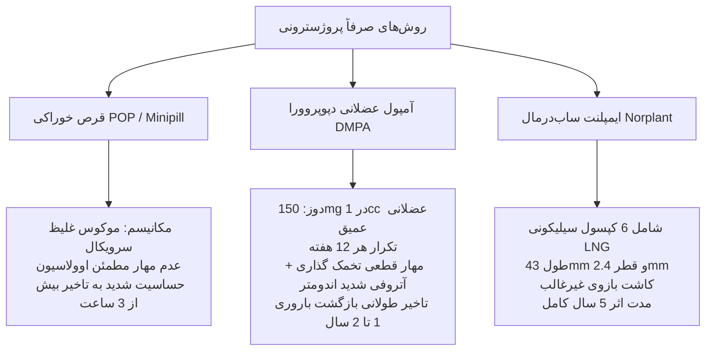

### مقایسه تفصیلی متدهای پروژسترونی
* **قرص صرفاً پروژسترونی (POP):** دوز ناچیز پروژستین؛ بر محور تخمک‌گذاری اثر مهاری دائم ندارد؛ ممانعت از صعود اسپرم از طریق موکوس فوق‌العاده متراکم؛ ایده‌آل برای خانم‌های **شیرده** و زنان بالای 40 سال؛ فاقد اثرات ترومبوآمبولیک؛ شکست در صورت تأخیر مصرف بیش از 3 ساعت.
* **آمپول دپو مدروکسی پروژسترون استات (DMPA):**
  * فرمولاسیون: سوسپانسیون میکروکریستالی آهسته‌رهش، **150 میلی‌گرم در ویال 1 سی‌سی**.
  * تزریق: عضلانی عمیق در عضله سرین (گلوتئال) یا دلتوئید بازو؛ **ماساژ دادن موضع اکیداً ممنوع** (موجب آزادسازی جهشی دارو و سقوط طول دوره اثر).
  * بازه مصرف: هر 12 هفته یک‌بار (پنجره اطمینان یا Grace Period معادل مثبت/منفی 2 هفته، حداکثر تاخیر مجاز 1 هفته).
  * سرعت اثر: ایجاد وضعیت پیشگیری مؤثر ظرف **24 ساعت اول**.
  * اندیکاسیون‌های شاخص: سیگاری‌های شدید بالای 30 سال، زنان مبتلا به کم‌خونی داسی‌شکل (بهبود بالینی با القای آمنوره)، ناهنجاری‌های مادرزادی قلبی، سابقه قبلی VTE، اختلالات تشنجی، و ضریب هوشی پایین یا ناتوانی در سازمان‌‌دهی روزانه (Low IQ).
  * بازگشت باروری: **تأخیر شدید بالینی تا 12 الی 24 ماه** (نامناسب برای افراد با قصد بارداری نزدیک).
* **ایمپلنت زیرجلدی (Norplant):**
  * ساختار فیزیکی: 6 کپسول قابل ارتجاع الاستیک (ابعاد هر کپسول: طول 43 میلی‌متر و قطر 2.4 میلی‌‌متر)؛ لوله و چسب سیلیکونی پلیمری حاوی لوونورژسترول (LNG).
  * جایگذاری: ساب‌درمال در سطح داخلی بازوی غیرغالب (عمدتاً دست چپ) با بی‌‌حسی موضعی توسط پرسنل ورزیده.
  * شاخص‌های کلیدی: شروع اثر پس از 24 ساعت؛ طول اثر **5 سال**؛ شکست روش فوق‌العاده اندک (0.05 حاملگی در 100 زن‌سال)؛ شایع‌ترین عارضه: لکه‌بینی نامنظم رحمی؛ عدم نیاز به معاینه لگنی و عدم اختلال با شیردهی.

---

## ۶. وسایل داخل رحمی (Intrauterine Devices - IUD)

> [!abstract] پاتوفیزیولوژی IUD
> پیشگیری نه بر پایه انسداد فیزیکی فضای کم‌حجم آندومتر، بلکه متکی بر القای یک **واکنش التهابی مزمن آسپتیک** (لکوسیت‌ها، آنزیم‌ها، پروستاگلاندین‌ها و یون‌های مس سیتوتوکسیک) در مایع رحم و لوله‌ها است که موجب **فلج عملکرد اسپرم، تخریب زیست‌پذیری آن و ممانعت قطعی از لقاح** می‌گردد.

### مقایسه تطبیقی IUD مسی و هورمونی

| شاخص بالینی | آیودی مسی (Cu T 380A / Paragard) | آیودی هورمونی (LNG-IUS / Mirena) |
| :--- | :--- | :--- |
| **ماده فعال** | سیم‌پیچ حاوی یون خالص مس | لوونورژسترول (LNG) پیوسته رهش موضعی |
| **مدت ماندگاری** | **10 الی 12 سال** | 3 الی 5 سال |
| **مکانیسم باروری** | سمیت مستقیم یون مس برای اسپرم و ممانعت از لقاح | ضخیم‌‌سازی موکوس سرویکس، آتروفی اندومتر، سرکوب نسبی اوولاسیون |
| **الگوی قاعدگی** | تشدید حجم خونریزی (منوراژی)، افزایش دردهای دیس‌منوره | القای لکه‌بینی اولیه، متعاقباً هایپومنوره شدید یا آمنوره مطلوب |
| **کاربرد اضطراری** | **بله (استاندارد طلایی تا 120 ساعت اول)** | خیر (فاقد اندیکاسیون روتین در اورژانس) |
| **کنتراندیکاسیون خاص** | **بیماری ویلسون (Wilson's Disease)**، منوراژی حاد | بدخیمی حساس به هورمون، عفونت فعال لگن |

### عوارض و پیامدهای جراحی IUD
1. **پرفوراسیون رحم (Perforation):** 1 در هر 1000 مورد تعبیه توسط اپراتور باتجربه.
2. **خروج خودبه‌خودی (Expulsion):** شیوع کلی بین 2% تا 10% در سال اول (به‌ویژه ماه اول پس از تعبیه)؛ ریسک‌فاکتورها: **نولی‌پاریته (زنان بدون سابقه زایمان)، جریان شدید قاعدگی و دیس‌منوره شدید**.
3. **عفونت لگنی (PID):** ریسک عفونت در حین تعبیه در شرایط استریل بسیار ناچیز است؛ با این حال عدم محافظت در برابر STIها پابرجا است.

---

## ۷. روش‌های سدی و عقیم‌سازی جراحی (Barrier & Surgical Sterilization)

### متدهای سدی (Barrier)
* انواع: کاندوم مردانه، کاندوم زنانه (دارای حلقه بسته داخلی روی سرویکس و حلقه باز خارجی روی فرج)، دیافراگم، سریکال کپ، اسفنج‌های ضدبارداری حاوی اسپرم‌کش.
* مکانیسم: ممانعت مکانیکی و سد فیزیکی رسیدن اسپرماتوزوئید به تخمک در لوله‌ها.
* محافظت عفونی: **تنها روش ارائه‌دهنده حفاظت علیه ویروس ایدز (HIV) و کلامیدیا، کاندوم‌ها هستند**.
* ترکیبات اسپرم‌کش (Spermicides): دارای اثربخشی اندک؛ ایجاد میکروتروما و خراش‌های مخاطی واژن که خود **ریسک انتقال عفونت‌ها و HIV را تشدید می‌کند**.

### عقیم‌سازی جراحی دائمی (Surgical Sterilization)
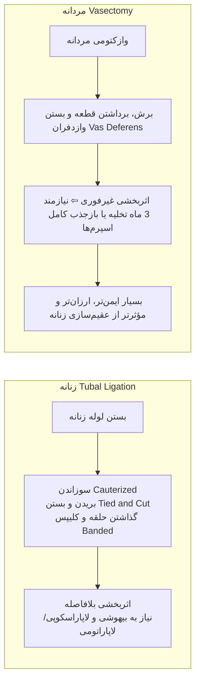

> [!important] تله تست: زمان اثربخشی وازکتومی
> وازکتومی **به‌هیچ‌وجه بلافاصله پس از عمل مؤثر نیست**! پاکسازی اسپرم‌های ذخیره‌شده در لوله‌های منی‌بر معمولاً **3 ماه** زمان برده و تا تأیید آزواسپرمی در آنالیز اسپرم، استفاده از روش کمکی سدی الزامی است.

---

## ۸. پیشگیری اضطراری از بارداری (Emergency Contraception - EC)

> [!info] تعریف و بازه زمانی
> مداخله درمانی نجات‌بخش حداکثر تا **120 ساعت (5 روز)** پس از مقاربت نامطمئن؛ با اثر معکوس فاصله زمانی: هرچه زودتر مصرف شود، اثربخشی به مراتب بالاتر است.

### مقایسه پروتکل‌های اضطراری
* **قرص‌های لوونورژسترل (LNG-only):** اثربخشی حدود **99%** (شکست درمان تنها 1%).
* **قرص‌های ترکیبی استروژن/پروژسترون (Yuzpe Method):** اثربخشی حدود **97%** (شکست درمان 3%).
* **آیودی مسی (Cu-IUD):** کارگذاری تا روز پنجم (120 ساعت) با اثربخشی بالاتر از 99%.

### اندیکاسیون‌های تجویز پیشگیری اضطراری
1. پارگی، سوراخ شدن یا خارج شدن کاندوم حین مقاربت.
2. فراموشی مصرف **3 قرص ترکیبی متوالی** یا بیشتر.
3. فراموشی مصرف قرص پروژسترونی تنها (POP) به میزان **بیش از 3 ساعت**.
4. تأخیر **بیش از 2 هفته** در تزریق عضلانی آمپول DMPA (تجاوز از پنجره مجاز).
5. تأخیر **بیش از 3 روز** در تزریق مجدد آمپول‌های ترکیبی 1 ماهه.
6. خروج غیرمنتظره IUD در زمانی به غیر از روزهای خونریزی قاعدگی.
7. سوءمحاسبه یا خطای رفتاری در روش طبیعی و منقطع همراه با شک به تماس منی.
8. وقوع تجاوز جنسی (Sexual Assault).

---

## ۹. روش‌های طبیعی تنظیم خانواده (Fertility Awareness Methods)
1. **روش تقویمی (Calendar / Rhythm Method):** محاسبه روزهای پرخطر باروری با کم کردن اعداد ثابت از طول کوتاه‌ترین و بلندترین سیکل‌های قبلی فرد (محدوده بارور سیکل 28 روزه: روزهای 8 الی 19).
2. **روش موکوس دهانه رحم (Cervical Mucus / Billings Method):** ارزیابی خصوصیات فیزیکی ترشحات واژن؛ پیدایش ترشحات شفاف، لغزنده و با قابلیت کشسانی بالا (*Spinnbarkeit / Clear and Stringy*) نشانه قطعی پیک استروژن و حوالی تخمک‌گذاری است.
3. **روش دمای پایه بدن (Basal Body Temperature - BBT):** ثبت روزانه دمای دهانی ناشتا؛ افت مختصر دما قبل از اوولاسیون و سپس **افزایش پایدار 0.2 الی 0.5 درجه سلسیوس** متعاقب ترشح ترموژنیک پروژسترون توسط جسم زرد در فاز لوتئال.

---

## ۱۰. سلسله‌مراتب اثربخشی روش‌ها (Efficacy & Failure Rates)

```chart
{
  "title": "درصد شکست روش‌های پیشگیری از بارداری در سال اول مصرف",
  "subtitle": "مقایسه استفاده معمولی (Typical Use) و استفاده بی‌نقص (Perfect Use)",
  "type": "bar",
  "data": [
    { "name": "Implants", "typical": 0.05, "perfect": 0.05 },
    { "name": "Vasectomy", "typical": 0.15, "perfect": 0.1 },
    { "name": "Female Sterilization", "typical": 0.5, "perfect": 0.5 },
    { "name": "IUD Cu-380A", "typical": 0.8, "perfect": 0.6 },
    { "name": "DMPA", "typical": 6.0, "perfect": 0.2 },
    { "name": "Oral OCP", "typical": 9.0, "perfect": 0.3 },
    { "name": "Diaphragm", "typical": 12.0, "perfect": 6.0 },
    { "name": "Male Condom", "typical": 18.0, "perfect": 2.0 },
    { "name": "Withdrawal", "typical": 22.0, "perfect": 4.0 },
    { "name": "Fertility Awareness", "typical": 24.0, "perfect": 4.0 },
    { "name": "Spermicides", "typical": 28.0, "perfect": 18.0 }
  ],
  "metrics": [
    { "key": "typical", "name": "استفاده معمول (Typical Use %)", "color": "#dc2626" },
    { "key": "perfect", "name": "استفاده بی‌نقص (Perfect Use %)", "color": "#2563eb" }
  ]
}
```

> [!important] قاعده طلایی وابستگی به مصرف‌کننده
> هرچه یک متد کنتراسپتیو استقلال بیشتری از رفتار، حافظه و مهارت بیمار داشته باشد (مانند *ایمپلنت*، *IUD* و سپس *آمپول تزریقی*)، فاصله میان استفاده صحیح (Perfect Use) و استفاده معمول روزمره (Typical Use) کمتر بوده و ضریب شکست حداقل باقی می‌ماند.

---

## ۱۱. مواد قانونی مرتبط با پیشگیری از بارداری (قانون جوانی جمعیت)

> [!warning] مفاد امتحانی قانون حمایت از خانواده و جوانی جمعیت
> * **ماده 51:** توزیع رایگان، ارائه آزاد اقلام مرتبط با پیشگیری و کارگذاشتن این وسایل یا تشویق به استفاده از آنها در شبکه بهداشتی وابسته به دانشگاه‌های علوم پزشکی **ممنوع** است.  
>   * *تبصره 1:* ارائه خدمات پیشگیری صرفاً در موارد ایجاد خطر جانی برای مادر یا جنین با تصویب ستاد عالی جمعیت مجاز است.  
>   * *تبصره 2:* فروش داروهای هورمونی پیشگیری در داروخانه‌ها مقید به نسخه رسمی پزشک است.
> * **ماده 52:** عقیم‌سازی دائم زنان و مردان (وازکتومی و توبکتومی) یا روش‌های با احتمال ضعیف برگشت‌پذیری **ممنوع** است؛ مگر در موارد تهدید جانی و عوارض شدید بدنی غیرقابل درمان زن در صورت بارداری یا زایمان.
> * **ماده 46:** الزام وزارت بهداشت به بازنگری کتب آموزشی در راستای ترویج فرزندآوری، تبیین مضرات سقط، ممانعت از سزارین غیرضروری و اعطای پاداش مالی پلکانی به مراقبین سلامت به ازای تولد فرزند اول تا پنجم.
# جلسه ۱۳: تغذیه با شیر مادر و مراقبت‌های زایمان

## ۱. هزار روز اول حیات و شاخص‌های کلان سلامت (First 1000 Days)

> [!info] تعریف ۱۰۰۰ روز اول زندگی
> بازه زمانی طلایی تکامل انسان از لحظه لقاح تا پایان ۲ سالگی کودک شامل: **۲۷۰ تا ۲۸۰ روز بارداری** + **۳۶۵ روز سال اول** (۰ تا ۱۲ ماه) + **۳۶۵ روز سال دوم** (۱۳ تا ۲۴ ماه).

* **ابعاد رشد در پایان ۱۰۰۰ روز اول نسبت به فرد بالغ**:

  1. **رشد مغزی:** کسب **بیش از ۷۰%** حجم نهایی مغز.

  2. **رشد قدی:** دستیابی به **۴۰%** قد نهایی بزرگسالی (قد ۱ سالگی: حدود *۶۴ تا ۷۵ سانتی‌متر*؛ وزن ۱ سالگی: **۳ برابر وزن تولد**).

  3. **رشد وزنی:** دستیابی به **۲۵%** وزن نهایی بزرگسالی.

* **بار مرگ‌ومیر نوزادی**:

  * سالانه **۴ میلیون مرگ** در ماه اول زندگی (*دوره نئوناتال*) از مجموع ۱۳۶ میلیون تولد در جهان.

  * **۹۸% مرگ‌های نوزادی** در کشورهای کم‌توسعه رخ می‌دهد.

  * رعایت الگوی صحیح شیردهی جان حداقل **۱ میلیون نوزاد** را در سال نجات می‌دهد.

* **پیامدهای تغذیه مطلوب در ۱۰۰۰ روز اول**: بقای نوزاد، ارتقای ضریب هوشی و عملکرد تحصیلی، کاهش هزینه‌های درمان، تکامل ایمنی پایدار، کاهش بیماری‌های قلبی-عروقی و چاقی در بزرگسالی.

```chart
{
  "title": "مقایسه شاخص‌های فعلی شیردهی با تارگت 2030 (بر حسب درصد)",
  "subtitle": "درصد وضعیت فعلی در مقایسه با هدف‌گذاری جهانی WHO",
  "type": "bar",
  "data": [
    { "name": "شیردهی ساعت اول", "current": 42, "target": 70 },
    { "name": "تغذیه انحصاری تا ۶ ماه", "current": 41, "target": 70 },
    { "name": "تداوم شیردهی تا ۱ سال", "current": 71, "target": 80 },
    { "name": "تداوم شیردهی تا ۲ سال", "current": 45, "target": 60 }
  ],
  "metrics": [
    { "key": "current", "name": "درصد وضعیت فعلی", "color": "#64748b" },
    { "key": "target", "name": "هدف‌گذاری سازمان جهانی بهداشت (2030 Target)", "color": "#ef4444" }
  ]
}
```

## ۲. آناتومی پستان و فیزیولوژی لاکتوژنز (Lactogenesis)

> [!info] ساختار بافتی پستان
> هر پستان دارای **۱۵ تا ۲۰ لوب** ترشحی است؛ هر لوب متشکل از آلوئول‌ها و مجاری شیری بوده که در نهایت از طریق **۱۰ تا ۱۲ مجرای باریک** (*Lactiferous Ducts*) در سطح نوک پستان (*Nipple*) باز می‌شوند. غدد مونتگومری (*Tubercles of Montgomery*) روی هاله پستان (*Areola*) ترشح سبوم و محافظت موضعی را بر عهده دارند.

* **دینامیک وزنی پستان مادر**:

  * قبل از بارداری: حدود **۲۰۰ گرم**.

  * انتهای بارداری (نزدیک ترم): **۴۰۰ تا ۶۰۰ گرم** (افزایش *۲ تا ۳ برابری*).

  * دوران شیردهی: **۶۰۰ تا ۸۰۰ گرم**.

* **ترشح پره‌کلستروم (Pre-colostrum)**: در اواخر بارداری روزانه **۲ تا ۳ سی‌سی** ترشح شده (حداکثر تا *۳۸ سی‌سی* در روز گزارش گردیده).

* **کنترل هورمونی ترشح و خروج شیر**:

  1. **پرولاکتین (Prolactin)**: ترشح از *هیپوفیز قدامی*؛ محرک ساخت و تولید شیر در آلوئول‌ها؛ با مکیدن نوزاد به صورت پالس افزایش می‌یابد؛ سطح پایه در شب‌ها بالاتر است (*اهمیت حیاتی شیردهی شبانه*).

  2. **اکسی‌توسین (Oxytocin)**: ترشح از *هیپوفیز خلفی*؛ محرک انقباض سلول‌های میواپیتلیال اطراف آلوئول‌ها جهت خروج و جهش شیر (*Milk Ejection Reflex*)؛ انقباض رحم و جمع شدن آن (*Involusion*) و مهار هموراژ پس از زایمان. اضطراب، درد و خستگی مانع ترشح آن و آرامش و اعتمادبه‌نفس تسهیل‌کننده آن است.

  3. **استروژن و پروژسترون**: در حاملگی با مهار گیرنده‌های پرولاکتین در پستان مانع ترشح شیر می‌شوند؛ با **خروج جفت** سطح سرمی آن‌ها ناگهان سقوط کرده و فاز لاکتوژنز فعال می‌شود.

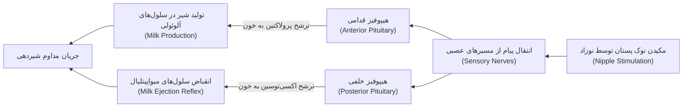

## ۳. مراحل سه‌گانه و ترکیبات شیر مادر

> [!info] تغییر بیوشیمیایی شیر در ساعت ۳۰ پس از زایمان
> رأس **۳۰ ساعت پس از زایمان** مستقل از حجم شیر مکیده‌شده توسط نوزاد رخ می‌دهد: افزایش ترشح **لاکتوز، آلفا-لاکتالبومین، چربی، سیترات و گلوکز** همراه با کاهش غلظت **لاکتوفرین و ایمونوگلوبولین‌ها**.

1. **آغوز یا کلستروم (Colostrum)**:

   * زمان ترشح: **۷ تا ۱۰ روز اول** (به‌ویژه *۲ تا ۳ روز اول*).

   * ویژگی فیزیکی: کم‌حجم، غلیظ، لیمویی/زرد رنگ.

   * ویژگی بیوشیمیایی: غنی از **پروتئین، ایمونوگلوبولین‌ها (به‌ویژه sIgA) و سدیم**؛ دارای **لاکتوز و لیپید کمتر** نسبت به شیر رسیده.

   * عملکرد بالینی: عملکرد **مسهل طبیعی** جهت دفع سریع مکونیوم و **کاهش بروز ایکتر نئوناتال**؛ پوشش مخاط روده و جلوگیری از نفوذ عوامل پاتوژن و آلرژن.

2. **شیر انتقالی (Transition Milk)**:

   * زمان ترشح: از پایان آغوز تا **۶ هفتگی** تولد.

   * ویژگی: ترکیبی بینابینی؛ کاهش تدریجی پروتئین و ایمونوگلوبولین‌ها همگام با افزایش قند و چربی.

3. **شیر رسیده (Mature Milk)**:

   * زمان ترشح: پس از **۶ هفتگی** (از هفته *۱۴ تا ۱۵* در تمامی مادران کاملاً مستقر است).

   * ویژگی: کالری و حجم بالا؛ تامین کامل نیازهای تغذیه‌ای و رشد شیرخوار.

| شاخص بیوشیمیایی (در ۱۰۰ میلی‌لیتر) | کلستروم (روز اول) | شیر ماچور (رسیده) | اهمیت فیزیولوژیک و تستی                                           |
| ---------------------------------- | ----------------- | ----------------- | ----------------------------------------------------------------- |
| **کالری (درصد / Kcal)**            | **۵۷**            | **۶۰**            | شیر ماچور به دلیل چربی و قند بالاتر، دانسیته کالری بیشتری دارد.   |
| **لاکتوز (گرم)**                   | **۲۰**            | **۳۵**            | قند شیر ماچور حدود ۱٫۷۵ برابر کلستروم است (تامین انرژی مغز).      |
| **پروتئین (گرم)**                  | **۳۲**            | **۹**             | پروتئین کلستروم **بیش از ۳٫۵ برابر** شیر رسیده است (عمدتاً sIgA). |
| **چربی (گرم)**                     | **۲۱**            | **۲۹**            | لیپید شیر با تکامل مراحل شیردهی افزایش می‌یابد.                   |

> [!warning] دینامیک شیر در طول یک وعده شیردهی (Fore vs Hind Milk)
>
> * **شیر ابتدایی (Foremilk)**: آبکی، رقیق و شفاف؛ محتوای بالای لاکتوز و پروتئین؛ وظیفه اصلی: **رفع تشنگی نوزاد**.
>
> * **شیر انتهایی (Hindmilk)**: سفید، غلیظ و شیری؛ **حاوی چربی بسیار بالا و انرژی متراکم**؛ وظیفه اصلی: **ایجاد سیری پایدار و وزن‌گیری مطلوب**.
>
> * *نکته امتحانی*: تخلیه ناقص پستان اول و تعویض زودرس به پستان دوم باعث محرومیت شیرخوار از Hindmilk، اختلال وزن‌گیری و گرسنگی مداوم می‌شود.


> [!tip] ویژگی زیستی شیر مادر نوزاد نارس (<۲۷ هفته بارداری)
> شیر مادر نوزاد نارس حاوی **پروتئین بیشتر، سدیم و املاح معدنی بالاتر (به‌ویژه آهن)** و مقادیر فزاینده **فاکتورهای ایمنی** نسبت به شیر مادر نوزاد رسیده است؛ لذا بهترین تغذیه برای نارس، شیر مادر خودش می‌باشد.

## ۴. اصول بالینی تغذیه انحصاری، اتصال به پستان و شاخص‌های کفایت شیر

> [!info] تعریف تغذیه انحصاری با شیر مادر (Exclusive Breastfeeding)
> تغذیه نوزاد **فقط و فقط با شیر مادر تا پایان ۶ ماهگی** بدون تجویز آب، آب‌قند، مایعات کمکی یا شیر مصنوعی؛ مصرف قطره‌های ویتامینی و مکمل‌های دارویی بلامانع است.

* **ساعت طلایی (The Magical Hour)**: برقراری تماس پوست به پوست (*Skin-to-Skin Contact*) بلافاصله پس از زایمان (حتی در سزارین) در اولین ساعت تولد. پیامدها: پایداری درجه حرارت، تثبیت گلیکمی و متابولیسم، ترشح ضربانی اکسی‌توسین، تسریع خروج جفت، کاهش PPH، کاهش پس‌درد، کاهش استرس و ایجاد کولونیزاسیون نوزاد با فلور طبیعی مادر.

* **تکنیک اتصال صحیح به پستان (Latch-on)**:

  1. چانه نوزاد کاملاً در تماس مماس با پستان مادر باشد.

  2. دهان نوزاد کاملاً باز (*زاویه باز >۱۲۰ درجه*) باشد.

  3. لب تحتانی به طرف بیرون برگشته باشد (*Everted*).

  4. بخش عمده هاله پستان (*Areola*) به‌ویژه از قسمت تحتانی داخل دهان نوزاد باشد (نه صرفاً نوک پستان).

* **الگوی شیردهی مطلوب**: شیردهی بدون جدول زمان‌بندی صلب و صرفاً **بر حسب تقاضای نوزاد (On-demand)**؛ **۱۰ تا ۱۲ بار در ۲۴ ساعت** (هر *۱٫۵ تا ۲ ساعت* در روز و حداکثر فواصل *۳ ساعته* در شب). پس از شیرخوردن، نوزاد به حالت عمودی جهت آروغ‌زدن نگه‌داشته شود.

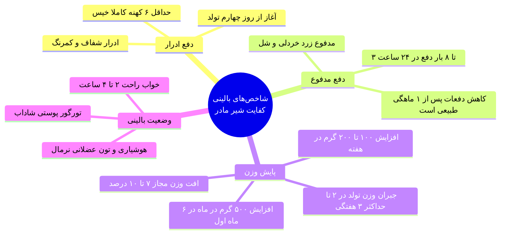

> [!danger] تله‌های تستی: مواردی که هرگز دال بر ناکافی بودن شیر مادر نیستند!
>
> 1. *گریه نوزاد*: شایع‌ترین علل شامل کولیک، کهنه مرطوب، خستگی، نور/صدای محیط، گرما یا سرمای اتاق.
>
> 2. *کوچک بودن اندازه پستان‌ها*: اندازه پستان وابسته به بافت چربی است، نه بافت ترشحی غددی.
>
> 3. *زود به زود شیر خوردن نوزاد*: ناشی از تخلیه سریع معده به دلیل هضم فوق‌العاده سبک شیر مادر است.
>
> 4. *کم بودن حجم شیر دوشیده‌شده*: پمپ و دست مکانیسم مکش فیزیولوژیک دهان نوزاد را ندارند.
>
> 5. *حجم کم شیر در ۲ تا ۳ روز اول*: ترشح آغوز کم‌حجم اما فوق‌العاده متراکم، نیاز فیزیولوژیک نوزاد را تامین می‌کند.
>
> 6. *مکیدن طولانی پستان*: عمدتاً ناشی از Latch-on نامناسب و عدم تخلیه مؤثر است، نه فقدان شیر مادر.

## ۵. دوشیدن، ذخیره‌سازی، زنجیره سرما و بانک شیر

* **اندیکاسیون‌های دوشیدن شیر**: اشتغال مادر، نوزاد نارس یا بستری در NICU، مادر بیمار، احتقان شدید پستان، شقاق یا آبسه پستان.

* **تکنیک دوشیدن**: شستشوی دست، آرامش روانی، کمپرس گرم ۵ تا ۱۰ دقیقه قبل از دوشیدن، ماساژ دورانی، نوشیدن مایعات گرم و تماشای نوزاد یا تصویر وی؛ استفاده از ظروف دهانه‌گشاد شیشه‌ای یا پلی‌پروپیلن سخت شفاف؛ پر کردن تا **سه چهارم ظرف** و ثبت تاریخ/ساعت.

| محیط نگهداری شیر دوشیده‌شده | درجه حرارت استاندارد                         | حداکثر زمان ماندگاری مجاز               |
| --------------------------- | -------------------------------------------- | --------------------------------------- |
| **دمای اتاق (محیط)**        | ۲۵ درجه سانتی‌گراد (دور از نور/حرارت مستقیم) | **تا ۴ ساعت**                           |
| **طبقات داخلی یخچال**       | ۲ تا ۴ درجه سانتی‌گراد                       | **تا ۴۸ ساعت**                          |
| **جایخی داخل یخچال**        | زیر صفر درجه                                 | **تا ۲ هفته**                           |
| **فریزر خانگی دوکاره**      | منفی ۱۸ تا منفی ۲۰ درجه سانتی‌گراد           | **۳ ماه** (در شرایط استاندارد تا ۶ ماه) |

> [!info] استانداردهای بانک شیر انسان (Human Milk Bank)
> مرکزی جهت جمع‌آوری، غربالگری میکروبی و ویروسی، **پاستوریزاسیون** و ذخیره‌سازی منجمد شیرهای اهدایی مادران مازاد بر نیاز. توزیع به نوزادان نارس، کم‌وزن و محروم از شیر مادر به صورت کاملاً رایگان انجام می‌پذیرد. *مادران دارای عفونت مسری حاد یا سل فعال صلاحیت اهدا ندارند*.

## ۶. مقایسه بیوشیمیایی و ایمونولوژیک شیر مادر، شیر گاو و شیر خشک

| مولفه بیولوژیک            | شیر مادر                                      | شیر گاو                                    | شیر خشک صنعتی (شیر مصنوعی)                 |
| ------------------------- | --------------------------------------------- | ------------------------------------------ | ------------------------------------------ |
| **سلول زنده و آنتی‌بادی** | **دارد** (لکوسیت، ماکروفاژ، sIgA، لکوتوفرین)  | **فاقد سلول زنده** در شیر پاستوریزه        | **کاملاً فاقد فاکتورهای زیستی** و ایمنی    |
| **پروتئین و سدیم**        | متناسب با کلیه نوزاد (وی/کازئین ایده‌آل)      | **بسیار بالا** (فشار اسمولار و آسیب کلیوی) | تعدیل‌شده، اما فاقد تنوع زیستی طبیعی       |
| **پروفایل لیپید**         | سرشار از چربی اشباع‌‌نشده و **آنزیم لیپاز**   | اسیدهای چرب غیر اشباع بالا ولی هضم سنگین   | چربی گیاهی هیدروژنه فاقد لیپاز فعال        |
| **جذب آهن و املاح**       | غلظت کمتر، اما **جذب بسیار بالا (۷۰ تا ۹۰%)** | آهن بالا اما **جذب فوق‌العاده ناچیز**      | آهن بالا با جذب پایین (یبوست و تغییر فلور) |
| **ویتامین‌ها**            | غنی و دارای فراهمی زیستی بالا                 | در حرارت دیدن تا حد زیادی تخریب می‌شود     | صنعتی و صناعی افزوده‌شده                   |
| **دینامیک در طول زمان**   | **کاملاً پویا** (تغییر با سن، روز و هر وعده)  | ترکیب شیمیایی ایستا و ثابت                 | کاملاً یکنواخت و غیرقابل انعطاف            |

> [!warning] خطرات اپیدمیولوژیک شیر مصنوعی
> افزایش ریسک ابتلا به **عفونت‌های تنفسی، گاستروآنتریت و اسهال، اوتیت مدیا، UTI، مننژیت، آسم، اگزما و دیابت**؛ خطرات خطای تکنیکی رقیق‌سازی (سوءتغذیه در رقت زیاد و نارسایی حاد کلیه در غلظت بالا)؛ افزایش ریسک سندرم مرگ ناگهانی نوزاد (*SIDS*)، چاقی و آترواسکلروز در بزرگسالی؛ بروز مال‌اکلوژن و ناهنجاری فک و صورت.

## ۷. پاتولوژی‌های پستان در دوره شیردهی: تشخیص و درمان

| بیماری پستان                            | تظاهرات بالینی کلیدی                                                                     | اتیولوژی زمینه‌ای                                         | پروتکل درمانی و مدیریت شیردهی                                                                        |
| --------------------------------------- | ---------------------------------------------------------------------------------------- | --------------------------------------------------------- | ---------------------------------------------------------------------------------------------------- |
| **احتقان پستان (Engorgement)**          | تورم دوطرفه، سفتی شدید، دردناک، براق شدن پوست، **تب حداکثر تا ۲۴ ساعت** (روز ۳-۴ زایمان) | احتباس لنفاوی/وریدی همگام با شروع تولید شیر ماچور         | تخلیه کامل با شیردهی مکرر، کمپرس گرم قبل شیردهی، کمپرس سرد بعد آن، مسکن ساده (**آنتی‌بیوتیک ممنوع**) |
| **نوک پستان فرورفته (Inverted Nipple)** | نوک پستان صاف یا به داخل کشیده شده                                                       | آناتومیک مادرزادی یا ادم بارداری                          | تحریک مکانیکی، کشیدن نوک پستان با سرنگ معکوس ده‌سی‌سی یا پمپ دستی، تماس پوست به پوست                 |
| **شقاق پستان (Nipple Fissure)**         | شقاق، زخم‌های طولی دردناک نوک، سوزش شدید حین مکیدن، گاهی خونریزی                         | **خطای Latch-on** (مکیدن صرفاً نوک پستان بدون گرفتن هاله) | اصلاح Latch-on، مالیدن قطره‌ای از شیر مادر روی زخم (ویتامین A و خواص ترمیم‌کننده)، گرمای خشک         |
| **ماستیت (Mastitis)**                   | توده قرمز، داغ، متسع و لوکالیزه، علائم شبه‌آنفلوآنزا، **تب مداوم و طولانی**              | استاز شیر و ورود پاتوژن (*S. aureus*)                     | دوشیدن مکرر هر ۰٫۵ تا ۳ ساعت، آنتی‌بیوتیک سیستمیک، هیدراتاسیون، مسکن (**شیردهی قطع نمی‌شود**)        |
| **آبسه پستان (Breast Abscess)**         | توده مواج (*Fluctuant*)، درد خنجری بسیار شدید، تب و لرز سپتیک                            | عدم درمان مناسب یا ناکامل ماستیت                          | درناژ جراحی یا آسپیراسیون سوزنی + آنتی‌بیوتیک سیستمیک (مدیریت شیردهی طبق پروتکل ذیل)                 |

> [!danger] قوانین قطعی شیردهی در آبسه پستان
>
> 1. در صورت برش جراحی (*Incision*) دور از هاله: شیردهی از پستان مبتلا بلامانع است.
>
> 2. در صورت شکاف و برش **نزدیک هاله پستان**: شیردهی مستقیم از پستان مبتلا به مدت **۴۸ تا ۷۲ ساعت ممنوع** است؛ اما **دوشیدن منظم و دور ریختن شیر پستان مبتلا الزامی است** تا استاز تشدید نشود.
>
> 3. شیردهی از **پستان سالم باید بدون وقفه ادامه یابد**.

## ۸. فارماکولوژی، بیماری‌های عفونی مادر و کنترااندیکاسیون‌های شیردهی

### الف) عفونت‌های مادری و نحوه مواجهه بالینی

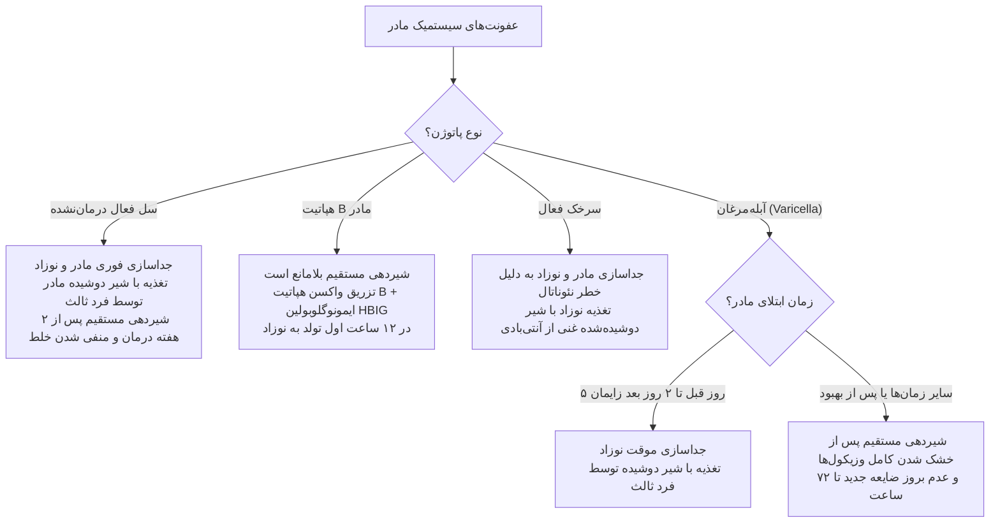

### ب) مصرف داروها در دوران شیردهی

* *قاعده کلی*: مصرف دارو باید **بلافاصله پس از اتمام یک وعده شیردهی** انجام گیرد تا غلظت دارویی در شیر وعده بعدی به حداقل ممکن برسد.

* *داروهای مجاز با دوز استاندارد*: استامینوفن، ایبوپروفن، آسپرین با دوز پایین، اغلب آنتی‌بیوتیک‌های پنی‌سیلینی و سفالوسپورینی، آنتی‌هیستامین‌ها به مدت کوتاه، داروهای ضد فشارخون شایع.

* *داروهای با منع قطعی شیردهی*: **متوتروکسات** (*Methotrexate*)، **هیدروکسی‌اوره** (*Hydroxyurea*)، **ترکیبات رادیواکتیو**، **لیتیوم**، **فنین‌دیون**، **ارگوتامین** (دوز درمانی میگرن)، **تاموکسیفن**، **فن‌سیکلیدین (PCP)** و اعتیاد به مخدرهای وریدی تزریقی (**کوکائین، هروئین**). در دوره درمان موقت با این داروها، شیر باید دوشیده و دور ریخته شود.

### ج) موارد تجویز شیر خشک و منع شیر مادر

1. **اختلالات متابولیک ارثی نوزاد**:

   * **گالاکتوزومی کلاسیک**: منع مطلق شیر مادر؛ تجویز الزامی شیرخشک فاقد لاکتوز بر پایه سویا.

   * **فنیل‌کتونوری (PKU)**: شیردهی نسبی با شیر مادر همراه با فرمولای ویژه فاقد فنیل‌آلانین تحت پایش سطح سرمی اسید آمینه.

2. **بیماری‌های مادر**: جنون و پسیکوز پس از زایمان، بیماری‌های صعب‌العلاج پیشرفته کبدی، کلیوی یا قلبی، سوختگی شدید و وسیع هر دو پستان.

3. **عوامل اجتماعی/حقوقی**: فوت مادر، جدایی والدین و سرپرستی انحصاری پدر، فرزندخواندگی، چندقلویی با افت وزن شدید مقاوم.

## ۹. مراحل زایمان طبیعی (Labor)، پایش پریناتال و اورژانس‌های مامایی

> [!info] مراحل مکانیکی زایمان طبیعی
>
> * **مرحله اول**: از شروع انقباضات منظم رحمی (*دردهای حقیقی*) تا اتساع کامل دهانه رحم (**۱۰ سانتی‌متر**).
>
> * **مرحله دوم**: از اتساع کامل سرویکس تا **خروج کامل نوزاد**.
>
> * **مرحله سوم**: از خروج نوزاد تا **خروج کامل جفت و پرده‌ها** (انقباض رحم تا سطح ناف جهت هموستاز).
>
> * **مرحله چهارم**: **۱ ساعت اول پس از زایمان** جهت پایش دقیق و پیشگیری از هموراژ ناشی از آتونی.

| متغیر فیزیولوژیک مرحله زایمان  | نخست‌زا (Primipara)                 | چندزا (Multipara)                  | نکته کلیدی امتحانی                                        |
| ------------------------------ | ----------------------------------- | ---------------------------------- | --------------------------------------------------------- |
| **طول مدت مرحله اول**          | **۶ تا ۱۴ ساعت** (میانگین: ۱۴ ساعت) | **۲ تا ۱۰ ساعت** (میانگین: ۸ ساعت) | سرویکس در فاز نهفته نرم و ۳-۴ سانتی‌متر باز می‌شود.       |
| **سرعت اتساع فاز فعال سرویکس** | **۱ سانتی‌متر در ساعت**             | **۱٫۲ سانتی‌متر در ساعت**          | اتساع کندتر از این حد نیازمند ارزیابی دیستوشی است.        |
| **طول مدت مرحله دوم**          | **۳۰ دقیقه تا ۲-۳ ساعت**            | **۵ تا ۳۰ دقیقه**                  | در نخست‌زا نیاز به هدایت مانور والسالوا و تنفس عمیق دارد. |
| **طول مدت مرحله سوم**          | **صفر تا ۳۰ دقیقه**                 | **صفر تا ۳۰ دقیقه**                | جفت‌ماندگی بالای ۳۰ دقیقه اورژانس مامایی است.             |

> [!danger] علل اپیدمیولوژیک مورتالیتی مادران در جهان
>
> 1. رتبه اول: **خونریزی بعد از زایمان (PPH)** ناشی از آتونی رحم (عمدتاً در ۲۴ ساعت اول و هفته اول).
>
> 2. رتبه دوم: **اختلالات فشار خون و پره‌اکلامپسی / اکلامپسی**.
>
> 3. رتبه سوم: **عفونت‌های پس از زایمان (Puerperal Sepsis)**.
>
> 4. رتبه چهارم: **بیماری‌های قلبی-عروقی زمینه‌ای**.

* **پروتکل مانیتورینگ حین زایمان**:

  * *آزمایشگاهی*: تعیین گروه خون، Rh، کراس‌مچ، Hb/Hct، پروتئین و گلوکز ادرار.

  * *علائم حیاتی مادر*: نبض، فشار خون، تنفس و دما هر **۱ تا ۲ ساعت** در زایمان طبیعی؛ برقراری رگ باز وریدی؛ پس از خروج جفت: کنترل علائم حیاتی **هر ۱۵ دقیقه تا ۱ ساعت**.

  * *سمع ضربان قلب جنین (FHR)*: در افراد کم‌خطر: مرحله اول هر **۳۰ دقیقه** و مرحله دوم هر **۱۵ دقیقه**. در بارداری‌های پرخطر: مرحله اول هر **۱۵ دقیقه** و مرحله دوم هر **۵ دقیقه**.

* **مادران در معرض خطر بارداری پرخطر**: قد کمتر از **۱۴۵ سانتی‌متر**، وزن پیش از بارداری کمتر از **۴۵ کیلوگرم**، سن کمتر از **۱۸ سال** یا بالای **۴۰ سال**، پاریتی **بیش از ۴ بارداری**، فاصله بارداری کمتر از **۳ سال**، سابقه پره‌اکلامپسی، سابقه مرده‌زایی/IUFD، سابقه سزارین قبلی، سابقه خروج جفت با دست.

* **اورژانس‌های ماژور مامایی (Labor Emergencies)**:

  1. دردهای تنبل یا توقف انقباضات رحمی پس از پارگی کیسه آب (*PROM*).

  2. گذشت **۱ ساعت** از پارگی کیسه آب بدون پیشرفت زایمان علیرغم انقباضات مناسب.

  3. پرزانتاسیون غیرطبیعی جنین (بریچ، نمایش دست یا **پرولاپس بند ناف**).

  4. برادی‌کاردی جنینی (*FHR <110 bpm*)، تاکی‌کاردی شدید (*FHR >160 bpm*) یا ضربان نامنظم.

  5. دفع مایع آمنیوتیک آغشته به مکونیوم سبز رنگ (نشانه دیسترس و هیپوکسی جنین).

  6. خونریزی رحمی شدید حین زایمان یا کلاپس عروقی مادر.

  7. عدم خروج جفت پس از **۳۰ دقیقه تا ۱ ساعت**.

  8. تب مادر بالای **۳۸ درجه سانتی‌گراد** حین لیبر.

## ۱۰. مراقبت‌های نوزاد سالم در بدو تولد و معیار نمره‌دهی آپگار (Apgar)

> [!info] ویژگی‌های بیومتریک و فیزیولوژیک نوزاد ترم و سالم (AGA)
> نوزاد متولدشده بین **آغاز هفته ۳۷ (و ۰ روز)** تا **پایان هفته ۴۰ (و ۶ روز)** سن جنینی که فاقد هرگونه آنومالی و سابقه مادری پرخطر باشد.
>
> * **وزن تولد**: **۲٫۵ تا ۳٫۵ کیلوگرم** (میانگین: **۳ کیلوگرم**).
>
> * **قد**: **۴۸ تا ۵۲ سانتی‌متر** (میانگین: **۵۰ سانتی‌متر**).
>
> * **دور سر (HC)**: **۳۲ تا ۳۷ سانتی‌متر** (میانگین: **۳۵ سانتی‌متر**).
>
> * **تعداد تنفس نرمال**: **۳۰ تا ۶۰ بار در دقیقه**.
>
> * **ضربان قلب نرمال**: **۱۲۰ تا ۱۶۰ ضربه در دقیقه**.
>
> * **دمای آگزیلاری نرمال**: **۳۶٫۵ تا ۳۷٫۴ درجه سانتی‌گراد**.

* **اقدامات بالینی بلافاصله پس از زایمان**:

   1. دمای اتاق زایمان در محدوده **۲۵ تا ۲۸ درجه سانتی‌گراد**.

   2. قرار دادن نوزاد در وضعیت تخلیه ترشحات، ساکشن ملایم دهان و سپس بینی.

   3. خشک کردن بلافاصله با حوله گرم و پوشاندن سر با کلاه جهت جلوگیری از هیپوترمی.

   4. **کلمپ بند ناف پس از توقف ضربان نبض در بند ناف** با ابزار استریل (مانع از دست رفتن **۱۰ میلی‌لیتر خون نوزاد** می‌شود)؛ ضدعفونی روزانه با **الکل سفید** تا زمان افتادن بند ناف.

   5. پاکسازی پلک‌ها و چکاندن قطره **نیترات نقره** جهت پروفیلاکسی گونوکوکی.

   6. *پرهیز از شستشوی فوری نوزاد* با آب جهت حفظ ورنیکس و پیشگیری از هایپوترمی.

   7. تزریق عضلانی **۱ میلی‌گرم ویتامین K محلول در آب** در عضله واستوس لترالیس جهت مهار بیماری‌های خونریزی‌دهنده نوزادی.

   8. **واکسیناسیون بدو تولد**: **BCG** و **هپاتیت B** در زایشگاه؛ قطره خوراکی فلج اطفال (**OPV**) در زمان ترخیص.

   9. غربالگری بیماری‌ها در **روز ۳ تا ۵ تولد**: کم‌کاری مادرزادی تیروئید، فنیل‌کتونوری (PKU) و کمبود آنزیم G6PD.

  10. هم‌اتاقی مادر و نوزاد (*Rooming-in*) و تماس تخت‌به‌تخت (*Bedding-in*).

| معیار ارزیابی (Sign)                    | نمره صفر (۰)                      | نمره یک (۱)                               | نمره دو (۲)                            |
| --------------------------------------- | --------------------------------- | ----------------------------------------- | -------------------------------------- |
| **تعداد ضربان قلب (Heart Rate)**        | فاقد ضربان (Absent)               | **کمتر از ۱۰۰ ضربه** در دقیقه             | **بیش از ۱۰۰ ضربه** در دقیقه           |
| **تلاش تنفسی (Respiratory Effort)**     | فاقد تنفس (Apnea)                 | آهسته، سطحی و نامنظم                      | **خوب، تنفس منظم یا گریه فعال قوی**    |
| **تونوسیته عضلانی (Muscle Tone)**       | کاملاً شل و فلاپسی (Flaccid)      | مقداری فلکسیون در اندام‌ها                | **حرکات فعال و فلکسیون کامل اندام‌ها** |
| **پاسخ به تحریک (Reflex Irritability)** | فاقد هرگونه پاسخ                  | گریه ضعیف، لرزش یا شکلک صورت              | **سرفه، عطسه یا گریه بلند و پرقدرت**   |
| **رنگ پوست (Color)**                    | کاملاً آبی، سیانوتیک یا رنگ‌پریده | **آکروسیانوز** (تنه صورتی، اندام‌ها کبود) | **کاملاً صورتی در تنه و اندام‌ها**     |

> [!tip] تفسیر بالینی نمره آپگار
>
> * **نمره ۷ تا ۱۰**: وضعیت طبیعی و پایدار (نیاز به مراقبت معمول).
>
> * **نمره ۳ تا ۶ (یا کمتر از ۷)**: دپرسیون نوزادی؛ **نیاز فوری به احیای نوزاد (Resuscitation)**؛ *در صورت عدم برقراری تنفس پس از ۱ دقیقه از تولد، پروتکل احیا باید بلافاصله آغاز گردد*.
>
> * **نمره کمتر از ۳**: خفگی شدید (*Asphyxia*) با مورتالیتی بسیار بالا و خطر آسیب ایسکمیک مغزی.

## ۱۱. طبقه‌بندی اختلالات وزن تولد و سن حاملگی

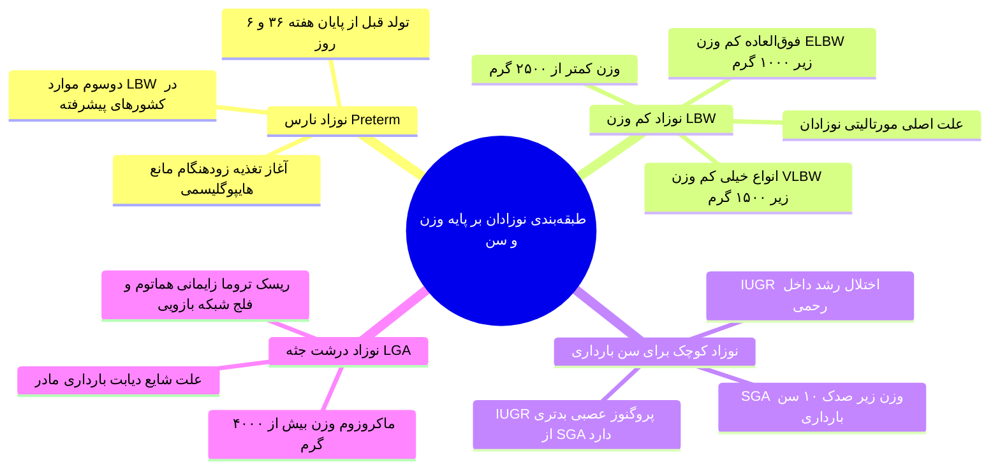

* **۳ علت عمده تولد نوزاد کم‌وزن (LBW) در کشورهای در حال توسعه**:

  1. **سوءتغذیه مادر**.

  2. **عفونت‌های دوران بارداری** (مالاریا، سل، عفونت‌های ادراری درمان‌نشده، کوریوآمنیونیت).

  3. **بارداری‌های مکرر و با فواصل کوتاه**.

* **سایر ریزفاکتورهای LBW**: سن بسیار کم مادر (<۱۸) یا بالای ۴۰ سال، جثه کوچک مادر، کار بدنی سنگین، مصرف سیگار و الکل در بارداری، فقر و شرایط نامساعد اقتصادی-اجتماعی.

* *تفاوت تشخیصی SGA و IUGR*: در نوزادان *SGA* تمامی پارامترها و ابعاد به صورت متقارن کوچکند و روند طبیعی را طی کرده‌اند؛ در حالی که در *IUGR* پروسه پاتولوژیک جفتی مانع رشد نرمال گردیده و ناهماهنگی بین رشد سر و تنه یا تکامل احشایی مشهود بوده و پروگنوز عصبی و مورتالیتی نامطلوب‌تری دارند.

## ۱۲. رویکرد بالینی به زردی نوزادی (Neonatal Jaundice)

> [!info] مکانیسم بیوشیمیایی ایکتر
> افزایش تجزیه اریتروسیت‌های جنینی (به علت طول عمر کمتر RBC جنینی و توده بالای سلولی) همگام با عدم بلوغ آنزیم کبدی گلوکورونیل‌ترانسفراز (*UDPG-T*) و تشدید چرخه روده‌ای-کبدی (*Enterohepatic Circulation*). عارضه مرگبار ایکتر پاتولوژیک درمان‌نشده، عبور بیلی‌روبین غیرکونژوگه از سد خونی-مغزی و رسوب در عقده‌های قاعده‌ای و ساقه مغز یا **کرن‌ایکتروس (Kernicterus)** است که منجر به مرگ، کری حسی-عصبی، فلج مغزی کوریوآتتوئید و عقب‌ماندگی ذهنی غیرقابل برگشت می‌گردد.

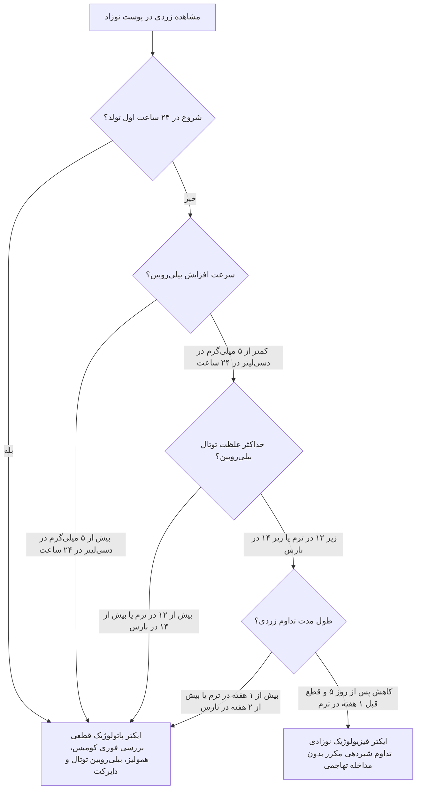

### الف) علل و اتیولوژی‌های ایکتر پاتولوژیک نوزادی

1. **ناسازگاری‌های ایمونولوژیک گروه‌های خونی**: ناسازگاری **Rh** (مادر منفی، نوزاد مثبت) و **ABO** فرعی (شایع‌ترین فرم: مادر گروه خونی O، نوزاد A یا B).

2. **اختلالات آنزیمی و هموگلوبینوپاتی‌های اریتروسیت**: اسفروسیتوز مادرزادی، کمبود آنزیم G6PD (*فاویسم*)، تالاسمی آلفا و بتا، گالاکتوزمی.

3. **همولیز یاتروژنیک**: تزریق یا مصرف بیش از حد مقادیر زیاد **ویتامین K**.

4. **تجمع خون خارج عروقی**: **سفال‌هماتوم**، کاپوت سوکسدانوم بزرگ و خونریزی‌های تروماتیک حین زایمان.

5. **انسدادهای مکانیکی و عفونت‌ها**: سپسیس نوزادی، عفونت‌های مادرزادی داخل رحمی (*TORCH*)، آترزی مجاری صفراوی، کیست کلدوک، سندرم‌های کلستاز کبدی و اختلال انتقال بیلی‌روبین مستقیم.

## ۱۳. چک‌لیست نکات طلایی دام‌انداز شب امتحان

1. **دوز ویتامین K**: تزریق **۱ میلی‌گرم** عضلانی فرم محلول در آب در بدو تولد (نه وریدی و نه دوزهای بالاتر که سبب همولیز و یرقان گردد).

2. **زمان کلمپ بند ناف**: **پس از قطع ضربان نبض در آن** (بستن پیش از توقف نبض نوزاد را از ۱۰ میلی‌لیتر خون غنی از آهن محروم می‌سازد).

3. **افت وزن نرمال**: کاهش **۷ تا ۱۰ درصد** وزن تولد در روزهای اول مجاز است؛ کسب مجدد وزن تولد حداکثر در **۲ تا ۳ هفتگی**.

4. **شروع ایکتر فیزیولوژیک**: **پایان روز دوم** (روز ۳ و ۴)، اوج در روز ۴ تا ۵، سقف بیلی‌روبین **۱۲ mg/dL در نوزاد ترم** و **۱۴ mg/dL در نوزاد نارس**. هر زردی در ۲۴ ساعت اول زندگی، **پاتولوژیک** است.

5. **شیردهی در آبسه پستان**: صرفاً در برش‌های چسبیده به هاله پستان شیردهی از آن پستان **۴۸ تا ۷۲ ساعت متوقف** (همراه با دوشیدن و دور ریختن شیر) می‌شود؛ شیردهی از پستان سالم **تحت هیچ شرایطی قطع نمی‌گردد**.

6. **شیردهی در هپاتیت B**: به شرط تزریق واکسن و **HBIG در ۱۲ ساعت اول**، شیردهی مستقیم از بدو تولد کاملاً بلامانع است.

7. **کنترااندیکاسیون متابولیک قطعی شیر مادر**: بیماری **گالاکتوزومی** (در PKU شیردهی پایش‌شده نسبی مجاز است).

8. **تعریف ترم**: از آغاز **هفته ۳۷ (و ۰ روز)** تا پایان **هفته ۴۰ (و ۶ روز)**. تولد قبل از ۳۷ هفته کامل یعنی پایان ۳۶ هفته و ۶ روز، **نارس (Preterm)** محسوب می‌شود.
# جلسه ۱۴: پایش رشد و تکامل کودکان

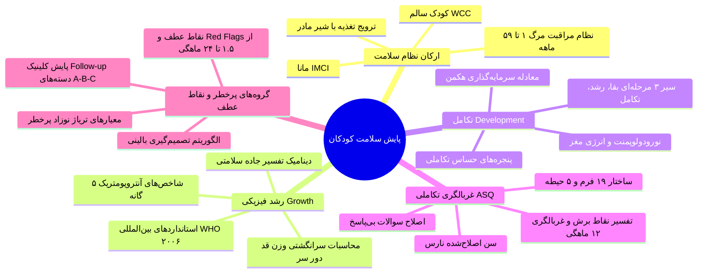

---

## ۱. ارکان سه‌گانه سلامت کودکان، شاخص‌های حیاتی و استراتژی‌های کشوری

> [!definition] دوره ۱۰۰۰ روز اول زندگی (First 1,000 Days)
> فاصله زمانی حیاتی از بدو لقاح تا پایان ۲ سالگی (۲۴ ماهگی)؛ بازه بالاترین سرعت هایپرپلازی سلولی و تکامل ساختاری اندام‌ها به‌ویژه دستگاه عصبی مرکزی.

### مقایسه ارکان سه‌گانه سلامت کودکان

| عنوان برنامه | سال و محل آغاز کشوری | گروه سنی هدف | هدف غایی و خروجی برنامه | ابزار و ساختار اجرایی |
| :--- | :--- | :--- | :--- | :--- |
| **نظام مراقبت مرگ کودکان** | **۱۳۸۶** (کل کشور) | **۱ تا ۵۹ ماهه** | ریشه‌یابی علل مرگ‌های قابل اجتناب، تحلیل اپیدمیولوژیک و کاهش U5MR | پایش مرگ‌ها و گزارش به سامانه مراقبت کشوری |
| **کودک سالم (WCC)** | **۱۳۸۳** (دانشگاه مشهد) | **۰ تا ۸ سال** | غربالگری استاندارد جهت تفکیک کودکان سالم از افراد به‌ظاهر سالم یا مستعد بیماری | بسته‌های ادغام‌یافته مراقبت و کارت پایش رشد |
| **ناخوشی‌های اطفال (مانا / IMCI)** | **۱۳۸۱** (دانشگاه مشهد) | بیمار **زیر ۵ سال** | پوشش بیش از **۹۰٪** علل مراجعات سرپایی، کاهش موربیدیتی و مورتالیتی بیماری‌های شایع | ۲ بوکلت‌چارت (پزشک و غیرپزشک) در ۲ رده (۷ روز تا ۲ ماه و ۲ ماه تا ۵ سال) |

> [!important] ترتیبات مرگ‌ومیر و شاخص‌های آماری
> - **توالی فراوانی مرگ:** ۱. نخستین **۲۴ ساعت اول پس از تولد** ⇦ ۲. **یک‌ماهه اول (دوره نوزادی)** ⇦ ۳. **زیر ۵ سالگی**.
> - **شاخص مرگ زیر ۵ سال (U5MR):** از ارکان اصلی سنجش توسعه‌یافتگی کشورها.
> - **برنامه مانا:** جایگزین برنامه‌های ناکارآمد پیشین مقابله با عفونت‌های تنفسی (*ARI*) و اسهالی (*CDD*).
> - **سهم جمعیتی کودکان:** حدود **۱۵٪** کل جمعیت کشور.


> [!tip] روند نزولی مورتالیتی کودکان ایران (زیج حیاتی)
> 1. **پایان دهه ۱۳۵۰:** مرگ زیر ۵ سال = **۱۴۰ در ۱۰۰۰** تولد زنده | مرگ زیر ۱ سال = **۱۱۰ در ۱۰۰۰**.
> 2. **سال ۱۳۶۹:** مرگ زیر ۵ سال = **۶۸ در ۱۰۰۰** (شاخص ۲۲.۶) | مرگ زیر ۱ سال = **۵۲ در ۱۰۰۰** (شاخص ۱۷.۳).
> 3. **سال ۱۳۹۰:** مرگ زیر ۵ سال = **۲۰ در ۱۰۰۰** | مرگ زیر ۱ سال = **۱۸ در ۱۰۰۰**.
> 4. **سال‌های اخیر:** کاهش از **۵۰ در ۱۰۰۰** (سال ۱۳۷۲) به حدود **۱۳ در ۱۰۰۰** تولد زنده.

---

## ۲. مفاهیم بیولوژیک، دوره‌های سنی و عوامل تعیین‌کننده

> [!definition] رشد فیزیکی (Growth)
> فرایند **کمی** افزایش ابعاد فیزیکی بدن ناشی از هایپرپلازی و هایپرتروفی سلولی (وزن، قد، دور سر، دور بازو)؛ ارزیابی به‌وسیله شاخص‌های آنتروپومتریک.


> [!definition] تکامل یا نمو (Development)
> فرایند **کیفی** کسب مهارت، افزایش پیچیدگی رفتاری، تمایز سلولی و عملکردی (حوزه‌های شناختی، حرکتی، هیجانی، گفتاری و اجتماعی). پایش همگام با رشد فیزیکی صورت می‌گیرد.

### طبقه‌بندی مراحل سنی کودکی
- **کنوانسیون حقوق کودک:** هر فرد تا پایان **۱۸ سالگی** رسماً کودک شناخته می‌شود.
- **نوزادی (Neonate):** بدو تولد تا **۲۸ روزگی** (یا تولد تا پایان ۱ ماهگی).
- **شیرخوارگی (Infancy):** پایان **۱ ماهگی تا ۱ سالگی** (تغذیه انحصاری تا ۶ ماهگی، سپس غذای کمکی).
- **نوپایی (Toddler):** **۱ تا ۳ سالگی**.
- **پیش‌دبستانی (Preschool):** **۳ تا ۶ سالگی**.
- **کودکی میانه / سن مدرسه (School age):** **۶ تا ۱۲ سالگی**.
- **نوجوانی (Adolescent):** **۱۳ تا حدود ۱۸ سالگی**.

### عوامل تعیین‌کننده رشد و تکامل (Determinants)
- **صفات ارثی/ژنتیک:** *مهم‌ترین* زیرساخت تعیین پتانسیل؛ غیرقابل مداخله درمانی اما نیازمند *غربالگری* و تریاژ.
- **تغذیه:** *دومین* عامل مهم و *مداخله‌پذیرترین عامل محیطی*.
- **سن:** شتاب رشد و تکامل رابطه *معکوس* با سن دارد (حداکثر سرعت در *جنینی و ۲ سال نخست*).
- **جنسیت:** شتاب رشد و بلوغ در *دختران زودتر* آغاز می‌شود.
- **محیط فیزیکی:** نور آفتاب، کیفیت مسکن، تهویه.
- **عوامل روان‌شناختی:** استرس و اضطراب مزمن مراقبان اثر مهاری مستقیم بر ترشح هورمون‌ها و تکامل دارد.
- **عفونت‌ها و بیماری‌ها:** کاهش اشتها و تاخیر در رشد و نمو (استثنا: بیماری‌های هایپرهورمونال مانند ژیگانتیسم ناشی از ترشح نابجای GH).
- **عوامل اقتصادی-اجتماعی:** اثر غیرمستقیم بر امنیت غذایی و بهداشت.

---

## ۳. شاخص‌های تن‌سنجی، استانداردهای WHO و پایش دینامیک

> [!definition] استانداردهای بین‌المللی رشد سازمان جهانی بهداشت (WHO - آوریل ۲۰۰۶)
> جایگزین استاندارد قدیمی NCHS بر پایه ۳ اصل:
> 1. توصیف چگونگی **رشد مطلوب و تجویزی** (*How children should grow*) نه توصیف صرف وضعیت موجود.
> 2. تثبیت **تغذیه با شیر مادر** (*Breastfeeding*) به‌منزله استاندارد بیولوژیک طبیعی رشد.
> 3. اثبات اینکه کودکان تمام مناطق جهان فارغ از متغیرهای نژادی، در شرایط بهینه دارای پتانسیل رشدی یکسان هستند.

### شاخص‌های پنج‌گانه آنتروپومتری
- **وزن برای سن:** *حساس‌ترین و اولین* شناساگر سوءتغذیه **حاد**، بیماری‌های عفونی اخیر و کاهش اشتها.
- **قد برای سن:** نشانگر سوءتغذیه **مزمن** و کوتاه‌قدی درازمدت (*Stunting*).
- **دور سر برای سن:** بازتاب رشد ساختاری مغز و جمجمه در ۲ سال اول زندگی.
- **وزن برای قد:** شاخص لاغری و هدررفت حاد عضلانی (*Wasting*) مستقل از متغیر سن.
- **نمایه توده بدنی برای سن (BMI-for-Age):** غربالگری چاقی/اضافه‌وزن در سنین بالای ۲ سال (در ۱ تا ۸ سالگی استانداردهای آن موجود است اما کمتر روتین استفاده می‌شود).

```chart
{
  "title": "محدوده استاندارد وزن به سن (kg) - تولد تا ۲ سالگی",
  "subtitle": "مقایسه صدک‌های ۳، ۵۰ و ۹۷ رشد وزنی کودکان",
  "type": "line",
  "data": [
    { "name": "تولد", "p97": 4.4, "p50": 3.3, "p3": 2.4 },
    { "name": "۳ ماه", "p97": 7.2, "p50": 6.0, "p3": 4.8 },
    { "name": "۶ ماه", "p97": 9.3, "p50": 7.8, "p3": 6.4 },
    { "name": "۹ ماه", "p97": 10.5, "p50": 8.9, "p3": 7.4 },
    { "name": "۱۲ ماه", "p97": 11.5, "p50": 9.6, "p3": 8.0 },
    { "name": "۱۸ ماه", "p97": 13.0, "p50": 11.0, "p3": 9.1 },
    { "name": "۲۴ ماه", "p97": 14.5, "p50": 12.2, "p3": 10.0 }
  ],
  "metrics": [
    { "key": "p97", "name": "صدک ۹۷ (حد بالای غیرعادی)", "color": "#ef4444" },
    { "key": "p50", "name": "صدک ۵۰ (میانه جامعه)", "color": "#22c55e" },
    { "key": "p3", "name": "صدک ۳ (حد پایین غیرعادی)", "color": "#f97316" }
  ]
}
```

### داده‌های روند تن‌سنجی ایران در سال‌های ۱۳۷۴، ۱۳۷۷ و ۱۳۸۹

```chart
{
  "title": "روند تغییرات شاخص‌های تن‌سنجی در شهرها و روستاهای کشور",
  "subtitle": "مقایسه درصد شیوع در سال‌های ۱۳۷۴، ۱۳۷۷ و ۱۳۸۹",
  "type": "bar",
  "data": [
    { "name": "کم‌وزنی (شهر)", "y1374": 13, "y1377": 8, "y1389": 3.46 },
    { "name": "کوتاه‌قدی (شهر)", "y1374": 12, "y1377": 10, "y1389": 5.38 },
    { "name": "کم‌وزنی (روستا)", "y1374": 19, "y1377": 13, "y1389": 5 },
    { "name": "کوتاه‌قدی (روستا)", "y1374": 25, "y1377": 21, "y1389": 9 },
    { "name": "لاغری (روستا)", "y1374": 8, "y1377": 6, "y1389": 4 }
  ],
  "metrics": [
    { "key": "y1374", "name": "سال ۱۳۷۴", "color": "#ef4444" },
    { "key": "y1377", "name": "سال ۱۳۷۷", "color": "#f59e0b" },
    { "key": "y1389", "name": "سال ۱۳۸۹", "color": "#10b981" }
  ]
}
```

### الگوهای ۴ گانه پایش رشد و جاده سلامتی

> [!warning] تله مهم امتحانی: ارزیابی دینامیک در برابر مقطعی
> صرف قرار گرفتن نقطه وزنی کودک بین صدک **۳ تا ۹۷** (۲ انحراف معیار اطراف میانگین حاوی ۹۵٪ جمعیت) متضمن سلامت نیست! ارزیابی رشد **روندی است نه مقطعی**. مقایسه کودک **فقط با خودش و موازی بودن شیب با خطوط صدک (۳، ۱۰، ۲۵، ۵۰، ۷۵، ۹۰، ۹۷)** ارزش بالینی دارد.
> *مثال:* سقوط از صدک ۹۰ به صدک ۱۰ حتی اگر در محدوده نرمال بماند، نشانگر اختلال شدید است.

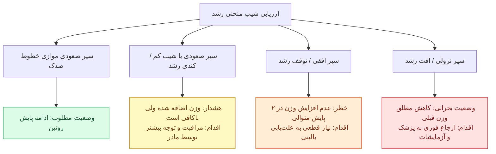

> [!important] تفاوت حیاتی وزن با قد و دور سر
> - **وزن:** دارای هر **۴ حالت** شیب منحنی (صعودی، کندی، توقف، افت).
> - **قد و دور سر:** در پاتولوژی‌ها کوتاه یا کوچک نمی‌شوند، بلکه فقط رشد طولی متوقف می‌شود؛ لذا در منحنی قد و دور سر **حالت چهارم (سیر نزولی / افت) وجود ندارد** و فقط ۳ حالت اول دیده می‌شود.
> - **اشتها:** اولین شناساگر آسیب‌پذیر در مواجهه با بیماری‌ها یا استرس سرما/گرما در شیرخوار.

---

## ۴. محاسبات سرانگشتی قد، وزن، دور سر و تقویم مراجعات

| شاخص تن‌سنجی     | سن / مقطع زمانی    | مقدار مورد انتظار / نرخ تغییرات              | فرمول محاسبه سریع                    | نکات کلیدی امتحانی                              |
| :--------------- | :----------------- | :------------------------------------------- | :----------------------------------- | :---------------------------------------------- |
| **وزن (Weight)** | بدو تولد           | ۲۵۰۰ تا ۳۵۰۰ گرم (میانگین ۳۲۵۰g)             | -                                    | کمتر از ۲۵۰۰g = وزن کم تولد (LBW)               |
| **وزن (Weight)** | ۵ ماهگی            | **۲ برابر** وزن تولد (حدود ۶.۵ تا ۷ کیلوگرم) | وزن (kg) = (سن به ماه + ۹) / ۲       | فرمول معتبر برای بازه ۳ تا ۱۲ ماهگی             |
| **وزن (Weight)** | ۱ سالگی            | **۳ برابر** وزن تولد (حدود ۱۰ کیلوگرم)       | فرمول فوق                            | افت گذرا در ۶ ماهگی با غذای کمکی جبران می‌شود   |
| **وزن (Weight)** | ۲ سالگی            | **۴ برابر** وزن تولد (حدود ۱۲ تا ۱۳ کیلوگرم) | وزن (kg) = (سن به سال × ۲) + ۸       | فرمول معتبر برای بازه ۱ تا ۶ سالگی              |
| **وزن (Weight)** | بالای ۲ سالگی      | سالیانه **۲۲۵۰ تا ۲۷۵۰ گرم** افزایش          | وزن (kg) = ((سن به سال × ۷) - ۵) / ۲ | فرمول معتبر برای بازه ۷ تا ۱۲ سالگی             |
| **قد (Height)**  | بدو تولد           | ۴۸ تا ۵۲ سانتی‌متر (متوسط **۵۰cm**)          | -                                    | زیر ۲ سال سنجش طولی خوابیده (Length)            |
| **قد (Height)**  | ۱ سالگی            | **۱.۵ برابر** قد تولد (**۷۵cm**)             | -                                    | معادل ۵۰٪ افزایش نسبت به بدو تولد               |
| **قد (Height)**  | سال ۲ و ۳          | سالیانه **۱۲ تا ۱۳ سانتی‌متر** افزایش        | -                                    | بیشترین شتاب رشد طولی بعد از سال اول            |
| **قد (Height)**  | ۴ سالگی            | **۲ برابر** قد تولد (**۱۰۰cm**)              | قد (cm) = (سن به سال × ۶) + ۷۷       | فرمول معتبر برای بازه ۲ تا ۱۲ سالگی             |
| **قد (Height)**  | ۴ سالگی تا بلوغ    | سالیانه **۵ تا ۶ سانتی‌متر** افزایش          | فرمول فوق                            | با شروع بلوغ جهش رشدی رخ می‌دهد                 |
| **دور سر (HC)**  | بدو تولد           | ۳۰ تا ۳۵ سانتی‌متر (میانگین ۳۴-۳۵cm)         | -                                    | دور سر بدو تولد **بزرگ‌تر از دور سینه** است     |
| **دور سر (HC)**  | ۳ ماهه اول         | افزایش **۶ سانتی‌متر** (۲cm در هر ماه)       | -                                    | بیشترین شتاب رشد دور سر در دوران زندگی          |
| **دور سر (HC)**  | ۳ ماهه دوم (۳-۶m)  | افزایش **۳ سانتی‌متر** (۱cm در هر ماه)       | -                                    | مجموع ۶ ماه اول = ۹ سانتی‌متر افزایش            |
| **دور سر (HC)**  | ۶ ماهه دوم (۶-۱۲m) | افزایش **۳ سانتی‌متر** (۰.۵cm در ماه)        | -                                    | کل افزایش سال اول = **۱۲ سانتی‌متر**            |
| **دور سر (HC)**  | **۹ ماهگی**        | **برابری دور سر و سینه و سپس سبقت سینه**     | -                                    | **تله تستی:** تاخیر در برابری = سوءتغذیه یا FTT |
| **دور سر (HC)**  | سال دوم            | کل سال حدود **۶ سانتی‌متر** افزایش           | -                                    | بعد از ۲ سالگی رشد دور سر بسیار اندک است        |

> [!tip] تقویم مراجعات استاندارد پایش رشد کودک سالم
> 1. **سال اول (۸ بار):** روز ۳ تا ۵، روز ۱۴ تا ۱۵، روز ۳۰ تا ۴۵، ماه ۲، ماه ۴، ماه ۶، ماه ۷، ماه ۹. (۴ بار در ۲ ماه نخست، ۴ بار در ۱۰ ماه بعد).
> 2. **سال دوم (۴ بار):** ماه ۱۲، ماه ۱۵، ماه ۱۸، ماه ۲۴ (هر ۳ ماه یک‌بار؛ فاصله ۱۸ تا ۲۴ شش ماه است).
> 3. **سال سوم (۲ بار):** ماه ۳۰ و ماه ۳۶ (هر ۶ ماه یک‌بار).
> 4. **سال چهارم به بعد:** **سالی یک‌بار** تا پایان سن مدرسه.

---

## ۵. تغذیه انحصاری، مکمل‌یاری و گام‌های غذای کمکی

### تغذیه انحصاری با شیر مادر (Exclusive Breastfeeding)
- **تعریف:** دریافت منحصربه‌فرد شیر مادر تا پایان **۶ ماهگی**؛ عدم مصرف هرگونه آب، مایعات یا غذای دیگر (تنها مصرف دارو و مکمل مجاز است).
- **مکمل ویتامین A+D یا مولتی‌ویتامین:** **۲۵ قطره روزانه از روز ۱۵ تولد**.
- **قطره آهن:** **۱۵ قطره روزانه فروس سولفات از پایان ۶ ماهگی** (همزمان با غذای کمکی) تا پایان **۲۴ ماهگی**.

### اصول شروع غذای کمکی
- **زمان آغاز:** پایان **۶ ماهگی** (در نوزاد نارس ممکن است از **۴ ماهگی** شروع شود).
- **اصل تقدم:** تا پایان **۱۲ ماهگی شیر مادر غذای اصلی است** و غذای کمکی پس از تغذیه با شیر مادر داده می‌شود.
- **توالی معرفی مواد غذایی:**
  1. *ماه هفتم:* فرنی آرد برنج (با رقت شبیه شیر مادر) ⇦ حریره بادام ⇦ سوپ یا آش نرم (گوشت گوسفند/مرغ + برنج + هویج + سبزی‌ها نظیر جعفری و گشنیز).
  2. *ماه هشتم:* پوره سیب‌زمینی، پوره هویج، پوره کدو، ماست، زرده تخم‌مرغ پخته، آب‌میوه تازه، انواع نان.
  3. *ماه نهم و دهم:* حبوبات سهل‌الهضم (عدس و ماش)، جوانه گندم، کته نرم با گوشت، بیسکویت ساده، خرما.
  4. *ماه یازدهم تا بیست و چهارم:* ماهی، سفیده تخم‌مرغ، پنیر پاستوریزه، بستنی پاستوریزه و غذای سفره خانواده.

---

## ۶. نورودولوپمنت، پنجره‌های تکاملی و اقتصاد تکامل (هکمن)

### دینامیک رشد ساختاری و مصرف انرژی مغز
- **تغییرات وزن مغز:**
  - جنینی (۲۰ هفتگی): ۱۰۰ گرم
  - نوزادی: ۴۰۰ گرم (**۴ برابر** از هفته ۲۰ جنینی تا ترم)
  - ۱۸ ماهگی: ۸۰۰ گرم
  - ۳۶ ماهگی (۳ سالگی): ۱۱۰۰ گرم (**۳ برابر** از تولد تا ۳ سالگی)
  - فرد بالغ: ۱۴۰۰ گرم (از ۳ سالگی تا بلوغ فقط ۰.۳ برابر افزایش)
- **متابولیسم و انعطاف‌پذیری:**
  - در سال اول زندگی: **۶۰٪** کل انرژی و مواد مغذی صرف متابولیسم مغز می‌شود.
  - تا ۳ سالگی: این سهم به **۳۰٪** کاهش می‌یابد.
  - در ۱۰ سال اول: مغز کودک **۲ برابر** یک فرد بالغ فعال‌تر و دارای پلاستیسیتی سیناپسی است.

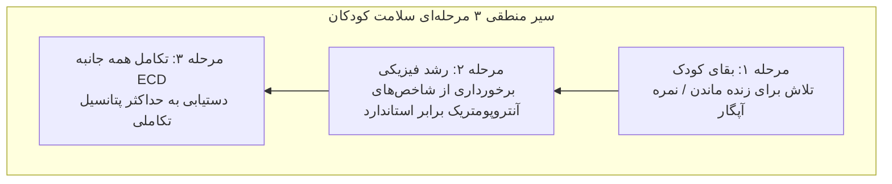

### پنجره‌های حساس تکاملی (Critical Windows)
- **شنوایی و بینایی:** بالاترین حساسیت در **بدو تولد و ماه‌های نخست** (عفونت‌های داخل رحمی TORCH مثل توکسوپلاسموز و سرخچه آسیب غیرقابل جبران می‌زنند).
- **کنترل احساسات:** اوج حساسیت بین **۱ تا ۳ سالگی**؛ در سنین مدرسه کاهش نسبی دارد.
- **تکامل زبانی و ارتباطی:** صعود سریع از ۶ ماهگی تا ۲ سالگی، تداوم تا پیش‌دبستانی و افت پس از ۵ سالگی.
- **پاسخ‌های عادتی (Habitual responses):** صعود در نوپایی، اوج در پیش‌دبستانی و تثبیت در سطح بالا.
- **نمادها و شمارش:** اوج‌گیری در سنین **۴ تا ۷ سالگی**.

> [!important] نظریه سرمایه‌گذاری هکمن (Heckman Equation)
> - به ازای هر **۱ ریال سرمایه‌گذاری** در تکامل همه جانبه کودکان (*ECD*) در سنین پیش از دبستان، **۷ تا ۱۷ ریال بازگشت سرمایه اقتصادی** در بزرگسالی حاصل می‌شود.
> - بالاترین نرخ بازگشت سرمایه انسانی متعلق به آموزش و پایش **قبل از سن ۶ سالگی (سن مدرسه)** است.
> - در کشورهای توسعه‌‌یافته ارتقای تکاملی سبب حداقل **۱۵٪ افزایش ضریب هوشی جامعه** شده است.

---

## ۷. غربالگری تکامل، آزمون ASQ و الگوریتم‌های کشوری

> [!definition] ضریب تکاملی (Developmental Quotient - DQ)
> در کودکان زیر ۵ سال تعیین بهره هوشی (IQ) به علت عدم همکاری ناممکن است؛ لذا از ضریب تکاملی (DQ) از طریق پرسشنامه‌های رفتاری تکمیل‌شده توسط مراقبان استفاده می‌شود.

### اپیدمیولوژی شناسایی ناتوانی‌های تکاملی
- **شیوع کشف ناتوانی‌ها بر حسب سن:** بدو تولد = **۲.۳٪** | نوپایی (۱ تا ۳ سال) = **۵.۹٪** | پیش‌دبستانی و دبستان (۶ تا ۸ سال) = **۱۱.۶٪**.
- **بیشترین سن تشخیص:** در ۶ تا ۸ سالگی (اختلالات گفتاری، بیش‌فعالی/ADHD، یادگیری و هیجانی از ۴ سالگی قابل کشف بوده اما در ۶ تا ۸ سالگی بیشترین تشخیص را دارند).
- **نرخ تشخیص با ابزار استاندارد در برابر ارزیابی بالینی معمول:**
  - ناتوانی‌های تکاملی: بدون ابزار = **۳۰٪** | با ابزار استاندارد = **۷۰ تا ۸۰٪**.
  - اختلالات روانی-رفتاری: بدون ابزار = **۲۰٪** | با ابزار استاندارد = **۸۰ تا ۹۰٪**.
- **موانع اجرای غربالگری توسط متخصصان اطفال (مطالعه AAP):** ۷۰٪ هرگز ابزار به کار نمی‌برند؛ مهم‌ترین موانع شامل کمبود وقت ویزیت (**۸۰٪**)، تعرفه بیمه‌ای ناکافی (**۵۶٪**)، کمبود پرسنل غیرپزشک (**۵۰٪**)، عدم آشنایی با کدهای CPT (**۴۷٪**)، کمبود منابع جامعه (**۳۳٪**)، آموزش ناکافی خدمات تکاملی (**۲۸٪**) و عدم آشنایی با ابزارها (**۲۴٪**).

### ویژگی‌ها و ساختار پرسشنامه سنین و مراحل (ASQ)
- **بازه سنی:** **۴ تا ۶۰ ماهگی** شامل **۱۹ پرسشنامه اختصاصی**:
  - سال اول و دوم: هر ۲ ماه یک‌بار (۴، ۶، ۸، ۱۰، ۱۲، ۱۴، ۱۶، ۱۸، ۲۰، ۲۲، ۲۴ ماهگی).
  - سال سوم: هر ۳ ماه یک‌بار (۲۴، ۲۷، ۳۰، ۳۳، ۳۶ ماهگی).
  - سال چهارم و پنجم: هر ۶ ماه یک‌بار (۳۶، ۴۲، ۴۸، ۵۴، ۶۰ ماهگی).
- **حیطه‌های پنج‌گانه (هر حیطه ۶ سوال = ۳۰ سوال در هر فرم):**
  1. برقراری ارتباط (*Communication*)
  2. حرکات درشت (*Gross motor*)
  3. حرکات ظریف (*Fine motor*)
  4. حل مسئله (*Problem solving*)
  5. شخصی - اجتماعی (*Personal-social*)
- **سوالات عمومی (General):** در پایان هر فرم ۶ سوال کلی در مورد شنوایی، بینایی، استفاده متقارن از دست‌ها، روی پا ایستادن و نگرانی‌های والدین درج شده است.
- **گرادیان ضریب تکاملی در سوالات:** ۲ سوال اول = ارزیابی DQ **۷۵** (دامنه ۶۹-۷۷) | ۲ سوال میانی = DQ **۸۵** (دامنه ۸۲-۹۰) | ۲ سوال آخر = DQ **۱۰۰** (دامنه ۹۱-۱۲۰).
- **امتیازدهی سوالات:** بله = **۱۰** | گاهی = **۵** | هنوز نه = **۰**.
  - *نکته کلیدی:* اگر کودک مهارتی را قبلاً انجام می‌داده و اکنون رفتار پیشرفته‌تری بروز می‌دهد، نمره **بله (۱۰)** داده می‌شود.

> [!important] قواعد اختصاصی اجرای ASQ (دام‌های تستی قطعی)
> 1. **بازه سنی مجاز تکمیل پرسشنامه:** از **۱ ماه قبل تا ۱ ماه بعد** از سن قیدشده روی برگه.
> 2. **سن اصلاح‌شده نارس (Corrected Age):** برای کودکانی که بیش از ۳ هفته نارس متولد شده‌اند (GA < 37 هفته)، تا سن **۲ سالگی** باید فرم بر اساس سن اصلاح‌شده تکمیل شود:
>    سن اصلاح‌شده = سن تقویمی فعلی - تعداد هفته‌های نارسی
>    *مثال:* کودک تقویمی ۶ ماهه با سابقه ۸ هفته (۲ ماه) نارسی ⇦ سن اصلاح‌شده = ۴ ماهگی (تکمیل فرم سن ۴ ماهگی).
> 3. **قوانین سوالات بی‌پاسخ (امتیازدهی نسبی):**
>    - بیش از ۲ سوال بی‌پاسخ در یک حیطه ⇦ **باطل شدن حیطه** (امتیازدهی ناممکن است).
>    - ۱ سوال بی‌پاسخ ⇦ مجموع نمرات ۵ سوال پاسخ‌داده‌شده تقسیم بر ۵ شده و به کل همان حیطه اضافه می‌شود.
>    - ۲ سوال بی‌پاسخ ⇦ مجموع نمرات ۴ سوال تقسیم بر ۴ شده، حاصل ضربدر ۲ شده و به کل همان حیطه اضافه می‌شود.

### تفسیر نقاط برش (Cut-off Points) استاندارد ایران
- **بالاتر از ستون 1SD- (منطقه طبیعی):** روند تکاملی نرمال؛ ارائه توصیه‌های ارتقای تکامل در منزل، مراجعه در گروه سنی بعدی.
- **بین ستون 1SD- و 2SD- (منطقه خاکستری/پایش):** مشکوک؛ آموزش تمرینات تکاملی به والدین در منزل، **انجام مجدد تست ۱ ماه بعد**. اگر در ارزیابی دوم همچنان زیر 1SD- ماند، ارجاع قطعی الزامی است.
- **مساوی یا کمتر از ستون 2SD- (منطقه غیرطبیعی):** کودک **مردود** است؛ ارجاع به پزشک خانواده و سپس پزشک معین شهرستان و تیم توانبخشی.
- **سوالات عمومی (General):** وجود **هرگونه نگرانی والدین** در بخش عمومی، مستقل از نمره حیطه‌ها نیازمند **ارجاع مستقیم** است.

### الگوریتم غربالگری همگانی ۱۲ ماهگی در نظام شبکه ایران

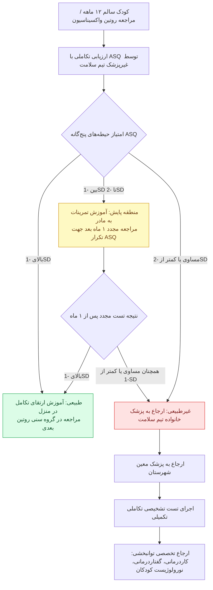

---

## ۸. شیرخواران پرخطر (High-Risk Infants): شاخص‌ها، دسته‌بندی و پیگیری

### معیارهای قطعی ورود به برنامه مراقبت شیرخوار پرخطر
1. وزن تولد کمتر از **۱۵۰۰ گرم** یا سن جنینی کمتر از **۳۲ هفته** (GA < 32w).
2. وزن تولد بیشتر از ۱۵۰۰ گرم یا GA > 32w به همراه حداقل یکی از فاکتورهای خطرساز زیر:
   - نوزادان دچار محدودیت رشد داخل رحمی (**IUGR**).
   - آسفیکسی قبل یا حین زایمان: **pH < 7** در نمونه بند ناف یا ABG ساعت اول زندگی، یا نمره **آپگار دقیقه پنجم ≤ 3**.
   - مننژیت یا آنسفالیت دوره نوزادی.
   - تشنج نوزادی یا هیپوگلیسمی علامت‌دار.
   - وضعیت عصبی غیرطبیعی (*Abnormal neurological status*) در زمان ترخیص از NICU.
   - جراحی‌های ماژور (جمجمه، توراکس، شکم).
   - عفونت سیستمیک ویروس هرپس سیمپلکس (HSV).
   - سابقه تعویض خون (*Exchange transfusion*).

### گروه‌بندی پیگیری شیرخواران پرخطر (Stratification)

| گروه پرخطر | معیار سن جنینی و وزن تولد | سایر شرایط بالینی همراه | حداکثر افق زمانی پیگیری (Follow-up) |
| :--- | :--- | :--- | :--- |
| **گروه A** | سن جنینی **کمتر از ۲۸ هفته** و/یا وزن تولد **کمتر از ۱۰۰۱ گرم** | - | **پیگیری طولانی‌مدت تا سن مدرسه (School age)** |
| **گروه B** | سن جنینی **۲۸ تا ۳۲ هفته** و/یا وزن تولد **۱۰۰۱ تا ۱۵۰۰ گرم** | - | **پیگیری تا سن ۲۴ ماهگی (۲ سالگی)** |
| **گروه C** | سن جنینی **۳۲ تا ۳۷ هفته** و/یا وزن تولد **۱۵۰۱ تا ۲۵۰۰ گرم** | وجود یکی از عوارض پاتولوژیک (آسفیکسی، مننژیت، تشنج، جراحی و...) | **پیگیری تا سن ۱۲ ماهگی (۱ سالگی)** |

> [!tip] تقویم ویزیت تکاملی کلینیک Follow-up نوزادان پرخطر
> 1. **زمان ترخیص از بیمارستان:** تحویل نخستین فرم ASQ به والدین و آموزش تکمیل آن در فواصل ۲ ماهه.
> 2. **ویزیت‌های روتین تکاملی:** سنین **۲، ۴ و ۸ ماهگی (بر اساس سن اصلاح‌شده)**.
> 3. **ارزیابی تکامل جامع:** در سن **۱۲ ماهگی اصلاح‌شده**.
> 4. **پیگیری‌های شناختی-رفتاری:** سنین اصلاح‌شده **۲ و ۳ سالگی** با ابزارهای تشخیصی و غربالگری‌های رفتاری نظیر SDQ یا ASQ:SE.

---

## ۹. ماتریس نقاط عطف تکاملی و نشانه‌های خطر (Red Flags) از ۱.۵ تا ۲۴ ماهگی

| رده سنی            | برقراری ارتباط و تکلم                             | بینایی و شنوایی                                     | حرکات ظریف و شناختی                             | حرکات درشت (Gross Motor)                         | نشانه‌های قرمز و تله‌های امتحانی (Red Flags)                                   |
| :----------------- | :------------------------------------------------ | :-------------------------------------------------- | :---------------------------------------------- | :----------------------------------------------- | :----------------------------------------------------------------------------- |
| **۱.۵ تا ۲ ماهگی** | تولید صداهای صدادار (غان و غون)                   | لبخند زدن، آرام شدن با صدای مادر، واکنش به صدای زنگ | آوردن دست‌ها به سمت خط وسط یا دهان              | بالا آوردن لحظه‌ای سر در وضعیت دمر (*Prone*)     | **عدم توجه به صورت طرف مقابل** (نشانه فوق‌‌العاده حساس اوتیسم یا تاخیر تکاملی) |
| **۳ تا ۴ ماهگی**   | غان و غون با تنوع، خندیدن بلند                    | چرخیدن به سمت منبع صداها                            | رساندن هر دو دست به همدیگر در خط وسط            | **ثابت نگه داشتن سر** در حالت نشسته بدون افتادن  | تاخیر در Head control (افتادن سر به جلو یا عقب)                                |
| **۵ تا ۶ ماهگی**   | جیغ کشیدن از هیجان، صداهای حلقی                   | واکنش به صداهای محیطی و جهت‌یابی دقیق               | چنگ زدن با کف دست (*Palmar grasp*)، گرفتن جغجغه | **غلت زدن** از پشت به شکم و بالعکس               | ناتوانی در چنگ زدن به اشیا، عدم غلت زدن                                        |
| **۹ تا ۱۰ ماهگی**  | ادای سیلاب‌های تکراری (دادا، بابا، گاگا)          | گوش دادن با دقت به اسم خود و کلمات آشنا             | برداشتن اشیا کوچک با دو انگشت (*Pincer grasp*)  | **نشستن مستقل و بدون کمک** دست‌ها برای چند دقیقه | **عدم نشستن مستقل**، ناتوانی در دست‌دستی کردن (*Clapping*) و بای‌بای           |
| **۱۲ تا ۱۳ ماهگی** | ادای **حداقل ۱ کلمه هدفمند** (ماما/بابا با مفهوم) | درک دستورات ساده و واکنش به نام خود                 | انداختن اشیا به داخل لیوان یا استکان            | **ایستادن مستقل** برای چند ثانیه بدون تکیه‌گاه   | ناتوانی در ایستادن، عدم تکلم کلمات مفهومی، عدم اشاره                           |
| **۱۵ ماهگی**       | تکلم ۱ تا ۳ کلمه هدفمند جز نام والدین             | درک کامل فرامین روزمره محیطی                        | **خط‌خطی کردن** ناشیانه با مداد، بازی سازنده    | **راه رفتن مستقل و تعادلی**                      | عدم راه رفتن مستقل تا ۱۵-۱۸ ماهگی                                              |
| **۱۸ ماهگی**       | دایره واژگان **حداقل ۳ تا ۶ کلمه** معنادار        | شناسایی اشیا و اشاره به تصاویر کتاب                 | برگرداندن شیشه/بطری، گرفتن ابتدایی قاشق و چنگال | **دویدن**، بالا رفتن از مبل با کمک               | عدم دویدن، ناتوانی در تقلید کلمات، عدم استفاده از ابزار                        |
| **۲۳ تا ۲۴ ماهگی** | ساخت **جملات ۲ کلمه‌ای** (مثل بابا رفت)           | نشان دادن حداقل **۲ قسمت از بدن** با پرسش           | باز کردن دکمه لباس، درآوردن لباس‌های ساده       | **بالا رفتن از پله‌ها**، شوت کردن توپ            | ناتوانی در بیان جملات دو کلمه‌ای، ناتوانی در بالا رفتن از پله                  |


---

## ۱۰. الگوریتم ارزیابی بالینی و تصمیم‌گیری نشانه‌های خطر تکامل

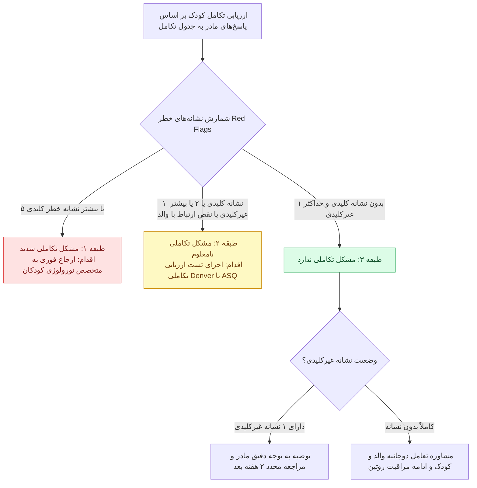

> [!important] سوالات غربالگری از مادر در ارزیابی تکامل
> - **سوالات عمومی تمام کودکان:** آیا رفتار کودک مثل سایر کودکان هم‌سن است؟ آیا نگرانی در حرف زدن، فهمیدن گفتار، نحوه استفاده از دست‌ها و انگشتان، یا استفاده از پاها و بازوها وجود دارد؟
> - **سوالات ویژه ۵ سالگی و بالاتر:** آیا نگرانی درباره یادگیری انجام کارها مثل سایر هم‌سن‌ها وجود دارد؟ آیا نگرانی درباره یادگیری مهارت‌های پیش‌دبستانی و دبستانی وجود دارد؟

---

## ۱۱. چک‌لیست نهایی دام‌های تستی و نکات طلایی شب امتحان (High-Yield Pearls)

> [!important] نکات کلیدی تست‌های چندگزینه‌ای
> 1. **محدوده نظام مرگ:** بررسی مرگ **۱ تا ۵۹ ماهه** است (مرگ زیر ۲۸ روز در واحد سلامت نوزادان پیگیری می‌شود).
> 2. **معکوس شدن نسبت دور سر به سینه:** در **۹ ماهگی** رخ می‌دهد؛ تاخیر در آن علامت مستقیم سوءتغذیه مزمن و FTT است.
> 3. **بیشترین رشد دور سر:** در **۳ ماهه اول زندگی (۶ سانتی‌متر)** رخ می‌دهد (معادل نیمی از کل رشد دور سر در سال اول).
> 4. **منحنی‌های فاقد افت:** قد و دور سر هرگز **شیب منفی (افت رشد)** پیدا نمی‌کنند؛ وزن تنها متغیری است که افت پیدا می‌کند.
> 5. **سن اصلاح‌شده نارس:** فقط تا سن **۲ سالگی** اعمال می‌شود و تنها برای تولدهای با نارسی بیش از ۳ هفته (GA < 37w) محاسبه می‌گردد.
> 6. **پایش همگانی ASQ کشوری:** سن پایه ادغام‌یافته کشوری برای تمام کودکان، **۱۲ ماهگی** است.
> 7. **افق زمانی پیگیری نوزاد پرخطر:** فقط گروه A (وزن زیر ۱۰۰۱ گرم یا سن جنینی زیر ۲۸ هفته) تا **سن مدرسه** پیگیری می‌شوند؛ گروه B تا ۲ سالگی و گروه C تا ۱ سالگی.
> 8. **خط‌خطی کردن ناشیانه:** نقطه عطف **۱۵ ماهگی**؛ **جملات ۲ کلمه‌ای و بالا رفتن از پله:** نقطه عطف **۲ سالگی (۲۴ ماهگی)**.
> 9. **عدم توجه به صورت:** در ۱.۵ تا ۲ ماهگی نشانه کلیدی خطر برای **اوتیسم** است.
> 10. **معادله هکمن:** بالاترین نرخ بازگشت سرمایه انسانی متعلق به دوران **زیر سن مدرسه** است (۷ تا ۱۷ برابر).
# جلسه ۱۵: سلامت میانسالی زنان

## ۱. تعاریف پایه، بازه‌های سنی و گذارهای جمعیتی

> [!info] تعریف و بازه سنی میانسالی (Midlife)
> - **دیدگاه‌های بالینی متغیر:** شروع از ۴۰، ۴۵ یا ۵۰ سالگی در متون مختلف.
> - **دستورالعمل کشوری جاری وزارت بهداشت:** سن **۳۰ تا ۵۹ سال تمام** (جمعیت هدف رسمی برنامه‌های جامع سلامت).
> - **تاریخچه تغییرات:** پیش از تأسیس اداره سلامت جوانان در سال ۱۳۹۲، بازه سنی میانسالی *۲۵ تا ۵۹ سال* تعریف می‌شد.
> - **تفکیک داخلی بزرگسالی:**
>   1. بزرگسالان جوان (ابتدای بزرگسالی): **۳۰ تا ۴۴ سال**.
>   2. بزرگسالان مسن / میانسالان (انتهای بزرگسالی): **۴۵ تا ۵۹ سال**.


> [!warning] تله تستی بخشنامه جدید جمعیتی سال ۱۴۰۲ (نامه شماره ۳۰۰/۲۱۲۹۵)
> بر اساس مصوبه مرکز جوانی جمعیت (بهمن ۱۴۰۲)، تقسیم‌بندی نظری جدید بر پایه قانون جوانی جمعیت ابلاغ شد، اما **دستورالعمل ارائه خدمت و بسته‌های اجرایی سلامت کماکان منحصراً بر پایه ۳۰ تا ۵۹ سال است**:
> - جنینی: تشکیل نطفه تا تولد | نوزادی: تولد تا ۳۰ روز | شیرخوارگی: ۳۱ روز تا ۲ سال تمام (۱ سال و ۱۱ ماه و ۲۹ روز).
> - کودکی: ۲ تا ۷ سال تمام | نونهالی: ۷ تا ۱۳ سال تمام | نوجوانی: ۱۳ تا ۱۷ سال تمام.
> - جوانی: **۱۷ تا ۴۰ سال تمام** | پیش‌میانسالی: **۴۰ تا ۵۰ سال تمام**.
> - میانسالی: **۵۰ تا ۶۵ سال تمام** (تاکید بخشنامه بر پرهیز از اطلاق واژه میانسال به فرد ۳۰ ساله).
> - نوسالمندی: ۶۵ تا ۷۵ سال | سالخوردگی: ۷۵ تا ۸۵ سال | کهنسالی: بالاتر از ۸۵ سال.

### اهمیت دموگرافیک میانسالان
- بر اساس سرشماری ۱۳۹۰: تشکیل دهنده **یک‌سوم کل جمعیت کشور** (۲۷ میلیون نفر).
- جمعیت ۳۰ تا ۴۴ سال: ۱۷ میلیون نفر | جمعیت ۴۵ تا ۵۹ سال: ۱۰ میلیون نفر.
- گروه **مولد** اقتصادی و بیولوژیک؛ وابستگی شدید سایر سنین به این قشر.
- بیشترین **روزهای کاری ازدست‌رفته** و بالاترین بار **تحمیل فشار اقتصادی ناشی از ناخوشی** به جامعه.
- **گروه فراموش‌شده (Neglected stage):** بیشترین غفلت از سلامت میانسالی زنان در *کشورهای با درآمد کم و متوسط* (LMICs نظیر چین، غنا، مکزیک، روسیه، آفریقای جنوبی و هند).

### گذار دموگرافیک و هرم سنی (Demographic Transition)
- **عوامل شکل‌دهنده هرم سنی:** موالید، مرگ‌ومیر، مهاجرت.
- **تغییرات جمعیتی ایران (۱۳۸۵ تا ۱۳۹۰):** حرکت برآمدگی و پهنای قاعده هرم به میانه (تورم گروه بزرگسالان و حرکت به سمت سالمندی).
```chart
{
  "title": "مقایسه توزیع جمعیت ایران (۱۳۸۵ و ۱۳۹۰)",
  "subtitle": "درصد جمعیت به تفکیک رده‌های سنی و جنسیت",
  "type": "bar",
  "data": [
    { "age": "۰-۴", "men90": 3.8, "men85": 3.5, "women90": 3.6, "women85": 3.3 },
    { "age": "۵-۹", "men90": 3.7, "men85": 3.6, "women90": 3.5, "women85": 3.4 },
    { "age": "۱۰-۱۴", "men90": 3.9, "men85": 4.7, "women90": 3.7, "women85": 4.5 },
    { "age": "۱۵-۱۹", "men90": 5.2, "men85": 6.8, "women90": 5.0, "women85": 6.6 },
    { "age": "۲۰-۲۴", "men90": 6.9, "men85": 7.5, "women90": 6.7, "women85": 7.3 },
    { "age": "۲۵-۲۹", "men90": 7.8, "men85": 6.2, "women90": 7.6, "women85": 6.0 },
    { "age": "۳۰-۳۴", "men90": 6.1, "men85": 4.6, "women90": 6.0, "women85": 4.4 },
    { "age": "۳۵-۳۹", "men90": 4.5, "men85": 3.8, "women90": 4.4, "women85": 3.7 },
    { "age": "۴۰-۴۴", "men90": 3.7, "men85": 3.2, "women90": 3.6, "women85": 3.1 },
    { "age": "۴۵-۴۹", "men90": 3.1, "men85": 2.7, "women90": 3.0, "women85": 2.6 },
    { "age": "۵۰-۵۴", "men90": 2.6, "men85": 2.2, "women90": 2.5, "women85": 2.1 },
    { "age": "۵۵-۵۹", "men90": 2.1, "men85": 1.5, "women90": 2.0, "women85": 1.4 },
    { "age": "۶۰-۶۴", "men90": 1.5, "men85": 1.2, "women90": 1.4, "women85": 1.1 },
    { "age": "۶۵-۶۹", "men90": 1.1, "men85": 1.0, "women90": 1.0, "women85": 0.9 },
    { "age": "۷۰-۷۴", "men90": 0.9, "men85": 0.8, "women90": 0.8, "women85": 0.7 },
    { "age": "۷۵-۷۹", "men90": 0.7, "men85": 0.5, "women90": 0.6, "women85": 0.5 },
    { "age": "۸۰-۸۴", "men90": 0.4, "men85": 0.3, "women90": 0.4, "women85": 0.3 },
    { "age": "+۸۵", "men90": 0.3, "men85": 0.2, "women90": 0.3, "women85": 0.2 }
  ],
  "metrics": [
    { "key": "men90", "name": "مردان ۱۳۹۰", "color": "#e91e63" },
    { "key": "men85", "name": "مردان ۱۳۸۵", "color": "#00bcd4" },
    { "key": "women90", "name": "زنان ۱۳۹۰", "color": "#ad1457" },
    { "key": "women85", "name": "زنان ۱۳۸۵", "color": "#00838f" }
  ]
}
```
- **مراحل پنج‌گانه گذار جمعیتی (DTM):**
  1. *مرحله ۱ (High Stationary):* تولد بالا، مرگ بالا؛ رشد جمعیت نزدیک صفر (به‌علت عفونت، فقر، فقدان بهداشت).
  2. *مرحله ۲ (Early Expanding):* تولد بالا، افت سریع مرگ‌ومیر؛ انفجار جمعیت (بهبود درمان و امکانات بهداشتی).
  3. *مرحله ۳ (Late Expanding):* افت سریع موالید، مرگ‌ومیر پایین؛ کاهش تدریجی نرخ رشد (پیشگیری از بارداری، شهرنشینی، خانواده هسته‌ای، سواد زنان).
  4. *مرحله ۴ (Low Stationary):* تولد و مرگ هر دو در سطح پایین؛ رشد جمعیت اندک و تثبیت‌شده.
  5. *مرحله ۵ (Declining):* موالید کمتر از مورتالیتی؛ رشد منفی جمعیت (الگوی برخی کشورهای اروپایی).
```chart
{
  "title": "مراحل انتقال جمعیتی (Demographic Transition)",
  "subtitle": "مقدار شاخص‌ها در ۱۰۰۰ نفر و حجم نسبی جمعیت",
  "type": "line",
  "data": [
    { "name": "مرحله ۱ (شروع)", "birthRate": 40, "deathRate": 38, "population": 5 },
    { "name": "مرحله ۱ (پایان)", "birthRate": 40, "deathRate": 38, "population": 6 },
    { "name": "مرحله ۲ (میانه)", "birthRate": 39, "deathRate": 24, "population": 14 },
    { "name": "مرحله ۲ (پایان)", "birthRate": 38, "deathRate": 15, "population": 25 },
    { "name": "مرحله ۳ (میانه)", "birthRate": 28, "deathRate": 12, "population": 36 },
    { "name": "مرحله ۳ (پایان)", "birthRate": 16, "deathRate": 10, "population": 42 },
    { "name": "مرحله ۴ (میانه)", "birthRate": 12, "deathRate": 10, "population": 45 },
    { "name": "مرحله ۴ (پایان)", "birthRate": 10, "deathRate": 9, "population": 45 },
    { "name": "مرحله ۵", "birthRate": 8, "deathRate": 10, "population": 43 }
  ],
  "metrics": [
    { "key": "birthRate", "name": "نرخ موالید (Birth rate)", "color": "#2e7d32" },
    { "key": "deathRate", "name": "نرخ مرگ‌ومیر (Death rate)", "color": "#d84315" },
    { "key": "population", "name": "کل جمعیت (Total population)", "color": "#e65100" }
  ]
}
```
### گذار اپیدمیولوژیک (Epidemiologic Transition)
- ارائه‌شده توسط **Abdel Omran (1971)** در سه دوره:
  1. *عصر قحطی و طاعون (Age of Pestilence and Famine)*
  2. *عصر فروکش پاندمی‌ها (Age of Receding Pandemics)*
  3. *عصر بیماری‌های مزمن و دژنراتیو (Age of Chronic Diseases)*
- تغییر چهره سیمای مرگ از بیماری‌های عفونی واگیر به بیماری‌های غیرواگیر (NCDs) همگام با افزایش امید به زندگی (*Life Expectancy*).

---

## ۲. اهداف کنترل بیماری‌های غیرواگیر (NCDs)

> [!important] اهداف ۹گانه جهانی WHO تا سال ۲۰۲۵ و الحاقات ملی ایران تا ۱۴۰۴
> **چهار NCD اصلی:** بیماری‌های *قلبی-عروقی* (CVD)، *سرطان‌ها*، *دیابت*، بیماری‌های *مزمن تنفسی* (COPD/CRD).
> **چهار عامل خطر رفتاری مشترک:** *تغذیه* ناسالم، *کم‌تحرکی* فیزیکی، مصرف *دخانیات*، مصرف *الکل* (+ آلودگی هوا).

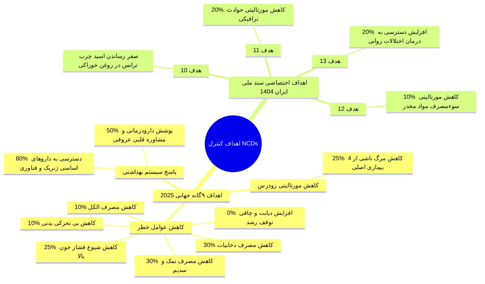

> [!tip] تمایز مفهومی در هدف ۱۳ ملی
> تفاوت میان **Availability** (موجود بودن دارو و تخت در کشور) و **Accessibility** (دسترسی‌پذیری واقعی بیمار). مانع اصلی درمان در روانپزشکی **انگ اجتماعی (Stigma)** و پنهان‌کاری بیمار است، نه صرفاً کمبود فیزیکی دارو.

---

## ۳. رویکردهای نوین و مقایسه تفاوت‌های جنسیتی

| محور پدیده‌های نوظهور | رویکرد نوین متناظر در خدمات سلامت |
| :--- | :--- |
| **ترکیب جدید سنی جمعیت (تورم میانسالی)** | خدمات مبتنی بر گروه سنی و خدمات مبتنی بر جنسیت |
| **چهره نوین اپیدمیولوژیک بیماری‌ها** | تغییر اولویت‌ها از عفونی به مزمن و پاسخگویی به نیازهای نوین |
| **پزشک خانواده و محدودیت شدید منابع** | ادغام عمودی و افقی و ارتقای جامعیت خدمات سلامت |
| **پیچیدگی و همزمانی بیماری‌ها (Comorbidity)** | توانمندسازی مردم و ادغام *خودمراقبتی* در بسته خدمت |
| **تاثیر فزاینده عوامل اجتماعی بر سلامت (SDH)** | ادغام خدمات سلامت در بسته‌های حمایتی اجتماعی و بین‌بخشی |

### مقایسه ابعاد سلامت و مرگ‌ومیر بر پایه جنسیت

| مولفه مقایسه            | الگوی مردان میانسال                                                                                  | الگوی زنان میانسال                                                                |
| :---------------------- | :--------------------------------------------------------------------------------------------------- | :-------------------------------------------------------------------------------- |
| **مواجهه و حوادث شغلی** | **حوادث ترافیکی** (۵ برابر زنان)، **اعتیاد** (۱۰ برابر زنان)، **سقوط** (۳ برابر زنان)، کار در ارتفاع | مواجهات ارگونومیک خانگی، استرس مراقبت از اعضای خانواده                            |
| **رفتارهای پرخطر**      | مصرف بالاتر **دخانیات**، رفتارهای خشن/مخاطره‌آمیز **رانندگی**، سوءمصرف مواد                          | **کم‌تحرکی** بدنی بالاتر، چاقی شکمی با شیوع بیشتر                                 |
| **علل اصلی مورتالیتی**  | سوانح و حوادث، قتل، تروماهای مکانیکی، بیماری‌های شغلی                                                | بیماری ایسکمیک **قلب** (IHD)، حوادث عروقی **مغز**، عوارض **دیابت**/**فشارخون**    |
| **علل شایع موربیدیتی**  | COPD، سوختگی، اسکیزوفرنی، آسم، خودکشی، عفونت ایدز (HIV)                                              | افسردگی و اضطراب، کمردرد و آرتروز، کم‌خونی، عوارض منوپوز، سرطان پستان و دهانه رحم |
| **عوامل اجتماعی (SDH)** | اجبار نان‌آوری در شرایط پرخطر، استرس مالی، عدم تمایل به مراجعه                                       | خشونت خانگی، وابستگی مالی و عدم استقلال، موانع تردد فیزیکی/امنیتی در LMICs        |

> [!info] اصل راندمان خودمراقبتی (Self-Care)
> در صورت توانمندسازی و آموزش صحیح آحاد جامعه، **۶۵ تا ۸۵ درصد** کل مراقبت‌های سلامت مستقیماً توسط خود فرد و خانواده و بدون نیاز به ورود متخصصین سطح بالا قابل انجام است.

---

## ۴. بسته سلامت باروری، منوپوز و ایمن‌سازی

### مشکلات و عوارض دوره منوپوز
- **علائم سوماتیک/وازوموتور:** گرگرفتگی، تعریق شبانه، بی‌خوابی، دیس‌پارونی، آتروفی اوروژنیتال، ماستالژی، سردردهای میگرنی، آرتریت و دردهای مفصلی.
- **علائم روانی:** اضطراب، تحریک‌پذیری خلقی، خستگی مفرط، افت تمرکز، کاهش میل جنسی، افسردگی، بحران میانسالی (*Midlife Crisis*).
- **عوارض درازمدت سیستمیک:** شتاب‌گیری بیماری‌های عروق کرونر، استئوپروز سریع، بی‌اختیاری ادراری.
- **غربالگری‌های اختصاصی مطب/پایگاه:** پاپ اسمیر و تست مولکولی HPV، معاینه بالینی پستان و ماموگرافی، ارزیابی خونریزی غیرطبیعی رحمی (AUB)، غربالگری خشونت خانگی (*Domestic Violence*).

### ایمن‌سازی در میانسالان
1. **واکسن دوگانه کزاز-دیفتری (Td):** تزریق روتین کشوری با دوز یادآور **هر ۱۰ سال یک‌بار** (پیشگیری قطعی از کزاز نوزادی در بارداری‌های انتهای دوره باروری).
2. **واکسن هپاتیت B:** تزریق الزامی در کلیه گروه‌های پرخطر شغلی، رفتاری و خونی.
3. **واکسن آنفلوانزا:** تزریق **سالیانه پیش از شروع فصل سرما (پاییز)** در گروه‌های واجد شرایط: افراد با سن بالا، مبتلایان به نقایص سیستم ایمنی، بیماران زمینه‌ای مزمن قلبی-ریوی، پرسنل بهداشتی درمانی.
   - *نکته اجرایی:* تامین هزینه واکسن آنفلوانزا در حال حاضر بر عهده خود متقاضی است.

---

## ۵. ارزیابی تن‌سنجی (Anthropometry) و طبقه‌بندی BMI

> [!info] فرمول نمایه توده بدنی
> مقدار نمایه از تقسیم وزن بر حسب کیلوگرم بر توان دوم قد بر حسب متر به دست می‌آید: BMI = وزن (کیلوگرم) / [قد (متر)]²
> - دور کمر آستانه خطر در دستورالعمل کشوری: **۹۰ سانتی‌متر و بیشتر**.

| رده وزنی               | دامنه عددی BMI | دور کمر (cm) | تریاژ رنگی   | مداخله استاندارد                                                                     |
| :--------------------- | :------------- | :----------- | :----------- | :----------------------------------------------------------------------------------- |
| **لاغری (کم‌وزنی)**    | کمتر از ۱۸.۵   | هر اندازه‌ای | **قرمز**     | ارجاع به پزشک جهت بررسی علل زمینه‌ای ⇦ ارجاع به کارشناس تغذیه                        |
| **طبیعی**              | ۱۸.۵ تا ۲۴.۹   | کمتر از ۹۰   | **سبز**      | تشویق به حفظ وضع موجود؛ خودمراقبتی؛ مراقبت دوره‌ای بعدی ۳ سال بعد (در نمره تغذیه ۱۲) |
| **طبیعی با چاقی شکمی** | ۱۸.۵ تا ۲۴.۹   | ۹۰ و بیشتر   | **زرد**      | آموزش عوارض چاقی شکمی و سندرم متابولیک؛ مداخله بر اساس نمره الگوی تغذیه              |
| **اضافه وزن**          | ۲۵.۰ تا ۲۹.۹   | کمتر از ۹۰   | **زرد**      | تجویز کاهش وزن **۲ تا ۴ کیلوگرم در ماه**؛ اصلاح الگوی فعالیت؛ پیگیری دوره‌ای         |
| **اضافه وزن پرخطر**    | ۲۵.۰ تا ۲۹.۹   | ۹۰ و بیشتر   | **زرد/قرمز** | آموزش خطر مازاد بیماری‌های مزمن؛ ارجاع بر اساس جدول تلفیقی تغذیه                     |
| **چاقی درجه ۱**        | ۳۰.۰ تا ۳۴.۹   | هر اندازه‌ای | **قرمز**     | ارجاع به پزشک ⇦ ارجاع از پزشک به کارشناس تغذیه                                       |
| **چاقی درجه ۲**        | ۳۵.۰ تا ۳۹.۹   | هر اندازه‌ای | **قرمز**     | ارجاع به پزشک ⇦ ارجاع از پزشک به کارشناس تغذیه                                       |
| **چاقی درجه ۳ (شدید)** | ۴۰.۰ و بیشتر   | هر اندازه‌ای | **قرمز**     | ارجاع به پزشک ⇦ ارجاع از پزشک به کارشناس تغذیه                                       |

---

## ۶. ارزیابی الگوی تغذیه و استانداردهای مصرف

### پرسشنامه ۶ سوالی ارزیابی الگوی تغذیه
- هر سوال بین **۰ تا ۲ امتیاز**؛ مجموع حداکثر امتیاز = **۱۲ امتیاز** (امتیاز **۸ و بالاتر** مطلوب است):
  1. *میوه:* روزانه $\ge 2$ واحد (۲ امتیاز) | $< 2$ واحد (۱ امتیاز) | بندرت/هرگز (۰ امتیاز).
  2. *سبزی:* روزانه $\ge 3$ واحد (۲ امتیاز) | $< 3$ واحد (۱ امتیاز) | بندرت/هرگز (۰ امتیاز).
  3. *لبنیات:* روزانه $\ge 2$ واحد (۲ امتیاز) | $< 2$ واحد (۱ امتیاز) | بندرت/هرگز (۰ امتیاز).
  4. *نمکدان سر سفره:* بندرت/هرگز (۲ امتیاز) | گاهی (۱ امتیاز) | همیشه (۰ امتیاز).
  5. *فست‌فود و نوشابه گازدار:* بندرت/هرگز (۲ امتیاز) | ۱ تا ۲ بار در ماه (۱ امتیاز) | $\ge 2$ بار در ماه (۰ امتیاز).
  6. *نوع روغن مصرفی:* فقط مایع گیاهی/سرخ‌کردنی (۲ امتیاز) | تلفیقی از مایع و جامد (۱ امتیاز) | فقط روغن جامد/نیمه‌جامد/حیوانی (۰ امتیاز).

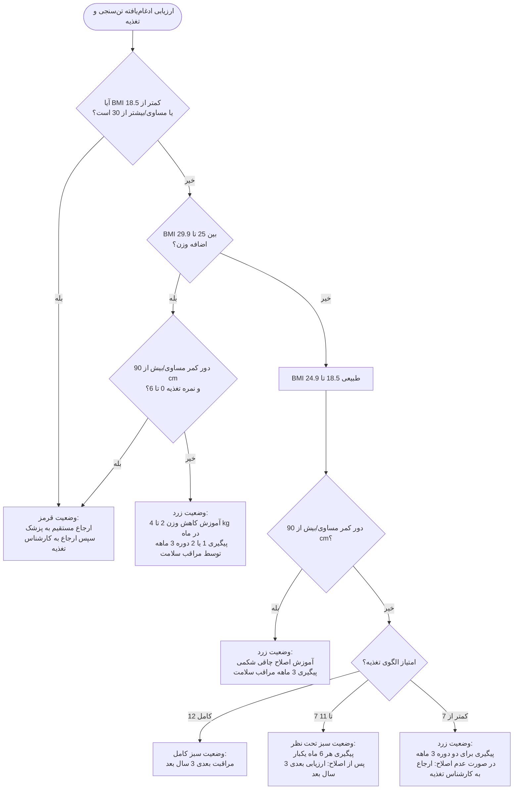

### مقادیر مصرف روزانه گروه‌های غذایی اصلی و اندازه هر واحد

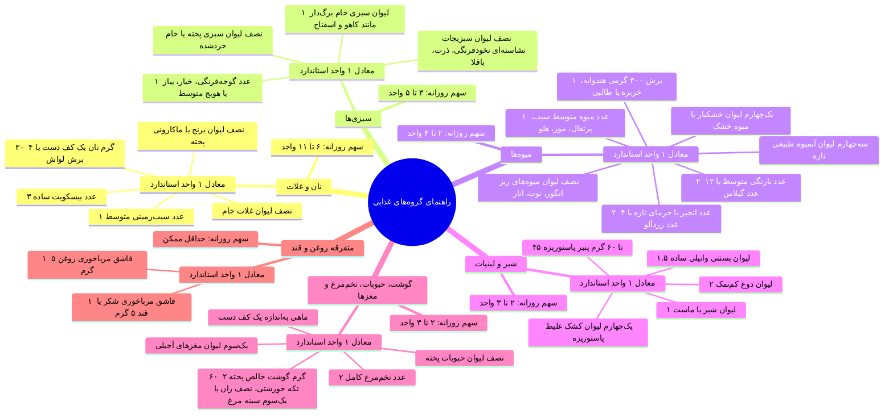

> [!tip] مکمل‌یاری ویتامین D و ماهی
> - **ویتامین D:** تحویل یک عدد پرل **۵۰,۰۰۰ واحدی ماهانه** به تمام افراد میانسال بدون نیاز به اندازه‌گیری سطح سرمی در پروتکل پایه بهداشتی.
> - **ماهی:** مصرف حداقل **۲ بار در هفته** (پخت بخارپز، آب‌پز یا تنوری؛ پرهیز کامل از سرخ‌کردن عمیق).

---

## ۷. ارزیابی فعالیت فیزیکی، استعمال دخانیات و پرسشنامه PAR-Q

### فعالیت فیزیکی استاندارد میانسالان
- **توصیه پایه:** حداقل **۵ روز در هفته**، هر بار **حداقل ۳۰ دقیقه** ورزش *هوازی* با شدت *متوسط* (حداقل **۱۵۰ دقیقه در هفته**).
- **شاخص شدت متوسط با Talk Test:** توانایی حفظ مکالمه صوتی حین انجام تمرین بدون به شماره افتادن شدید تنفس طی ۲۰ تا ۶۰ دقیقه پیاده‌روی.
- **معیار عملی:** پیاده‌روی تند مسافت **۲.۵ تا ۳ کیلومتر در مدت ۳۰ دقیقه**.
- **پرسشنامه آمادگی فعالیت بدنی (PAR-Q):** ابزار غربالگری ۱۶ سوالی جهت سنجش ایمنی قلبی-عروقی، اسکلتی-مفصلی، مصرف داروها و علائم گیجی/سنکوپ قبل از شروع ورزش یا ارتقای سطح تمرینات.

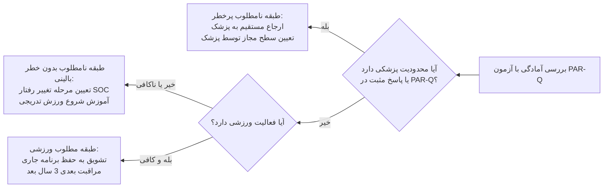

### ارزیابی استعمال دخانیات
> [!info] تعاریف مرجع WHO در دخانیات
> - **فرد سیگاری (Current Smoker):** مصرف حداقل **۱۰۰ نخ سیگار** در طول زندگی و استمرار مصرف در زمان حال.
> - **مصرف‌کننده قلیان/پیپ:** مصرف بیش از **۲۰ اونس (معادل ۵۰۰ گرم)** توتون در طول عمر و استمرار مصرف در زمان حال.


> [!danger] تله تستی مقایسه پاتولوژیک قلیان در برابر سیگار
> - **نیکوتین:** یک وعده قلیان کشیدن معادل نیکوتین موجود در **یک بسته کامل سیگار (۲۰ نخ)** است.
> - **حجم دود استنشاقی:** هر تک پُک قلیان **۲۳ برابر** یک پُک سیگار دود به مجاری تنفسی وارد می‌کند.
> - **مونوکسید کربن (CO):** غلظت CO در دود قلیان تا **۳۰ برابر** بیشتر از سیگار است و تمام ترکیبات کارسینوژن دود سیگار را داراست.

### سطوح مواجهه و مدیریت دخانیات
- **دست اول:** فرد مصرف‌کننده فعال.
- **دست دوم:** استنشاق تحمیلی غیرفعال دود اطرافیان در منزل یا محل کار.
- **دست سوم:** رسوب ترکیبات کارسینوژن و ذرات سمی دوده بر دیوارها، مبل، فرش و لباس‌ها که تا *ماه‌ها و سال‌ها* پایدار می‌ماند.

| طبقه‌بندی بالینی | وضعیت مصرف مراجعه‌کننده | تریاژ | اقدام مداخله‌ای استاندارد |
| :--- | :--- | :--- | :--- |
| **مشکوک به وابستگی نیکوتین** | مصرف مستمر روزانه هر ماده دخانی در ۱ ماه اخیر | **قرمز** | ارجاع به کارشناس سلامت روان؛ غربالگری تکمیلی وابستگی؛ مشاوره ترک؛ در صورت لزوم ارجاع به پزشک برای دارودرمانی؛ پیگیری در فواصل ۱ هفته، ۱ ماه، ۳ ماه، ۶ ماه و ۱۲ ماه |
| **در معرض خطر وابستگی** | مصرف تفننی و غیرمستمر در ۱ ماه اخیر | **قرمز** | ارجاع به کارشناس سلامت روان جهت پیشگیری اولیه و قطع کامل مواجهه |
| **مواجهه تحمیلی با دود** | عدم مصرف در ۱ سال اخیر، ولی تماس دست دوم یا سوم در ۱ ماه گذشته | **زرد** | آموزش تکنیک‌های امتناع و اجتناب از دود تحمیلی؛ آموزش عوارض تنفسی و انکولوژیک |
| **غیرسیگاری سالم** | عدم سابقه مصرف (یا گذشت حداقل ۱ سال از ترک کامل) بدون تماس دست دوم/سوم | **سبز** | بازخورد مثبت؛ ترویج خودمراقبتی؛ ارزیابی در دوره مراقبت بعدی |

---

## ۸. ارزیابی ریسک قلبی-عروقی (CVD Risk Chart)

> [!important] پارامترهای ۷گانه جدول فرامینگهام در مدل کشوری
> مجموع امتیازات تعیین‌‌کننده خطر پیش‌بینی‌شده رخداد حوادث کشنده و غیرکشنده قلبی-عروقی در **۵ سال و ۱۰ سال آینده** است:
> 1. سن (محاسبه نمره اختصاصی بر اساس جنسیت).
> 2. سطح کلسترول تام خون (mmol/L).
> 3. سطح کلسترول HDL خون (mmol/L).
> 4. فشار خون سیستولیک (SYS.BP بر حسب mmHg).
> 5. **دیابت:** برای مردان ۳ امتیاز، ولی برای زنان **۶ امتیاز** تعلق می‌گیرد (*نکته به‌شدت تست‌خیز*).
> 6. **استعمال دخانیات:** ۴ امتیاز (برای هر دو جنس یکسان).
> 7. **هایپرتروفی بطن چپ (LVH) در نوار قلب:** ۹ امتیاز.

### جدول امتیازدهی متغیرهای بالینی

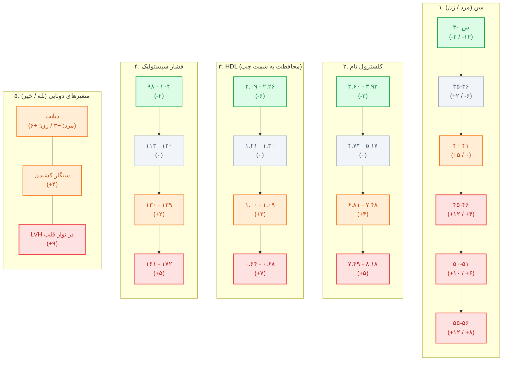

### جدول تبدیل مجموع امتیاز به خطر درصدی حوادث CVD

```chart
{
  "title": "درصد احتمال خطر ۵ و ۱۰ ساله بر اساس مجموع امتیازات",
  "subtitle": "محاسبه بر حسب درصد (%) بر روی محور امتیازات",
  "type": "line",
  "data": [
    { "name": "<۱", "risk5Year": 1, "risk10Year": 2 },
    { "name": "۵", "risk5Year": 1, "risk10Year": 3 },
    { "name": "۱۰", "risk5Year": 2, "risk10Year": 6 },
    { "name": "۱۵", "risk5Year": 5, "risk10Year": 10 },
    { "name": "۱۸", "risk5Year": 7, "risk10Year": 14 },
    { "name": "۲۰", "risk5Year": 8, "risk10Year": 18 },
    { "name": "۲۴", "risk5Year": 13, "risk10Year": 25 },
    { "name": "۲۵ (شاخص)", "risk5Year": 14, "risk10Year": 27 },
    { "name": "۲۸", "risk5Year": 19, "risk10Year": 33 },
    { "name": "۳۰", "risk5Year": 22, "risk10Year": 38 },
    { "name": "۳۲+", "risk5Year": 25, "risk10Year": 42 }
  ],
  "metrics": [
    { "key": "risk5Year", "name": "احتمال خطر ۵ ساله (%)", "color": "#3b82f6" },
    { "key": "risk10Year", "name": "احتمال خطر ۱۰ ساله (%)", "color": "#f97316" }
  ]
}
```

> [!danger] حل کیس بالینی رفرنس کلاس و امتحانات
> **سناریو:** خانم ۵۰ ساله، مبتلا به دیابت، سیگاری، با HDL برابر با ۱ میلی‌مول بر لیتر، کلسترول تام ۸ میلی‌مول بر لیتر و فشار خون سیستولیک ۱۳۰ میلی‌متر جیوه.
> **محاسبه گام‌به‌گام نمره:**
> - سن ۵۰ سال (زن) = **۶ امتیاز**
> - دیابت در زن = **۶ امتیاز** (تله: در مردان ۳ است)
> - سیگاری بودن = **۴ امتیاز**
> - کلسترول HDL معادل ۱ (بازه ۱.۰۰-۱.۰۹) = **۲ امتیاز**
> - کلسترول تام معادل ۸ (بازه ۷.۴۹-۸.۱۸) = **۵ امتیاز**
> - فشار خون سیستولیک ۱۳۰ (بازه ۱۳۰-۱۳۹) = **۲ امتیاز**
> - مجموع امتیاز: $6 + 6 + 4 + 2 + 5 + 2 = \mathbf{25}$
> - **تفسیر نهایی خطر بیمار:** احتمال رخداد حادثه قلبی عروقی در **۵ سال آینده برابر با ۱۴%** و در **۱۰ سال آینده برابر با ۲۷%** است.

```chart
{
  "title": "شاخص‌های کمی اهداف جهانی NCDs تا سال 2025",
  "subtitle": "درصد هدف‌گذاری جهانی WHO تا ۲۰۲۵ (%)",
  "type": "bar",
  "data": [
    { "name": "کاهش مرگ زودرس", "target": 25 },
    { "name": "کاهش الکل", "target": 10 },
    { "name": "کاهش بی تحرکی", "target": 10 },
    { "name": "کاهش سدیم/نمک", "target": 30 },
    { "name": "کاهش مصرف دخانیات", "target": 30 },
    { "name": "کاهش فشار خون", "target": 25 }
  ],
  "metrics": [
    { "key": "target", "name": "درصد هدف‌گذاری جهانی WHO (%)", "color": "#06b6d4" }
  ]
}
```
