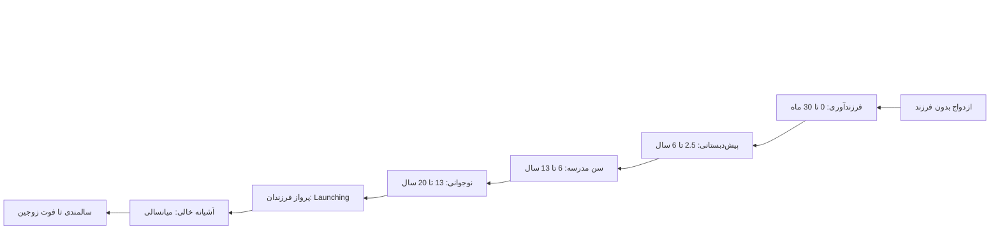
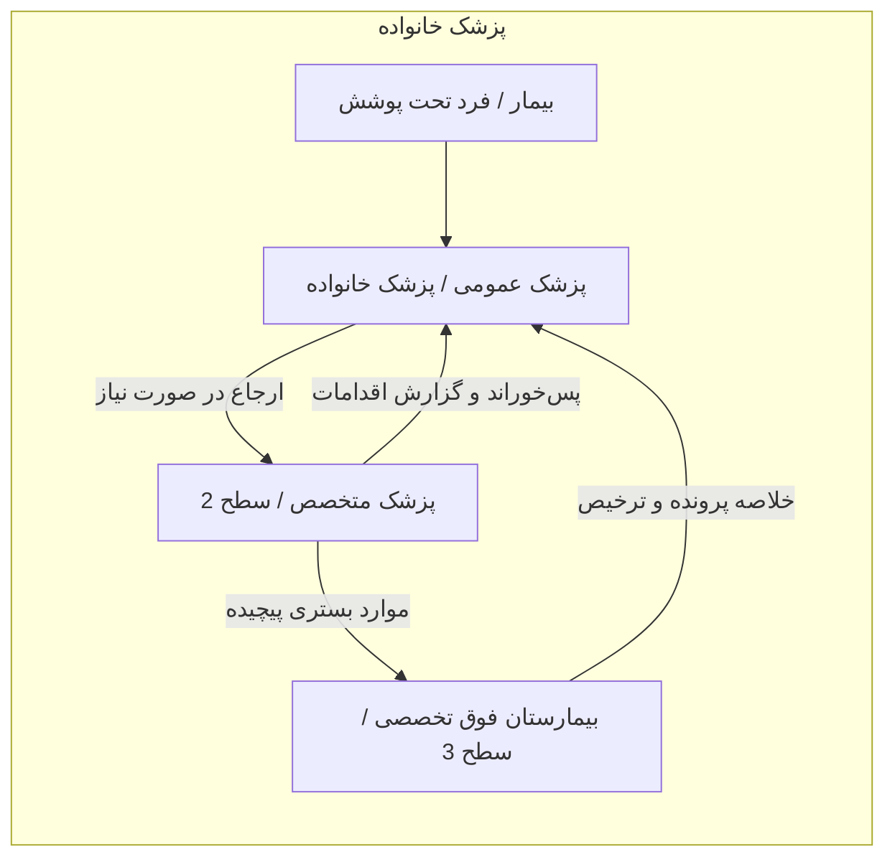
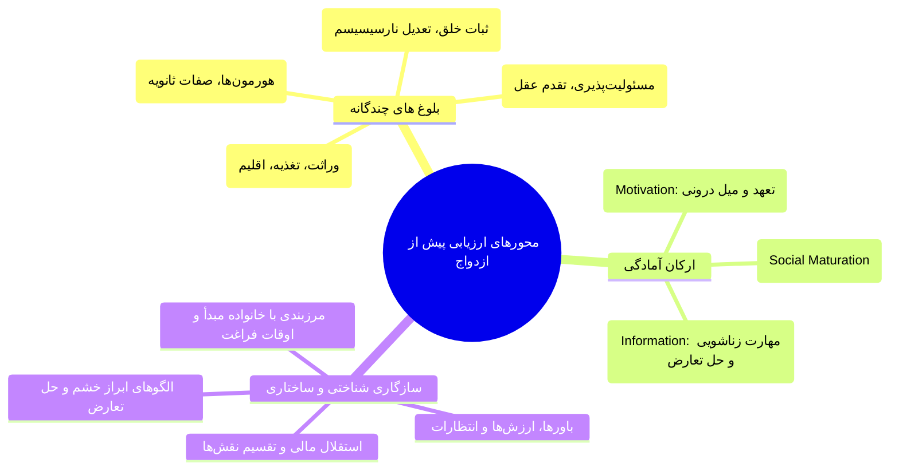
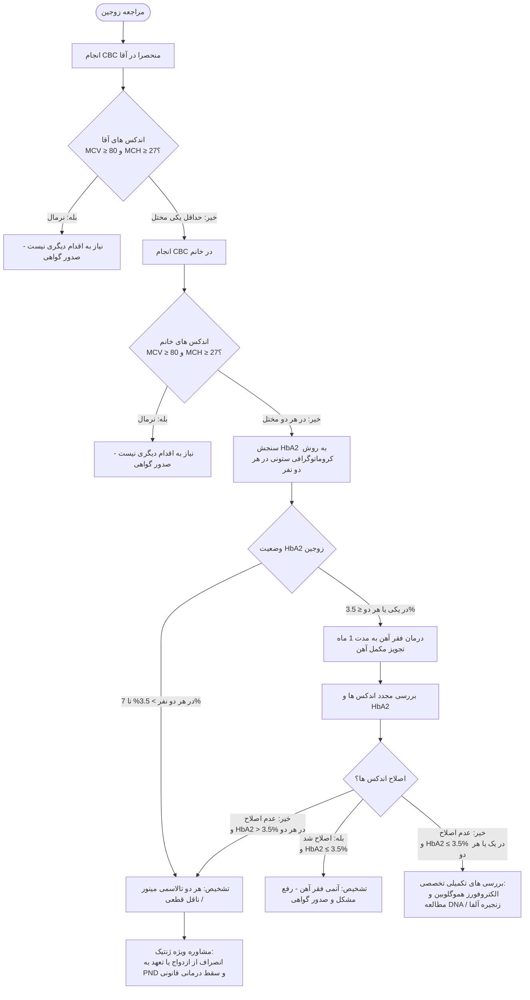
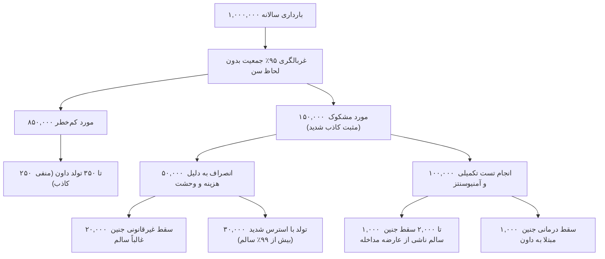
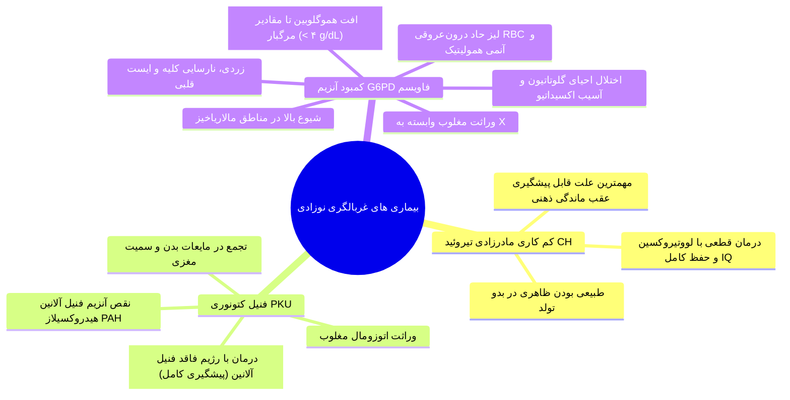
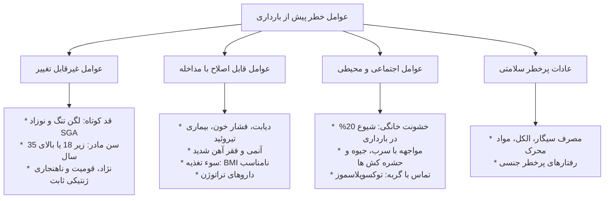
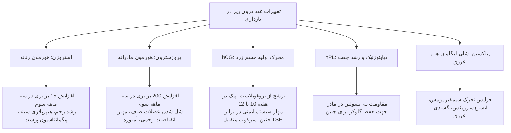
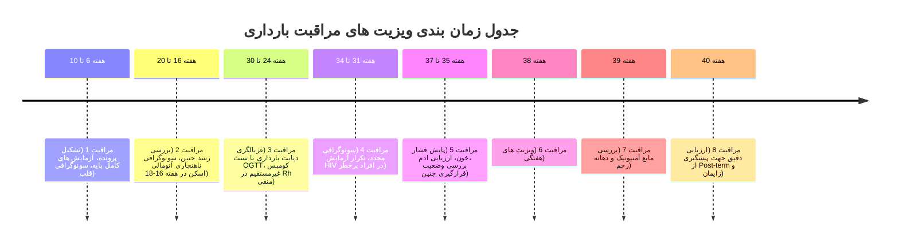

# خلاصه بهداشت خانواده (جلسات ۱ تا ۵)

## بخش ۱: کلیات سلامت خانواده، نظریه توسعه و ساختار نظام سلامت

> [!abstract] تعریف سلامت خانواده (Family Health)
> وضعیتی پویا شامل ارتقا و حفظ سلامت جسمی، روانی، اجتماعی و معنوی برای کل واحد خانواده و تک‌تک اعضا در تمامی مراحل زندگی. سلامت خانواده **فراتر از مجموع جبری سلامت تک‌تک افراد** است؛ زیرا روابط درون‌خانوادگی و تعامل با محیط‌های زیستی، انسانی و فیزیکی را در بر می‌گیرد و به عنوان **پل ارتباطی میان سلامت فردی و جامعه** عمل می‌کند.

### تعاریف ساختار خانواده
1. **دیدگاه بیولوژیک/حقوقی عمومی:** گروهی متشکل از دو یا چند نفر با پیوند خونی، زناشویی یا فرزندخواندگی که زیر یک سقف زندگی کرده و بودجه مشترک دارند.
2. **دیدگاه نوین غربی:** هم‌خانگی مشترک بدون الزام قانونی، زیستی یا ازدواج (شامل خانواده‌های هم‌جنس یا *Cohabitation* که در حقوق ایران فاقد وجاهت قانونی است).
3. **دیدگاه اسلام:** نهادی دارای شخصیت حقوقی، مدنی و معنوی؛ برآمده از **عقد نکاح مشروع** میان زن و مرد با حقوق، وظایف، احکام ارث و انفاق معین، به عنوان کانون اصلی اخلاق، تربیت و آماده‌سازی فرد برای ورود به جامعه.

### نظریه توسعه و چرخه زندگی خانواده (Duvall Family Life Cycle)
خانواده نظامی در حال تغییر و تکامل است. آسیب به مهارت‌های هر دوره قابل جبران در دوره‌های بعدی است، اما غفلت از آن چالش‌زا است.

| مرحله تکاملی (Stage)              | بازه زمانی و مشخصات                     | وظایف تحولی اصلی (Developmental Tasks)                                                          |
| :-------------------------------- | :-------------------------------------- | :---------------------------------------------------------------------------------------------- |
| **۱. زوجین بدون فرزند**           | از ازدواج تا تولد نخستین فرزند          | انطباق با زندگی مشترک، تنظیم روابط با خانواده پدری (*Family-of-origin*) و شبکه‌های اجتماعی      |
| **۲. فرزندآوری**                  | از تولد فرزند اول تا ۳۰ ماهگی او        | تطبیق ساختار خانواده با نوزاد، شکل‌گیری نقش‌های والدینی، بازتعریف روابط با خانواده گسترده       |
| **۳. پیش‌دبستانی**                | فرزند اول ۲.۵ تا ۶ سال                  | جامعه‌پذیری و آموزش کودکان، بازتنظیم شیوه‌های فرزندپروری هم‌زمان با تولد فرزندان بعدی           |
| **۴. سنین مدرسه**                 | فرزند اول ۶ تا ۱۳ سال                   | راهنمایی تحصیلی/اخلاقی، تعامل هدفمند با نهادهای برون‌خانوادگی (مدارس و مراکز تفریحی)            |
| **۵. نوجوانی**                    | فرزند اول ۱۳ تا ۲۰ سال                  | ایجاد تعادل میان *استقلال‌طلبی* نوجوان و مرزهای امن *انضباطی*، مدیریت بحران‌های میانسالی والدین |
| **۶. پرواز یا پرتاب (Launching)** | ترک خانه توسط فرزند اول تا آخر          | برقراری رابطه *بالغ-بالغ* با فرزندان، حل مسائل شغلی/زناشویی میانسالی، مراقبت از والدین سالمند   |
| **۷. خانواده میانسال**            | آشیانه خالی (*Empty Nest*) تا بازنشستگی | بازسازی رابطه دوتایی زوجین بدون حضور فرزندان، تداوم مراقبت از بستگان سالخورده                   |
| **۸. سالمندی**                    | بازنشستگی تا فوت هر دو همسر             | تطابق با دوران بازنشستگی، ایفای نقش پدربزرگ/مادربزرگ، پذیرش سوگ همسر و افت قوای جسمی            |



### کارکردهای بنیادین خانواده سالم
* **محبت و ارتباط عاطفی (Companionship):** شالوده پایداری زناشویی؛ عامل اصلی تاب‌آوری در بحران‌ها و حوادث.
* **باروری و تولید مثل:** حفظ بقای نسل (در صورت نقص: استفاده از *روش‌های کمک‌باروری ART یا فرزندخواندگی*).
* **عملکرد جنسی:** ارضای غریزه در چارچوب شرعی و جامعه‌پذیری صحیح هویت جنسیتی فرزندان.
* **جامعه‌پذیری (Socialization):** انتقال الگوهای رفتاری، کنترل هیجانات و آماده‌سازی فرزندان برای زیست جمعی.
* **حمایت اجتماعی و همکاری اقتصادی:** مدیریت معیشت، یادگیری هوش مالی و پشتیبانی همه‌جانبه در چالش‌ها.

> [!tip] نشانه‌های شش‌گانه خانواده مطلوب
> ۱. حفظ بنیادهای معنوی، ۲. اولویت‌بخشی به مصالح خانواده، ۳. احترام متقابل، ۴. گفت‌وگو و مهارت گوش دادن فعال، ۵. اهتمام به خدمت‌رسانی به دیگران، ۶. پذیرش نامشروط اعضا و فراهم‌سازی بستر اصلاح خطا.

### ساختارهای گوناگون خانواده
* **خانواده هسته‌ای (Nuclear):** متشکل از پدر، مادر و فرزندان؛ ساختار غالب در مدرنیته؛ محدودیت تنوع تجارب و تعاملات اجتماعی، اما خودمختاری بالاتر.
* **خانواده گسترده (Extended):** حضور چند نسل (پدربزرگ، مادربزرگ، عموها و...) زیر یک سقف با اقتصاد مشترک؛ بستر یادگیری غنی اما انتقال‌پذیری سریع تنش‌های فردی به کل ساختار.
* **خانواده تک‌والد (Single-Parent):** ناشی از طلاق، فوت یا تجرد قطعی؛ ریسک بالای اختلال در نقش‌پذیری عاطفی و وابستگی‌های روان‌شناختی مفرط.

---

### مقایسه نظام‌های مدیریت سلامت

| شاخص مقایسه‌ای                      | نظام تعاون همگانی (Open System)                           | نظام ارجاع و پزشک خانواده (Gatekeeping)                    |
| :---------------------------------- | :-------------------------------------------------------- | :--------------------------------------------------------- |
| **آزادی انتخاب مراجعه‌کننده**       | **نامحدود**؛ مراجعه مستقیم به هر سطح تشخیصی/تخصصی         | مرحله‌بندی شده؛ *ورود اجباری از سطح ۱*                     |
| **هزینه‌های نظام سلامت**            | بسیار سنگین، اتلاف منابع پاراکلینیک، القای خدمات غیرضروری | **بهینه**، کنترل هزینه‌های عمومی و محافظت مالی از خانوار   |
| **ثبت سوابق و پیگیری (Continuity)** | بسیار ضعیف؛ درمان‌های متناقض و پلی‌فارماسی شایع           | دقیق در قالب پرونده الکترونیک سلامت؛ **فالوآپ مستمر**      |
| **نقش پزشک عمومی**                  | تضعیف‌شده؛ فاقد نظارت بر فرایند درمان بیمار               | کلیدی؛ **هماهنگ‌کننده (Coordinator)** سلامت جمعیت تحت پوشش |
| **نیاز به بسترسازی فرهنگی**         | بسیار پایین (به دلیل آزادی سلیقه‌ای مردم)                 | **بسیار بالا** (نیازمند اصلاح رفتار جامعه و کادر درمان)    |



### تعیین‌کننده‌های اجتماعی سلامت (SDOH)
عواملی ساختاری نظیر محل زندگی، کار، تحصیل، درآمد و سیاست‌های کلان که بیش از تصمیمات فردی، سلامت را  جهت‌دهی می‌کنند:
* **سبک زندگی (Lifestyle):** ۵۰% (*بزرگ‌ترین سهم*؛ تغذیه، تحرک، مصرف دخانیات) #امتحانی 
* **عوامل محیطی (Environment):** ۲۰% (آب، هوا، آلودگی‌های شیمیایی)
* **خدمات و نظام سلامت (Health Care System):** ۲۰% (دسترسی، تکنولوژی، کیفیت خدمات)
* **ژنتیک و بیولوژی فردی:** ۱۰% (آسیب‌پذیری ساختاری غیرقابل تغییر)

```chart
{
  "title": "پایش همزمان قندخون و پتاسیم در پروتکل DKA",
  "subtitle": "پتاسیم برای خوانایی در مقیاس قند، ضرب‌در ۱۰۰ شده است",
  "type": "line",
  "data": [  
    { "time": "ساعت ۰", "bloodSugar": 480, "potassium_x100": 540 },
    { "time": "ساعت ۲", "bloodSugar": 390, "potassium_x100": 480 },
    { "time": "ساعت ۴", "bloodSugar": 310, "potassium_x100": 420 },
    { "time": "ساعت ۶", "bloodSugar": 240, "potassium_x100": 390 },
    { "time": "ساعت ۸", "bloodSugar": 190, "potassium_x100": 410 },
    { "time": "ساعت ۱۰", "bloodSugar": 165, "potassium_x100": 400 },
    { "time": "ساعت ۱۲", "bloodSugar": 150, "potassium_x100": 420 }
  ],
  "metrics": [
    { "key": "bloodSugar", "name": "گلوکز سرم (mg/dL)", "color": "#ef4444" },
    { "key": "potassium_x100", "name": "پتاسیم (مقدار × ۱۰۰)", "color": "#3b82f6" }
  ]
}
```

---

## بخش ۲: مشاوره و آموزش‌های پیش از ازدواج

### ماهیت و زمان طلایی مداخله
* **تعریف:** فرایندی آموزشی-روان‌شناختی جهت ارزیابی آمادگی‌های چندگانه طرفین و اصلاح انتظارات نامعقول؛ این فرایند نقشی *بازدارنده از تروماهای آتی* دارد و نوعی **مداخله درمانی روان‌شناختی** تلقی می‌شود.
* **زمان طلایی:** در ابتدای آشنایی، **قبل از شکل‌گیری دلبستگی عاطفی عمیق**، مشروط به تمایل دوجانبه برای بررسی امکان زندگی مشترک.



> [!info] توالی مراحل بلوغ
> فاصله میان هر مرحله از بلوغ با مرحله بعد حدود **۳ تا ۴ سال** است:
>1. **بلوغ جسمی:** رشد فیزیکی و ترشح هورمون‌های اولیه؛ تحت تأثیر *وراثت، تغذیه، اقلیم و آب‌‌وهوا*.
>2. **بلوغ جنسی:** ترشح هورمون‌های جنسی و تکوین صفات ثانویه جنسی.
>3. **بلوغ روانی (۳ تا ۴ سال پس از بلوغ جسمی):** آرامش و ثبات نسبی، تسلط روان بر غرایز جسمی، بروز *عشق‌های رمانتیک* و افزایش حالات *خودشیفتگی (Narcissism)*.
>4. **بلوغ اجتماعی (۳ تا ۴ سال پس از بلوغ روانی):** مسئولیت‌پذیری در قبال دیگری، مهار هیجانات سطحی، تقدم عقل بر عاطفه، برقراری پیوندهای عمیق و پایدار، و تمایل عقلانی به تعهد زناشویی.
> **نکته کلیدی:** چالش‌ها و مسئولیت‌های زودهنگام بلوغ اجتماعی را **تسریع**، و محیط‌های بی‌تنش و بدون مسئولیت آن را **به تعویق** می‌اندازند.
### سیمای اپیدمیولوژیک طلاق در ایران (مهم)

* **نرخ کلی:** حدود **۹۷٪** افراد بالغ در جهان حداقل یک‌بار ازدواج می‌کنند؛ طی ۱۵ سال اخیر نرخ ازدواج *تقریباً ثابت*، اما نرخ طلاق *صعودی* بوده است.
* **بحرانی‌ترین بازه (۵۰٪ طلاق‌ها):** در **۵ سال نخست زندگی**.
* **بیشترین فراوانی سالانه:** **سال اول ازدواج** (سال عسل؛ *ناشی از فقدان شناخت متقابل*، نه فقر یا مسائل برون‌خانوادگی).
* **پیک دوم طلاق:** سال‌های **۲۰ تا ۲۴ زندگی مشترک** (هم‌‌زمان با دگرگونی‌های جمعیتی و جابه‌جایی ارزش‌ها).
* **اختلاف سنی و ریسک طلاق:**
  * **بیشترین میزان طلاق:** زوجین با **سن یکسان** (اختلاف سنی صفر).
  * **ریسک بالا:** *بزرگ‌تر بودن زوجه* از زوج. #امتحانی 
  * **پایین‌ترین طلاق:** *بزرگ‌تر بودن منطقی مرد* نسبت به زن.
* **الگوی استانی:** نسبت ازدواج به طلاق کشوری حدود ۳ به ۱ (در نه ماهه سال ۱۳۹۵ حدود ۳.۰۹)؛ **کمترین طلاق نسبی در سیستان و بلوچستان** (۱۷ به ۱)؛ **بیشترین طلاق نسبی در تهران، البرز و قم** (۲ به ۱)؛ **بیشترین طلاق مطلق در تهران، خراسان رضوی، اصفهان، فارس**
* **شایع‌ترین سن ازدواج ثبت‌شده (سال ۱۳۹۴):** *مردان ۲۰ تا ۲۴ سال* با *زنان ۱۵ تا ۱۹ سال* (بیش از ۱۰۲ هزار رویداد).

### بسته کشوری آموزش‌های حین ازدواج
تغییر برنامه از کلاس‌های ناکارآمد ۲ ساعته به **دوره جامع ۶ ساعته (سه جلسه ۲ ساعته) در ۴ محور تخصصی**:
1. **محور بهداشت و باروری:** آناتومی، فیزیولوژی بارداری، تنظیم خانواده و سلامت جنسی.
2. **محور احکام و حقوق (۲ ساعت):** تکالیف قانونی زوجین، شروط ضمن عقد، مهریه و نفقه.
3. **محور روان‌شناسی:** مهارت‌های ارتباطی، حل تعارض، سازگاری و کنترل خشم.
4. **محور پیشگیری از رفتارهای پرخطر:** غربالگری بیماری‌های واگیر و اعتیاد.

---

### الگوریتم ملی غربالگری تالاسمی قبل از ازدواج #امتحانی 
کم‌خطرترین، عاقلانه‌ترین و ارزان‌ترین روش پیشگیری از تولد تالاسمی ماژور با پوشش ۱۰۰% جمعیت، بر اساس بخشنامه *از سال ۱۳۷۲*: #امتحانی 



> [!warning] نکات کلیدی غربالگری تالاسمی
> * آزمایش ابتدایی صرفاً از **مرد** گرفته می‌شود؛ فقط در صورت اختلال اندکس‌ها (MCV < 80 fl یا MCH < 27 pg) آزمایش زن انجام می‌‌گردد. در صورت نرمال بودن زن، حتی با تالاسمی مینور قطعی مرد، **هیچ اقدام دیگری نیاز نبوده و گواهی صادر می‌شود**.
> * معیار قطعی تالاسمی مینور بتا، **HbA2 بالاتر از ۳.۵%** است (سنجش منحصرا با تکنیک استاندارد **کروماتوگرافی ستونی (Column Chromatography)** معتبر است).
> * در مقادیر HbA2 طبیعی یا پایین، تداخل فقر آهن وجود دارد که نیازمند **تست درمانی آهن به مدت ۱ ماه** پیش از قضاوت نهایی است.
> * **مشاوره ژنتیک پیش از ازدواج امروزه برای تمامی زوجین الزامی است** (پیش‌تر صرفاً محدود به ازدواج فامیلی، سابقه ناهنجاری یا سقط مکرر بود).


> [!note] استراتژی‌های سه‌گانه پیشگیری در ایران:
>   1. *استراتژی اول (غربالگری قبل از ازدواج):* مناسب‌ترین، کم‌خطرترین، عاقلانه‌ترین و ارزان‌ترین روش؛ پوشش نزدیک به ۱۰۰٪ جمعیت بدون نیاز به فراخوان و با ثبت رسمی اداری.
>   2. *استراتژی دوم (تشخیص پیش از تولد - PND):* آمنیوسنتز یا بیوپسی کوریونی (CVS) در **سه ماهه اول بارداری** جهت صدور مجوز سقط قانونی و شرعی جنین ماژور.
>   3. *استراتژی سوم:* شناسایی و غربالگری زوجینی که پیش از استقرار برنامه کشوری (سال ۱۳۷۲) ازدواج کرده‌اند.

### سایر آزمایش‌ها و واکسیناسیون پیش از ازدواج
* **آزمایش اعتیاد:** بررسی متابولیت‌های مواد مخدر در *ادرار*.
* **تست VDRL:** تست سرولوژیک **اجباری برای مردان** جهت *غربالگری سیفلیس* (شاخص کلیدی ارزیابی رفتارهای پرخطر جنسی و هم‌پوشانی با HIV).
	* موارد مثبت غربالگری، نیازمند تست تاییدی FTA-ABS هستند.
* **واکسیناسیون کزاز زوجه:** در صورت عدم تزریق قبلی یا *گذشت بیش از ۱۰ سال* از آخرین دوز.
* **واکسیناسیون سرخجه زوجه:** در صورت منفی بودن تیتر IgG، تزریق واکسن زنده تخفیف‌حدت‌یافته الزامی است و بارداری باید حداقل به مدت **۱ ماه** به تعویق بیفتد (جهت پیشگیری از سندرم سرخجه مادرزادی (CRS)).

---

## بخش ۳: سطوح پیشگیری، غربالگری بارداری و نوزادی

### سطوح پنج‌گانه پیشگیری

| سطح پیشگیری                  | وضعیت                                     | تعریف و مکانیسم                                                            | نمونه‌های بالینی                          | تعریف (بارداری)                                     | نمونه (بارداری)                                                                         |
| ---------------------------- | ----------------------------------------- | -------------------------------------------------------------------------- | ----------------------------------------- | --------------------------------------------------- | --------------------------------------------------------------------------------------- |
| **نخستین**<br>_(Primordial)_ | فاقد عامل خطر                             | **ممانعت از ایجاد ریسک‌فاکتور** با _سیاست‌گذاری کلان_                      | • آموزش سبک زندگی مهدکودک‌ها (مهار چاقی)  | پیشگیری از مواجهه و بارداری ناخواسته با آموزش سلامت | • ترویج متدهای مطمئن تنظیم خانواده و زمان‌بندی بارداری                                  |
| **اولیه**<br>_(Primary)_     | دارای عامل خطر، _فاقد بیماری_             | **کاهش مواجهه و پیشگیری** از بروز بیماری                                   | • رژیم در اضافه وزن                       | حذف اتیولوژی قبل از لقاح                            | • اسید فولیک پیش از بارداری (مهار NTD)<br>• رژیم فاقد فنیل‌آلانین در PKU مادر           |
| **ثانویه**<br>_(Secondary)_  | مرحله _تحت‌بالینی / اولیه_                | **تشخیص و درمان زودهنگام**                                                 | • **غربالگری‌ها** (پاپ اسمیر، FBS سالانه) | تعدیل پیش از لقاح یا ختم درمانی                     | • بهینه‌سازی HbA1c زن دیابتی پیش از لقاح<br>• ختم قانونی جنین ماژور در زوج ناقل تالاسمی |
| **ثالثیه**<br>_(Tertiary)_   | بیماری _علامت‌دار_ / نقص ساختمانی         | **بازتوانی، کاهش عوارض پایدار و مهار معلولیت**                             | • مراقبت پای دیابتی (مهار قطع عضو)        | اصلاح نقایص ساختمانی پس از تولد                     | • جراحی ترمیمی نوزادی NTD (مننگوسل)                                                     |
| **چهارم**<br>_(Quaternary)_  | افراد در معرض اقدامات افراطی و تراتوژن‌ها | **مهار اقدامات تهاجمی زیان‌بار و قصور (Malpractice) و Overmedicalization** | —                                         | آسیب‌های ناشی از مداخلات و تراتوژن‌ها               | • تبدیل داروی صرع به مونوتراپی با مینیمم دوز مؤثر + دوز بالای فولات                     |

---

### اصول اپیدمیولوژیک غربالگری در برابر بیماریابی

| ویژگی / محور            | بیماریابی (Case Finding)                                                | غربالگری (Screening)                     |
| ----------------------- | ----------------------------------------------------------------------- | ---------------------------------------- |
| **نوع فرایند و رویکرد** | **غیرفعال** و **فردمحور**                                               | مداخله **فعال** و **جامعه‌محور/حاکمیتی** |
| **وضعیت جمعیت هدف**     | *مراجعه اختیاری بیمار* با علائم بالینی<br>(مانند لمس توده توسط خود فرد) | **جمعیت به ظاهر سالم**                   |
| **اقدام تشخیصی**        | بررسی تشخیصی هدفمند پزشکی                                               | ارزیابی در سطح کلان جمعیتی               |

> [!tip] الزامات چهارگانه هر برنامه غربالگری #امتحانی 
> ۱) تست‌هایی با *دقت بالا* ۲) *عدم تحمیل هزینه* چشمگیر به جامعه ۳) *عدم تحمیل آسیب* به افراد ۴) معطوف به *گروه‌های در معرض خطر*.


> [!important] پیامدهای غربالگری فاقد مانیتورینگ (براساس متون علمی public health)
> 1. آزمون‌های غربالگری **مطالعات خنثی بالینی نیستند**.
> 2. به دلیل رخداد مثبت کاذب (False Positive) و منفی کاذب (False Negative)، اجرای غیراستاندارد آن‌ها سبب اضطراب تحمیلی، هزینه‌های سرسام‌آور پاراکلینیک، مداخلات القایی و ایجاد **فقر و نابرابری** در جامعه می‌گردد.
> 3. کاملا جنبه **حاکمیتی** دارند.


> [!important] الزامات اجرای هر برنامه غربالگری در سلامت عمومی: #امتحانی 
 > 1. **وجه بالینی/فردی:** «**عملکرد تست**» (حساسیت، ویژگی و دقت تکنیکی).
 > 2. **وجه حاکمیتی/کلان:** «**هزینه-اثربخشی**»، زیرساخت‌های آزمایشگاهی و مانیتورینگ متمرکز؛ ادامه غربالگری منحصراً زمانی توجیه دارد که **سود حاصله از تبعات منفی فراتر رود**.

---

### غربالگری ناهنجاری‌های کروموزومی جنین (سندرم داون)
* **جامعه هدف تست:** **تنها تریزومی ۲۱ (سندرم داون) ارزش غربالگری دارد** (مرگ داخل‌رحمی یا پس از تولد تریوزومی ۱۳ و ۱۸).
* **اپیدمیولوژی داون:** شیوع پایه نادر (1 در هر 1000 تولد زنده)؛ بروز تصاعدی با افزایش سن مادر به‌ویژه پس از **۳۵ تا ۴۰ سال**.

### مقایسه تطبیقی غربالگری سندرم داون (ایران در برابر کشورهای توسعه‌یافته)

| شاخص                             | برنامه غربالگری در ایران (پیمایش کشوری ۲۰۱۸)                                                                       | کشورهای توسعه‌یافته (انگلستان NHS، هلند، کانادا)            |
| :------------------------------- | :----------------------------------------------------------------------------------------------------------------- | :---------------------------------------------------------- |
| **درصد پوشش جمعیت باردار**       | **فراگیر و غیرهدفمند** (~۹۴.۵%)؛<br>ورود فراگیر *تمام سنین*                                                        | محدود و هدفمند (۳۰ تا ۳۴%)؛<br>عمدتاً سنین *بالای ۳۵ سال*   |
| **متوسط سن مادران باردار**       | **۲۳ تا ۲۹ سال**<br>(*میانگین ۲۷ سال*؛ شیوع پایه بسیار پایین)                                                      | بالای ۳۵ سال<br>(شیوع پایه سندرم داون بیشتر)                |
| **نرخ ارجاع به تست تکمیلی**      | **۱۲.۵ تا ۱۶.۵%** (*مثبت کاذب بسیار بالا و بحرانی*)                                                                | ۱.۸ تا ۲.۵% در انگلیس؛ حداکثر تا ۵% در کانادا               |
| **تأمین بار مالی آزمایش‌ها**     | پرداخت مستقیم از **جیب خانواده (Out-of-Pocket)**                                                                   | **پوشش کامل** توسط دولت و سیستم‌های بیمه‌ای                 |
| **نظارت و آدیتوری آزمایشگاه‌ها** | تا سال ۲۰۱۸ مانیتورینگ متمرکز وجود نداشت                                                                           | **آدیتوری هر ۳ روز یک‌بار توسط حاکمیت سلامت**               |
| **پیامد جانی ناخواسته**          | **سقط ۱۰۰۰ تا ۲۰۰۰ جنین سالم سالانه** در اثر عوارض آمنیوسنتز + ۲۰ هزار سقط غیرقانونی                               | **حداقل تلفات جنینی** به دلیل کات‌آف‌های دقیق و NIPT هدفمند |
| **هزینه-اثربخشی اقتصادی**        | شناسایی هر جنین داون: ۱۲,۱۰۳,۷۵۰ دلار<br>(**۱۲۱ برابر** بیشتر از هزینه مراقبت مادام‌العمر فرد مبتلا: ۱۰۴,۴۳۱ دلار) | مقرون‌به‌‌صرفه با ارزش اخباری مثبت بالا                     |



> [!info] کات‌آف و تست‌های غربالگری کروموزومی
> * **سه ماهه اول (هفته ۱۱ تا ۱۳+۶):** تلفیق **سن مادر** + **سونوگرافی NT** (ضخامت چین پشت گردن) + **مارکرهای خونی** (PAPP-A و Free β-hCG).
> * **سه ماهه دوم (کواد مارکر):** آلفافیتوپروتئین (**AFP**) + **hCG** + استریول غیرکونژوگه (**uE3**) + **اینهیبین A**.
> * **کات‌آف خطر در ایران:** **۱:۲۵۰**. #امتحانی 
> 	* در ریسک مساوی یا بیشتر (مثلاً ۱:۱۰۰) 🢨 ارجاع برای *تست‌های تکمیلی NIPT یا تهاجمی* (CVS در هفته ۱۰-۱۳ یا آمنیوسنتز در هفته ۱۵-۱۹ با حساسیت ۱۰۰% و ریسک سقط ۰.۵ تا ۲%).
> 	* در ریسک کمتر (مثلاً ۱:۵۰۰) 🢨 *اطمینان‌بخشی* داده شده و مداخله متوقف می‌شود.
> * **نکته اخلاقی مهم:** غربالگری داون صرفا جهت شناسایی جهت سقط انتخابی است (تصمیم آن در حیطه اختیارات بالینی نیست؛ در هلند و کانادا حدود **۴۰٪** مادران علیرغم محرز شدن تریوزومی ۲۱ بارداری را حفظ می‌کنند).

---

### غربالگری نوزادی (Neonatal Screening)
نمونه‌گیری از **کف پاشنه پای نوزاد** (۳ تا ۵ قطره خون روی کاغذ صافی گاتری) منحصرا در **روزهای ۳ تا ۵ پس از تولد**:



> [!danger] فهرست ممنوعیت‌های دارویی و غذایی حیاتی در نقص G6PD
> * **مواد غذایی:** دانه یا بوی گیاه باقلا (حتی تنفس بوی مزرعه باقلا یا غذای حاوی آن)، مکمل‌های ویتامین C با دوز بالا (قرص‌های ۱۰۰۰ میلی‌گرم).
> * **داروهای بیهوشی و آرام‌بخش:** لیدوکائین، پریلوکائین، ایزوفلوران، سووفلوران، **دیازپام** (*تنها بنزودیازپین غیرمجاز*).
> * **آنتی‌بیوتیک‌ها:** سولفونامیدها (کوتریموکسازول و تمام ترکیبات سولفا)، پنی‌سیلین، فورازولیدون، نیتروفورانتوئین.
> * **سایر داروها:** داروهای ضد مالاریا (پریماکین، کلروکین)، متیلن بلو، متوکلوپرامید، نیتروپروساید، کینیدین، آنالوگ‌های ویتامین K، نیترات نقره، تب‌برها و ضددردهای غیرمخدری (دوزهای بالای استامینوفن و آسپرین).

---

## بخش ۴: مشاوره و مراقبت‌های پیش از بارداری

### اصول، اهداف و بازه زمانی
* **فرضیه بارکر (Barker Hypothesis):** محیط تغذیه‌ای و هورمونی *داخل رحمی*، برنامه‌ریزی سلامت جنین را تعیین کرده و **بستر بروز بیماری‌های مزمن دوران بزرگسالی** (هایپرتنشن، دیابت و بیماری قلبی-عروقی) را شکل می‌دهد.
* **نرخ حاملگی ناخواسته:** **۲۵ تا ۵۰ درصد** کل بارداری‌ها (پرخطرترین گروه بارداری).
* **زمان طلایی آغاز مراقبت‌ها:** **حداقل ۳ ماه** پیش از اقدام به لقاح.
* **اعتبار پرونده و ارزیابی‌ها:** **حداکثر ۱ سال**؛ در صورت عدم وقوع بارداری، ارزیابی‌ها باید پس از ۱۲ ماه تجدید شوند.
* **جمعیت هدف مشاوره:** ۱) عدم استفاده از روش‌های پیشگیری، ۲) قصد بارداری در آینده نزدیک، ۳) استفاده از روش‌های سنتی و غیرمدرن
* **اهداف اختصاصی مراقبت:** ۱) امکان‌سنجی بارداری سالم ۲) حذف خطرات جنینی و مادری ۳) کاهش مورتالیتی مادر و نوزاد ۴) کاهش بیماری‌های پس از زایمان ۵) ممانعت از تولد نوزاد با بیماری‌های خاص و نقایص مادرزادی.

*پ.ن: توضیحات مربوط به سطوح پیشگیری این جلسه در بخش ۳ قرار گرفته است؛ ممکن است بین دیدگاه اپیدمیولوژیک عمومی (جلسه قبل) و دیدگاه زنان و بارداری (این جلسه) تناقضی دیده شود (طبق یکی نمونه سوالات!)؛ بنابراین برای تسهیل مطالعه، در قالب یک جدول ارائه شد.*

### دسته‌بندی خطرات پیش از بارداری



 > [!tip] پیامدهای تستی دو انتهای طیف سن باروری
> * **سن مادر < ۱۸ سال:** خطر محدودیت رشد داخل‌رحمی (IUGR/SGA)، زایمان پره‌ترم، نارسایی نوزادی و مورتالیتی بالای پری‌ناتال.
> * **سن مادر > ۳۵ سال:**
>   * زایمان پره‌ترم و سزارین‌های تروماتیک به علت عوارض مادری (فشار خون و دیابت بارداری).
>   * افزایش تصاعدی ریسک آنیوپلوئیدی‌ها (تریزومی ۲۱).
>   * افزایش دوقلویی دی‌زیگوتی خودبه‌خودی.
>   * بارداری ناشی از فناوری‌های کمک‌باروری (ART) که **مهم‌ترین علت چندقلویی در سنین بالا** است.

---

### راهنمای بالینی مدیریت بیماری‌های زمینه‌ای در دوره پیش از لقاح

#### ۱. دیابت شیرین (Diabetes Mellitus)
* **اثرات پره‌کنسپشن:** هیپرگلیسمی کنترل‌نشده در زمان لقاح و هفته‌های اول ارگانوژنز، **تراتوژن قوی** است (نقایص قلبی عروقی، نقایص لوله عصبی (NTD) و ساکرال آژنزیس).
* **اهداف بیوشیمیایی پیش از مجوز بارداری:**
  * قند خون ناشتا (FBS): **۸۰ تا ۱۱۰ mg/dL**
  * قند خون ۲ ساعت پس از غذا (2h-PP): **حداکثر ۱۵۵ mg/dL**
  * هموگلوبین گلیکوزیله (HbA1c): **حداکثر ۶.۵%** (یا حداکثر ۱% بالاتر از رنج نرمال آزمایشگاه).
* **مداخله:** تعویض تمام داروهای خوراکی به رژیم **انسولین درمانی**، فوندوسکوپی ته چشم از نظر رتینوپاتی و پایش دقیق عملکرد قلب و کلیه (کراتینین و پروتئینوری).

#### ۲. پیشگیری از نقایص لوله عصبی (NTD)
* **شیوع جمعیتی:** ۱ تا ۲ مورد در هر ۱۰۰۰ تولد زنده (شایع‌ترین ناهنجاری ساختاری جنین پس از نقایص مادرزادی قلبی).
* **دوز مصرف اسید فولیک:**
  * **جمعیت عمومی کم‌خطر:** مصرف **۴۰۰ میکروگرم (۰.۴ mg) یا قرص ۱ میلی‌گرمی روزانه** از *۳ ماه پیش از بارداری* تا *هفته ۱۶ بارداری*.
  * **جمعیت پرخطر (سابقه فرزند/خانوادگی NTD، مصرف والپروات، جهش MTHFR):** تجویز دوز بالای **۴ تا ۵ میلی‌گرم روزانه** از *حداقل ۳ ماه پیش از بارداری*.

#### ۳. کم‌خونی و آنمی
* غربالگری با Hb و Hct؛ فقط در صورت **فریتین سرم کمتر از ۱۳ ng/mL**، تجویز آهن المنتال الزامی است.
* در زنان کم‌خون، اسید فولیک با **دوز پروفیلاکتیک ۳ میلی‌گرم در روز** توصیه می‌شود.
* در مبتلایان به تالاسمی، **دسفریوکسامین حتماً پیش از بارداری قطع شود**.
* در صورت کم‌خونی شدید و نیاز به *تزریق واکسن پنوموکوک*، **بارداری ۳ تا ۴ هفته به تعویق افتد**.
* **نکته حیاتی:** هرگونه وجود **پرفشاری خون ریوی (Pulmonary Hypertension)، منع مطلق بارداری** است.
* **آنمی داسی‌شکل (Sickle Cell Anemia):**
  * مشاوره سه‌گانه با متخصصین پریناتولوژی، هماتولوژی و کاردیولوژی.
  * **قطع داروی تراتوژن هیدروکسی‌اوره (Hydroxyurea)** از حداقل **۳ ماه پیش از لقاح** (در صورت مصرف اتفاقی حین بارداری: الزام انجام آنومالی اسکن جهت بررسی سیستم اسکلتی).
  * تجویز **اسید فولیک** به میزان **۳ میلی‌گرم** در روز پیش و حین بارداری.

#### ۴. ابتلا به HIV
* هر دو والد تحت رژیم ترکیبی **ART** قرار گیرند تا بار ویروسی به حد *غیرقابل شناسایی (Undetectable)* برسد. پایش وضعیت پس از *۴ تا ۶ ماه* + استفاده پایدار از کاندوم.
* **زوجه مبتلا / زوج سالم:** ایمن‌ترین روش لقاح، **تلقيح داخل رحمی اسپرم (IUI)** است.
* **زوجه سالم / زوج مبتلا:** شستشوی اسپرم در مراکز تخصصی (*Sperm Washing*)؛ اهداکننده ناشناس در ایران محدودیت قانونی دارد.
* **هر دو والد مبتلا:** تماس حفاظت‌نشده **منحصرا در زمان دقیق تخمک‌گذاری**؛ **زایمان الزماً به روش سزارین انتخابی** (جهت پیشگیری از انتقال حین کانال زایمان).

#### ۵. فشار خون بالا و صرع
* **فشار خون:** اصلاح داروها به گزینه‌های مجاز (متیل‌دوپا، لابتالول)؛ منع مصرف مطلق داروهای دسته‌بندی مهارکننده ACE و ARB؛ ارجاع موارد مقاوم به کاردیولوژیست.
* **صرع:** خودِ بیماری صرع ریسک ناهنجاری را **۲ تا ۳ برابر** می‌کند؛ تعدیل رژیم به تک‌دارویی با کمترین دوز موثر، ترجیحاً قطع والپروات سدیم و مصرف هم‌زمان دوز بالای اسید فولیک.

> [!note] طبقه‌بندی ایمنی داروها در مرحله پره‌کنسپشن
> * **تراتوژن‌های ممنوع قطعی:** وارفارین (سندرم وارفارین جنینی)، والپروات سدیم، ایزوترتینوئین (آکوتان)، مهارکننده‌های ACE، استاتین‌ها، متوترکسات و هیدروکسی‌اوره.
> * **داروهای ایمن (Safe):** داروهای استنشاقی آسم، اکثر آنتی‌هیستامین‌ها، هورمون لووتیروکسین، پاراستامول/استامینوفن (در دوز معمول).
> * **داروهای نیازمند تعدیل و بررسی تخصصی:** داروهای ضدافسردگی (SSRIها)، لیتیوم، داروهای سرکوب‌کننده ایمنی.

---

### جدول جامع تفسیر نتایج آزمایش‌های پیش از بارداری و رویکرد بالینی

| نتیجه آزمایش غربالگری           | تشخیص‌های احتمالی و افتراقی                                                                                | اقدام و رویکرد بالینی الزامی                                                                               |
| :------------------------------ | :--------------------------------------------------------------------------------------------------------- | :--------------------------------------------------------------------------------------------------------- |
| **VDRL مثبت**                   | **سیفلیس اولیه/ثانویه**؛<br>موارد *مثبت کاذب* (لوپوس، بارداری، سن بالا، اعتیاد، مالاریا، بیماری‌های کلاژن) | **انجام تست اختصاصی تاییدکننده FTA-ABS**؛ درمان پنی‌سیلینی در صورت اثبات عفونت                             |
| **HIV مثبت**                    | عفونت *قطعی* با ویروس نقص ایمنی انسانی                                                                     | **ارجاع فوری** به مرکز مشاوره بیماری‌های رفتاری جهت شروع ART و پیشگیری از انتقال عمودی                     |
| **HIV منفی با رفتار پرخطر**     | **دوره پنجره (Window Period)** احتمالی                                                                     | ارائه آموزش‌های رفتاری، انجام مشاوره‌های حمایتی و **تکرار آزمایش ۳ ماه بعد**                               |
| **HBsAg مثبت**                  | **هپاتیت B** حاد یا ناقل مزمن                                                                              | ارجاع غیرفوری به متخصص گوارش/عفونی؛ بررسی اعضای خانواده و **واکسیناسیون اعضای HBsAg منفی**                 |
| **هموگلوبین < ۱۲ g/dL**         | انواع **کم‌خونی** (فقر آهن، تالاسمی، فقر ویتامین‌ها)                                                       | اندازه‌گیری فریتین، آهن و TIBC؛ ارجاع به هماتولوژیست؛ اگر فریتین < 13 ng/mL تجویز آهن؛ اسید فولیک 3 mg/day |
| **قند ناشتا (FBS) ≥ ۱۲۶**       | **دیابت آشکار (Overt Diabetes)**                                                                           | **تکرار آزمایش پس از ۱ هفته**؛ در صورت پایداری، ارجاع سریع به متخصص غدد و شروع انسولین                     |
| **پاپ اسمیر غیرطبیعی**          | سرویسیت شدید، دیسپلازی اپی‌تلیوم، کانسر دهانه رحم                                                          | ارجاع به واحد سلامت مادران/متخصص زنان؛ *منع انجام پاپ اسمیر در حین بارداری* به دلیل نتایج کاذب             |
| **لکوسیتوری با کشت ادرار منفی** | واژینیت تریکومونایی، عفونت کلامیدیایی یا یورپلاسما                                                         | معاینه واژینال، *درمان تجربی واژینیت*؛ در صورت تداوم، درمان اختصاصی یورتریت کلامیدیایی زوجین               |
| **کشت ادرار مثبت (باکتریوری)**  | **عفونت ادراری علامت‌دار یا بدون علامت (ASB)**                                                             | **درمان دارویی پیش از بارداری** بر مبنای آنتی‌بیوگرام جهت پیشگیری از پیلونفریت آتی                         |
| **تیتر IgG سرخجه منفی**         | فقدان ایمنی و حساسیت شدید به ویروس **سرخجه** (خطر CRS)                                                     | **تزریق واکسن سرخجه** و آموزش اکید جهت **جلوگیری از بارداری تا ۱ ماه بعد**                                 |

---

## بخش ۵: تغییرات فیزیولوژیک بارداری و مراقبت‌های پره‌ناتال

### دینامیک سیستم غدد درون‌ریز (Endocrine)



> [!tip] نکات امتحانی هورمون‌ها
> * بارداری به دلیل افزایش هورمون ضدانسولینی **لاکتوژن جفتی (hPL)**، وضعیتی *مستعدکننده برای دیابت* به شمار می‌رود (Diabetogenic State).
> * **تغییرات هورمون رشد (GH):** GH هیپوفیزی مادر در طول بارداری **سرکوب** می‌شود.
> * **واکنش متقاطع hCG و TSH:** زیرواحد آلفای hCG با TSH مشترک است؛ اوج‌گیری شدید hCG در انتهای سه ماهه اول سبب تحریک گیرنده‌های تیروئید و **افت گذرا و فیزیولوژیک هورمون TSH** می‌گردد.
> * هورمون **پرولاکتین** در تمام طول بارداری پیوسته بالا می‌رود اما ترشح شیر به علت *مهار توسط سطوح بالای استروژن و پروژسترون* رخ نمی‌دهد و تنها پس از خروج جفت آغاز می‌شود.

---

### تطابق‌های آناتومیک و فیزیولوژیک دستگاه‌های بدن

#### ۱. رحم و دستگاه تناسلی
* **وزن رحم:** از ۷۰ گرم به **۱۱۰۰ گرم** می‌رسد (افزایش ۱۵ برابری ناشی از هیپرتروفی و هیپرپلازی میومتر تحت اثر استروژن).
* **گنجایش حجم رحم:** از ۱۰ میلی‌لیتر به **۵۰۰۰ تا ۱۰۰۰۰ میلی‌لیتر** می‌‌رسد.
* **جریان خون رحمی-جفتی:** از ۱۵ تا ۲۰ mL/min به **۵۰۰ تا ۷۵۰ mL/min** جهش می‌یابد (افزایش ۵۰ برابری).
* **مکانیسم رشد:** تا هفته ۱۲ صرفاً وابسته به *هورمون‌ها* است (در حاملگی نابجا نیز دیده می‌شود)؛ از هفته ۱۲ به بعد متأثر از *محرک‌های مکانیکی جنین* است.
* **سرویکس و واژن:**
  * **علامت گودل (Goodell's Sign):** *نرم شدن* قوام دهانه رحم (شبیه نرمی لاله گوش).
  * **علامت چادویک (Chadwick's Sign):** *تغییر رنگ احتقانی* سرویکس و مخاط واژن به بنفش مایل به آبی.
  * **موکوس پلاگ (Operculum):** *تجمع مخاط غلیظ* در کانال سرویکس که سد آنتی‌باکتریال اصلی در برابر عفونت بالارونده است.
  * **محیط واژن:** به علت *افزایش گلیکوژن* و *ترشح اسید لاکتیک*، **اسیدیته افزایش یافته و pH از حدود ۷ به ۴ تا ۵ می‌رسد**.
  * **تخمدان‌ها:** تولید *پروژسترون* توسط تخمدان تا هفته ۱۲ تا ۱۶ ادامه دارد؛ بنابراین هرگونه جراحی تخمدان اجباری در بارداری باید **بعد از هفته ۱۶** (پس از تسلط هورمونی کامل جفت) برنامه‌ریزی شود.

#### ۲. سیستم قلبی-عروقی (CVS)
* **افزایش حجم پلاسما:** ۴۵ تا ۵۰ درصد افزایش می‌یابد.
* **افزایش توده گلبول قرمز (RBC Mass):** ۲۰ تا ۴۰ درصد افزایش می‌یابد.
* **آنمی فیزیولوژیک بارداری (Hemodilution):** به علت نامتناسب بودن افزایش حجم پلاسما نسبت به RBC، هماتوکریت و غلظت هموگلوبین افت نسبی پیدا می‌کند (کاهش ویسکوزیته جهت بهبود پرفیوژن جفت).
* **برون‌‌ده قلبی (Cardiac Output):** ۳۰ تا ۵۰ درصد افزایش می‌یابد ($CO = SV \times HR$). ضربان قلب ۱۰ تا ۱۵ ضربه در دقیقه بالا می‌رود (در دوقلویی تا ۲۵%).
* **مقاومت عروق محیطی (SVR):** حدود ۲۰% به دلیل *اثر شل‌کنندگی پروژسترون* بر عروق کاهش می‌یابد.
* **فشار خون:** در سه ماهه اول و دوم افت می‌کند (حداکثر افت در اوایل سه ماهه دوم) و در انتهای سه ماهه سوم به سطح پیش از بارداری برمی‌گردد. **هرگونه فشار خون ≥ ۱۴۰/۹۰ mmHg غیرطبیعی و هشداردهنده است**.
* **سندرم افت فشار خون طاق‌‌باز (Supine Hypotensive Syndrome):** فشار رحم سنگین در حالت خوابیده به پشت بر روی ورید اجوف تحتانی (IVC) و آئورت سبب کاهش بازگشت وریدی، افت ناگهانی برون‌ده قلب، تپش قلب، سرگیجه و هیپوکسی جنین می‌گردد. **راهکار بالینی: قرارگیری وضعیت مادر در پوزیشن خوابیده به پهلوی چپ (Left Lateral)**.

#### ۳. سیستم تنفسی
* **آناتومی:** دیافراگم حدود ۴ سانتی‌متر بالا می‌آید، اما زاویه زیردنده‌ای به کمک هورمون ریلکسین از ۶۸.۵ درجه به **۱۰۳.۵ درجه** پهن شده و محیط قفسه سینه ۵ تا ۷ سانتی‌متر باز می‌شود؛ بنابراین **ظرفیت کل ریوی (TLC) بدون تغییر باقی می‌ماند**.
* **مکانیک تنفس:** **تعداد تنفس (Respiratory Rate) تغییر نمی‌کند**؛ اما *حجم جاری (Tidal Volume)* و *تهویه دقیقه‌ای* ۳۰ تا ۵۰ درصد افزایش می‌یابند.
* **وضعیت گازهای خونی:** به دلیل دفع افزون‌تر $CO_2$ از ریه‌ها، سطح $PaCO_2$ افت کرده و **آلکالوز تنفسی خفیف جبران‌شده فیزیولوژیک** حاکم می‌شود.
* **تنگی نفس فیزیولوژیک:** در اواخر بارداری به علت فشار فیزیکی رحم و در اوایل به دلیل اثر تحریکی پروژسترون بر مرکز تنفس شایع است؛ این تنگی نفس ماهیت استراحتی ندارد و مانع فعالیت روزمره نمی‌شود.

#### ۴. سیستم ادراری-کلیوی
* **نرخ فیلتراسیون گلومرولی (GFR):** از هفته ۸ تا ۱۰ بارداری شروع به صعود کرده و در ابتدای سه ماهه دوم به **۵۰% بالاتر از حالت پایه** می‌رسد.
* **تفسیر آزمایش‌ها:** کراتینین، اوره و اسید اوریک خون به شدت افت می‌کنند؛ **اگر کراتینین مادر به محدوده نرمال افراد غیرباردار (مثلاً ۰.۹ تا ۱.۱ mg/dL) برسد، نشانه نارسایی و اختلال عملکرد کلیوی است**.
* **دفع مواد:** به دلیل عبور سریع از Threshold بازجذب، *دفع ناچیز گلوکز و پروتئین فیزیولوژیک* است.
* **هیدرونفروز فیزیولوژیک بارداری:** به علت **ریلکسیشن حالب‌ها** تحت تأثیر *پروژسترون* و *فشار مکانیکی سر جنین* (به ویژه اتساع سمت راست به علت دکستروتاسیون رحم) رخ می‌دهد؛ این استاز ادراری خطر **پیلونفریت** را دوچندان می‌کند.

#### ۵. سیستم گوارش و پوست
* **گوارش:** اثر *پروژسترون* بر عضلات صاف موجب *شل شدن اسفنکتر تحتانی مری* (**GERD** و **سوزش سر دل**)، *کاهش حرکات روده* (**یبوست**)، *افزایش جذب آب* و *اتساع وریدهای مقعد* (**هموروئید**) می‌شود.
* **لثه:** **پرخونی مویرگی** تحت اثر *استروژن*، ژنژیویت بارداری و خونریزی حین مسواک زدن را ایجاد می‌کند.
* **تغییرات اسکلتی:** تحت اثر *ریلکسین*، **هایپرلوردوز گردنی، هایپرکیفوز سینه‌ای و هایپرلوردوز کمری** همراه با چرخش مرکز ثقل به سمت جلو و پایین رخ می‌دهد.
* **پوست:** پیگمانتاسیون صورت موسوم به **کلوآسما یا ماسک بارداری**، تیرگی خط وسط شکم موسوم به **لینیا نیگرا**، **آنژیوم عنکبوتی** (Spider Angioma)، اریتم کف دست و استریاهای پوستی شکم و پستان (در بارداری جاری قرمز-ارغوانی، در بارداری‌های گذشته نقره‌ای-طوسی).

---

### راهنمای افزایش وزن مجاز در طول بارداری تک‌قلو و دوقلو (IOM/MOH)

| وضعیت شاخص توده بدنی پیش از بارداری | محدوده BMI پایه ($kg/m^2$) | افزایش وزن مجاز بارداری تک‌قلو      | افزایش وزن مجاز بارداری دوقلو |
| :---------------------------------- | :------------------------- | :---------------------------------- | :---------------------------- |
| **کم‌وزن (Underweight)**            | کمتر از ۱۸.۵               | **۱۲.۵ تا ۱۸ کیلوگرم**              | محاسبه توسط کارشناس تغذیه     |
| **وزن طبیعی (Normal)**              | ۱۸.۵ تا ۲۴.۹               | **۱۱.۵ تا ۱۶ کیلوگرم** (میانگین ۱۲) | **۱۶.۸ تا ۲۴.۵ کیلوگرم**      |
| **اضافه وزن (Overweight)**          | ۲۵ تا ۲۹.۹                 | **۷ تا ۱۱.۵ کیلوگرم**               | **۱۴.۱ تا ۲۲.۷ کیلوگرم**      |
| **چاق (Obese - Class I & Up)**      | مساوی یا بیشتر از ۳۰       | **۵ تا ۹ کیلوگرم**                  | **۱۱.۴ تا ۱۹.۱ کیلوگرم**      |

> [!warning] سرعت وزن‌گیری مجاز
> * **در سه ماهه اول بارداری**، *کل* افزایش وزن باید بین **۱ تا ۱.۵ کیلوگرم** باشد.
> * **در سه ماهه دوم و سوم**، افزایش وزن *هفتگی* استاندارد در زنان نرمال بین **۳۰۰ تا ۵۰۰ گرم** است.
> * مادران **نوجوان** (زیر ۱۹ سال) به *افزایش وزن بیشتر* و مادران با **قد کوتاه** (کمتر از ۱۵۰ سانتی‌متر) به *افزایش وزن در مرز پایین* نیاز دارند.

---

### جدول زمان‌‌بندی و پروتکل هشت‌گانه مراقبت‌های دوران بارداری (کم‌خطر)



| نوبت مراقبت       | سن بارداری            | ارزیابی‌های بالینی، سمع صدای قلب و ارتفاع رحم                                                            | پاراکلینیک، آزمایش‌ها و اقدامات اختصاصی                                                                               |
| :---------------- | :-------------------- | :------------------------------------------------------------------------------------------------------- | :-------------------------------------------------------------------------------------------------------------------- |
| **مراقبت ۱**      | هفته ۶ تا ۱۰          | اندازه‌گیری قد، وزن، تعیین BMI، علائم حیاتی، معاینه واژینال و دندان، غربالگری اعتیاد، روان و خشونت خانگی | تست CBC، گروه خون و Rh، FBS، آنالیز و کشت ادرار، BUN و کراتینین، HBsAg، VDRL، تست HIV، آزمایش TSH                     |
| **مراقبت ۲**      | هفته ۱۶ تا ۲۰         | اندازه‌گیری فشار خون، وزن، بررسی حرکات جنین، **سمع صدای قلب جنین با سونیکید**، سنجش ارتفاع رحم           | **سونوگرافی آنومالی اسکن هدفمند (هفته ۱۶ تا ۱۸)**                                                                     |
| **مراقبت ۳**      | هفته ۲۴ تا ۳۰         | پایش ارتفاع رحم، وزن‌‌گیری، فشار خون، کنترل صدای قلب جنین                                                | **تست تحمل گلوکز (OGTT با ۷۵ گرم)** در هفته ۲۴ تا ۲۸، آزمایش CBC، تیتر کومبس غیرمستقیم در مادران Rh منفی با همسر مثبت |
| **مراقبت ۴**      | هفته ۳۱ تا ۳۴         | ارزیابی وزن، علائم پره‌اکلامپسی، صدای قلب جنین، سمع با گوشی معمولی (پینارد)                              | **سونوگرافی سلامت و بررسی رشد جنین (هفته ۳۱ تا ۳۴)**، تکرار غربالگری HIV در مادران دارای رفتارهای پرخطر               |
| **مراقبت ۵**      | هفته ۳۵ تا ۳۷         | معاینه وضعیت و قرار جنین، پایش شکایات شایع، بررسی علائم زایمان زودرس                                     | ارزیابی مجدد آنالیز ادرار در صورت وجود فشار خون بالا یا ادم پاتولوژیک                                                 |
| **مراقبت ۶ تا ۸** | هفته ۳۸ تا ۴۰ (هفتگی) | کنترل دقیق حرکات جنین، لمس مانورهای لئوپولد، سمع مداوم FHR، ارزیابی علائم خطر فوری                       | هماهنگی بیمارستان جهت زایمان طبیعی، آمادگی برای ختم بارداری در صورت عبور از ۴۰ هفته تمام                              |

> [!danger] علائم خطر فوری و قرمز بارداری (مراجعه اورژانسی بی‌درنگ)
> 1. **اختلال سطح هوشیاری، تشنج و کما** (نشانه اکلامپسی).
> 2. **فشار خون سیستولیک ≥ ۱۴۰ یا دیاستولیک ≥ ۹۰ mmHg**.
> 3. **خونریزی حاد یا لکه‌بینی واژینال** (جفت سرراهی، دکولمان).
> 4. **درد شدید و مداوم شکمی یا سردرد مداوم و تاری دید**.
> 5. **درد و تورم یک‌طرفه ساق پا** (ترومبوز ورید عمقی DVT).
> 6. **آبریزش و پارگی کیسه آب** (*PROM/PPROM*).
> 7. **تب و لرز شدید** (کوریوآمنیونیت، سپسیس).
> 8. **کاهش یا قطع محسوس حرکات جنین** پس از هفته ۲۴.
> 9. **تپش قلب حاد، تنگی نفس پایدار در استراحت یا شوک**.

