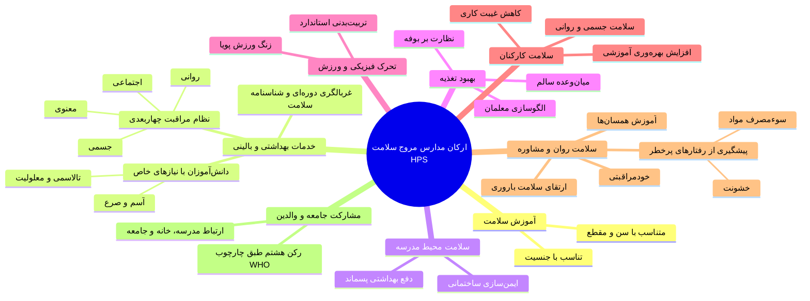
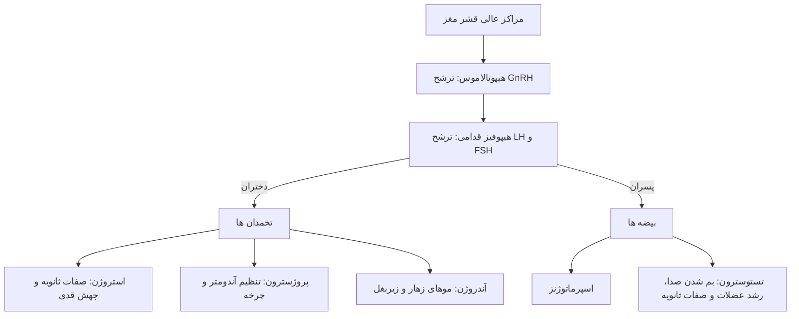
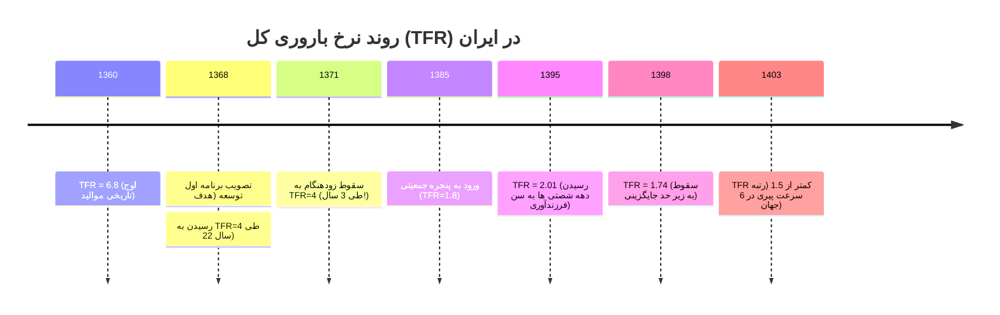
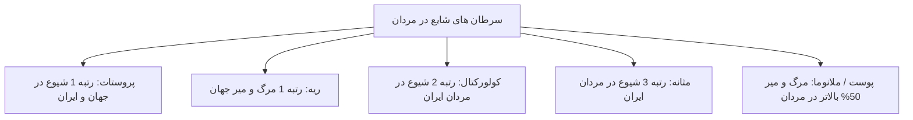

# خلاصه بهداشت خانواده (جلسات ۶ تا ۱۰)

## بخش ۶: بهداشت مدارس و مدارس مروج سلامت (Health Promoting Schools)

> [!abstract] تعریف مدارس مروج سلامت (HPS)
> نظامی جامع و مشارکتی که در آن مدرسه به عنوان یک سازمان اثرگذار، با ارتقای هم‌زمان *آموزش سلامت*، *محیط فیزیکی و روانی*، *تغذیه* و *مشارکت خانواده و جامعه*، بستر ارتقای سلامت پایدار دانش‌آموزان و جامعه را فراهم می‌کند.

### مدل اکولوژیکال عوامل مؤثر بر سلامت نوجوانان

سلامت نوجوان صرفاً پدیده‌ای زیستی نبوده و متأثر از ۶ لایه تو در تو است:

| سطح اکولوژیک                    | مؤلفه‌های کلیدی #امتحانی                                        | اثرات بر سلامت دانش‌آموزان                                        |
| ------------------------------- | --------------------------------------------------------------- | ----------------------------------------------------------------- |
| **۱. فردی (Individual)**        | سن، جنس، باورها، سبک درک ریسک، میزان اطلاعات بهداشتی            | تعیین‌کننده واکنش به محرک‌ها؛ سن بلوغ و هیجانات نوجوانی           |
| **۲. بین‌فردی (Interpersonal)** | تعامل با خانواده، الگوهای دوستی، معلمان، انتظارات متقابل        | شکل‌دهی به عادات غذایی، رفتارهای پرخطر و سرمایه عاطفی             |
| **۳. جامعه (Community)**        | هنجارهای محله‌ای، شبکه‌های حمایتی، امنیت اجتماعی                | تعیین قبح رفتارهای ناسالم، دسترسی به تفریحات سالم                 |
| **۴. سازمانی (Organizational)** | ساختار مدارس، برنامه‌های سلامت‌محور، خدمات بهداشتی مدرسه        | کنترل محیط فیزیکی، غربالگری دوره‌ای و ایجاد عادت‌های زیستی پایدار |
| **۵. محیطی (Enviromental)**     | راه‌ها، کیفیت آب/فاضلاب، آلودگی صوتی، دسترسی به کلینیک          | انتقال بیماری‌های عفونی، سوانح ترافیکی، تحریک بیماری‌های ریوی     |
| **۶. ساختاری (Structural)**     | قوانین و حقوق، برابری، قوم‌گرایی، دیدگاه‌های جنسی، تبعیض        | -                                                                 |
| **۶. کلان (Macro)**             | درآمد ملی، فقر، تبعیض جنسیتی، قوانین ملی، پدیده *Globalization* | تسهیل سرایت سریع پاندمی‌ها، بار تورمی بر تغذیه خانواده            |

> [!note] مدل جامع WSCC (مدرسه، جامعه و کودک کامل)
> پیوند آموزش سلامت، تغذیه، سلامت کارکنان (Wellness)، جو هیجانی-اجتماعی، محیط فیزیکی، خدمات سلامت بالینی، خدمات مشاوره و روان‌شناختی، مشارکت خانواده، مشارکت جامعه و فعالیت بدنی.

### سطوح پیشگیری در محیط مدرسه

1. **پیشگیری اولیه:** آموزش رفتارهای سالم، ارتقای فعالیت بدنی، واکسیناسیون، ترویج بوفه سالم و اصلاح نگرش جهت ممانعت مطلق از وقوع مخاطره و بیماری.

2. **پیشگیری ثانویه:** کشف زودرس و مداخله سریع قبل از تشدید اختلال؛ شامل **سنجش سلامت بدو ورود، غربالگری منظم رشد و تکامل**، بینایی‌‌سنجی، شنوایی‌سنجی، معاینه دهان و دندان و بیماریابی زودهنگام در مقطع دبستان جهت اقدام پیش‌دستانه و بیماریابی زودهنگام علائم.

3. **پیشگیری ثالثیه:** مدیریت و ناتوانی‌‌زدایی از دانش‌آموزان دارای بیماری‌های پایدار و مزمن، معلولیت‌ها، اختلالات عاطفی، صرع و دیابت از طریق **اقدامات توان‌بخشی (Rehabilitation)** جهت حفظ عملکرد تحصیلی و ممانعت از پیشرفت ناتوانی.

### مثلث مداخله در آموزش سلامت و توانمندسازی #امتحانی 

آموزش بهداشت *صرفاً ارتقای دانش (Knowledge) نیست*؛ تغییر رفتار پایدار مستلزم برقراری **سینرژی میان ۳ بعد** است:


> [!tip] نقش الگو پذیری (Role Modeling) در مدارس
> آموزش تغذیه سالم یا نفی دخانیات در صورت مشاهده رفتارهای متناقض در معلمان و کارکنان (نظیر مصرف چیپس یا سیگار توسط اولیای مدرسه) بی‌اثر می‌گردد. سلامت روان و رفتار کارکنان مدرسه مستقیماً جو اجتماعی-هیجانی دانش‌آموز را شکل می‌دهد.

### آسیب‌پذیری بیولوژیک کودکان و تهدیدهای فیزیکی مدرسه

چرا کودکان در مواجهه با خطرات محیطی آسیب‌پذیرتر از بزرگسالان هستند؟

1. **سیستم ایمنی نابالغ** و اندام‌های در حال رشد و نمو سریع.

2. **دریافت نسبی بالاتر آب، غذا و هوا به ازای هر کیلوگرم وزن بدن** در مقایسه با بالغان.

3. **گذراندن بخش عمده زمان روزانه در محیط فیزیکی مدرسه**.

4. **فقدان تکامل کورتکس پره‌فرونتال مغز:** در دوران نوجوانی سیستم لیمبیک (مرکز هیجان) بسیار فعال‌تر از قشر پیش‌پیشانی (مرکز مهار و قضاوت منطقی) است؛ لذا دست به رفتارهای پرخطر بدون درک پیامد می‌زنند.

> [!danger] تهدیدات شیمیایی پنهان در تمام مدارس
> *مواد شوینده و ضدعفونی‌کننده (Cleaning Agents)* تهدیدی همگانی در تمامی مدارس (حتی مدارس برخوردار) هستند که می‌توانند با تحریک مخاط تنفسی، سبب شعله‌وری حاد **حملات آسم** گردند. زمان‌بندی سم‌پاشی‌ها و رنگ‌آمیزی ساختمانی (آزبست) باید کاملاً خارج از ساعات حضور دانش‌آموزان باشد.

### نیازهای پایه محیط سالم مدرسه (۸ گانه)

1. سرپناه مناسب (*Shelter*)
2. سیستم گرمایشی ایمن (*Warmth*)
3. آب آشامیدنی سالم (*Water*)
4. تغذیه بهداشتی (*Food*)
5. نور کافی (*Light*)
6. تهویه استاندارد (*Ventilation*)
7. سرویس‌های بهداشتی ایمن (*Sanitary facilities*)
8. خدمات فوریت‌های پزشکی (*Emergency medical care*)



> [!note] علل آسیب‌پذیری بیولوژیک دانش‌آموزان در برابر آلودگی‌ها
> 1. سیستم ایمنی نابالغ
> 2. ارگان‌های در حال رشد
> 3. **مصرف آب، غذا و حجم هوای تنفسی بیشتر به ازای هر کیلوگرم وزن بدن نسبت به بالغان**
> 4. حضور طولانی‌مدت در مدرسه
> 5. فقدان قوه قضاوت در تشخیص خطر و مستعد رفتارهای پرخطر.

### پروتکل فعالیت فیزیکی و برنامه CSPAP

* **توصیه WHO برای کودکان و نوجوانان:** حداقل **۶۰ دقیقه فعالیت بدنی متوسط تا شدید در روز** (فعالیتی که ضربان قلب و تعداد تنفس را بالا ببرد). #امتحانی 

* **توصیه WHO برای بزرگسالان:** ۳۰ دقیقه در روز، ۵ روز در هفته (مجموعاً **۱۵۰ دقیقه در هفته**).

* **اجزای پنج‌گانه برنامه جامع فعالیت بدنی مدرسه (CSPAP):**
  1. تربیت بدنی رسمی (Physical Education)
  2. فعالیت بدنی حین ساعات درسی/زنگ تفریح
  3. فعالیت بدنی قبل و بعد از پایان مدرسه
  4. درگیرسازی و مشارکت کارکنان مدرسه
  5. مشارکت خانواده و جامعه

### ارتقای مثبت نوجوانان: مدل 5C #امتحانی 

| مؤلفه                            | تعریف فارسی                                               | کلمات کلیدی                                | راهکار پرورش                                      |
| -------------------------------- | --------------------------------------------------------- | ------------------------------------------ | ------------------------------------------------- |
| **شایستگی**<br>(Competence)      | باور به توانمندی فردی در عمل                              | Abilities, Skills                          | آموزش و تمرین مهارت‌های علمی یا عملی              |
| **اعتمادبه‌نفس**<br>(Confidence) | حس درونی کارآمدی و ارزشمندی شخصی                          | Self-efficacy, Self-worth                  | ایجاد فرصت تجربه موفقیت در کارهای جدید            |
| **ارتباط**<br>(Connection)       | پیوندهای ایمن با افراد و نهادها (خانواده، همسالان، مدرسه) | Positive bonds, Institutions               | پیوندسازی میان نوجوان با همسالان، معلمان و والدین |
| **منش / شخصیت**<br>(Character)   | تمایز درست از نادرست (اخلاق‌مداری)، صداقت و معنویت        | Morality, Integrity, Respect for standards | تمرین خودکنترلی و پرورش معنویت                    |
| **همدلی و مراقبت**<br>(Caring)   | حس همدردی، همدلی و نوع‌دوستی نسبت به دیگران               | Sympathy, Empathy                          | ابراز توجه، محبت و مراقبت نسبت به نوجوانان        |

### ویژگی‌های تکاملی و اولویت‌های آموزشی بر حسب سن

| گروه سنی و مقطع                          | ویژگی‌های شناختی و رفتاری                                                                              | اولویت‌های آموزشی تستی                                                                       |
| :--------------------------------------- | :----------------------------------------------------------------------------------------------------- | :------------------------------------------------------------------------------------------- |
| **ابتدایی پایین (۶ تا ۸ سال)**           | عدم درک مفاهیم انتزاعی (*آلودگی، ایمنی، سلامت*)؛ یادگیری فقط از طریق بازی، ریتم، سرود و تقلید از محیط. | صرفاً ۳ مبحث پایه: **سلامت فردی، ایمنی، و غذای سالم و کافی** (پرهیز از آموزش‌های پیچیده).    |
| **ابتدایی میانه (۹ تا ۱۱ سال)**          | بسیار پرتحرک؛ مشتاق پذیرش مسئولیت و کمک‌رسانی؛ آماده ورود به رفتارهای تیمی و اجتماعی.                  | یادگیری بازی‌محور قواعد: **همکاری، بردباری، استقلال‌‌طلبی، رعایت حقوق دیگران** و وظایف مشخص. |
| **ابتدایی بالا و متوسطه (۱۲ تا ۱۵ سال)** | مقاومت و بیزاری در برابر پند و نصیحت مستقیم بزرگسالان؛ تقدم سیستم لیمبیک بر کورتکس پره‌فرونتال.        | ارائه حقایق به عنوان **اطلاعات مفید و پیام‌های قابل انتقال**؛ توانمندسازی جهت تحلیل پیامدها. |

### بیماری‌های شایع در مدارس و پرچم‌های قرمز رفتاری

| وضعیت بالینی / چالش             | تریگرها و عوامل خطر                                  | الزامات مراقبتی در مدرسه                                                                     |
| ------------------------------- | ---------------------------------------------------- | -------------------------------------------------------------------------------------------- |
| **آسم (Asthma)**                | دود سیگار، گرده‌ها، شوینده‌ها، هوای سرد، ورزش سنگین  | دسترسی فوری به اسپری سالبوتامول؛ پرهیز از محرک‌ها؛ پیشگیری از غیبت مزمن                      |
| **دیابت نوع ۱**                 | فعالیت ورزشی شدید کنترل‌نشده، تاخیر در صرف میان‌وعده | چک گلوکز خون؛ فراهم‌سازی دسترسی آزاد به آب و دفع ادرار؛ تزریق به موقع انسولین                |
| **صرع (Epilepsy)**              | استرس، خستگی شدید، نورهای چشمک‌زن، قطع دارو          | آموزش کمک‌های اولیه حملات تشنج به کادر مدرسه؛ **محافظت از دانش‌آموز در برابر قلدری و تمسخر** |
| **آلرژی غذایی**                 | مغزها، شیر، تخم‌مرغ، مواد نگه‌دارنده خوراکی بوفه     | ثبت دقیق آلرژن‌ها در پرونده سلامت؛ پرهیز اکید از اشتراک غذا میان همسالان                     |
| **قلدری (Bullying)**            | نقص ظاهری، لکنت، عینک، انزوای اجتماعی، ضعف فیزیکی    | پایش افت تحصیلی ناگهانی، کبودی بدن، ترس از رفتن به مدرسه، تغییر مسیر تردد                    |
| **سایبربولینگ (Cyberbullying)** | پیامک، شبکه‌های اجتماعی، افشای تصاویر خصوصی          | آموزش ماندگاری دائمی داده‌ها در اینترنت؛ عدم پاسخ متقابل؛ توانمندسازی والدین                 |

> [!warning] قانون طلایی پیشگیری از دخانیات در مدارس
> تنباکو سالانه عامل ۱۰ میلیون مرگ در جهان (۲۰۲۰ تا ۲۰۳۰) است. سیگار شایع‌ترین محصول تنباکو است (نه مترادف آن). **اگر فردی تا سن ۲۰ سالگی مصرف دخانیات را آغاز نکند، شانس شروع مصرف در بزرگسالی بسیار اندک و نزدیک به صفر خواهد بود**.

> [!note] آزارهای مجازی (Cyberbullying)
> ارسال پیام‌های توهین‌آمیز، افشای تصاویر یا اطلاعات خصوصی در وب، طرد فرد از گروه‌ها، و هویت جعلی عاطفی.
> **قانون مداخله:** یادآوری اینکه در اینترنت دکمه «پاک‌کردن قطعی» وجود ندارد (No Erase Button) و آموزش عدم پاسخ متقابل به آزارگر اینترنتی.

## بخش ۷: سلامت و بلوغ دوران نوجوانی

> [!abstract] تعریف بلوغ (Puberty)
> فرایندی فیزیولوژیک، آناتومیک و روان‌شناختی که طی آن کودک با تغییرات هورمونی به باروری جنسی رسیده، ابعاد اسکلتی-عضلانی‌اش تکمیل شده و هویت مستقل اجتماعی می‌یابد.

### محور غدد درون‌ریز بلوغ (HPG Axis) #امتحانی 



### کرونولوژی و تفاوت‌های جنسیتی بلوغ

* **آغاز بلوغ در دختران:** بازه سنی **۸ تا ۱۳ سالگی**.

* **آغاز بلوغ در پسران:** بازه سنی **۹ تا ۱۴ سالگی** (حدود ۲ سال دیرتر از دختران؛ دوره رشد طولانی‌تر و جهش قدی بزرگ‌تر).

* **طول دوره بلوغ:** به طور متوسط **۴ تا ۵ سال**؛ ممکن است تا سن ۱۹ سالگی یا فراتر ادامه یابد. #امتحانی 

* **جهش قدی دختران:** تا ۲۵ سانتی‌متر افزایش قد؛ متوقف‌شونده یا کندشونده شدید به محض وقوع منارک (به دلیل بسته شدن صفحات رشد استخوانی اپی‌فیز تحت اثر استروژن).

* **منارک (Menarche):** آخرین رویداد زنجیره بلوغ در دختران؛ **میانگین سن منارک در دختران ایرانی ۱۳ سالگی است**.

### عوامل مؤثر بر شتاب یا تأخیر بلوغ

1. **وراثت و ژنتیک:** *نیرومندترین و اصلی‌ترین تعیین‌کننده* سن شروع بلوغ.

2. **چاقی و شاخص توده بدنی:** بلوغ در دختران دارای *اضافه‌وزن* و چاق **زودتر**، و در افراد دچار *سوءتغذیه* شدید **دیرتر** آغاز می‌شود.

3. **اقلیم و جغرافیا:** ارتفاعات پایین، مناطق *ساحلی*، نزدیک به استوا و *گرمسیر* سبب بلوغ **زودتر**؛ اقلیم‌های *کوهستانی* و *سردسیر* سبب بلوغ **دیرتر** می‌شوند.

4. **بیماری‌های مزمن:** *دیابت نوع ۱* و *ورزش حرفه‌ای سنگین* موجب **تأخیر** در بلوغ می‌‌گردند.

> [!tip] اثر شگفت‌انگیز نور و ملاتونین بر بلوغ
> نور با اثر بر محور هیپوتالاموس-هیپوفیز موجب مهار ترشح هورمون ملاتونین می‌شود. در دختران نابینا به علت فقدان ادراک نوری، غلظت پلاسمایی ملاتونین افزایش یافته و با ریتم آزاد ترشح می‌گردد؛ این اختلال ریتم سبب **شروع زودرس‌تر بلوغ در دختران نابینا** می‌شود.

### جدول پرچم‌های قرمز بالینی در بلوغ (اندیکاسیون‌های ارجاع فوری)

| شاخص بالینی مشکوک            | معیار زمانی یا علامت خطرساز                    | رویکرد بالینی و تشخیصی                                                      |
| ---------------------------- | ---------------------------------------------- | --------------------------------------------------------------------------- |
| **فقدان قاعدگی تا ۱۶ سالگی** | آمنوره اولیه علی‌رغم وجود سن تقویمی ۱۶ سال     | بررسی کاریوتایپ، سونوگرافی لگن و پروفایل هورمونی کامل                       |
| **تأخیر در صفات ثانویه**     | عدم ظهور کوچک‌ترین علامت تا **۱۴ سالگی**       | ارزیابی نارسایی گنادی یا هایپوگنادیسم هایپوگنادوتروپیک                      |
| **تأخیر پس از رشد پستان**    | گذشت **۳ سال** از شروع تلارک بدون وقوع منارک   | رد اختلالات انسدادی مجرای خروجی ژنیتال یا سندرم‌های ژنتیکی                  |
| **طول کشیدن دوره بلوغ**      | گذشت **۵ سال** از شروع نخستین علائم بدون منارک | پایش محور اندوکرین و صفحات رشد استخوانی                                     |
| **صفات ثانویه نامتناسب**     | هیرسوتیسم، طاسی آندروژنیک، کلایتورومگالی       | **بررسی هایپرپلازی مادرزادی آدرنال (CAH) و سندرم تخمدان پلی‌کیستیک (PCOS)** |

### خطرات مصرف مکمل‌های هورمونی و استروئیدها در نوجوانی

مصرف نابجای تستوسترون و آنابولیک‌ها (به‌ویژه در ورزشکاران و بدنسازان):

* **عوارض در دختران:** طاسی با الگوی مردانه، ناباروری دائم، آتروفی برگشت‌ناپذیر پستان و تخمدان، کلفت شدن پایدار و غیرقابل برگشت صدا.

* **عوارض در پسران:** ژنیکوماستی (رشد بافت پستان)، آتروفی بیضه‌ها (Shrinkage)، آزواسپرمی و ناباروری.

* **مهم‌ترین عارضه عمومی دوران بلوغ:** **بسته‌شدن زودهنگام غضروف‌های رشد (اپی‌فیز) و توقف غیرقابل جبران جهش قدی**.

### اختلالات تغذیه‌ای و تصویر بدنی

عمدتاً ناشی از فشار شبکه‌های مجازی (اینستاگرام) و تعارضات روانی:

1. **بی‌‌اشتهایی عصبی (Anorexia Nervosa):** محدودیت شدید دریافت کالری، کاهش وزن مفرط، ترس وسواسی از چاقی، قطع قاعدگی و سوءتغذیه تهدیدکننده حیات.

2. **پرخوری عصبی (Bulimia Nervosa):** دوره‌های غیرقابل مهار پرخوری به دنبال پاک‌سازی عمدی (تحریک به استفراغ، مصرف مسهل)؛ آسیب مخاط مری، اتلاف الکترولیت‌ها و پوسیدگی اسیدی دندان‌ها.

3. **اختلال بدشکلی بدن (Body Dysmorphic Disorder):** اشتغال ذهنی مفرط با نواقص خیالی یا بسیار جزئی در ظاهر فیزیکی.

## بخش ۸: سلامت دوره جوانی و نیازهای توسعه‌ای

> [!abstract] تعریف جمعیت‌شناختی دوره جوانی
> بر اساس ملاک‌های ارائه‌شده در نظام سلامت کشور، جمعیت بازه سنی **۱۸ تا ۳۰ سال** دوران جوانی نامیده می‌شود. این گروه در ایران بالغ بر **۲۰ میلیون نفر (یک‌چهارم کل جمعیت)** را تشکیل می‌دهند.

### ساختار سنی جمعیت ایران (سرشماری ۱۳۹۵) #امتحانی 

```chart
{
  "title": "ترکیب سنی جمعیت ایران در سرشماری ۱۳۹۵",
  "subtitle": "توزیع درصدی گروه‌های جمعیتی کشور",
  "type": "bar",
  "data": [
    { "name": "کودکان و نوجوانان (زیر ۱۵ سال)", "percentage": 24 },
    { "name": "جوانان (۱۵ تا ۲۹ سال)", "percentage": 25 },
    { "name": "میانسالان (۳۰ تا ۶۴ سال)", "percentage": 44.8 },
    { "name": "سالمندان (۶۵ سال و بیشتر)", "percentage": 6.1 }
  ],
  "metrics": [
    { "key": "percentage", "name": "سهم جمعیتی (درصد)", "color": "#3b82f6" }
  ]
}
```

* **جمعیت مولد اقتصادی:** گروه سنی **۱۵ تا ۶۴ سال** (تأمین‌کننده معاش خود و افراد زیر ۱۵ سال و بالای ۶۴ سال).

* **نسبت سالمند به جمعیت مولد:** برای پایداری اقتصاد و صندوق‌های بازنشستگی، حضور **۱ سالمند به ازای هر ۹ نفر شاغل** ضروری است. در ۲۰ سال آینده این نسبت در ایران به **۱ به ۳ یا ۱ به ۴** سقوط خواهد کرد!

### پنجره جمعیتی ایران (Demographic Window)

دوره‌ای طلایی که در آن **بیش از دو‌سوم جمعیت در سن کار (۱۵ تا ۶۴ سال)** و کمتر از یک‌سوم جمعیت در سنین مصرف‌کنندگی (زیر ۱۵ سال و بالای ۶۵ سال) قرار دارند؛ لذا **بار تکفل به کمتر از ۰.۵** افت می‌کند:

* **تاریخ ورود ایران:** سال **۱۳۸۵** با طول دوره تقریبی **۴ دهه**.

* **فرصت از دست رفته:** بیش از **۲۰ سال** از این پنجره سپری شده و فقط فرصتی محدود جهت جبران پیش از بسته شدن پنجره و آغاز پیری شدید جمعیت باقی است.

### تقابل تاریخی سیاست‌های جمعیتی: غرب و ایران

* **ایالات متحده (دهه ۱۹۶۰ تا ۱۹۸۰):** وقوع ۳ رخداد (قرص‌های ضدبارداری، اشتغال ارزان زنان و جنبش فمینیستی متقاضی سقط جنین) ⇦ افزایش ۳۰۰۰ برابری سقط قانونی، افزایش بیماری‌های منتقله از ۳ مورد به ۲۴ واریانت STD، ظهور HIV و رسیدن نرخ موالید خارج ازدواج به بالای ۵۰%.

* **سند محرمانه کیسینجر (NSSM200 - سال ۱۹۷۴):** سندی ۲۰۰ صفحه‌ای که افزایش جمعیت کشورهای جهان سوم را مخل امنیت ملی آمریکا دانسته و راهکارهای کاهش عمدی زاد و ولد آنان را پیشنهاد داد.

* **ایران (۱۳۶۸ به بعد):** تصویب سیاست کنترل جمعیت در قانون برنامه اول توسعه جهت کاهش تدریجی TFR از ۶.۴ به ۴ طی بازه ۲۲ ساله (تا ۱۳۹۰)؛ اما **این هدف به دلیل توزیع افراطی اقلام رایگان تا عمق روستاها در عرض ۳ سال (۱۳۷۱) محقق شد** و کشور وارد سقوط آزاد موالید گردید.



### اصول پنج‌گانه ارتقای سلامت جوانان

1. **عدالت در سلامت:**

   * *عدالت افقی:* ارائه پاسخ و خدمات یکسان به افراد دارای نیاز مشابه.

   * *عدالت عمودی:* حمایت نامتوازن و بیشتر از اقشار آسیب‌پذیرتر (نظیر سوبسید بالاتر برای دهک‌های درآمدی پایین).

2. **اصالت خانواده:** حفظ محوریت نهاد خانواده پایدار در کلیه سیاست‌گذاری‌ها.

3. **توجه به سلامت نسل‌های آینده:** جوانان، والدین فردای جامعه هستند.

4. **تعاون و مشارکت همگانی:** همکاری بین‌بخشی ارگان‌های خارج از نظام سلامت.

5. **توانمندسازی خود جوانان:** مشارکت دادن آنان در فرایند تصمیم‌گیری‌های کلان.

### اپیدمیولوژی تروما و سوانح جاده‌ای در جوانان

* **امید به زندگی در ایران:** زنان ۷۸ سال و مردان ۷۶ سال.

* **شاخص سال‌های از دست رفته عمر (DALYs):** فوت یک فرد در سن ۲۰ سالگی بر اثر تروما موجب از دست رفتن بیش از ۵۰ سال عمر مفید و پتانسیل اقتصادی می‌گردد. **سوانح ترافیکی، عامل اصلی مرگ، قطع نخاع و کوادری‌پlegi در مردان جوان است**. اجرای قوانین سفت‌سخت راهنمایی و رانندگی کارآمدترین مداخله پیشگیرانه محسوب می‌شود.

## بخش ۹: سیاست‌های جمعیتی، ساختار سنی و شاخص‌های باروری

> [!abstract] تعریف جمعیت اصلی در برابر جمعیت مقیم
>
> * **جمعیت مقیم:** تمامی افرادی که در لحظه آمارگیری در مرزهای جغرافیایی کشور سکونت فیزیکی دارند.
>
> * **جمعیت اصلی:** کل اتباع یک کشور شامل افراد مقیم و افرادی که موقتاً جهت تحصیل، مأموریت یا کار در خارج به سر می‌برند.

### شاخص‌ها و فرمول‌های محاسباتی باروری و جمعیت

* **میزان تولد خام (Crude Birth Rate - CBR):**
    
    
    $$
  \text{CBR} = \frac{\text{تعداد موالید زنده در یک سال}}{\text{جمعیت کل در همان سال}} \times 1000
  $$

* **میزان باروری عمومی (General Fertility Rate - GFR):**
	
	  
  $$
  \text{GFR} = \frac{\text{تعداد موالید زنده در یک سال}}{\text{جمعیت زنان ۱۵ تا ۴۹ سال}} \times 1000
  $$

* **میزان باروری اختصاصی سنی (Age-Specific Fertility Rate - ASFR):**
	
	  
	$$
  \text{ASFR} = \frac{\text{موالید زنده زنان در گروه سنی معین}}{\text{جمعیت زنان همان گروه سنی}} \times 1000
  $$

* **میزان باروری کلی (Total Fertility Rate - TFR):**
  مجموع نرخ‌های باروری اختصاصی سنی در طول سال‌های باروری؛ بیانگر میانگین تعداد فرزندانی که یک زن در پایان دوران باروری به دنیا خواهد آورد (شاخص فعلی کشور حدود ۱.۷۴ تا زیر ۱.۵).

* **نسبت سرباری / وابستگی اقتصادی (Dependency Ratio):**
	
	
	$$
  \text{Dependency Ratio} = \frac{\text{جمعیت زیر ۱۵ سال} + \text{جمعیت ۶۵ سال و بیشتر}}{\text{جمعیت فعال ۱۵ تا ۶۴ سال}} \times 100
  $$

* **رشد طبیعی جمعیت (Natural Increase):**
	
	
	$$
  \text{رشد طبیعی} = \text{CBR} - \text{CDR}
  $$

### چالش‌های شش‌گانه بحران جمعیتی ایران

1. **افزایش سن ازدواج:** میانگین سن ازدواج مردان به ۲۸-۲۹ سال و زنان به ۲۵-۲۶ سال رسیده است (افزایش ۷ سال طی ۴ دهه).

2. **فاصله طولانی تا فرزند اول:** میانگین فاصله ازدواج تا نخستین تولد به ۵ سال رسیده است؛ در نتیجه اولین بارداری در سن بحرانی ۳۴ سالگی اتفاق می‌افتد.

3. **تغییر فرهنگ نسلی:** ۸۰% متولدین پس از ۱۳۵۰ دارای حداکثر ۲ فرزند هستند (۱۹.۱% بدون فرزند، ۲۸% تک‌فرزند، ۳۳% دو فرزند). در متولدین قبل از ۱۳۵۰، بیش از ۷۷% حداقل ۳ فرزند داشتند.

4. **سقط جنین:** سالانه حدود ۳۰۰ هزار سقط در کشور انجام می‌گیرد (در مقایسه با ۱.۱ میلیون تولد زنده، **حدود یک‌سوم بارداری‌ها سقط می‌شوند**).

5. **ناباروری:** بیش از ۲ میلیون زوج نابارور در کشور نیازمند پوشش بیمه‌ای هستند.

6. **شکاف باروری بر حسب تحصیلات:** رابطه کاملاً معکوس میان تحصیلات زن و باروری وجود دارد؛ پیک باروری زنان تحصیل‌کرده به بازه ۳۰ تا ۳۹ سالگی شیفت پیدا کرده است.

> [!warning] سطح جانشینی (Replacement Level)
> تعداد فرزندانی که باید به ازای هر زن متولد شوند تا جایگزین زوجین گردند؛ این نرخ در حالت استاندارد **۲.۱ فرزند** است (با احتساب مرگ‌ومیر نوزادان و تجرد قطعی). **در صورت تداوم نرخ فعلی، رشد جمعیت ایران در سال‌های ۱۴۱۵ تا ۱۴۲۰ به صفر رسیده و سپس منفی خواهد شد**.

### مقایسه تطبیقی آمارهای جمعیتی استان‌ها

* **پایین‌ترین باروری:** استان‌های گیلان و مازندران با نرخ تقریبی **۱.۱ تا ۱.۳ فرزند**.

* **بالاترین باروری:** استان سیستان و بلوچستان با نرخ **۳.۳ تا ۳.۹ فرزند**.

* *نتیجه مدیریتی:* ممنوعیت ابلاغ سیاست‌های یکپارچه؛ لزوم طراحی **بسته‌های جمعیتی منطقه‌ای هوشمند** متناسب با اقلیم و فرهنگ هر استان.

## بخش ۱۰: سلامت مردان و طب کار

> [!abstract] مفهوم شکاف سلامت در مردان (Men's Health Gap)
> الگوی پایدار جهانی که نشان می‌دهد امید به زندگی مردان در تمام جوامع کمتر از زنان است، مراجعات پیشگیرانه کمتری دارند و سهم سنگین‌تری از مرگ‌های زودرس ناشی از سوانح شغلی و بیماری‌های غیرواگیر را متحمل می‌شوند.

### پویایی نسبت جنسیتی از تولد تا سالمندی

* **نسبت جنسی در بدو تولد:** همواره به نفع پسران است (در ایران حدود **۱۰۵ پسر به ازای ۱۰۰ دختر** یا ۵۶% به ۴۴%).

* **نسبت جنسی در سنین پیری (۷۵ سال به بالا):** این نسبت به شدت معکوس شده و به ازای هر ۱۰۰ مرد، **۱۰۰ تا ۳۵۵ زن سالمند** وجود دارد.

* *علت:* مرگ‌ومیر بیولوژیک بیشتر نوزادان پسر به دلیل ضعف ذاتی سیستم ایمنی، به همراه مرگ زودرس مردان در بزرگسالی ناشی از مشاغل پرخطر، رفتارهای ناسالم و حوادث.

### موانع و تسهیل‌کننده‌های مراجعه مردان به مراکز بهداشتی

بیش از ۴۵% مردان هیچ‌گونه غربالگری سالانه‌ای انجام نمی‌دهند و **۶۰% مردان در سنین اشتغال (۱۵ تا ۶۵ سال) از دریافت خدمات بهداشتی خودداری می‌کنند** (از هر ۳ مرد یک نفر در برابر ۱ زن از هر ۵ زن).

| دامنه (Domain)        | موانع اصلی مراجعات مردان (Barriers)                                                        | عوامل تسهیل‌کننده (Facilitators)                                          |
| --------------------- | ------------------------------------------------------------------------------------------ | ------------------------------------------------------------------------- |
| **فردی (Individual)** | ادراک پایین از خطر (*Low risk perception*)، ترس از کشف بیماری، خجالت از روش‌های بالینی     | سابقه مثبت بیماری در خانواده، بروز علائم شدید، احساس مسئولیت برای خانواده |
| **هنجارهای مردانگی**  | **پرهیز از زنانگی (Avoidance of femininity)**، باور غلط «مرد گریه نمی‌کند»، خوداتکایی کاذب | حذف کلیشه‌های جنسیتی، تغییر باور سنتی مراجعه به پزشک                      |
| **اجتماعی (Social)**  | ترس از انگ اجتماعی (*Stigma*)، عدم تشویق همسالان                                           | **حمایت و فشار عاطفی همسر (قوی‌ترین عامل تسهیل‌کننده)**                   |
| **نظام سلامت**        | ساعات کاری نامناسب کلینیک‌ها، صف انتظار طولانی، محیط‌های زنانه                             | خدمات بدون نوبت، مشاوره‌های محرمانه، کلینیک‌های ویژه مردان در محیط کار    |
| **فرآیند غربالگری**   | دردناک بودن یا خجالت از معاینات انگشتی رکتوم (DRE) و کولونوسکوپی                           | ارائه تست‌های جایگزین و غیرتهاجمی، حفظ حریم خصوصی                         |

### مخاطرات شغلی مردان و آسیب‌پذیری دوقطبی

مردان ۲ برابر زنان دچار سوانح کار می‌شوند؛ بیشترین حوادث مرگبار متعلق به **صنعت ساختمان‌سازی** است (از ۲.۳ میلیون مرگ شغلی سالانه در جهان).

* **کارگران جوان:** آسیب‌پذیری به علت **بی‌‌تجربگی، جسارت کاذب و عدم استفاده از تجهیزات حفاظت فردی (PPE)**.

* **کارگران مسن و سالمند:** آسیب‌پذیری به علت **کاهش سرعت رفلکس‌های عصبی و افت توان فیزیکی**.

### بیماری‌های غیرواگیر (NCDs) و ریسک‌فاکتورها در مردان

* **سبک زندگی مردان ایرانی:** تنها ۴۸% تحرک بدنی منظم دارند، ۳۳% دچار چاقی و ۲۲% مصرف‌کننده سیگار هستند.

* **اثر خطی BMI:** **به ازای هر ۵ واحد افزایش شاخص توده بدنی (BMI)، ریسک مرگ‌ومیر به هر علت حدود ۳۰% افزایش می‌یابد**. چاقی رابطه مستقیم با سرطان پروستات و ناباروری دارد.

* **دیابت:** تا ۹۰% قابل پیشگیری است؛ در جوامع شهری و کشورهای با درآمد کمتر شیوع بالاتری دارد و در کنار CVD عامل ۸۰% مرگ‌های زودرس است.

### پروفایل انکولوژی مردان و راهنمای غربالگری



#### ۱. سرطان پروستات

* سیر بسیار کند؛ در سنین کهولت درمانی انجام نمی‌شود زیرا فرد پیش از پیشرفت تومور فوت خواهد کرد.

* **غربالگری روتین:** با تست آنتی‌ژن اختصاصی پروستات (PSA) از سن **۵۵ تا ۶۹ سالگی**.

* **شروع زودهنگام غربالگری:** از سن **۴۰ تا ۴۵ سالگی تا ۷۵ سالگی** در صورت داشتن **سابقه فامیلی درجه اول** یا **نژاد سیاه‌پوست**.

#### ۲. سرطان ریه

* کشنده‌ترین سرطان در مردان؛ مصرف دخانیات ریسک را ۲ برابر می‌کند.

* **غربالگری:** انجام *سی‌تی‌اسکن با دوز پایین (Low-Dose CT)* در **افراد بالای ۶۰ سال با سابقه مصرف طولانی دخانیات**.

* **مواجهه‌های شغلی سرطان‌زا:** آزبست، سیلیس، گرد و غبار، ترکیبات آروماتیک چندحلقه‌ای (PAHs در صنایع آلومینیوم و الکترود)، سرب و **دود کادمیوم طی جوشکاری و برش فلزات داغ (Hot Work)**.

#### ۳. سرطان کولورکتال

* سومین سرطان شایع جهان و دومین در مردان ایران؛ تا ۶۰% مرگ‌های آن قابل پیشگیری است.

* **غربالگری:** انجام **کولونوسکوپی از سن ۵۰ سالگی، هر ۵ تا ۱۰ سال یک‌بار** (در افراد با سابقه خانوادگی: شروع از سنین پایین‌تر و فواصل کوتاه‌تر).

* **عوامل خطر شغلی:** مواجهه با حلال‌های شیمیایی، نفت کوره و مشاغل دارای استرس روانی شدید.

#### ۴. سرطان مثانه

* تظاهر کلاسیک با درد و هماچوری (خون در ادرار)؛ فاقد برنامه غربالگری همگانی.

* **اصلی‌ترین فاکتور قابل اجتناب:** **استعمال دخانیات**.

* **مشاغل پرخطر (توجیه‌کننده ۲۰% موارد در کشورهای صنعتی):** نقاشان، آرایشگران زنانه و مردانه (تماس با رنگ‌ها)، کارگران چاپ، خشک‌شویی، لوله‌کش‌ها و کارگران معدن به علت تماس با آمین‌های آروماتیک.

#### ۵. سرطان پوست

* مرگ‌ومیر ناشی از ملانوما در مردان **۵۰% بیشتر از زنان** است.

* **گروه‌های پرخطر:** کارگران ساختمانی، کشاورزان، دامداران و ملوانان.

* **بهترین روش غربالگری:** **خودآزمایی ماهانه پوست** و مصرف ضدآفتاب در پوست‌های روشن و دارای کک‌ومک.

### سموم محیطی و اختلالات باروری مردان

سلامت باروری مردان شدیداً متأثر از مواجهه‌های محیطی است که خوشبختانه بخش عمده آن **با حذف عامل خطر برگشت‌پذیر (Reversible)** است:

1. **آلودگی هوا (ذرات معلق، گوگرد دی‌اکسید، ازن، اکسیدهای نیتروژن):** موجب تشدید *قطعه‌قطعه شدن DNA اسپرم (DNA Fragmentation)* و افت مورفولوژی.

2. **سموم کشاورزی و ارگانوکلرین‌ها:** مهار عملکرد غدد درون‌ریز و افت چشمگیر تعداد و تحرک اسپرم‌ها.

3. **امواج الکترومغناطیس:** اختلال در فعالیت حرکتی تاژک اسپرم.

4. **حرارت مداوم بیضه‌ها (Thermal Exposure):** نانوایان، کارگران کوره‌پزی و صنایع فولاد به علت نقص در *تنظیم حرارتی (Thermo-dysregulation)* دچار توقف اسپرماتوژنز می‌شوند که با دوری دوره‌ای از حرارت بهبود می‌یابد.
