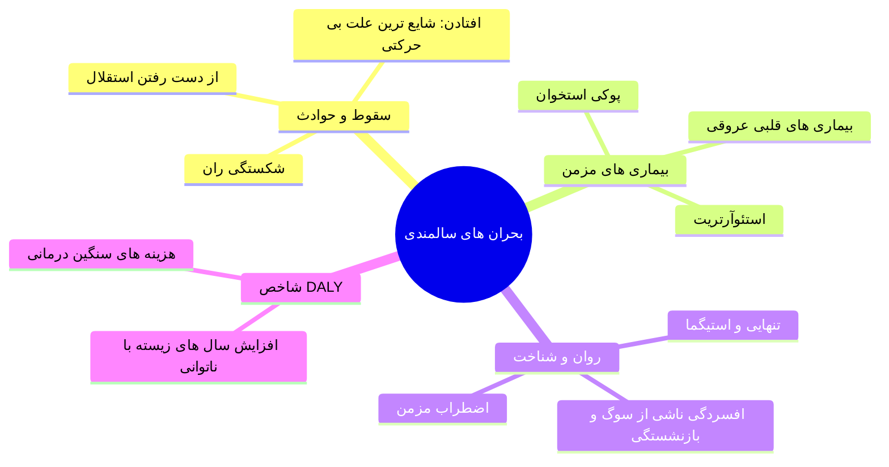
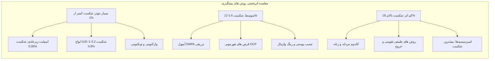
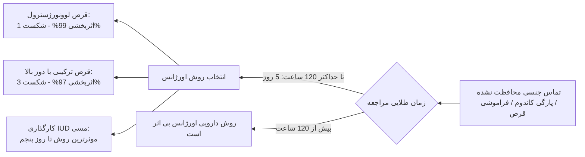
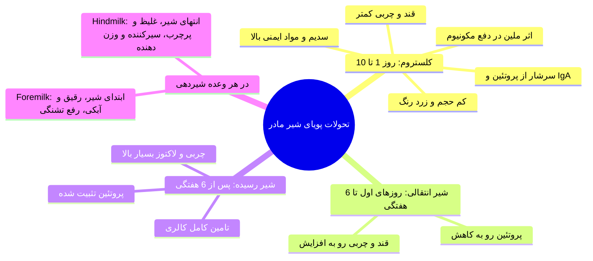
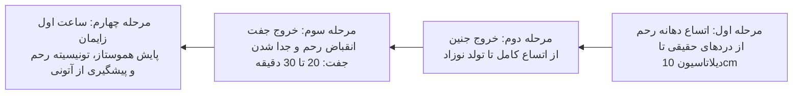
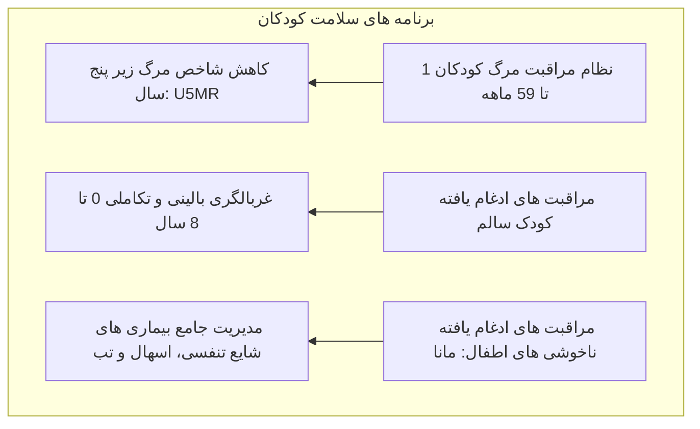
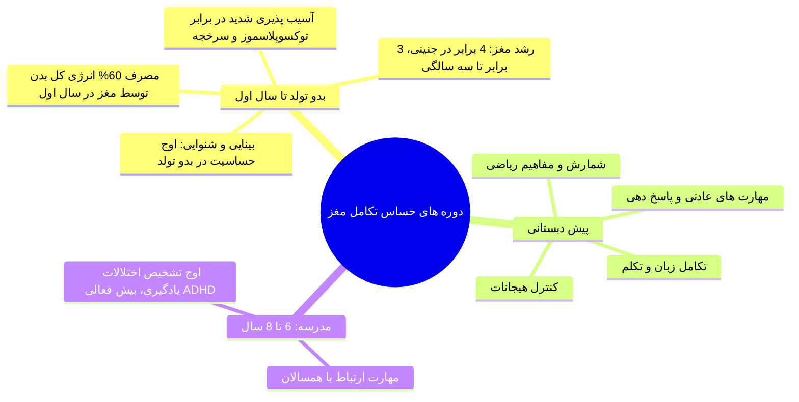
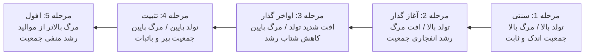

# خلاصه بهداشت خانواده (جلسات ۱۱ تا ۱۵)

## بخش ۱۱: بهداشت و سلامت سالمندان (Geriatric Health)

> [!abstract] تعریف ایجینگ (Aging) #امتحانی 
> کهولت سن یک *فرایند فیزیولوژیک طبیعی* است و بیماری محسوب نمی‌شود. سن شروع سالمندی طبق منابع ۶۰ یا ۶۵ سالگی است. سالمندان به دو گروه تقسیم می‌شوند: **سالمندان جوان (Young Old)** در بازه سنی *۶۰ تا ۷۹ سال* و **سالمندان کهنسال (Old Old)** در سنین *۸۰ سال و بالاتر*.

### سطوح چهارگانه پیشگیری در سالمندان
* **پیشگیری اولیه:** ممانعت از وقوع بیماری با ارتقای تغذیه، واکسیناسیون، فعالیت بدنی و بهبود سبک زندگی.
* **پیشگیری ثانویه:** بیماری رخ داده؛ هدف **تشخیص زودهنگام و درمان سریع** قبل از پیشرفت و زمین‌گیر شدن فرد است.
* **پیشگیری ثالثیه:** مدیریت عوارض و **بازتوانی (Rehabilitation)** جهت حفظ عملکرد و استقلال فرد.
* **پیشگیری چهارم (Quaternary):** **جلوگیری از اقدامات غیرضروری و درمان‌های افراطی (Over-medicalization)**؛ پرهیز از درخواست چکاپ‌های بیهوده، تومورمارکرهای بدون اندیکاسیون و MRIهای غیرضروری.

---

### طبقه‌بندی جمعیتی کشورها از نظر سالمندی

| وضعیت جمعیتی | درصد سالمندان (بالای ۶۰/۶۵ سال) | وضعیت و چشم‌انداز کشور |
| :--- | :--- | :--- |
| **کشور جوان** | کمتر از ۴% جمعیت | جوامع با موالید بسیار بالا و ساختار هرمی جوان |
| **کشور در حال گذار** | بین ۴% تا ۶% جمعیت | آغاز کاهش تدریجی باروری و افزایش نسبی میانسالان |
| **کشور سالمند/پیر** | **۷% و بالاتر** | جمعیت ایران در این دسته است؛ پیش‌بینی صعود تا **۲۱.۷% (~۲۲%) تا سال ۲۰۵۰** |

> [!warning] پدیده انتقال جمعیتی در سالمندی (Demographic Shift)
> هم‌زمانی کاهش باروری (کاهش زیر ۵ ساله‌ها) با افزایش امید به زندگی ناشی از پیشرفت پزشکی، ساختار هرم را به سمت سالمندی سوق می‌دهد. **سالمندی سالم (Healthy Aging)** یعنی سالمند دارای نشاط روانی، رضایت از زندگی، استقلال در امور روزمره و تصمیم‌گیری، توان تحرک و حفظ ارتباطات اجتماعی باشد.

---

### چالش‌های پاتوفیزیولوژیک و فارماکولوژیک سالمندی
* **تغییرات فیزیولوژیک:** *تحلیل عضلانی* (Sarcopenia)، *افزایش بافت چربی* با تجمع در بالاتنه، *تضعیف سیستم ایمنی*، *از دست رفتن دندان‌ها*، اختلال گوارش و *یبوست*، *بی‌اختیاری ادراری* و *استئوپروز*. #امتحانی 
* **چالش‌های بالینی (تله‌های تستی):**
  1. **چندبیماری هم‌زمان (Multimorbidity):** ابتلای هم‌زمان به چند آسیب مزمن روند تشخیص را پیچیده می‌کند.
  2. **تظاهرات مبهم و گمراه‌کننده:** بیماری‌های جدی ممکن است صرفاً با خستگی، افت هشیاری گذرا یا گیجی تظاهر کنند (مثل *سکته قلبی بدون درد* یا عفونت ادراری با علائم دلیریوم).
  3. **چنددارویی (Polypharmacy):** مصرف انبوه داروها خطر تداخل دارویی، سمیت و عوارض جانبی را دوچندان می‌کند.



---

### پیشگیری از پوکی استخوان (Osteoporosis)
1. **فعالیت بدنی منظم:** حداقل **۱ ساعت پیاده‌روی در هفته** برای تحریک استخوان‌سازی.
2. **تغذیه:** دریافت کلسیم روزانه از منابع غذایی به‌ویژه لبنیات کم‌چرب پاستوریزه (*ارجحیت مطلق تغذیه بر مکمل دارویی*).
3. **نور مستقیم خورشید:** **۱۵ تا ۳۰ دقیقه روزانه** برای ساخت ویتامین D.
4. **پرهیزهای اکید:** پرهیز از مصرف خودسرانه آنتی‌اسیدها (*تداخل شدید در جذب کلسیم*)، قطع نوشابه‌های گازدار (*عامل دفع کلسیم و تحریک دیابت*) و ترک کامل دخانیات.

### اپیدمیولوژی سقوط و زمین‌خوردن (Falls) در سالمندان
* **اهمیت:** **شایع‌ترین علت بی‌حرکتی سالمندان** زمین‌خوردن است؛ عامل **۴۰ تا ۸۰ درصد آسیب‌ها**. #امتحانی 
* **پیامدهای بالینی:** ۵% منجر به شکستگی و **۱% منجر به شکستگی گردن ران (Femoral Neck)** می‌شود. **۵۰% افراد پس از شکستگی استقلال حرکتی خود را از دست می‌دهند و ۳۰% کاملاً وابسته می‌شوند**.
* **مورتالیتی:** شکستگی استخوان در سالمندی با **مرگ‌ومیر ۵ تا ۲۰ درصدی در سال اول پس از حادثه** همراه است!
* **راهکارهای ایمن‌سازی محیط منزل:** حذف فرش‌های لق و لغزنده، جمع‌آوری سیم‌ها و موانع کف زمین، تعبیه صندلی و کف‌پوش ضدلغزش در حمام، نصب دستگیره‌های کمکی (Grab bars) روی دیوار توالت و حمام، و تأمین نور کافی در راهروها و شب‌خواب‌ها.

### اپیدمیولوژی و الگوی بالینی استئوآرتریت (آرتروز)

| متغیر بالینی | مشخصات اپیدمیولوژیک و پاتولوژیک |
| :--- | :--- |
| **شیوع سنی** | درگیرکننده **۶۰ تا ۷۰ درصد افراد بالای ۶۵ سال**؛ صعود به **۸۵% در سنین بالای ۸۰ سال** |
| **ترتیب شیوع درگیری مفاصل** | **دست > ستون فقرات > زانوها > مفصل ران (Hip)** |
| **تفاوت‌های جنسیتی** | شیوع کلی در زنان بیشتر است؛ **زانو و دست در زنان** بسیار شایع‌تر، اما **مفصل ران در هر دو جنس برابر** است |
| **ریسک‌فاکتورهای اصلی** | سن بالا، چاقی، حرکات تکراری شغلی، تروما، اختلالات ساختاری (پای پرانتزی یا ضربدری)، ژنتیک و دیابت |

---

## بخش ۱۲: روش‌های پیشگیری از بارداری (Contraception)

> [!abstract] مفهوم شکست روش (Failure Rate)
> اثربخشی بر مبنای درصد بارداری ناخواسته در ۱۰۰ زن در سال اول استفاده سنجیده می‌شود: **استفاده ایده‌آل (Perfect Use)** در شرایط مصرف بی‌نقص و منظم، و **استفاده معمول (Typical Use)** در شرایط واقعی زندگی. هرچه روش وابستگی بیشتری به رفتار فرد داشته باشد، شکاف میان این دو بیشتر است.



---

### جدول جامع مقایسه روش‌های هورمونی ترکیبی و پروژسترونی

| روش پیشگیری                            | مکانیسم اثر اصلی                                                       | نحوه مصرف و بازه زمانی                                                    | مزایا و فواید درمانی                                                               | عوارض شایع و نکات مهم                                                           |
| :------------------------------------- | :--------------------------------------------------------------------- | :------------------------------------------------------------------------ | :--------------------------------------------------------------------------------- | :------------------------------------------------------------------------------ |
| **قرص ترکیبی (COC)**                   | مهار تخمک‌گذاری (پروژستین مهار LH و استروژن مهار FSH) + آتروفی آندومتر | ۲۱ روز قرص فعال + ۷ روز استراحت (شروع خونریزی قطع مصرف طی ۲ تا ۸ روز بعد) | کاهش آنمی، تسکین دیس‌منوره و PMS، کاهش سرطان آندومتر و تخمدان                      | افزایش ترومبوآمبولی عروقی (VTE) در سیگاری‌های بالای ۳۵ سال، چاقی و HTN          |
| **قرص پروژسترونی (POP / مینی‌پیل)**    | غلیظ و نفوذناپذیر کردن موکوس دهانه رحم در برابر اسپرم                  | مصرف مداوم و روزانه بدون دوره استراحت (*حساسیت زمانی مصرف بالا*)          | **عدم تداخل با شیردهی**، قابل استفاده در افراد با منع مصرف استروژن یا بالای ۴۰ سال | لکه‌بینی، خونریزی نامنظم، کاهش اثر در صورت **تأخیر بیش از ۳ ساعت** در مصرف      |
| **چسب پوستی (Ortho Evra)**             | مشابه COC با جذب جلدی استروژن و پروژسترون                              | چسباندن ۱ چسب در هفته به مدت ۳ هفته متوالی + ۱ هفته بدون چسب              | پرهیز از عبور اولیه کبدی (*First-pass*)، کاهش عوارض گوارشی                         | عوارض پوستی موضعی؛ در بخش دولتی ایران موجود نیست                                |
| **رینگ واژینال (NuvaRing)**            | آزادسازی مداوم استروژن و پروژستین از مخاط واژن                         | قرارگیری ۳ هفته داخل واژن + ۱ هفته خروج جهت پریود                         | جذب موکوسی سریع، عدم بار گوارشی، بازگشت سریع باروری پس از خروج                     | ترشحات واژینال؛ محافظتی در برابر STIs ندارد                                     |
| **آمپول تزریقی (DMPA)**                | مهار قوی تخمک‌گذاری و آتروفی آندومتر                                   | تزریق عضلانی عمیق ۱۵۰ میلی‌گرم دپوپروورا **هر ۱۲ هفته (±۲ هفته)**         | عدم تداخل با ترومبوز، مناسب برای صرع، آنمی داسی‌شکل و *ناتوانی ذهنی*               | **آمنوره شایع**، **تأخیر در بازگشت باروری (۱۲ تا ۲۴ ماه)**، منع ماساژ محل تزریق |
| **ایمپلنت کاشتنی (Norplant/Implanon)** | آزادسازی آهسته لوونورژسترول؛ مهار تخمک‌گذاری و موکوس غلیظ              | کاشت زیرجلدی در بازوی غیرغالب؛ **اثربخشی مداوم تا ۵ سال**                 | بالاترین اثربخشی (شکست ۰.۰۵%)، شروع اثر ۲۴ ساعت پس از کاشت                         | لکه‌بینی و بی‌نظمی قاعدگی، نیازمند جراحی سرپایی جهت خروج                        |

> [!danger] قانون طلایی منع مصرف OCP در خونریزی‌های واژینال
> در بیماری که با **خونریزی غیرطبیعی و بدون علت مشخص رحمی** مراجعه کرده است، **تجویز هرگونه OCP یا هورمون اکیداً ممنوع است** تا زمانی که علت (کانسر، سقط ناقص، حاملگی نابجا) کشف شود. تنها در صورت اثبات منشأ عملکردی هورمونی، درمان با *سیکل‌تراپی* مجاز خواهد بود.

### تداخلات دارویی مهم با قرص‌های ترکیبی (OCP)
1. **داروهایی که اثر OCP را کم کرده و ریسک بارداری ناخواسته دارند:** القاکننده‌های آنزیم کبدی P450 شامل **ریفامپین، فنی‌‌توئین، کاربامازپین** و آنتی‌بیوتیک‌های وسیع‌الطیف (تغییر فلور روده).
2. **داروهایی که اثرشان با مصرف OCP کاهش می‌یابد:** **داروهای خوراکی کاهنده قند خون** و **داروهای ضد انعقاد خون**.
3. **داروهایی که اثر و غلظتشان با OCP بالا رفته و خطر سمیت دارند:** **الکل، داروهای ضدافسردگی، تئوفیلین و متیل‌دوپا**.

---

### دستگاه داخل رحمی (IUD)
* **انواع:**
  * **IUD مسی (TCu-380A):** **طول عمر ۱۰ سال**. مکانیسم: ایجاد التهاب موضعی استریل سلولار در آندومتر و **اثر سمی مستقیم مس بر اسپرم (Spermicidal)** و پیشگیری مطلق از لقاح.
  * **IUD هورمونی (Mirena):** آزادسازی لوونورژسترول موضعی، ضخیم کردن موکوس، نازک کردن آندومتر و کاهش حجم خونریزی قاعدگی.
* **عوارض و نکات مهم:**
  * افزایش حجم خونریزی و درد لگنی در ۳ تا ۴ ماه نخست پس از کارگذاری IUD مسی.
  * خطر خروج خودبه‌خودی (Expulsion) در ماه اول و به‌ویژه در زنان نولی‌پار.
  * **منع مصرف قطعی IUD مسی:** **بیماری ویلسون (Wilson's disease)**، عفونت فعال لگنی (PID) و بارداری مشکوک.

### روش‌های سدی و عقیم‌سازی دائمی
* **کاندوم:** **تنها روش پیشگیری است که هم‌زمان در برابر عفونت‌های منتقله از راه جنسی (STIs) و HIV محافظت کامل ایجاد می‌کند**.
* **اسپرمیسیدها:** دارای بالاترین میزان شکست در مصرف معمول؛ می‌توانند با ایجاد ریزآسیب‌های التهابی در مخاط واژن، ریسک انتقال عفونت‌های آمیزشی را بالا ببرند.
* **وازکتومی در برابر توبکتومی:** وازکتومی سرپایی‌تر، ارزان‌تر و کم‌عارضه‌تر است. **نکته حیاتی: وازکتومی اثر فوری ندارد!** تخلیه کامل اسپرم‌های ذخیره‌شده در مجاری مستلزم **گذشت حداقل ۳ ماه یا ۲۰ نوبت انزال** است؛ لذا تا زمان تأیید آزواسپرمی در آنالیز اسپرم، استفاده از روش کمکی الزامی است.

### پیشگیری اورژانس از بارداری (Emergency Contraception - EC)



* **اندیکاسیون‌های مصرف اورژانس:** پارگی کاندوم، تجاوز جنسی، فراموشی ۳ نوبت یا بیشتر قرص ترکیبی، **تأخیر بیش از ۳ ساعت در مصرف قرص شیردهی (POP)**، تأخیر بیش از ۲ هفته در تزریق DMPA، خروج ناگهانی IUD و استفاده نادرست از روش طبیعی.
* **مکانیسم اصلی:** پیشگیری یا تأخیر در تخمک‌گذاری، اختلال در عملکرد موکوس و ترشحات رحمی؛ این روش‌ها هرگز *سقط‌آور* نیستند و در صورت لانه گزینی جنین اثری ندارند.
* **قانون جمعیت کشور (مواد ۴۶، ۵۱ و ۵۲):** توزیع رایگان اقلام ضدبارداری در شبکه بهداشت ممنوع است؛ عقیم‌سازی دائم ممنوع بوده و تنها در شرایط وجود خطر جانی غیرقابل تحمل با تأیید کمیسیون پزشکی مجاز است.

---

## بخش ۱۳: تغذیه با شیر مادر، مراقبت‌های زایمان و نوزاد سالم

> [!abstract] دوران طلایی ۱۰۰۰ روز اول زندگی
> بازه زمانی حیاتی از لحظه لقاح تا پایان ۲ سالگی کودک (۲۸۰ روز داخل رحمی + ۳۶۵ روز سال اول + ۳۵۰ روز سال دوم). در این دوره طلایی: **۷۰% رشد مغز، ۴۰% رشد قد و ۲۵% رشد وزن بزرگسالی** حاصل می‌شود!



---

### مقایسه تطبیقی ترکیبات شیر مادر و شیر گاو

| شاخص مقایسه‌ای            | شیر مادر                                                | شیر گاو                                         | اثرات بیولوژیک بر شیرخوار                                                                     |
| :------------------------ | :------------------------------------------------------ | :---------------------------------------------- | :-------------------------------------------------------------------------------------------- |
| **سلول‌های زنده و ایمنی** | **غنی از لوکوسیت‌ها، فاگوسیت‌ها و IgA ترشحی**           | فاقد سلول‌های زنده مفید در فرآیند پاستوریزاسیون | مقاومت شیرخوار در برابر گاستروانتریت، سپسیس و اوتیت                                           |
| **پروتئین و سدیم**        | متناسب با کلیه نابالغ نوزاد (بار کلیوی اندک)            | **بسیار بالا (۳ برابر شیر مادر)**               | پروتئین و سدیم مازاد شیر گاو به کلیه نوزاد فشار شدید آورده و دهیدراتاسیون هایپراسمولار می‌دهد |
| **جذب آهن و روی**         | محتوای آهن اندک اما **جذب فوق‌العاده بالا (۷۰ تا ۹۰%)** | آهن بالاتر اما **جذب بسیار ناچیز (~۱۰%)**       | پیشگیری قطعی از آنمی فقر آهن در ۶ ماه نخست با شیر مادر                                        |
| **اسیدهای چرب**           | غنی از اسیدهای چرب غیراشباع طویل‌زنجیر (DHA)            | چربی‌های اشباع سنگین و هضم دشوار                | بهبود تکامل بینایی، شبکیه و میلینیزاسیون سیستم عصبی                                           |

---

### ساعت طلایی و تکنیک صحیح شیردهی
* **ساعت طلایی (Golden Hour):** برقراری **تماس پوست‌‌به‌پوست (Skin-to-skin) مادر و نوزاد ظرف ساعت اول تولد**. پیامدها: تنظیم دمای بدن نوزاد، تثبیت نبض و تنفس، ترشح اکسی‌توسین مادری، تسریع جمع شدن رحم و خروج جفت، کاهش خونریزی پس از زایمان و موفقیت پایدار در شیردهی.
* **تکنیک چفت شدن دهان با سینه (Latch-on):**
  * دهان نوزاد کاملاً باز، لب پایین به سمت بیرون برگشته (Everted).
  * **چانه نوزاد در تماس مستقیم با پستان مادر**؛ نوک و بخش عمده هاله تحتانی در دهان کودک قرار گیرد.
  * مکیدن فقط نوک سینه عامل اصلی **شقاق پستان (Cracked nipple)** و عدم دریافت شیر چرب انتهایی است.

### مشکلات شایع پستان در دوران شیردهی

| عارضه پستانی | تظاهرات بالینی و زمان بروز | رویکرد درمانی و تله‌های امتحانی |
| :--- | :--- | :--- |
| **احتقان پستان (Engorgement)** | روز ۳-۴ زایمان؛ **دوطرفه**، سفت، دردناک و پرخون، تب کوتاه‌مدت **کمتر از ۲۴ ساعت** | **تخلیه مکرر**، کمپرس گرم قبل شیردهی، کمپرس سرد پس از آن؛ نیازی به آنتی‌بیوتیک ندارد |
| **ماستیت عفونی (Mastitis)** | معمولاً یک‌طرفه؛ توده گرم، اریتماتو، درد شدید، تب ادامه‌دار و علائم شبه آنفولانزا | **تداوم اکید شیردهی یا دوشیدن هر ۳ ساعت**، مایعات فراوان، مسکن و شروع آنتی‌بیوتیک |
| **آبسه پستان (Breast Abscess)** | عارضه ماستیت درمان‌نشده؛ توده مواج (Fluctuant) چرکی | درناژ جراحی؛ در صورت نزدیکی به هاله، شیردهی مستقیم ۴۸-۷۲ ساعت قطع و دوشیده شود؛ تغذیه از سینه دیگر ادامه یابد |
| **شقاق پستان (Fissure)** | زخم و شیار دردناک و خونریزی‌دهنده در نوک سینه ناشی از Latch نامناسب | اصلاح پوزیشن شیردهی، مالیدن قطراتی از شیر مادر بر نوک سینه پس از تغذیه (اثر ترمیمی ویتامین A) |

> [!tip] پروتکل نگهداری شیر دوشیده‌شده
> * دمای اتاق (۲۵ درجه سانتی‌گراد): **حداکثر ۴ ساعت**.
> * داخل یخچال (۴ درجه): **۴۸ ساعت**.
> * جایخی یخچال (یخچال‌های معمولی): **۲ هفته**.
> * فریزر عمیق خانگی (-۱۸ درجه): **۳ تا ۶ ماه**.
> * *نکته ظرف نگهداری:* ترجیح ظروف شیشه‌ای یا پلاستیک فشرده صیقلی؛ پر کردن تا سه چهارم حجم ظرف و ثبت تاریخ.

---

### موارد منع و احتیاطات عفونی در شیردهی #امتحانی 
1. **سل ریوی فعال در مادر:** نوزاد بلافاصله از مادر جدا شود؛ **تغذیه با شیر دوشیده‌شده کاملاً مجاز و ایمن است** (میکوباکتریوم وارد شیر نمی‌شود). تغذیه مستقیم از سینه پس از ۲ هفته از درمان دارویی و منفی شدن اسمیر خلط مجاز خواهد شد.
2. **هپاتیت B:** **شیردهی بلافاصله پس از تولد کاملاً بلامانع است**؛ مشروط بر آنکه **واکسن هپاتیت B و ایمونوگلوبولین اختصاصی (HBIG)** ظرف ۱۲ ساعت نخست پس از تولد به نوزاد تزریق شوند.
3. **سرخک:** جداسازی فیزیکی نوزاد از مادر جهت ممانعت از سرایت تنفسی؛ تغذیه با شیر دوشیده انجام گیرد.
4. **آبله‌مرغان:** اگر مادر **۵ روز قبل تا ۲ روز بعد از زایمان** مبتلا شود، جداسازی موقت نوزاد الزامی است؛ تغذیه با شیر دوشیده‌شده ادامه یابد تا زمانی که ضایعات خشک شده و ۷۲ ساعت ضایعه جدید ایجاد نشود.
5. **شیمی‌درمانی و داروهای سیتوتوکسیک (متوتروکسات، هیدروکسی‌‌اوره):** **منع مطلق شیردهی**.

---

### مراحل فیزیولوژیک زایمان طبیعی و ارزیابی مادر



* **طول مراحل زایمان:**
  * **مرحله اول:** در نخست‌زا (نولی‌پار) ۶ تا ۱۴ ساعت (سرعت اتساع ۱ cm/h)؛ در چندزا (مولتی‌پار) ۲ تا ۱۰ ساعت (سرعت اتساع ۱.۲ cm/h).
  * **مرحله دوم:** در نخست‌زا ۳۰ دقیقه تا ۳ ساعت؛ در چندزا ۵ تا ۳۰ دقیقه.
  * **مرحله سوم:** ۵ تا ۳۰ دقیقه (میانگین ۲۰-۳۰ دقیقه)؛ **عدم خروج جفت پس از ۳۰ دقیقه اورژانس مامایی است**.
  * **خونریزی پس از زایمان (PPH):** **اولین علت مرگ‌ومیر مادران باردار در سراسر جهان**؛ بیشترین علت PPH **آتونی رحمی (Uterine Atony)** در ۲۴ ساعت اول پس از زایمان است.

### ارزیابی آپگار (Apgar Score) در بدو تولد

| شاخص‌های ۵ گانه                         | نمره صفر                          | نمره ۱                                           | نمره ۲                       |
| :-------------------------------------- | :-------------------------------- | :----------------------------------------------- | :--------------------------- |
| **ضربان قلب (Heart Rate)**              | فاقد ضربان                        | کمتر از ۱۰۰ ضربه در دقیقه                        | **بیش از ۱۰۰ ضربه در دقیقه** |
| **تنفس (Respiratory Effort)**           | فاقد تلاش تنفسی                   | آهسته، نامنظم، ضعیف                              | **گریه قوی و فعال**          |
| **تون عضلانی (Muscle Tone)**            | شل و فلاکسید                      | اندکی خم‌شدگی اندام‌ها (Flexion)                 | **حرکات فعال و خمیدگی کامل** |
| **پاسخ به تحریک (Reflex Irritability)** | بدون پاسخ                         | گریه ضعیف یا شکلک زدن (Grimace)                  | **سرفه، عطسه یا گریه شدید**  |
| **رنگ پوست (Color)**                    | کاملاً آبی، سیانوتیک یا رنگ‌پریده | بدن صورتی، دست‌ها و پاها سیانوتیک (Acrocyanosis) | **تمام بدن کاملاً صورتی**    |

> [!info] تفسیر نمرات آپگار (دقایق ۱ و ۵)
> * نمره ۷ تا ۱۰: وضعیت پایدار و طبیعی؛ مراقبت‌های معمول. #امتحانی 
> * نمره ۳ تا ۶: افسردگی تنفسی نوزاد؛ نیازمند اقدامات حمایتی و احیای فوری.
> * نمره کمتر از ۳: آسفیکسی شدید؛ خطر مرگ فوری و آسیب شدید عصبی.

---

### طبقه‌بندی وزن هنگام تولد نوزاد
* **وزن طبیعی:** ۲۵۰۰ تا ۳۵۰۰ گرم (میانگین ۳۰۰۰ گرم). #امتحانی 
* **نوزاد کم‌وزن (LBW):** کمتر از ۲۵۰۰ گرم. علل سه‌گانه اصلی در کشورهای در حال توسعه: **سوءتغذیه مادر، بارداری‌های مکرر و نزدیک، و عفونت‌های مادری**.
* **بسیار کم‌وزن (VLBW):** کمتر از ۱۵۰۰ گرم.
* **فوق‌العاده کم‌وزن (ELBW):** کمتر از ۱۰۰۰ گرم.
* **ماکروزومی (LGA):** بیش از ۴۰۰۰ گرم؛ شایع‌ترین علت **دیابت بارداری کنترل‌نشده مادر** است؛ خطرات: تروماهای زایمانی، دیستوشی شانه، هماتوم و هیپوگلیسمی نوزادی.
* **تفاوت SGA و IUGR:** در نوزادان *SGA* ابعاد متناسب کوچک است؛ اما در *IUGR* پاتولوژی جفتی یا عروقی وجود دارد و نوزاد در رحم لاغر شده و اختلال پروگنوز بالینی دارد.

---

### زردی نوزادی (Neonatal Jaundice) #امتحانی 
* **زردی فیزیولوژیک:** از **روز دوم یا سوم تولد** آغاز می‌شود؛ اوج بیلی‌روبین در ترم حداکثر **۱۲ mg/dL** و در نارس **۱۴ mg/dL** است؛ جهش بیلی‌روبین نباید بیش از ۵ mg/dL در ۲۴ ساعت باشد؛ مدت زمان در ترم حداکثر ۱ هفته و در نارس ۲ هفته است.
* **پرچم‌های قرمز زردی پاتولوژیک (مستلزم بررسی فوری):**
  1. بروز زردی در **۲۴ ساعت نخست پس از تولد**.
  2. صعود بیلی‌روبین با سرعت **بیش از ۵ mg/dL در ۲۴ ساعت**.
  3. تداوم زردی بیش از ۱ هفته در نوزاد فول‌ترم و بیش از ۲ هفته در پره‌ترم.
  4. همراهی با علائم خطر (بی‌حالی، امتناع از شیر، مدفوع بی‌رنگ، ادرار پررنگ، تب، ناسازگاری Rh و ABO)؛ خطر رسوب بیلی‌روبین در هسته‌های قاعده مغز و **کرن‌ایکتروس (Kernicterus)**.

---

## بخش ۱۴: پایش رشد و تکامل کودکان (Growth & Development)

> [!abstract] تفاوت بنیادین رشد و تکامل
> * **رشد (Growth):** افزایش ابعاد فیزیکی و کمّی بدن (قد، وزن، دور سر).
> * **تکامل (Development):** تغییرات کیفی و ارتقای عملکردی شامل کسب مهارت‌های حرکتی، ذهنی، تکلم، اجتماعی و عاطفی.



### شاخص‌های آنتروپومتریک و حساسیت زمانی
* **وزن به سن:** **حساس‌ترین و سریع‌ترین شاخص بالینی** نسبت به بیماری‌های حاد، کم‌اشتهایی و سوءتغذیه مقطعی.
* **قد به سن:** شاخص **سوءتغذیه و بیماری‌های مزمن و طولانی‌مدت گذشته** (*Stunting* یا کوتاه‌قدی ساختاری).
* **دور سر به سن:** شاخص مستقیم **تکامل و رشد ساختمانی بافت مغز** در دو سال اول زندگی.

---

### محاسبات سریع و فرمول‌های آنتروپومتری کودکان

| شاخص             | روند تحولی استاندارد                                                                                                                                                                                                       | فرمول محاسباتی در سنین مختلف                                                                                                                           |
| :--------------- | :------------------------------------------------------------------------------------------------------------------------------------------------------------------------------------------------------------------------- | :----------------------------------------------------------------------------------------------------------------------------------------------------- |
| **وزن (Weight)** | • بدو تولد: ۳.۲۵ کیلوگرم (۲.۵ تا ۳.۵)<br>• ۵ ماهگی: ۲ برابر وزن تولد (~۷ kg)<br>• ۱ سالگی: ۳ برابر وزن تولد (~۱۰ kg)<br>• ۲ سالگی: ۴ برابر وزن تولد (~۱۲-۱۳ kg)                                                            | وزن ۳ تا ۱۲ ماهگی (kg):<br><br><br>$$\frac{\text{سن به ماه} + 9}{2}$$<br><br><br>وزن ۱ تا ۶ سالگی (kg):<br><br><br>$$(\text{سن به سال} \times 2) + 8$$ |
| **قد (Height)**  | • بدو تولد: ۵۰ سانتی‌متر (۴۸ تا ۵۲)<br>• ۱ سالگی: ۱.۵ برابر قد تولد (۷۵ cm)<br>• ۲ و ۳ سالگی: سالانه ۱۲ تا ۱۳ cm رشد<br>• ۴ سالگی: **۲ برابر قد تولد (۱۰۰ cm)**<br>• بعد از ۴ سالگی تا بلوغ: سالی ۵ تا ۶ cm                | قد ۲ تا ۱۲ سالگی (cm):<br><br><br>$$(\text{سن به سال} \times 6) + 77$$                                                                                 |
| **دور سر (OFC)** | • بدو تولد: ۳۲ تا ۳۷ سانتی‌متر (میانگین ۳۵) #امتحانی <br>• ۳ ماهه اول: **۶ cm رشد**<br>• ۳ ماهه دوم: **۳ cm رشد**<br>• ۶ ماهه دوم: **۳ cm رشد**<br>• مجموع سال اول: **۱۲ cm رشد** (~۴۷ cm)<br>• سال دوم: ۶ cm رشد (~۵۳ cm) | در بدو تولد دور سر بزرگ‌تر از دور سینه است؛<br>در **۹ ماهگی دور سینه مساوی یا بیشتر از دور سر** می‌شود.                                                |

---

### ارزیابی الگوهای منحنی رشد
* **سیر صعودی موازی صدک‌ها:** رشد مطلوب و ایده‌آل؛ نیاز به تغییر برنامه نیست.
* **کندی رشد (شیب مثبت کمتر از خطوط صدک):** هشدار زودهنگام؛ مداخله توسط مراقب سلامت جهت اصلاح تغذیه.
* **توقف رشد (خط افقی):** نیازمند بررسی علت، بیماریابی و ارزیابی عادات تغذیه‌ای.
* **افت رشد (سیر نزولی):** **اورژانس بالینی کودک سالم**؛ ارجاع سریع به پزشک جهت بررسی عفونت‌ها و بیماری‌های سیستمیک.
* *نکته تشخیصی:* در منحنی قد و دور سر، پدیده «افت نزولی» وجود ندارد (قد کوتاه نمی‌شود)؛ بلکه توقف یا کندی رشد رخ می‌دهد.



---

### جدول زمان‌بندی مراجعات پایش رشد کودکان

| دوره سنی | تعداد و فواصل مراجعات استاندارد | نوبت‌های اختصاصی ویزیت |
| :--- | :--- | :--- |
| **سال اول زندگی** | **۸ بار پایش** (۴ بار تا ۲ ماهگی و ۴ بار پس از آن) | روز ۳-۵، روز ۱۴-۱۵، روز ۳۰-۴۵، و ماه‌های ۲، ۴، ۶، ۷ و ۹ |
| **سال دوم زندگی** | **۴ بار پایش** (هر ۳ تا ۶ ماه یک‌بار) | ۱۲، ۱۵، ۱۸ و ۲۴ ماهگی |
| **سال سوم زندگی** | **۲ بار پایش** (هر ۶ ماه یک‌بار) | ۳۰ و ۳۶ ماهگی |
| **سال چهارم به بعد** | **سالانه ۱ بار** | ارزیابی سالانه تا پایان ۶ تا ۸ سالگی |

### جدول پرچم‌های قرمز (Red Flags) تکاملی کودکان

| سن تقویمی          | مهارت‌های تکاملی مورد انتظار                                           | پرچم قرمز خطر (*Red Flag - ارجاع فوری*)                        |
| :----------------- | :--------------------------------------------------------------------- | :------------------------------------------------------------- |
| **۱.۵ تا ۲ ماهگی** | تبسم اجتماعی، غان و غون، نگاه به اطراف                                 | **عدم توجه به چهره اطرافیان / عدم فیکس نگاه**                  |
| **۳ تا ۴ ماهگی**   | خنده باصدا، کنترل سر در وضعیت نشسته                                    | عدم واکنش و برگشت به سمت صداهای آشنا / ناتوانی در نگه‌داشتن سر |
| **۶ ماهگی**        | غلت زدن، چنگ زدن به اشیا، انتقال دست به دست                            | ناتوانی در گرفتن جغجغه / عدم غلتیدن به طرفین                   |
| **۹ تا ۱۰ ماهگی**  | نشستن بدون کمک، دست‌دستی کردن، ادای کلمات ماما/بابا نامفهوم            | **ناتوانی در نشستن بدون اتکا** / عدم توجه به نام خود           |
| **۱۲ تا ۱۳ ماهگی** | ایستادن با اتکا، برداشتن اشیای ریز با انگشت، ادای ماما و بابا با مفهوم | ناتوانی در ایستادن حتی با کمک / عدم فهم کلمات ساده             |
| **۱۵ ماهگی**       | راه رفتن مستقل، استفاده از لیوان                                       | **عدم توانایی راه رفتن مستقل**                                 |
| **۱۸ ماهگی**       | دویدن، بیان حداقل ۳ کلمه مجزا، استفاده از قاشق                         | ناتوانی در دویدن / دایره واژگان کمتر از ۳ کلمه                 |
| **۲۴ ماهگی**       | بالا رفتن از پله، ترکیب ۲ کلمه (*جمله‌سازی*)، باز کردن دکمه            | ناتوانی در ترکیب ۲ کلمه / ناتوانی در بالارفتن از پله           |

---

## بخش ۱۵: سلامت زنان در دوره میانسالی (Middle-Aged Women's Health)

> [!abstract] بازه سنی میانسالی
> بر اساس دستورالعمل رسمی وزارت بهداشت، دوران میانسالی بازه سنی **۳۰ تا ۵۹ سال تمام** را در بر می‌گیرد که به دو زیرگروه **۳۰ تا ۴۴ سال** و **۴۵ تا ۵۹ سال** تفکیک می‌شود.

### گذار دموگرافیک پنج‌گانه (Demographic Transition Model) #امتحانی 



### اهداف نه‌گانه جهانی کنترل بیماری‌های غیرواگیر (NCDs) تا ۲۰۲۵ #امتحانی 

| ردیف | هدف کمی جهانی سازمان جهانی بهداشت (WHO) | راهبرد و شاخص سلامت |
| :---: | :--- | :--- |
| **۱** | **کاهش ۲۵% مرگ‌ومیر زودرس (Premature Mortality)** | کاهش مرگ ناشی از ۴ بیماری: قلبی-عروقی، سرطان، دیابت، COPD |
| **۲** | **کاهش ۱۰% مصرف مضر الکل** | کنترل وابستگی و حوادث مرتبط با الکل |
| **۳** | **کاهش ۱۰% کم‌تحرکی و بی‌تحرکی بدنی** | ترویج سبک زندگی فعال در میانسالان |
| **۴** | **کاهش ۳۰% مصرف نمک و سدیم** | کنترل مصرف نمک سر سفره و غذاهای فرآوری‌شده |
| **۵** | **کاهش ۳۰% مصرف دخانیات و توتون** | ترک مصرف سیگار و قلیان |
| **۶** | **کاهش ۲۵% شیوع پرفشاری خون** | بیماریابی زودهنگام و اصلاح سبک زندگی |
| **۷** | **توقف رشد دیابت و چاقی (۰% افزایش)** | مهار پاندمی اضافه‌وزن و هیپرگلیسمی |
| **۸** | **پوشش حداقل ۵۰% درمان دارویی پیشگیرانه** | دارودرمانی و مشاوره برای افراد با خطر حمله قلبی/مغزی ≥۳۰% |
| **۹** | **دسترسی ۸۰% به فناوری‌ها و داروهای پایه NCDs** | تأمین داروهای ضروری در مراکز جامع سلامت |

> [!info] اهداف بومی ۱۰ تا ۱۳ الحاقی ایران
> علاوه بر اهداف جهانی، ۴ هدف ملی در سند ایران اضافه شده است: **۱۰. تغذیه و اسیدهای چرب ترانس**، **۱۱. کاهش مرگ ناشی از حوادث ترافیکی**، **۱۲. کاهش مرگ ناشی از مواد مخدر**، و **۱۳. افزایش دسترسی به درمان بیماری‌های روانپزشکی** (با تأکید بر رفع *Stigma* یا انگ اجتماعی).

---

### ماتریس تن‌سنجی و ارزیابی خطر میانسالان

```chart
{
  "title": "اهداف کمی کنترل عوامل خطر بیماری‌های غیرواگیر (NCDs)",
  "subtitle": "درصد کاهش هدف‌گذاری‌شده تا سال ۲۰۲۵",
  "type": "bar",
  "data": [
    { "name": "کاهش مرگ زودرس", "targetReduction": 25 },
    { "name": "کاهش فشارخون", "targetReduction": 25 },
    { "name": "کاهش مصرف نمک", "targetReduction": 30 },
    { "name": "کاهش مصرف دخانیات", "targetReduction": 30 },
    { "name": "کاهش بی‌تحرکی", "targetReduction": 10 },
    { "name": "کاهش مصرف الکل", "targetReduction": 10 }
  ],
  "metrics": [
    { "key": "targetReduction", "name": "درصد کاهش هدف‌گذاری‌شده (%)", "color": "#06b6d4" }
  ]
}
```

### طبقه‌بندی تریاژ سه‌رنگ تن‌سنجی (BMI و دور کمر) #امتحانی 

| رده شاخص توده بدنی (BMI)  | دور کمر کمتر از ۹۰ سانتی‌متر | دور کمر مساوی یا بیشتر از ۹۰ سانتی‌متر | رویکرد بالینی و ارجاع                                                  |
| :------------------------ | :--------------------------: | :------------------------------------: | :--------------------------------------------------------------------- |
| **کم‌وزن (< 18.5)**       |        **قرمز (خطر)**        |             **قرمز (خطر)**             | ارجاع به پزشک جهت بررسی علل سوءتغذیه/کانسر/تیروئید                     |
| **طبیعی (18.5 - 24.9)**   |       **سبز (مطلوب)**        |            **زرد (هشدار)**             | در حالت سبز: پایش ۳ سال بعد؛ در حالت زرد: آموزش چاقی شکمی              |
| **اضافه‌وزن (25 - 29.9)** |       **زرد (هشدار)**        |             **قرمز (خطر)**             | رژیم غذایی جهت کاهش وزن ۱ تا ۲ کیلوگرم در ماه، ارجاع در صورت عدم اصلاح |
| **چاق (≥ 30)**            |        **قرمز (خطر)**        |             **قرمز (خطر)**             | ارجاع به پزشک و کارشناس تغذیه جهت مراقبت ویژه                          |

---

### ارزیابی پرسشنامه ۶ سؤالی تغذیه میانسالان
* **سؤالات ۶ گانه (هر سؤال ۰ تا ۲ نمره، حداکثر ۱۲ امتیاز):**
  1. میوه روزانه: کمتر از ۲ واحد (۱ امتیاز)، ۲ واحد یا بیشتر (۲ امتیاز)، به‌ندرت/هرگز (۰).
  2. سبزی روزانه: کمتر از ۲ واحد (۱)، ۳ واحد یا بیشتر (۲)، به‌ندرت/هرگز (۰).
  3. لبنیات روزانه: کمتر از ۲ واحد (۱)، ۲ واحد یا بیشتر (۲)، به‌ندرت/هرگز (۰).
  4. نمکدان سر سفره: همیشه (۰)، گاهی (۱)، به‌ندرت/هرگز (۲).
  5. فست‌فود و نوشابه: ماهی ۲ بار یا بیشتر (۰)، ماهی ۱ تا ۲ بار (۱)، به‌ندرت/هرگز (۲).
  6. نوع روغن: فقط جامد/حیوانی (۰)، تلفیقی (۱)، فقط مایع گیاهی (۲).
* **تفسیر بالینی امتیاز تغذیه:**
  * **امتیاز ۱۲:** مطلوب کامل؛ پایش بعدی ۳ سال بعد.
  * **امتیاز ۷ تا ۱۱:** متوسط؛ نیازمند آموزش و پیگیری در دوره‌های ۳ ماهه.
  * **امتیاز کمتر از ۷:** نامطلوب؛ ارجاع به کارشناس تغذیه.

---

### طبقه‌بندی دخانیات و پرسشنامه فعالیت فیزیکی (PAR-Q)
* **تعریف فرد سیگاری جاری (Current Smoker):** مصرف **حداقل ۱۰۰ نخ سیگار در طول عمر** به همراه مصرف فعلی در زمان مراجعه.
* **دود دست اول، دوم و سوم:**
  * *دست اول:* فرد مصرف‌کننده مستقیم.
  * *دست دوم (مواجهه تحمیلی):* استنشاق غیرمستقیم دود در محیط کار یا منزل (*کد رنگی زرد*).
  * *دست سوم:* رسوب و نفوذ طولانی‌مدت ترکیبات سرطان‌زا و ذرات نیکوتین بر مبلمان، دیوارها، لباس و پرده‌ها برای ماه‌ها و سال‌ها!
* **حقایق آماری قلیان:** **نیکوتین یک نوبت قلیان معادل یک بسته کامل (۲۰ نخ) سیگار است**؛ حجم دود استنشاقی در هر پک قلیان **۲۳ برابر یک پک سیگار** است!
* **پرسشنامه آمادگی فعالیت فیزیکی (PAR-Q):** غربالگری ایمنی قلبی-عروقی پیش از تجویز ورزش متوسط (حداقل ۱۵۰ دقیقه در هفته). در صورت پاسخ مثبت به هریک از سؤالات (درد قفسه سینه حین فعالیت، سرگیجه و سنکوپ، بیماری قلبی یا مفصلی ثابت‌شده)، ورزش باید با احتیاط و بعد از معاینه کامل بالینی پزشک آغاز گردد.

---

### جدول ارزیابی خطر قلبی-عروقی ۱۰ ساله (مدل امتیازبندی)

1. **سن و جنسیت**
2. **سطح فشار خون سیستولیک**
3. **کلسترول تام پلاسما**
4. **کلسترول HDL**
5. **استعمال دخانیات**
6. **ابتلا به دیابت ملیتوس** (امتیاز در خانم‌ها به مراتب سنگین‌تر است) و وجود **هیپرتروفی بطن چپ (LVH) در نوار قلب**.
