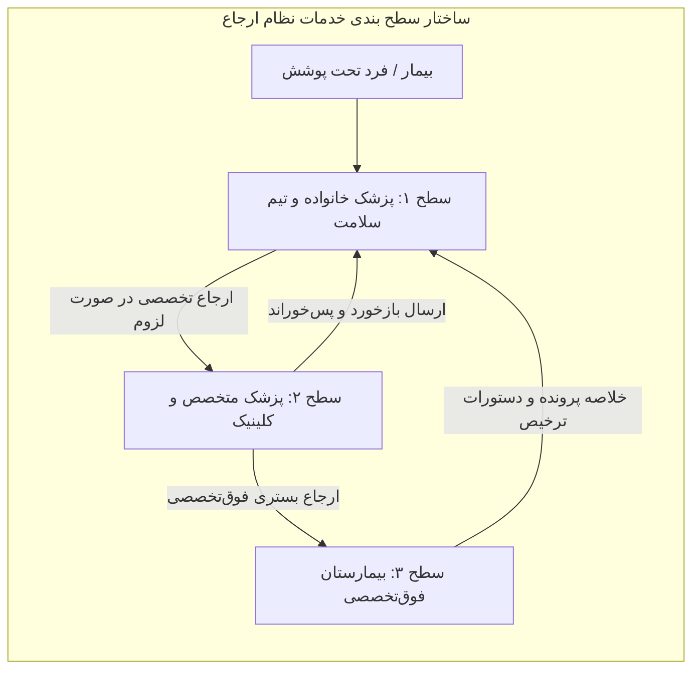
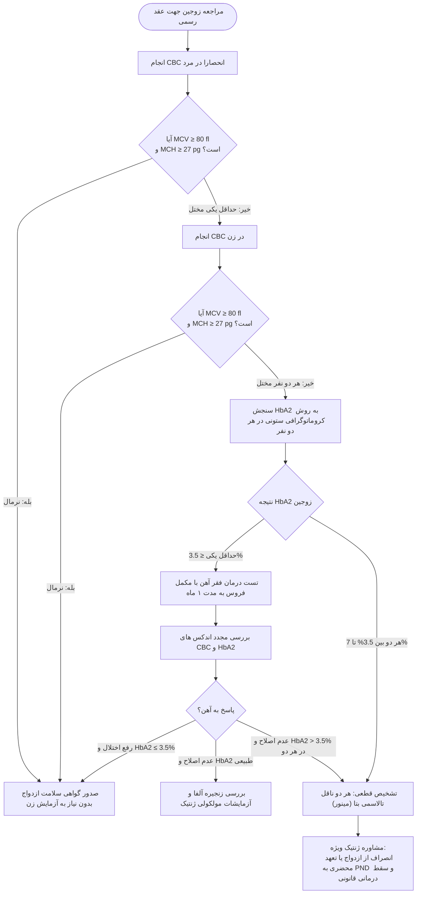
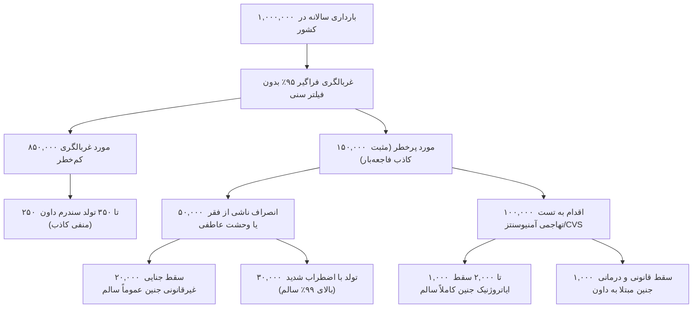
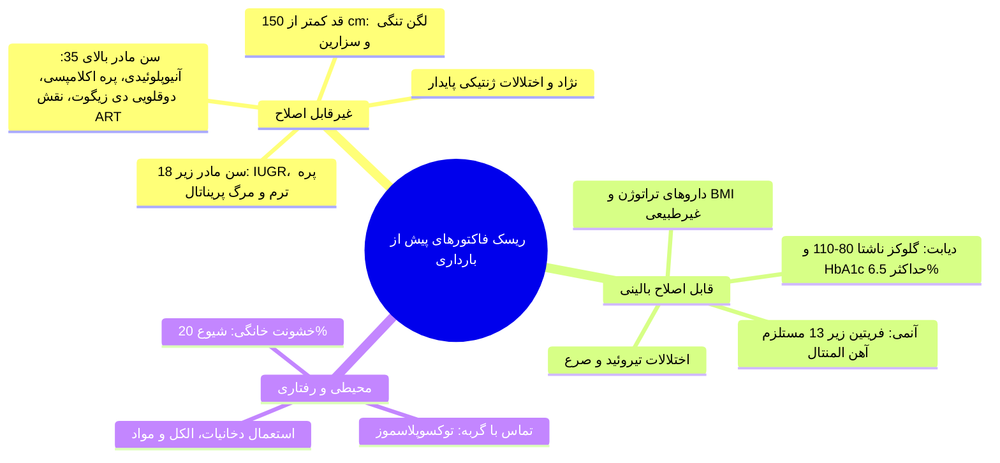
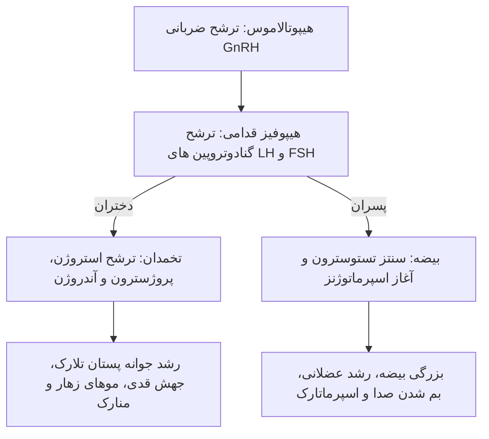
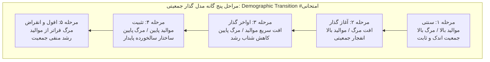
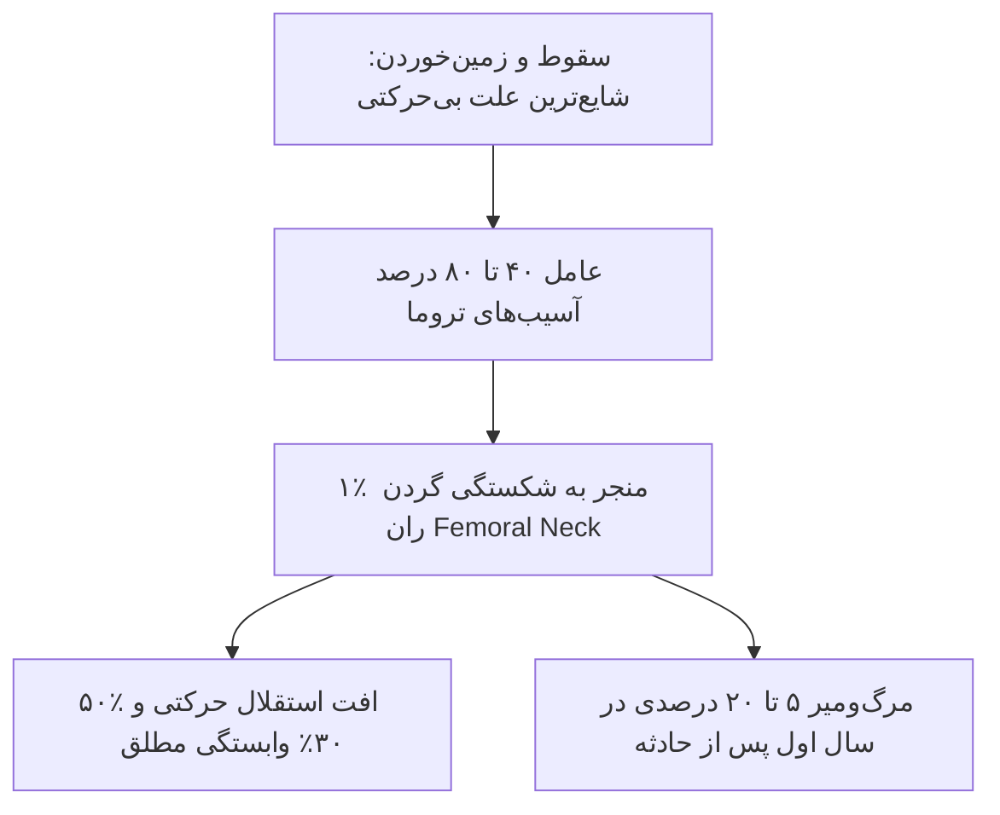
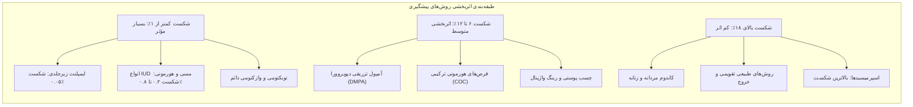

# خلاصه جامع بهداشت خانواده (جلسات ۱ تا ۱۵)

*(در این خلاصه بر جزئیات و اجزای مهم‌تر «بخش‌های اول، دوم و سوم» جزوه‌محور بهداشت خانواده تمرکز شده است و تلاش شده نکات احتمالی برای مطرح شدن در امتحانات آورده شود)*

## بخش ۱: کلیات سلامت خانواده، نظریه توسعه و ساختار نظام سلامت

> [!abstract] تعریف سلامت خانواده (Family Health)
> وضعیتی پویا شامل ارتقا و صیانت از ابعاد زیستی، روانی، اجتماعی و معنوی کل واحد خانواده و **تک‌تک اعضا در همه مراحل چرخه عمر**. سلامت خانواده *فراتر از جمع جبری* سلامت افراد بوده و **پل اتصال سلامت فرد با جامعه** است.

### ابعاد تعاریف و ساختار خانواده
1. **بیولوژیک/حقوقی عمومی:** هم‌زیستی ۲ یا چند نفر با پیوند خونی، زناشویی یا فرزندخواندگی، ساکن زیر یک سقف با اقتصاد مشترک.
2. **دیدگاه نوین غربی:** هم‌خانگی مشترک بدون الزام زیستی یا حقوقی (مانند *Cohabitation*)؛ فاقد وجاهت شرعی و قانونی در حقوق ایران.
3. **دیدگاه اسلام:** کانون حقوقی، مدنی و قدسی برآمده از **عقد نکاح مشروع** میان زن و مرد با حقوق، وظایف، احکام ارث و انفاق معین.
4. **خانواده هسته‌ای (Nuclear):** پدر، مادر و فرزندان؛ ساختار غالب جامعه مدرن؛ استقلال بالا اما تنوع تجارب اجتماعی محدود.
5. **خانواده گسترده (Extended):** حضور هم‌زمان چند نسل (اجداد، عموها، عمه‌ها) با زیست و اقتصاد مشترک؛ تعاملات اجتماعی غنی اما انتقال‌پذیری سریع تنش‌های فردی به ساختار کل.
6. **خانواده تک‌والد (Single-Parent):** ناشی از طلاق، فوت یا تجرد؛ ریسک بالای اختلال نقش‌پذیری عاطفی و وابستگی مفرط.

### کارکردهای بنیادین و نشانه‌های خانواده مطلوب
* **کارکردهای پنج‌گانه:** ۱) *Companionship* (محبت و ارتباط عاطفی پایدار؛ شالوده تاب‌آوری در بحران‌ها)، ۲) *باروری و تولیدمثل* (حفظ بقای نسل از طریق لقاح طبیعی، روش‌های کمک‌باروری ART یا فرزندخواندگی)، ۳) *سلامت و عملکرد جنسی* (ارضای مشروع غریزه و جامعه‌پذیری نقش جنسیتی فرزندان)، ۴) *جامعه‌پذیری (Socialization)* (انتقال فرهنگ، کنترل تکانه‌ها و مهارت زیست جمعی)، ۵) *حمایت اقتصادی و همکاری معیشتی* (مدیریت هزینه‌ها و هوش مالی).
* **شش نشانه تعالی خانواده:** حفظ اصول معنوی، اولویت‌بخشی به منافع جمعی خانواده بر فرد، احترام متقابل، مهارت گفت‌وگو و گوش دادن فعال، روحیه خدمت‌رسانی به دیگران، پذیرش نامشروط اعضا همراه با فراهم‌سازی بستر اصلاح خطا.

### چرخه زندگی خانواده (Duvall Family Life Cycle)

| مرحله تحولی (Stage)                | بازه زمانی و ماهیت                         | تکالیف رشدی کلیدی (Developmental Tasks)                                                 |
| :--------------------------------- | :----------------------------------------- | :-------------------------------------------------------------------------------------- |
| **۱. زوجین بدون فرزند**            | از پیوند زناشویی تا نخستین زایمان          | انطباق بین‌فردی، تنظیم روابط با *Family-of-origin* و شبکه‌های اجتماعی                   |
| **۲. فرزندآوری<br>(۰-۳۰ ماه)**     | تولد فرزند اول تا ۳۰ ماهگی او              | تطبیق ساختار با نوزاد، تثبیت هویت والدینی، بازتعریف روابط با خانواده گسترده             |
| **۳. پیش‌‌دبستانی<br>(۲.۵-۶ سال)** | فرزند ارشد در سن ۲.۵ تا ۶ سالگی            | جامعه‌پذیری اولیه کودک، تنظیم متدهای تربیتی هم‌زمان با تولد فرزندان بعدی                |
| **۴. سنین مدرسه<br>(۶-۱۳ سال)**    | فرزند ارشد در سن ۶ تا ۱۳ سالگی             | هدایت تحصیلی و انطباق با نهادهای برون‌خانوادگی (مدارس)                                  |
| **۵. نوجوانی<br>(۱۳-۲۰ سال)**      | فرزند ارشد در سن ۱۳ تا ۲۰ سالگی            | تعادل‌بخشی میان *استقلال‌طلبی* فرزند و مرزهای *انضباطی*، مدیریت میانسالی والدین         |
| **۶. پرواز یا پرتاب (Launching)**  | ترک منزل از سوی فرزند اول تا آخر           | برقراری پیوند *بالغ-بالغ*، ساماندهی چالش‌های شغلی، مراقبت از والدین سالخورده            |
| **۷. خانواده میانسال**             | از آشیانه خالی (*Empty Nest*) تا بازنشستگی | بازیابی ارتباط دونفره زوجین، تداوم مراقبت از سالخوردگان                                 |
| **۸. سالمندی**                     | از بازنشستگی تا فوت هر دو همسر             | تطابق با پیامدهای بازنشستگی، ایفای نقش پدربزرگ/مادربزرگ، سازگاری با سوگ و افت توان جسمی |

### تعیین‌کننده‌های اجتماعی سلامت (SDOH)
* **سبک زندگی (Lifestyle):** سهم **۵۰%** (*مهم‌ترین*) شامل رژیم غذایی، تحرک بدنی و مصرف دخانیات. #امتحانی
* **عوامل محیطی (Environment):** سهم **۲۰%** شامل آلودگی‌های شیمیایی، کیفیت آب شرب، بهسازی هوا و مسکن.
* **نظام سلامت (Health Care System):** سهم **۲۰%** شامل دسترسی عادلانه، تکنولوژی و پوشش بیمه‌ای فراگیر.
* **ژنتیک و بیولوژی:** سهم **۱۰%** شامل آسیب‌پذیری ساختاری و صفات وراثتی غیرقابل تعدیل.

```chart
{
  "title": "پایش همزمان قندخون و پتاسیم در پروتکل DKA",
  "subtitle": "پتاسیم برای خوانایی در مقیاس قند، ضرب‌در ۱۰۰ شده است",
  "type": "line",
  "data": [  
    { "time": "ساعت ۰", "bloodSugar": 480, "potassium_x100": 540 },
    { "time": "ساعت ۲", "bloodSugar": 390, "potassium_x100": 480 },
    { "time": "ساعت ۴", "bloodSugar": 310, "potassium_x100": 420 },
    { "time": "ساعت ۶", "bloodSugar": 240, "potassium_x100": 390 },
    { "time": "ساعت ۸", "bloodSugar": 190, "potassium_x100": 410 },
    { "time": "ساعت ۱۰", "bloodSugar": 165, "potassium_x100": 400 },
    { "time": "ساعت ۱۲", "bloodSugar": 150, "potassium_x100": 420 }
  ],
  "metrics": [
    { "key": "bloodSugar", "name": "گلوکز سرم (mg/dL)", "color": "#ef4444" },
    { "key": "potassium_x100", "name": "پتاسیم (مقدار × ۱۰۰)", "color": "#3b82f6" }
  ]
}
```

### مقایسه نظام‌های سلامت

| شاخص مقایسه‌ای | نظام تعاون همگانی (Open System) | نظام ارجاع و پزشک خانواده (Gatekeeping) |
| :--- | :--- | :--- |
| **آزادی انتخاب مراجع** | **نامحدود**؛ دسترسی مستقیم به سطوح تخصصی/فوق‌تخصصی | کانالیزه؛ **ورود انحصاری از سطح ۱** |
| **کنترل بار مالی** | ضعیف، هدررفت منابع، القای خدمات غیرضروری | **بهینه**، محافظت مالی از خانوار و مدیریت سرانه |
| **تداوم پیگیری (Continuity)** | پراکنده؛ چنددرمانی متناقض و پلی‌فارماسی شایع | دقیق در بستر پرونده الکترونیک سلامت و پیگیری فعال |
| **جایگاه پزشک عمومی** | حاشیه‌ای؛ منفعل در مسیر تصمیمات تخصصی | محوری؛ **هماهنگ‌کننده اصلی (Coordinator)** جمعیت تحت پوشش |
| **نیاز به بسترسازی فرهنگی** | بسیار پایین (به دلیل رجوع سلیقه‌ای مردم) | **بسیار بالا** (مستلزم آموزش اصلاح رفتار جامعه و پزشکان) |



---

## بخش ۲: مشاوره، غربالگری و آموزش‌های پیش از ازدواج

> [!abstract] مشاوره پیش از ازدواج
> نوعی *مداخله درمانی پیشگیرانه* روان‌شناختی-آموزشی جهت ارزیابی آمادگی‌های زیستی-روانی-اجتماعی طرفین و تعدیل خطاهای شناختی؛ زمان طلایی: **پیش از شکل‌گیری پیوند عاطفی عمیق**، مشروط به وجود انگیزه دوطرفه جهت تشکیل زندگی مشترک.

### ارکان سه‌گانه آمادگی و مراحل تحولی بلوغ
* **ارکان آمادگی ازدواج:** ۱) *بلوغ اجتماعی (Social Maturation)*، ۲) *انگیزش (Motivation)*؛ تعهد قلبی و پذیرش ارادی نقش همسری، ۳) *اطلاعات (Information)*؛ تسلط عملی بر مهارت‌های ارتباطی و تکنیک‌های حل تعارض.
* **توالی گام‌های بلوغ (فواصل زمانی ۳ تا ۴ سال):**
  1. **بلوغ جسمی:** شتاب نمو سوماتیک؛ متأثر از ژنتیک، اقلیم و تغذیه.
  2. **بلوغ جنسی:** فعال‌سازی محور گنادی، سنتز هورمون‌های جنسی و پیدایش صفات ثانویه.
  3. **بلوغ روانی:** مهار هیجانات بر غرایز اولیه؛ گرایش شدید به *عشق رمانتیک* و اوج‌گیری حالات *خودشیفتگی (Narcissism)*.
  4. **بلوغ اجتماعی:** تقدم قاطع عقلانیت، مسئولیت‌پذیری در قبال دیگری، ثبات تعهد زناشویی؛ چالش‌ها و پذیرش زودهنگام مسئولیت آن را **تسریع** و محیط‌های بی‌تنش و محافظت‌شده آن را **به تعویق** می‌اندازند.

### سیمای اپیدمیولوژیک ازدواج و طلاق در ایران
* حدود ۹۷% افراد بالغ در طول حیات حداقل یک‌بار پیوند زناشویی برقرار می‌کنند.
* بحرانی‌ترین مقطع طلاق: **۵ سال اول زندگی (۵۰% کل رویدادها)**؛ بیشترین فراوانی سالانه: **سال اول ازدواج (سال عسل)** ناشی از فقر شناخت متقابل، نه عوامل برون‌خانوادگی.
* پیک دوم طلاق: سال‌های **۲۰ تا ۲۴ زندگی مشترک** (هم‌زمان با بحران میانسالی و جابه‌جایی ارزش‌ها).
* ریسک سنی طلاق: **بیشترین فراوانی در سن یکسان (اختلاف سنی صفر)**؛ ریسک بالا هنگام *بزرگ‌تر بودن زوجه از زوج*. #امتحانی
* کمترین نرخ نسبی طلاق: سیستان و بلوچستان (۱۷ ازدواج به ۱ طلاق)؛ بیشترین نرخ نسبی: تهران، البرز و قم (۲ به ۱).
* بیشترین طلاق مطلق: استان‌های تهران، خراسان رضوی، اصفهان و فارس.
* شایع‌ترین سن پیوند ثبت‌شده: مردان ۲۰ تا ۲۴ سال با زنان ۱۵ تا ۱۹ سال (بالای ۱۰۲ هزار رویداد سالانه).
* دوره کشوری آموزش حین ازدواج: **۶ ساعت** در قالب ۳ جلسه ۲ ساعته (محورهای بهداشت باروری، حقوق و احکام، روان‌شناسی ارتباطی، پیشگیری از رفتارهای پرخطر و اعتیاد).

### استراتژی‌های سه‌گانه پیشگیری از تالاسمی ماژور در ایران #امتحانی
1. **استراتژی اول (غربالگری پیش از ازدواج - بخشنامه ۱۳۷۲):** کم‌خطرترین، عاقلانه‌ترین، فراگیرترین و ارزان‌ترین روش؛ پوشش ۱۰۰% جمعیت بدون نیاز به فراخوان عمومی و در بستر ثبت رسمی عقد.
2. **استراتژی دوم (تشخیص پیش از تولد - PND):** انجام آمنیوسنتز یا بیوپسی پرزهای کوریونی (CVS) در **سه ماهه اول بارداری** جهت صدور مجوز سقط قانونی و شرعی جنین مبتلا به ماژور قبل از ولوج روح (پایان هفته ۱۶).
3. **استراتژی سوم:** شناسایی فعال، ثبت پرونده و پیگیری زوجین ناقلی که **پیش از استقرار برنامه کشوری (سال ۱۳۷۲)** پیوند زناشویی بسته‌اند.



> [!danger] نکات کلیدی غربالگری تالاسمی #امتحانی
> * آزمایش ابتدایی خون منحصراً از **مرد** اخذ می‌شود؛ در صورت نرمال بودن اندکس‌ها، زن نیاز به آزمایش نخواهد داشت (حتی اگر زن مبتلا باشد، ریسک تولد ماژور صفر است).
> * معیار تشخیصی قطعی ناقل تالاسمی بتا، **HbA2 > 3.5%** صرفاً با روش *کروماتوگرافی ستونی (Column Chromatography)* است.
> * آزمون سرولوژیک **VDRL برای مردان اجباری** است؛ موارد مثبت مستلزم تایید تشخیصی با تست اختصاصی FTA-ABS هستند.
> * در صورت نیاز به واکسیناسیون زنده سرخجه به دلیل IgG منفی، بارداری باید حداقل **۱ ماه به تعویق افتد**. واکسن کزاز در صورت گذشت بیش از ۱۰ سال از آخرین دوز تزریق می‌گردد. آزمایش اعتیاد نیز با سنجش متابولیت‌ها در ادرار انجام می‌پذیرد.

---

## بخش ۳: سطوح پیشگیری، غربالگری بارداری و نوزادی

### ماتریس تطبیقی سطوح پنج‌گانه پیشگیری

| رده پیشگیری             | وضعیت پایه بالینی       | مکانیسم عمل در سلامت عمومی                                           | مصداق در باروری و مامایی #امتحانی                                                               |
| :---------------------- | :---------------------- | :------------------------------------------------------------------- | :---------------------------------------------------------------------------------------------- |
| **نخستین (Primordial)** | فاقد عامل خطر           | ممانعت از پیدایش رفتارهای پرخطر با سیاست‌گذاری کلان اقتصادی-اجتماعی  | ترویج برنامه‌های تنظیم خانواده و زمان‌بندی حاملگی با آموزش همگانی                               |
| **اولیه (Primary)**     | دارای ریسک، فاقد بیماری | مهار قطعی مواجهه با عامل بیماری‌زا قبل از وقوع آسیب                  | **تجویز اسید فولیک** پیش از لقاح جهت انسداد NTD؛<br>**رژیم فاقد فنیل‌آلانین** مادر مبتلا به PKU |
| **ثانویه (Secondary)**  | فاز تحت‌بالینی          | بیماریابی و درمان زودهنگام قبل از بروز علائم پایدار                  | **غربالگری کروموزومی جنین** و ختم قانونی تریزومی‌ها؛<br>بهینه‌‌سازی HbA1c قبل لقاح              |
| **ثالثیه (Tertiary)**   | بیماری علامت‌دار        | بازتوانی، مهار پیشرفت عوارض و ناتوانی‌زدایی                          | اعمال جراحی ترمیمی نوزادی بر مننگوسل، میلومننگوسل و هیدروسفالی                                  |
| **چهارم (Quaternary)**  | در معرض خطای درمانی     | حفاظت بیمار در برابر *Over-medicalization* و مداخلات تهاجمی زیان‌بار | تعدیل داروی ضدصرع تراتوژن به مونوتراپی با حداقل دوز مؤثر به همراه فولات بالا                    |

### اصول اپیدمیولوژیک غربالگری در برابر بیماریابی

| مولفه ساختاری | بیماریابی بالینی (Case Finding) | غربالگری ساختارمند جمعیتی (Screening) |
| :--- | :--- | :--- |
| **رویکرد عملیاتی** | **غیرفعال (Passive)** و فردمحور | **فعال (Active)** و جامع‌نگر حاکمیتی |
| **جامعه هدف** | افراد علامت‌دار مراجعه‌کننده اختیاری به مطب/بیمارستان | **جمعیت به ظاهر سالم، بدون علامت و در معرض خطر** |
| **مسئولیت تبعات** | متوجه بیمار و پزشک معالج | **مستقیماً متوجه حاکمیت سلامت و سیاست‌گذار کلان** |

> [!tip] الزامات چهارگانه برنامه‌های غربالگری سلامت عمومی #امتحانی
> ۱) تست با *حساسیت و ویژگی بسیار بالا*، ۲) *عدم تحمیل هزینه‌های سنگین به جامعه*، ۳) *عدم ورود آسیب و عوارض جسمی/روانی به جمعیت غربال‌شده*، ۴) معطوف بودن به *گروه‌های پرخطر*. غربالگری مداخله خنثی نیست؛ خطاهای مثبت کاذب موجب اضطراب، فقر و مداخلات القایی تهاجمی می‌گردند.

### مقایسه تطبیقی غربالگری سندرم داون (ایران در برابر غرب)

| شاخص اپیدمیولوژیک | وضعیت در ایران (پیمایش ملی ۲۰۱۸) | کشورهای توسعه‌یافته (انگلستان NHS، هلند، کانادا) |
| :--- | :--- | :--- |
| **پوشش جمعیت باردار** | **فراگیر و غیرهدفمند (۹۴.۵%)**؛ ورود مادران در تمام رده‌های سنی | هدفمند و محدود (۳۰ تا ۳۴%)؛ تمرکز روی سنین **بالای ۳۵ سال** |
| **میانگین سنی مادران** | **۲۳ تا ۲۹ سال (میانگین ۲۷ سال)** با شیوع پایه بسیار نادر داون | سنین بالای ۳۵ سال با شیوع پایه بالای اختلالات کروموزومی |
| **نرخ ارجاع به تست تهاجمی** | **۱۲.۵ تا ۱۶.۵%** (*مثبت کاذب بسیار شدید و فاجعه‌بار*) | ۱.۸ تا ۲.۵% در انگلستان؛ حداکثر ۵% در کانادا |
| **تأمین منابع مالی** | پرداخت مستقیم از **جیب خانوار (Out-of-pocket)** | **پوشش ۱۰۰% رایگان دولتی و بیمه‌ای** |
| **مانیتورینگ آزمایشگاهی** | فقدان آدیتوری متمرکز و ممیزی منظم تا سال ۲۰۱۸ | **آدیتوری و کالیبراسیون تجهیزات هر ۳ روز یک‌بار** |
| **پیامد جانی ناخواسته** | **سقط ایاتروژنیک ۱۰۰۰ تا ۲۰۰۰ جنین سالم سالانه** در اثر عوارض آمنیوسنتز | حداقل تلفات جنینی ممکن به دلیل تنظیم دقیق کات‌آف‌ها و غربال دومرحله‌ای NIPT |
| **هزینه-اثربخشی** | شناسایی هر جنین مبتلا: ۱۲ میلیون دلار (**۱۲۱ برابر** هزینه نگهداری مادام‌العمر فرد داون) | کاملاً مقرون‌به‌صرفه با ارزش اخباری مثبت (PPV) بالا |



> [!info] کات‌آف و تست‌های غربالگری کروموزومی
> * **غربالگری سه ماهه اول (هفته ۱۱ تا ۱۳+۶):** تلفیق سن مادر + سونوگرافی مارکر نمرات NT + بیومارکرهای PAPP-A و Free β-hCG.
> * **غربالگری سه ماهه دوم (کواد مارکر):** آلفافیتوپروتئین (AFP) + hCG + استریول غیرکونژوگه (uE3) + اینهیبین A.
> * **کات‌آف خطر کشوری:** **۱:۲۵۰**. مساوی یا پرخطرتر (مانند ۱:۱۰۰) ⇦ ارجاع به NIPT یا اقدامات تهاجمی (CVS در هفته ۱۰-۱۳ یا آمنیوسنتز در هفته ۱۵-۱۹ با ریسک سقط ۰.۵ تا ۲%). کم‌خطرتر (مانند ۱:۵۰۰) ⇦ اطمینان‌بخشی و توقف مداخله.
> * *نکته ژنتیک:* تنها **تریزومی ۲۱ (سندرم داون)** ارزش مداخله دارد؛ تریزومی ۱۳ و ۱۸ منجر به مرگ داخل رحمی یا مرگ زودرس نوزادی می‌شوند.

### غربالگری نوزادی (Neonatal Screening)
* **زمان‌بندی نمونه‌گیری:** منحصراً **روز ۳ تا ۵ پس از تولد**؛ ۳ تا ۵ قطره خون مویرگی از کف پاشنه پا روی کاغذ صافی گاتری.
* **کم‌کاری مادرزادی تیروئید (CH):** شایع‌ترین علت قابل پیشگیری عقب‌ماندگی ذهنی؛ نوزاد در بدو تولد کاملاً بدون علامت است؛ درمان فوری با لووتیروکسین ضریب هوشی (IQ) را به طور کامل حفظ می‌کند.
* **فنیل‌کتونوری (PKU):** اتوزومال مغلوب؛ نقص فنیل‌آلانین هیدروکسیلاز کبد؛ تجمع و سمیت شدید مغزی؛ مهار قطعی با رژیم فاقد فنیل‌آلانین.
* **کمبود آنزیم G6PD (فاویسم):** وابسته به X مغلوب؛ افت گلوتاتیون احیا، لیز درون‌عروقی و افت ناگهانی Hb به مقادیر کشنده زیر ۴ g/dL.

> [!danger] پروتکل منع دارویی و غذایی فاویسم #امتحانی
> * **خوراکی:** دانه و گرده باقلا (حتی بوی مزرعه)، دوز بالای ویتامین C (قرص‌های ۱۰۰۰ mg).
> * **آرام‌بخش و بیهوشی:** **دیازپام** (*تنها بنزودیازپین ممنوع*)، لیدوکائین، پریلوکائین، ایزوفلوران، سووفلوران.
> * **آنتی‌بیوتیک:** سولفونامیدها (کوتریموکسازول)، نیتروفورانتوئین، فورازولیدون، پنی‌سیلین.
> * **سایر:** پریماکین، کلروکین، متیلن بلو، متوکلوپرامید، کینیدین، آنالوگ‌های ویتامین K، نیترات نقره، دوزهای بالای آسپرین و استامینوفن.

---

## بخش ۴: مشاوره و مراقبت‌های پیش از بارداری

* **فرضیه بارکر (Barker Hypothesis):** شرایط زیستی و هورمونی *داخل رحمی*، برنامه‌ریزی سلولی سلامت را معین کرده و بیماری‌های مزمن بزرگسالی (دیابت، هیپرتانسیون و حوادث قلبی) را رقم می‌زند.
* **اپیدمیولوژی:** ۲۵ تا ۵۰ درصد کل بارداری‌ها ناخواسته رخ می‌دهند (پرخطرترین دسته بارداری).
* **زمان‌‌بندی:** شروع مراقبت‌ها **حداقل ۳ ماه قبل از لقاح**؛ اعتبار پرونده معاینات: **حداکثر ۱ سال**.



### پروتکل بالینی بیماری‌های زمینه‌ای در پره‌کنسپشن
* **دیابت ملیتوس:** هیپرگلیسمی در زمان لقاح تراتوژن قوی است (آژنزیس ساکروم، نقایص مادرزادی قلب). الزامات: **FBS بین ۸۰ تا ۱۱۰ mg/dL**، **HbA1c حداکثر ۶.۵%**، تبدیل درمان خوراکی به انسولین، ارزیابی رتینوپاتی با فوندوسکوپی و پایش کراتینین و پروتئینوری.
* **پروتکل اسید فولیک:**
  * **جمعیت عادی کم‌خطر:** **۴۰۰ میکروگرم (۰.۴ mg) یا ۱ mg روزانه** از ۳ ماه قبل تا پایان هفته ۱۶ بارداری.
  * **جمعیت پرخطر (سابقه NTD، مصرف والپروات، دیابت، موتاسیون MTHFR):** **۴ تا ۵ میلی‌گرم روزانه** از ۳ ماه پیش از لقاح.
* **کم‌خونی و تالاسمی:** تجویز آهن در فریتین کمتر از ۱۳ ng/mL؛ در کم‌خونی مزمن تجویز اسید فولیک ۳ mg روزانه؛ قطع دسفریوکسامین قبل لقاح؛ در صورت تزریق واکسن پنوموکوک، بارداری ۳ تا ۴ هفته به تعویق افتد. **پرفشاری خون ریوی (Pulmonary HTN) منع مطلق بارداری است** (مرگ مادری تا ۵۰%).
* **آنمی داسی‌شکل:** مشاوره پریناتولوژی، هماتولوژی و کاردیولوژی؛ **قطع هیدروکسی‌اوره از حداقل ۳ ماه قبل از لقاح** (در صورت مصرف حین بارداری: آنومالی اسکن جهت پایش استخوان‌ها) + فولات ۳ mg روزانه.
* **مدیریت والدین مبتلا به HIV:** هر دو والد تحت رژیم ترکیبی ART قرار گیرند تا بار ویروسی به حد نامشخص (*Undetectable*) برسد و وضعیت پس از ۴ تا ۶ ماه پایدار شود.
	* *اگر مرد مبتلا باشد*: **Sperm Washing**؛ *اگر زن مبتلا باشد*: **تلقیح داخل رحمی (IUI)**؛ *اگر هر دو مبتلا باشند*: **آمیزش صرفاً در زمان تخمک‌گذاری** و **زایمان الزماً با سزارین انتخابی**.
* **داروهای تراتوژن ممنوع قطعی:** وارفارین، والپروات، آکوتان (ایزوترتینوئین)، مهارکننده‌های ACE و ARBها، استاتین‌ها، متوترکسات، هیدروکسی‌اوره. داروهای ایمن: سالبوتامول، آنتی‌هیستامین‌ها، لووتیروکسین، پاراستامول.

### جدول تفسیر آزمایش‌های غربالگری پیش از بارداری

| نتیجه آزمایش پاراکلینیک | وضعیت تشخیصی احتمالی | مداخله بالینی الزامی |
| :--- | :--- | :--- |
| **VDRL مثبت** | سیفلیس؛ موارد مثبت کاذب (لوپوس، اعتیاد، مالاریا) | **انجام تست تأییدی FTA-ABS**؛ درمان با پنی‌سیلین در موارد مثبت |
| **HIV مثبت** | عفونت قطعی رتروویروسی | **ارجاع فوری** به مراکز مشاوره بیماری‌های رفتاری جهت رژیم ART |
| **HIV منفی در پرخطر** | احتمال دوره پنجره (Window Period) | آموزش پیشگیری، مشاوره رفتاری و **تکرار آزمایش ۳ ماه بعد** |
| **HBsAg مثبت** | هپاتیت B حاد یا ناقل مزمن | ارجاع به متخصص گوارش/عفونی؛ **واکسیناسیون اعضای HBsAg منفی خانواده** |
| **هموگلوبین < ۱۲ g/dL** | آنمی فقر آهن یا تالاسمی | سنجش آهن، فریتین، TIBC؛ تجویز آهن در فریتین < 13؛ اسید فولیک 3 mg |
| **قند ناشتا (FBS) ≥ ۱۲۶** | دیابت آشکار (Overt Diabetes) | **تکرار تست ۱ هفته بعد**؛ در صورت اثبات، ارجاع فوق‌تخصصی و شروع انسولین |
| **پاپ اسمیر پاتولوژیک** | دیسپلازی اپی‌تلیال، کانسر سرویکس | ارجاع به متخصص زنان؛ **منع غربالگری پاپ اسمیر در دوران بارداری** |
| **لکوسیتوری با U/C منفی** | واژینیت تریکومونایی یا کلامیدیا | معاینه ژنیکولوژی، درمان تجربی واژینیت؛ درمان یورتریت کلامیدیایی زوجین |
| **کشت ادرار مثبت** | عفونت ادراری یا باکتریوری بدون علامت | **درمان آنتی‌بیوتیکی تارگت قبل از بارداری** جهت پیشگیری از پیلونفریت آتی |
| **تیتر IgG سرخجه منفی** | فقدان ایمنی هومورال به ویروس سرخجه | **تزریق واکسن زنده سرخجه** و **منع مطلق بارداری تا ۱ ماه بعد** |

---

## بخش ۵: تغییرات فیزیولوژیک بارداری و مراقبت‌های پره‌‌ناتال

### تطابق بیولوژیک دستگاه‌های ارگانیک در بارداری
* **هورمون‌ها:** جهش ۱۵ برابری استروژن و ۲۰۰ برابری پروژسترون در سه ماهه سوم؛ پیک hCG در هفته ۱۰ تا ۱۲ و **افت فیزیولوژیک و گذرای TSH به علت تشابه زیرواحد آلفای دو هورمون**؛ سرکوب GH هیپوفیزی مادر؛ وضعیت مستعدکننده دیابت (*Diabetogenic*) توسط **لاکتوژن جفتی (hPL)**؛ پرولاکتین در تمام بارداری بالا می‌رود اما ترشح شیر تا خروج جفت توسط استروژن و پروژسترون بلوک می‌شود.
* **رحم و عروق:** صعود وزن رحم از ۷۰ به **۱۱۰۰ گرم**، حجم از ۱۰ به **۵۰۰۰ تا ۱۰۰۰۰ mL**، و جریان خون از ۲۰ به **۷۵۰ mL/min**؛ اتساع عروقی تحت ریلکسین؛ علامت *گودل* (نرمی سرویکس)، *چادویک* (رنگ ارغوانی)، *موکوس پلاگ* (سد عفونت صاعده) و **افت pH واژن** به ۴ تا ۵. عملکرد پروژسترونی جسم زرد تا هفته ۱۲ تا ۱۶ ادامه دارد؛ جراحی تخمدان منحصراً پس از هفته ۱۶ مجاز است.
* **همودینامیک:** افزایش پلاسما ۴۵-۵۰%؛ افزایش توده RBC حدود ۲۰-۴۰% ⇦ **آنمی رقیق‌شدگی (Hemodilution)**؛ صعود برون‌ده قلبی ۳۰-۵۰%؛ افت مقاومت عروقی ۲۰%؛ فشار خون در نیمه اول افت می‌کند و در اواخر سه ماهه سوم به نرمال بازمی‌گردد. **فشار خون ≥ ۱۴۰/۹۰ mmHg پاتولوژیک است**. خوابیدن طاق‌باز موجب فشرده شدن IVC و آئورت ⇦ **سندرم هیپوتنشن سوپاین**؛ درمان: **پوزیشن پهلوی چپ (Left Lateral)**.
* **تنفس:** صعود ۴ سانتی‌متری دیافراگم، باز شدن زاویه زیردنده‌ای از ۶۸.۵ به **۱۰۳.۵ درجه**؛ **ظرفیت کل ریوی (TLC) و تعداد تنفس بدون تغییر می‌‌مانند**؛ افزایش حجم جاری (TV) موجب **آلکالوز تنفسی خفیف جبران‌شده** می‌شود.
* **سیستم ادراری:** صعود ۵۰ درصدی GFR؛ **کراتینین سرمی بالای ۰.۹ mg/dL نشانه قطعی نارسایی کلیه است**؛ هیدرونفروز فیزیولوژیک (به علت ریلکسیشن عضلانی پروژسترون و چرخش راست‌گرای رحم به سمت راست) مستعدکننده پیلونفریت حاد است.
* **سایر ارگان‌ها:** رفلکس اسید و سوزش سر دل ناشی از شلی اسفنکتر مری؛ ژنژیویت ناشی از پرخونی مویرگی استروژنی؛ هایپرلوردوز گردنی/کمری؛ کلوآسما، لینیا نیگرا و استریاهای پوستی.

### راهنمای افزایش وزن استاندارد بارداری (IOM)

| وضعیت شاخص توده بدنی (BMI) | محدوده عددی ($kg/m^2$) | افزایش وزن در بارداری تک‌قلو | افزایش وزن در بارداری دوقلو |
| :--- | :--- | :--- | :--- |
| **کم‌وزن (Underweight)** | کمتر از ۱۸.۵ | **۱۲.۵ تا ۱۸ کیلوگرم** | نیازمند ارزیابی کارشناس تغذیه |
| **طبیعی (Normal)** | ۱۸.۵ تا ۲۴.۹ | **۱۱.۵ تا ۱۶ کیلوگرم** | **۱۶.۸ تا ۲۴.۵ کیلوگرم** |
| **اضافه‌وزن (Overweight)** | ۲۵ تا ۲۹.۹ | **۷ تا ۱۱.۵ کیلوگرم** | **۱۴.۱ تا ۲۲.۷ کیلوگرم** |
| **چاق (Obese)** | مساوی یا بیشتر از ۳۰ | **۵ تا ۹ کیلوگرم** | **۱۱.۴ تا ۱۹.۱ کیلوگرم** |

> [!tip] سرعت وزن‌گیری مجاز
> افزایش وزن کل در سه ماهه اول بارداری **۱ تا ۱.۵ کیلوگرم** است. در سه ماهه دوم و سوم، افزایش وزن استاندارد **۳۰۰ تا ۵۰۰ گرم در هفته** است. مادران نوجوان نیازمند افزایش وزن در سقف محدوده و مادران کوتاه قد (< ۱۵۰ cm) در کف محدوده هستند.

### پروتکل ویزیت‌های هشت‌گانه بارداری کم‌خطر
1. **مراقبت ۱ (هفته ۶ تا ۱۰):** تشکیل پرونده، سونوگرافی ضربان قلب، آزمایش‌های پایه (CBC, BG-Rh, FBS, U/C, BUN, Cr, TSH, HBsAg, VDRL, HIV). *اگر اولین مراجعه دیرهنگام باشد هم باید در اسرع وقت انجام شود!*
2. **مراقبت ۲ (هفته ۱۶ تا ۲۰):** **سمع FHR با سونیکید**، سنجش ارتفاع فوندوس، **سونوگرافی آنومالی اسکن جنین (هفته ۱۶ تا ۱۸)**.
3. **مراقبت ۳ (هفته ۲۴ تا ۳۰):** **تست تحمل گلوکز (OGTT با ۷۵ گرم)** در هفته ۲۴ تا ۲۸، تیتر کومبس غیرمستقیم در مادران Rh منفی با همسر مثبت.
4. **مراقبت ۴ (هفته ۳۱ تا ۳۴):** ارزیابی وزن، سونوگرافی سلامت جنین، تکرار آزمایش HIV در افراد پرخطر، سمع FHR با پینارد.
5. **مراقبت ۵ (هفته ۳۵ تا ۳۷):** پایش فشار خون، مانور لئوپولد، تعیین وضعیت نمایش جنین، رد علائم زایمان زودرس.
6. **مراقبت ۶ تا ۸ (هفته ۳۸، ۳۹ و ۴۰):** پایش هفتگی تا زمان زایمان، ارزیابی مایع آمنیوتیک، پیشگیری از حاملگی پست‌ترم.

> [!danger] علائم قرمز و اورژانسی ۹ گانه بارداری #امتحانی
> ۱) اختلال هوشیاری، تشنج و کما،
> ۲) فشار خون سیستولیک ≥ ۱۴۰ یا دیاستولیک ≥ ۹۰ mmHg،
> ۳) خونریزی یا لکه‌بینی،
> ۴) درد شدید شکم یا سردرد مداوم با تاری دید،
> ۵) درد و ادم یک‌طرفه ساق پا (شک به DVT)،
> ۶) نشت مایع آمنیوتیک (کیسه آب)،
> ۷) تب و لرز بالا،
> ۸) کاهش یا قطع حرکات جنین بعد از هفته ۲۴،
> ۹) تنگی نفس استراحتی، تپش قلب حاد یا علائم شوک.

---

## بخش ۶: بهداشت مدارس و ارتقای سلامت نوجوانان

> [!abstract] مدارس مروج سلامت (Health Promoting Schools)
> الگویی جامعه‌‌نگر جهت توانمندسازی نظام‌مند دانش‌آموزان با ترکیب هم‌زمان آموزش بهداشت، بهسازی محیط کالبدی، خدمات بالینی، تغذیه بوفه، سلامت روان و مشارکت فعال اولیا و جامعه بر پایه مدل جامع WSCC.

### مدل شش‌لایه اکولوژیکال عوامل مؤثر بر سلامت نوجوانان

| رده اکولوژیک                     | مؤلفه‌های محوری #امتحانی                                        | پیامدهای بالینی و رفتاری بر دانش‌آموز                              |
| :------------------------------- | :-------------------------------------------------------------- | :----------------------------------------------------------------- |
| **۱. فردی (Individual)**         | سن، جنس، باورها، سیستم درک ریسک، دانش بیولوژیک                  | پاسخ هیجانی به بلوغ؛ گرایش به رفتارهای پرخطر به دلیل عدم بلوغ مغزی |
| **۲. بین‌‌فردی (Interpersonal)** | خانواده، همسالان، کادر مدرسه، سبک دلبستگی                       | شکل‌گیری عادات غذایی، رفتارهای پرخطر، سرمایه روانی و الگوپذیری     |
| **۳. جامعه (Community)**         | هنجارهای محله، امنیت محیطی، شبکه‌های حمایتی                     | تعیین قبح رفتارهای پرخطر، دسترسی به فضاهای ورزشی و تفریحی ایمن     |
| **۴. سازمانی (Organizational)**  | ساختار کالبدی مدارس، پروتکل‌های بهداشتی                         | کنترل آسیب‌های فیزیکی، بیماریابی با شناسنامه سلامت و بوفه سالم     |
| **۵. محیطی (Environmental)**     | کیفیت آب شرب، بهسازی فاضلاب، راه‌های تردد                       | پیشگیری از مسمومیت‌ها، کاهش سوانح ترافیکی دانش‌آموزی و کنترل آسم   |
| **۶. ساختاری (Structural)**      | قوانین و حقوق، برابری، قوم‌گرایی، دیدگاه‌های جنسی، تبعیض        | مهار تبعیض، برابری جنسیتی                                          |
| **۷. کلان (Macro)**              | درآمد ملی، فقر، تبعیض جنسیتی، قوانین ملی، پدیده *Globalization* | مهار امواج پاندمیک، مهار بار تورمی بر سوءتغذیه خانوار              |

### سطوح پیشگیری و اصول توانمندسازی در مدارس
* **سطوح پیشگیری:** *اولیه:* واکسیناسیون، بوفه سالم، زنگ ورزش؛ *ثانویه:* غربالگری بدو ورود، معاینات دهان و دندان، بینایی و شنوایی‌سنجی دبستان؛ *ثالثیه:* بازتوانی دانش‌آموزان مبتلا به آسم، دیابت ۱، صرع و معلولیت.
* **مثلث آموزش سلامت:** ترکیب هماهنگ **دانش (Know What) ⇦ نگرش (Know Why) ⇦ مهارت (Know How)** منجر به **توانمندی پایدار (Ability)** می‌گردد. آموزش بدون *Role Modeling* معلمان (نظیر استعمال دخانیات یا تغذیه ناسالم اولیا) خنثی می‌شود. #امتحانی 
* **علل آسیب‌پذیری زیستی کودکان در مدرسه:** ۱) نابالغانگی سیستم ایمنی، ۲) اندام‌های در حال نمو، ۳) **دریافت بالاتر آب، غذا و حجم تنفسی به ازای هر کیلوگرم وزن بدن نسبت به بالغان**، ۴) حضور طولانی در محیط مدرسه، ۵) **نابالغانگی کورتکس پره‌فرونتال نسبت به لیمبیک** که درک ریسک را مختل می‌سازد.
* **تهدیدات و نیازهای فیزیکی:** شوینده‌ها و مواد ضدعفونی‌کننده در تمام مدارس تریگر حملات حاد آسم هستند؛ سم‌پاشی و رنگ‌آمیزی ساختمانی (آزبست) باید در تعطیلات انجام شود.
* **نیازهای پایه (۸ گانه):** سرپناه (*Shelter*)، گرمایش (*Warmth*)، آب (*Water*)، تغذیه (*Food*)، نور (*Light*)، تهویه (*Ventilation*)، سرویس‌های بهداشتی (*Sanitary facilities*)، خدمات فوریت‌های پزشکی (*Emergency medical care*).
* **فعالیت فیزیکی (WHO):** **حداقل ۶۰ دقیقه فعالیت هوازی متوسط تا شدید روزانه** برای کودکان و نوجوانان. اجزای CSPAP: تربیت بدنی، فعالیت حین درس، فعالیت قبل/بعد مدرسه، درگیرسازی کارکنان، مشارکت والدین. #امتحانی 

### مدل توسعه مثبت نوجوانان (5C) و تفاوت‌های سنی #امتحانی 

| مؤلفه                            | تعریف فارسی                                               | کلمات کلیدی                                | راهکار پرورش                                      |
| -------------------------------- | --------------------------------------------------------- | ------------------------------------------ | ------------------------------------------------- |
| **شایستگی**<br>(Competence)      | باور به توانمندی فردی در عمل                              | Abilities, Skills                          | آموزش و تمرین مهارت‌های علمی یا عملی              |
| **اعتمادبه‌نفس**<br>(Confidence) | حس درونی کارآمدی و ارزشمندی شخصی                          | Self-efficacy, Self-worth                  | ایجاد فرصت تجربه موفقیت در کارهای جدید            |
| **ارتباط**<br>(Connection)       | پیوندهای ایمن با افراد و نهادها (خانواده، همسالان، مدرسه) | Positive bonds, Institutions               | پیوندسازی میان نوجوان با همسالان، معلمان و والدین |
| **منش / شخصیت**<br>(Character)   | تمایز درست از نادرست (اخلاق‌مداری)، صداقت و معنویت        | Morality, Integrity, Respect for standards | تمرین خودکنترلی و پرورش معنویت                    |
| **همدلی و مراقبت**<br>(Caring)   | حس همدردی، همدلی و نوع‌دوستی نسبت به دیگران               | Sympathy, Empathy                          | ابراز توجه، محبت و مراقبت نسبت به نوجوانان        |
* **ابتدایی پایین (۶-۸ سال):** عدم درک مفاهیم انتزاعی؛ آموزش انحصاری از طریق بازی و سرود صرفاً در ۳ زمینه: *سلامت فردی، ایمنی، غذای سالم*.
* **ابتدایی میانه (۹-۱۱ سال):** پرتحرک و مسئولیت‌پذیر؛ آموزش قواعد تیمی: *همکاری، بردباری، استقلال، وظیفه‌شناسی*.
* **متوسطه (۱۲-۱۵ سال):** غلبه سیستم لیمبیک بر پره‌فرونتال؛ امتناع قاطع از پند و نصیحت مستقیم؛ توانمندسازی با ارائه فکت‌های مستند و تحلیل پیامدها.
* **بیماری‌های شایع و آسیب‌ها:** دسترسی فوری به سالبوتامول در آسم؛ دسترسی آزاد به آب و دفع ادرار و انسولین در دیابت ۱؛ محافظت از تشنج و حفظ احترام در برابر تمسخر در صرع؛ ثبت آلرژن‌ها و منع اشتراک لقمه در آلرژی. **قانون دخانیات: اگر فرد تا ۲۰ سالگی سیگار نکشد، احتمال شروع در بزرگسالی نزدیک به صفر است**. آزارهای مجازی (Cyberbullying): آموزش عدم پاسخ و یادآوری اینکه اینترنت دکمه «پاک‌کردن دائمی» (*No Erase Button*) ندارد.

---

## بخش ۷: سلامت و بلوغ دوران نوجوانی

> [!abstract] بلوغ (Puberty)
> زنجیره دگرگونی‌های زیستی و هورمونی به محوریت سیستم هیپوتالاموس-هیپوفیز-گناد (HPG) که منجر به کسب باروری بیولوژیک، جهش اسکلتی و تمایز هویتی می‌گردد.



### کرونولوژی، دینامیک هورمونی و اپیدمیولوژی بلوغ
* شروع بلوغ در دختران: **۸ تا ۱۳ سالگی**؛ آغاز در پسران: **۹ تا ۱۴ سالگی** (پسران حدود ۲ سال دیرتر شروع شده و دوره جهش رشد طولانی‌تری دارند).
* طول کل دوره بلوغ: به طور میانگین **۴ تا ۵ سال**. #امتحانی
* نخستین علامت بالینی در دختران: جوانه پستان (**تلارک**)؛ سپس رشد موهای زهار (**پوبارک**).
* واپسین علامت در دختران: وقوع قاعدگی (**منارک**)؛ **میانگین سن منارک در ایران ۱۳ سال است**. با وقوع منارک، صفحات رشد اپی‌فیز تحت سطوح بالای استروژن بسته شده و جهش قدی به سرعت کند می‌شود.
* عوامل تسریع‌کننده: ژنتیک (مهم‌ترین فاکتور)، چاقی و BMI بالا، اقلیم گرم و ساحلی، نابینایی (کاهش ملاتونین وابسته به نور). عوامل تأخیر: سوءتغذیه، اقلیم کوهستانی سردسیر، بیماری‌های مزمن (دیابت ۱) و ورزش حرفه‌ای سنگین.

> [!danger] پرچم‌های قرمز و اندیکاسیون‌های ارجاع فوری در بلوغ
> ۱) فقدان کامل صفات ثانویه تا سن **۱۴ سالگی**، ۲) عدم وقوع قاعدگی (آمنوره اولیه) تا سن **۱۶ سالگی**، ۳) سپری شدن بیش از **۳ سال** از شروع تلارک بدون وقوع منارک، ۴) طول کشیدن فرایند بلوغ بیش از ۵ سال، ۵) تظاهر صفات نامتناسب و ویریلیزاسیون شامل هیرسوتیسم، طاسی آندروژنیک یا کلایتورومگالی (شک قوی به CAH یا سندرم PCOS).

### عوارض مصرف استروئیدهای آنابولیک و مکمل‌ها در نوجوانی
* **دختران:** طاسی مردانه، ناباروری دائم، آتروفی برگشت‌ناپذیر پستان و تخمدان، کلفت شدن غیرقابل برگشت صدا.
* **پسران:** ژنیکوماستی (بزرگی پستان)، آتروفی بیضه‌ها، آزواسپرمی پایدار و ناباروری.
* **پیامد مشترک فاجعه‌بار:** **بسته شدن زودهنگام غضروف‌های رشد (اپی‌فیز) و کوتاهی قد دائمی**.
* **اختلالات تغذیه‌ای ناشی از تصویر بدنی مخدوش:** بی‌‌اشتهایی عصبی (*Anorexia Nervosa*؛ محدودیت شدید کالری، قطع پریود، لاغری مفرط کشنده)، پرخوری عصبی (*Bulimia Nervosa*؛ دوره‌های پرخوری همراه با پاک‌سازی عمدی، استفراغ و آسیب اسیدی دندان و مری)، و اختلال بدشکلی بدن (*Body Dysmorphic Disorder*).

---

## بخش ۸: سلامت جوانی، گذار دموگرافیک و شاخص‌های جمعیتی

### شاخص‌های بنیادین جمعیت‌شناسی


| عنوان شاخص دموگرافیک          |                                              فرمول محاسباتی دقیق                                               | اهمیت و تفسیر تحلیلی                              |
| :---------------------------- | :------------------------------------------------------------------------------------------------------------: | :------------------------------------------------ |
| **میزان باروری کلی (TFR)**    |                                       مجموع ASFR زنان در طول دوره باروری                                       | استاندارد جایگزینی جمعیتی معادل **۲.۱ فرزند** است |
| **میزان تولد خام (CBR)**      |                 $$\text{CBR} = \frac{\text{موالید زنده یک سال}}{\text{جمعیت کل}} \times 1000$$                 | نرخ موالید بدون تعدیل بر حسب ساختار سنی           |
| **میزان باروری عمومی (GFR)**  |            $$\text{GFR} = \frac{\text{موالید زنده یک سال}}{\text{زنان ۱۵ تا ۴۹ سال}} \times 1000$$             | نرخ زاد و ولد متناسب با جمعیت زنان در سن باروری   |
| **نسبت وابستگی (Dependency)** | $$\text{Dep} = \frac{\text{جمعیت زیر ۱۵} + \text{جمعیت بالای ۶۴}}{\text{جمعیت فعال ۱۵ تا ۶۴ سال}} \times 100$$ | معرف بار تکفل اقتصادی تحمیل‌شده بر دوش شاغلین     |
| **رشد طبیعی جمعیت**           |                             $$\text{Natural Increase} = \text{CBR} - \text{CDR}$$                              | تفاضل مرگ و میر خام از موالید خام بدون اثر مهاجرت |

> [!note] سایر فرمول شاخص‌های باروری و سلامت زایمان
> 
> * **درصد زایمان در بیمارستان:**
>   $$ \frac{\text{تعداد زایمان‌های انجام‌شده در بیمارستان}}{\text{کل زایمان‌ها}} \times 100 $$
> 
> * **درصد چندقلوزایی:**
>   $$ \frac{\text{تعداد زایمان‌های چندقلو}}{\text{کل زایمان‌ها}} \times 100 $$
> 
> * **درصد مرده‌زایی (Stillbirth Rate):**
>   $$ \frac{\text{تعداد نوزادان مرده متولد‌شده}}{\text{کل زایمان‌ها (زنده‌ متولد + مرده متولد)}} \times 100 $$



### ساختار جمعیتی و پنجره جمعیتی ایران
* دوران جوانی: **۱۸ تا ۳۰ سال**؛ بالغ بر **۲۰ میلیون نفر (یک‌‌چهارم جمعیت کشور)**.
* سرشماری ۱۳۹۵: زیر ۱۵ سال ۲۴%، جوانان (۱۵-۲۹) ۲۵%، میانسالان (۳۰-۶۴) ۴۴.۸%، سالمندان (۶۵+) ۶.۱%.
* **پنجره جمعیتی (Demographic Window):** قرارگیری بیش از دو‌سوم جمعیت در سن کار (۱۵ تا ۶۴ سال) با بار تکفل کمتر از ۰.۵؛ ورود ایران: سال **۱۳۸۵** با طول دوره ۴ دهه؛ بیش از ۲۰ سال سپری شده و فرصت برای بهره‌برداری اقتصادی در آستانه اتمام است.
* تاریخچه کنترل جمعیت: تصویب در برنامه اول توسعه (۱۳۶۸) با هدف کاهش TFR از ۶.۴ به ۴ طی ۲۲ سال؛ اما **این هدف طی ۳ سال (۱۳۷۱) محقق شد** و روند سقوط تداوم یافت. TFR از ۶.۸ در ۱۳۶۰ به **کمتر از ۱.۵ در ۱۴۰۳** سقوط کرده است (رتبه ششم سرعت پیری جهان).
* نسبت پایداری صندوق‌های بازنشستگی: ۱ سالمند به ازای ۹ شاغل؛ پیش‌بینی آینده ایران: ۱ به ۳ یا ۱ به ۴.
* چالش‌های باروری: صعود سن ازدواج (مردان ۲۹، زنان ۲۶ سال)، فاصله ۵ ساله ازدواج تا فرزند اول، ۳۰۰ هزار سقط سالانه در برابر ۱.۱ میلیون تولد، ۲ میلیون زوج نابارور، سقوط باروری متولدین پس از ۱۳۵۰ (۸۰% دارای حداکثر ۲ فرزند). در صورت تداوم، رشد جمعیت در سال‌های ۱۴۱۵ تا ۱۴۲۰ صفر و سپس منفی می‌شود.
* کمترین TFR: گیلان و مازندران (۱.۱ تا ۱.۳)؛ بیشترین TFR: سیستان و بلوچستان (۳.۳ تا ۳.۹). لزوم طراحی بسته‌های جمعیتی منطقه‌ای هوشمند.
* **اصول پنج‌گانه ارتقای سلامت جوانان:** ۱) عدالت در سلامت (افقی: خدمات یکسان به نیاز یکسان؛ عمودی: سوبسید بالاتر برای طبقات محروم)، ۲) اصالت خانواده، ۳) توجه به نسل‌های آینده، ۴) مشارکت همگانی بین‌بخشی، ۵) توانمندسازی خود جوانان.
* امید به زندگی: زنان ۷۸ سال، مردان ۷۶ سال؛ **سوانح ترافیکی علت اصلی مرگ و فلج (کوادری‌پلوژی) مردان جوان است**.

> [!warning] سیر تاریخی میانه سنی (Median Age) در ایران و جهان
> - **میانه سنی ایران:** از **۲۰.۲ سال (سال ۱۳۳۵)** به **۳۰ سال (سرشماری ۱۳۹۵)** و میانگین سنی ۳۲ سال (سال ۱۳۹۹) رسیده است. #امتحانی 
> - **میانه سنی جهان:** از **۲۳.۶ سال (سال ۱۹۵۰)** به **۳۱.۱ سال (سال ۲۰۱۷)** رسیده است.
> - شیب افزایش سن و عبور از جوانی در ایران بسیار تندتر از میانگین‌های بین‌المللی بوده است.

> [!note] سایر نکات جمعیتی آماری آزمون بهداشت
> - **پنج کشور دارای بالاترین نرخ رشد جمعیت در جهان:** نیجر، قطر، آنگولا، مالاوی، اوگاندا.
> - **روند شهرنشینی و رشد در سرشماری ۱۳۹۵:** رشد سالانه جمعیت هم در مناطق شهری (از ۲.۱۴٪ به ۱.۹۷٪) و هم در مناطق روستایی (منفی ۰.۴۴٪ به منفی ۰.۷۳٪) کاهش یافته است.
> - **تحول ساختار هرم سنی:** تغییر شکل هرم جمعیتی ایران از حالت **مثلثی (هرمی)** به **زنگوله‌ای (شکم‌دار)** در سال‌های اخیر و پیش‌بینی تبدیل آن به **استوانه‌ای** تا سال ۲۰۵۰ میلادی.

---

## بخش ۹: سلامت مردان و طب کار

> [!abstract] شکاف سلامت مردان (Men's Health Gap)
> اختلاف پایدار جهانی که نشان می‌دهد امید به زندگی مردان در تمام جوامع کمتر از زنان است، مواجهه شغلی پرخطر دارند و به علت ساختار رفتاری، کمتر به سیستم‌های بهداشتی مراجعه می‌کنند.

### عوامل تعیین‌کننده مراجعات بالینی مردان
* **پویایی نسبت جنسیتی:** بدو تولد ۱۰۵ پسر به ۱۰۰ دختر؛ در سنین بالای ۷۵ سال کاملاً معکوس و ۱۰۰ مرد به ازای **۱۰۰ تا ۳۵۵ زن سالمند** (ناشی از مرگ بیولوژیک بیشتر نوزادان پسر و تلفات حوادث شغلی و رفتاری در بالغان).
* **موانع مراجعات بهداشتی:** ۶۰% مردان شاغل از مراجعات سلامت خودداری می‌کنند. موانع: درک ریسک پایین، ترس از بیماری، **پرهیز از زنانگی (Avoidance of femininity)**، باور غلط «مرد گریه نمی‌‌کند»، خجالت از معاینات DRE و کولونوسکوپی.
* **قوی‌ترین عامل تسهیل‌کننده مراجعات مردان:** **تشویق، حمایت و فشار عاطفی همسر**.

### مخاطرات شغلی و نمایه انکولوژی مردان
* مردان ۲ برابر زنان دچار حوادث کار می‌شوند؛ مرگبارترین صنعت: **ساختمان‌سازی**. کارگران جوان به علت *بی‌تجربگی و عدم مصرف PPE*، و مسن‌ترها به علت *افت سرعت رفلکس عصبی* آسیب می‌بینند.
* **شاخص توده بدنی (BMI):** **به ازای هر ۵ واحد صعود BMI، مورتالیتی کلی مردان ۳۰% افزایش می‌یابد**.

| نوع نئوپلاسم | جایگاه اپیدمیولوژیک | پروتکل و سن غربالگری | عوامل خطر شغلی و محیطی |
| :--- | :--- | :--- | :--- |
| **سرطان پروستات** | رتبه ۱ شیوع جهان و ایران | سنجش PSA در **۵۵ تا ۶۹ سالگی** (در نژاد سیاه یا سابقه فامیلی: از **۴۰ تا ۴۵ سالگی**) | سن بالا، سابقه ژنتیکی، چاقی؛ تومور در سنین کهولت بسیار کندپیشرونده است |
| **سرطان ریه** | رتبه ۱ مورتالیتی در جهان | LDCT سالانه در افراد بالای ۶۰ سال با سابقه مصرف سنگین دخانیات | آزبست، سیلیس، گرد و غبار، ترکیبات PAHs، **دود کادمیوم در جوشکاری داغ (Hot Work)** |
| **کولورکتال** | رتبه ۲ شیوع در مردان ایران | **کولونوسکوپی از سن ۵۰ سالگی، هر ۵ تا ۱۰ سال یک‌بار** | مشاغل شیفت شب، مواجهه با حلال‌ها و نفت کوره، استرس شدید شغلی |
| **سرطان مثانه** | رتبه ۳ شیوع در مردان ایران | فاقد غربالگری همگانی؛ بررسی هماچوری | **نقاشان و آرایشگران (تماس با آمین‌های آروماتیک رنگ)**، لاستیک‌سازی، دخانیات |
| **سرطان پوست** | مرگ‌ومیر ۵۰% بالاتر در مردان | خودآزمایی ماهانه پوست و محافظت UV | کشاورزان، ملوانان و کارگران ساختمانی به دلیل تابش مستقیم خورشید |

> [!danger] فاکتورهای خطرساز باروری مردان
> آلودگی هوا موجب تشدید قطعه‌قطعه شدن DNA اسپرم (*DNA Fragmentation*) می‌‌گردد. **حرارت مداوم بیضه‌ها در نانواها، کارگران کوره‌پزی و صنایع فولاد** با ایجاد نارسایی تنظیم حرارتی (*Thermo-dysregulation*) موجب مهار اسپرماتوژنز می‌شود. خوشبختانه آسیب‌های حرارتی با حذف تماس **برگشت‌پذیر** هستند.

---

## بخش ۱۰: بهداشت و سلامت سالمندان (Geriatric Health)

> [!abstract] سالمندی (Aging)
> کهولت سن یک *فرایند فیزیولوژیک طبیعی* است و بیماری تلقی نمی‌شود. سن آغاز طبق منابع ۶۰ یا ۶۵ سال است.
> سالمندان جوان (*Young Old*): **۶۰ تا ۷۹ سال**؛ سالمندان کهنسال (*Old Old*): **۸۰ سال به بالا**.

### طبقه‌بندی جمعیتی کشورها و پیشگیری چهارگانه
* **طبقه‌بندی سالمندی:** کشور جوان (< ۴% بالای ۶۵ سال)، در حال گذار (۴ تا ۶%)، کشور سالمند (**≥ ۷%**). ایران با عبور از ۷% در دسته سالمند قرار دارد و تا سال ۲۰۵۰ سهم سالمندان به **۲۱.۷% (~۲۲%)** می‌رسد.
* **پیشگیری اولیه:** واکسیناسیون (آنفولانزا و پنوموکوک)، ورزش، تغذیه.
* **پیشگیری ثانویه:** تشخیص و درمان زودهنگام بیماری تحت‌بالینی قبل از زمین‌گیر شدن فرد.
* **پیشگیری ثالثیه:** اقدامات فیزیوتراپی، توان‌بخشی و کاردرمانی جهت ابقای استقلال حرکتی.
* **پیشگیری چهارم (Quaternary):** **پرهیز قاطع از اقدامات تهاجمی زیان‌بار، چکاپ‌های بیهوده و درخواست‌های تصویربرداری و آزمایشگاهی افراطی (Over-medicalization)**.

### چالش‌های اختصاصی بالینی در سالمندی
1. **چندبیماری (Multimorbidity):** هم‌پوشانی هم‌زمان چند پاتولوژی مزمن.
2. **چنددارویی (Polypharmacy):** تداخلات دارویی پیچیده، مسمومیت و هیپوتنشن ارتوستاتیک.
3. **تظاهرات بالینی نامعمول:** بروز سکته قلبی بدون درد قفسه سینه یا عفونت ادراری شدید صرفاً با علامت **دلیریوم، گیجی و افت سطح هوشیاری**.



### آرتروز، استئوپروز و ایمن‌سازی محیطی
* **استئوآرتریت:** شیوع در ۶۰ تا ۷۰ درصد بالای ۶۵ سال و ۸۵% بالای ۸۰ سال؛ ترتیب شیوع درگیری: **دست > ستون فقرات > زانوها > مفصل ران (Hip)**.
	* **زانو و دست در زنان شایع‌تر**، اما *مفصل ران در هر دو جنس برابر* است.
* **پیشگیری از پوکی استخوان:** حداقل **۱ ساعت پیاده‌روی در هفته**، مصرف لبنیات کم‌چرب پاستوریزه (*ارجحیت مطلق تغذیه بر مکمل کلسیم*)، **۱۵ تا ۳۰ دقیقه آفتاب مستقیم روزانه**، پرهیز از مصرف خودسرانه آنتی‌اسیدها (تداخل شدید در جذب کلسیم) و نوشابه‌های گازدار.
* **ایمن‌سازی منزل:** جمع‌آوری فرش‌های لغزنده و سیم‌ها، نصب دستگیره‌های کمکی (Grab bars) در حمام و توالت، تعبیه صندلی حمام، تأمین نور کافی شبانه.

---

## بخش ۱۱: روش‌های پیشگیری از بارداری (Contraception)

> [!abstract] مفهوم شکست روش (Failure Rate)
> تعداد بارداری ناخواسته در ۱۰۰ زن در سال اول استفاده: **استفاده ایده‌آل (Perfect Use)** تحت شرایط آزمایشگاهی و بدون خطا، و **استفاده معمول (Typical Use)** در شرایط واقعی با احتمال فراموشی و خطای انسانی. هرچه روش وابسته‌تر به رفتار فرد باشد، فاصله این دو عدد بیشتر است.



### مقایسه جامع روش‌های هورمونی پیشگیری از بارداری

| متد پیشگیری | مکانیسم بیولوژیک | دستور مصرف بالینی | فواید درمانی و اندیکاسیون | عوارض و تله‌های امتحانی |
| :--- | :--- | :--- | :--- | :--- |
| **قرص ترکیبی (COC)** | مهار تخمک‌گذاری (پروژستین مهار LH و استروژن مهار FSH) | ۲۱ روز قرص فعال + ۷ روز استراحت | کاهش کانسر آندومتر و تخمدان، رفع دیس‌منوره | ترومبوآمبولی (VTE) در سیگاری‌های بالای ۳۵ سال، چاقی و HTN |
| **قرص شیردهی (POP)** | غلیظ و نفوذناپذیر کردن موکوس سرویکس | روزانه بدون وقفه در ساعت ثابت | **ایمن در دوران شیردهی** و فشار خون بالا | کاهش شدید اثر در صورت **تأخیر بیش از ۳ ساعت** در بلع قرص |
| **چسب پوستی (Ortho Evra)** | مشابه COC با جذب ترنس‌درمال | ۱ چسب در هفته برای ۳ هفته + ۱ هفته استراحت | پرهیز از عبور اولیه کبدی (First-pass) | عوارض موضعی پوست؛ در بخش دولتی ایران موجود نیست |
| **رینگ واژینال (NuvaRing)** | آزادسازی مداوم استروژن/پروژستین واژینال | ۳ هفته داخل واژن + ۱ هفته خروج | جذب موکوسی سریع، عدم بار گوارشی | افزایش ترشحات واژینال؛ فاقد محافظت در برابر STIs |
| **آمپول دپوپروورا (DMPA)** | سرکوب قوی تخمک‌گذاری و آتروفی آندومتر | تزریق عضلانی عمیق ۱۵۰ mg **هر ۱۲ هفته (±۲ هفته)** | مناسب در صرع، آنمی داسی‌شکل و ناتوانی ذهنی | **آمنوره پایدار**، **تأخیر در باروری (۱۲-۲۴ ماه)**، منع ماساژ محل تزریق |
| **ایمپلنت کاشتنی** | آزادسازی مداوم لوونورژسترول زیر پوست | کاشت در بازوی غیرغالب؛ **اثربخشی ۵ ساله** | **بالاترین اثربخشی (شکست ۰.۰۵%)**، شروع اثر ۲۴ ساعته | خونریزی نامنظم، نیازمند جراحی سرپایی جهت کاشت و خروج |

> [!danger] قوانین طلایی و تله‌های دارویی روش‌های پیشگیری #امتحانی
> * در بیمار با **خونریزی غیرطبیعی و نامشخص واژینال، مصرف هرگونه هورمون یا OCP اکیداً ممنوع است** تا علل بدخیمی رد شود.
> * داروهای کاهنده اثر OCP (خطر بارداری ناخواسته): القاکننده‌های آنزیم P450 شامل **ریفامپین، فنی‌‌توئین و کاربامازپین**.
> * داروهایی که اثرشان با OCP افت می‌کند: ضد انعقادهای خوراکی و داروهای کاهنده قند خون.
> * داروهایی که اثرشان با OCP صعود کرده و سمی می‌شوند: الکل، داروهای ضدافسردگی، تئوفیلین، متیل‌دوپا.
> * **IUD مسی منع مصرف قطعی در مبتلایان به بیماری ویلسون (Wilson) دارد**.
> * وازکتومی اثر فوری ندارد! تخلیه کامل اسپرم نیازمند **گذشت حداقل ۳ ماه یا ۲۰ نوبت انزال** و اثبات آزواسپرمی است.
> * پیشگیری اورژانس (EC): حداکثر پنجره مراجعه **۱۲۰ ساعت (۵ روز)** پس از نزدیکی محافظت‌نشده است (لوونورژسترول ۹۹% موفقیت، قرص HD حدود ۹۷%، و کارگذاری IUD مسی مؤثرترین متد). مواد ۴۶، ۵۱ و ۵۲ قانون جوانی جمعیت: ممنوعیت توزیع رایگان اقلام ضدبارداری و ممنوعیت عقیم‌سازی دائم مگر با خطر جانی قطعی.

---

## بخش ۱۲: تغذیه با شیر مادر، مراقبت‌های زایمان و ارزیابی نوزاد

> [!abstract] دوران طلایی ۱۰۰۰ روز اول زندگی
> از لحظه انعقاد نطفه تا پایان ۲ سالگی کودک (۲۸۰ روز بارداری + ۳۶۵ روز سال اول + ۳۵۵ روز سال دوم). در این مقطع **۷۰% رشد مغز، ۴۰% قد و ۲۵% وزن بزرگسالی** تثبیت می‌شود.

### مقایسه شیر مادر و شیر گاو و مراحل شیردهی
* **توالی شیر:** کلستروم یا آغوز (روز ۱ تا ۱۰؛ زرد، سرشار از **sIgA و پروتئین**، سدیم بالا، ملین جهت خروج مکونیوم)، شیر انتقالی (تا ۶ هفتگی؛ تعدیل پروتئین و افزایش چربی و قند)، شیر رسیده (پس از ۶ هفتگی). در هر وعده: *Foremilk* (ابتدای شیر؛ آبکی و رفع‌کننده تشنگی)، *Hindmilk* (انتهای شیر؛ پرچرب، غلیظ و سیرکننده؛ عامل اصلی وزن‌گیری).
* **مقایسه با شیر گاو:** شیر مادر سرشار از سلول‌های ایمنی زنده (ماکروفاژ و sIgA) است؛ پروتئین و سدیم شیر گاو **۳ برابر شیر مادر** بوده و بار اسمزی سنگینی بر کلیه نوزاد تحمیل می‌کند؛ جذب آهن شیر مادر **۷۰ تا ۹۰%** است درحالی‌که جذب آهن شیر گاو تنها ۱۰% است؛ شیر مادر غنی از DHA جهت میلینیزاسیون اعصاب و بینایی است.
* **ساعت طلایی (Golden Hour):** تماس پوست‌به‌پوست مادر و نوزاد در **ساعت اول تولد**؛ تسریع جمع شدن رحم و کاهش خونریزی PPH.
* **Latch-on صحیح:** لب پایین به بیرون برگشته، چانه چسبیده به پستان، بخش عمده هاله تحتانی در دهان نوزاد. مکیدن صرف نوک سینه عامل **شقاق (Fissure)** است.
* **نگهداری شیر دوشیده:** دمای اتاق (۲۵ درجه): **۴ ساعت**؛ یخچال (۴ درجه): **۴۸ ساعت**؛ جایخی معمولی: **۲ هفته**؛ فریزر عمیق (-۱۸ درجه): **۳ تا ۶ ماه**. ظرف شیشه‌ای یا پلاستیک فشرده صیقلی پرشده تا ۳/۴ حجم.

### عوارض پستانی و موارد منع عفونی شیردهی #امتحانی
* **احتقان پستان:** روز ۳-۴، **دوطرفه**، تب گذرا (< ۲۴ ساعت)؛ درمان: تخلیه مکرر، کمپرس گرم قبل و کمپرس سرد بعد شیردهی.
* **ماستیت عفونی:** یک‌طرفه، تب بالا و علائم شبه آنفولانزا؛ درمان: **تداوم اکید شیردهی یا دوشیدن هر ۳ ساعت** + آنتی‌بیوتیک.
* **آبسه پستان:** توده چرکی مواج؛ درناژ جراحی؛ در صورت نزدیکی به هاله، قطع موقت شیردهی مستقیم ۴۸-۷۲ ساعت (دوشیدن شیر) و تغذیه از سینه مقابل.
* **ملاحظات عفونی:** سل فعال ریوی ⇦ جداسازی نوزاد ولی **شیر دوشیده‌شده کاملاً ایمن است**؛ شیردهی مستقیم پس از ۲ هفته درمان مادر و منفی شدن اسمیر مجاز است. هپاتیت B ⇦ **شیردهی بلامانع است** مشروط به تزریق **واکسن و HBIG** ظرف ۱۲ ساعت اول به نوزاد. آبله‌مرغان مادر از ۵ روز قبل تا ۲ روز بعد زایمان ⇦ جداسازی موقت نوزاد، ادامه تغذیه با شیر دوشیده تا بهبود تاول‌ها. داروهای سیتوتوکسیک و شیمی‌درمانی ⇦ **منع مطلق شیردهی**.

### مراحل زایمان طبیعی، آپگار و ارزیابی نوزاد
* **مراحل زایمان:** مرحله اول (اتساع تا 10 cm؛ نولی‌پار ۶-۱۴ ساعت با سرعت 1 cm/h، مولتی‌پار ۲-۱۰ ساعت با سرعت 1.2 cm/h)، مرحله دوم (خروج جنین؛ نولی‌پار ۳۰ دقیقه تا ۳ ساعت، مولتی‌پار ۵ تا ۳۰ دقیقه)، مرحله سوم (خروج جفت؛ ۵ تا ۳۰ دقیقه؛ **تأخیر بالای ۳۰ دقیقه اورژانس است**)، مرحله چهارم (ساعت اول هموستاز). علت اول مرگ مادران: **خونریزی پس از زایمان (PPH)**؛ شایع‌ترین علت PPH: **آتونی رحمی (Uterine Atony)**.
* **آپگار (دقایق ۱ و ۵):** ضربان قلب (۰: غایب، ۱: <۱۰۰، ۲: >۱۰۰)، تنفس (۰: غایب، ۱: ضعیف، ۲: گریه قوی)، تون عضلانی (۰: شل، ۱: فلکسیون اندک، ۲: حرکات فعال)، پاسخ به تحریک (۰: بدون پاسخ، ۱: گریه ضعیف/شکلک، ۲: سرفه/عطسه)، رنگ پوست (۰: آبی/رنگ‌پریده، ۱: آکروسیانوز، ۲: کاملاً صورتی). نمره ۷-۱۰ پایدار، ۳-۶ نیازمند احیا، کمتر از ۳ آسفیکسی شدید.
* **وزن بدو تولد:** طبیعی ۲۵۰۰ تا ۳۵۰۰ گرم؛ **کم‌وزن (LBW):** کمتر از ۲۵۰۰ گرم (علل: سوءتغذیه مادر، حاملگی‌های مکرر و نزدیک، عفونت‌ها)؛ **VLBW:** کمتر از ۱۵۰۰ گرم؛ **ELBW:** کمتر از ۱۰۰۰ گرم؛ **ماکروزومی (LGA):** بالای ۴۰۰۰ گرم (عمدتاً دیابت مادر).
* **زردی فیزیولوژیک:** بروز از **روز ۲ یا ۳**؛ پیک بیلی‌روبین در ترم حداکثر **۱۲ mg/dL** و در نارس **۱۴ mg/dL**؛ صعود روزانه کمتر از ۵ mg/dL؛ طول مدت در ترم ۱ هفته و نارس ۲ هفته. **علائم پاتولوژیک (بررسی فوری به علت خطر کرن‌ایکتروس):** بروز در ۲۴ ساعت اول تولد، جهش بالای ۵ mg/dL در ۲۴ ساعت، بیلی‌روبین بالای ۱۲ در ترم و بالای ۱۴ در نارس، تداوم بالای ۱ هفته در ترم یا ۲ هفته در نارس، همراهی با بی‌حالی، مدفوع بی‌رنگ، ادرار پررنگ و ناسازگاری ABO/Rh.

---

## بخش ۱۳: پایش رشد و تکامل کودکان (Growth & Development)

> [!abstract] رشد در برابر تکامل
> * **رشد (Growth):** تغییرات کمّی فیزیکی قابل اندازه‌گیری (وزن، قد، دور سر).
> * **تکامل (Development):** ارتقای کیفی عملکردی (مهارت‌های حرکتی، گفتاری، شناختی، هیجانی).

### شاخص‌های آنتروپومتری و فرمول‌های سریع
* **وزن به سن:** حساس‌ترین نماگر به تغییرات حاد تغذیه‌ای و بیماری‌های اخیر. بدو تولد ۳.۲۵ kg؛ ۵ ماهگی ۲ برابر (~۷ kg)؛ **۱ سالگی ۳ برابر (~۱۰ kg)**؛ ۲ سالگی ۴ برابر (~۱۲-۱۳ kg).
  * فرمول وزن شیرخوار ۳ تا ۱۲ ماهه: $(\text{سن به ماه} + 9) \div 2$
  * فرمول وزن کودک ۱ تا ۶ ساله: $(\text{سن به سال} \times 2) + 8$
* **قد به سن:** شاخص سوءتغذیه و سلامت مزمن و طولانی‌مدت اسکلتی (*Stunting*). بدو تولد ۵۰ cm؛ ۱ سالگی ۷۵ cm؛ **۴ سالگی ۲ برابر قد تولد (۱۰۰ cm)**؛ پس از ۴ سالگی سالانه ۵ تا ۶ سانتی‌متر.
  * فرمول قد کودک ۲ تا ۱۲ ساله: $(\text{سن به سال} \times 6) + 77$
* **دور سر (OFC):** نماگر رشد مغز در ۲ سال اول؛ میانگین بدو تولد: **۳۵ cm** (دامنه ۳۲-۳۷).
  * رشد سال اول: **۱۲ سانتی‌متر** (۳ ماه اول ۶ cm، ۳ ماه دوم ۳ cm، ۶ ماه دوم ۳ cm) ⇦ ۴۷ cm در ۱ سالگی؛ سال دوم: ۶ cm رشد ⇦ ۵۳ cm در ۲ سالگی.
  * *نکته امتحانی:* در بدو تولد دور سر بزرگ‌تر از دور سینه است؛ **در ۹ ماهگی دور سینه مساوی یا بیشتر از دور سر می‌شود**.

### ارزیابی منحنی و دوره‌های حساس رشد مغز
* **منحنی‌های رشد:** صعود موازی صدک‌ها ⇦ مطلوب؛ کندی رشد ⇦ اصلاح تغذیه توسط مراقب سلامت؛ توقف رشد (افقی) ⇦ بیماریابی و بررسی عادات غذایی؛ **افت رشد (سیر نزولی) ⇦ اورژانس بالینی کودک سالم** (بررسی سپسیس و بیماری‌های سیستمیک). *نکته تشخیصی:* در قد و دور سر، پدیده «افت نزولی» وجود ندارد؛ فقط توقف یا کندی دیده می‌شود.
* **مغز:** در سال اول ۶۰% کل انرژی مصرفی بدن را به خود اختصاص می‌دهد. اوج حساسیت بینایی و شنوایی در بدو تولد (آسیب‌پذیری شدید به توکسوپلاسموز و سرخجه)؛ رشد زبان و کنترل هیجان در پیش‌دبستانی؛ مهارت اجتماعی و بروز اختلالات یادگیری/ADHD در ۶ تا ۸ سالگی.
* **فواصل مراقبت کودک سالم:** سال اول: **۸ بار** (روز ۳-۵، ۱۴-۱۵، ۳۰-۴۵، و ماه‌های ۲، ۴، ۶، ۷، ۹)؛ سال دوم: **۴ بار** (۱۲، ۱۵، ۱۸، ۲۴ ماهگی)؛ سال سوم: **۲ بار** (۳۰ و ۳۶ ماهگی)؛ سال چهارم به بعد: **سالانه ۱ بار** تا ۶-۸ سالگی.

### جدول پرچم‌های قرمز (Red Flags) تکاملی کودکان #امتحانی

| سن تقویمی | نقطه عطف مورد انتظار | پرچم قرمز خطر (*Red Flag - ارجاع فوری*) |
| :--- | :--- | :--- |
| **۱.۵ تا ۲ ماهگی** | تبسم اجتماعی، غان و غون، تعقیب بینایی | **عدم برقراری تماس چشمی و فیکس نشدن نگاه به چهره** |
| **۳ تا ۴ ماهگی** | خنده بلند، نگه‌داشتن سر در وضعیت نشسته | ناتوانی در مهار سر و گردن؛ عدم واکنش به صداها |
| **۶ ماهگی** | غلتیدن، انتقال اشیا از یک دست به دست دیگر | ناتوانی در گرفتن اسباب‌بازی؛ عدم غلت زدن به طرفین |
| **۹ تا ۱۰ ماهگی** | **نشستن مستقل و بدون تکیه‌گاه**، دَدَ/ماما نامفهوم | **ناتوانی کامل در نشستن بدون اتکا**؛ عدم واکنش به اسم |
| **۱۲ تا ۱۳ ماهگی** | ایستادن با تکیه، ادای بابا/ماما با مفهوم | ناتوانی در ایستادن حتی با کمک؛ عدم درک واژگان ساده |
| **۱۵ ماهگی** | **راه رفتن مستقل و تعادلی**، استفاده از لیوان | **عدم توانایی راه رفتن مستقل** |
| **۱۸ ماهگی** | دویدن، استفاده از قاشق، بیان حداقل ۳ واژه | ناتوانی در دویدن؛ دایره واژگان کمتر از ۳ کلمه |
| **۲۴ ماهگی** | بالا رفتن از پله، باز کردن دکمه، **جمله‌سازی ۲ کلمه‌ای** | **ناتوانی در ترکیب ۲ کلمه و جمله‌سازی**؛ ناتوانی در پله |

---

## بخش ۱۴: سلامت زنان میانسال و سندرم متابولیک

> [!abstract] دوران میانسالی #امتحانی 
> بازه سنی **۳۰ تا ۵۹ سال تمام** طبق دسته‌بندی وزارت بهداشت که به دو زیرگروه **۳۰ تا ۴۴ سال** و **۴۵ تا ۵۹ سال** تفکیک می‌شود.

### اهداف سازمان جهانی بهداشت (WHO) برای بیماری‌های غیرواگیر (NCDs) تا ۲۰۲۵ #امتحانی 

| ردیف  | هدف کمی جهانی تا سال ۲۰۲۵                   | شاخص عملیاتی کنترل                        |
| :---: | :------------------------------------------ | :---------------------------------------- |
| **۱** | کاهش *۲۵%* **مرگ‌ومیر زودرس**               | تلفات قلبی-عروقی، سرطان‌ها، دیابت و COPD  |
| **۲** | کاهش *۱۰%* مصرف مضر **الکل**                | تعدیل رفتارهای پرخطر و پیشگیری از حوادث   |
| **۳** | کاهش *۱۰%* **کم‌تحرکی** فیزیکی              | ترویج فعالیت ورزشی هفتگی مداوم            |
| **۴** | کاهش *۳۰%* مصرف **نمک و سدیم**              | کنترل مصرف نمک سر سفره و حذف شورها        |
| **۵** | کاهش *۳۰%* مصرف **دخانیات و توتون**         | مهار پایدار گرایش به سیگار و قلیان        |
| **۶** | کاهش *۲۵%* شیوع **پرفشاری خون**             | بیماریابی فعال و رژیم‌های کاهنده سدیم     |
| **۷** | توقف رشد **دیابت و چاقی** (*۰% افزایش*)     | تثبیت نمایه توده بدنی و قند خون ناشتا     |
| **۸** | پوشش حداقل *۵۰%* درمان **دارویی پیشگیرانه** | دارودرمانی افراد با ریسک قلبی-عروقی ≥ ۳۰% |
| **۹** | دسترسی *۸۰%* به داروهای پایه **NCDs**       | توزیع همگانی داروهای ضروری در مراکز جامع  |

> [!info] اهداف بومی الحاقی ایران (اهداف ۱۰ تا ۱۳) #امتحانی 
> ۱۰. بهسازی **اسیدهای چرب ترانس** در تغذیه.
> ۱۱. کاهش تلفات **سوانح ترافیکی**.
> ۱۲. مهار مرگ ناشی از **سوءمصرف مواد مخدر**.
> ۱۳. دسترسی فراگیر به درمان بیماری‌های **روان‌پزشکی** و **حذف انگ اجتماعی (Stigma)**.

### تریاژ ارزیابی تن‌سنجی میانسالان (BMI و دور کمر) #امتحانی

| رده شاخص توده بدنی (BMI) | دور کمر کمتر از ۹۰ سانتی‌متر | دور کمر مساوی یا بیشتر از ۹۰ سانتی‌متر | رویکرد پیگیری بالینی |
| :--- | :---: | :---: | :--- |
| **کم‌وزن (< 18.5)** | **قرمز (خطر)** | **قرمز (خطر)** | ارجاع فوری به پزشک جهت رد کانسر، سل یا هایپرتیروئیدی |
| **طبیعی (18.5 - 24.9)** | **سبز (مطلوب)** | **زرد (هشدار)** | پایش دوره ۳ ساله در وضعیت سبز؛ آموزش اصلاح سبک زندگی در چاقی شکمی |
| **اضافه‌وزن (25 - 29.9)** | **زرد (هشدار)** | **قرمز (خطر)** | رژیم غذایی جهت کاهش وزن ۱ تا ۲ کیلوگرم در ماه؛ ارجاع در صورت شکست |
| **چاق (≥ 30)** | **قرمز (خطر)** | **قرمز (خطر)** | ارجاع به پزشک و کارشناس تغذیه و مراقبت‌های ویژه درمانی |

### پرسشنامه‌های ارزیابی تغذیه، دخانیات و تحرک فیزیکی (PAR-Q)
* **پرسشنامه ۶ سؤالی تغذیه (امتیاز ۰ تا ۱۲):** ارزیابی مصرف روزانه میوه، سبزی، لبنیات، نمکدان سر سفره، فست‌فود و روغن مصرفی. امتیاز ۱۲ ⇦ مطلوب (پایش ۳ سال بعد)؛ امتیاز ۷ تا ۱۱ ⇦ متوسط (آموزش و پایش ۳ ماهه)؛ امتیاز کمتر از ۷ ⇦ نامطلوب (ارجاع به کارشناس تغذیه).
* **دخانیات:** سیگاری جاری به فردی اطلاق می‌شود که **حداقل ۱۰۰ نخ سیگار در طول عمر** مصرف کرده و اکنون نیز مصرف دارد. دود دست دوم: مواجهه تحمیلی محیطی (*کد رنگی زرد*)؛ دود دست سوم: رسوب سموم بر لباس، مبلمان و دیوارها برای ماه‌ها. **نیکوتین یک نوبت قلیان معادل ۲۰ نخ سیگار (یک بسته کامل) است** و حجم دود هر پک قلیان **۲۳ برابر سیگار** است.
* **پرسشنامه فعالیت بدنی (PAR-Q):** غربالگری سلامت قلب و مفاصل پیش از شروع فعالیت متوسط (حداقل ۱۵۰ دقیقه در هفته)؛ هر پاسخ مثبت نیازمند معاینه بالینی دقیق پزشک است.
* **ارزیابی خطر ۱۰ ساله قلبی-عروقی (CVD Risk):** مبتنی بر سن، جنس، فشار خون سیستولیک، کلسترول تام، HDL، دخانیات، **دیابت ملیتوس (بار خطر در زنان به مراتب سنگین‌تر است)** و **هیپرتروفی بطن چپ (LVH) در نوار قلب**.

---

## بخش ۱۵: ماتریس تجمیعی فرمول‌ها، محاسبات و اعداد طلایی بهداشت خانواده

### اعداد طلایی و پرچم‌های امتحانی
* **تالاسمی:** MCV < 80 fl و MCH < 27 pg ⇦ آزمایش زن؛ سنجش اختصاصی با کروماتوگرافی ستونی؛ ناقل تالاسمی بتا: **HbA2 > 3.5%**.
* **غربالگری نوزادی:** **روز ۳ تا ۵ پس از تولد**؛ کاغذ گاتری از کف پاشنه پا.
* **بارداری و پیشگیری:** اسید فولیک عادی: **۰.۴ تا ۱ mg**؛ اسید فولیک پرخطر: **۴ تا ۵ mg**. کات‌آف غربالگری داون: **۱:۲۵۰**. دیابت بارداری: قند ناشتا ۸۰-۱۱۰، بعد غذا ≤ ۱۵۵، HbA1c ≤ ۶.۵%. تزریق DMPA: **هر ۱۲ هفته**. ایمپلنت: شکست **۰.۰۵%**. پنجره قرص اورژانس: **حداکثر ۱۲۰ ساعت (۵ روز)**.
* **پایش رشد:** وزن ۵ ماهگی: ۲ برابر؛ **وزن ۱ سالگی: ۳ برابر**؛ ۲ سالگی: ۴ برابر. قد بدو تولد: ۵۰ cm؛ **قد ۴ سالگی: ۲ برابر (۱۰۰ cm)**. دور سر تولد: **۳۵ cm**؛ رشد سال اول: **۱۲ cm**؛ برابری دور سر و سینه: **۹ ماهگی**.

### فرمول‌های محاسباتی ریاضی بهداشت خانواده

$$
\text{وزن شیرخوار ۳ تا ۱۲ ماهه (kg)} = \frac{\text{سن به ماه} + 9}{2}
$$

$$
\text{وزن کودک ۱ تا ۶ ساله (kg)} = (\text{سن به سال} \times 2) + 8
$$

$$
\text{قد کودک ۲ تا ۱۲ ساله (cm)} = (\text{سن به سال} \times 6) + 77
$$

$$
\text{میزان تولد خام (CBR)} = \frac{\text{تعداد موالید زنده یک سال}}{\text{جمعیت کل همان سال}} \times 1000
$$

$$
\text{میزان باروری عمومی (GFR)} = \frac{\text{تعداد موالید زنده یک سال}}{\text{جمعیت زنان ۱۵ تا ۴۹ سال}} \times 1000
$$

$$
\text{میزان باروری اختصاصی سنی (ASFR)} = \frac{\text{موالید زنده زنان در رده سنی خاص}}{\text{جمعیت زنان همان رده سنی}} \times 1000
$$

$$
\text{نسبت وابستگی جمعیتی (Dependency Ratio \%)} = \frac{\text{جمعیت زیر ۱۵ سال} + \text{جمعیت بالای ۶۴ سال}}{\text{جمعیت فعال ۱۵ تا ۶۴ سال}} \times 100
$$
