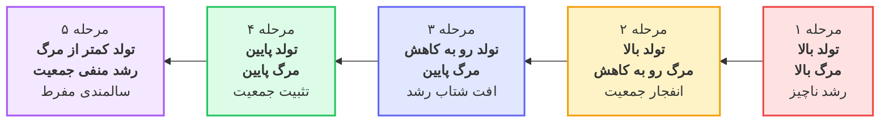
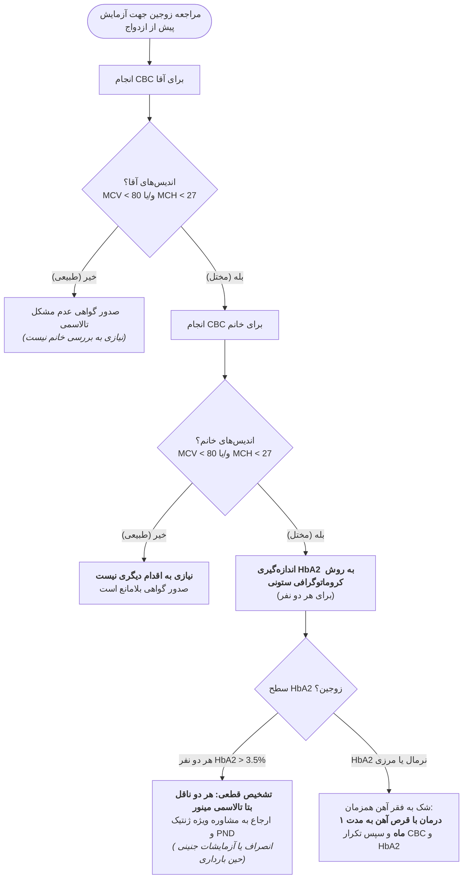
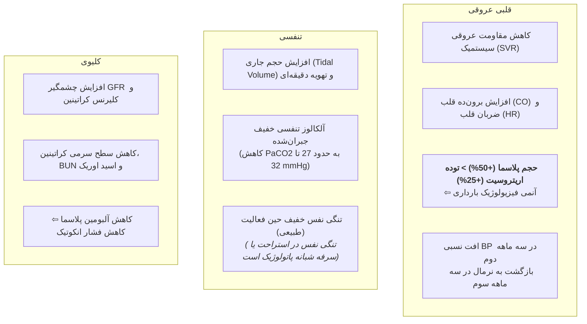
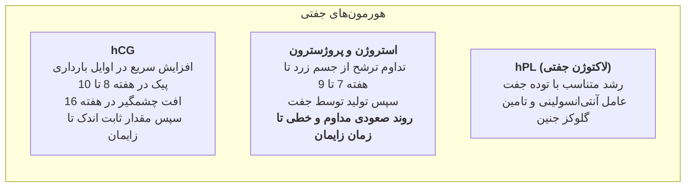
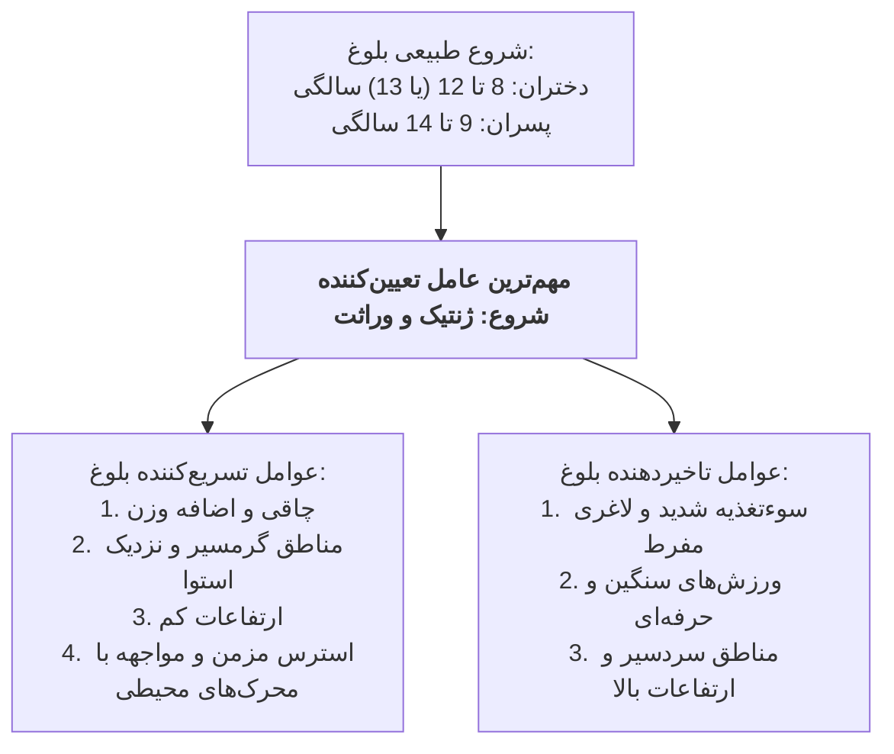

# نکات نمونه سوالات بهداشت خانواده

## ۱. دموگرافی، گذار جمعیتی و شاخص‌های باروری و سلامت

### تعاریف و فرمول‌های کلیدی شاخص‌های جمعیتی

> [!info] شاخص‌های پایه موالید و باروری
> * **میزان موالید خام (CBR):** تعداد کل متولدین زنده در یک سال تقسیم بر جمعیت میان‌سال ضربدر ۱۰۰۰. مخرج آن *کل جمعیت* است نه فقط زنان.
> * **میزان باروری عمومی (GFR):** تعداد متولدین زنده در یک سال تقسیم بر تعداد زنان سنین باروری (۱۵ تا ۴۹ سال) ضربدر ۱۰۰۰.
> * **میزان باروری اختصاصی سنی (ASFR):** تعداد متولدین زنده از مادران یک گروه سنی معین (مثلاً ۲۵ تا ۳۵ سال) تقسیم بر تعداد کل زنان همان گروه سنی ضربدر ۱۰۰۰.
> * **میزان باروری کلی (TFR):** متوسط تعداد فرزندانی که یک زن در طول دوران باروری خود (۱۵ تا ۴۹ سالگی) در صورت تبعیت از الگوی باروری جاری به دنیا می‌آورد؛ **بهترین شاخص جهت برنامه‌ریزی‌های کلان جمعیتی**.
> * **نسبت جنسی در بدو تولد (Sex Ratio at Birth):** تعداد نوزادان پسر به ازای هر ۱۰۰ نوزاد دختر؛ مقدار طبیعی بیولوژیک آن **بیش از ۱** (حدود ۱.۰۵ یا ۱۰۵ پسر به ۱۰۰ دختر) است.
> * **نسبت مرگ مادران (MMR):** تعداد مرگ مادر ناشی از عوارض بارداری و زایمان تا ۴۲ روز پس از ختم بارداری به ازای **۱۰۰,۰۰۰ تولد زنده** (تله تستی: مخرج ۱۰۰,۰۰۰ است، نه ۱,۰۰۰!). علل اصلی: خونریزی، اختلالات فشار خون/پره‌اکلامپسی، و سپسیس.

> [!info] فرمول‌های نسبت وابستگی / تکفل (Dependency Ratio)
> جمعیت مولد/فعال: سنین ۱۵ تا ۶۴ سال ($P_{15-64}$). جمعیت سربار: زیر ۱۵ سال ($P_{<15}$) و بالای ۶۵ سال ($P_{\ge 65}$).
> $$Total\ Dependency\ Ratio = \frac{P_{<15} + P_{\ge 65}}{P_{15-64}}$$
> $$Youth\ Dependency\ Ratio = \frac{P_{<15}}{P_{15-64}}$$
> $$Old-Age\ Dependency\ Ratio = \frac{P_{\ge 65}}{P_{15-64}}$$

> [!tip] نمونه محاسبات تستی پرتکرار نسبت تکفل
> * *تست ۱:* جمعیت ۴ میلیون؛ زیر ۱۵ سال = ۶۰۰,۰۰۰؛ سنین ۱۵ تا ۶۴ سال = ۲,۰۰۰,۰۰۰ ⇦ نسبت سرباری جوانی:
>   $$\frac{600000}{2000000} = 0.30$$
> * *تست ۲:* جمعیت ۱ میلیون؛ زیر ۱۵ سال = ۱۰۰,۰۰۰؛ سنین ۱۵ تا ۶۴ سال = ۶۰۰,۰۰۰ ⇦ سالمندان بالای ۶۵ سال = ۳۰۰,۰۰۰ ⇦ نسبت تکفل کل:
>   $$\frac{100000 + 300000}{600000} = \frac{400000}{600000} \approx 0.65 - 0.66$$

---

### مراحل گذار جمعیتی (Demographic Transition Model)

> [!important] تله‌های تستی مراحل گذار جمعیتی
> 1. **مرحله ۱:** تولد بالا + مرگ بالا (جامعه ماقبل صنعتی).
> 2. **مرحله ۲:** تولد بالا + **مرگ رو به کاهش** (کشورهای در حال توسعه).
> 3. **مرحله ۴:** تولد پایین + مرگ پایین (تعادل پایدار).
> 4. **مرحله ۵:** میزان تولد **کمتر از مرگ**؛ کشور دارای **رشد منفی جمعیت** (بسیاری از کشورهای پیشرفته اروپایی).

---

### وضعیت دموگرافیک ایران، سرشماری‌ها و چالش‌های جمعیتی

* **تغییرات ساختار سنی دهه ۷۰ تا ۹۰:** ناشی از **اعمال بی‌رویه و طولانی‌مدت سیاست‌های تنظیم خانواده**.
* **مقایسه سرشماری ۱۳۸۵ و ۱۳۹۵:**
  * در سرشماری ۱۳۸۵ مقدار TFR حدود ۱.۸ فرزند بود.
  * در سرشماری ۱۳۹۵ مقدار TFR به ۲.۰۱ الی ۲.۱ فرزند رسید (افزایش موقت به دلیل **رسیدن متولدین دهه ۶۰ به سن اوج باروری**، نه حل بحران ساختاری باروری!).
  * پس از ۱۳۹۵: روند TFR مجدداً **کاهشی شدید** به زیر سطح جانشینی ($TFR < 2.1$).
* **پنجره جمعیتی (Demographic Window):** فرصت طلایی که بیش از دو سوم جمعیت در سنین فعالیت اقتصادی هستند؛ این پنجره در ایران رو به بسته شدن است.
* **روند سالمندی جمعیت ایران:** سهم سالمندان بالای ۶۵ سال تا سال ۲۰۲۵ به حدود **۱۰.۵ درصد** می‌رسد و ایران در رده **کشورهای سالخورده / در حال سالمندی** قرار می‌گیرد.
* **تغییرات میانگین سنی:** طی ۵۰ سال گذشته، میانگین سنی جمعیت ایران **۱۰ سال افزایش** یافته است.
* **الگوی باروری سنی و تحصیلات:**
  * زنان بی‌سواد و کم‌سواد: زودتر وارد باروری شده و دیرتر خارج می‌شوند (بیشترین باروری در سنین پایین‌تر).
  * زنان با تحصیلات عالی: باروری به سنین بالاتر شیفت پیدا می‌کند.
  * در کل کشور: تمرکز باروری در محدوده سنی **۲۰ تا ۳۵ سال**.
* **آمار طلاق:**
  * بیشترین موارد طلاق: در **۳ تا ۵ سال اول پس از ازدواج**.
  * طی ۱۰ سال اخیر: روند طلاق **صعودی** و روند ازدواج **نزولی**.
  * کمترین آمار طلاق به ازای ازدواج: در استان‌های با بافت سنتی قوی‌تر (سیستان و بلوچستان، ایلام، چهارمحال و بختیاری).
  * اولویت مداخله برای ارتقای نرخ باروری در بلندمدت: **رفع موانع ازدواج جوانان**؛ مداخله فوری و کوتاه‌مدت: **پیشگیری از سقط‌های القایی غیرقانونی**.

---

### سند ملی پیشگیری و کنترل بیماری‌های غیرواگیر (NCD) ایران

> [!warning] اهداف اختصاصی اضافه شده ایران به اهداف ۹ گانه جهانی WHO (تا سال ۲۰۲۵ / ۱۴۰۴)
> اهداف ۹ گانه سازمان جهانی بهداشت شامل مواردی چون ۲۵% کاهش فشار خون، ۳۰% کاهش مصرف نمک، ۱۰% کاهش بی‌تحرکی و توقف شیوع دیابت/چاقی است.
> ایران **اهداف اختصاصی بومی** زیر را به سند ملی اضافه کرد:
> 1. **کاهش ۲۰ درصدی میزان مرگ‌ومیر ناشی از سوانح و حوادث ترافیکی**.
> 2. **کاهش مرگ‌ومیر ناشی از سوءمصرف مواد مخدر**.
> 3. **افزایش ۲۰ درصدی دسترسی به درمان و مراقبت اختلالات و بیماری‌های روانی**.

---

## ۲. سطوح پیشگیری، سلامت خانواده و مشاوره‌های قبل از ازدواج

### سطوح چهارگانه پیشگیری (کاربرد در بهداشت خانواده)

| سطح پیشگیری | تعریف عملیاتی | مصادیق بارز در آزمون‌های بهداشت خانواده |
| :--- | :--- | :--- |
| **مقدماتی (Primordial)** | مهار ایجاد فاکتورهای خطر زیست‌محیطی، رفتاری و ساختاری در کل جامعه | **آموزش جهت بارداری برنامه‌ریزی‌شده**؛ اجرای طرح **شهر دوستدار سالمند** توسط شهرداری جهت ارتقای تحرک فیزیکی |
| **اولیه (Primary)** | مداخله پیش از بروز بیماری در افراد دارای ریسک‌فاکتور جهت جلوگیری از شروع آن | تجویز **اسید فولیک** قبل بارداری جهت جلوگیری از NTD؛ **قطع مصرف ایزوترتینوئین (آکوتان)** قبل بارداری؛ **واکسیناسیون** روتین |
| **ثانویه (Secondary)** | تشخیص زودهنگام در مرحله بدون علامت و درمان بهنگام جهت جلوگیری از پیشرفت | انجام **غربالگری قند و چربی خون** در سالمندان بالای ۶۰ سال؛ درمان بیمار دیابتی علامت‌دار؛ **معاینات بررسی اختلال رشد دانش‌آموزان در مدارس** |
| **ثالثیه (Tertiary)** | کاهش ناتوانی، جلوگیری از تشدید عوارض پایدار و بازتوانی | تاسیس **مرکز توانبخشی سکته مغزی** برای سالمندان؛ فیزیوتراپی پس از شکستگی استخوان؛ کنترل دقیق قند خون در دیابت پیشرفته جهت تاخیر نفروپاتی |
| **چهارم (Quaternary)** | شناسایی افراد در معرض آسیب اقدامات بیش‌درمانی و جلوگیری از مداخلات غیراخلاقی/پزشکی نابجا | **پرهیز از درخواست آزمایشات غیرضروری** در سالمندان؛ **پیشگیری از پلی‌فارماسی (تجویز غیرضروری داروها)** در دوران سالمندی |

---

### خانواده و مشاوره‌های حین ازدواج

> [!info] تعریف خانواده و کارکردها در مراحل تکاملی
> * **تعریف خانواده از دیدگاه اسلام:** متکی بر **ارتباط خویشاوندی در سایه نکاح شرعی و قانونی**.
> * **بزرگترین سهم تعیین‌کننده‌های سلامت:** **شیوه زندگی (Lifestyle)** با سهم بیش از ۵۰% در بار بیماری‌ها و مرگ‌ومیر، بیشترین قابلیت اصلاح و پیشگیری را دارد.
> * **مراحل تئوری تکامل خانواده:**
>   * *مرحله پیش‌دبستانی:* برجسته‌ترین کارکرد، **جامعه‌پذیری (Socialization)** است.
>   * *آسیب خانواده تک‌والد:* بیشترین اختلال در **جامعه‌پذیری فرزندان (Socialization of children)** رخ می‌دهد.
>   * *بیمار مزمن در خانواده:* منجر به **تغییر نقش افراد (Role changes)** می‌شود؛ حضور فرد مبتلا به HIV سبب برچسب‌خوردگی شدید اجتماعی (Stigmatizing) خانواده می‌گردد.

> [!important] بررسی‌های قانونی و روتین آزمایشات قبل از ازدواج
> 1. غربالگری تالاسمی با **CBC** (اندیس‌های MCV و MCH).
> 2. آزمایش اعتیاد (مرفین ادرار).
> 3. آزمایش **VDRL / RPR برای آقایان** (بررسی سفلیس).
> 4. واکسیناسیون **کزاز برای زوجه (خانم)** در صورت عدم سابقه ایمن‌سازی کامل.
> *نکته تله تستی:* آزمایش هپاتیت B، آزمایش روتین HIV، و آزمایشات ژنتیکی تخصصی جزو غربالگری‌های روتین و اجباری صدور گواهی ازدواج برای **همه افراد** نیستند.

---

### الگوریتم غربالگری تالاسمی مینور در مراجعین حین ازدواج

---

## ۳. مراقبت‌های پیش از بارداری (Preconception Care)

### طبقه‌بندی فاکتورهای خطر در ویزیت پره‌کانسپشن

* **عوامل خطر غیرقابل تغییر (Unchangeable):** سن مادر، قد فرد (مثلاً قد کوتاه < ۱۴۵ سانتی‌متر)، سوابق باروری قبلی (سابقه مرده‌زایی، سقط مکرر، ناهنجاری در فرزند قبلی)، **بیماری ژنتیکی مونوژنیک در فرزند قبلی (نظیر آنمی سیکل‌سل)**.
* **عوامل قابل اصلاح با مداخله به‌موقع (Modifiable with early intervention):** فشار خون مزمن قابل کنترل، **بالا بودن قند خون ناشتا (دیابت یا پره‌دیابت)**، فقر آهن و کم‌خونی، قطع و جایگزینی **داروهای تراتوژن**، عفونت ادراری فعال، مصرف سیگار و الکل.

---

### مدیریت بیماری‌ها و شرایط خاص قبل از بارداری

> [!danger] تله تستی فوق‌العاده مهم: تراتوژنیسیته دیابت کنترل‌نشده
> هیپرگلیسمی در اوایل بارداری (به‌ویژه **هفته‌های ۳ تا ۸ بارداری در دوره ارگانوژنز**) شدیداً **تراتوژن** است و منجر به ناهنجاری‌های قلبی‌عروقی، نقایص لوله عصبی (NTD) و سندروم رگرسیون دمی می‌شود.
> *اگر مادری در هفته ۶ بارداری با HbA1c بسیار بالا مراجعه کند، درمان دقیق بعدی با انسولین از ماکروزومی، پره‌اکلامپسی و دیستوشی شانه پیشگیری می‌کند؛ اما **ناهنجاری‌های ساختاری مادرزادی جنین دیگر قابل پیشگیری نیستند**.*
> *هدف قبل بارداری:* رسیدن به وضعیت کاملاً نورموگلیسمیک با رژیم و انسولین قبل از اقدام به لقاح.

> [!important] پروتکل مصرف اسید فولیک جهت پیشگیری از NTD
> * **دوز معمول برای تمام خانم‌ها:** **۰.۴ تا ۰.۸ میلی‌گرم** (یا ۱ میلی‌گرم) روزانه، از حداقل ۱ تا ۳ ماه قبل از بارداری تا پایان ۳ ماهه اول.
> * **دوز بالا (۴ میلی‌گرم روزانه):**
>   1. سابقه تولد نوزاد قبلی مبتلا به نقایص لوله عصبی (NTD).
>   2. ابتلای خود مادر به NTD.
>   3. خانم‌های تحت درمان با **داروهای ضد تشنج / صرع** (والپروات سدیم، کاربامازپین).
>   4. *توجه:* ابتلای برادر یا خویشاوند درجه دو به NTD خفیف، اندیکاسیون دوز ۴ میلی‌گرم برای مادر نیست و دوز معمول کفایت می‌کند.

> [!warning] پروتکل‌های واکسیناسیون، عفونت‌ها و ایمنی
> * **واکسن سرخجه:** واکسن ویروسی زنده ضعیف‌شده است. در خانم‌های سرولوژی منفی پیش از بارداری تزریق می‌شود.
>   * **حداقل فاصله مجاز واکسیناسیون سرخجه تا بارداری:** طبق پروتکل‌های آزمونی رسمی **۱ ماه** است (گرچه قبلاً ۳ ماه نیز توصیه می‌شد).
>   * *تزریق اشتباه واکسن سرخجه در حین بارداری یا بارداری زیر ۱ ماه:* **اندیکاسیون سقط جنین نیست!** (خطر ناهنجاری گزارش‌نشده است؛ پیگیری آنتی‌بادی انجام می‌شود).
> * **عفونت ادراری در بارداری:** وجود باکتریوری بدون علامت (Asymptomatic Bacteriuria) به دلیل خطر بالای پیشرفت به **پیلونفریت حاد، زایمان زودرس و نوزاد کم‌وزن (LBW)**، **باید حتماً درمان آنتی‌بیوتیکی کامل دریافت کند**.
> * **خانم مبتلا به فنیل‌کتونوری (PKU):** رژیم بدون فنیل‌آلانین پیش از بارداری حیاتی است. جنین بیماری را به ارث نمی‌برد (اتوزوم مغلوب، مگر همسر ناقل باشد)، اما فنیل‌آلانین بالای خون مادر اثر تراتوژنیک شدید داشته و باعث میکروسفالی و عقب‌ماندگی ذهنی جنین می‌شود.
> * **مدیریت مواجهه با HIV:**
>   * آزمایش سریع مثبت ⇦ انجام تست تاییدی سرولوژیک (Western blot/ELISA) ⇦ **شروع فوری درمان آنتی‌رتروویرال (ART)** + **انجام آزمایش HIV برای همسر**.
>   * با درمان کامل و رساندن بار ویروس (Viral load) به صفر/غیرقابل شناسایی، اجازه بارداری و مقاربت محافظت‌نشده در زمان تخمک‌گذاری داده می‌شود.
>   * فرد با رفتار پرخطر و آزمایش منفی ⇦ **تکرار آزمایش پس از ۳ ماه** (دوره پنجره).
> * **کنترااندیکاسیون‌های مطلق بارداری:** ابتلای مادر به **لوپوس فعال با درگیری کلیه/مغز** یا **پرفشاری خون ریوی (Pulmonary HTN)** که بارداری در آن‌ها تهدیدکننده حیات مادر است و انصراف از بارداری توصیه می‌شود.

---

### غربالگری سندروم داون (تریزومی ۲۱) و چالش‌های آن

* **شیوع در جمعیت عمومی:** **۱ مورد در ۱۰۰۰ تولد زنده** (۱ در ۸۰۰ تا ۱۰۰۰).
* **هدف اصلی غربالگری:** شناسایی جنین‌های مبتلا و **فراهم کردن امکان سقط قانونی جنین‌های مبتلا** (غربالگری هیچ درمانی برای جنین یا ارتقایی در سلامت مادر ایجاد نمی‌کند).
* **تفسیر احتمال ریسک (مثال تستی):** اگر ریسک گزارش شده $1/250$ باشد، یعنی به احتمال **۹۹.۶%** جنین سالم است ($1 - 1/250 = 249/250 = 99.6\%$).
* **اشکالات برنامه همگانی غربالگری پیشین در ایران:**
  1. نرخ غربالگری سالانه بیش از ۳ برابر کشورهایی مثل سوئد و کانادا بود.
  2. موارد مثبت کاذب منجر به تست‌های تهاجمی تکمیلی (آمنیوسنتز)، **۵ تا ۸ برابر** کشورهای توسعه‌یافته بود.
  3. سن مادران غربالگری‌شده در ایران حدود **۸ سال کمتر** از استانداردهای بین‌المللی بود.
  4. هزینه تست‌ها عمدتاً بر دوش **خانواده‌ها (Out of pocket)** بود و تحت پوشش کامل بیمه قرار نداشت.

---

## ۴. فیزیولوژی بارداری، زایمان و تغییرات سیستم‌ها

> [!important] تغییرات آناتومیک و فیزیولوژیک اختصاصی
> * **سندرم افت فشارخون طاق‌باز (Supine Hypotensive Syndrome):** در حالت درازکش به پشت در نیمه دوم بارداری، رحم باردار بر **ورید اجوف تحتانی (IVC)** فشار آورده، بازگشت وریدی و برون‌ده قلبی را به شدت کاهش می‌دهد. **پوزیشن بهینه: خوابیدن به پهلوی چپ (Left Lateral)** جهت آزادسازی IVC و بهبود پرفیوژن رحمی‌جفتی.
> * **سوفل قلبی در بارداری:** سوفل سیستولیک ملایم ناشی از افزایش جریان خون طبیعی است؛ اما **هرگونه سوفل دیاستولیک، هموپتیزی، سرفه شبانه، تاکی‌کاردی شدید یا تنگی نفس در استراحت** نشانه بیماری زمینه‌ای قلبی است.
> * **تغییرات رحم و مجاری تناسلی:**
>   * وزن رحم از ۷۰ گرم به حدود ۱۱۰۰ گرم می‌رسد.
>   * جریان خون رحمی از ۵۰ میلی‌‌لیتر در دقیقه به **۵۰۰ تا ۷۵۰ میلی‌لیتر در دقیقه (افزایش بیش از ۱۰ برابر)** می‌‌رسد.
>   * ترشحات واژن افزایش یافته و به علت تولید اسید لاکتیک توسط لاکتوباسیل‌ها **اسیدی‌تر (pH بین ۳.۵ تا ۶)** می‌شود که محافظت‌کننده در برابر عفونت‌هاست.
>   * موکوس اندوسرویکس غلیظ و غنی از ایمونوگلوبولین شده و موکوس‌پلاگ محافظ تشکیل می‌دهد.
> * **سیستم گوارش:** پروژسترون موجب شل شدن عضلات صاف، کاهش تون اسفنکتر تحتانی مری (LES) ⇦ **پیروزیس / سوزش سر دل**، و کاهش حرکات روده ⇦ **تاخیر در تخلیه و یبوست** می‌شود.

---

### تغییرات هورمونی در طول بارداری

> [!tip] خواندن نمودارهای هورمونی و هماتولوژیک آزمون
> * در نمودار غلظت هورمون‌ها: منحنی با **قله سریع در ۲-۳ ماه اول و افت پس از آن** = **hCG**؛ منحنی‌های **افزایشی پیوسته تا پایان بارداری** = **پروژسترون و استروژن**.
> * در نمودار تغییرات هماتولوژیک: بالاترین منحنی درصد تغییرات = **حجم پلاسما (~۵۰%)**؛ منحنی میانی = **حجم کل خون (~۴۰%)**؛ منحنی پایین‌تر = **توده گلبول‌های قرمز (~۲۵%)**.

---

### مراحل زایمان و مانیتورینگ قلب جنین (FHR)

1. **مرحله اول زایمان:** از شروع انقباضات منظم تا اتساع کامل دهانه رحم (۱۰ سانتی‌متر). شامل فاز نهفته و فاز فعال.
2. **مرحله دوم زایمان:** از اتساع کامل سرویکس تا خروج نوزاد.
3. **مرحله سوم زایمان:** از خروج نوزاد تا **خروج جفت و پرده‌ها**. (عدم خروج جفت بیش از **۳۰ دقیقه**، احتباس جفت / Retained Placenta و غیرطبیعی است).
4. **مرحله چهارم زایمان:** ۱ تا ۲ ساعت اول بلافاصله پس از خروج جفت (کنترل هموستاز و خونریزی).

> [!important] فواصل مانیتورینگ سمع قلب جنین (FHR Auscultation)
> * **مادران کم‌خطر:** در مرحله اول هر **۳۰ دقیقه**؛ در مرحله دوم هر **۱۵ دقیقه**.
> * **مادران پرخطر:** در مرحله اول هر **۱۵ دقیقه**؛ در مرحله دوم هر **۵ دقیقه**.

---

## ۵. روش‌های پیشگیری از بارداری (Contraception)

### مقایسه جامع روش‌های پیشگیری

| روش پیشگیری | مکانیسم اصلی اثر | کاربردها، اندیکاسیون و کنترااندیکاسیون | تله‌های تستی |
| :--- | :--- | :--- | :--- |
| **قرص‌های ترکیبی (OCP)** | **مهار تخمک‌گذاری** از طریق سرکوب LH و FSH از هیپوتالاموس-هیپوفیز | کاهش خطر سرطان تخمدان و اندومتر؛ افزایش جزئی خطر کانسر سرویکس با مصرف طولانی | کنترااندیکاسیون در: میگرن با اورا، ترومبوز/سابقه DVT، بیماری حاد کبدی، سن بالای ۳۵ همراه مصرف سیگار |
| **IUD مسی** | ایجاد التهاب استریل، سمیت برای اسپرم/تخمک، **ممانعت از لقاح** | **بهترین روش در مبتلایان به بیماری‌های مزمن کبدی**؛ بدون تداخل دارویی، طولانی‌مدت و غیرهورمونی | اثربخشی آن به خطای مصرف بیمار وابستگی ندارد؛ در بدخیمی شناخته‌شده رحم/خونریزی نامشخص واژینال ممنوع |
| **آمپول‌های پروژسترونی (DMPA)** | مهار تخمک‌گذاری و غلیظ کردن موکوس سرویکس | کاهش خطر کانسر اپی‌تلیال تخمدان و اندومتر؛ تزریق عمیق عضلانی هر ۳ ماه | تاخیر در بازگشت باروری (تا چند ماه پس از قطع)؛ کاهش موقت دانسیته استخوانی |
| **قرص‌های پروژسترونی (POP / Minipill)** | **غلیظ کردن موکوس دهانه رحم** و ایجاد اندومتر نامساعد (مهار تخمک‌گذاری فقط در نیمی از سیکل‌ها) | مناسب در دوران شیردهی (تاثیری بر حجم شیر ندارد) و منع مصرف استروژن | باید هر روز دقیقاً سر ساعت مشخص مصرف شود (خطای مصرف بالا) |
| **اورژانس لوونورژسترول (ECP)** | **تاخیر در تخمک‌گذاری** یا ممانعت از لقاح | حداکثر اثربخشی در صورت مصرف ظرف ۷۲ ساعت اول (تا ۱۲۰ ساعت نیز قابل استفاده است) | مکانیسم آن سقط جنین یا آسیب به نطفه لانه‌گزینی‌شده نیست! در صورت وقوع تخمک‌گذاری اثربخشی ندارد |
| **بستن لوله‌ها (TL)** | ایجاد انسداد فیزیکی دائم فالوپ | خانم دارای فرزند که بارداری برای جان وی خطر جانی دارد (مثلاً بیماری شدید قلبی-ریوی) | **تحت قانون جدید حمایت از خانواده و جوانی جمعیت، نیازمند تصویب کمیسیون پزشکی است** |

---

## ۶. سلامت نوزاد و کودک (Neonatology & Pediatrics)

### نمره آپگار (Apgar Score) نوزاد

> [!info] اجزای نمره آپگار (ارزیابی در دقایق ۱ و ۵ پس از تولد)
> ۱. **تعداد ضربان قلب (Heart Rate):** غایب (۰) | کمتر از ۱۰۰ (۱) | **بیش از ۱۰۰ (۲)**.
> ۲. **تلاش تنفسی (Respiration):** غایب (۰) | ضعیف، نامنظم و گریه ضعیف (۱) | **تنفس خوب و گریه قوی (۲)**.
> ۳. **تون عضلانی (Muscle Tone):** کاملاً شل/Flaccid (۰) | مقداری فلکسیون اندام‌ها (۱) | **حرکت فعال و تون خوب (۲)**.
> ۴. **پاسخ به تحریک/کاتتر (Reflex Irritability):** بدون پاسخ (۰) | شکلک زدن/Grimace (۱) | **سرفه، عطسه یا گریه شدید (۲)**.
> ۵. **رنگ پوست (Color):** کاملاً آبی یا رنگ‌پریده (۰) | تنه صورتی با اندام‌های سیانوتیک/آکروسیانوز (۱) | **کاملاً صورتی (۲)**.

> [!tip] حل سناریوهای تستی آپگار
> * **سناریوی ۱:** ضربان ۱۱۰ (۲) + تنفس نامنظم با گریه ضعیف (۱) + تون کاملاً شل (۰) + تنه صورتی و اندام کبود (۱) = **نمره ۴** (نیاز به احیای فوری).
> * **سناریوی ۲:** ضربان ۱۱۰ (۲) + تنفس نامنظم با گریه ضعیف در تحریک (۱) + تونسیته عضلانی خوب (۲) + گریه و پاسخ رفلاکسی به تحریک (۱) + بدن صورتی و انتهای سیانوتیک (۱) = **نمره ۷** (نرمال).
> * **حد بحرانی و غیرطبیعی:** نمره آپگار **کمتر از ۷** غیرطبیعی محسوب می‌شود (۰ تا ۳ افسردگی شدید؛ ۴ تا ۶ متوسط؛ ۷ تا ۱۰ نرمال).

---

### آنتروپومتری و رده‌بندی وزن تولد

* **دور سر نرمال نوزاد ترم:** **۳۲ تا ۳۷ سانتی‌متر**.
* **سیر وزن‌گیری نوزاد:** در ۵ ماهگی **۲ برابر** وزن تولد؛ در **۱ سالگی ۳ برابر** وزن تولد.
* **رده‌بندی‌های وزنی:**
  * **وزن کم هنگام تولد (LBW):** وزن تولد **کمتر از ۲۵۰۰ گرم**.
  * **وزن خیلی کم هنگام تولد (VLBW):** وزن تولد **کمتر از ۱۵۰۰ گرم**.
  * **وزن بی‌نهایت کم (ELBW):** وزن تولد **کمتر از ۱۰۰۰ گرم**.
  * **بزرگ برای سن حاملگی (LGA):** وزن هنگام تولد **بیش از ۴۰۰۰ گرم** (یا بالای صدک ۹۰).
* **علل عمده کم‌وزنی (LBW):**
  * در کشورهای در حال توسعه: **عفونت‌ها و سوءتغذیه مادر (محدودیت رشد داخل رحمی / IUGR)**.
  * در کشورهای توسعه‌یافته: **نارس بودن نوزاد (Prematurity)**.

---

### تغذیه نوزاد و مقایسه شیر مادر و شیر گاو

> [!important] تفاوت‌های بیوشیمیایی شیر مادر در مقایسه با شیر گاو
> * **پروتئین کل و کازئین:** در شیر مادر **کمتر** از شیر گاو است (هضم راحت‌تر، بار کلیوی کمتر).
> * **پروتئین وی (Whey):** در شیر مادر **بیشتر** از شیر گاو است. (نسبت Whey به Casein در شیر مادر **۶۰:۴۰ تا ۸۰:۲۰**؛ در شیر گاو **۲۰:۸۰** و کازئین غالب است).
> * **لاکتوز:** در شیر مادر **بیشتر** است (تامین انرژی و بهبود رشد باکتری‌های اسیدوفیل روده).
> * **املاح و مواد معدنی (سدیم، کلسیم، آهن):** در شیر مادر به طور مطلق **کمتر** است، اما **فراهمی زیستی (Bioavailability) بسیار بالاتری** دارد (مثلاً جذب آهن شیر مادر ۵۰% در مقابل ۱۰% شیر گاو).
> * **فنیل‌آلانین:** در شیر مادر **کمتر** از شیر گاو است.

* **تغذیه انحصاری با شیر مادر (Exclusive Breastfeeding):** تا پایان **۶ ماهگی** توصیه می‌شود.
* **بهترین و دقیق‌ترین شاخص کفایت شیر مادر:** **روند وزن‌گیری مطلوب نوزاد** (نه خوابیدن، مدفوع یا بی‌قراری).

---

### یرقان، بیماری‌ها و غربالگری‌های نوزادی

> [!danger] معیارهای یرقان پاتولوژیک نوزادی
> ۱. بروز زردی در **۲۴ ساعت اول زندگی** (همواره پاتولوژیک است).
> ۲. افزایش بیلی‌روبین به میزان **بیش از ۵ میلی‌گرم در دسی‌لیتر در ۲۴ ساعت**.
> ۳. افزایش بیلی‌روبین توتال بیش از ۱۲ تا ۱۳ mg/dl در نوزاد ترم یا بیش از ۱۴ mg/dl در نوزاد نارس.
> ۴. تداوم زردی بالینی **بیش از ۱ هفته در نوزاد ترم** یا **بیش از ۲ هفته در نوزاد نارس**.
> ۵. بالا رفتن بیلی‌روبین مستقیم (کونژوگه) به بیش از ۲ mg/dl.

* **آزمایشات غربالگری کشوری در روز ۳ تا ۵ تولد:**
  1. **کم‌کاری مادرزادی تیروئید (Congenital Hypothyroidism)**.
  2. **فنیل‌کتونوری (PKU)**.
  3. **کمبود آنزیم G6PD (فاویسم)**.
  * *ناموجود در غربالگری روتین نوزادی ایران:* تیروزینمی (Tyrosinemia)، گالاکتوزمی (Galactosemia)، کمبود ۵-آلفا ردوکتاز.
* **کمبود آنزیم G6PD و ممنوعیت‌ها:** مواجهه با باقلا، عفونت‌ها، و داروهایی شامل **متوکلوپرامید**، سولفونامیدها، نیتروفورانتوئین، داپسون، پریماکین و اسید نالیدیکسیک ممنوع است.
* **اختلال رشد (FTT):** شایع‌ترین علت آن **دلایل غیرارگانیک (اگزوژن)** نظیر فقر، ناآگاهی، شیردهی نادرست و مسائل عاطفی است (> ۸۰%).
  * در پایش رشد: منحنی‌های استاندارد شامل **صدک ۳ و ۹۷** هستند.
  * برنامه مراقبت‌های ادغام‌یافته ناخوشی‌های اطفال (IMCI): گروه هدف از **بدو تولد تا ۵ سالگی** است.
* **فتق اینگوئینال نوزادان:** در نوزادان نارس و پسرها شایع‌تر است؛ در ۶ ماه اول تظاهر می‌یابد؛ به صورت **الکتیو (غیر اورژانس)** جراحی می‌شود مگر اینکه گیر افتاده (Incarcerated) یا ترومبوزه شود.

---

### جدول مراقبت‌ها و واکسیناسیون بدو تولد

| مداخله | زمان تجویز | جزئیات و نکات طلایی امتحانی |
| :--- | :--- | :--- |
| **ویتامین K** | بدو تولد | ۱ میلی‌گرم تزریق عضلانی (IM) جهت پیشگیری از بیماری هموراژیک نوزاد |
| **واکسن‌های بدو تولد** | بدو تولد | **ب.ث.ژ (BCG) + هپاتیت ب (Hep B) + قطره فلج اطفال خوراکی (OPV)** *(پنج‌گانه در بدو تولد وجود ندارد)* |
| **واکسن هپاتیت ب در نوزاد < ۲۰۰۰ گرم** | بدو تولد | دوز بدو تولد شمرده نمی‌شود و **نیاز به یک دوز اضافه در ۱ ماهگی** دارد (۴ دوز: ۰، ۱، ۲ و ۶ ماهگی) |
| **قطره مولتی‌ویتامین یا ویتامین A+D** | روز ۱۵ زندگی | ۴۰۰ واحد بین‌المللی روزانه ویتامین D تا پایان ۲ سالگی |
| **قطره آهن** | ۴ یا ۶ ماهگی | در نوزادان ترم از ۴ ماهگی (یا همزمان با غذای کمکی در ۶ ماهگی)؛ در نوزادان LBW/نارس از زمان دو برابر شدن وزن تولد یا ۱ ماهگی |

---

## ۷. سلامت نوجوانان، بلوغ و مدارس

### فیزیولوژی و زمان‌بندی بلوغ

> [!danger] علائم هشدار نیازمند ارجاع فوری در فرایند بلوغ
> ۱. عدم ظهور صفات ثانویه جنسی تا **۱۳ سالگی در دختران** یا **۱۴ سالگی در پسران**.
> ۲. عدم شروع قاعدگی (منارک) تا **سن ۱۵ سالگی** (آمنوره اولیه).
> ۳. عدم رخداد منارک تا **۳ سال پس از تلارک (شروع رشد جوانه‌های پستان)**.
> ۴. توقف رشد قدی به دلیل بسته شدن اپی‌فیز استخوان‌های دراز تحت تاثیر **استروژن** رخ می‌دهد. پسرها به دلیل ۲ سال شروع دیرتر بلوغ، میانگین قد نهایی بالاتری دارند.

> [!warning] عوارض سوءمصرف استروئیدهای آنابولیک در پسران
> ۱. **ژنیکوماستی (رشد بافت پستان):** ناشی از تبدیل استروئیدها به **استروژن** توسط آنزیم آروماتاز محیطی.
> ۲. **کوتاهی قد نهایی:** بسته شدن زودرس صفحات رشد استخوانی (اپی‌فیز).
> ۳. اختلالات عملکرد کبد، آتروفی بیضه‌ها و ناباروری.

---

### روانشناسی نوجوان و مدل اکولوژیک سلامت

* **هرم نیازهای مازلو در نوجوانی:** هدایت نوجوان باید به گونه‌ای باشد که در سطوح اولیه (نیازهای فیزیولوژیک قاعده هرم) متوقف نماند و برای رسیدن به قله هرم یعنی **خودشکوفایی (Self-actualization)** هدایت گردد.
* **ابعاد مثبت شخصیتی نوجوان (5Cs of Positive Youth Development):**
  * **شخصیت (Character):** احترام به استانداردهای درست رفتاری جامعه و وجدان اخلاقی؛ تقویت با ایجاد فرصت‌های **خودکنترلی**.
  * **مراقبت و همدردی (Caring / Empathy):** با **مراقبت از افراد کوچک‌تر** ارتقا می‌یابد.
  * **شایستگی (Competence):** با یادگیری مهارت‌های عملی.
  * **اعتمادبه‌نفس (Confidence)** و **ارتباط (Connection)**.
* **اختلال بدریخت‌انگاری بدن (Body Dysmorphic Disorder):** در نوجوانی که علی‌رغم ظاهر طبیعی، مرتباً ساعت‌ها خود را در آینه چک کرده و نگران و ناراضی از ظاهر خود است.
* **مدل اکولوژیک عوامل موثر بر سلامت نوجوانان:**
  * *لایه فردی:* سن، جنسیت، ژنتیک، تحصیلات فرد (تبعیض جنسیتی جزو فردی نیست!).
  * *لایه جامعه (Community):* ارتقای همبستگی اجتماعی (Social cohesion)، امنیت محله.
  * *لایه ماکرو (Macro):* سیاست‌های کلان، جنگ، نابرابری درآمدی، تبعیض‌های ساختاری.
* **بهداشت مدارس:**
  * *تهدیدات بیولوژیک:* بیماری‌های منتقله از ناقلین و حشرات، غذای فاسد و آلوده، فضولات.
  * *تهدیدات فیزیکی:* تهویه نامناسب کلاس‌ها، نور ناکافی، گرمای شدید یا سرمای بیش از حد، سر و صدای محیطی.
  * *تهدیدات شیمیایی:* آفت‌کش‌ها، مواد شوینده و پاک‌کننده، گازهای متصاعد شده.
  * *فعالیت بدنی توصیه‌شده برای کودکان و نوجوانان:* حداقل **۶۰ دقیقه در روز** (معادل ۴۲۰ دقیقه در هفته) فعالیت با شدت متوسط تا شدید.
  * *آموزش همسالان (Peer Education) در مدارس مروج سلامت:* بیشترین کاربرد را در **خدمات سلامت روان** و رفتارهای پیشگیرانه دارد. هدف نهایی آموزش سلامت: **تغییر رفتار و بهبود عملکرد (Practice)**.

---

## ۸. سلامت جوانان، میانسالان و مردان

### سلامت جوانان

* **سوانح و حوادث ترافیکی:** اصلی‌ترین عامل آسیب و مرگ زودرس در جوانان بوده که باعث **افت شدید شاخص سال‌های از دست رفته عمر (DALY)** می‌شود.
  * *نکته امتحانی کلیدی:* سوانح ترافیکی در جوانان بالاترین عامل مرگ است، اما **در کل جامعه بالاترین بار بیماری (Disease Burden) به سرطان‌ها و بیماری‌های قلبی‌عروقی اختصاص دارد**.
* **مصرف دخانیات:** طبق تعریف WHO، فرد سیگاری کسی است که در طول عمر خود **حداقل ۱۰۰ نخ سیگار** کشیده باشد و در حال حاضر نیز سیگار بکشد. اگر فرد تا **سن ۲۰ سالگی** شروع به مصرف دخانیات نکند، احتمال شروع آن در بزرگسالی بسیار پایین است.

---

### سلامت میانسالان و معیارهای تن‌سنجی

> [!info] استانداردهای سلامت میانسالی در ایران
> * **بازه سنی میانسالی:** بر اساس آخرین دسته‌بندی کشوری **۵۰ تا ۶۵ سال** است (در دسته‌بندی پیشین ۳۰ تا ۵۹ سال قید شده بود).
> * **دور کمر (Waist Circumference) در دستورالعمل ملی:** دور کمر **کمتر از ۹۰ سانتی‌متر** در هر دو جنس زن و مرد طبیعی است (در استانداردهای بین‌المللی دور کمر بالای ۱۰۲ در مردان و بالای ۸۸ در زنان غیرطبیعی است).
> * **میزان کاهش وزن مجاز در چاقی:** **۲ تا ۴ کیلوگرم در ماه** (نیم تا یک کیلو در هفته).
> * **فعالیت بدنی بالغان:** حداقل **۱۵۰ دقیقه در هفته با شدت متوسط** یا ۷۵ دقیقه با شدت زیاد.
> * **هرم غذایی میانسالان:** سبزیجات **۳ تا ۵ واحد در روز**؛ میوه‌ها **۲ تا ۴ واحد در روز**.
> * **واکسن روتین دوره‌ای در بالغان/میانسالان:** واکسن **دوگانه بزرگسالان (کزاز-دیفتری / Td) هر ۱۰ سال یک‌بار**.

---

### سلامت مردان و تفاوت‌های جنسیتی

* **امید به زندگی در بدو تولد (Life Expectancy):**
  * در سراسر جهان **امید به زندگی زنان بیشتر از مردان است** (آمار جهانی ۲۰۲۳: زنان ۷۶ سال و مردان ۷۰.۸ سال).
  * روند امید به زندگی مردان در ایران (۱۹۶۰ تا ۲۰۲۰): **صعودی با افت‌های موقت در برخی سال‌ها** (مانند دوران جنگ تحمیلی).
* **میزان مراجعه به خدمات سلامت:** مردان سنین ۲۰ تا ۴۴ سال به مراتب **کمتر از زنان** به مراکز بهداشتی درمانی مراجعه می‌کنند.
* **سرطان‌ها در مردان:**
  * شایع‌ترین سرطان در مردان در تهران: **سرطان پروستات**.
  * روند کلی بروز و مرگ ناشی از سرطان پروستات با انجام PSA: نزولی-نزولی.
  * شیوع سرطان پوست در جهان به ترتیب: **استرالیا > سوئیس > آلمان > فنلاند**.
* **مرگ‌های شغلی:**
  * تعداد کل مرگ ناشی از **بیماری‌های شغلی بیش از مرگ ناشی از حوادث شغلی** است.
  * بیشترین مرگ ناشی از حوادث در مردان: **کارگران ساختمانی**.
  * ناباروری موقت ناشی از شغل در مردان: **کارگران کوره ذوب فلزات** (به دلیل گرمای شدید موضعی بیضه‌ها).

---

## ۹. سلامت سالمندان و مراقبت‌های ادغام‌یافته

### تغییرات فیزیولوژیک سالمندی

1. **سیستم ادراری:** جایگزینی بافت عضلانی دتروسور با **بافت همبند فیبروزه** ⇦ کاهش ظرفیت مثانه و بی‌اختیاری.
2. **سیستم اسکلتی و چربی:** انتقال بافت چربی از اندام‌ها به **سمت تنه (مرکزی شدن چربی)**؛ کاهش توده عضلانی (سارکوپنی).
3. **سیستم ایمنی:** کاهش پاسخ تحریکی سیستم ایمنی، افزایش شیوع عفونت‌ها با تظاهرات غیرتیپیک.
4. **تظاهرات بالینی بیماری‌ها:** **مبهم، آتیپیک و بی‌سر و صدا** (مانند انفارکتوس میوکارد بدون درد قفسه سینه یا عفونت شدید بدون تب بالا).

---

### بیماری‌ها و چالش‌های شایع سالمندی

* **شایع‌ترین علت بی‌تحرکی و محدودیت عملکردی:** **سقوط (Falls)** و عوارض ناشی از شکستگی‌ها.
* **استئوآرتریت (آرتروز):** شایع‌ترین بیماری مفصلی سالمندان؛ شیوع در سنین بالای ۸۰ سال بسیار بیشتر از ۶۵ سال است.
  * درگیری زانو و مفاصل دست در **زنان** شایع‌تر است.
  * *تله تستی:* **جنس مذکر عامل خطر کم‌اهمیت‌تری** برای استئوآرتریت محسوب می‌شود (زنان بسیار بیشتر مبتلا می‌شوند).
* **اختلالات روانپزشکی:** **دمانس (آلزایمر)** و افسردگی شیوع بسیار بالایی دارند (دمانس در زنان به علت طول عمر بالاتر شیوع تشخیصی بیشتری دارد).
* **سالمندآزاری (Elder Abuse):** شایع‌ترین فرم آن در جامعه و مراکز درمانی، **سالمندآزاری روانی (Psychological Abuse)** و سپس غفلت/سوءاستفاده مالی است.
* **پیشگیری از پوکی استخوان در سالمندی:** پیاده‌روی منظم، قطع سیگار، عدم مصرف نوشابه‌های گازدار، دریافت نور آفتاب، و مصرف **لبنیات کم‌چرب** (مصرف لبنیات پرچرب به دلیل خطرات قلبی عروقی توصیه نمی‌شود).

---

## ۱۰. جدول نهایی تطبیقی مرور سریع تله‌های آزمونی

| عنوان موضوعی | اشتباه رایج و تله تستی طراحان | نکته صحیح و کلید قطعی امتحان |
| :--- | :--- | :--- |
| **فاصله واکسن سرخجه تا بارداری** | تصور اینکه فاصله ۳ ماه است یا تزریق اشتباه اندیکاسیون سقط دارد | **حداقل فاصله مجاز ۱ ماه است**؛ تزریق اتفاقی حین بارداری **اندیکاسیون سقط ندارد**. |
| **HIV مثبت قبل از بارداری** | صدور ممنوعیت دائم بارداری یا سقط در صورت بارداری | با شروع **درمان ضد ویروسی (ART)** و غیرقابل شناسایی شدن بار ویروس، بارداری بلامانع است. همسر نیز باید بررسی شود. |
| **غربالگری تالاسمی ازدواج** | انجام الکتروفورز HbA2 در مرحله اول یا انجام آزمایش ژنتیک | ابتدا فقط **CBC آقا** بررسی می‌شود؛ اگر آقا مختل بود CBC خانم چک می‌شود؛ **فقط در صورت اختلال هر دو**، اندازه‌گیری HbA2 انجام می‌گیرد. |
| **تغییرات قلبی عروقی بارداری** | افزایش فشار خون به عنوان تطابق نرمال بارداری | **افزایش فشار خون غیرطبیعی است!** فشار خون در بارداری طبیعی ثابت است یا در سه ماهه دوم **کاهش** می‌یابد. |
| **مکانیسم قرص اورژانس** | سقط یا از بین بردن تخم لقاح‌یافته | مکانیسم اصلی **تاخیر در فرایند تخمک‌گذاری** یا ممانعت از لقاح است. |
| **غربالگری روز ۳ تا ۵ نوزادی** | گنجاندن بیماری‌های تیروزینمی یا گالاکتوزمی در برنامه کشوری | تنها شامل ۳ بیماری است: **کم‌کاری تیروئید، PKU و کمبود آنزیم G6PD**. |
| **واکسیناسیون نوزاد < ۲۰۰۰g** | عدم نیاز به واکسن در بدو تولد یا زدن ۵ گانه | هپاتیت ب بدو تولد تزریق می‌شود اما جزو دوزهای سه‌گانه حساب نشده و **نیاز به دوز اضافه در ۱ ماهگی دارد**. |
| **شیر مادر در مقایسه با شیر گاو** | بیشتر بودن کازئین یا املاح در شیر مادر | **کازئین و املاح شیر مادر کمتر** از شیر گاو است، ولی **پروتئین وی (Whey) و لاکتوز شیر مادر بیشتر** است. |
| **علت FTT در کودکان** | بیماری‌های ارگانیک گوارشی مادرزادی | **بیش از ۸۰% علل اگزوژن و غیرارگانیک** (محیطی، فقر، تکنیک نادرست تغذیه) هستند. |
| **بار بیماری‌ها در جوانان** | سوانح جاده‌ای بالاترین بار بیماری در کل جامعه است | سوانح جاده‌ای اصلی‌ترین عامل مرگ **در جوانان** است؛ اما بالاترین بار بیماری در **کل جوامع به سرطان‌ها** اختصاص دارد. |
| **پیشگیری سطح چهارم** | بازتوانی پس از سکته مغزی یا غربالگری بیماری | پیشگیری از آسیب ناشی از اقدامات پزشکی، مانند **پرهیز از درخواست آزمایشات و تجویز داروهای غیرضروری در سالمندان**. |
