# خلاصه کل تکنولوژی و اطلاع‌رسانی

## بخش ۱: سواد دیجیتال، برندینگ علمی و حقوق مالکیت فکری

### ۱. آینده‌پژوهی آموزش عالی و تحلیل زیست‌بوم نسل‌ها

زیست‌بوم دانشجویی در ۶ حوزه حیاتی: **زندگی کردن (Living)**، **یادگیری (Learning)**، **کار کردن (Working)**، **بازی کردن (Playing)**، **مشارکت مدنی (Participating)** و **ارتباطات (Connecting)**.

> [!abstract] گذار بنیادین آینده‌پژوهی افق ۲۰۲۵
> چرخش **توازن قدرت (Balance of Power)** از ساختارهای صلب دانشگاهی به سوی **دانشجویان و یادگیرندگان**؛ ادغام و محو کامل مرزهای میان آموزش، کار، بازی و زیست فردی.


> [!warning] تله تستی کلیدی: سناریوی خط پایه (Baseline) در برابر جایگزین پسا کووید (Alternative)
> پاندمی **کووید-۱۹** محرک گسست قطعی به سناریوی جایگزین بود. تمایز ۶ بعد کلیدی در آزمون الزامی است:
> 1. **آموزش (Learning)**: از *نهادهای تحت فشار (Institutions Under Pressure)* ⇦ به **دانشجو محور (Student-Centric)**.
> 2. **بازی و فراغت (Playing)**: *بازی زمان‌بندی‌شده (Scheduled Play)* ⇦ به **همه‌چیز بازی است (All Play)** مبتنی بر بازی‌وارسازی (گیمیفیکیشن).
> 3. **کار و اشتغال (Working)**: از *میانه آشفته و کرنش طبقه متوسط (Messy Middle)* ⇦ به **ورود به بازار کار فوق‌رقابتی جنگل (Welcome to the Jungle)** ناشی از سرعت هوش مصنوعی.
> 4. **سبک زندگی (Living)**: از *آسان بودن خوب است (Easy Is Good)* ⇦ به **اقتصاد اشتراکی ما (The Ours Economy)**.
> 5. **مشارکت مدنی (Participating)**: از *ملت هکرها (Hacker Nation)* ⇦ به **ملت‌سازی بر بستر کلان‌داده (NationCraft via Big Data)**.
> 6. **ارتباطات (Connecting)**: از *مسیرهای افزون‌تر ارتباطی (More Ways to Connect)* ⇦ به **گذار از اتصال به غوطه‌وری کامل مجازی (From Connection to Immersion)**.

| مشخصه نسل                                 | بازه تولد    | بستر و ابزار ارتباطی غالب                 | خصیصه هویتی و روانی                                    | سطح سواد فناوری                         |
| :---------------------------------------- | :----------- | :---------------------------------------- | :----------------------------------------------------- | :-------------------------------------- |
| **سنتی / خاموش (Maturists)**              | 1925 تا 1945 | اتومبیل، نامه‌نگاری رسمی مکتوب            | انضباط‌پذیر، وفادار به ساختار، کارمحور                 | مهاجر دیجیتال (Digital Immigrant)       |
| **بیبی‌بومرها (Baby Boomers)**            | 1945 تا 1965 | تلویزیون، ارتباطات تلفن ثابت سنتی         | خوش‌بین، اهل منتورینگ، متعهد به کار                    | مهاجر دیجیتال                           |
| **نسل اکس (Gen X)**                       | 1965 تا 1980 | رایانه شخصی (PC)، ظهور ایمیل              | عمل‌گرا، مستقل، انعطاف‌پذیر و فردگرا                   | مهاجر دیجیتال                           |
| **نسل وای / هزاره (Millennials / Gen Y)** | 1980 تا 1995 | تلفن همراه، پیامک، وب شبکه‌ای             | **دارای اعتماد به نفس بالا (Confident)**، کار تیمی     | بومی دیجیتال انتقالی                    |
| **نسل زد (Gen Z)**                        | 1995 تا 2010 | گوشی هوشمند، رسانه‌های تعاملی، هوش مصنوعی | **رقابت‌جو (Competitive)**، بصری، بازه توجه کوتاه      | **بومی دیجیتال واقعی (Digital Native)** |
| **نسل آلفا (Gen Alpha)**                  | 2010 به بعد  | ادغام سایبر-فیزیکی، پسا کووید             | **تصمیم‌گیرنده مستقل (Decision-Maker)**، حساس به اخلاق | فرابومی دیجیتال مادرزاد                 |


> [!important] شواهد پژوهشی پیرامون نقایص مهارتی و نگرش امنیتی نسل زد
> 1. **توهم تسلط دیجیتال**: تسلط بر شبکه‌های اجتماعی معادل مهارت آکادمیک نیست؛ نسل زد در نرم‌افزارهای پایه‌ای آفیس (*PowerPoint* و *Excel*) و تفکر تحلیلی ضعف شدید دارند.
> 2. **پژوهش ژاپن و مطالعه سایمون**: علیرغم تجهیز ۱۰۰% ورودی‌های دانشگاه به ابزارهای هوشمند، مهارت تخصصی و پژوهشی آنان در بدو ورود بسیار نازل است؛ آموزش دانشگاهی سامان‌مند اجتناب‌ناپذیر است.
> 3. **بی‌توجهی امنیتی (Alliance Cybersecurity)**: نسل زد با **64%** کمترین توافق را با اولویت‌بندی امنیت آنلاین دارد (۲۷% ممتنع، ۹% مخالف)؛ در حالی که نسل خاموش با **87%** و بومرها با **85%** بالاترین پایبندی امنیتی را دارند.

---

### ۲. سطوح شناختی، فریم‌ورک Jisc و فرهنگ مشارکت آنلاین

> [!abstract] تعاریف مرزی سواد، روانی و شهروندی دیجیتال
> - **سواد دیجیتال (Digital Literacy)**: امتزاج مهارت‌های فنی (Technical) و شناختی (Cognitive) برای **یافتن**، **ارزیابی نقادانه**، **سنجش و تولید ایمن اطلاعات و محتوی جدید**.
> - **روانی دیجیتال (Digital Fluency)**: مرتبه متعالی به‌کارگیری ابزارها جهت **حل خلاقانه مسائل پیچیده** و تصمیم‌گیری در سناریوهای نامشخص.
> - **شهروند دیجیتال (Digital Citizen)**: کنشگری مسئولانه، قانون‌مند و اخلاقی در وب با مدیریت تعارضات بین‌فردی بر پایه **اصول اخلاقی فضای مجازی**.
> - **ردپای دیجیتال (Digital Footprint)**: تمامی آثار و لاگ‌های کاربر بر سرورها؛ اصل: **اینترنت ابدی است (The Internet is Forever)**.

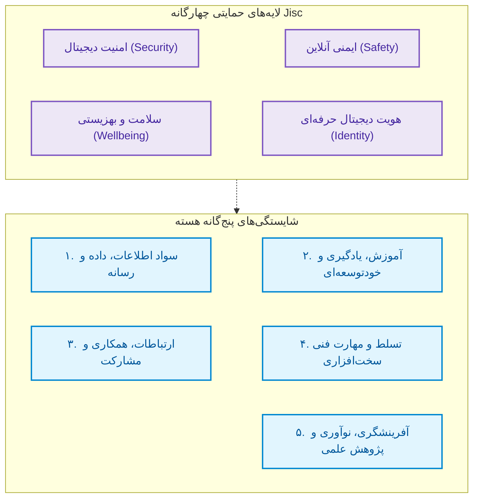
```mermaid
flowchart TD
    classDef core fill:#e1f5fe,stroke:#0288d1,stroke-width:2px,color:#01579b;
    classDef umb fill:#ede7f6,stroke:#7e57c2,stroke-width:2px,color:#4527a0;

    subgraph Layers ["لایه‌های حمایتی چهارگانه Jisc"]
        U1["امنیت دیجیتال (Security)"]:::umb
        ~~~
        U2["ایمنی آنلاین (Safety)"]:::umb
        U3["سلامت و بهزیستی (Wellbeing)"]:::umb
        ~~~
        U4["هویت دیجیتال حرفه‌ای (Identity)"]:::umb
    end

    subgraph Cores ["شایستگی‌های پنج‌گانه هسته"]
        C1["۱. سواد اطلاعات، داده و رسانه"]:::core
        ~~~
        C2["۲. آموزش، یادگیری و خودتوسعه‌ای"]:::core
        C3["۳. ارتباطات، همکاری و مشارکت"]:::core
        ~~~
        C4["۴. تسلط و مهارت فنی سخت‌افزاری"]:::core
        C5["۵. آفرینشگری، نوآوری و پژوهش علمی"]:::core
    end

    Layers -.-> Cores
```

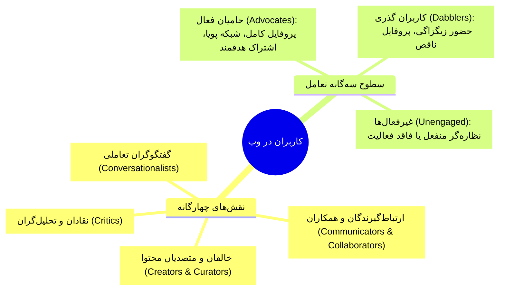
```mermaid
mindmap
  root((کاربران در وب))
    نقش‌های چهارگانه
      ["خالقان و متصدیان محتوا (Creators & Curators)"]
      ["ارتباط‌گیرندگان و همکاران (Communicators & Collaborators)"]
      ["گفتگوگران تعاملی (Conversationalists)"]
      ["نقادان و تحلیل‌گران (Critics)"]
    سطوح سه‌گانه تعامل
      ["حامیان فعال (Advocates): پروفایل کامل، شبکه پویا، اشتراک هدفمند"]
      ["کاربران گذری (Dabblers): حضور زیگزاگی، پروفایل ناقص"]
      ["غیرفعال‌ها (Unengaged): نظاره‌گر منفعل یا فاقد فعالیت"]
```

> [!abstract] کار با صدای بلند (Work Out Loud - WOL)
> متدولوژی عمومی‌سازی فرایند خلق، یادگیری و تجارب پژوهشی با ۵ رکن:
> **۱. پیوندهای انسانی هدفمند (Relationships)**،
> **۲. سخاوتمندی علمی بدون چشم‌داشت (Generosity)**،
> **۳. آشکارسازی فرایند کار با نشر پیش‌نویس‌ها (Visible Work)**،
> **۴. تمرکز بر فیلد تخصصی (Purposeful Discovery)**،
> **۵. ذهنیت رشد در پذیرش نقدها (Growth Mindset)**.

---

### ۳. بهینه‌سازی لینکدین در برابر شناسه ارکید (ORCID)

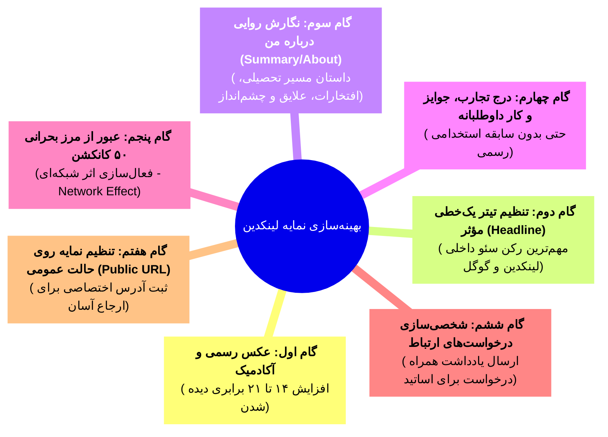
```mermaid
mindmap
  root((بهینه‌سازی نمایه لینکدین))
    ["<b>گام اول: عکس رسمی و آکادمیک</b><br>(افزایش ۱۴ تا ۲۱ برابری دیده شدن)"]
    ["<b>گام دوم: تنظیم تیتر یک‌خطی مؤثر (Headline)</b><br>(مهم‌ترین رکن سئو داخلی لینکدین و گوگل)"]
    ["<b>گام سوم: نگارش روایی درباره من (Summary/About)</b><br>(داستان مسیر تحصیلی، افتخارات، علایق و چشم‌انداز)"]
    ["<b>گام چهارم: درج تجارب، جوایز و کار داوطلبانه</b><br>(حتی بدون سابقه استخدامی رسمی)"]
    ["<b>گام پنجم: عبور از مرز بحرانی ۵۰ کانکشن</b><br>(فعال‌سازی اثر شبکه‌ای - Network Effect)"]
    ["<b>گام ششم: شخصی‌سازی درخواست‌های ارتباط</b><br>(ارسال یادداشت همراه درخواست برای اساتید)"]
    ["<b>گام هفتم: تنظیم نمایه روی حالت عمومی (Public URL)</b><br>(ثبت آدرس اختصاصی برای ارجاع آسان)"]
```

> [!warning] تله تستی کلیدی: حالات دوگانه نشان Open to Work
> 1. **عمومی (All LinkedIn Members)**: درج هلال سبز با عبارت `#OpenToWork` دور تصویر پروفایل، آشکار برای همه اعضا.
> 2. **مخصوص استخدام‌کنندگان (Recruiters Only)**: بدون نشان سبز؛ صرفاً برای دارندگان اکانت تجاری کاریابی جهت ممانعت از تعارض منافع شغلی.

| شاخص مقایسه‌ای | شبکه حرفه‌ای لینکدین (LinkedIn) | سامانه رجیستری ارکید (ORCID) |
| :--- | :--- | :--- |
| **هویت ساختاری** | شبکه اجتماعی تجاری و پایگاه فرصت‌یابی شغلی | **شناسه یکتای ۱۶ رقمی دیجیتال غیرانتفاعی** |
| **تعامل اجتماعی** | پیام مستقیم، درج نظر، لایک، تشکیل کارگروه | فاقد هرگونه ابزار چت، کامنت، لایک یا تعامل اجتماعی |
| **شناسه کاربری** | آدرس متنی سفارشی پروفایل (Custom URL) | رشته کد عددی استاندارد بین‌المللی بر پروتکل URI |
| **به‌روزرسانی داده‌ها** | انحصارا دستی توسط کاربر | هم دستی و هم **اتصال کاملاً خودکار به ناشران ISI** |
| **کاربرد در انتشارات** | رزومه‌سازی، ارجاع عمومی و ارتباط با داوران | **درج الزامی در پروسه سابمیت مقالات و اخذ گرنت** |

---

### ۴. نتیکت (Netiquette)، مدل THINK و تحلیل علم‌سنجی

> [!abstract] نتیکت و قاعده زرین
> تلفیق *Network* و *Etiquette* حاکم بر هنجارهای تعامل وب. قاعده طلایی: **انسان را به یاد داشته باش (Remember the Human)**.

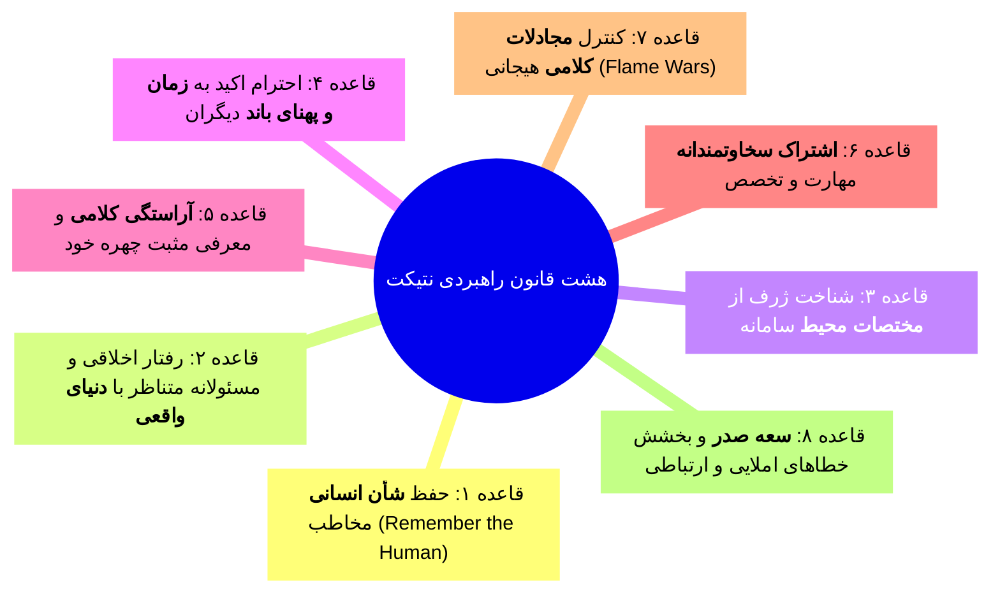
```mermaid
mindmap
  root((هشت قانون راهبردی نتیکت))
    ["قاعده ۱: حفظ <b>شأن انسانی</b> مخاطب (Remember the Human)"]
    ["قاعده ۲: رفتار اخلاقی و مسئولانه متناظر با <b>دنیای واقعی</b>"]
    ["قاعده ۳: شناخت ژرف از <b>مختصات محیط</b> سامانه"]
    ["قاعده ۴: احترام اکید به <b>زمان و پهنای باند</b> دیگران"]
    ["قاعده ۵: <b>آراستگی کلامی</b> و معرفی مثبت چهره خود"]
    ["قاعده ۶: <b>اشتراک سخاوتمندانه</b> مهارت و تخصص"]
    ["قاعده ۷: کنترل <b>مجادلات کلامی</b> هیجانی (Flame Wars)"]
    ["قاعده ۸: <b>سعه صدر</b> و بخشش خطاهای املایی و ارتباطی"]
```

> [!warning] رفتارهای پرخطر و تخلفات ارتباطی در آزمون‌ها
> - **ALL CAPS**: معادل **فریاد زدن (Shouting)** و توهین کلامی است (نقض نتیکت).
> - **پیام صوتی (Voice Note)**: ارسال صوت به اساتید و سلسله‌مراتب دانشگاهی بدون اجازه قبلی (نقض نتیکت).
> - **مدل فیلترینگ کلامی THINK:** پیام باید حائز ۵ شرط باشد: **True** (صحیح)، **Helpful** (کاربردی)، **Inspiring** (الهام‌بخش/حفظ پهنای باند)، **Necessary** (ضروری)، **Kind** (محترمانه).
> - *رعایت گرامر و علائم نگارشی همیشه و در همه‌جا الزامی است.*

| اختصار وب   | مفهوم کامل انگلیسی             |
| :---------- | :----------------------------- |
| **FYI**     | **For Your Information**       |
| **ASAP**    | **As Soon As Possible**        |
| **BTW**     | **By The Way**                 |
| **LOL**     | **Laugh Out Loud**             |
| **WTG**     | Way To Go                      |
| **TTUL**    | Talk To You Later              |
| **BFN**     | Bye For Now                    |
| **BRB**     | Be Right Back                  |
| **CUL**     | See You Later                  |
| **IDK**     | **I Don't Know**               |
| **JK / JJ** | **Just Kidding / Just Joking** |
| **TYVM**    | Thank You Very Much            |

> [!important] شواهد علم‌سنجی ادبیات نتیکت (مرور سیستماتیک سولر-کاستا ۲۰۱۹)
> 1. حجم مطالعات ایندکس‌شده تا ۲۰۱۹: بسیار محدود (**18 مقاله**).
> 2. ساختار مقالات به تساوی مطلق: **50% نظریه‌پردازی (Theoretical)** و **50% تجربی-مداخله‌ای (Empirical)**.
> 3. سهم ملل: ایالات متحده با **39%** و بریتانیا با **22%**. روند از ۱۹۹۵ آغاز و در ۲۰۰۷ شکوفا گردید.

---

### ۵. حقوق مالکیت فکری (IP)، استفاده منصفانه و کریتیو کامانز (CC)

> [!abstract] ماهیت کپی‌رایت خودکار (Automatic Copyright)
> به محض خلق اثر و تثبیت آن روی یک حامل فیزیکی یا حافظه رایانه، کپی‌رایت **به شکل خودکار و بدون نیاز به ثبت قبلی** مستقر می‌شود؛ اما **اقامه دعوی حقوقی در مراجع قضایی (Bring Suit)** منوط به ثبت رسمی قبلی اثر است.

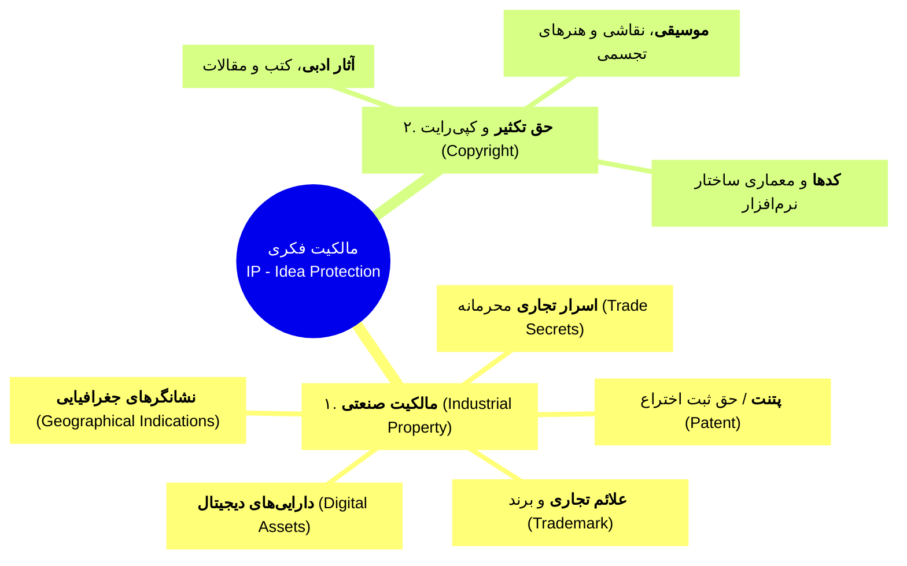
```mermaid
mindmap
  root((مالکیت فکری<br>IP - Idea Protection))
    ["۱. <b>مالکیت صنعتی</b> (Industrial Property)"]
      ["<b>پتنت</b> / حق ثبت اختراع (Patent)"]
      ["<b>علائم تجاری</b> و برند (Trademark)"]
      ["<b>اسرار تجاری</b> محرمانه (Trade Secrets)"]
      ["<b>نشانگرهای جغرافیایی</b> (Geographical Indications)"]
      ["<b>دارایی‌های دیجیتال</b> (Digital Assets)"]
    ["۲. <b>حق تکثیر</b> و کپی‌رایت (Copyright)"]
      ["<b>آثار ادبی</b>، کتب و مقالات"]
      ["<b>موسیقی</b>، نقاشی و هنرهای تجسمی"]
      ["<b>کدها</b> و معماری ساختار نرم‌افزار"]
```

> [!warning] مصادیق حقوقی، مواعد زمانی انقضا و مالکیت کارهای دانشجویی
> - **تطبیق مصادیق**: فرمول شیمیایی/سورس‌کد سرور = *راز تجاری*؛ لوگو و نام تجاری = *علامت تجاری (®)*؛ فرم بطری/سخت‌افزار = *طراحی صنعتی*؛ متن تبلیغات/سایت/اسلاید = *کپی‌رایت (©)*.
> - **مواعد انقضا**: شخص حقیقی = مادام‌العمر به علاوه **70 سال پس از فوت**؛ شخص حقوقی = **95 سال از انتشار** یا **120 سال از زمان خلق** (هرکدام زودتر منقضی شود).
> - **حقوق دانشجو**: تکالیف، مقالات و دستاوردهای دانشجویان **متعلق به خود دانشجو است**؛ استاد حق بازنشر بدون اجازه کتبی را ندارد. ادعای ناآگاهی از قوانین مالکیت فکری در دادگاه مسموع نیست.

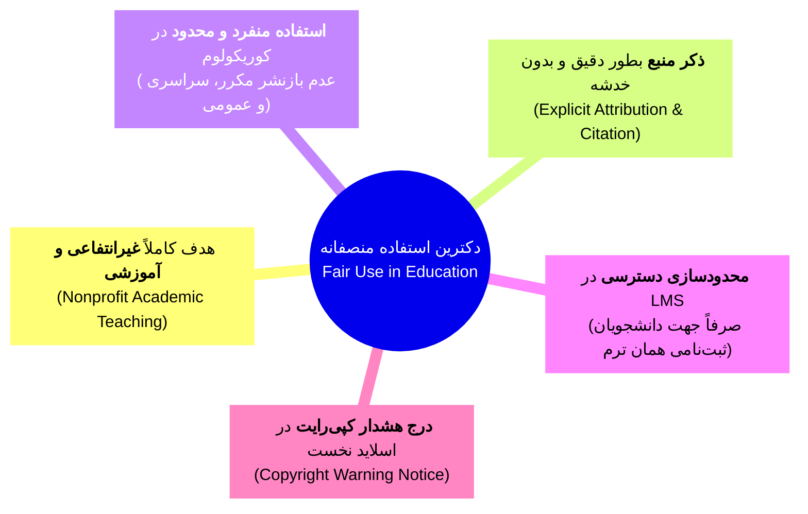
```mermaid
mindmap
  root((دکترین استفاده منصفانه<br>Fair Use in Education))
    ["هدف کاملاً <b>غیرانتفاعی و آموزشی</b><br>(Nonprofit Academic Teaching)"]
    ["<b>ذکر منبع</b> بطور دقیق و بدون خدشه<br>(Explicit Attribution & Citation)"]
    ["<b>استفاده منفرد و محدود</b> در کوریکولوم<br>(عدم بازنشر مکرر، سراسری و عمومی)"]
    ["<b>محدودسازی دسترسی</b> در LMS<br>(صرفاً جهت دانشجویان ثبت‌نامی همان ترم)"]
    ["<b>درج هشدار کپی‌رایت</b> در اسلاید نخست<br>(Copyright Warning Notice)"]
```

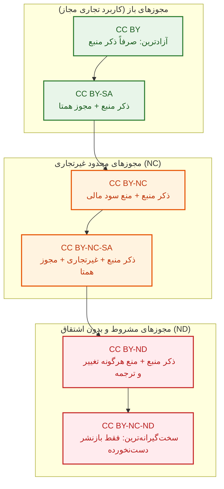
```mermaid
flowchart TD

classDef l1 fill:#e8f5e9,stroke:#2e7d32,stroke-width:2px,color:#1b5e20;
classDef l2 fill:#fff3e0,stroke:#e65100,stroke-width:2px,color:#bf360c;
classDef l3 fill:#ffebee,stroke:#c62828,stroke-width:2px,color:#b71c1c;

subgraph Free ["مجوزهای باز (کاربرد تجاری مجاز)"]
    L1["CC BY<br>آزادترین: صرفاً ذکر منبع"]:::l1
    L2["CC BY-SA<br>ذکر منبع + مجوز همتا"]:::l1
    L1 --> L2
end

subgraph NonCommercial ["مجوزهای محدود غیرتجاری (NC)"]
    L3["CC BY-NC<br>ذکر منبع + منع سود مالی"]:::l2
    L4["CC BY-NC-SA<br>ذکر منبع + غیرتجاری + مجوز همتا"]:::l2
    L3 --> L4
end

subgraph Restrictive ["مجوزهای مشروط و بدون اشتقاق (ND)"]
    L5["CC BY-ND<br>ذکر منبع + منع هرگونه تغییر و ترجمه"]:::l3
    L6["CC BY-NC-ND<br>سخت‌گیرانه‌ترین: فقط بازنشر دست‌نخورده"]:::l3
    L5 --> L6
end

%% شکستن عمودی ساب‌گراف‌ها به ردیف‌های زیر هم
Free ~~~ NonCommercial
NonCommercial ~~~ Restrictive

%% اتصال ترتیبی از انتهای هر باکس به ابتدای باکس پایین
L2 --> L3
L4 --> L5
```

> [!important] تله تستی پیرامون مجوزهای متن‌باز (Open Source)
> پلتفرم‌های دانشگاهی متن‌باز نظیر **مودل (Moodle)** مبتنی بر مجوز **ShareAlike (SA)** هستند. در صورت تغییر کد منبع و فروش آن تحت برندی جدید بدون بازنشر تحت همان مجوز و بدون ذکر نام سازنده، **تخلف مستقیم مالکیت فکری (Infringement)** رخ داده و قابل ابطال در محاکم است.

---

## بخش ۲: فناوری‌های نوظهور، منابع باز، بازیابی اطلاعات و کتابخانه‌های سلامت

### ۱. چرخه هایپ گارتنر (Gartner Hype Cycle) و تکامل فناوری

> [!abstract] تعریف فناوری نوظهور (Emerging Technology)
> فناوری‌های دارای توان دگرگون‌سازی اساسی که هنوز به **استقرار روتین، الزامی و فراگیر** در بدنه جامعه نرسیده‌اند.

> [!warning] تله‌های تستی پیرامون فناوری‌های نوظهور
> 1. *الزاماً نوآوری جدید نیستند*؛ ممکن است احیای فناوری‌های گذشته به دلیل بلوغ زیرساخت کنونی باشند (مانند دنیاهای مجازی).
> 2. درک جامعه علمی و بازار از ابعاد، خطرات و پیامدهای استقرار نهایی آنها **نسبی و ناقص** است.

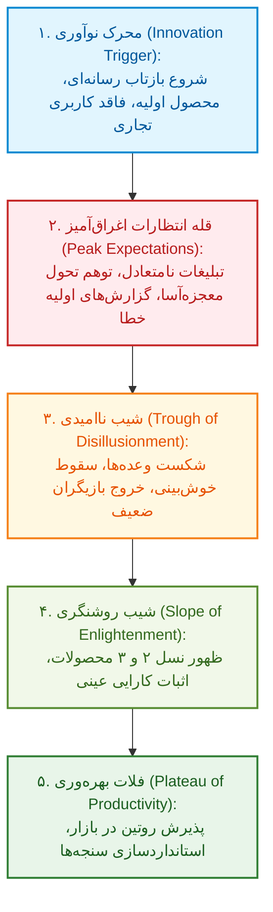
```mermaid
flowchart TD
    classDef p1 fill:#e1f5fe,stroke:#0288d1,stroke-width:2px,color:#01579b;
    classDef p2 fill:#ffebee,stroke:#c62828,stroke-width:2px,color:#b71c1c;
    classDef p3 fill:#fff8e1,stroke:#f57f17,stroke-width:2px,color:#e65100;
    classDef p4 fill:#f1f8e9,stroke:#558b2f,stroke-width:2px,color:#33691e;
    classDef p5 fill:#e8f5e9,stroke:#2e7d32,stroke-width:2px,color:#1b5e20;

    G1["۱. محرک نوآوری (Innovation Trigger):<br>شروع بازتاب رسانه‌ای، محصول اولیه، فاقد کاربری تجاری"]:::p1
    --> G2["۲. قله انتظارات اغراق‌آمیز (Peak Expectations):<br>تبلیغات نامتعادل، توهم تحول معجزه‌آسا، گزارش‌های اولیه خطا"]:::p2
    --> G3["۳. شیب ناامیدی (Trough of Disillusionment):<br>شکست وعده‌ها، سقوط خوش‌بینی، خروج بازیگران ضعیف"]:::p3
    --> G4["۴. شیب روشنگری (Slope of Enlightenment):<br>ظهور نسل ۲ و ۳ محصولات، اثبات کارایی عینی"]:::p4
    --> G5["۵. فلات بهره‌وری (Plateau of Productivity):<br>پذیرش روتین در بازار، استانداردسازی سنجه‌ها"]:::p5
```

```chart
{
  labels: [
    'محرک نوآوری (Innovation Trigger)',
    'قله انتظارات اغراق‌آمیز (Peak of Inflated Expectations)',
    'شیب ناامیدی (Trough of Disillusionment)',
    'شیب روشنگری (Slope of Enlightenment)',
    'فلات بهره‌وری (Plateau of Productivity)'
  ],
  datasets: [
    {
      label: 'چرخه هایپ گارتنر (Gartner Hype Cycle)',
     
      data: [15, 95, 20, 55, 70],
      borderColor: '#0288d1',
      backgroundColor: 'rgba(2, 136, 209, 0.1)',
      borderWidth: 3,
      tension: 0.45,
      fill: true,
      pointRadius: 6,
      pointHoverRadius: 9,
      pointBackgroundColor: [
        '#0288d1',
        '#c62828',
        '#f57f17',
        '#558b2f',
        '#2e7d32' 
      ],
      pointBorderColor: '#ffffff',
      pointBorderWidth: 2
    }
  ]
}
```

| فاز چرخه هایپ گارتنر           | وضعیت رسانه‌ای و هیجان    | بلوغ ابزار و محصولات                   | ماهیت ورود تجاری و آکادمیک                                       | نمونه‌های شاخص سلامت و آموزش                                            |
| :----------------------------- | :------------------------ | :------------------------------------- | :--------------------------------------------------------------- | :---------------------------------------------------------------------- |
| **۱. محرک نوآوری (Trigger)**   | صعود برق‌آسای توجه عمومی  | پروتوتایپ آزمایشگاهی، فاقد تجاری‌سازی  | ریسک سرمایه‌گذاری بی‌نهایت بالا                                  | *رابط مغز و رایانه (BMI)*، متاورس سلامت                                 |
| **۲. قله انتظارات (Peak)**     | بالاترین حد هیاهو و توهم  | عرضه‌های پرتبلیغ همراه با باگ‌های بارز | ورود شتاب‌زده سرمایه‌گذاران جسور                                 | هوش مصنوعی مولد (*Generative AI*)                                       |
| **۳. شیب ناامیدی (Trough)**    | افول شدید اعتماد و بدبینی | پاکسازی بازار، ورشکستگی بازیگران بدوی  | بقای *استارتاپ‌های تاب‌آور*، اصلاح نقایص                         | *ارزیابی دیجیتال (Digital Assessment)*، بلاکچین سلامت                   |
| **۴. شیب روشنگری (Slope)**     | بازگشت خردمندانه به منطق  | **نسل دوم و سوم ابزارها** با خطای اندک | سرمایه‌گذاری نهادهای محافظه‌کار                                  | *سامانه‌های یادگیری تطبیقی (Adaptive Learning Platforms)*، پایش دیجیتال |
| **۵. فلات بهره‌وری (Plateau)** | عدم جذابیت خبری و تثبیت   | ابزارهای استاندارد، ارزیابی‌پذیر       | ادغام در فرآیندهای روتین بالینی و آموزشی، تبدیل به *ابزار روتین* | *کتب درسی الکترونیک (E-Textbook)*، BYOD                                 |

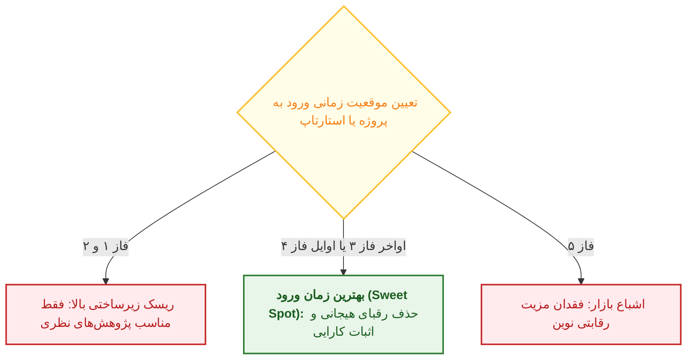
```mermaid
flowchart TD
    classDef dec fill:#fffde7,stroke:#fbc02d,stroke-width:2px,color:#f57f17;
    classDef act fill:#e8f5e9,stroke:#2e7d32,stroke-width:2px,color:#1b5e20;
    classDef stop fill:#ffebee,stroke:#c62828,stroke-width:2px,color:#b71c1c;

    Q{"تعیین موقعیت زمانی ورود به پروژه یا استارتاپ"}:::dec
    Q -->|فاز ۱ و ۲| S1["ریسک زیرساختی بالا: فقط مناسب پژوهش‌های نظری"]:::stop
    Q -->|اواخر فاز ۳ یا اوایل فاز ۴| S2["<b>بهترین زمان ورود (Sweet Spot):</b> حذف رقبای هیجانی و اثبات کارایی"]:::act
    Q -->|فاز ۵| S3["اشباع بازار: فقدان مزیت رقابتی نوین"]:::stop
```

> [!important] کدگذاری زمانی رسیدن به فلات در نمودارهای مؤسسه گارتنر
> - دایره سفید توخالی = کمتر از **2 سال**.
> - دایره آبی کم‌رنگ = بین **2 تا 5 سال**.
> - دایره آبی پررنگ = بین **5 تا 10 سال**.
> - مثلث = بیش از **10 سال**.
> - ضربدر قرمز = **منسوخ‌شدن قبل از رسیدن به فلات (Obsolete before plateau)**. مسیر فناوری‌ها همواره خطی نیست و ممکن است در فاز ۳ منسوخ و محو گردند.

---

### ۲. جنبش OER، دوره‌های موک (MOOCs) و پلتفرم ملی «آرمان»

- **تعریف منابع آموزشی باز (OER):** ماده یا منبع **آموزشی** با دسترسی **رایگان** تحت **مجوزی باز** و اجازه کاربست/انطباق/بازتوزیع برای کاربران.
	- گذار از *«تمامی حقوق محفوظ است (All Rights Reserved)»* به سمت *«برخی حقوق محفوظ است (Some Rights Reserved)»*

> [!abstract] چارچوب پنج حق منابع آموزشی باز (The 5R Framework)
> 1. **حق نگهداری (Retain)**: دانلود و ذخیره دائمی نسخه اختصاصی.
> 2. **حق بازاستفاده (Reuse)**: کاربست مستقیم و بدون تغییر در آموزش.
> 3. **حق ویرایش (Revise)**: اصلاح، ترجمه و بومی‌سازی متون.
> 4. **حق بازترکیب (Remix)**: تلفیق اثر با سایر منابع جهت آفرینش محصول نو.
> 5. **حق بازتوزیع (Redistribute)**: اشتراک نسخه‌های اولیه یا ویرایش‌شده با جامعه.

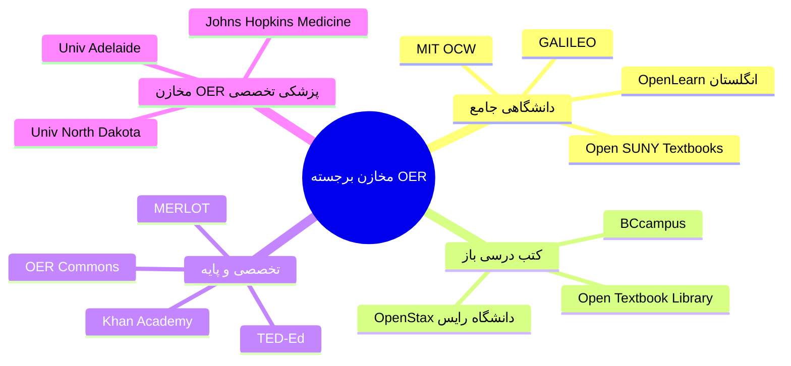
```mermaid
mindmap
  root((مخازن برجسته OER))
    دانشگاهی جامع
      MIT OCW
      OpenLearn انگلستان
      GALILEO
      Open SUNY Textbooks
    کتب درسی باز
      Open Textbook Library
      OpenStax دانشگاه رایس
      BCcampus
    تخصصی و پایه
      OER Commons
      MERLOT
      Khan Academy
      TED-Ed
    مخازن OER پزشکی تخصصی
      Johns Hopkins Medicine
      Univ North Dakota
      Univ Adelaide
```

> [!abstract] **کالبدشکافی واژه MOOC**
> - **انبوه (Massive):** پذیرش نامحدود فراگیران همزمان از همه‌جا.
> - **باز (Open):** دسترسی آزاد، بدون شهریه و پیش‌نیاز صلب.
> - **برخط (Online):** ارائه بر وب، بدون حضور فیزیکی.
> - **دوره (Course):** قالب کوریکولوم با سیلابس و تکالیف.

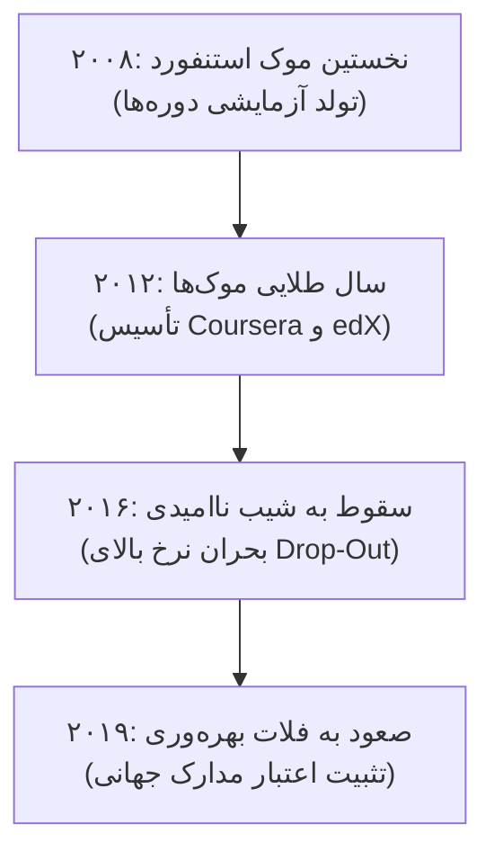
```mermaid
flowchart TD

    M1["۲۰۰۸: نخستین موک استنفورد<br>(تولد آزمایشی دوره‌ها)"]:::h
    --> M2["۲۰۱۲: سال طلایی موک‌ها<br>(تأسیس Coursera و edX)"]:::h
    --> M3["۲۰۱۶: سقوط به شیب ناامیدی<br>(بحران نرخ بالای Drop-Out)"]:::h
    --> M4["۲۰۱۹: صعود به فلات بهره‌وری<br>(تثبیت اعتبار مدارک جهانی)"]:::h
```

| مدل دوره آنلاین          | پایه تئوریک و پداگوژی               | نحوه تولید محتوا و تعامل                    | وضعیت برنامه درسی و آزمون                   | پلتفرم‌های نمونه                  |
| :----------------------- | :---------------------------------- | :------------------------------------------ | :------------------------------------------ | :-------------------------------- |
| **رابطه‌گرا (cMOOC)**    | نظریه ارتباط‌گرایی (*Connectivism*) | برآیند **تعامل شبکه‌ای فراگیران با یکدیگر** | بدون سیلابس صلب؛ مسیر گفتگو تعیین‌کننده است | نخستین دوره‌های استنفورد (۲۰۰۸)   |
| **تعمیمی (xMOOC)**       | مدل انتقالی آکادمیک سنتی            | **تدریس متمرکز استاد**؛ دانشجو مصرف‌کننده   | تقویم صلب، تکالیف موعددار، **اعطای گواهی**  | Coursera, edX                     |
| **شبه موک (Quasi-MOOC)** | مخزن باز درس‌افزاری (*q-Course*)    | مطالعه مستقل غیرهمزمان ویدیو و متن          | فاقد کلاس، بدون تقویم و بدون مدرک           | Khan Academy, MIT OCW             |
| **ترکیبی (bMOOC)**       | یادگیری تلفیقی (*Blended*)          | ترکیب محتوای آنلاین با کارگاه حضوری         | ارزیابی آنلاین همراه با آزمون حضوری         | سامانه‌های ادغام‌شده LMS دانشگاهی |

> [!important] کالبدشکافی افت فراگیران (Drop-Out Rate) و مشوق‌های پایدارسازی
> - **دیدگاه تصحیحی:** افت بالا در موک‌ها **شکست سیستماتیک نیست**؛ بخش عمده کاربران صرفاً جهت رفع نیاز مقطعی به ماژولی خاص وارد شده و پس از اخذ آن دوره را ترک می‌کنند.
> - **علل ده‌گانه ریزش:** ۱. کمبود وقت، ۲. نوسان انگیزه اولیه، ۳. نیاز مقطعی، ۴. انزوای مجازی، ۵. دشواری مفاهیم، ۶. ضعف پشتیبانی آموزشی، ۷. ضعف مهارت فنی، ۸. فقدان راهبرد خودتنظیم‌گری، ۹. تجارب بد قبلی، ۱۰. عدم انطباق با انتظار ذهنی.
> - **مشوق‌های کاهش ریزش:** **بیرونی** شامل *گواهی معتبر*، *هزینه معقول* و عناصر *بازی‌وارسازی (Gamification)* مثل لیدربرد (Leaderboards)، بج و امتیاز (Badges & Points) و نوار پیشرفت (Progress Bar)؛ **درونی** شامل *عنوان جذاب* و *انطباق با نیاز روز* بازار.

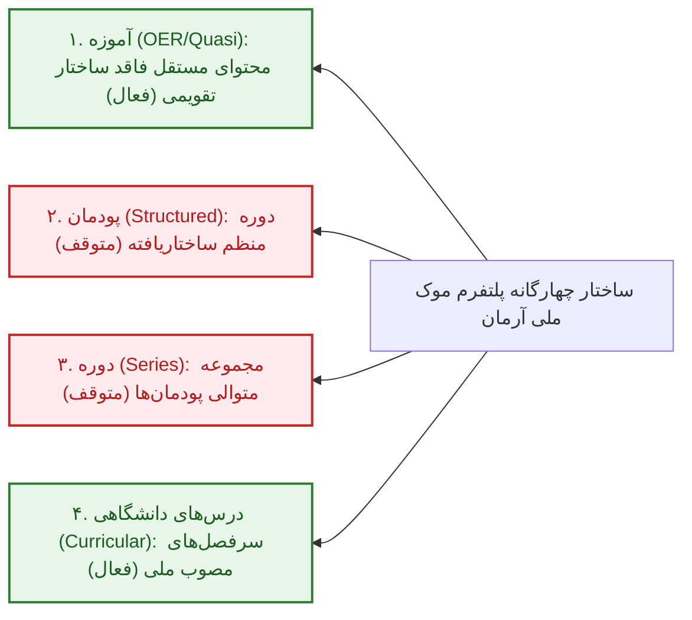
```mermaid
flowchart RL
    classDef act fill:#e8f5e9,stroke:#2e7d32,stroke-width:2px,color:#1b5e20;
    classDef deact fill:#ffebee,stroke:#c62828,stroke-width:2px,color:#b71c1c;

    A["ساختار چهارگانه پلتفرم موک ملی آرمان"]
    A --> A1["۱. آموزه (OER/Quasi): محتوای مستقل فاقد ساختار تقویمی (فعال)"]:::act
    A --> A2["۲. پودمان (Structured): دوره منظم ساختاریافته (متوقف)"]:::deact
    A --> A3["۳. دوره (Series): مجموعه متوالی پودمان‌ها (متوقف)"]:::deact
    A --> A4["۴. درس‌های دانشگاهی (Curricular): سرفصل‌های مصوب ملی (فعال)"]:::act
```

> [!warning] وضعیت رده‌بندی سامانه آرمان در آزمون‌ها
> به علت توقف بخش‌های پودمان و دوره و فعالیت اختصاصی آموزه‌ها و دروس مصوب، سامانه آرمان عملاً در طبقه **شبه موک (Quasi-MOOC)** ارزیابی می‌گردد.

---

### ۳. بازیابی اطلاعات، مهندسی سرچ، گوگل اسکالر و سمانتیک اسکالر

> [!abstract] معماری چهارمرحله‌ای موتورهای جستجو
> 1. **خزش (Crawling)**: *ردیابی لینک‌ها* توسط ربات‌های Spider.
> 2. **نمایه‌سازی (Indexing)**: *کدگذاری و ذخیره* اسناد در پایگاه سرور.
> 3. **رتبه‌بندی (Ranking)**: *محاسبه ضریب ارتباط* محتوا با پرس‌وجو (کسری از ثانیه).
> 4. **بازنمایی (Hits)**: *ارائه لیست نتایج* مرتب‌شده.

> [!important] سهم بازار و ابرموتورهای جستجو (Aggregators)
> - سهم بازار: **گوگل با 83.49%**، بینگ 9.19%، یاهو 2.72%، یاندکس 1.9%، داک‌داک‌گو 0.77%، بایدو 0.46%.
> - **ابرموتورها**: فاقد خزنده‌اند؛ کوئری را همزمان به چندین موتور می‌فرستند (*Dogpile*، *Startpage*، *Mamma*، *MetaCrawler*).

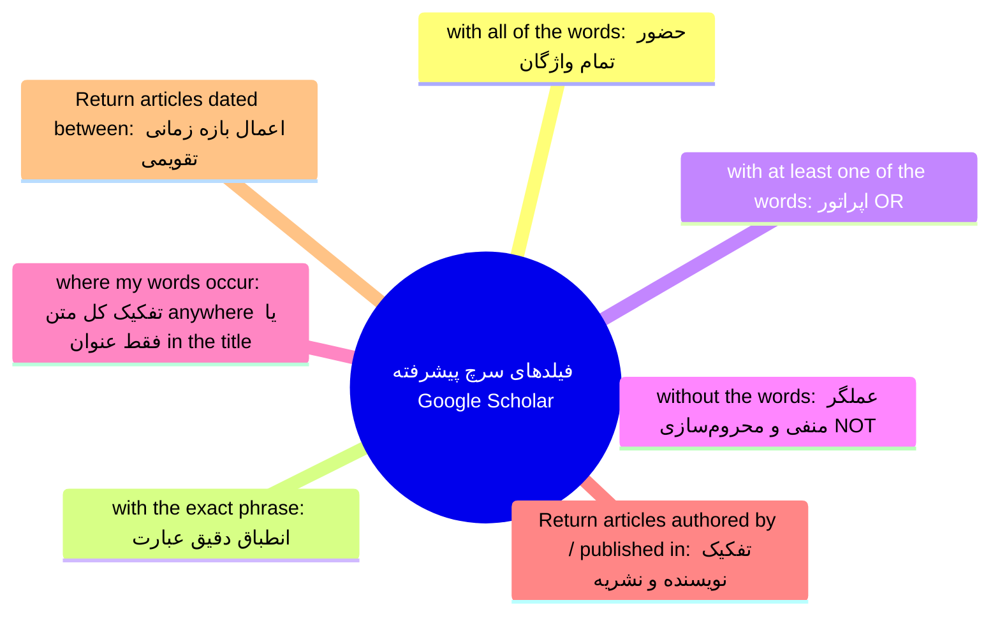
```mermaid
mindmap
  root((فیلدهای سرچ پیشرفته Google Scholar))
    with all of the words: حضور تمام واژگان
    with the exact phrase: انطباق دقیق عبارت
    with at least one of the words: اپراتور OR
    without the words: عملگر منفی و محروم‌سازی NOT
    where my words occur: تفکیک کل متن anywhere یا فقط عنوان in the title
    Return articles authored by / published in: تفکیک نویسنده و نشریه
    Return articles dated between: اعمال بازه زمانی تقویمی
```

> [!important] علم‌سنجی گوگل اسکالر و تنظیمات کاربردی
> - **h5-index**: بیشترین عدد $h$ به طوری که نشریه در ۵ سال گذشته $h$ مقاله با حداقل $h$ بار استناد داشته باشد (*Nature* با 444 رتبه یک است).
> - **h5-median**: میانه استنادات مقالات تشکیل‌دهنده شاخص h5-index (*NEJM* با میانه 780 پیشتاز است).
> - **Settings**: فعال‌سازی *Bibliography Manager* برای خروجی مستقیم EndNote؛ بخش *Case Law* فقط برای آرای دادگاه‌های آمریکا بوده و فاقد کاربرد علوم پزشکی است؛ بخش *Alerts* برای رصد انتشارات و استنادات جدید.

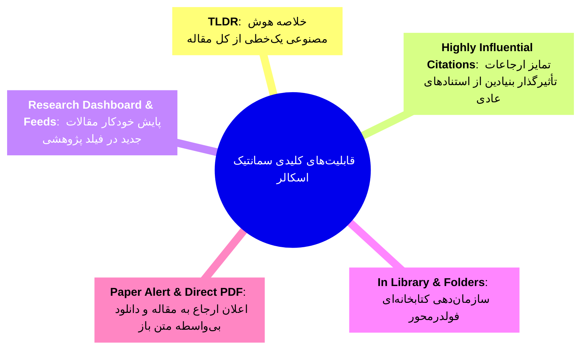
```mermaid
mindmap
  root((قابلیت‌های کلیدی سمانتیک اسکالر))
    ["<b>TLDR</b>: خلاصه هوش مصنوعی یک‌خطی از کل مقاله"]
    ["<b>Highly Influential Citations</b>: تمایز ارجاعات تأثیرگذار بنیادین از استنادهای عادی"]
    ["<b>Research Dashboard & Feeds</b>: پایش خودکار مقالات جدید در فیلد پژوهشی"]
    ["<b>In Library & Folders</b>: سازمان‌دهی کتابخانه‌ای فولدرمحور"]
    ["<b>Paper Alert & Direct PDF</b>: اعلان ارجاع به مقاله و دانلود بی‌واسطه متن باز"]
```

| مولفه مقایسه‌ای     | گوگل اسکالر (Google Scholar)             | سمانتیک اسکالر (Semantic Scholar)             | وب آو ساینس (Web of Science)                    |
| :------------------ | :--------------------------------------- | :-------------------------------------------- | :---------------------------------------------- |
| **هسته الگوریتم**   | تطابق کلیدواژگانی و بسامد ارجاعات خام    | *پردازش زبان طبیعی و شبکه روابط مفهومی*       | نمایه‌سازی ساختاریافته استنادی گزینشی ISI       |
| **خلاصه‌سازی**      | فاقد خلاصه‌ساز (صرفاً چکیده مؤلفان)      | قابلیت برجسته هوشمند **TLDR (تک‌خطی AI)**     | فاقد خلاصه ماشینی هوشمند                        |
| **وزن‌دهی استنادی** | یکسان دانستن تمام استنادات در شمارش      | تفکیک ارجاعات کلیدی با **Highly Influential** | تحلیل شبکه استنادی غنی (**Enriched Citations**) |
| **پوشش حق اختراع**  | **دارد** (دارای چک‌باکس اختصاصی Patents) | ندارد (منحصراً بر مقالات داوری‌شده ژورنال‌ها) | نیازمند اتصال جداگانه به دیتابیس Derwent        |
| **مدل دسترسی مالی** | کاملاً رایگان برای عموم جامعه            | کاملاً رایگان با ساخت حساب کاربری             | تجاری با حق اشتراک فوق‌العاده سنگین             |

> شعار رسمی گوگل اسکالر: **«Stand on the shoulders of giants»** (پیشرفت سریع علمی با استناد بر دانش انباشته و یافته‌های پیشین).

---

### ۴. زیست‌بوم کتابخانه‌های دیجیتال و پایگاه‌های بالینی

> [!abstract] کتابخانه دیجیتال (Digital Library)
> سامانه ذخیره و مدیریت الکترونیکی منابع علمی/رسانه‌ای؛ دسترسی چندگانه بدون محدودیت زمان/مکان؛ حاصل تلاقی **کتابدار** با **متخصص کامپیوتر**.
> کتابخانه‌های مدرن اغلب ساختار ترکیبی (دیجیتال + سنتی) دارند.

| مشخصه مقایسه‌ای | کتابخانه سنتی (Traditional Library) | کتابخانه دیجیتال (Digital Library) |
| :--- | :--- | :--- |
| **قالب فیزیکی محتوا** | کتب، رساله‌ها و نشریات چاپی روی قفسه | داده‌های چندرسانه‌ای، کتب الکترونیک و فایل‌های PDF |
| **بازه زمانی دسترسی** | محدود به ساعات اداری مصوب مخزن | دسترسی نامحدود **24 ساعته در تمام روزهای هفته (24/7)** |
| **محدودیت مکانی** | الزام حضور فیزیکی در سالن و پشت میز | ورود از هر نقطه جغرافیایی متصل به شبکه اینترنت |
| **استفاده همزمان** | تک‌نسخه‌ای (امانت رفتن نسخه مساوی با انتظار دیگران) | استفاده همزمان و نامحدود شمار بالایی کاربر از یک فایل |
| **مدیریت و نیروی انسانی** | منحصراً اداره توسط کتابداران سنتی | نیازمند تلفیق مهارت **کتابداران و مهندسان کامپیوتر** |

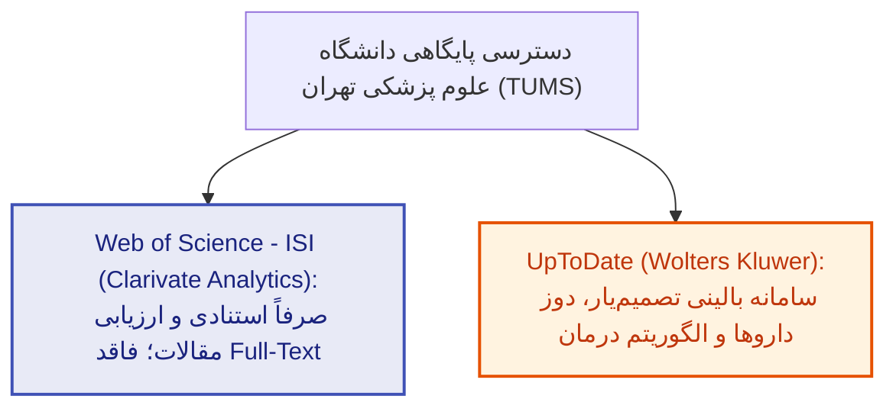
```mermaid
flowchart TD
    classDef wos fill:#e8eaf6,stroke:#3f51b5,stroke-width:2px,color:#1a237e;
    classDef upt fill:#fff3e0,stroke:#e65100,stroke-width:2px,color:#bf360c;

    TUMS["دسترسی پایگاهی دانشگاه علوم پزشکی تهران (TUMS)"]
    TUMS --> WOS["Web of Science - ISI (Clarivate Analytics):<br>صرفاً استنادی و ارزیابی مقالات؛ فاقد Full-Text"]:::wos
    TUMS --> UPT["UpToDate (Wolters Kluwer):<br>سامانه بالینی تصمیم‌یار، دوز داروها و الگوریتم درمان"]:::upt
```

> [!warning] وضعیت اضطراری دسترسی به پایگاه‌های علمی در دانشگاه
> 1. اشتراک رسمی پایگاه‌های *Scopus* و *Reaxys* به دلیل **تحریم** قطع است.
> 2. سامانه **V.Campus ارزش افزوده ندارد** و پایگاه‌های پولی را از راه دور باز نمی‌کند.
> 3. سامانه‌های **Web of Science** و **UpToDate** منحصراً با **تنظیم رایانه روی IP کابل داخلی بیمارستان‌ها و دانشکده‌ها** باز می‌شوند.
> 4. سابمیت مقالات با ایمیل‌های عمومی (جیمیل/یاهو) از سوی ژورنال‌های معتبر نامعتبر شناخته می‌شود؛ اما حساب ایمیل دانشگاهی **بلافاصله پس از تسویه‌حساب فارغ‌التحصیلی حذف قطعی می‌گردد**.

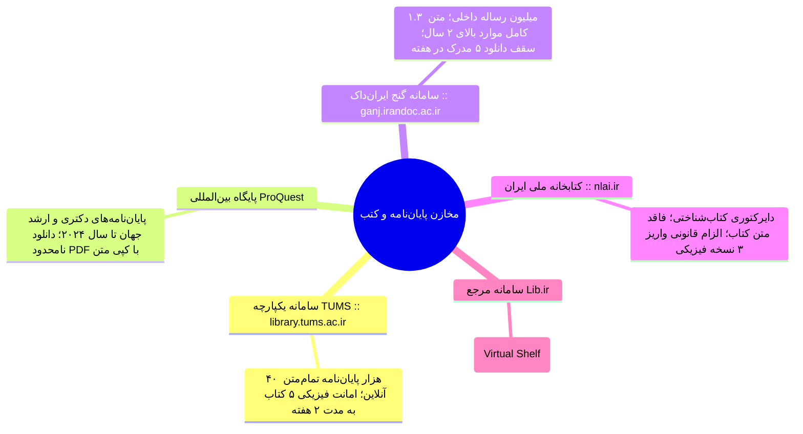
```mermaid
mindmap
  root((مخازن پایان‌نامه و کتب))
    سامانه یکپارچه TUMS :: library.tums.ac.ir
      ۴۰ هزار پایان‌نامه تمام‌متن آنلاین؛ امانت فیزیکی ۵ کتاب به مدت ۲ هفته
    پایگاه بین‌المللی ProQuest
      پایان‌نامه‌های دکتری و ارشد جهان تا سال ۲۰۲۴؛ دانلود نامحدود PDF با کپی متن
    سامانه گنج ایران‌داک :: ganj.irandoc.ac.ir
      ۱.۳ میلیون رساله داخلی؛ متن کامل موارد بالای ۲ سال؛ سقف دانلود ۵ مدرک در هفته
    کتابخانه ملی ایران :: nlai.ir
      دایرکتوری کتاب‌شناختی؛ فاقد متن کتاب؛ الزام قانونی واریز ۳ نسخه فیزیکی
    سامانه مرجع Lib.ir
      اتصال به شبکه کتابخانه‌های کشور؛ ویژگی منحصر‌به‌فرد قفسه مجازی (Virtual Shelf)
```

---

## بخش ۳: هوش مصنوعی بالینی، اصول ارائه علمی، طراحی اسلاید و تله‌مدیسین

### ۱. هوش مصنوعی در سلامت: مبانی، سامانه‌ها و آزمون تورینگ

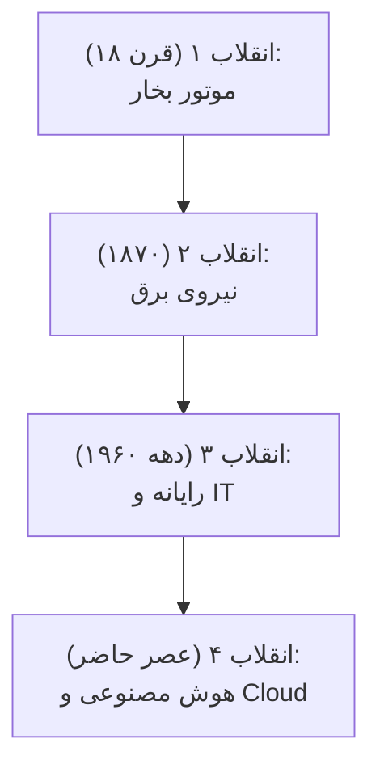
```mermaid
flowchart TD

    I1["انقلاب ۱ (قرن ۱۸):<br>موتور بخار"]:::ind
    --> I2["انقلاب ۲ (۱۸۷۰):<br>نیروی برق"]:::ind
    --> I3["انقلاب ۳ (دهه ۱۹۶۰):<br>رایانه و IT"]:::ind
    --> I4["انقلاب ۴ (عصر حاضر):<br>هوش مصنوعی و Cloud"]:::ind
```

> [!abstract] تعریف هوش مصنوعی و دکترین آزمون تورینگ
> - **هوش مصنوعی (AI)**: شبیه‌سازی کارکردهای شناختی مغز (یادگیری، استدلال، حل مسئله) توسط ماشین؛ اصطلاح نخستین بار توسط **جان مک‌کارتی (John McCarthy)** به کار رفت.
> - **آزمون تورینگ (Turing Test - 1950)**: ارزیاب انسانی با دو ترمینال کورناشناس گفت‌وگو می‌کند؛ در صورت **عدم توانایی در تفکیک انسان از رایانه**، ماشین در آزمون قبول شده است.

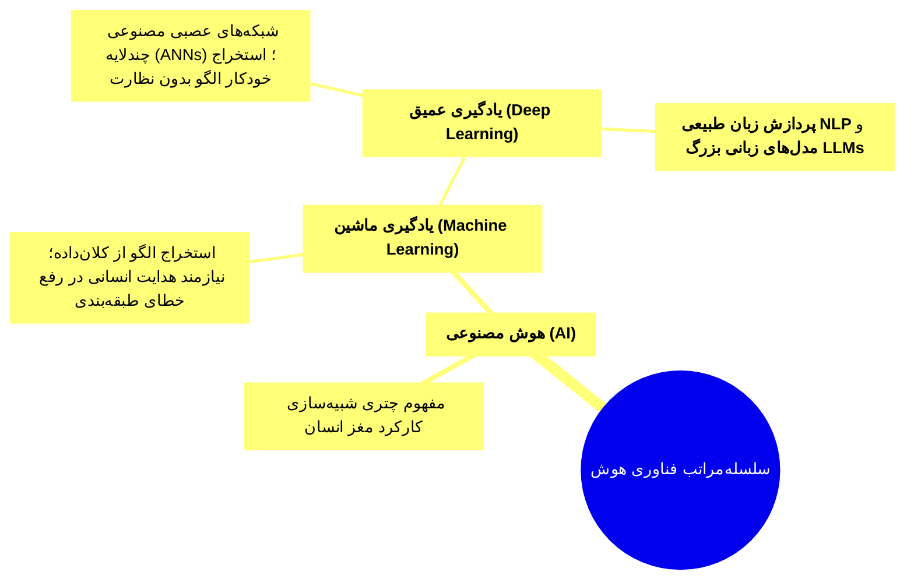
```mermaid
mindmap
  root((سلسله‌مراتب فناوری هوش))
    ["<b>هوش مصنوعی (AI)</b>"]
      ["مفهوم چتری شبیه‌سازی کارکرد مغز انسان"]
      ["<b>یادگیری ماشین (Machine Learning)</b>"]
        ["استخراج الگو از کلان‌داده؛ نیازمند هدایت انسانی در رفع خطای طبقه‌بندی"]
        ["<b>یادگیری عمیق (Deep Learning)</b>"]
          ["شبکه‌های عصبی مصنوعی چندلایه (ANNs)؛ استخراج خودکار الگو بدون نظارت"]
          ["<b>پردازش زبان طبیعی NLP</b> و <b>مدل‌های زبانی بزرگ LLMs</b>"]
```

> [!warning] تله تستی کلیدی: هوش مصنوعی محدود (Narrow) در برابر عمومی (AGI)
> تمامی فناوری‌های هوش مصنوعی مستقر در بالین و بهداشت از نوع **هوش مصنوعی ضعیف یا محدود (Narrow AI)** هستند و فقط در تسک‌های مشخص و ایزوله تبحر دارند. **هوش مصنوعی عمومی (AGI)** با هم‌ترازی شناختی در کل ادراک بشر *هنوز خلق نشده است*. مدل‌های زبانی (بیش از ۲۰ هزار مدل) بر وب عمومی آموزش دیده‌اند و صلاحیت طبابت مستقل ندارند.

| حوزه عملکرد            | برتری مطلق انسان (Human Superiority)                       | برتری مطلق ماشین (Machine Superiority)                     |
| :--------------------- | :--------------------------------------------------------- | :--------------------------------------------------------- |
| **ادراک و ورودی داده** | درک **مفاهیم انتزاعی (Abstract)**، استعاره‌ها و عواطف عمیق | حسگری امواج و فاکتورهای **خارج از توان حواس انسانی**       |
| **تصمیم‌گیری**         | انعطاف بالا، **بداهه‌پردازی (Improvising)** و وجدان اخلاقی | انطباق صفر و یک بر الگوریتم، فقدان درک اخلاقی              |
| **استدلال و استنتاج**  | تحلیل مبتنی بر شهود و **استدلال استقرایی (Inductive)**     | پردازش فوق‌سریع ریاضیاتی و *استدلال قیاسی صلب*             |
| **سرعت و فرسودگی**     | افت سریع تمرکز با خستگی و افت عملکرد                       | **هوشیاری مداوم (Alertness)** بدون فرسودگی در *امور روتین* |
| **حافظه و همزمانی**    | محدودیت شدید حافظه فعال، تداخل در چندوظیفگی                | ظرفیت نامحدود ذخیره‌سازی، **پردازش همزمان تسک‌ها**         |

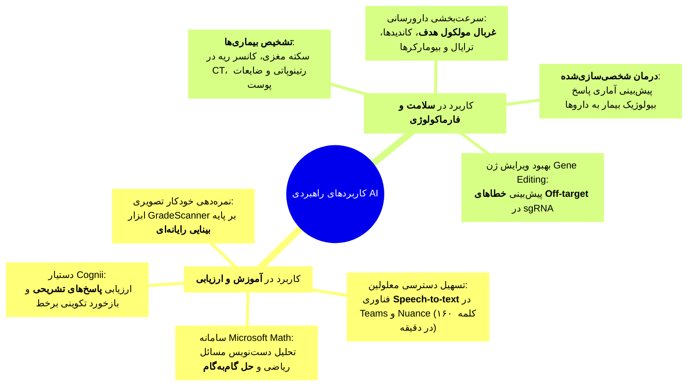
```mermaid
mindmap
  root((کاربردهای راهبردی AI))
    ["کاربرد در <b>آموزش و ارزیابی</b>"]
      ["دستیار Cognii:<br>ارزیابی <b>پاسخ‌های تشریحی</b> و بازخورد تکوینی برخط"]
      ["سامانه Microsoft Math:<br>تحلیل دست‌نویس مسائل ریاضی و <b>حل گام‌به‌گام</b>"]
      ["تسهیل دسترسی معلولین:<br>فناوری <b>Speech-to-text</b> در Teams و Nuance (۱۶۰ کلمه در دقیقه)"]
      ["نمره‌دهی خودکار تصویری:<br>ابزار GradeScanner بر پایه <b>بینایی رایانه‌ای</b>"]
    ["کاربرد در <b>سلامت و فارماکولوژی</b>"]
      ["<b>تشخیص بیماری‌ها</b>:<br>سکته مغزی، کانسر ریه در CT، رتینوپاتی و ضایعات پوست"]
      ["سرعت‌بخشی دارورسانی:<br><b>غربال مولکول هدف</b>، کاندیدها، ترایال و بیومارکرها"]
      ["<b>درمان شخصی‌سازی‌شده</b>:<br>پیش‌بینی آماری پاسخ بیولوژیک بیمار به داروها"]
      ["بهبود ویرایش ژن Gene Editing:<br>پیش‌بینی <b>خطاهای Off-target</b> در sgRNA"]
```

| سامانه هوش مصنوعی | شعار برند تجاری (Slogan) | مأموریت و ارزش افزوده بالینی |
| :--- | :--- | :--- |
| **Hippocratic AI** | *Safety-first AI for health care* | تصمیم‌یار بالینی با تمرکز ویژه بر اصل اخلاقی عدم آسیب |
| **Viz.ai** | *Closing gaps between patients, clinicians & treatments* | شناسایی خودکار ترومبوز عروق مغزی، سکته و تروما |
| **Regard** | *Empower physicians with powerful tech* | پایش پیش‌گویانه داده‌های بالینی و مستندسازی پرونده |
| **Caption Health** | *Imagine what an earlier picture of your heart could mean* | راهنمایی پروب سونوگرافی جهت اخذ تصویر استاندارد اکو |
| **PathAI** | *Improving Patient Outcomes with AI-Powered Pathology* | بهبود دقت پاتولوژی دیجیتال و تفکیک ضایعات انکولوژی |
| **Buoy Health** | *When something feels off, Buoy it* | بررسی هوشمند علائم بیماری (Symptom Checker) و تریاژ |
| **Linus Health** | *Unlock early detection of Alzheimer's and other dementias* | غربالگری شناختی دیجیتال پیش از بروز نشانه‌های آلزایمر |
| **Arterys** | *The future of precision medicine that only humans + AI can achieve* | تصویربرداری ابری در انکولوژی و آنالیز پرفیوژن قلبی |
| **Freenome** | *Decoding the means to cancer's end* | زیست‌شناسی چندوجهی برای غربالگری بدخیمی از خون |
| **Cleerly** | *How many beats dance with your date* | تحلیل رسوب پلاک‌های چربی و تنگی عروق کرونر |
| **VirtuSense** | *#1 Fall Prevention Solution* | بینایی ماشین برای پیش‌بینی سقوط سالمندان بستری |
| **DAX Copilot** | *Automated Clinical Documentation* | شنود بلادرنگ ویزیت و تنظیم مستندات پرونده |

> [!important] برنامه‌های پیشگام آموزش هوش مصنوعی در دانشکده‌های پزشکی جهان
> 1. **دانشگاه تورنتو**: تأسیس دوره ۲ ساله گواهی *Computing for Medicine* و دپارتمان تخصصی AI پزشکی.
> 2. **دانشکده پزشکی هاروارد**: کورس علم داده در سلامت و رویدادهای رقابتی دیتاثون (*Datathons*).
> 3. **دانشکده دل (دانشگاه تگزاس)**: **فشرده‌سازی دوره علوم پایه به ۱۲ ماه** به منظور ایجاد فضای آموزش مهارت‌های ارتباطی و رهبری.
> 4. **دانشگاه دوک و فلوریدا**: آموزش مشترک **اینترن‌ها** با **دانشمندان داده** برای ساخت سامانه‌های ماموگرافی (CAD).
> 5. **کارل ایلینویز، استنفورد و ویرجینیا**: پروژه‌های سه‌گانه پزشک-مهندس-دانشمند داده.
> 6. **اولسان و یانسی کره جنوبی**: ادغام کوریکولوم هوش مصنوعی در دروس پایه پزشکی.

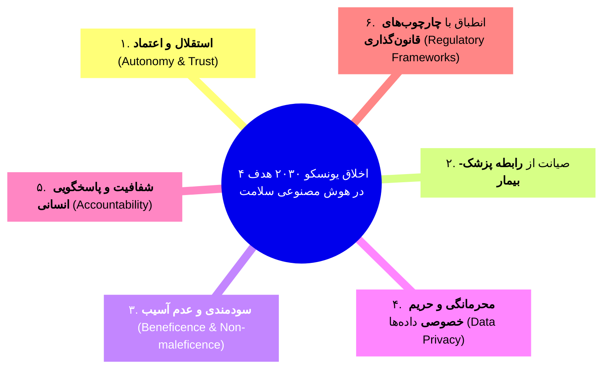
```mermaid
mindmap
  root((اخلاق یونسکو ۲۰۳۰ هدف ۴ در هوش مصنوعی سلامت))
    ["۱. <b>استقلال و اعتماد</b> (Autonomy & Trust)"]
    ["۲. صیانت از <b>رابطه پزشک-بیمار</b>"]
    ["۳. <b>سودمندی و عدم آسیب</b> (Beneficence & Non-maleficence)"]
    ["۴. <b>محرمانگی و حریم خصوصی</b> داده‌ها (Data Privacy)"]
    ["۵. <b>شفافیت و پاسخگویی انسانی</b> (Accountability)"]
    ["۶. انطباق با <b>چارچوب‌های قانون‌گذاری</b> (Regulatory Frameworks)"]
```

> [!warning] خطوط قرمز و ۵ اصل پرامپت‌نویسی استاندارد
> - **خط قرمزها**: منع قطعی ورود داده‌های هویتی بیمار (PII)؛ ابزارهای بدون تایید **FDA یا وزارت بهداشت** فاقد وجاهت تجویز بالینی هستند؛ حل تکالیف و آزمون با هوش مصنوعی **تقلب علمی** است؛ **مسئولیت قصور بالینی هرگز از پزشک سلب نمی‌گردد**.
> - **اصول پرامپت استاندارد**: ۱. **دقیق و مشخص بودن** (تعیین قالب و کاراکتر)، ۲. **سوالات بازپاسخ** جهت عمق‌بخشی، ۳. **سادگی واژگان**، ۴. **ارائه بافت و شرح‌حال بیمار**، و ۵. **پالایش رفت‌وبرگشتی مستمر**.

---

### ۲. اصول ارائه علمی و تعامل اثرگذار با مخاطب

```mermaid
flowchart TD
    classDef c1 fill:#e1f5fe,stroke:#0288d1,stroke-width:2px,color:#01579b;
    classDef c2 fill:#ede7f6,stroke:#7e57c2,stroke-width:2px,color:#4527a0;

    COMM["استراتژی‌های ارتباط در ارائه علمی"]
    
    COMM --> V["ارتباط کلامی (Verbal):<br>انتخاب واژگان، تنظیم تن صدا و دیالوگ"]:::c1
    COMM --> NV["ارتباط غیرکلامی (Non-verbal):<br>دارای ضریب نفوذ بسیار بالاتر در جلب اعتماد"]:::c2

    NV --> NV1["زبان بدن (Body Language):<br>حرکات هدفمند دست و سر"]:::c2
    NV --> NV2["ارتباط چشمی پایدار (Eye Contact):<br>پوشش همزمان مخاطبان و اعضای پنل داوری"]:::c2
    NV --> NV3["ارتباطات تصویری (Visuals):<br>اسلایدها، فیلم، نمودارها و اینفوگرافیک"]:::c2
```

```mermaid
flowchart RL

    P1["گام ۱: پیش از ارائه<br>• شناخت تیپولوژی مخاطب<br>• طراحی سناریو و Storytelling<br>• تمرین زمان‌بندی‌شده مکرر"]:::s1
    --> P2["گام ۲: حین ارائه<br>• تسخیر ذهن در ۲ دقیقه نخست<br>• مکث هدفمند (Artful Pause)<br>• پرهیز از لحن یکنواخت مونوتون"]:::s1
    --> P3["گام ۳: پس از ارائه<br>• مدیریت انتقادات و داوری<br>• شهامت بیان 'نمی‌دانم'<br>• پیام پایانی کلیدی (Take-home)"]:::s1
```

| شیوه ارائه علمی                         | مزایای اصلی                                 | چالش‌ها و خطرات بارز                                        | سطح توصیه‌پذیری آکادمیک                      |
| :-------------------------------------- | :------------------------------------------ | :---------------------------------------------------------- | :------------------------------------------- |
| **حفظ کامل متن (Memorization)**         | حفظ مستمر **تماس چشمی** با مخاطبان          | **خطر فراموشی** ناگهانی در اثر استرس، ناتوانی در بداهه‌گویی | مردود؛ فوق‌العاده پرریسک                     |
| **روخوانی از متن (Reading)**            | **دقت بالای** عددی و علمی، رفع اضطراب       | قطع کامل تماس چشمی، **لحن کاملاً یکنواخت، خسته‌کننده**      | نامناسب؛ تنزل ارزش دفاع                      |
| **صحبت کاملاً بداهه (Speaking Freely)** | بیان طبیعی، **القای صمیمیت**                | احتمال بسیار بالای پرگویی و **خطای فاحش** در داده‌های آماری | پرریسک؛ نامناسب برای سمینار تخصصی            |
| **روایت با یادداشت و تصویر (Visuals)**  | **تعادل بهینه دقت، بداهه‌گویی و تماس چشمی** | نیازمند تمرین قبلی بر روی فن بیان                           | **مدل طلایی استاندارد جهانی (Storytelling)** |

> [!abstract] چارچوب سخنرانی موفق (The 5 P's Framework)
> 1. **هدف (Purpose)**: تعیین شفاف چرایی ارائه و دستاورد نهایی مخاطب.
> 2. **برنامه (Plan)**: سناریونویسی و قطعه‌بندی زمان‌بندی شروع، میانه و پایان.
> 3. **آماده‌سازی (Prepare)**: سازمان‌دهی دقیق داده‌ها و مستندات.
> 4. **اسلاید استاندارد (PowerPoint)**: طراحی بصری عاری از پاراگراف.
> 5. **تمرین (Practice)**: ارائه‌های آزمایشی با کرنومتر در برابر همتایان.

---

### ۳. مهندسی طراحی اسلاید در نرم‌افزار پاورپوینت

```mermaid
mindmap
  root((قواعد هشت‌گانه مهندسی اسلاید))
    ["<b>تعادل و تناسب (Balance):</b> هماهنگی اندازه تصویر با حجم پیام؛ حذف عکس تزیینی"]
    ["<b>یکنواختی چیدمان (Uniformity):</b> ثبات جایگاه المان‌ها؛ انگلیسی تصویر چپ، فارسی تصویر راست"]
    ["<b>کنتراست دیداری (Contrast):</b> قانون پرده = متن روشن بر زمینه تیره؛ خطوط گرید طلایی"]
    ["<b>تایپوگرافی (Typography):</b> فونت ۳۲ به بالا برای سالن؛ فونت ۱۲ تا ۱۴ فقط برای لپ‌تاپ"]
    ["<b>تراز‌بندی (Alignment):</b> راست‌چین فارسی، چپ‌چین انگلیسی؛ پرهیز مطلق از وسط‌چین بولت‌ها"]
    ["<b>تراکم اطلاعات (Information Density):</b> گذار از قانون ۶۶ به سوی قانون بهینه ۳۳"]
    ["<b>مدیریت چندرسانه‌ای (Multimedia):</b> انتقال مفاهیم با چارت و نمودار به جای متن انشایی"]
    ["<b>تکرار عناصر دیداری (Repetition):</b> ثبات قالب رنگی؛ تغییر رنگ فقط با تغییر سرفصل اصلی"]
```

> [!important] گذار راهبردی به قانون ۳۳ و سلسله‌مراتب انتقال مفهوم
> - **قانون سنتی ۶۶ (6x6 Rule)**: حداکثر ۶ سطر بولت در هر اسلاید و حداکثر ۶ کلمه در هر سطر.
> - **قانون مدرن ۳۳ (3x3 Rule)**: ظرفیت شناختی مطلوب شامل **حداکثر ۳ موضوع در اسلاید و حداکثر ۳ کلمه در هر سطر**.
> 
> *سلسله‌مراتب چهارگانه کیفیت انتقال داده در اسلاید*:
> 1. پاراگراف بلند متنی ⇦ *(بدترین فرم؛ سردرگمی بین شنیدن و خواندن)*.
> 2. یک جمله کامل و خلاصه تعریفی ⇦ *(متوسط)*.
> 3. عبارات کوتاه و تلگرافی (Phrases) ⇦ *(خوب)*.
> 4. حذف متون و الصاق **تصویر مفهومی معنادار در سمت چپ (فارسی)** ⇦ *(ایده‌آل‌ترین یادگیری)*.

---

### ۴. سلامت الکترونیک و پزشکی از راه دور (Telemedicine)

> [!abstract] تمایز سلامت از دور و تله‌مدیسین
> - **سلامت از دور (Telehealth)**: چتر فراگیر تمامی مراقبت‌های سلامتی، مدیریت بهداشتی، توانبخشی و آموزش همگانی از راه دور.
> - **پزشکی از دور (Telemedicine)**: زیرمجموعه بالینی آن دال بر **تشخیص، ویزیت و درمان مستقیم بیمار** توسط پزشک بر بستر مخابراتی.

```mermaid
flowchart TD
    classDef t1 fill:#e8f5e9,stroke:#2e7d32,stroke-width:2px,color:#1b5e20;
    classDef t2 fill:#e1f5fe,stroke:#0288d1,stroke-width:2px,color:#01579b;
    classDef t3 fill:#fff3e0,stroke:#e65100,stroke-width:2px,color:#bf360c;

    TM["سیستم‌های سه‌گانه تله‌مدیسین"]
    TM --> M1["<b>۱. ذخیره و ارسال (Store and Forward)</b><br>غیرهمزمان (Asynchronous)<br>کاربرد: رادیولوژی، درماتولوژی، پاتولوژی"]:::t1
    TM --> M2["<b>۲. پایش از دور (Remote Monitoring)</b><br>پایش مستمر بیومتریک و هشدار خودکار سنترال<br>کاربرد: مدیریت دیابت، آریتمی و نارسایی قلبی"]:::t2
    TM --> M3["<b>۳. خدمات تعاملی (Real-Time Interactive)</b><br>ویدئوکنفرانس همزمان (Synchronous)<br>کاربرد: تله‌سایکولوژی، تله‌نورولوژی و تریاژ حاد"]:::t3
```

> [!important] فرایند پنج‌گانه دیجیتال‌سازی در سامانه ذخیره و ارسال (مانند RxView-Telemed)
> 1. **دریافت داده‌ها (Acquisition)**: ثبت لام با میکروسکوپ دیجیتال، تصویربرداری و اسکن پرونده.
> 2. **فشرده‌سازی استاندارد (Compression)**: کاهش حجم داده جهت انتقال سریع بدون افت وضوح تشخیصی.
> 3. **تک‌فایل‌سازی پکیج (Storage in 1 file)**: تجمیع تصویر، فایل صوتی شرح‌حال و متن در یک پرونده واحد.
> 4. **رمزنگاری امنیتی (Encryption)**: صیانت از محرمانگی و ایمنی داده بر اساس پروتکل‌ها.
> 5. **مخابره (Transmission)**: ارسال امن به مرکز رفرنس از طریق اینترنت پرسرعت یا شبکه اختصاصی.

```mermaid
flowchart TD
    classDef opd fill:#fce4ec,stroke:#c2185b,stroke-width:2px,color:#880e4f;
    classDef dec fill:#fffde7,stroke:#fbc02d,stroke-width:2px,color:#f57f17;
    classDef act fill:#e0f2f1,stroke:#00796b,stroke-width:2px,color:#004d40;
    classDef term fill:#e8eaf6,stroke:#3f51b5,stroke-width:2px,color:#1a237e;

    P["مراجعه بیمار به درمانگاه سرپایی محلی (OPD)"]:::opd
    --> V["معاینه اولیه توسط پزشک عمومی یا بهورز"]:::act
    --> C1{"نیاز به ویزیت ارجاعی فوق‌تخصصی؟"}:::dec

    C1 -->|خیر| D1["تجویز درمان محلی و خروج"]:::term
    C1 -->|بله| REG["ارجاع به کنسول اپراتور سامانه تله‌مدیسین"]:::act

    REG --> C2{"امکان بررسی غیرهمزمان آفلاین؟"}:::dec

    C2 -->|بله| SF["بارگذاری تصاویر و اسناد در سامانه Store & Forward<br>(درماتولوژی، رادیولوژی، پاتولوژی)"]:::act
    SF --> RES1["دریافت تحلیل کتبی متخصص رفرنس و ابلاغ دستور دارویی"]:::term

    C2 -->|خیر| RT["تنظیم وقت جلسه تعاملی Real-Time"]:::act
    RT --> VC["ویدئوکنفرانس همزمان با حضور بیمار، پزشک محلی و متخصص رفرنس"]:::act
    VC --> RES2["اتخاذ تصمیم بالینی، صدور نسخه الکترونیک و پیگیری"]:::term
```

```mermaid
mindmap
  root((زیست‌بوم تله‌مدیسین در ایران))
    مزایای استقرار
      عدالت در سلامت: پوشش درمانی بیماران مناطق محروم و صعب‌العبور
      کاهش بار مراجعات: سبک‌سازی ترافیک و بستری بیمارستان‌های ارجاعی
      پایش بیماری مزمن: مدیریت فالوآپ طولانی سالمندان و دیابتی‌ها
      پایگاه داده جامع: تجمیع کلان‌داده جهت تحلیل‌های همه‌گیرشناسی
      آموزش مداوم پزشکی: توانمندسازی پزشکان محیطی حین مشاوره
    چالش‌های پنج‌گانه استقرار
      پذیرش بین‌بخشی: مقاومت بیمارستان‌های قطب مرجع در برابر بار کاری مضاعف
      فرهنگ‌سازی: ترجیح ویزیت سنتی توسط پزشک و بیمار
      زیرساخت ارتباطی: نوسانات پهنای باند و کمبود خطوط پایدار
      ابهام در قوانین: عدم شفافیت پیرامون قصور پزشکی (Malpractice)
      جبران خدمت مالی: فقدان تعرفه‌گذاری مدون برای خدمات تیم بالینی مجازی
```

> [!warning] خط قرمز بالینی و مسئولیت قصور پزشکی (Malpractice)
> در صورت ناکافی بودن کیفیت مدارک و تصاویر یا تغییر حال بالینی بیمار به گونه‌ای که لمس، سمع یا مداخله فیزیکی اورژانسی ضرورت یابد، پزشک مکلف است فرآیند از راه دور را فوراً متوقف کرده و **دستور ارجاع فیزیکی فوری و اعزام با آمبولانس** صادر نماید.
