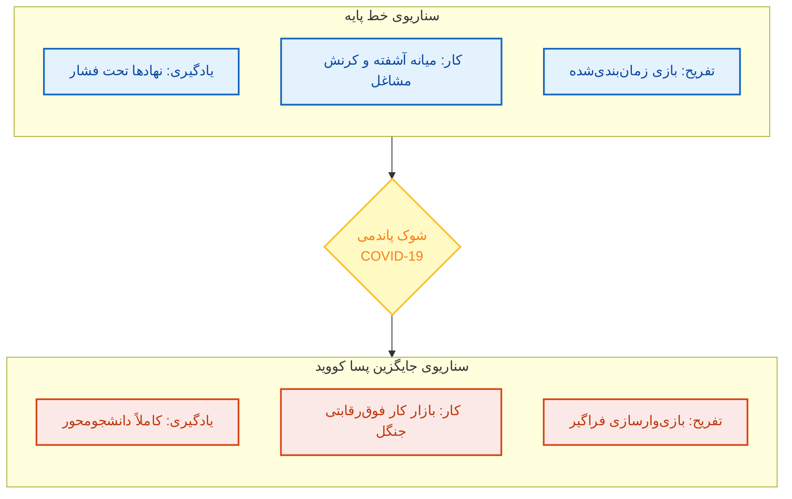
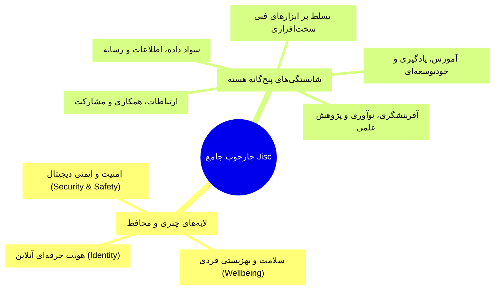
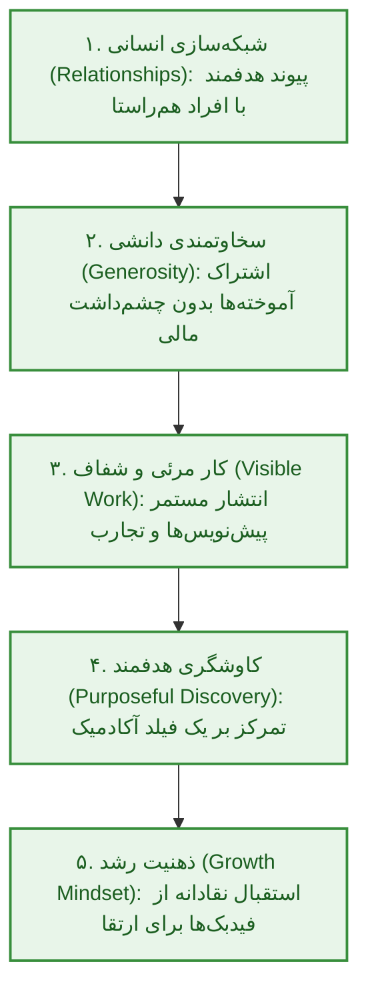
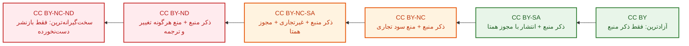
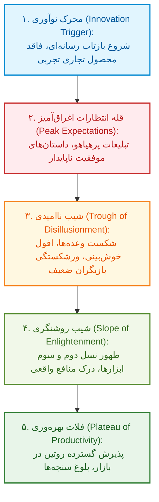
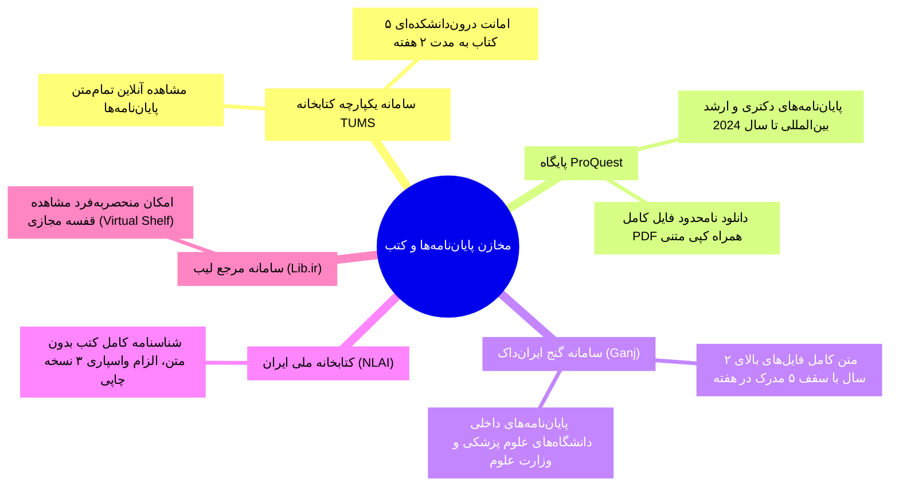
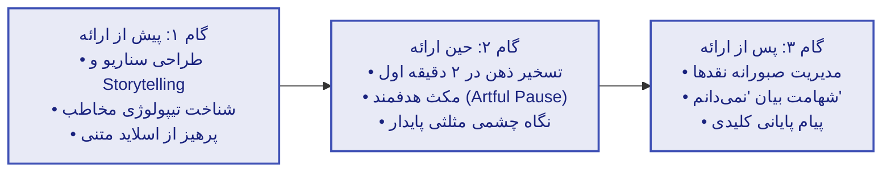
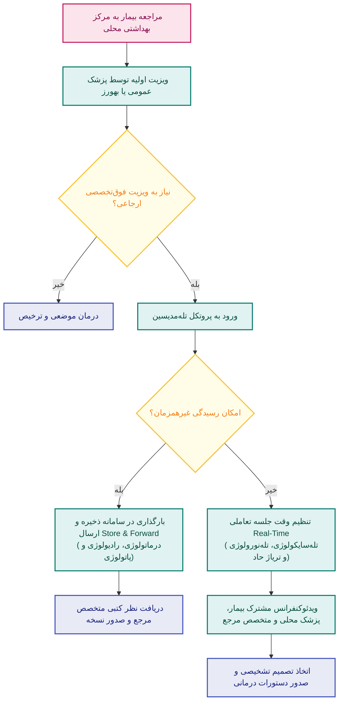

# خلاصه کل تکنولوژی و اصلاح‌رسانی

## ماژول ۱: سواد دیجیتال، برندینگ آکادمیک، هنجارهای وب و مالکیت فکری

### ۱.۱. آینده‌پژوهی آموزش عالی و زیست‌بوم نسل‌ها

> [!abstract] گذار راهبردی توازن قدرت (Balance of Power)
> در مطالعه افق ۲۰۲۵، مهم‌ترین تحول ساختاری، انتقال قدرت از **نهادهای صلب دانشگاهی** به سوی **دانشجویان و یادگیرندگان** است؛ فرآیندی که مرزهای میان آموزش، کار، بازی و زندگی را کاملاً در هم تنیده و یکپارچه می‌کند.

> [!warning] تله تستی کلیدی: تمایز سناریوی خط پایه (Baseline) و جایگزین (Alternative)
> پاندمی **کووید-۱۹** نقطه گسست قطعی از خط پایه به سناریوی جایگزین بود. در آزمون‌ها عناوین این دو ستون نباید جابه‌جا شوند:
> 1. حوزه یادگیری: تبدیل از *نهادهای تحت فشار* به الگوی کاملاً **دانشجو محور (Student-Centric)**.
> 2. حوزه کار: تبدیل از *کرنش طبقه متوسط (Messy Middle)* به فضای **بسیار رقابتی بازار کار (Welcome to the Jungle)**.
> 3. حوزه تفریح: تبدیل از *بازی برنامه‌ریزی‌شده (Scheduled Play)* به مفهوم **همه‌چیز بازی است (All Play)** مبتنی بر بازی‌وارسازی.

| مشخصه نسل | بازه تولد | فناوری و بستر ارتباطی غالب | شاخصه رفتاری و روانی | سطح سواد دیجیتال |
| :--- | :--- | :--- | :--- | :--- |
| **نسل سنتی (Maturists)** | 1925 تا 1945 | اتومبیل، نامه‌نگاری مکتوب رسمی | انضباط سنتی، وفاداری شغلی | مهاجر دیجیتال (Digital Immigrant) |
| **بیبی‌بومرها (Baby Boomers)** | 1945 تا 1965 | تلویزیون، تلفن ثابت سنتی | خوش‌بین، اهل منتورینگ، کارمحور | مهاجر دیجیتال |
| **نسل اکس (Gen X)** | 1965 تا 1980 | کامپیوتر شخصی (PC)، ایمیل | عمل‌گرا، مستقل، فردگرا | مهاجر دیجیتال |
| **نسل وای / هزاره (Gen Y)** | 1980 تا 1995 | موبایل، پیامک، شبکه‌های اجتماعی | **دارای اعتماد به نفس بالا**، کار تیمی | بومی دیجیتال انتقالی |
| **نسل زد (Gen Z)** | 1995 تا 2010 | گوشی هوشمند، رسانه‌های تعاملی | **رقابت‌جو (Competitive)**، بصری | **بومی دیجیتال واقعی (Digital Native)** |
| **نسل آلفا (Gen Alpha)** | 2010 به بعد | ادغام سایبر-فیزیکی، رابط هوش مصنوعی | **تصمیم‌گیرنده مستقل**، حساس به اخلاق | فرابومی دیجیتال مادرزاد |

> [!important] یافته‌های چالشی پژوهش‌ها درباره نسل زد (Gen Z)
> 1. **توهم تسلط فنی**: مهارت بالای نسل زد در شبکه‌های اجتماعی معادل مهارت دانشگاهی نیست؛ آنان در نرم‌افزارهای پایه‌ای آفیس (*PowerPoint* و *Excel*) و روش‌های تحلیل داده دچار **ضعف مفرط** هستند.
> 2. **نگرش به امنیت سایبری**: طبق آمار Alliance Cybersecurity، نسل زد با **64%** کمترین دغدغه را نسبت به حفظ امنیت داده‌ها دارد؛ در حالی که نسل خاموش با **87%** و بومرها با **85%** بالاترین پایبندی امنیتی را نشان می‌دهند.

---

### ۱.۲. چارچوب شایستگی سواد دیجیتال (Jisc) و فلسفه Work Out Loud

> [!abstract] سطوح سه‌گانه سواد تا شهروندی دیجیتال
> - **سواد دیجیتال (Digital Literacy)**: توانایی فنی و شناختی برای یافتن، اعتبارسنجی نقادانه و تولید ایمن داده‌ها.
> - **روانی دیجیتال (Digital Fluency)**: سطحی فراتر از سواد روتین؛ به‌کارگیری فناوری جهت **حل خلاقانه مسائل پیچیده** در شرایط ناشناخته.
> - **شهروند دیجیتال (Digital Citizen)**: کنشگری مسئولانه، اخلاق‌مدار، قانون‌مند و پایدار در بستر فضای مجازی.

---

### ۱.۳. بهینه‌سازی لینکدین در برابر سامانه شناسه ارکید (ORCID)

> [!warning] تله مهم امتحانی: دو حالت نشان Open to Work در لینکدین
> 1. حالت **عمومی (All LinkedIn Members)**: حلال سبزرنگ دور تصویر پروفایل همراه عبارت `#OpenToWork` الصاق شده و برای تمامی افراد شبکه قابل رویت است.
> 2. حالت **مخصوص استخدام‌کنندگان (Recruiters Only)**: نشان سبزرنگ الصاق نمی‌شود و وضعیت کاریابی صرفاً به کارشناسان استخدام دارای اکانت تجاری Recruiter نمایش داده می‌شود تا مانع تعارض شغلی در سازمان فعلی گردد.

| شاخص مقایسه‌ای | شبکه حرفه‌ای لینکدین (LinkedIn) | سامانه رجیستری ارکید (ORCID) |
| :--- | :--- | :--- |
| **هویت ساختاری** | شبکه اجتماعی تجاری و پایگاه برندینگ حرفه‌ای | **شناسه علمی یکتای ۱۶ رقمی غیرانتفاعی** |
| **تعامل اجتماعی** | پیام‌رسانی مستقیم، لایک، کامنت، ایجاد گروه | فاقد هرگونه ابزار گفت‌وگو، کامنت یا پیام شخصی |
| **شناسه کاربری** | آدرس متنی دلخواه پروفایل (Custom URL) | رشته کد عددی استاندارد بین‌المللی بر پروتکل URI |
| **نحوه به‌روزرسانی** | منحصراً دستی توسط دارنده حساب کاربری | هم دستی و هم **اتصال کاملاً خودکار به ناشران ISI** |
| **جایگاه در مقالات** | ابزار تکمیلی رزومه‌سازی و ارتباط با داوران | **درج الزامی در پروسه سابمیت مقالات و گرنت‌ها** |

---

### ۱.۴. پروتکل‌های نتیکت (Netiquette)، مدل فیلترینگ کلامی THINK و علم‌سنجی

> [!abstract] نتیکت و قاعده طلایی
> نتیکت آمیزه‌ای از *Network* و *Etiquette* و تنظیم‌کننده هنجارهای اخلاقی تعاملات برخط است. قاعده زرین آن عبارت است از: **انسان را به یاد داشته باش (Remember the Human)**.

> [!important] قواعد پرخطر ارتباط آنلاین در آزمون‌ها
> 1. نوشتن پیام انگلیسی با حروف کاپیتال (**ALL CAPS**) به منزله **فریاد زدن (Shouting)** و توهین است.
> 2. ارسال صوت (*Voice Note*) به اساتید و سلسله‌مراتب سازمانی بدون هماهنگی قبلی نقض صریح اتیکت حرفه‌ای است.
> 3. مدل **THINK** پیش از ارسال هر پیام باید پاسخگوی ۵ پرسش باشد: آیا **صحیح (True)** است؟ **مفید (Helpful)** است؟ **الهام‌بخش یا با حفظ پهنای باند (Inspiring)** است؟ **ضروری (Necessary)** است؟ **محترمانه و مهربان (Kind)** است؟
> 4. مخفف‌های پرتکرار: **FYI** (صرفاً جهت اطلاع)، **ASAP** (در اسرع وقت)، **BTW** (ضمناً)، **WTG** (کارت عالی بود)، **BRB** (الان برمی‌گردم).
> 5. شواهد علم‌سنجی مرور سولر-کاستا (2019): کل ادبیات ایندکس‌شده نتیکت مشتمل بر **18 مقاله** بود؛ تفکیک متدولوژی دقیقاً **50% مقالات تئوریک و 50% تجربی-مداخله‌ای**؛ ایالات متحده با 39% و بریتانیا با 22% بیشترین سهم پژوهش را داشتند.

---

### ۱.۵. حقوق مالکیت فکری (IP) و مجوزهای کریتیو کامانز (CC)

> [!abstract] ماهیت کپی‌رایت خودکار (Automatic Copyright)
> به محض خلق اثر و تثبیت آن روی یک حامل فیزیکی یا حافظه دیجیتال، حق نشر **به صورت خودکار و بدون نیاز به ثبت قبلی** استقرار می‌یابد؛ اما اقامه دعوی حقوقی در مراجع قضایی نیازمند ارائه سند ثبت رسمی اثر است.

> [!warning] مواعد زمانی انقضای کپی‌رایت و حقوق دانشگاهی
> 1. مؤلف حقیقی: مادام‌العمر به علاوه **70 سال پس از فوت پدیدآورنده**.
> 2. مؤلف حقوقی (سازمان‌ها): **95 سال از انتشار** یا **120 سال از زمان خلق** (هرکدام زودتر به پایان برسد).
> 3. تکالیف، داده‌ها و دستاوردهای دانشجویان **متعلق به خود دانشجو است**؛ اساتید حق بازنشر بدون اجازه صریح کتبی را ندارند. ادعای ناآگاهی از قوانین مالکیت فکری در محاکم پذیرفته نیست.
> 4. ابعاد کپی‌رایت مصداقی: فرمول نوشابه = *راز تجاری*؛ لوگو = *علامت تجاری*؛ فرم بطری = *طرح صنعتی*؛ شعار وبگاه = *کپی‌رایت*.

---

## ماژول ۲: چرخه حیات فناوری، آموزش باز (OER & MOOCs) و بازیابی اطلاعات پزشکی

### ۲.۱. فازهای پنج‌گانه هایپ سایکل گارتنر (Gartner Hype Cycle)

> [!abstract] تعریف فناوری نوظهور (Emerging Technology)
> فناوری‌هایی با پتانسیل برهم‌زنندگی بنیادین که هنوز به **استقرار روزمره، همگانی و تثبیت‌شده** در بدنه اصلی جامعه تبدیل نشده‌اند. دو فرض نادرست درباره آن‌ها وجود دارد: اول آنکه لزوماً اختراع تازه نیستند و دوم آنکه درک بشر از آینده و مخاطرات آن‌ها کاملاً ناقص است.

> [!warning] نکات تستی پیرامون نمودار گارتنر
> 1. بهترین زمان برای سرمایه‌گذاری یا شروع پروژه استارتاپی (**Sweet Spot**): *اواخر شیب ناامیدی یا اوایل شیب روشنگری* است؛ زیرا رقبای هیجانی حذف شده و کاربرد واقعی تثبیت شده است.
> 2. علائم زمانی رسیدن به فلات: دایره سفید توخالی (کمتر از ۲ سال)، آبی کم‌رنگ (۲ تا ۵ سال)، آبی پررنگ (۵ تا ۱۰ سال)، مثلث (بیش از ۱۰ سال)، علامت ضربدر قرمز (**منسوخ شدن پیش از رسیدن به فلات**).

---

### ۲.۲. منابع آموزشی باز (OER) و گونه‌شناسی دوره‌های موک (MOOCs)

> [!abstract] چارچوب حقوق پنج‌گانه منابع باز (5R Framework)
> ۱. **حق نگهداری (Retain)**: دانلود و ذخیره مادام‌العمر نسخه منبع.
> ۲. **حق استفاده مجدد (Reuse)**: بازاستفاده عینی در کلاس و پلتفرم‌ها.
> ۳. **حق ویرایش (Revise)**: اصلاح، ترجمه و بومی‌سازی متون.
> ۴. **حق بازترکیب (Remix)**: تلفیق محتوا با سایر ابزارهای آموزشی.
> ۵. **حق بازتوزیع (Redistribute)**: اشتراک نسخه‌های اصلی یا ویرایش‌شده با جامعه.

| مدل دوره آنلاین | پایه تئوریک و فلسفه یادگیری | فرایند تولید محتوا و تعامل | وضعیت برنامه درسی و آزمون | پلتفرم‌های عینی شاخص |
| :--- | :--- | :--- | :--- | :--- |
| **دوره‌های رابطه‌گرا (cMOOC)** | نظریه ارتباط‌گرایی (Connectivism) | محتوا محصول **تعامل شبکه‌ای فراگیران** با یکدیگر است | بدون سیلابس صلب؛ مسیر گفتگو تعیین‌کننده است | نخستین دوره‌های تجربی سال 2008 استنفورد |
| **دوره‌های تعمیمی (xMOOC)** | مدل انتقالی آکادمیک کلاسیک | تدریس متمرکز اساتید؛ محتوا مصرف‌محور است | سیلابس تقویم‌محور صلب، تکالیف هفتگی و اعطای مدرک | عموم دوره‌های سامانه‌های بزرگ Coursera و edX |
| **شبه موک‌ها (Quasi-MOOC)** | مخازن درس‌افزارهای باز (q-Course) | مطالعه مستقل غیرهمزمان متون و فیلم‌ها بدون استاد | فاقد تقویم پایان دوره، فاقد کلاس و بدون صدور مدرک | آکادمی خان (Khan Academy) و درس‌افزارهای MIT |
| **دوره‌های ترکیبی (bMOOC)** | الگوی چندگانه تلفیقی (Blended) | ترکیب محتوای آنلاین با کارگاه‌های عملی و حضوری | ارزیابی تلفیقی تکالیف برخط با آزمون‌های حضوری | سامانه‌های دانشگاهی ادغام‌شده در LMS نوید |

> [!important] ریشه‌یابی نرخ بالای ریزش فراگیران (Drop-Out Rate) و وضعیت سامانه آرمان
> 1. افت فراگیران در موک‌ها **لزوماً به معنای شکست آموزشی نیست**؛ زیرا عده زیادی از افراد صرفاً برای پر کردن شکاف موقت دانشی خود وارد یک ماژول خاص شده و پس از دستیابی به آن، دوره را ترک می‌کنند.
> 2. سامانه ملی موک ایران (**آرمان**) دارای ۴ سطح بوده است: *آموزه*، *پودمان*، *دوره* و *درس دانشگاهی*. به دلیل متوقف ماندن بخش پودمان و دوره و فعالیت اختصاصی دو بخش آموزه و درس، پلتفرم آرمان در ساختار فعلی یک **شبه موک (Quasi-MOOC)** محسوب می‌شود.

---

### ۲.۳. بازیابی اطلاعات، گوگل اسکالر در برابر سمانتیک اسکالر

> [!abstract] ارزیابی علم‌سنجی گوگل اسکالر در شاخص‌های مجلات
> - **شاخص h5-index**: بزرگ‌ترین عدد $h$ به نحوی که مجله در طول ۵ سال گذشته حداقل $h$ مقاله با حداقل $h$ بار استناد داشته باشد.
> - **شاخص h5-median**: میانه استنادات دریافتی مقالاتی که تشکیل‌دهنده عدد h5-index مجله بوده‌اند.

| معیار سنجش | گوگل اسکالر (Google Scholar) | سمانتیک اسکالر (Semantic Scholar) | پایگاه وب آو ساینس (Web of Science) |
| :--- | :--- | :--- | :--- |
| **مبنای استخراج داده** | تطابق کلیدواژگانی، شمارش خام ارجاعات | هوش مصنوعی، یادگیری ماشین و درک معنایی | ساختار نمایه‌سازی استنادی صلب و گزینش‌شده ISI |
| **خلاصه‌سازی اسناد** | ندارد (فقط چکیده اولیه نویسندگان) | قابلیت هوشمند **خلاصه یک‌خطی مقاله (TLDR)** | ندارد (صرفاً ارائه چکیده نویسندگان) |
| **وزن‌دهی به استنادها** | تمام استنادها هم‌وزن و یکسان شمارش می‌شوند | جداسازی استنادات اساسی با **Highly Influential** | تحلیل غنی ارجاعات با استناد به مبانی متن |
| **پوشش حق اختراع** | **دارد** (با فیلتر اختصاصی چک‌باکس Patents) | ندارد (منحصراً بر مقالات داوری‌شده ژورنال‌ها) | نیازمند اتصال جداگانه به Derwent Innovations |
| **مدل مالی دسترسی** | کاملاً رایگان عمومی برای عموم پژوهشگران | کاملاً رایگان بر بستر اینترنت آزاد | سامانه تجاری با اشتراک بسیار سنگین دانشگاهی |

---

### ۲.۴. زیست‌بوم کتابخانه‌های دیجیتال و پایگاه‌های استنادی علوم پزشکی

> [!warning] وضعیت اضطراری اتصالات پایگاهی در دانشگاه علوم پزشکی تهران
> 1. اشتراک رسمی اغلب دیتابیس‌های معتبر بین‌المللی (Scopus و Reaxys) به دلیل تحریم قطع است.
> 2. سامانه اتصال راه دور **V.Campus به پایگاه‌های علمی پولی وصل نمی‌شود**.
> 3. سامانه‌های **Web of Science** و **UpToDate** منحصراً با **تنظیم کابل شبکه بر روی IP داخلی بیمارستان‌ها و دانشکده‌ها** باز می‌شوند.
> 4. ایمیل آکادمیک دانشگاهی **بلافاصله پس از تسویه‌حساب فارغ‌التحصیلی حذف می‌شود**؛ سابمیت مقالات با ایمیل‌های غیررسمی مانند Gmail در ژورنال‌های معتبر نامعتبر تلقی می‌گردد.

---

## ماژول ۳: هوش مصنوعی پزشکی، ارائه علمی، اسلایدسازی و تله‌مدیسین

### ۳.۱. هوش مصنوعی در پزشکی: مبانی، سامانه‌ها و آزمون تورینگ

> [!abstract] آزمون تورینگ (Turing Test - 1950)
> آزمونی که در آن یک بازجوی انسانی با دو ترمینال کور گفت‌وگو می‌کند؛ در صورتی که نتواند تشخیص دهد کدام پاسخ از سوی هوش مصنوعی صادر شده و کدام متعلق به انسان است، سیستم موفق به قبولی در آزمون شده است.

> [!warning] تله تستی پیرامون سطح کنونی هوش مصنوعی
> کلیه فناوری‌های حاضر در علوم پزشکی، آموزش و بهداشت از نوع **هوش مصنوعی ضعیف یا محدود (Narrow AI)** هستند و فقط در وظایف تعیین‌شده و محدود تبحر دارند. **هوش مصنوعی عمومی (AGI)** با قابلیت هم‌ترازی با کل ادراک بشر *هنوز خلق نشده است*.

| نام تجاری سامانه هوش مصنوعی | شعار هویتی برند (Slogan) | کاربرد و ارزش افزوده بالینی |
| :--- | :--- | :--- |
| **Hippocratic AI** | *Safety-first AI for health care* | سیستم تصمیم‌یار بالینی با تمرکز انحصاری بر اصل عدم آسیب |
| **Viz.ai** | *Closing gaps between patients, clinicians & treatments* | شناسایی هوشمند زودهنگام ترومبوز عروق مغزی، سکته و تروما |
| **PathAI** | *Improving Patient Outcomes with AI-Powered Pathology* | بهبود دقت تفکیک نمونه‌های بافت‌شناسی و پاتولوژی انکولوژی |
| **Caption Health** | *Imagine what an earlier picture of your heart could mean* | راهنمایی خودکار پروب برای اخذ تصاویر اکوکاردیوگرافی استاندارد |
| **Linus Health** | *Unlock early detection of Alzheimer's and other dementias* | غربالگری شناختی دیجیتال پیش از بروز نشانه‌های بارز آلزایمر |
| **DAX Copilot** | *Automated Clinical Documentation* | شنود و رونویسی بلادرنگ دیالوگ ویزیت و تنظیم فوری شرح‌حال |
| **Cleerly** | *How many beats dance with your date* | تحلیل تصویربرداری و رسوب پلاک‌های چربی عروق کرونر |
| **VirtuSense** | *#1 Fall Prevention Solution* | بینایی ماشین برای پیش‌بینی سقوط سالمندان در بخش‌های بستری |

> [!important] ۵ اصل پرامپت‌نویسی استاندارد و خطوط قرمز اخلاقی یونسکو
> 1. پرامپت استاندارد: **دقیق و مشخص بودن**، به‌کارگیری **سوالات بازپاسخ** جهت عمق‌بخشی، **سادگی واژگان**، **ارائه بافت و شرح‌حال زمینه**، و **پالایش رفت‌وبرگشتی تدریجی**.
> 2. خطوط قرمز: ممنوعیت قطعی وارد کردن **داده‌های هویتی بیمار (PII)** در هوش مصنوعی‌های عمومی؛ ابزارهای هوش مصنوعی بدون مجوز **FDA یا وزارت بهداشت** حق صدور دستور بالینی ندارند؛ استفاده از هوش مصنوعی برای تولید تکالیف درسی **تقلب علمی محض** است و **مسئولیت قصور بالینی هرگز از پزشک سلب نخواهد شد**.

---

### ۳.۲. اصول ارائه آکادمیک و متدولوژی مهندسی اسلاید

| شیوه سخنرانی علمی | فواید و مزیت‌ها | آسیب‌ها و معایب اساسی | سطح توصیه‌پذیری آکادمیک |
| :--- | :--- | :--- | :--- |
| **حفظ کامل کلمات (Memorization)** | حفظ تماس پیوسته چشمی با مخاطبان | خطر فراموشی ناگهانی بر اثر استرس، ناتوانی در بداهه‌گویی | مردود و به شدت پرریسک |
| **روخوانی مستقیم از متن (Reading)** | دقت کامل علمی و عددی، آرامش روانی موقت | قطع کامل ارتباط چشمی، **ایجاد لحن کاملاً یکنواخت و کسل‌کننده** | نامناسب؛ تنزل دفاع آکادمیک |
| **صحبت کاملاً بداهه (Speaking Freely)** | کاملاً طبیعی، القای حس تسلط و صمیمیت | احتمال بالای پرگویی و خطای آماری فاحش | پرریسک؛ نامناسب برای دفاع |
| **روایت با یادداشت و تصویر (Visuals)** | **تعادل بهینه دقت، بداهه‌گویی و تماس چشمی** | نیازمند تسلط بر فن بیان و تمرین آزمایشی | **مدل طلایی استاندارد جهانی** |

> [!important] قواعد مهندسی اسلایدسازی
> 1. تحول تراکم اطلاعات: گذار از قاعده سنتی ۶۶ (۶ خط، ۶ کلمه) به **قاعده بهینه ۳۳ (حداکثر ۳ موضوع در اسلاید و حداکثر ۳ کلمه در هر خط)**.
> 2. اصل چیدمان چندرسانه‌ای: **متن فارسی در سمت راست و تصویر در سمت چپ**؛ در متن انگلیسی برعکس.
> 3. تایپوگرافی و کنتراست: برای پرده نمایش حداقل فونت **32** (فونت‌های ۱۲ تا ۱۴ فقط ویژه مطالعه انفرادی روی مانیتور هستند). قانون پرده عبارت است از **متن روشن بر زمینه تیره**، برعکس قانون چاپ بر روی کاغذ.

---

### ۳.۳. سیستم‌های پزشکی از راه دور (Telemedicine) و گردش کار بالینی

> [!abstract] تفکیک سلامت از دور و تله‌مدیسین
> - **سلامت از دور (Telehealth)**: چتر فراگیر تمامی مراقبت‌های سلامتی، اداری، آموزشی و پیگیری‌های بهداشتی از دور.
> - **پزشکی از دور (Telemedicine)**: زیرمجموعه بالینی آن که به **تشخیص، ویزیت و درمان مستقیم بیمار** توسط پزشک از بستر مخابراتی اطلاق می‌گردد.

> [!warning] چالش‌های پنج‌گانه استقرار و ملاحظات قصور پزشکی در ایران
> 1. چالش‌های ساختاری: عدم پذیرش همکارانه بیمارستان‌های قطب مرجع، مقاومت فرهنگی کادر درمان، نوسانات پهنای باند اینترنت، ابهام قانونی در تعرفه‌گذاری مالی ویزیت‌های مجازی، و نبود قانون صریح پیرامون **قصور پزشکی (Malpractice)**.
> 2. مسئولیت بالینی پزشک: در هر مرحله از تله‌مدیسین، چنانچه کیفیت مدارک ارسالی نامطلوب باشد یا حال عمومی بیمار نیازمند لمس و سمع باشد، پزشک مکلف است فرآیند از راه دور را متوقف کرده و **دستور اعزام و ارجاع فیزیکی فوری** صادر نماید.