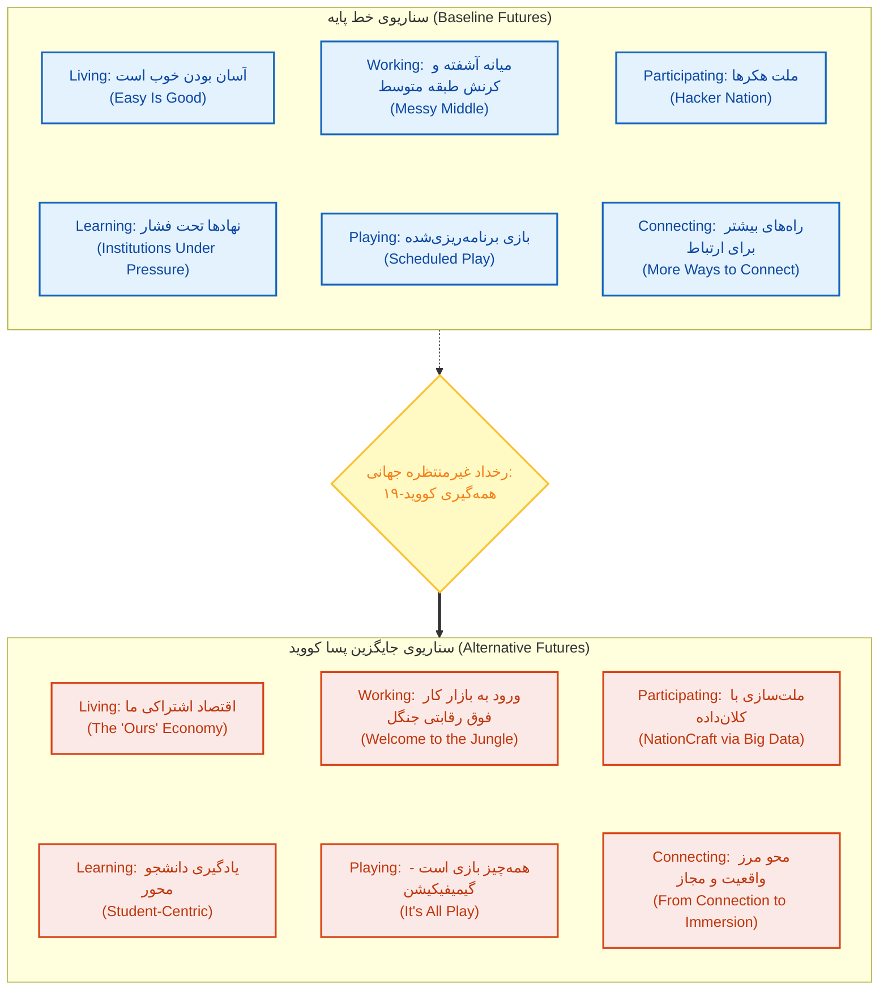
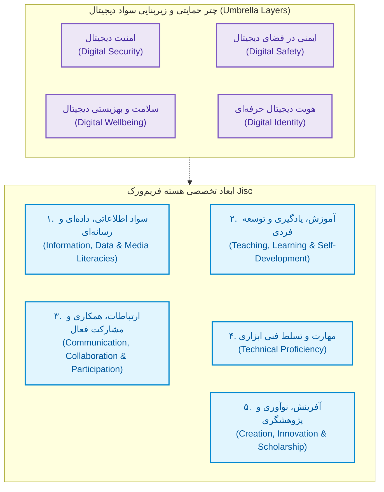
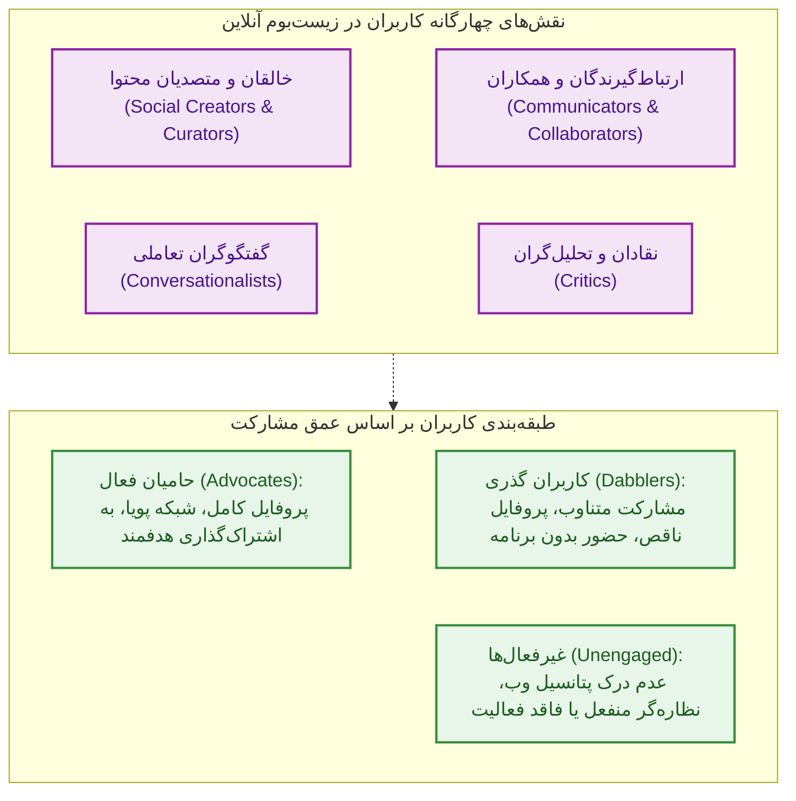
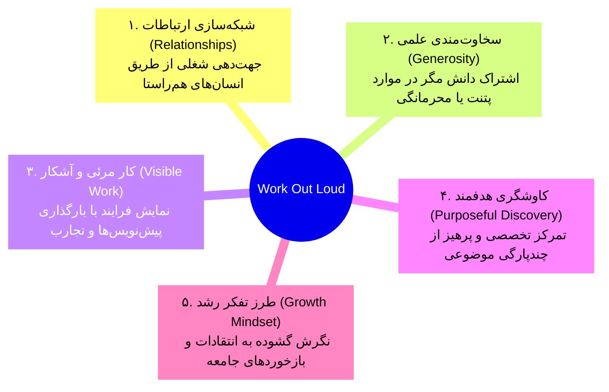
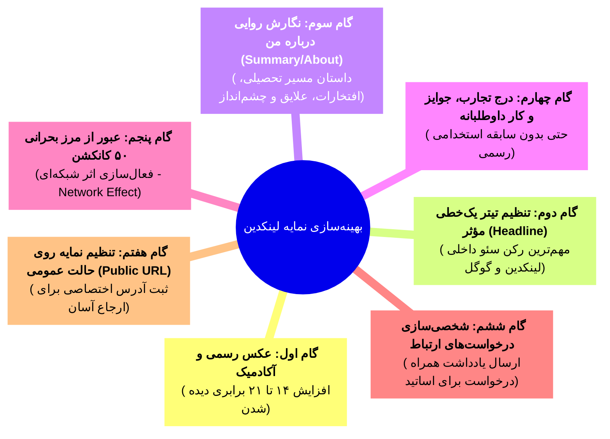
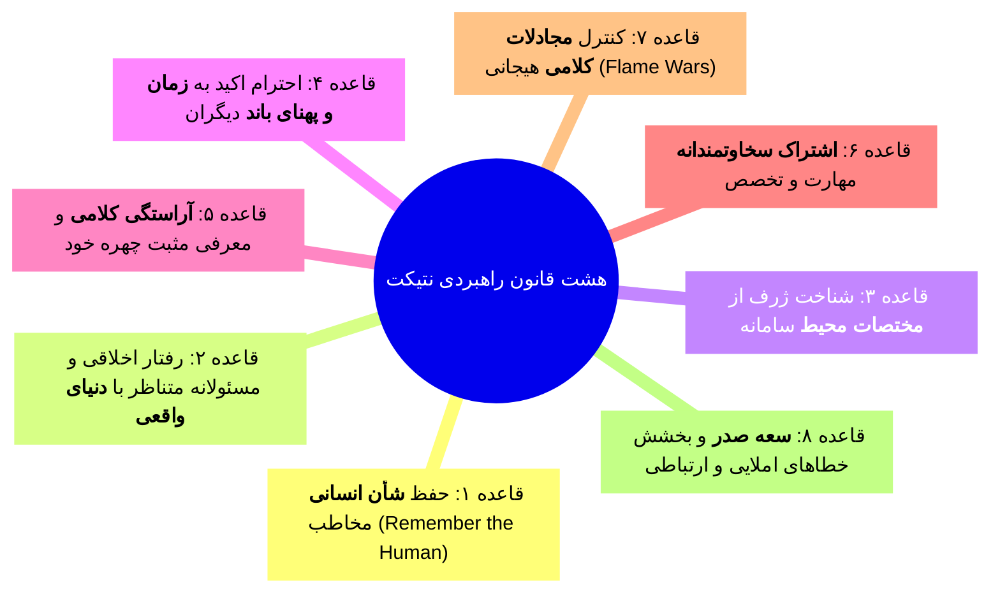
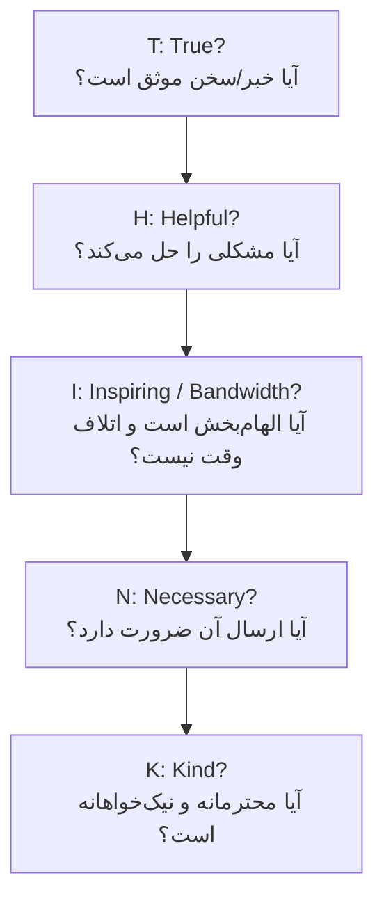
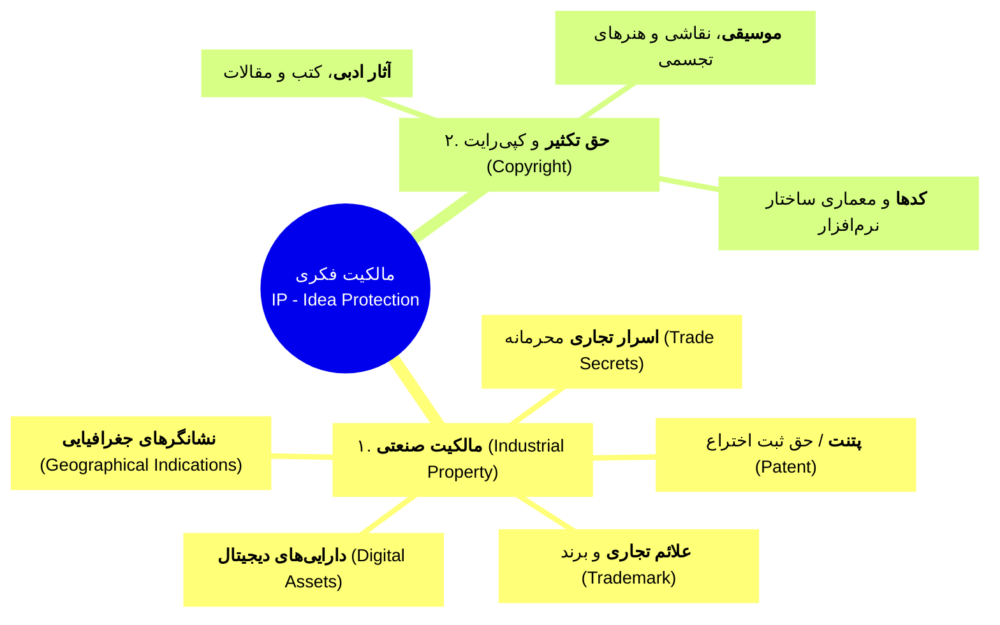
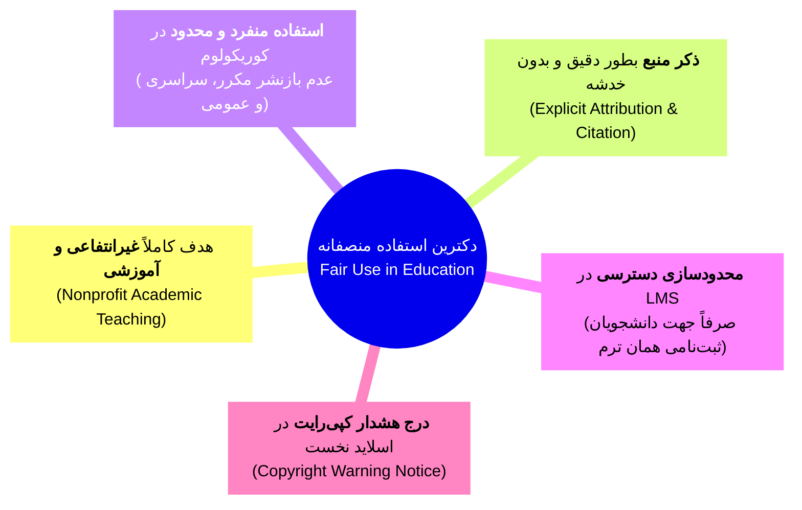
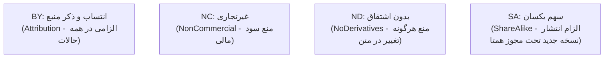

# بخش اول: سواد دیجیتال، برندینگ علمی و حقوق مالکیت فکری

## بخش ۱: سواد دیجیتال، آینده‌پژوهی آموزش و تحلیل نسل‌ها (جلسه ۱)

### ۱.۱. آینده‌پژوهی آموزش عالی و تحول الگوها (مطالعه ۲۰۱۴ برای افق ۲۰۲۵)

مطالعه آینده‌پژوهی افق ۲۰۲۵ به بعد، زیست‌بوم دانشجویی را در ۶ حوزه حیاتی تحلیل کرده است: **زندگی کردن (Living)**، **یادگیری (Learning)**، **کار کردن (Working)**، **بازی کردن (Playing)**، **مشارکت مدنی (Participating)** و **ارتباطات (Connecting)**.

> [!abstract] گذار بنیادین در آینده‌پژوهی سلامت و آموزش
> مهم‌ترین دستاورد مطالعه خط پایه این بود که **توازن قدرت (Balance of Power)** از ساختارهای متمرکز مؤسسات آموزشی به سمت **دانشجویان و فراگیران** چرخش خواهد کرد. همچنین مرزهای صلب میان آموزش، کار، زندگی و بازی کاملاً **محو و یکپارچه** می‌شوند.

> [!warning] تله تستی مهم: تفکیک خط پایه (Baseline) و سناریوی جایگزین پسا کووید (Alternative)
> در آزمون‌ها مفاهیم این دو سناریو به‌صورت متقابل جابه‌جا می‌شوند. رخداد **همه‌گیری کووید-۱۹** نقطه انحراف قطعی از خط پایه به سمت سناریوی جایگزین بود:
> 1. در حوزه یادگیری: خط پایه بر *نهادها تحت فشار* تمرکز داشت؛ سناریوی جایگزین بر الگوی کاملاً **دانشجو محور (Student-Centric)** متمرکز شد.
> 2. در حوزه بازی: خط پایه از *بازی هدفمند و زمان‌بندی‌شده (Scheduled Play)* یاد می‌کرد؛ سناریوی جایگزین با مفهوم **همه‌چیز بازی است (All Play)** و ادغام عمیق **بازی‌وارسازی (Gamification)** شناخته می‌شود.
> 3. در حوزه کار: خط پایه پدیده *کرنش مشاغل طبقه متوسط و میانه آشفته* را پیش‌بینی کرد؛ سناریوی جایگزین محیط کار را به یک **جنگل رقابتی (Welcome to the Jungle)** ناشی از سرعت هوش مصنوعی تبدیل نمود.

---

### ۱.۲. مقایسه تطبیقی نسل‌های دیجیتال

نسل‌های فناورانه بر مبنای تحولات ابزارهای ارتباطی و شیوه زیست دسته‌بندی می‌شوند:

| نسل (Generation) | بازه زمانی تولد | ابزار و شاخص اصلی ارتباطی | ویژگی بارز هویتی | وضعیت سواد فناوری |
| :--- | :--- | :--- | :--- | :--- |
| **نسل سنتی / خاموش (Maturists)** | 1925 تا 1945 | اتومبیل، نامه‌نگاری رسمی (Formal letter) | پایبندی سنتی و کارمحور | مهاجر دیجیتال (Digital Immigrant) |
| **بیبی بومرها (Baby Boomers)** | 1945 تا 1965 | تلویزیون، ارتباطات تلفنی سنتی | خوش‌بین، اهل منتورینگ، تعهد اخلاقی | مهاجر دیجیتال |
| **نسل اکس (Generation X)** | 1965 تا 1980 | کامپیوتر شخصی (PC)، آغاز ایمیل | مستقل، عمل‌گرا، سازگار | مهاجر دیجیتال |
| **نسل وای / هزاره (Millennials)** | 1980 تا 1995 | تلفن همراه، پیامک و وب شبکه‌ای | **با اعتماد به نفس (Confident)**، کار مشارکتی | بومی دیجیتال پایه / انتقالی |
| **نسل زد (Generation Z)** | 1995 تا 2010 | هوش مصنوعی، گوشی هوشمند، رسانه‌های تعاملی | **رقابت‌جو (Competitive)**، بصری، بازه تمرکز کوتاه | **بومی دیجیتال (Digital Native)** |
| **نسل آلفا (Gen Alpha)** | 2010 به بعد | زیست کاملاً متصل، ادغام سایبر-فیزیکی، پسا کووید | **تصمیم‌گیرنده (Decision-Maker)**، حساس به اخلاق فناوری | فرابومی دیجیتال مادرزاد |

> [!important] یافته‌های چالشی پژوهش درباره نسل زد (Gen Z)
> ۱. **توهم تسلط دیجیتال**: نسل زد علیرغم روان بودن در مصرف شبکه‌های اجتماعی، در کاربست *تخصصی و آکادمیک* فناوری اطلاعات و ابزارهای پایه‌ای آفیس (PowerPoint و Excel) ضعف مفرط دارند.
> ۲. **پژوهش ژاپن**: با وجود تجهیز ۱۰۰% دانشجویان ورودی به گوشی هوشمند و رایانه، کاربری تحلیلی و پیشرفته آنان در بدو ورود به دانشگاه بسیار نازل بود.
> ۳. **مطالعه سایمون و همکاران**: شایستگی فنی روزمره نباید با مهارت دانشگاهی اشتباه گرفته شود؛ آموزش ساختاریافته دانشگاهی پیش از ورود و حین تحصیل اجتناب‌ناپذیر است.

---

### ۱.۳. سلسله‌مراتب شناختی و چارچوب مفهومی سواد دیجیتال (Jisc Framework)

> [!abstract] تعریف سواد دیجیتال (Digital Literacy)
> توانایی به‌کارگیری فناوری اطلاعات و ارتباطات برای **یافتن**، **ارزیابی نقادانه**، **تولید محتوا** و **انتقال داده‌ها** که حاصل امتزاج مهارت‌های فنی (Technical) با دانایی محتوایی و شناختی (Cognitive) است.

> [!abstract] تعریف روانی دیجیتال (Digital Fluency)
> سطحی متعالی‌تر از سواد مقدماتی که در آن فرد فناوری را نه صرفاً برای اجرای روتین‌ها، بلکه برای **حل مسئله خلاقانه**، تولید راهکارهای نوآورانه و تصمیم‌گیری در بافت‌های ناشناخته به کار می‌گیرد.

> [!abstract] تعریف شهروند دیجیتال (Digital Citizen)
> فردی که رفتار آنلاین خود را بر پایه **اصول اخلاقی حاکم بر فضای مجازی** تنظیم کرده، تعارضات بین‌فردی را هوشمندانه مدیریت می‌کند و به‌صورت مسئولانه و پایدار به تبادل منابع می‌پردازد.

---

## بخش ۲: حضور آنلاین آکادمیک و متدولوژی Work Out Loud (جلسه ۳)

### ۲.۱. دسته‌بندی نقش‌ها و رفتار کاربران در فضای مجازی

> [!abstract] تعریف ردپای دیجیتال (Digital Footprint)
> مجموعه تمامی کنش‌ها، پست‌ها، داده‌ها، نظرات و رکوردهایی که کاربر از خود در سرورها و بسترهای آنلاین برجای می‌گذارد. طبق قاعده آکسیوماتیک وب: **اینترنت ابدی است (The Internet is Forever)** و هیچ داده‌ای به‌طور کامل محو نخواهد شد.

> [!warning] نکته امتحانی: آمارهای نگرش به امنیت آنلاین میان نسل‌ها
> بر اساس داده‌های پژوهشی Alliance Cybersecurity:
> - **نسل زد (Gen Z)** با ۶۴% کمترین میزان توافق را با اولویت‌بندی امنیت آنلاین دارد (۲۷% ممتنع و ۹% مخالف).
> - بالاترین پایبندی به اولویت امنیت متعلق به **نسل خاموش (Silent Gen)** با ۸۷% و سپس **بیبی‌بومرها** با ۸۵% است؛ لذا طراحان سامانه‌های پزشکی باید *بی‌پروایی نسبی نسل زد* را لحاظ نمایند.

---

### ۲.۲. پنج رکن بنیادین مدل «با صدای بلند کار کنید» (Work Out Loud)

> [!abstract] تعریف کار با صدای بلند (Work Out Loud - WOL)
> رویکردی ساختاریافته برای عمومی‌سازی فرایند یادگیری، فعالیت و پژوهش در راستای ارتقای اعتبار شغلی و ایجاد پیوندهای هم‌افزای علمی پیش از نیاز فوری به همکاری.

---

## بخش ۳: سامانه‌های راهبردی لینکدین و ارکید (جلسه ۴)

### ۳.۱. شبکه حرفه‌ای لینکدین (LinkedIn Analytics & Setup)

لینکدین با دارا بودن صدها میلیون کاربر و حضور فعال ده‌ها میلیون مدیر تصمیم‌گیر، سکوی ارتقای شغلی است. 

> [!important] آمارهای کلیدی تعامل در لینکدین
> - داشتن یک **عکس پروفایل استاندارد و حرفه‌ای** (با زمینه خنثی و در پوشش آکادمیک/روپوش سفید) شانس مشاهده پروفایل را بین **۱۴ تا ۲۱ برابر** افزایش می‌دهد.
> - نرخ دریافت پیام مستقیم با تصویر استاندارد **۳۶ برابر** افزایش می‌یابد.

> [!warning] تله تستی پیرامون نشان Open to Work
> تنظیم فعال‌سازی نشان کاریابی به دو گونه است:
> 1. نمایش برای **عموم کاربران (All LinkedIn Members)**: حلال سبزرنگ بر دور عکس با عبارت `#OpenToWork` الصاق می‌گردد.
> 2. نمایش **صرفاً برای کارفرمایان و استخدام‌کنندگان (Recruiters Only)**: هیچ هلال سبزی بر روی پروفایل عمومی درج نخواهد شد تا تعارض منافع در موقعیت فعلی رخ ندهد.

---

### ۳.۲. شناسه پژوهشگری ارکید (ORCID)

> [!abstract] شناسه ارکید (Open Researcher and Contributor ID)
> ارکید **شبکه اجتماعی نیست**؛ بلکه شناسه‌ای بین‌المللی، یکتا و ۱۶ رقمی بر بستر پروتکل URL است که برای انتساب قطعی آثار علمی و رفع معضل *تشابه اسمی* پژوهشگران طراحی شده است.

| مولفه | شبکه حرفه‌ای لینکدین (LinkedIn) | شناسه علمی ارکید (ORCID) |
| :--- | :--- | :--- |
| **ماهیت سامانه** | شبکه اجتماعی تجاری و فرصت‌یابی شغلی | رجیستری و **شناسه یکتای غیراحتکاری آکادمیک** |
| **شناسه کاربری** | پیوند متنی سفارشی نمایه (Custom Profile URL) | رشته ۱۶ رقمی دیجیتال اختصاصی استاندارد |
| **تعاملات اجتماعی** | لایک، هم‌رسانی، ارسال پیام مستقیم و کامنت | فاقد ابزار گفت‌وگو؛ صرفاً مخزن اعتبارسنجی سوابق |
| **به‌روزرسانی داده‌ها** | دستی توسط شخص کاربر | هم دستی و هم **کاملاً خودکار از طریق ناشران** |
| **کاربرد در انتشارات** | رزومه‌سازی و ارتباط با مدیران | **درج الزامی در مقالات ISI، اسکوپوس و گرنت‌ها** |

---

## بخش ۴: آداب معاشرت دیجیتال (Netiquette) و الگوی THINK (جلسه ۵)

### ۴.۱. قواعد بنیادین نتیکت و آزمون‌های خودارزیابی

> [!abstract] تعریف نتیکت (Netiquette)
> ترکیب واژگان Network و Etiquette؛ بیانگر کدهای رفتاری، هنجارهای ارتباطی و پروتکل‌های احترام‌محور در تعاملات برخط فردی و گروهی است.

> [!important] قاعده طلایی (The Golden Rule)
> **انسان را به یاد داشته باش (Remember the Human)**. همواره در نظر داشته باشید که در سوی دیگر نمایشگر، فردی دارای احساس و منزلت انسانی نشسته است.

> [!warning] تله‌های تشخیصی در فرهنگ ارتباطی آنلاین
> - **تایپ با حروف بزرگ (Capital Letters)**: در عرف وب، نوشتن جملات انگلیسی با حروف کاپیتال مساوی با **فریاد زدن (Shouting) و عصبانیت** تلقی شده و نقض بارز نتیکت است.
> - **گرامر و علائم نگارشی**: رعایت قواعد نگارشی و نقطه‌گذاری اختیاری نیست؛ بلکه **همیشه و در همه بافت‌ها** الزامی است.
> - **پیام صوتی (Voice Note)**: ارسال صوت به مقامات دانشگاهی، اساتید یا مدیران بدون کسب اجازه قبلی *رفتاری کاملاً غیرحرفه‌ای* محسوب می‌شود.

---

### ۴.۲. مدل پالایش ارتباطی THINK و جدول اختصارات وب

| اختصار (Shorthand) | عبارت کامل انگلیسی | مفهوم کاربردی |
| :--- | :--- | :--- |
| **FYI** | For Your Information | صرفاً جهت اطلاع شما (بدون نیاز فوری به اقدام) |
| **ASAP** | As Soon As Possible | در اولین فرصت ممکن و با فوریت بالا |
| **BTW** | By The Way | ضمناً / راستی (طرح موضوع حاشیه‌ای) |
| **LOL** | Laugh Out Loud | خندیدن با صدای بلند |
| **WTG** | Way To Go | کارت عالی بود / آفرین به این پیشرفت |
| **TTUL** | Talk To You Later | بعداً با هم صحبت خواهیم کرد |
| **BFN** | Bye For Now | فعلاً خداحافظ |
| **BRB** | Be Right Back | زود برمی‌گردم (ترک موقت صفحه چت) |
| **CUL** | See You Later | بعداً می‌بینمت |
| **IDK** | I Don't Know | پاسخی ندارم / اطلاعی در دست نیست |
| **JK / JJ** | Just Kidding / Just Joking | صرفاً شوخی کردم |
| **TYVM** | Thank You Very Much | بسیار سپاسگزارم |

> [!important] شواهد علم‌سنجی نتیکت (مطالعه مروری سولر-کاستا ۲۰۱۹)
> بر پایه مرور سیستماتیک مقالات ایندکس‌شده تا سال ۲۰۱۹:
> ۱. این حوزه بسیار نوپا بوده و تنها **۱۸ مقاله** ایندکس‌شده درباره آن به ثبت رسیده است.
> ۲. ساختار مقالات به تساوی دقیق تقسیم شده: **۵۰% نظریه‌پردازی محض (Theoretical)** و **۵۰% مداخله‌ای-تجربی (Empirical)**.
> ۳. توزیع جغرافیایی مطالعات: ۳۹% ایالات متحده (۷ مقاله)، ۲۲% بریتانیا (۴ مقاله)، ۱۷% سایر کشورهای اروپایی (۳ مقاله) و ۲۲% سایر ملل جهان (۴ مقاله). روند نظری از سال ۱۹۹۵ آغاز و در ۲۰۰۷ شکوفا شد.

---

## بخش ۵: حقوق مالکیت فکری (IP)، کپی‌رایت و کریتیو کامانز (جلسه ۱۲)

### ۵.۱. ساختار جامع مالکیت فکری (Intellectual Property)

> [!abstract] تعریف مالکیت فکری (IP)
> واژه‌ای چتری دال بر تمامی آفرینش‌های فکری و ذهنی غیرملموس انسان که قانون از حقوق مؤلف یا مؤسس آن در برابر تصاحب بدون مجوز (تعدی یا Infringement) محافظت می‌کند. مالکیت معنوی مشمول انقضای زمانی بوده و ابدی نیست.

> [!warning] تفکیک امتحانی شاخه‌های مالکیت فکری بر پایه مصادیق عینی
> - **در محصول فیزیکی (مانند کوکاکولا)**: فرمول شربت = *راز تجاری*؛ نشان نوشتاری Coca-Cola = *علامت تجاری (®)*؛ فرم مهندسی بطری = *طراحی صنعتی/ترید درس*؛ متون تبلیغاتی و وبگاه = *کپی‌رایت (©)*.
> - **در محصول نرم‌افزاری**: سورس‌کد مخفی روی سرور = *راز تجاری*؛ ساختار و کدهای قابل مشاهده = *کپی‌رایت*؛ نام نرم‌افزار (مثلاً سامانه نوید) = *ترید مارک*؛ الگوریتم یا فرایند نوین تولید = *پتنت*.

---

### ۵.۲. اصول حقوقی کپی‌رایت و دکترین استفاده منصفانه (Fair Use)

> [!abstract] ویژگی خودکار بودن کپی‌رایت (Automatic Copyright)
> به محض خلق و ذخیره اثر روی یک حامل فیزیکی یا دیجیتال ("When saved on a computer, it is created")، حق نشر خودبه‌خود محقق می‌گردد (**بدون نیاز به ثبت نام قبلی**؛ No Opt-in / No Opt-out). اما برای **طرح دعوی حقوقی در دادگاه (Bring Suit / Vesting)** ثبت رسمی اثر ضرورت دارد.

> [!important] مواعد زمانی اعتبار کپی‌رایت
> - اشخاص حقیقی (نویسنده یا هنرمند): در طول حیات به علاوه **۷۰ سال پس از فوت پدیدآورنده**.
> - اشخاص حقوقی و شرکت‌های تجاری: **۹۵ سال پس از تاریخ انتشار** یا **۱۲۰ سال پس از تاریخ آفرینش اثر** (هرکدام زودتر منقضی شود).

> [!warning] نکات بسیار مهم حقوقی در محیط‌های دانشگاهی
> 1. **حقوق تألیف دانشجویان**: تکالیف، پروژه‌ها و مقالات دانشجویان و دانش‌آموزان **متعلق به خود آنان است**؛ اساتید حق ندارند بدون کسب اجازه کتبی صریح، اثر دانشجو را بازنشر کنند.
> 2. **مسئولیت دانشگاه و اعضای هیئت‌علمی**: ادعای *بی‌اطلاعی از قانون کپی‌رایت* در محاکم قضایی مسموع نیست و اساتید و ساختار دانشگاه شخصاً قابل پیگرد حقوقی هستند.

---

### ۵.۳. لایسنس‌های کریتیو کامانز (Creative Commons)

سازمان غیرانتفاعی Creative Commons بستری برای اشتراک‌گذاری قانونی در جنبش دسترسی آزاد (Open Access) با تلفیق ۴ نشان پایه پدید آورده است:

| لایسنس ترکیبی | نشان اختصاری | مجوز بازاستفاده تجاری؟ | مجوز اعمال تغییرات و ترجمه؟ | الزام بازنشر با مجوز مشابه؟ |
| :--- | :--- | :--- | :--- | :--- |
| **CC BY** | انتساب محض | **دارد** | **دارد** | ندارد |
| **CC BY-SA** | انتساب + بازنشر همتا | **دارد** | **دارد** | **دارد (الزام تطابق لایسنس)** |
| **CC BY-NC** | انتساب + غیرتجاری | **ندارد** | **دارد** | ندارد |
| **CC BY-NC-SA** | انتساب + غیرتجاری + بازنشر همتا | **ندارد** | **دارد** | **دارد** |
| **CC BY-ND** | انتساب + بدون اشتقاق | **دارد** | **ندارد (متن باید دست‌نخورده بماند)** | ندارد |
| **CC BY-NC-ND** | سخت‌گیرانه‌ترین حالت | **ندارد** | **ندارد** | ندارد |

> [!important] تله تستی پیرامون مجوزهای متن‌باز (Open Source)
> پلتفرم‌های آموزشی متن‌باز دانشگاهی مانند **مودل (Moodle)** مبتنی بر مجوز **ShareAlike (SA)** هستند. در صورتی که شرکتی کد منبع مودل را بردارد، تغییر دهد و با برند جدیدی بدون بازنشر تحت همان مجوز و بدون ذکر نام سازنده عرضه کند، **مرتکب نقض مستقیم مالکیت فکری (Infringement)** شده و عمل آن در مراجع قضایی قابل ابطال و پیگرد است.