# بخش دوم: فناوری‌های نوظهور، بازیابی اطلاعات و کتابخانه‌های دیجیتال

## بخش ۱: چرخه حیات فناوری‌های نوظهور و مدل هایپ سایکل گارتنر (جلسه ۲ - پارت ۱)

### ۱.۱. ماهیت و ویژگی‌های بنیادین فناوری‌های نوظهور (Emerging Technologies)

> [!abstract] تعریف فناوری نوظهور (Emerging Technology)
> فناوری‌هایی که پتانسیل و ظرفیت تحول بنیادین در حوزه‌های کاربردی خود را دارا هستند؛ اما هنوز به **کاربست روتین، الزامی و فراگیر** در میان توده کاربران یا متخصصان آن رشته تبدیل نشده‌اند.

> [!warning] تله تستی مهم: دو پیش‌فرض غلط درباره فناوری‌های نوظهور
> در سوالات امتحانی، طراحان بر دو ویژگی مناقشه‌برانگیز این فناوری‌ها تأکید می‌کنند:
> 1. **الزام به جدید بودن**: فناوری نوظهور *الزاماً اختراع جدید نیست*؛ می‌تواند پیشرفت نوین باشد (مانند پرینتر سه‌بعدی در جراحی ارتوپدی و دندان‌پزشکی) یا فناوری قدیمی‌تری که به دلیل نبود زیرساخت در گذشته ناکام مانده و اکنون بازگشته است (مانند دنیاهای مجازی یا *Virtual Worlds*).
> 2. **جامعیت شناخت**: درک جامعه علمی از فناوری‌های نوظهور *نسبی و ناقص* است؛ ابعاد، خطرات، قابلیت‌ها و سرنوشت استقرار نهایی آن‌ها در هاله‌ای از ابهام قرار دارد.

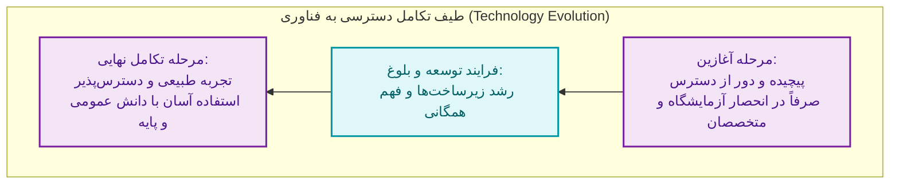

---

### ۱.۲. تحلیل فازهای پنج‌گانه چرخه هایپ گارتنر (Gartner Hype Cycle)

مؤسسه گارتنر سالانه بیش از **100 چرخه حیات** را برای بیش از **1900 فناوری** در صنایع مختلف ترسیم می‌کند تا نشان دهد هر پدیده چقدر به بلوغ و درآمدزایی عملی نزدیک شده است.

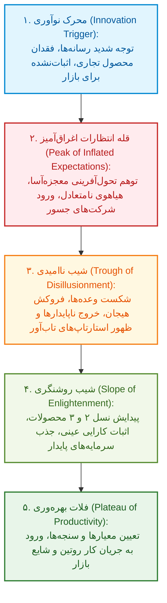

| فاز چرخه هایپ گارتنر | سطح انتظارات و دیده‌شدن | وضعیت محصولات و فناوری | نوع مشارکت تجاری و آکادمیک | نمونه‌های شاخص در آموزش و سلامت |
| :--- | :--- | :--- | :--- | :--- |
| **۱. محرک نوآوری (Innovation Trigger)** | صعود سریع بازتاب رسانه‌ای | جنبه آزمایشگاهی و کدهای اولیه، فاقد کاربری عمومی | ریسک سرمایه‌گذاری فوق‌العاده بالا، فقط توسعه‌دهندگان فنی | رابط مغز و ماشین (*Brain-Machine Interface*) و متاورس دوطرفه |
| **۲. قله انتظارات (Peak Expectations)** | بالاترین حد تبلیغات غیرمنطقی | داستان‌های موفقیت پرهیاهو همگام با گزارش‌های اولیه خطا | ورود شرکت‌های سرمایه‌گذار پرریسک، توجه افراطی دانشگاه‌ها | هوش مصنوعی مولد (*Generative AI*) و آموزش مبتنی بر شایستگی |
| **۳. شیب ناامیدی (Trough Disillusionment)** | سقوط شدید خوش‌بینی عمومی | حذف محصولات ناکارآمد، اصلاح نقایص پایه‌ای زیرساخت | خروج هیجان‌زدگان، تشکیل *استارتاپ‌های هوشمند و پایدار* | ارزیابی دیجیتال (*Digital Assessment*) و بلاکچین در آموزش |
| **۴. شیب روشنگری (Slope Enlightenment)** | بازگشت منطقی امید و درک ارزش | ظهور *نسل دوم و سوم محصولات تجاری* با باگ‌های رفع‌شده | سرمایه‌گذاری شرکت‌های محافظه‌کار، آغاز پروتکل‌های رسمی پژوهش | یادگیری تطبیقی (*Adaptive Learning Platforms*) و تحلیل آموزشی |
| **۵. فلات بهره‌وری (Plateau Productivity)** | ثبات و ماندگاری، عدم جذابیت خبری | ابزارهای استاندارد، ارزیابی‌شده با سنجه‌های مشخص | تبدیل به *ابزار روتین بیزینس و بالین*؛ اشباع فرصت‌های بدوی | کتاب‌های درسی الکترونیکی (*E-Textbook*) و سیاست BYOD |

> [!important] تفکیک نمادهای پیش‌بینی زمان تا فلات (Time to Plateau) در نمودار گارتنر
> در نقشه‌های گارتنر، زمان تخمینی رسیدن به فاز بهره‌وری با نمادهای هندسی و رنگ‌ها رمزگذاری می‌شود:
> 1. دایره توخالی سفید: کمتر از **2 سال** (*less than 2 years*)
> 2. دایره آبی کم‌رنگ: بین **2 تا 5 سال** (*2 to 5 years*)
> 3. دایره آبی پررنگ: بین **5 تا 10 سال** (*5 to 10 years*)
> 4. مثلث زرد یا قرمز: بیش از **10 سال** (*more than 10 years*)
> 5. دایره قرمز ضربدردار: **منسوخ‌شدن پیش از رسیدن به فلات** (*obsolete before plateau*)

> [!warning] تله مهم امتحانی در مسیر حرکت فناوری‌ها
> تمامی فناوری‌ها چرخه گارتنر را به شکل خطی طی نمی‌کنند. پدیده‌ها ممکن است قله انتظارات را دور بزنند، مستقیماً وارد شیب ناامیدی شوند، یا در کف شیب ناامیدی برای همیشه نابود و منسوخ شوند.

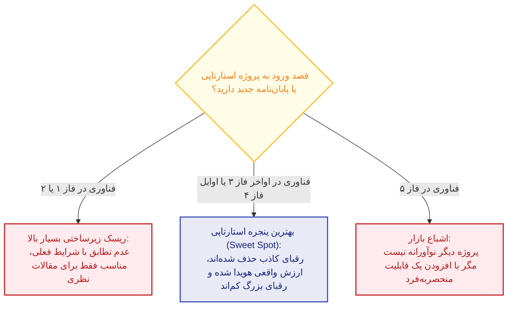

---

## بخش ۲: منابع آموزشی باز (OER) و دوره‌های برخط انبوه باز (MOOCs) (جلسه ۲ - پارت ۲)

### ۲.۱. جنبش منابع آموزشی باز (Open Educational Resources - OER)

> [!abstract] تعریف منابع آموزشی باز (OER) طبق یونسکو
> هرگونه ماده یا منبع آموزشی (کتاب، ماژول، ویدیو، آزمون یا نرم‌افزار) که به قصد **تدریس، یادگیری یا پژوهش** در هر قالبی (دیجیتال یا فیزیکی) تولید شده و بر روی بستری عمومی یا تحت **مجوزی باز** منتشر گردد؛ به گونه‌ای که دسترسی به آن بدون موانع مالی بوده و اجازه کاربست، انطباق و بازتوزیع را به کاربران بدهد.

> [!important] ارکان پنج‌گانه باز بودن منبع (The 5R Framework)
> جنبش OER که از سال **2002** میلادی آغاز گردید، پارادایم سنتی حقوق مؤلفین را از گزاره سخت‌گیرانه *«تمامی حقوق محفوظ است (All Rights Reserved)»* به سمت گزاره *«برخی حقوق محفوظ است (Some Rights Reserved)»* تغییر داد. این باز بودن با پنج حق کلیدی سنجیده می‌شود:
> 1. **حق حفظ و نگهداری (Retain)**: حق مالکیت، دانلود و ذخیره نسخه اختصاصی منبع برای همیشه.
> 2. **حق استفاده مجدد (Reuse)**: کاربست مستقیم اثر بدون تغییر در کلاس، وبگاه یا تکالیف.
> 3. **حق ویرایش و بازبینی (Revise)**: اصلاح، ترجمه، بومی‌سازی و تدوین مجدد محتوا.
> 4. **حق بازترکیب (Remix)**: تلفیق منبع باز با سایر منابع جهت آفرینش یک اثر آموزشی نوین.
> 5. **حق بازتوزیع (Redistribute)**: اشتراک‌گذاری آزادانه اثر اولیه یا نسخه‌های بازنگری‌شده با دیگران.

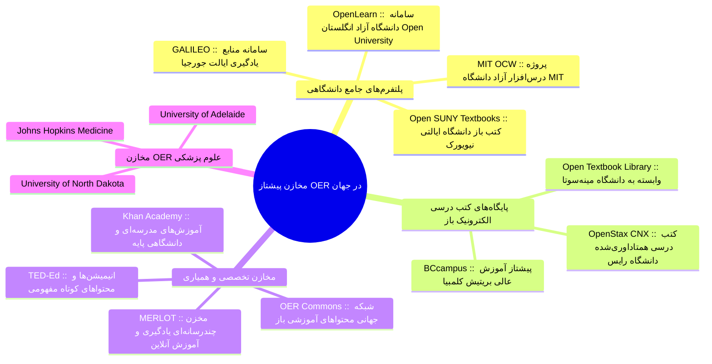

---

### ۲.۲. دوره‌های برخط انبوه باز (Massive Open Online Courses - MOOCs)

> [!abstract] کالبدشکافی واژه MOOC
> - **انبوه (Massive)**: پذیرش شمار بسیار بالا و نامحدود فراگیران به صورت همزمان از سراسر گیتی.
> - **باز (Open)**: دسترسی آزاد بدون پرداخت شهریه؛ همچنین **فقدان پیش‌نیاز صلب تحصیلی** برای ثبت‌نام.
> - **برخط (Online)**: ارائه تمام‌عیار محتوا بر بستر وب و اینترنت بدون نیاز به حضور فیزیکی.
> - **دوره (Course)**: سازمان‌دهی محتوا در قالب یک کوریکولوم مدون با سیلابس، تکالیف و تقویم مشخص.

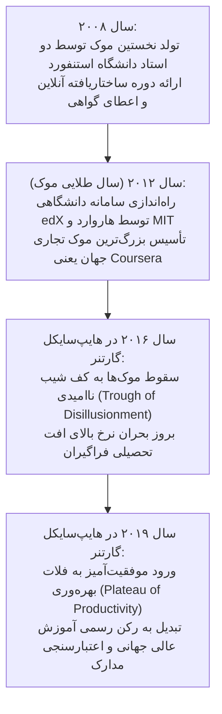

| مدل دوره‌های موک | مبنای نظری و ساختاری | نحوه تعامل و تولید محتوا | وضعیت برنامه درسی و آزمون | نمونه‌های شاخص عملیاتی |
| :--- | :--- | :--- | :--- | :--- |
| **دوره‌های رابطه‌گرا (cMOOC)** | نظریه ارتباط‌گرایی (*Connectivism*) | دانش به صورت اشتراکی توسط **فراگیران در ارتباط با یکدیگر** شکل می‌گیرد | فاقد سیلابس صلب؛ مسیر منعطف بر اساس گفتگو و شبکه‌سازی | نخستین دوره‌های تجربی سال 2008 استنفورد |
| **دوره‌های تعمیمی (xMOOC)** | مدل سنتی دانشگاهی انتقالی | محتوا توسط استاد برتر تدریس شده و دانشجو مصرف‌کننده است | سیلابس تقویم‌محور دقیق، تکالیف زمان‌بندی‌شده و **اعطای گواهی** | اکثر دوره‌های پلتفرم‌های Coursera و edX |
| **شبه موک‌ها (Quasi-MOOCs)** | مدل محتوامحور درس‌افزار باز (*q-Course*) | دسترسی غیرهمزمان به ویدیوها و متون آموزشی بدون تعامل انسانی | فاقد کلاس‌بندی پویا، بدون تقویم پایان دوره و بدون گواهی رسمی | مخزن آموزشی Khan Academy و MIT OCW |
| **دوره‌های ترکیبی (bMOOC)** | مدل تلفیقی چندگانه (*Blended*) | ادغام یادگیری آنلاین مستقل با جلسات چهره‌به‌چهره یا پروژه‌محور | ترکیب ارزشیابی سنتی حضوری با تکالیف دیجیتال منعطف | دوره‌های ترکیبی دانشگاهی درون LMS |

> [!important] تحلیل علل پدیده ریزش فراگیران (Drop-Out Rate) در دوره‌های MOOCs
> نرخ بالای عدم اتمام دوره‌ها در موک‌ها **به خودی خود یک شکست یا نقص سیستماتیک محسوب نمی‌شود**؛ بلکه ناشی از ماهیت این دوره‌هاست؛ زیرا بسیاری از مخاطبان صرفاً جهت ارضای یک نیاز موقت دانشی وارد دوره می‌شوند و پس از اخذ آن مبحث، دوره را ترک می‌کنند.
> 
> علل ده‌گانه ریزش فراگیران عبارت است از:
> 1. مشغله بالای کاری و کمبود وقت
> 2. نوسان و تفاوت شدید در سطح انگیزه اولیه
> 3. ماهیت مبتنی بر نیاز مقطعی دوره‌ها
> 4. احساس تنهایی، انزوا و فقدان تعامل چهره‌به‌چهره
> 5. سختی بیش از حد مفاهیم درس انتخابی
> 6. عدم پشتیبانی و راهنمایی مؤثر آموزشی
> 7. ضعف فراگیر در مهارت‌های فنی کار با رایانه
> 8. نداشتن راهبردهای مطالعه و خودتنظیم‌گری یادگیری
> 9. تجارب قبلی ناخوشایند در محیط‌های مجازی
> 10. عدم انطباق محتوا با انتظارات ذهنی اولیه فراگیر

> [!tip] راهکارهای ارتقای انگیزه و کاهش نرخ Drop-Out
> تفکیک محرک‌های انگیزشی در طراحی موک به دو دسته تقسیم می‌شود:
> - **محرک‌های درونی (Intrinsic)**: انتخاب عنوان جذاب، کاربردی بودن سیلابس بر اساس نیاز روز بازار و تنظیم هوشمند سطح دشواری محتوا.
> - **محرک‌های بیرونی (Extrinsic)**: اعطای گواهی‌نامه‌های معتبر بین‌المللی، هزینه ثبت‌نام معقول، حفظ دسترسی آزاد و به‌کارگیری عناصر **بازی‌وارسازی (Gamification)** مانند لیدربرد (*Leaderboards*)، بج‌ها و امتیازات (*Badges & Points*) و نوار پیشرفت (*Progress Bar*).

---

### ۲.۳. زیست‌بوم موک ملی: پلتفرم آموزش باز «آرمان»

کشورها به دلایل راهبردی شامل **کسب مرجعیت علمی**، **پاسداشت و توسعه زبان بومی**، **آموزش رایگان آحاد جامعه** و **حضور مستقل در رقابت بین‌المللی** اقدام به راه‌اندازی سامانه‌های ملی موک می‌نمایند. در ایران، این سامانه با نام **آرمان** (آموزش رایانه‌ای ملی انبوه و نوین) ایجاد شد.

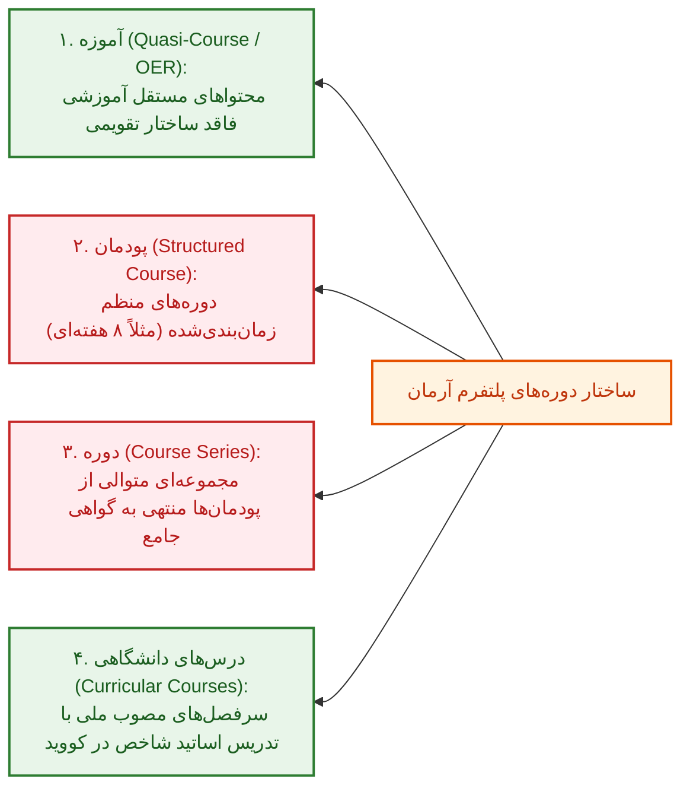

> [!warning] نکته امتحانی کلیدی پیرامون وضعیت جاری پلتفرم آرمان
> در ساختار اولیه سامانه آرمان چهار مدل تعریف شده بود؛ اما در حال حاضر صرفاً بخش‌های **«آموزه»** و **«درس‌های دانشگاهی»** فعال هستند و توسعه بخش‌های **«پودمان»** و **«دوره»** متوقف مانده است؛ از این رو سامانه آرمان در وضعیت کنونی بیشتر در طبقه **شبه موک (Quasi-MOOC)** ارزیابی می‌گردد.

---

## بخش ۲: بازیابی اطلاعات، موتورهای جستجو و هوش مصنوعی سمانتیک (جلسات ۶ و ۷)

### ۲.۱. معماری موتورهای جستجو و طبقه‌بندی ابزارها

> [!abstract] تعریف موتور جستجوی وب (Web Search Engine)
> نرم‌افزاری برخط برای شناسایی اطلاعات در شبکه جهانی وب که داده‌های متنی، تصویری، صفحات وب و فایل‌ها را بر اساس تقاضای کاربر استخراج کرده و نتایج را در فهرستی موسوم به **Hits** رتبه‌بندی می‌کند.

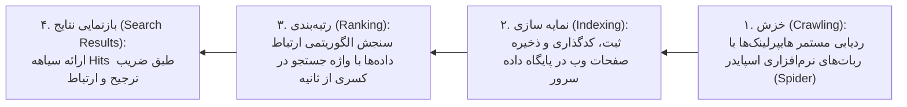

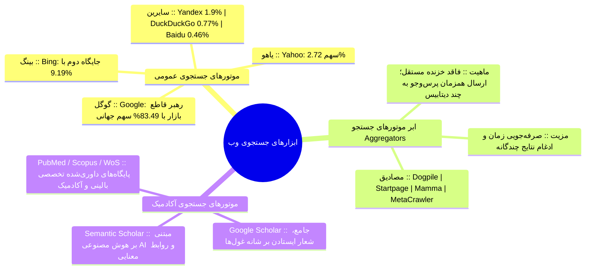

---

### ۲.۲. پایگاه گوگل اسکالر (Google Scholar): تنظیمات، اپراتورها و علم‌سنجی

> [!abstract] دکترین غول‌های علمی در گوگل اسکالر
> شعار رسمی سامانه عبارت است از: **«Stand on the shoulders of giants»**؛ بدین معنا که پیشرفت سریع علمی صرفاً با استناد بر دانش انباشته و یافته‌های پژوهشگران پیشین میسر می‌گردد.

> [!important] شاخص‌های ارزیابی استنادی در بخش Metrics
> گوگل اسکالر بر اساس مجلات پنج سال اخیر دو شاخص بنیادین را محاسبه می‌کند:
> 1. **h5-index**: بیشترین عدد $h$ به گونه‌ای که آن مجله در ۵ سال اخیر حداقل $h$ مقاله داشته باشد که هر کدام حداقل $h$ بار استناد دریافت کرده باشند (نشریه *Nature* با 444 بالاترین رتبه را دارد).
> 2. **h5-median**: میانه استنادات برای مقالاتی که تشکیل‌دهنده h5-index مجله بوده‌اند (مجله *New England Journal of Medicine* با میانه 780 سرآمد است).

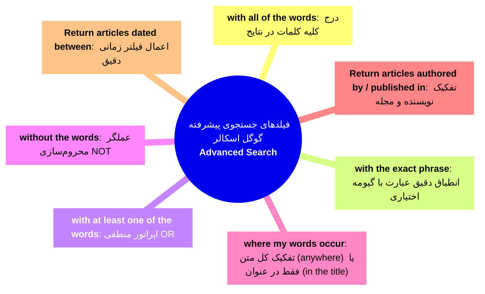

> [!tip] نکات کاربردی بخش تنظیمات (Settings) و کتابخانه اختصاصی
> - **Bibliography Manager**: فعال‌سازی لینک‌های درون‌متنی خروجی مستقیم ارجاع به نرم‌افزارهای مدیریت منابع (به ویژه *EndNote*).
> - **Case Law**: جستجو در پرونده‌ها و آرای دادگاه‌های ایالات متحده؛ این گزینه برای دانشجویان پزشکی و زیستی *کاربرد پژوهشی ندارد*.
> - **My Library**: مخزن ذخیره‌سازی ابری مقالات برگزیده که با زدن کلید *Save* در پایین هر نتیجه پر می‌شود.
> - **Alerts**: ارسال اعلان ایمیلی خودکار هنگام *ایندکس شدن مقاله جدید*، *انتشار مقاله توسط فرد در پروفایل* یا *دریافت سایتیشن جدید به مقاله کاربر*.

---

### ۲.۳. موتور هوشمند سمانتیک اسکالر (Semantic Scholar)

> [!abstract] شناسه هوش مصنوعی سمانتیک اسکالر
> پایگاه توسعه‌یافته توسط مؤسسه Allen برای هوش مصنوعی؛ هدف آن استخراج معنایی روابط مفهومی پنهان در میان مقالات علمی داوری‌شده و کاهش فرسودگی اطلاعاتی محقق است.

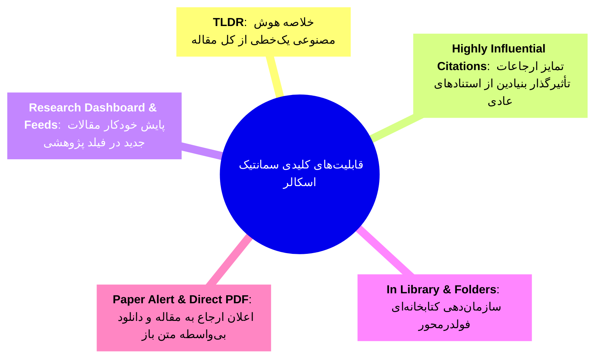

| ویژگی‌های مقایسه‌ای | گوگل اسکالر (Google Scholar) | سمانتیک اسکالر (Semantic Scholar) | پایگاه وب آو ساینس (Web of Science) |
| :--- | :--- | :--- | :--- |
| **هسته الگوریتم جستجو** | تطابق واژگانی، بسامد کلمات و استناد سنتی | درک معنایی پیوندها با *هوش مصنوعی و یادگیری ماشین* | نمایه‌سازی ساختاریافته استنادی سنتی کنترل‌شده ISI |
| **خلاصه‌سازی خودکار** | ندارد (فقط چکیده اولیه مؤلفین) | دارای قابلیت **TLDR (خلاصه فوق‌العاده کوتاه AI)** | فاقد خلاصه AI (صرفاً ارائه چکیده رسمی) |
| **تحلیل کیفیت استنادات** | برابردانستن همه ارجاعات در شمارنده عددی | تفکیک استنادهای کلیدی با **Highly Influential Citations** | تحلیل شبکه استنادی غنی با *Enriched Cited References* |
| **شناسایی پتنت‌ها** | **دارد** (دارای چک‌باکس Patents) | ندارد (تمرکز کامل بر مقالات داوری‌شده آکادمیک) | فقط در صورت اتصال به Derwent Innovations Index |
| **هزینه و نوع دسترسی** | کاملاً رایگان عمومی | کاملاً رایگان با ورود کاربری | تجاری و نیازمند اشتراک سازمانی دانشگاهی |

---

## بخش ۳: کتابخانه‌های دیجیتال و پایگاه‌های استنادی علوم پزشکی (جلسه ۸)

### ۳.۱. تحول پارادایم: کتابخانه‌های سنتی در برابر دیجیتال

> [!abstract] تعریف کتابخانه دیجیتال (Digital Library)
> سازمان و سامانه‌ای که در آن منابع علمی، اطلاعاتی و رسانه‌ای به شکل الکترونیکی ذخیره شده، مدیریت می‌گردد و بدون محدودیت زمانی و فیزیکی در اختیار کاربران چندگانه قرار می‌گیرد؛ تحقق آن مستلزم تلاقی تخصص **کتابداران حرفه‌ای** با **متخصصان علوم کامپیوتر** است.

| مولفه مقایسه‌ای | کتابخانه سنتی (Traditional Library) | کتابخانه دیجیتال (Digital Library) |
| :--- | :--- | :--- |
| **قالب فیزیکی منابع** | صرفاً کتب، پایان‌نامه‌ها و نشریات چاپی روی کاغذ | داده‌های الکترونیک چندرسانه‌ای، کتب دیجیتال و پایان‌نامه‌ها |
| **پنجره زمانی دسترسی** | محدود به ساعات اداری مصوب (مانند 8 صبح تا 2 بعدازظهر) | دسترسی نامحدود **24 ساعته در 7 روز هفته (24/7)** |
| **محدودیت جغرافیایی** | حضور فیزیکی در محل مخزن و سالن مطالعه الزامی است | ورود از هر نقطه جغرافیایی متصل به شبکه اینترنت |
| **تعداد کاربران همزمان** | قاعده تک‌نسخه‌ای (اگر امانت برود بقیه باید منتظر بمانند) | استفاده نامحدود و همزمان چند کاربر از یک فایل واحد |
| **پشتیبانی و تخصص** | اداره انحصاری توسط کتابداران و متصدیان اسناد چاپی | نیاز تؤامان به مهارت کتابداری و مهندسی داده‌های کامپیوتری |

> [!important] نکته تکمیلی درباره بافت کتابخانه‌ها
> کتابخانه‌های مدرن اغلب ساختار ترکیبی دارند؛ یعنی وجود کتابخانه دیجیتال هرگز به معنای نابودی کامل یا حذف قطعی مخازن سنتی چاپی نیست و هر دو فرم در دانشگاه‌ها همزیستی دارند.

---

### ۳.۲. زیست‌بوم کتابخانه دیجیتال دانشگاه علوم پزشکی تهران (TUMS)

> [!abstract] مفهوم پردیس مجازی (V.Campus - Virtual Campus)
> سیستم تأمین اتصال راه‌دور اعضای دانشگاه علوم پزشکی تهران که از طریق اختصاص شناسه و رمز عبور یکپارچه، امکان ورود به پایگاه‌های اطلاعاتی و کلاس‌های مجازی را خارج از محدوده دانشگاه فراهم می‌ساخت.

> [!warning] وضعیت اضطراری فعلی دسترسی به پایگاه‌های علمی در دانشگاه
> 1. به دلیل **تحریم‌های بین‌المللی و موانع ارزی**، اشتراک مستقیم و قانونی دانشگاه به اغلب پایگاه‌های بزرگ جهانی (مانند Scopus، Reaxys و Ovid) قطع گردیده است.
> 2. سرویس خارج از دانشگاه **V.Campus ارزش افزوده واقعی ندارد** و از راه دور محتوای اشتراکی پولی را باز نمی‌کند.
> 3. در حال حاضر صرفاً دسترسی نیمه‌قانونی به دو سامانه **Web of Science** و **UpToDate** برقرار است که **تنها و منحصراً با رایانه‌های تنظیم‌شده روی IP داخلی دانشگاه** (در محل دانشکده‌ها و بیمارستان‌ها) باز می‌شوند.

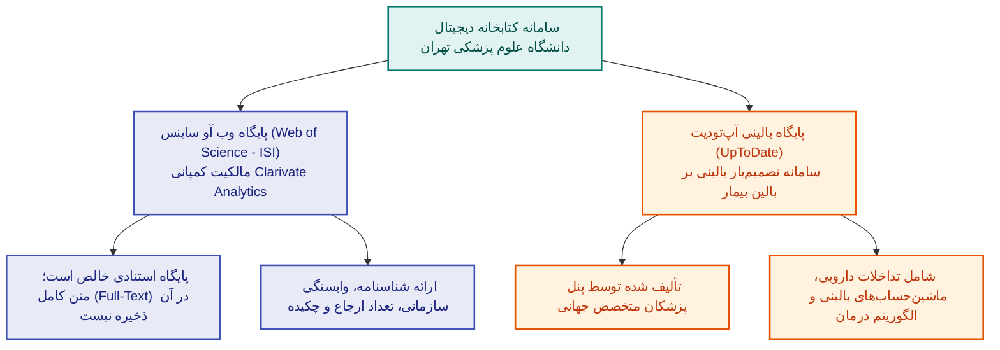

> [!important] مقررات حقوقی و انقضای ایمیل دانشگاهی
> - دریافت آدرس ایمیل دانشگاهی جهت انجام مکاتبات با ژورنال‌ها الزامی است، زیرا مجلات معتبر سابمیت با جیمیل یا یاهو را نمی‌پذیرند.
> - حساب ایمیل دانشجویی **بلافاصله پس از فراغت از تحصیل مسدود و حذف می‌گردد**؛ لذا دانشجویان باید مکاتبات ضروری را پیش از تسویه‌حساب منتقل کنند و در صورت قبولی در مقاطع بالاتر مجدداً از طریق سامانه **سپاد** درخواست دهند.

---

### ۳.۳. سامانه‌های ملی و بین‌المللی دستیابی به پایان‌نامه‌ها و کتب نایاب

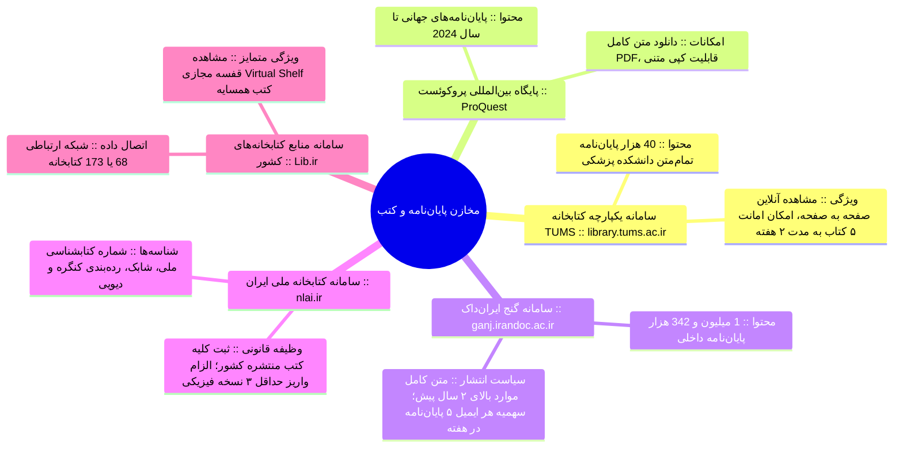

| سامانه و پایگاه | حوزه جغرافیایی و دامنه پوشش | وضعیت دسترسی به متن کامل (Full-Text) | مزیت و قابلیت استثنایی امتحانی |
| :--- | :--- | :--- | :--- |
| **سامانه کتابخانه دانشگاه (TUMS)** | پایان‌نامه‌ها و کتب فیزیکی کلیه دانشکده‌های تهران | مشاهده دیجیتال تمام‌متن پایان‌نامه‌ها (بدون امکان کپی متنی) | جستجوی یکپارچه و **امانت بین‌کتابخانه‌ای** دانشکده‌ها |
| **پایگاه پروکوئست (ProQuest)** | رساله‌ها و پایان‌نامه‌های دکتری و ارشد بین‌المللی | **دانلود نامحدود و رایگان فایل PDF** به همراه کپی متنی | پوشش پژوهش‌های فوق‌العاده جدید جهان (تا سال 2024) |
| **سامانه گنج ایران‌داک (Ganj)** | پایان‌نامه‌های وزارت علوم و وزارت بهداشت داخل ایران | برچسب سبز برای متن کامل مقاطع بیش از **2 سال قبل** | **سقف دانلود دقیقاً 5 پایان‌نامه در هر هفته** به ازای هر ایمیل |
| **کتابخانه ملی ایران (NLAI)** | دایرکتوری شناسنامه‌ای جامع کتب کل کشور | فقط اطلاعات کتاب‌شناختی و مشخصات نشر (فاقد متن کتاب) | الزام قانونی ناشران برای **سپردن حداقل 3 نسخه چاپی** |
| **سامانه لیب (Lib.ir)** | کتب نایاب موجود در شبکه‌های کتابخانه‌ای ایران | ارجاع به مخازن دارای نسخه و ساعات کاری فیزیکی | قابلیت دیداری **قفسه مجازی (Virtual Shelf)** |

> [!tip] ارزش کاربردی قفسه مجازی (Virtual Shelf) در سامانه Lib.ir
> این امکان به پژوهشگر اجازه می‌دهد بدون حضور در راهروهای مخزن، کتاب‌های فیزیکی مجاور اثر مورد نظر خود را که همگی در یک زمینه موضوعی خاص رده‌بندی شده‌اند به صورت سه‌بعدی و دیجیتال برانداز کند.