# بخش سوم: هوش مصنوعی، اصول ارائه علمی، طراحی اسلاید و تله‌مدیسین

## بخش ۱: هوش مصنوعی در آموزش، علوم پزشکی و اخلاق حرفه‌ای (جلسه ۹)

### ۱.۱. جایگاه هوش مصنوعی در امواج انقلاب‌های صنعتی

تحول ابزارهای تولید و فناوری‌های عمومی (*General Purpose Technology*) تاریخ تمدن بشری را در قالب چهار موج بنیادین رقم زده است:

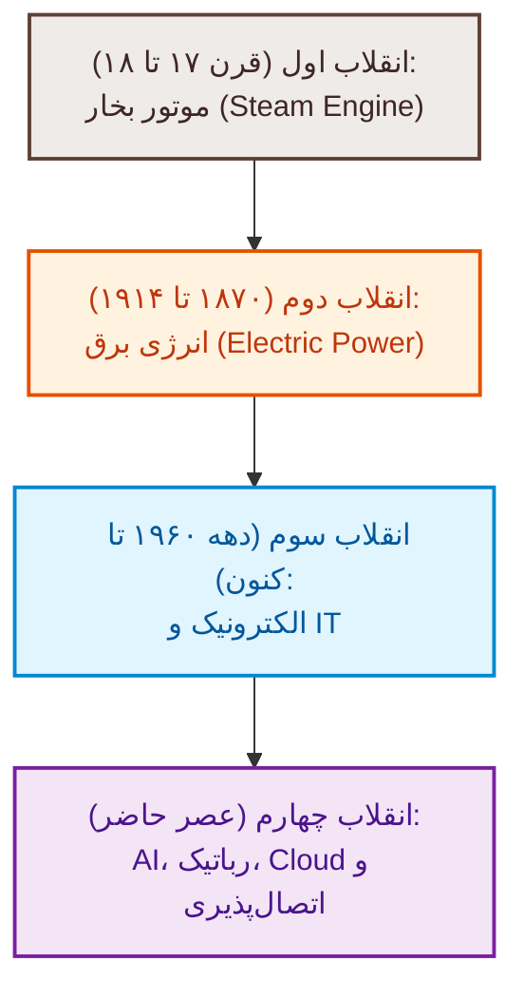

> [!abstract] تعریف هوش مصنوعی (Artificial Intelligence)
> شاخه‌ای گسترده از علوم رایانه که هدف آن توانمندسازی سامانه‌ها، ماشین‌ها و نرم‌افزارها برای شبیه‌سازی **کارکردهای شناختی مغز انسان** (نظیر یادگیری، استدلال و حل مسئله) است. اصطلاح هوش مصنوعی برای نخستین بار توسط *جان مک‌کارتی (John McCarthy)* معروف به پدر هوش مصنوعی مطرح شد.

> [!important] بنیان نظری آزمون تورینگ (Turing Test)
> در سال **۱۹۵۰**، *آلن تورینگ* با طرح پرسش بنیادین *«آیا ماشین‌ها می‌توانند فکر کنند؟»* معیاری عملیاتی ارائه داد. اگر یک ارزیاب انسانی (*Interrogator*) نتواند در گفت‌وگوی همزمان تفکیک دهد که پاسخ دریافتی متعلق به فرد انسانی (*Human Responder*) است یا رایانه (*Computer*)، ماشین از این آزمون با موفقیت عبور کرده است.

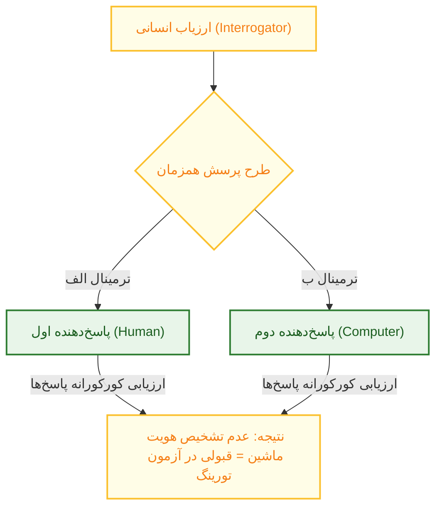

---

### ۱.۲. مقایسه تطبیقی ظرفیت‌های شناختی انسان و ماشین

انسان و ماشین در پردازش داده‌ها و رویارویی با محیط، قابلیت‌های ناهمگونی دارند که اساس طراحی تعامل هم‌افزای *انسان-ماشین (Human-Machine)* در تصمیم‌گیری‌های بالینی است:

| مولفه و حوزه عملکرد | برتری مطلق انسان (Human Superiority) | برتری مطلق ماشین (Machine Superiority) |
| :--- | :--- | :--- |
| **ادراک و ورودی داده** | عملکردهای حسی غنی و توانایی فهم **مفاهیم انتزاعی (Abstract)** | ردیابی و حسگری محرک‌های **خارج از محدوده حواس انسانی** |
| **انعطاف و تصمیم‌گیری** | انعطاف‌پذیری بالا، **بداهه‌پردازی (Improvising)** و قضاوت اخلاقی | فقدان قضاوت ارزشی، پایبندی صلب به الگوریتم و قوانین |
| **پردازش و استدلال** | یادآوری انتخابی داده‌ها و **استدلال استقرایی (Inductive Reasoning)** | محاسبات عددی پیچیده و استدلال ریاضیاتی سریع |
| **سرعت و فرسودگی** | افت توجه در اثر خستگی و سرعت پردازش محدود | هوشیاری مداوم (*Alertness*)، توان بالا و **انجام امور تکراری و روتین** |
| **حافظه و همزمانی** | محدودیت شدید حافظه کوتاه‌مدت، افت عملکرد در چندوظیفگی | ظرفیت نامحدود ذخیره‌سازی کوتاه‌مدت و **انجام فعالیت‌های همزمان** |

---

### ۱.۳. ساختار درونی: تفاوت هوش مصنوعی، یادگیری ماشین و یادگیری عمیق

رابطه میان پارادایم‌های سه‌گانه هوش، رابطه‌ای مبتنی بر شمول متوالی است:

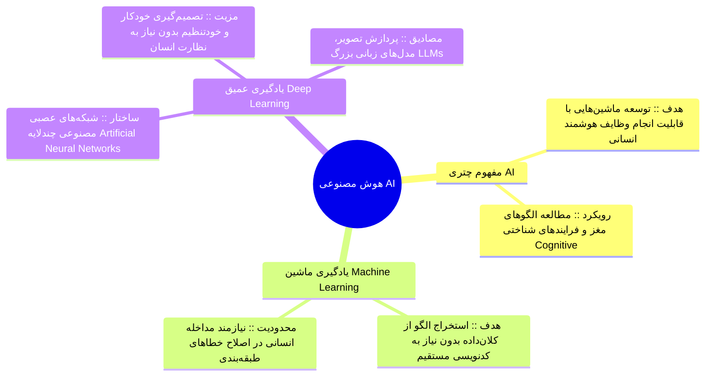

> [!abstract] پردازش زبان طبیعی (NLP) در برابر هوش مصنوعی مولد (Generative AI)
> - **پردازش زبان طبیعی (NLP)**: سامانه‌هایی که بر تحلیل، درک نحوی و پیش‌بینی بر اساس متن متمرکز هستند.
> - **هوش مصنوعی مولد (GAI)**: الگوریتم‌هایی نوین که داده‌های پیشین را بازتولید نمی‌کنند، بلکه دست به **تولید محتوای جدید و اصیل** (در قالب متن، صوت، تصویر، کد، ویدیو و شبیه‌سازی) متناسب با داده‌های آموزشی می‌زنند.
> - **مدل‌های زبانی بزرگ (LLMs)**: شاخه‌ای از یادگیری عمیق در بستر پردازش زبان طبیعی با بیش از **۲۰ هزار مدل** فعال در جهان (مانند Gemini، ChatGPT، Copilot و Perplexity). این مدل‌ها بر داده‌های عمومی وب آموزش دیده‌اند و *فاقد تخصص بومی برای استناد مستقل در طبابت بالینی هستند*.

> [!warning] تله تستی مهم: هوش مصنوعی محدود (Narrow/Weak) در برابر عمومی (Strong/AGI)
> تمامی سامانه‌های کنونی فعال در پزشکی و آموزش، **هوش مصنوعی ضعیف یا محدود (Narrow AI)** هستند؛ یعنی منحصراً برای انجام وظایف خاص و مشخص بهینه‌سازی شده‌اند (مانند ترانویسی، تشخیص شطرنج، رانندگی خودکار یا تفسیر رادیوگرافی). **هوش مصنوعی عمومی (AGI)** که هوشی فراتر یا هم‌تراز کل هوش شناختی انسان در تمامی حوزه‌هاست (مانند HAL در فیلم ادیسه فضایی یا R2-D2 در جنگ ستارگان)، *هنوز محقق نشده است*.

---

### ۱.۴. کاربردهای تخصصی هوش مصنوعی در آموزش و علوم بالینی

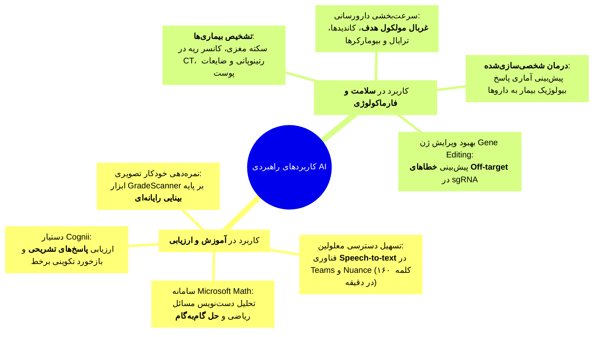

| شرکت و سامانه | شعار رسمی برند (*Slogan*) | رسالت بالینی و فیلد تخصصی |
| :--- | :--- | :--- |
| **Hippocratic AI** | *Safety-first AI for health care* | سامانه تصمیم‌یار بالینی با تمرکز انحصاری بر اصل عدم آسیب (*Do No Harm*) |
| **Viz.ai** | *Closing gaps between patients, clinicians & treatments* | شناسایی خودکار ترومبوز و سکته مغزی (*Stroke*) و کاردیومیوپاتی هایپرتروفیک |
| **Regard** | *Empower physicians with powerful tech* | تحلیل پیش‌گویانه داده‌های سلامت و کمک به مستندسازی پرونده بیمار |
| **Caption Health** | *Imagine what an earlier picture of your heart could mean* | هدایت هوشمند سونوگرافی و اکوکاردیوگرافی زودهنگام قلبی |
| **PathAI** | *Improving Patient Outcomes with AI-Powered Pathology* | تحلیل و پاتولوژی دیجیتال با افزایش دقت تشخیصی بافتی |
| **Buoy Health** | *When something feels off, Buoy it* | بررسی هوشمند علائم بیماری (*Symptom Checker*) و تریاژ اولیه |
| **Linus Health** | *Unlock early detection of Alzheimer's and other dementias* | غربالگری دیجیتال زودهنگام اختلالات شناختی، دمانس و آلزایمر |
| **Arterys** | *The future of precision medicine that only humans + AI can achieve* | تصویربرداری پیشرفته پزشکی بر بستر ابری در انکولوژی و کاردیولوژی |
| **Freenome** | *Decoding the means to cancer's end* | زیست‌شناسی چندوجهی جهت غربالگری و تشخیص زودهنگام سرطان از خون |
| **Cleerly** | *How many beats dance with your date* | فناوری مبتنی بر هوش مصنوعی برای ارزیابی پلاک‌های عروق کرونر قلب |
| **VirtuSense** | *#1 Fall Prevention Solution* | پایش حسگری مبتنی بر بینایی ماشین جهت پیشگیری از سقوط سالمندان |
| **DAX Copilot** | *Automated Clinical Documentation* | رونویسی مکالمات بالینی ویزیت و تنظیم مستندات در کسری از ثانیه |

> [!important] برنامه‌های پایلوت آموزش هوش مصنوعی در دانشکده‌های پیشرو جهان
> 1. **دانشگاه تورنتو**: ارائه سخنرانی‌های پیش‌بالینی، دوره ۲ ساله گواهی *Computing for Medicine* و تأسیس گروه بین‌رشته‌ای هوش مصنوعی در پزشکی.
> 2. **دانشکده پزشکی هاروارد**: ارائه واحد اختیاری انفورماتیک بالینی، دوره مشترک علم داده در پزشکی و رویدادهای دیتاثون (*Datathons*).
> 3. **دانشکده دل دانشگاه تگزاس**: فشرده‌سازی دوره علوم پایه به **۱۲ ماه** جهت ایجاد فضا برای آموزش مهارت‌های نرم (رهبری، ارتباطات، حل مسئله گروهی) و کاهش حفظ‌محوری.
> 4. **مؤسسه دوک و دانشگاه فلوریدا**: کارورزی دانشجویان پزشکی با متخصصان داده و همکاری رزیدنت‌های رادیولوژی برای ساخت سیستم‌های تشخیص ماموگرافی (*CAD*).
> 5. **دانشگاه کارل ایلینویز، استنفورد و ویرجینیا**: پروژه‌های چندرشته‌ای میان پزشک، مهندس و دانشمند علوم داده برای خلق فناوری سلامت.
> 6. **دانشگاه‌های اولسان و یانسی کره جنوبی**: واحدهای اختصاصی کوریکولوم هوش مصنوعی.

---

### ۱.۵. چارچوب اخلاقی، تعهدات دانشجویی و پرامپت‌نویسی استاندارد

سازمان یونسکو در قالب **اهداف توسعه پایدار ۲۰۳۰ (هدف ۴: آموزش باکیفیت و برابر)**، راهبرد *«هوش مصنوعی برای همه»* را مطرح کرده است. کاربست این سامانه‌ها مقید به اصول صلب است:

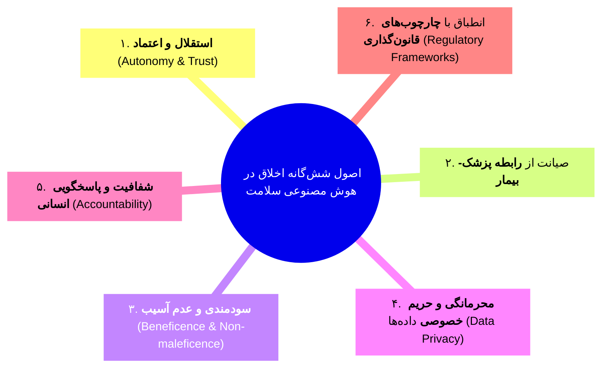

> [!important] خط قرمزهای حیاتی در استفاده دانشگاهی از هوش مصنوعی
> - **شفافیت کامل در اعلام**: هرگونه بهره‌گیری از ابزارهای هوش مصنوعی (حتی در حد ویرایش ساده گرامری یا ساخت اسلاید) باید با ذکر دقیق نام ابزار، مدل، نسخه و نوع دستور قید گردد.
> - **عدم ورود داده‌های هویتی و حساس (PII)**: طبق پروتکل‌های سامانه‌هایی چون *Docus AI*، هرگز نباید اسامی بیماران، شماره پرونده یا تصاویر رادیولوژی با مشخصات فردی در پلتفرم‌های عمومی وارد شود.
> - **مسئولیت مطلق با عامل انسانی است**: هوش مصنوعی صرفاً یک *دستیار (Assistant)* است نه جایگزین تفکر نقادانه (*Critical Thinking*). هیچ متخصصی نمی‌تواند خطای بالینی یا علمی خود را به سامانه نسبت دهد.
> - **ممنوعیت کامل آزمون و انجام مستقیم تکالیف**: واگذاری حل تکالیف، تحلیل و تفسیر آماری پژوهش بدون درک محقق، یا پاسخگویی به سوالات امتحانات ممنوع بوده و تقلب علمی است.
> - **الزام اخذ مجوز رسمی سلامت**: ابزارهای تشخیصی رادیولوژی یا کلینیکی بدون تایید رسمی **وزارت بهداشت و FDA** فاقد وجاهت قانونی برای طبابت هستند.

> [!tip] اصول پنج‌گانه نگارش پرامپت اثربخش (Effective Prompting)
> 1. **دقیق و مشخص بودن (Be specific)**: تعیین قالب، تعداد واژگان و نقش مخاطب.
> 2. **پرسش‌های بازپاسخ (Use open-ended questions)**: پرهیز از پرسش‌های دوقطبی بله/خیر جهت اخذ عمق تحلیلی.
> 3. **سادگی کلام (Keep it simple)**: اجتناب از واژگان زاید و متناقض.
> 4. **ارائه بافت زمینه (Provide context)**: شرح شرح‌حال بیمار، سن، سناریو و اهداف بالینی.
> 5. **پالایش رفت‌وبرگشتی (Iterate and refine)**: بازنویسی پرامپت در صورت انحراف خروجی مدل.

---

## بخش ۲: اصول ارائه علمی و تعامل با مخاطب (جلسه ۱۰)

### ۲.۱. ماهیت ارتباط و استراتژی‌های کلامی و غیرکلامی

ارائه علمی، فرایندی دوسویه برای انتقال افکار، مشاهدات و داده‌های مستند بدون خدشه فاکتورهای مخدوش‌کننده است.

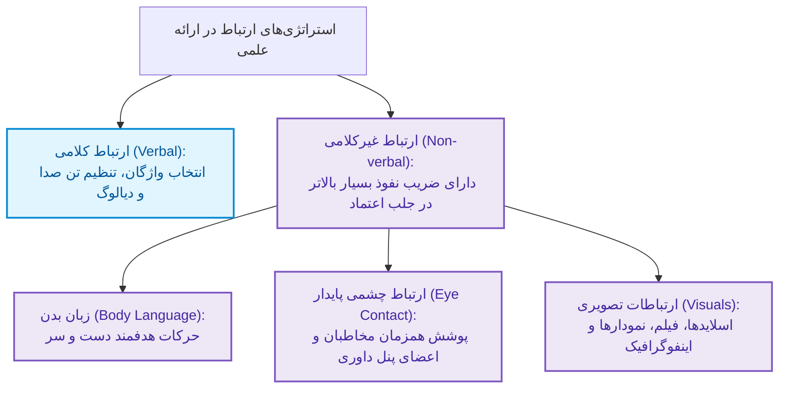

---

### ۲.۲. گام‌های سه‌گانه فرایند ارائه علمی

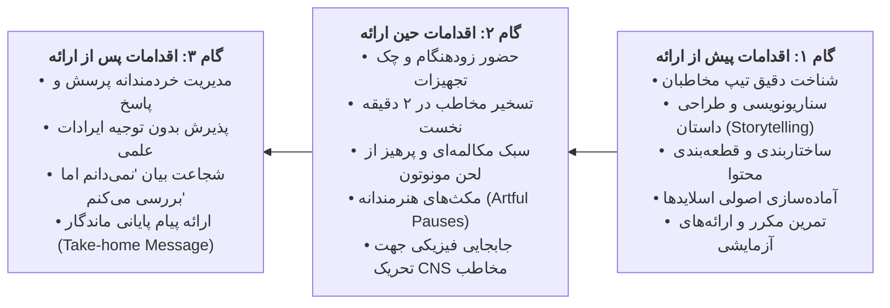

---

### ۲.۳. مقایسه تطبیقی چهار سبک سخنرانی علمی

انتخاب اسلوب ارائه، تعیین‌کننده ضریب خطا و میزان درگیرسازی شناختی حضار خواهد بود:

| سبک سخنرانی علمی | مزایای اصلی | چالش‌ها و معایب اساسی | جایگاه و توصیه‌پذیری |
| :--- | :--- | :--- | :--- |
| **حفظ کردن کل سخنرانی (Memorization)** | برقراری پیوسته و کامل **ارتباط چشمی** با حضار | عدم امکان برای سخنرانی طولانی، **خطر فراموشی ناگهانی متن**، عدم امکان بداهه‌گویی | نامناسب؛ استرس‌زا و آسیب‌پذیر در مباحث نوین |
| **خواندن مستقیم از متن (Reading from Text)** | تضمین کامل **دقت علمی** و عدم جاافتادگی نکات | قطع کامل تماس چشمی، **حالت مونوتون و فوق‌العاده خسته‌کننده**، غیرطبیعی | نامناسب؛ تبدیل ارائه به عمل روخوانی کاغذ |
| **صحبت کاملاً آزاد (Speaking Freely)** | کاملاً طبیعی، ایجاد حس **گفت‌وگوی روزمره و صمیمی** | **احتمال بسیار بالای خطای داده‌های آماری**، به‌هم‌ریختگی انسجام علمی | پرریسک؛ نامناسب برای دفاع و سمینارهای تخصصی |
| **روایت بر پایه یادداشت و تصویر (Visuals/Notes)** | **سازمان‌دهی بالا، امکان بداهه‌پردازی و حفظ ارتباط چشمی** | وجود اندکی خطای بیانی جزئی در برخی عبارات | **سبک استاندارد و ایده‌آل؛ مدل ترکیبی Storytelling** |

> [!important] چارچوب پنج پی (The 5 P's Framework)
> موفقیت یک سخنرانی علمی دانشگاهی در گرو رعایت گام‌به‌گام پنج رکن بنیادین است:
> 1. **هدف (Purpose)**: تعریف دقیق چرایی و خروجی غایی ارائه برای مخاطب هدف.
> 2. **برنامه (Plan)**: زمان‌بندی دقیق و تدوین سناریوی آغاز، میانه و فرجام.
> 3. **آماده‌سازی (Prepare)**: پالایش و سازمان‌دهی مستندات و شواهد علمی.
> 4. **پاورپوینت استاندارد (PowerPoint)**: طراحی بصری موجز و عاری از ازدحام متنی.
> 5. **تمرین (Practice)**: تمرین انفرادی و تیمی با سنجش دقیق زمان سخنرانی.

---

## بخش ۳: اصول مهندسی طراحی اسلاید در نرم‌افزار پاورپوینت (جلسه ۱۱)

اسلاید آموزشی حامل پیام انتزاعی است که باید با یاری عناصر چندرسانه‌ای به ادراکی *ملموس و عینی* بدل گردد.

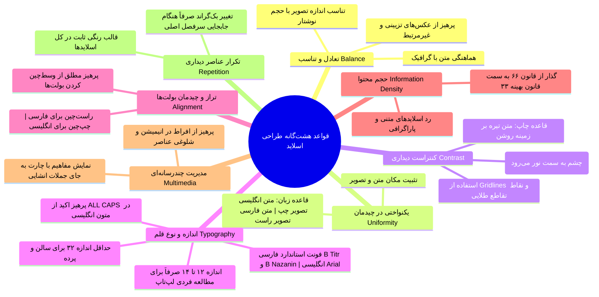

> [!important] تحول راهبردی در حجم محتوای اسلاید: از قانون ۶۶ تا قانون ۳۳
> - **قانون سنتی ۶۶ (6x6 Rule)**: حداکثر ۶ خط بولت در هر اسلاید و حداکثر ۶ واژه در هر بولت.
> - **قانون مدرن و بهینه ۳۳ (3x3 Rule)**: ترجیح روان‌شناختی شناختی بر وجود **حداکثر ۳ موضوع یا بولت در اسلاید و حداکثر ۳ کلمه در هر بولت** است.
> 
> *سلسله‌مراتب ارتقای انتقال مفهوم در اسلاید*:
> 1. متن بلند پاراگرافی و طولانی ⇦ *(بدترین حالت؛ سردرگمی مخاطب بین خواندن و شنیدن)*
> 2. تلخیص به یک جمله کوتاه و تعریف موجز ⇦ *(متوسط)*
> 3. تبدیل جمله به عبارات کلیدی کوتاه (*Phrases*) ⇦ *(خوب)*
> 4. حذف متن زاید و جایگزینی با **تصویر مفهومی و مرتبط در سمت راست اسلاید** ⇦ *(عالی و ماندگارترین اثر یادگیری)*

---

## بخش ۴: سلامت الکترونیک و پزشکی از راه دور (Telemedicine) (جلسه ۱۳)

### ۴.۱. تعاریف و مرزهای مفهومی

> [!abstract] تمایز سلامت از دور (Telehealth) و پزشکی از دور (Telemedicine)
> - **سلامت از دور (Telehealth)**: مفهومی چتری و فراگیر دربرگیرنده تمامی خدمات سلامت، پیشگیری، آموزش همگانی، مدیریت بهداشت و خدمات توانبخشی از راه دور.
> - **پزشکی از دور (Telemedicine)**: زیرمجموعه بالینی تله‌هلث که به **ارائه مستقیم خدمات درمانی، مراقبت‌های تشخیصی و مشاوره‌های تخصصی پزشکی** به بیماران از طریق تجهیزات مخابراتی و رایانه‌ای اطلاق می‌شود.

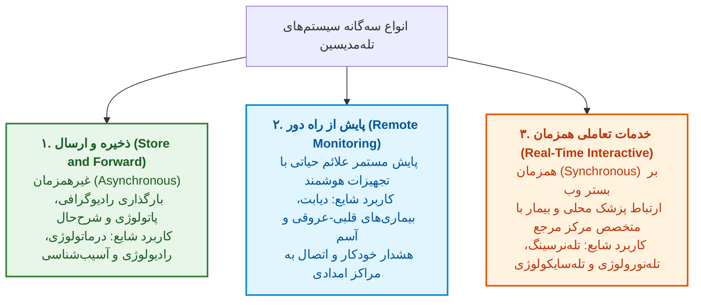

> [!important] فرایند فنی پنج‌گانه دیجیتال‌سازی در سامانه ذخیره و ارسال (مانند RxView-Telemed)
> 1. **دریافت داده‌ها (Acquisition)**: اخذ تصاویر لام با میکروسکوپ دیجیتال، فیلم رادیوگرافی و اسکن پرونده.
> 2. **فشرده‌سازی (Compression)**: کاهش حجم داده‌ها جهت تسهیل ارسال شبکه بدون افت کیفیت تشخیصی.
> 3. **یکپارچه‌سازی فایل (Storage in 1 file)**: ادغام تصویر، صوت شرح‌حال و متن پرونده در یک پکیج واحد.
> 4. **رمزنگاری امنیتی (Encryption)**: حفظ کامل محرمانگی پزشکی بر اساس پروتکل‌های امنیتی.
> 5. **ارسال (Transmission)**: مخابره به متخصص از طریق اینترنت پرسرعت، مودم یا بستر ISDN.

---

### ۴.۲. الگوریتم گردش کار بیمار در اکوسیستم تله‌مدیسین

مدل پذیرش و تریاژ بیمار در سیستم تله‌مدیسین جهت بهره‌وری منابع و کاهش لود بیمارستان‌های ارجاعی به شرح زیر است:

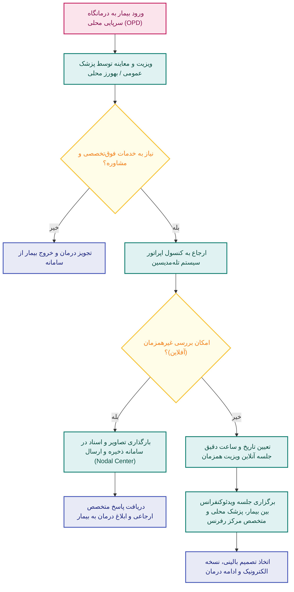

---

### ۴.۳. مزایا و چالش‌های استقرار تله‌مدیسین در بستر سلامت ایران

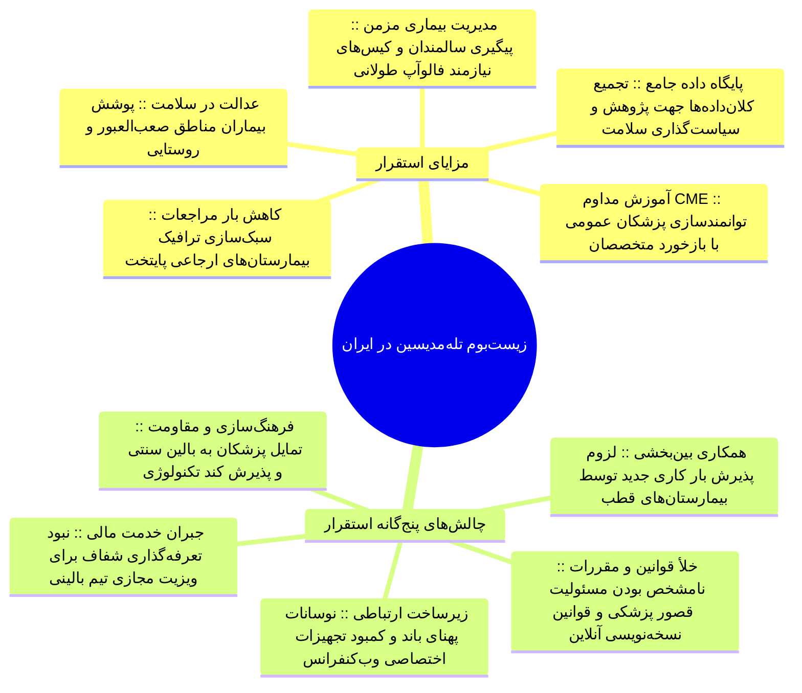

> [!warning] چالش‌های حقوقی و اخلاقی در طبابت از راه دور
> در صورت بروز عوارض ناخواسته یا خطای تشخیصی ناشی از نقص تصاویر ارسالی، مسئولیت حقوقی (*Malpractice*) میان پزشک ارجاع‌دهنده محلی و پزشک مشاور مبهم خواهد بود. از منظر اخلاق بالینی، پزشک باید دارای صلاحیت تشخیص مرز اطمینان باشد و هر زمان که معاینه فیزیکی و آزمایش حضوری جهت حفظ حیات بیمار اجتناب‌ناپذیر گردد، روند مجازی را فوراً متوقف و **دستور ارجاع فیزیکی فوری** صادر نماید.