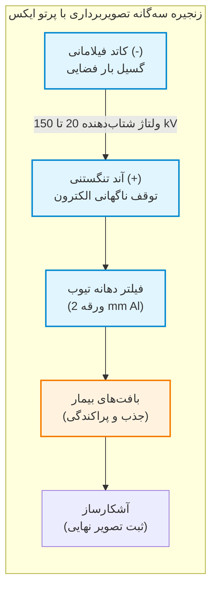
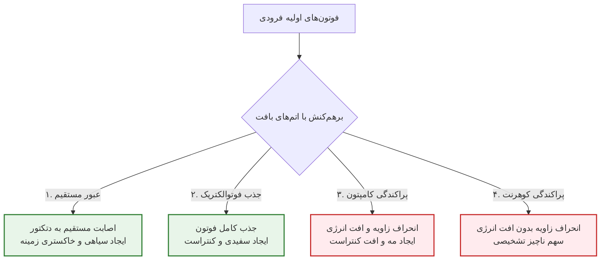
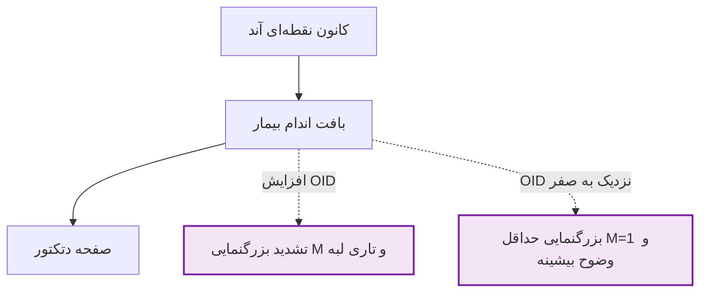
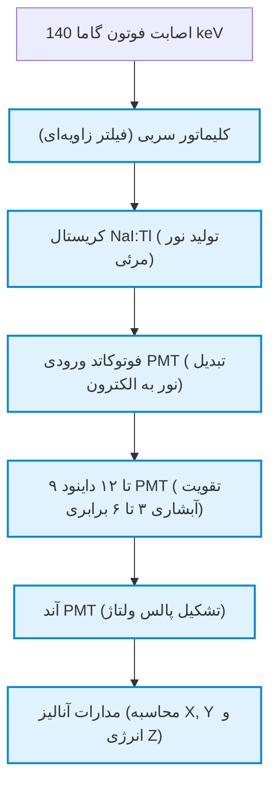
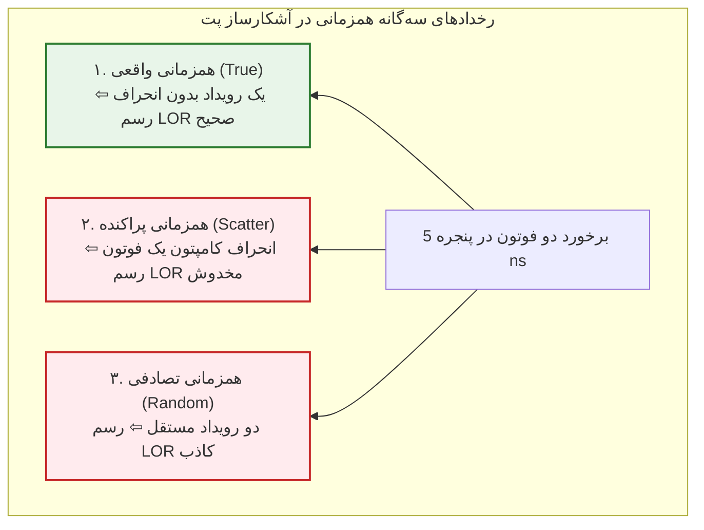
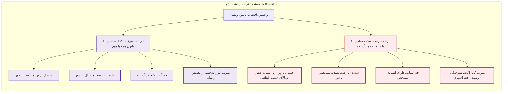
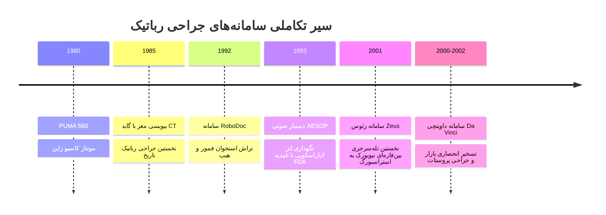
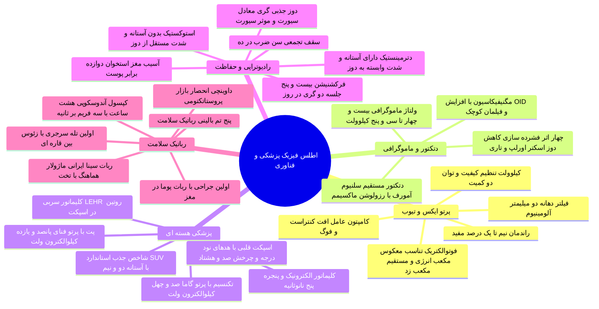

# خلاصه پایان‌ترم فیزیک پزشکی

## فصل ۱: فیزیک تولید پرتو ایکس، تیوب و تضعیف بافتی

### ۱. زنجیره تشکیل تصویر و بازدهی فیزیکی تیوب

* **زنجیره سه‌گانه تصویربرداری:**
  1. **چشمه تابش (تیوب):** شتاب‌گیری الکترون‌ها از کاتد و برخورد به آند هدف در خلأ کامل.
  2. **تضعیف در بافت:** تضعیف ناهمگن فوتون‌ها بر پایه ضخامت، چگالی ($d$) و عدد اتمی ($Z$).
  3. **آشکارسازی:** سنجش شار عبوری و ترجمه به کنتراست دیداری.

> [!definition] تیوب پرتو ایکس
> محفظه خلأ فوق‌العاده بالا شامل کاتد حرارتی منفی و آند تنگستنی مثبت جهت تبدیل انرژی جنبشی الکترون‌های پرشتاب به امواج الکترومغناطیسی ایکس.

> [!important] راندمان نازل و اتلاف حرارتی تیوب
> راندمان تیوب در محدوده تشخیصی فاجعه‌بار است؛ **۹۹٪ تا ۹۹.۵٪** کل انرژی ورودی تبدیل به **حرارت، پرتوهای فروسرخ، نور مرئی و فرابنفش** شده و تنها **۰.۵٪ تا ۱٪** انرژی الکترون‌ها به **پرتو ایکس مفید تشخیصی** بدل می‌شود. تنگستن ($Z = 74$) به علت عدد اتمی و نقطه ذوب بالا انتخاب اول ساخت آند است.

> [!tip] فیلتراسیون دهانه تیوب
> تیغه ۲ میلی‌متری آلومینیوم (2 mm Al) در درگاه خروجی فوتون‌های کم‌انرژی سطحی را حذف می‌کند؛ این فوتون‌ها توان عبور از بدن را نداشته و صرفاً *دوز جذبی پوست بیمار* را بالا می‌برند.

### ۲. کمیت، کیفیت و تنظیمات تابش

* **کمیت پرتو (Quantity):** تعداد کل فوتون‌ها؛ متناسب با رابطه:
  $$\text{Quantity} \propto (\text{kVp})^2 \times \text{mA} \times s \times Z$$
* **کیفیت پرتو (Quality):** انرژی فوتون‌ها و قدرت نفوذ؛ منحصراً متناسب با **ولتاژ بیشینه تیوب (kVp)**.
* **فاکتور mAs:** حاصل‌ضرب جریان در زمان تابش ($mA \times s$). مهارکننده نویز کوانتومی تصویر. راهبرد رفع تاری حرکتی: **جریان بالا (mA بالا) + زمان اکسپوژر کوتاه (s کوتاه)**.

### ۳. جدول جامع مقایسه برهم‌کنش‌های سه‌گانه پرتو ایکس با ماده

| برهم‌کنش اتمی                       | الکترون هدف                       | سرنوشت فوتون فرودی                                    | وابستگی به متغیرهای فیزیکی                        | پیامد کلینیکی در تصویربرداری                                          |
| :---------------------------------- | :-------------------------------- | :---------------------------------------------------- | :------------------------------------------------ | :-------------------------------------------------------------------- |
| **جذب فوتوالکتریک (Photoelectric)** | لایه‌های داخلی مقید (نظیر لایه K) | **نابودی کامل فوتون** و گسیل مازاد به شکل فوتوالکترون | متناسب با $\frac{Z^3}{E^3}$ و چگالی بافت ($d$)    | **پایه اصلی ایجاد کنتراست تشخیصی**؛ سفیدی استخوان در برابر بافت نرم   |
| **پراکندگی کامپتون (Compton)**      | لایه‌های خارجی با پیوند سست       | انحراف زاویه‌ای همراه با افت فرکانس و انرژی           | با *افزایش انرژی* نسبت به فوتوالکتریک غالب می‌شود | **افت کنتراست تصویر**؛ پاشیدن لایه مه‌آلودگی خاکستری (Fog) روی دتکتور |
| **پراکندگی کوهرنت (Coherent)**      | کل بار میدان الکتریکی اتم         | انحراف زاویه پرتو **بدون کوچک‌ترین افت انرژی**        | انحصاراً در فوتون‌های *انرژی بسیار پایین*         | انحراف ناچیز فوتون‌ها و افت اندک وضوح لبه‌ای                          |

> [!tip] حساسیت مکعبی فوتوالکتریک در آزمون‌ها
> به علت وابستگی فوتوالکتریک به $Z^3 / E^3$:
> 1. اگر انرژی پرتو **۳ برابر** شود، نرخ فوتوالکتریک $3^3 = 27$ **برابر افت می‌کند**.
> 2. اگر عدد اتمی بافت **۲ برابر** شود، جذب فوتوالکتریک $2^3 = 8$ **برابر جهش می‌یابد**.
> نتیجه: تفاوت جزئی کلسیم استخوان با آب و چربی تمایز کنتراستی شدیدی می‌سازد.

### ۴. قانون تضعیف بیر-لمبرت
افت نمایی شدت فوتون‌های تک‌انرژی در عبور از محیط با ضریب تضعیف خطی $\mu$ و ضخامت $x$:
$$N = N_0 \, e^{-\mu x} \quad \implies \quad \mu_{\text{total}} = \mu_{\text{photoelectric}} + \mu_{\text{compton}} + \mu_{\text{coherent}}$$

---

## فصل ۲: رادیوگرافی پروژکشن، دتکتورها و ماموگرافی بافت نرم

### ۱. هندسه تشکیل تصویر و مهار بزرگنمایی
به دلیل واگرایی باریکه فوتون‌ها از کانون نقطه‌ای آند، سایه روی دتکتور همواره بزرگ‌تر از جسم واقعی است:
$$M = \frac{\text{Image Size}}{\text{Object Size}} = \frac{\text{SID}}{\text{SOD}} = 1 + \frac{\text{OID}}{\text{SOD}}$$

> [!important] فاصله استاندارد در گرافی قفسه سینه
> فاصله چشمه تا فیلم (SID) در عکس قفسه سینه **183 cm (معادل 72 inch)** تنظیم می‌شود؛ هدف: به حداقل رساندن بزرگنمایی کاذب سایه قلب و رفع اعوجاج فضایی (برای سایر اندام‌ها فاصله روتین 100 cm است).

### ۲. جدول مقایسه جامع فناوری‌های چهارگانه آشکارساز رادیولوژی

| سیستم آشکارسازی               | ماده و سنسور اولیه                                 | واسط نور مرئی                                         | نحوه بازخوانی داده‌ها                            | رزولوشن فضایی و کیفیت لبه                             |
| :---------------------------- | :------------------------------------------------- | :---------------------------------------------------- | :----------------------------------------------- | :---------------------------------------------------- |
| **اسکرین-فیلم (Screen-Film)** | صفحات **تشدیدکننده سنتیلاتور** + امولسیون **نقره** | دارد (۱ فوتون ایکس $\leftarrow$ ۱۰۰ تا ۵۰۰ فوتون نور) | ظهور و ثبوت شیمیایی دستی یا خودکار در تاریک‌خانه | متکی بر ضخامت اسکرین؛ مستعد خطاهای تاریک‌خانه         |
| **رادیوگرافی کامپیوتری (CR)** | **فسفر ذخیره‌ساز** تحریک‌پذیر نوری (پلیت PSP)      | دارد (نشر نور آبی با تابش لیزر قرمز در ریدر)          | اسکن خط‌به‌خط با باریکه لیزر قرمز در Reader      | متوسط؛ محدود به قطر باریکه لیزر اسکن‌کننده            |
| **دیجیتال غیرمستقیم (IDR)**   | **سنتیلاتور سزیم یدید** (CsI) + آرایه **TFT**      | دارد (تبدیل فوتون به نور و سپس به بار الکتریکی)       | بازخوانی الکترونیکی ترانزیستورهای فیلم‌نازک      | بسیار خوب؛ همراه با مقدار اندکی تاری ناشی از پخش نور  |
| **دیجیتال مستقیم (DDR)**      | لایه **فوتورسانای سلنیوم آمورف** (a-Se)            | **ندارد (تبدیل مستقیم فوتون به بار)**                 | بازخوانی مستقیم بارهای الکتریکی تحت میدان ولتاژ  | **بالاترین رزولوشن فضایی** به دلیل حذف کامل واسط نوری |

> [!important] پارادوکس ضخامت صفحه اسکرین
> صفحات ضخیم سنتیلاتور فوتون بیشتری جذب کرده و *دوز جذبی بیمار را کم می‌کنند*، اما نور مرئی در عمق لایه پخش شده و **وضوح فضایی (Spatial Resolution) تخریب می‌شود**؛ صفحات نازک رزولوشن بالایی دارند ولی دوز بیشتری می‌طلبند.

### ۳. استراتژی بالینی انتخاب کیلوولت (kVp)
1. **ولتاژ پایین (55 تا 60 kVp):** مچ دست، ساعد و استخوان‌ها جهت بیشینه‌سازی اثر فوتوالکتریک ($Z^3$) و افزایش کنتراست؛ همچنین کاربرد در ماده حاجب باریوم و ید.
2. **ولتاژ بالا (110 تا 120 kVp):** قفسه سینه جهت محو کردن سایه استخوان دنده‌ها و آشکارسازی پارانشیم نرم ریه از طریق سرکوب فوتوالکتریک و غلبه کامپتون.

### ۴. گرید ضدپراکندگی (Anti-Scatter Grid)
* نسبت گرید: $\text{Grid Ratio} = \frac{h}{D}$ (ارتفاع تیغه‌های سربی بر فاصله بینابینی).
* تیغه‌های سربی فوتون‌های پراکنده مورب کامپتون را مسدود می‌کنند. تکنسین باید افت فوتون مفید اولیه را با **افزایش mAs دستگاه جبران کند که موجب افزایش دوز بیمار خواهد شد**.

### ۵. فیزیک ماموگرافی و بافت پستان
* **ماهیت:** رادیوگرافی بافت نرم (*Soft Tissue Radiography*) با تفاوت ضریب تضعیف ($\mu$) بسیار ناچیز میان چربی و بافت غددی.
* **اپیدمیولوژی:** ابتلای **۱ زن از هر ۸ زن** به سرطان پستان؛ هدف: تقلیل خطای تشخیصی ۳۰٪ و حذف ۸۰٪ بیوپسی‌های منفی غیرضروری.
* **دامنه ولتاژ:** ولتاژهای بسیار پایین (**24 تا 35 kVp**) جهت تحریک فوتوالکتریک:
  * چربی خالص: 24 kVp
  * مختلط نرمال: 28 تا 33 kVp
  * غددی متراکم: 33 تا 35 kVp
* **زمان تابش:** طولانی (**بیش از ۲ تا ۳ ثانیه**) به دلیل ولتاژ پایین و افت شار فوتون‌ها طبق رابطه توان دوم ولتاژ.
* **کاتد دوکانونی:** *فیلمان کوچک* برای ماکسیمم کردن رزولوشن و رؤیت میکروکلسیفیکاسیون‌ها؛ *فیلمان بزرگ* برای بالا بردن mA و کاهش نویز در بافت متراکم.
* **فوتوتایمر ایمنی:** حسگر الکترونیکی جهت قطع خودکار تابش در صورت رسیدن دوز به سقف پرتوگیری بافت پستان.
* **چهار دستاورد فشرده‌سازی با پدال (Compression):**
  1. کاهش دوز جذبی به علت تقلیل ضخامت.
  2. رفع برهم‌نهی (Overlap) بافت‌های غددی.
  3. مهار تولید پراکندگی کامپتون.
  4. حذف تاری حرکتی با فیکس کردن فیزیکی اندام.
* **پدال موضعی (Spot Compression):** تمرکز فشار مکانیکی روی کانون مشکوک جهت کنار زدن بافت‌های روی‌هم‌افتاده.
* **بزرگنمایی تشخیصی:** قراردادن پستان روی پلتفرم مرتفع (افزایش OID تا ۲ برابر بزرگنمایی)؛ **استفاده از فیلمان کوچک کاتد برای مهار تاری هندسی لبه‌ها الزامی است**.

---

## فصل ۳: پزشکی هسته‌ای و تصویربرداری مولکولی (گاما کمرا، SPECT و PET)

### ۱. تمایزهای بنیادین تصویربرداری هسته‌ای با رادیولوژی
* رادیولوژی: تصویربرداری ساختاری/آناتومیک با هندسه **عبوری (Transmission)** با چشمه خارج از تنه بیمار.
* پزشکی هسته‌ای: تصویربرداری عملکردی/متابولیک با هندسه **گسیلی (Emission)** با چشمه فعال درون بدن بیمار.
* تفکیک تابش: پرتوهای *پرنفوذ گاما و پوزیترون* برای تصویربرداری؛ ذرات *کوتاه‌برد و مخرب آلفا و بتا منفی* برای رادیونوکلئیدتراپی و تخریب تومورها.

### ۲. رادیونوکلئیدها، مقادیر فیزیکی و کیت‌های دارویی
* **تکنسیم-99m (Tc-99m):** سلطان *SPECT*؛ گسیل فوتون گامای خالص **140 keV** با نیمه‌عمر فیزیکی **6 ساعت** تولیدشده در ژنراتور هسته‌ای بیمارستانی.
* **فلوئور-18 (F-18):** ستون فقرات *PET*؛ گسیل پوزیترون با نیمه‌عمر **110 دقیقه** تولیدشده در سیکلوترون.
* **یکاهای اکتیویته:**
  * $1\text{ Bq} = 1\text{ dps}$ (یک واپاشی بر ثانیه)
  * $1\text{ Ci} = 3.7 \times 10^{10}\text{ dps}$
  * $1\text{ mCi} = 37\text{ MBq}$
  * محدوده دوز معمول تزریق بالینی: **1 تا 30 mCi**
* **کیت‌های بالینی:**
  * Tc-99m + MDP: استخوان و کشف زودهنگام متاستاز اسکلتی.
  * Tc-99m + MIBI: خون‌رسانی و پرفیوژن میوکارد قلب.
  * Tc-99m + DTPA: نرخ فیلتراسیون گلومرولی کلیه.
  * F-18 + FDG: متابولیسم قند در انکولوژی با توان اثبات اثربخشی درمان در **روز هشتم** در برابر ۲۴ هفته سی‌تی اسکن.
  * ردیاب‌های گیرنده‌محور نوین: **PSMA** در سرطان پروستات، **DOTATATE** در تومورهای نورواندوکرین، و **FAPI** در تومورهای توپر فیبروبلاستی.

### ۳. انواع کلیماتورهای گاما کمرا
* **کلیماتور LEHR (کم‌انرژی های‌رزولوشن):** کلیماتور روتین بخش‌ها برای ایزوتوپ **تکنسیم** در اسکن *قلب* و *استخوان*.
* **کلیماتور HEGP:** سپتاهای ضخیم سربی برای مهار نشت پرتوهای پرانرژی ایزوتوپ‌های **ید** (نظیر I-131).
* **سوراخچه‌های لانه‌زنبوری شش‌ضلعی:** ممانعت از ایجاد فضای مرده میان دیواره‌های سربی.

### ۴. الگوهای پرفیوژن اسپکت قلب
* **پیکربندی ۹۰ درجه هدها:** دو هد متعامد با چرخش ۱۸۰ درجه اختصاصی در سمت چپ سینه جهت دستیابی به بالاترین کانت در کمترین زمان.
* **ایسکمی میوکارد:** نقص جذب در فاز استرس + بهبود و طبیعی شدن جذب در فاز استراحت.
* **انفارکتوس (بافت نکروزه):** نقص دائمی و خاموشی جذب در هر دو فاز استرس و استراحت.

### ۵. فیزیک فنا (Annihilation) و آشکارسازی پت اسکن
پوزیترون پس از طی مسافت حدود **0.1 mm** با یک الکترون آزاد برخورد کرده و پدیده فنا رخ می‌دهد. جرم ذرات محو و **دو فوتون گامای هم‌زمان با انرژی 511 keV** در دو جهت مخالف متولد می‌شوند. به دلیل تکانه باقیمانده، زاویه حقیقی فوتون‌ها **حدود 179.75 درجه** بوده و انحراف زاویه‌ای **0.25 درجه** وجود دارد.

* **کلیماتور الکترونیکی:** نبود کلیماتور فیزیکی سربی؛ سنجش کوینسیدنس فوتون‌ها در پنجره زمانی حدود **5 ns** و اتصال دو نقطه فعال با خط پاسخ (**LOR**).
* **کریستال‌های سنگین پت:** BGO (جنرال الکتریک)، LSO (زیمنس)، GSO (فیلیپس) با چگالی و سرعت بسیار فراتر از NaI.

### ۶. شاخص جذب استاندارد (SUV) و پروتکل آمادگی پت
$$\text{SUV} = \frac{\text{Tissue Activity Concentration}}{\frac{\text{Injected Activity}}{\text{Body Weight}}}$$
* **آستانه سرانگشتی:** $\text{SUV} > 2.5$ (مشکوک به بدخیمی)؛ $\text{SUV} < 2.5$ (توده خوش‌خیم یا غیرفعال).
* **آمادگی بیمار:** ناشتایی ۶ تا ۱۲ ساعت؛ قند خون مجاز **130 تا 150 mg/dL**؛ استراحت فیزیکی **۲۴ ساعت عادی و ۷۲ ساعت برای ورزشکاران** جهت جلوگیری از آپ‌تیک عضلات اسکلتی و پکتورالیس.
* **فواصل پس از مداخلات:** ۲ هفته بعد از شیمی‌درمانی، ۴ تا ۶ هفته بعد از جراحی، ۶ هفته بعد از پرتودرمانی.
* **توزیع فیزیولوژیک طبیعی FDG:** کورتکس مغز (بیشترین مصرف قند)، عضله میوکارد، کلیه، حالب و مثانه (مسیر دفع ادراری).

### ۷. جدول مقایسه تطبیقی سامانه‌های SPECT و PET

| شاخص ارزیابی | توموگرافی تک‌فوتونی (SPECT) | توموگرافی گسیل پوزیترون (PET) |
| :--- | :--- | :--- |
| **نوع پرتو و انرژی** | فوتون گامای منفرد با انرژی متغیر (پایه تکنسیم: 140 keV) | جفت‌فوتون گامای ناشی از فنا با **انرژی ثابت 511 keV** |
| **روش کلیمیشن** | کلیماتور فیزیکی سربی (فدا شدن بیش از ۹۹٪ پرتوها) | **کلیماتور الکترونیکی** بر پایه پنجره زمانی 5 ns و رسم LOR |
| **هندسه آشکارساز** | ۱ تا ۲ هد مسطح با چرخش مکانیکی در گانتری | **رینگ کامل پیوسته ۳۶۰ درجه ثابت** بدون نیاز به چرخش |
| **کریستال سنسور** | صفحه یکپارچه بلور NaI:Tl | قطعات بلوکی پیکسلی متراکم (BGO, LSO, GSO) |
| **رزولوشن فضایی** | ۸ تا ۱۲ میلی‌متر (ناتوان در تفکیک ضایعات ریز) | **۴ تا ۵ میلی‌متر** (قابلیت ثبت کانون‌های ۳ میلی‌متری) |
| **حساسیت فوتونی** | پایین به دلیل انسداد پرتوها در سپتاهای سربی | **فوق‌العاده بالا** به علت زاویه فضایی ۳۶۰ درجه و کلیمیشن نرم‌افزاری |
| **استقرار در کلینیک** | به هر دو صورت اسپکت تنها و اسپکت/سی‌تی موجود است | **صرفاً به صورت سیستم هیبرید پت/سی‌تی (PET/CT)** |

---

## فصل ۴: رادیوتراپی، انکولوژی پرتوی و اصول حفاظت دزیمتری

### ۱. اثرات بیولوژیک پرتو بر پایه منشور کمیسیون NCRP

### ۲. زنجیره کمیت‌های سه‌گانه دزیمتری

$$D = \frac{E}{m} \quad \xrightarrow{\times Q} \quad H = D \times Q \quad \xrightarrow{\times W_T} \quad E = H \times W_T$$

* **دوز جذبی (D):** انرژی جذب‌شده بر واحد جرم؛ یکای بین‌المللی **گری (Gy = 1 J/kg)** و یکای سنتی **راد (rad)** ($1\text{ Gy} = 100\text{ rad}$).
* **دوز معادل (H):** حاصل‌ضرب در فاکتور کیفیت پرتو ($Q$)؛ یکای SI **سیورت (Sv)** و یکای سنتی **رم (rem)** ($1\text{ Sv} = 100\text{ rem}$ و $1\text{ rem} = 10\text{ mSv}$).
  * مقادیر ضریب کیفیت: فوتون‌های ایکس، گاما و الکترون = 1 | پروتون = 2 | نوترون = 5 تا 20 | ذرات سنگین آلفا = 20.
* **دوز مؤثر (E):** حاصل‌ضرب دوز معادل در فاکتور وزنی حساسیت بافت ($W_T$) با یکای **سیورت (Sv)**.
  * فاکتور وزنی مغز استخوان = 0.12 و پوست = 0.01.
  * *تله تستی:* آسیب دوز یکسان اشعه به مغز استخوان **دقیقاً ۱۲ برابر مخرب‌تر** از پوست است.

### ۳. اصول سه‌گانه منشور بین‌المللی حفاظت پرتوی
1. **توجیه‌پذیری (Justification):** اثبات غلبه سود بر زیان؛ ریشه در *نبود آستانه برای اثرات استوکستیک* دارد.
2. **بهینه‌سازی (Optimization - فلسفه ALARA):** *As Low As Reasonably Achievable*. کاهش دوز در مقایسه با تابش زمینه طبیعی سالانه (1 تا 3 mSv/year).
   * *در رادیولوژی تشخیصی:* کاهش دوز کلی بدن بیمار با حفظ ارزش تشخیصی عکس.
   * *در رادیوتراپی درمانی:* کاهش دوز بافت‌های سالم اطراف تومور (OAR)، نه کاهش دوز کشنده توده تومور!
3. **محدودسازی دوز (Dose Limitation):** سقف عددی برای عموم و پرتوکاران.
   * **قانون بنیادین:** **بیماران تحت تشخیص یا درمان هیچ سقف دوز عددی و قانونی ندارند!**

### ۴. سقف‌های دوز و سناریوهای حل پرونده
* **سقف تجمعی پرتوکاران:** $\text{Cumulative Dose} \le \text{Age} \times 10\text{ mSv}$.
* **افراد زیر ۱۸ سال و محصلین:** حداکثر 1 mSv/year.
* **جنین پرتوکار باردار:** سقف کل بارداری **5 mSv** به همراه الزام به توزیع یکنواخت **حداکثر 0.5 mSv در هر ماه**.
* **حقوق قانونی بارداری:** اخراج، تعلیق، تعدیل یا مرخصی بدون حقوق تخلف است؛ صرفاً انتقال موقت به محیط‌های اداری و کم‌پرتو مجاز است.
* **همراهان بیمار:** در رده «پرتوگیری پزشکی» محسوب شده و مشمول سقف پرتوگیری عمومی نیستند.

### ۵. رادیوتراپی انکولوژی و رادیوبیولوژی فرکشنیشن
* سرطان عامل ۲۵٪ کل مرگ‌هاست؛ رادیوتراپی در ۵۰ تا ۶۰ درصد کل بیماران کاربرد دارد (۶۰٪ آن با قصد رادیکال و ریشه‌ای).
* **پروتکل تقطیع دوز (Fractionation):** دوز کشنده تام ۵۰ تا ۶۰ گری به صورت **۲۵ جلسه روزانه ۲ گری (2 Gy/fraction)** تجویز می‌شود؛ فاصله ۲۴ ساعته امکان *ترمیم آسیب‌های تحت‌کشنده در بافت نرمال* را مهیا می‌سازد در حالی که سلول‌های سرطانی به دلیل نقص ساختاری منهدم می‌شوند.
* **سهم تکنیک‌ها:** باریکه خارجی (EBRT) حدود ۹۰٪؛ براکی‌تراپی (درمان نزدیک با کاشت سید یا وایر) حدود ۱۰٪.

---

## فصل ۵: رباتیک در پزشکی و فناوری‌های سلامت

### ۱. پنج تم نوآورانه رباتیک سلامت
1. **مداخلات پزشکی (Medical Interventions):** جراحی‌های لاپاراسکوپی کم‌تهاجمی و ارتوپدی.
2. **مراقبت‌های حرفه‌ای سلامت (Professional Care):** اسکراب‌نرس (شمارش ابزار و گاز)، سیرکولیتینگ، حمل بیمار، پایش سالمندان.
3. **درمان‌های توانبخشی (Rehabilitation Treatment):** فیزیوتراپی مکرر در طول درمان فعال؛ ۴ مود کاری: پسیو، اکتیو، اکتیو-اسیستد، اکتیو-رزیستد.
4. **فناوری‌های کمکی (Assistive Technology):** پس از خاتمه درمان جهت جبران نقص دائم (کاشت مغزی BCI، اسکلت‌های پوشیدنی).
5. **پیشگیرانه و تشخیصی (Preventive & Diagnostics):** کپسول آندوسکوپی بلعیدنی روده باریک (۸ ساعت سفر با نرخ 3 fps).

### ۲. تقویم تاریخی پیشرفت‌های جراحی رباتیک

### ۳. اصول حاکم بر جراحی رباتیک
* **قانون بنیادین:** در سراسر جهان **هیچ ربات جراح خودمختاری (Autonomous) وجود ندارد**؛ سامانه‌ها صددرصد **راهبر-پیرو (Master-Slave)** هستند.
* **مقیاس‌گذاری حرکت (Motion Scaling):** نگاشت ۱ سانتی‌متر جابه‌جایی دست پزشک به ۱ میلی‌متر نوک ابزار.
* **فیلتراسیون لرزش دست (Tremor Filtration):** حذف ارتعاشات فیزیولوژیک ناشی از خستگی.
* **رفع اثر الاکلنگی (Fulcrum Effect):** خنثی کردن حرکت معکوس ابزارها در دیواره شکم.
* **مهار خطرات شغلی:** حفاظت جراح در برابر گاز CO₂ شکم (فشار ۱۰ تا ۱۵ میلی‌متر جیوه که عامل آلزایمر است)، پرتوها و گازهای بیهوشی.

### ۴. جدول مقایسه انسان جراح در برابر ربات جراح

| ویژگی و شاخص عملکردی | انسان جراح | ربات جراح (سامانه‌های Master-Slave) |
| :--- | :--- | :--- |
| **قضاوت و تصمیم‌گیری بالینی** | **فوق‌العاده عالی و منعطف** در شرایط پیش‌بینی‌نشده | **کاملاً ناتوان** و وابسته به فرمان اپراتور جراح |
| **خستگی‌پذیری و پایداری دقت** | افت کیفیت و لرزش دست در جراحی‌های طولانی | **خستگی‌ناپذیر و کاملاً پایدار** حتی در اعمال ۸ ساعته |
| **مقیاس هندسی و کنترل لرزش** | محدود به دهم میلی‌متر همراه با لرزش طبیعی دست | **دقت میکرومتری** با اسکیلینگ حرکتی و حذف کامل لرزش |
| **ابعاد برش و مجری نهایی** | نیازمند برش‌های باز پوستی ۱۰ تا ۲۰ سانتی‌متری | **برش‌های مینیاتوری ۵ تا ۱۰ میلی‌متری** با ابزار اندوریست |
| **تطبیق با بافت‌های دفرمه‌شونده** | عالی؛ اصلاح لحظه‌ای موقعیت با لمس تجربی بافت | ضعیف؛ نیازمند الگوریتم‌های پیچیده غیرخطی |
| **ایمنی در برابر آلاینده‌ها** | آسیب‌پذیر در برابر اشعه، گاز CO₂، بیهوشی و عفونت | **کاملاً ایمن** و امکان جراحی از راه دور در اتاق کنترل |

### ۵. دستاوردهای بومی جمهوری اسلامی ایران
* **ربات روبولنز (Robolens - 2005):** دستیار نگهدارنده لنز لاپاراسکوپی جهت جراحی تک‌نفره (*Solo Surgery*) با ثبت **بیش از ۱۰۰۰ عمل بالینی روی انسان** در بیمارستان امام خمینی (ره).
* **سامانه جراحی رباتیک سینا (Sina):**
  * پروتوتایپ استریت (۲۰۱۵): انجام عمل موفق کوله‌سیستکتومی از راه دور روی گوسفند.
  * سامانه سینافلیکس (۲۰۱۹): مجهز به ابزارهای منعطف داخل شکمی.
* **برتری‌های مهندسی سینا بر داوینچی:**
  1. ساختار کاملاً **ماژولار** با هدهای حرکتی مجزا بر بالین.
  2. هماهنگی و اتصال کامل به تخت جراحی (حرکت همزمان ربات و تخت بدون قطع عمل).
  3. تغییر وضعیت ارگونومیک کنسول از **نشسته به ایستاده زیر ۵ ثانیه**.
* **شبیه‌ساز ملی لاپاراسکوپی ایران:** شبیه‌ساز مهارت‌سنجی منطبق بر استاندارد بین‌المللی **MISTELS** همراه با استخراج خودکار کارنامه، Learning Curve و لاگین اختصاصی دستیاران.

---

## فصل ۶: نقشه ذهنی یکپارچه کل مباحث آزمونی

---

## فصل ۷: جدول نهایی فرمول‌ها، اعداد کلیدی و تله‌های تستی

| متغیر / شاخص علمی | فرمول ریاضی یا مقدار عددی | نکته راهبردی و تله تستی شب امتحان |
| :--- | :--- | :--- |
| **راندمان تیوب پرتو ایکس** | **۰.۵٪ تا ۱٪ پرتو مفید** (۹۹٪ تلفات) | استفاده اجباری از آند تنگستنی با عدد اتمی ۷۴ و نقطه ذوب بالا |
| **کمیت فوتون‌های تیوب** | $\text{Quantity} \propto (\text{kVp})^2 \times \text{mA} \times s \times Z$ | تابع توان دوم ولتاژ بیشینه و حاصل‌ضرب جریان در زمان (mAs) |
| **جذب فوتوالکتریک** | $\text{Probability} \propto \frac{Z^3}{E^3} \times d$ | ۳ برابر شدن انرژی = افت ۲۷ برابری فوتوالکتریک؛ عامل اصلی کنتراست |
| **قانون بیر-لمبرت** | $N = N_0 \, e^{-\mu x}$ | افت نمایی شار فوتون‌ها؛ $\mu$ ضریب تضعیف خطی بر حسب $\text{cm}^{-1}$ |
| **بزرگنمایی رادیوگرافی** | $M = \frac{\text{SID}}{\text{SOD}} = 1 + \frac{\text{OID}}{\text{SOD}}$ | برای $M = 1$ باید OID صفر شود؛ فاصله قفسه سینه 183 cm (72 inch) |
| **نسبت گرید ضدپراکندگی** | $\text{Grid Ratio} = \frac{h}{D}$ | افزایش نسبت گرید = مهار بهتر کامپتون، اما الزام به افزایش دوز جذبی |
| **کیلوولت ماموگرافی** | **۲۴ تا ۳۵ کیلوولت** | بیشینه‌سازی فوتوالکتریک در بافت نرم؛ زمان تابش طولانی ۲ تا ۳ ثانیه |
| **فوتون و نیمه‌عمر تکنسیم** | **140 keV و ۶ ساعت** | استاندارد طلایی SPECT و کلیماتور LEHR؛ ژنراتور بیمارستانی |
| **فوتون و نیمه‌عمر فلوئور-18** | **511 keV و ۱۱۰ دقیقه** | محصول سیکلوترون؛ تولید دو فوتون متقابل در اثر واکنش فنا |
| **انحراف زاویه‌ای در پت** | **حدود 0.25 درجه** (زاویه اسمی $180^\circ$) | ناشی از تکانه باقیمانده پوزیترون؛ زاویه واقعی حدود $179.75^\circ$ |
| **پنجره زمانی کوینسیدنس پت** | **حدود 5 ns (نانوثانیه)** | کلیمیشن الکترونیک؛ تمایز رخدادهای True و Scatter و Random |
| **آستانه تشخیصی SUV** | **عدد 2.5** | بالای ۲.۵ مشکوک به بدخیمی تومور؛ ناشتایی با قند خون 130 تا 150 |
| **ضریب کیفیت پرتو (Q)** | فوتون/الکترون: 1 \| پروتون: 2 \| آلفا: 20 | تفاوت دوز جذبی (Gy) با دوز معادل و مؤثر بیولوژیک (Sv) |
| **سقف تجمعی شغلی NCRP** | $\text{Cumulative} \le \text{Age} \times 10\text{ mSv}$ | پرتوگیری شغلی طول عمر؛ افراد زیر ۱۸ سال حداکثر 1 mSv/year |
| **سقف دوز جنین پرتوکار** | **کل بارداری 5 mSv و هر ماه 0.5 mSv** | الزام به توزیع یکنواخت؛ ممنوعیت اخراج یا تعلیق پرتوکار باردار |
| **فرکشنیشن رادیوتراپی** | **روزانه ۲ گری در ۲۵ جلسه** | دوز تام ۵۰ تا ۶۰ گری؛ فرصت ۲۴ ساعته ترمیم برای سلول سالم |
| **اولین جراحی رباتیک تاریخ** | **سال ۱۹۸۵ با ربات PUMA 560** | بیوپسی بافت مغز تحت گاید سی‌تی اسکن (شاخه جراحی اعصاب) |
| **اولین جراحی بین‌قاره‌ای** | **سال ۲۰۰۱ با سامانه زئوس (Zeus)** | نیویورک به استراسبورگ فرانسه (۶۰۰۰ کیلومتر) روی کیسه صفرا |
| **سهم پروستاتکتومی داوینچی** | **۹۰ تا ۹۵ درصد کل اعمال آمریکا** | انحصار تاییدیه‌های رسمی FDA و CE با ساختار Master-Slave |
| **کپسول آندوسکوپی گوارشی** | **۸ ساعت پیمایش با نرخ 3 fps** | پایش مخاط روده باریک؛ ذخیره روی هارد کمری و دفع از رکتوم |