# رادیوتراپی (دکتر گرایلی)

## بخش 1: ماهیت پرتوهای یونساز و طبقه‌بندی بیولوژیک پاسخ بافتی (استوکستیک در برابر دترمینستیک)

تشعشعات در فیزیک بهداشت و پزشکی بر مبنای توانایی جداسازی الکترون مداری از اتم‌ها و تبدیل مولکول‌ها به یون، به دو خانواده بزرگ **پرتوهای غیریونساز** (نظیر امواج رادیویی RF در MRI و امواج مکانیکی فراصوت در سونوگرافی) و **پرتوهای یونساز** تقسیم می‌شوند. پرتوهای یونساز خود شامل دو شاخه *بدون بار الکتریکی* (فوتون‌های پرتو ایکس، تشعشعات گاما و ذرات نوترون) و *دارای بار الکتریکی* (باریکه‌های الکترونی، پروتون‌ها و ذرات سنگین آلفا) هستند. در طب بالینی، این تشعشعات به دو هدف مستقل **تشخیصی** (رادیولوژی و پزشکی هسته‌ای) و **درمانی** (پرتودرمانی با باریکه خارجی EBRT و براکی‌تراپی BT) به کار می‌روند. چنانچه بدن انسان تحت تابش مهارنشده پرتوهای یونساز قرار گیرد، عوارض مرگباری نظیر مرگ سلولی، بروز انواع سرطان، سوختگی‌های حاد پوستی، کاتاراکت (کدورت عدسی چشم)، جهش‌های ژنتیکی نسلی و ناباروری دائم یا موقت پدید می‌آید.

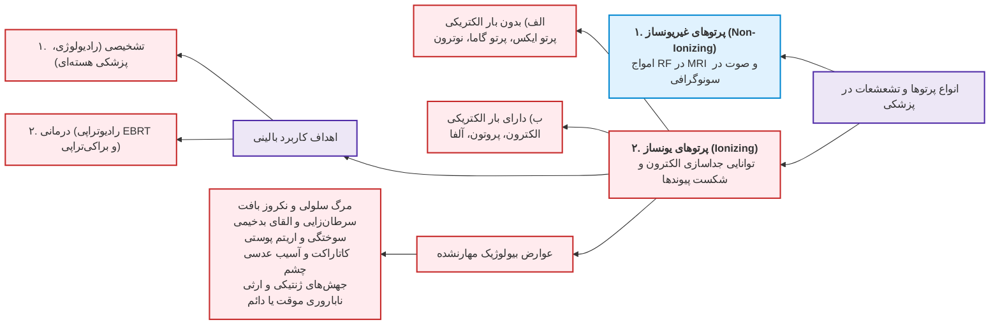

شورای ملی حفاظت و اندازه‌گیری پرتو آمریکا (NCRP) تمامی واکنش‌های فیزیوپاتولوژیک بافت زنده به تابش‌های یونساز را بر پایه دو متغیر بنیادین یعنی **احتمال وقوع** و **شدت عارضه**، به دو گروه مجزا تقسیم کرده است:

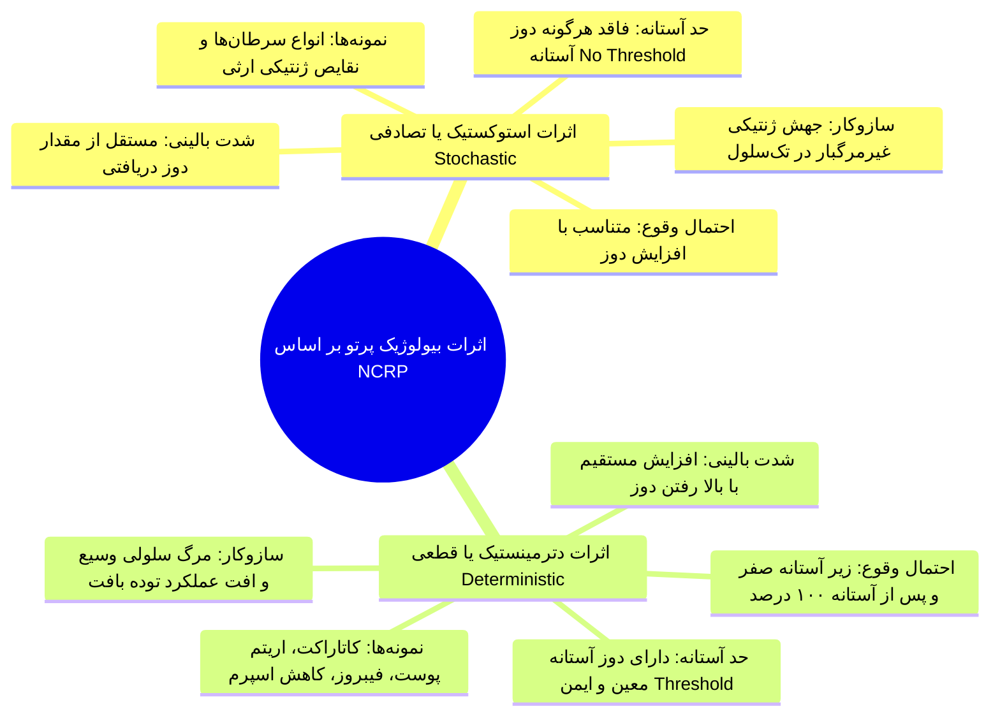

> [!definition] اثرات استوکستیک یا تصادفی (Stochastic Effects)
> عوارض بیولوژیکی دیررسی که احتمال بروز آن‌ها تابعی مستقیم از افزایش دوز جذبی است، اما شدت و وخامت بیماری هیچ ارتباطی به مقدار دوز ندارد؛ رفتار آن تابع قانون همه یا هیچ (صفر و یک) بوده و فاقد هرگونه حد آستانه دوز است.

در اثرات استوکستیک فرد یا بیمار می‌شود یا نمی‌شود؛ اگر شخصی در اثر پرتوگیری دچار لوسمی شود، شدت بدخیمی و تهاجم بیماری او به این بستگی ندارد که دوز دریافتی 10 میلی‌سیورت بوده یا 100 میلی‌سیورت، بلکه دوز بالاتر صرفاً **شانس و احتمال وقوع سرطان** را ارتقا داده است. فقدان آستانه بدین معناست که از منظر فیزیک بهداشت، هیچ سطح مطلقی از پرتو ایمن تلقی نمی‌شود و حتی 1 فوتون منفرد نیز تئوریکاً پتانسیل القای جهش سرطانی را داراست.

> [!definition] اثرات دترمینستیک یا قطعی (Deterministic Effects)
> صدمات بافتی و ارگانیکی ناشی از مرگ توده‌ای سلول‌ها که ظهور آن‌ها مستلزم عبور از یک حد دوز مشخص (Dose Threshold) است؛ در دوزهای پایین‌تر از آستانه هیچ آسیبی رخ نمی‌دهد، اما با رد شدن از آستانه، وقوع عارضه قطعی شده و شدت و سختی بالینی آن با افزایش دوز افزایش می‌یابد.

| شاخص مقایسه‌ای                  | اثرات استوکستیک / تصادفی (Stochastic)                           | اثرات دترمینستیک / قطعی (Deterministic)                                                |
| :------------------------------ | :-------------------------------------------------------------- | :------------------------------------------------------------------------------------- |
| **وابستگی احتمال وقوع به دوز**  | با افزایش دوز جذبی، **احتمال وقوع بالا می‌رود**                 | زیر آستانه صفر است؛ با گذر از آستانه **به ۱۰۰٪ (قطعی) می‌رسد**                         |
| **وابستگی شدت عارضه به دوز**    | **کاملاً مستقل از دوز جذبی** (رفتار همه یا هیچ / صفر و یک)   | **تابع مستقیم دوز جذبی** (تشدید بالینی در اثر افزایش مرگ سلولی)                     |
| **وجود دوز آستانه (Threshold)** | **فاقد هرگونه دوز آستانه** (حتی دوزهای ناچیز ریسک دارند)     | **دارای حد آستانه قطعی** (زیر آستانه مکانیسم خودترمیمی مانع آسیب می‌شود)            |
| **مکانیسم سلولی پایه‌ای**       | جهش ژنتیکی پایدار و ساب‌لتال در DNA یک تک‌سلول زنده             | مرگ وسیع سلولی، نکروز بافتی و افت حاد ساختاری ارگان                                    |
| **مثال‌های شاخص بالینی**        | انواع بدخیمی‌ها و کنسرها، نقایص و جهش‌های ژنتیکی در نسل‌های بعد | **کاتاراکت لنز چشم**، اریتم و سوختگی پوست، آتروفی بافتی، فیبروز، کاهش اسپرم و افت خونی |

## بخش 2: کمیت‌های سه‌گانه دزیمتری، فاکتورهای کیفیت پرتو و حساسیت بافتی

برای تبدیل سنجش‌های فیزیکی مواجهه با اشعه به معیارهای سلامت‌محور، سه کمیت دزیمتری به صورت زنجیره‌وار تعریف شده‌اند:

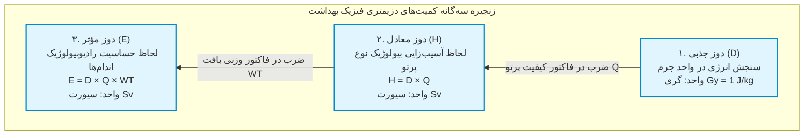

### ۱. دوز جذبی (Absorbed Dose با نماد D)
بنیادی‌ترین کمیت فیزیکی است که صرفاً به سنجش انرژی به دام افتاده درون ماده می‌پردازد:

> [!definition] دوز جذبی (Absorbed Dose)
> مقدار انرژی تابشی جذب‌شده در واحد جرم ماده تحت تابش؛ بر حسب فرمول:  $$D = \frac{E}{m}$$

* **یکای بین‌المللی (SI):** ژول بر کیلوگرم (1 J/kg) که نام اختصاصی **گری (Gray با نماد Gy)** به آن اطلاق می‌شود.
* **یکای سنتی:** **راد (rad)**؛ با رابطه تبدیل:

 $1 Gy = 100 rad$ و $1 cGy = 1 rad = 0.01 Gy$.

### ۲. دوز معادل (Equivalent Dose با نماد H)
اگر بدن انسان 1 سانتی‌گری دوز از پرتو گاما دریافت کند، اثر تخریبی ملایم‌تری نسبت به جذب همان 1 سانتی‌گری دوز از ذرات سنگین آلفا متحمل می‌شود؛ زیرا ذرات آلفا جرم و بار بالا داشته و در مسیری کوتاه یونیزاسیون فوق‌العاده چگالی ایجاد می‌کنند. برای جبران این تفاوت، دوز جذبی در **فاکتور کیفیت پرتو (Quality Factor با نماد Q)** ضرب می‌شود:

$$H = D \times Q$$

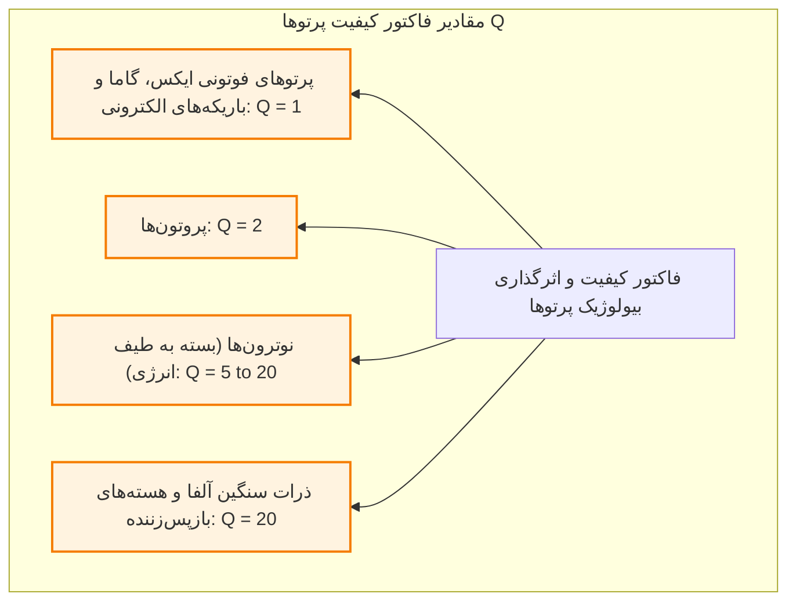

> [!important] تله تستی آزمونی: دیمانسیون ریاضی و فلسفه نام‌گذاری سیورت
> از نظر محاسبات ابعادی، فاکتور کیفیت Q عددی خالص و بدون بعد است؛ بنابراین ضرب دوز جذبی (Gy) در Q مجدداً کمیتی با بعد ژول بر کیلوگرم تولید می‌کند. با این حال، به منظور پرهیز از خلط مهلک دوز فیزیکی با دوز حامل اثرات سلامت و کیفیت اشعه، نام اختصاصی **سیورت (Sievert با نماد Sv)** در سیستم SI به عنوان یکای دوز معادل برگزیده شد.
>
> * **یکای سنتی:** **رم (rem)** سرواژه عبارت *Roentgen Equivalent Man*.
> * **روابط تبدیل واحدها:**
>   * 1 Sv = 100 rem
>   * 1 rem = 0.01 Sv = 10 mSv
>   * 1 mSv = 0.1 rem

### ۳. دوز مؤثر (Effective Dose با نماد E)
پاسخ بافت‌های مختلف بدن به اشعه یکسان نیست؛ بافت‌های با تکثیر سریع نظیر مغز استخوان یا غدد جنسی حساسیت پرتوی (Radiosensitivity) بالایی دارند، در حالی که پوست یا استخوان کورتیکال مقاوم‌ترند. کمیت **دوز مؤثر** با ضرب دوز معادل در **فاکتور وزنی بافت (Tissue Weighting Factor با نماد WT)** تعریف می‌شود:

$$E = H \times W_T = D \times Q \times W_T$$

مجموع فاکتورهای وزنی تمامی بافت‌های بدن انسان در سیستم بین‌المللی دقیقاً برابر با عدد یک است ($\sum W_T = 1$). یکای دوز مؤثر نیز در سیستم SI همان **سیورت (Sv)** و در سیستم سنتی **رم (rem)** است.

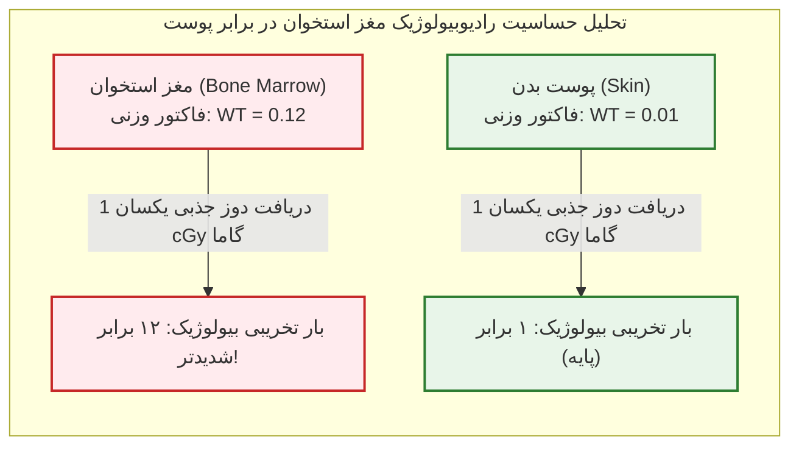

> [!tip] نکته طلایی امتحانی: مقایسه اثر اشعه در مغز استخوان و پوست
> فاکتور وزنی مغز استخوان (WT = 0.12) دقیقاً 12 برابر فاکتور وزنی پوست (WT = 0.01) است. این نسبت اثبات می‌کند که با تابش دوز جذبی کاملاً یکسان (مثلاً 1 سانتی‌گری پرتو گاما)، صدمه بیولوژیکی تحمیل‌شده به مغز استخوان به دلیل وفور سلول‌های بنیادی خونساز، **دقیقاً 12 برابر مخرب‌تر از پوست** خواهد بود.

| کمیت دزیمتری      | تعریف فیزیکی و مفهومی                      | فرمول ریاضی                 | یکای SI                    | یکای سنتی | پارامتر اختصاصی متمایزکننده  |
| :---------------- | :----------------------------------------- | :-------------------------- | :------------------------- | :-------- | :--------------------------- |
| **دوز جذبی (D)**  | انرژی تابشی به دام افتاده در واحد جرم ماده | $D = \frac{E}{m}$           | **گری (Gy)** معادل J/kg | راد (rad) | برهم‌کنش فیزیکی فوتون و جرم  |
| **دوز معادل (H)** | دوز تعدیل‌شده بر اساس کیفیت و نوع پرتو     | $H = D \times Q$            | **سیورت (Sv)**             | رم (rem)  | فاکتور کیفیت پرتو (Q)        |
| **دوز مؤثر (E)**  | دوز تعدیل‌شده بر اساس حساسیت ژنتیکی ارگان  | $E = D \times Q \times W_T$ | **سیورت (Sv)**             | رم (rem)  | فاکتور حساسیت وزنی بافت (WT) |

## بخش 3: اصول سه‌گانه سیستم بین‌المللی حفاظت پرتوی و فلسفه بهینه‌سازی (ALARA)

کمیسیون بین‌المللی حفاظت در برابر تشعشع (ICRP) و شورای ملی حفاظت و اندازه‌گیری پرتو (NCRP) منشور ایمنی کار با پرتو را بر پایه **سه اصل طلایی و تفکیک‌ناپذیر** استوار ساخته‌اند:

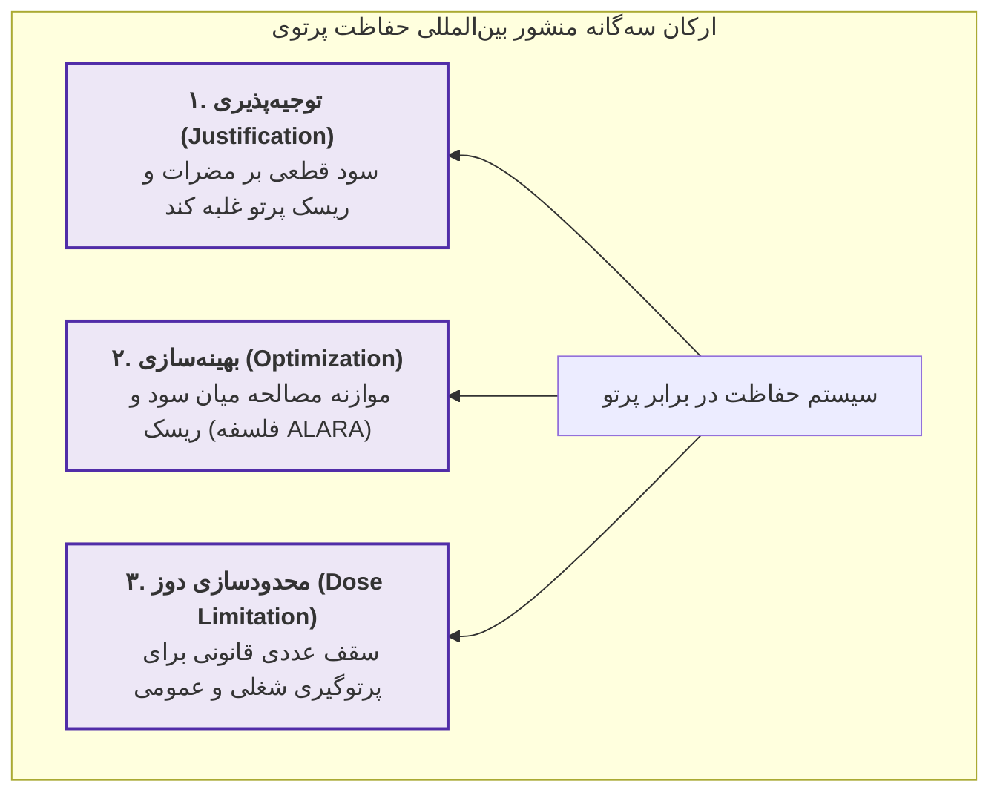

### ۱. اصل توجیه‌پذیری (Justification)
هیچ رویه یا مداخله متضمن پرتوگیری نباید تصویب شود مگر آن‌که سود خالص اجتماعی، اقتصادی یا بالینی حاصل از آن، به طور قاطع از صدمات بالقوه اشعه فراتر باشد.

> [!important] ریشه بیولوژیک اصل توجیه‌پذیری
> اصل توجیه‌پذیری مستقیماً ریشه در **ماهیت بدون آستانه اثرات استوکستیک** دارد! از آنجا که تئوری خطی بدون آستانه اثبات می‌کند حتی جذب 1 فوتون منفرد نیز می‌تواند محرک یک جهش بدخیم سرطانی باشد، هیچ پرتوگیری نباید تجویز شود مگر آن‌که منفعتی قطعی (نظیر کشف تومور پنهان یا شکستگی استخوان) برای فرد یا جامعه به اثبات برسد.

### ۲. اصل بهینه‌سازی (Optimization) و فلسفه آلارا
پرتوگیری افراد باید به گونه‌ای مدیریت گردد که بیشترین منفعت با کمترین ریسک ممکن به دست آید. بهینه‌سازی در پرتوشناسی با **فلسفه آلارا (ALARA)** تعریف می‌شود:
* عبارت ALARA سرواژه عبارت *As Low As Reasonably Achievable* به معنای «پایین‌ترین سطحی که به صورت معقول و منطقی دست‌یافتنی باشد» است.
* **مفهوم تابش‌های زمینه طبیعی (Natural Background Radiation):** ملاک سنجش «دوز کم» در آلارا تابش زمینه طبیعی است. انسان‌ها در محیط زیست پیوسته پرتوهای کیهانی، رادیونوکلئیدهای خاک، مصالح ساختمانی و مواد پرتوزای استنشاقی (رادون) را دریافت می‌کنند. دوز مؤثر زمینه طبیعی سالانه برای یک فرد عادی در جوامع (نظیر آمریکا) بین **1 تا 3 میلی‌سیورت در سال (1 to 3 mSv/year)** است. اگر پرتوگیری یک فرایند در محدوده تابش زمینه باشد، آن را کم‌دوز تلقی می‌کنیم.

> [!important] تله تستی آزمونی: مفهوم رفتار منطقی (Reasonably) در بهینه‌سازی تشخیصی
> کاهش دوز نباید به قیمت نابودی ارزش تشخیصی تصویر تمام شود! اگر تکنسین رادیولوژی شدت تابش تیوب را به بهانه کاهش دوز آن‌قدر پایین بیاورد که کلیشه تار و مخدوش گردد، دو فاجعه رخ می‌دهد: 1) پزشک خط شکستگی استخوان را ندیده و به بیمار اجازه راه رفتن می‌دهد؛ 2) یا مجبور به تکرار مجدد گرافی می‌شود که دوز کلی بیمار را دوبرابر می‌کند! در هر دو حالت، اصل آلارا نقض شده است. میزان تابش باید تا مرزی پایین آورده شود که **کیفیت تشخیصی و استاندارد تصویر کاملاً حفظ گردد**.

### تفاوت بنیادین مفهوم بهینه‌سازی در «امور تشخیصی» در برابر «پرتودرمانی (رادیوتراپی)»
* **در امور تشخیصی (رادیوگرافی، CT، فلوروسکوپی):** آلارا به معنای *کاهش دوز جذبی کل تنه بیمار تا حد ممکن و معقول است*.
* **در امور درمانی (رادیوتراپی):** آلارا هرگز به معنای کاهش دوز توده تومور نیست! تومور باید عیناً دوز سنگین تجویزی (نظیر 50 تا 60 گری) را دریافت کند تا ریشه‌کن شود؛ در رادیوتراپی، مفهوم بهینه‌سازی یعنی **دوز جذبی بافت‌های سالم مجاور و ارگان‌های در معرض خطر تا حد امکان کاهش یابد**.

## بخش 4: طبقه‌بندی پرتوگیری‌ها، حدود قانونی دوز و تحلیل سناریوهای بالینی

پرتوگیری‌ها بر مبنای ماهیت مواجهه و مقررات ICRP و NCRP به سه دسته مستقل طبقه‌بندی می‌شوند:

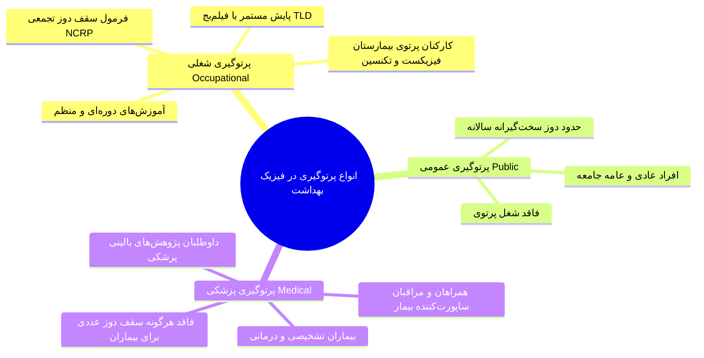

1. **پرتوگیری شغلی (Occupational Exposure):** افرادی که کار با اشعه ماهیت حرفه آن‌هاست (تکنولوژیست‌های رادیولوژی و رادیوتراپی، متخصصین فیزیک پزشکی). پرتوگیری این پرسنل توسط دوزیمترهای فردی نظیر **فیلم‌بج (Film Badge)** ماهانه رصد شده و آموزش‌های مستمر ایمنی را می‌گذرانند.
2. **پرتوگیری عمومی (Public Exposure):** عامه مردم جامعه که در مجاورت منابع پرتوی محیطی یا مراکز درمانی قرار دارند.
3. **پرتوگیری پزشکی (Medical Exposure):** شامل سه گروه مستقل:
   * بیمارانی که تحت معاینات تشخیصی یا پروتکل‌های رادیوتراپی قرار می‌گیرند.
   * همراهان و پشتیبانان بیمار (مانند والدینی که کودک را حین آزمون در دستگاه نگه می‌دارند).
   * داوطلبان شرکت در تحقیقات و کارآزمایی‌های بالینی پزشکی با رضایت آگاهانه.

> [!important] قانون طلایی: عدم شمول حد دوز (Dose Limit) برای بیماران
> برای بیمارانی که تحت آزمون‌های تشخیصی یا درمانی قرار می‌گیرند، **هیچ سقف دوز عددی و قانونی وجود ندارد!** دوز بر اساس نیاز بالینی و ضرورت پزشکی تعیین می‌شود؛ محدودسازی دوز صرفاً مختص پرتوگیری‌های شغلی و افراد عامه جامعه است.

### فرمول محاسباتی سقف دوز تجمعی شغلی پرتوکاران (NCRP)
برای حداکثر دوز تجمعی مجاز یک پرتوکار در طول حیات حرفه‌ای، دو گایدلاین تاریخی ارائه شده است:
* **فرمول سنتی و قدیمی NCRP (بر حسب رم):**

$$\text{Dose Limit (rem)} \le (\text{Age} - 18) \times 5$$

*(مثال: برای پرتوکار 20 ساله:* $(20 - 18) \times 5 = 10\text{ rem}$*)*

* **فرمول مدرن و استاندارد فعلی NCRP (بر حسب میلی‌سیورت):**

$$\text{Cumulative Effective Dose (mSv)} \le \text{Age} \times 10$$

*(مثال: برای پرتوکار 20 ساله، سقف تجمعی کل دوران عمر:* $20 \times 10 = 200\text{ mSv}$ *است).*

### حدود دوز ویژه: افراد زیر ۱۸ سال و جنین پرتوکار باردار
* **افراد زیر 18 سال و دانش‌آموزان رشته‌های پرتوی:** سقف دوز سالانه نباید از **1 میلی‌سیورت در سال (معادل 0.1 rem/year)** فراتر رود.
* **جنین پرتوکار باردار:** به علت حساسیت مفرط جنین، دو محدودیت هم‌زمان اعمال می‌شود:
  1. **سقف کل دوران بارداری (9 ماهه):** نباید از **5 میلی‌سیورت (0.5 rem)** تجاوز کند.
  2. **سقف ماهانه جنین:** در هیچ ماهی نباید از **0.5 میلی‌سیورت در ماه (0.05 rem/month)** بیشتر شود (توزیع یکنواخت الزامی است تا جهش حاد رخ ندهد).

> [!important] حقوق قانونی و شغلی پرتوکار باردار
> با اعلام رسمی بارداری، کارفرما به هیچ عنوان حق **اخراج، تعلیق، تعدیل یا تحمیل مرخصی اجباری بدون حقوق** به پرتوکار باردار را ندارد! مسئول فیزیک بهداشت موظف به سنجش دوز محیط است؛ در صورت تایید بالا بودن دوز، باید **محل خدمت فرد موقتاً تغییر یابد** (مثلاً انتقال موقت به بخش اداری یا منشی‌گری).

### تحلیل و حل سناریوهای سه‌گانه آزمونی پرونده‌های پرتوگیری

1. **سناریوی آقای جوزف:** دوز 2 میلی‌سیورت دریافتی ایشان در طبقه **پرتوگیری پزشکی (همراه و ساپورت‌کننده بیمار)** جای دارد. این مقدار منطبق بر تابش زمینه سالانه بوده و آقای جوزف هیچ محدودیتی برای همراهی‌های مجدد احتمالی یا زندگی روزمره تا پایان سال ندارد.
2. **سناریوی رزیدنت بالینی:** مواجهه از نوع **پرتوگیری شغلی** است. مقدار 12 میلی‌سیورت کمتر از سقف مجاز شغلی سالانه است؛ لذا استاد نباید به رزیدنت مرخصی اجباری بدهد، بلکه وی به کار بالینی ادامه می‌دهد و صرفاً شیلدینگ و فاصله بررسی می‌شود.
3. **سناریوی بیمار معترض به دوز ۲۵ میلی‌سیورتی CT:** اقدام در دسته **پرتوگیری پزشکی (بیمار)** رخ داده است. از آنجا که اقدامات پزشکی تشخیصی مشمول سقف عددی دوز نمی‌شوند و برای نجات بیمار ضرورت داشته‌اند، شکایت بیمار از پزشک یا تکنسین کاملاً رد و بی‌اساس است.

## بخش 5: زیست‌شناسی سرطان، اپیدمیولوژی و سه‌گانه درمان‌های انکولوژی

سرطان امروزه عامل **25% از کل مرگ‌ومیرها** در جوامع بشری است. سلول سرطانی سلولی است که مهار تکثیر ژنتیکی خود را از دست داده و با سرعتی غیرطبیعی، تهاجمی و مهارنشدنی نسبت به بافت‌های نرمال مجاور رشد می‌کند. خصیصه مرگبار نئوپلازی‌های بدخیم، توانایی مهاجرت سلول‌ها از کانون اولیه به بافت‌های دوردست و تشکیل کانون‌های ثانویه است؛ پدیده‌ای که **متاستاز (Metastasis)** نام دارد (نظیر متاستاز اولیه پستان به بافت مغز یا استخوان). در انکولوژی سه ستون درمانی اصلی برای مقابله با تومورها وجود دارد:

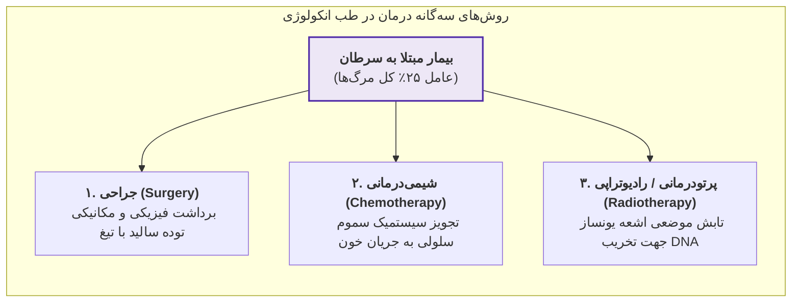

> [!definition] رادیوتراپی یا پرتودرمانی (Radiotherapy)
> شاخه‌ای بالینی از انکولوژی و فیزیک پزشکی که در آن با تابش کنترل‌شده و موضعی پرتوهای یونساز پرانرژی، ماده ژنتیکی هسته سلول‌های تومورال تخریب شده و توانایی تکثیر و حیات سلول بدخیم سرکوب می‌گردد.

| روش درمانی | سازوکار اثرگذاری بر بافت | مهم‌ترین عوارض جانبی (Side Effects) | محدودیت بنیادین در اجرا |
| :--- | :--- | :--- | :--- |
| **جراحی (Surgery)** | برداشتن فیزیکی توده ماکروسکوپیک با تیغ جراحی | عوارض داروهای بیهوشی، خونریزی، درد جراحی، سردرد (در مغز) | ناتوانی در حذف حاشیه‌های میکروسکوپی و **بستر تومور (Tumor Bed)** |
| **شیمی‌درمانی (Chemotherapy)** | ورود سیستمیک داروهای سایتوتوکسیک به جریان کل خون | **ریزش مو (Alopecia)**، تهوع شدید، مهار مغز استخوان | سمیت سلولی برای کل اندام‌های سالم در حال تکثیر و عدم تمرکز موضعی |
| **پرتودرمانی (Radiotherapy)** | یونیزاسیون موضعی، القای شکست دورشته‌ای DNA و مرگ سلول | **واکنش‌ها و سوختگی‌های پوستی**، خستگی، اختلال جنسی، کنسر ثانویه | الزام به رعایت حد تحمل بافت‌های سالم اطراف و ارگان‌های در معرض خطر |

### چرا رادیوتراپی برای ۵۰ تا ۶۰ درصد کل بیماران سرطانی به کار می‌رود؟
پرتودرمانی در **50 تا 60 درصد کل بیماران سرطانی** سودمند و کاربردی است. عدم استفاده 100 درصدی از این روش دو دلیل بیولوژیک و ساختاری دارد:
1. **تومورهای سطحی و کوچک:** بسیاری از تومورها بسیار سطحی و موضعی بوده و با یک *مداخله جراحی ساده* بدون نیاز به پرتو کاملاً خارج می‌شوند.
2. **سرطان‌های منتشر و سیستمیک مایع:** رادیوتراپی زمانی کارایی دارد که توده در تصاویر CT یا MRI به شکل یک **تومور توپر و منسجم (Solid Tumor)** لوکالیزه باشد. در بدخیمی‌هایی نظیر **لوسمی (سرطان خون)**، سلول‌های سرطانی در تمام عروق سراسر بدن پراکنده‌اند و نمی‌توان کل بدن بیمار را زیر تابش پرتوهای سنگین قرار داد؛ لذا درمان اصلی این بیماری‌ها سیستمیک بوده و بر عهده *شیمی‌درمانی* است.

## بخش 6: اهداف درمانی رادیوتراپی، درمان‌های ترکیبی و دزیمتری کلینیکی فرکشنه

برخلاف نگرش سنتی، پرتوتابی بر اساس مرحله پیشرفت بیماری می‌تواند نجات‌بخش قطعی جان بیمار باشد:

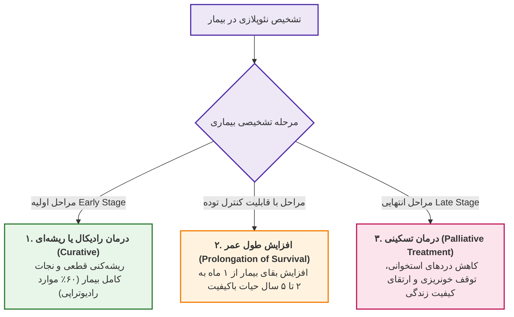

> [!important] جهش ۲۵ درصدی بهره درمانی با رادیوتراپی مدرن
> از میان جمعیت 50 درصدی نیازمند پرتو، در **60% موارد رادیوتراپی به نیت درمان ریشه‌ای و رادیکال** تجویز می‌شود. با استقرار سامانه‌ها و تکنولوژی‌های پیشرفته پرتودرمانی در کشور، **بهره درمانی (Therapeutic Gain) می‌تواند تا 25% ارتقا یابد**.

### مفهوم درمان‌های کمکی و ترکیبی (Adjuvant Therapy)
در پروتکل‌های بالینی، رادیوتراپی به ندرت تنهاست و در قالب نقش **کمکی (Adjuvant)** در کنار جراحی یا کموتراپی قرار می‌گیرد:
* **رادیوتراپی پس از جراحی (Post-op):** جراح توده ماکروسکوپیک را برمی‌دارد اما بستر سلولی تومور (*Tumor Bed*) که حاوی سلول‌های میکروسکوپی سرطانی است باقی می‌ماند. رادیوتراپی پس از عمل این بستر را استریل کرده و از عود پیشگیری می‌کند (بسیار رایج در **سرطان پستان**).
* **رادیوتراپی پیش از جراحی (Pre-op):** تابش پرتو قبل از عمل به منظور کوچک کردن حجم توده جهت تسهیل جراحی.
* **رادیوتراپی انحصاری:** در درمان تومورهای **سر و گردن (Head & Neck)**، رادیوتراپی به تنهایی نقش درمان رادیکال و ریشه‌ای اصلی را ایفا می‌کند.
* **رادیوتراپی تسکینی:** تخفیف دردهای شدید در **متاستازهای استخوانی** و ممانعت از فشار توده بر نخاع یا عصب بینایی.

### مقیاس دزیمتری کلینیکی و منطق تقطیع دوز (Fractionation)
در حالی که تابش زمینه سالانه حدود 0.002 گری (2 میلی‌سیورت) است، در رادیوتراپی دوز تجویزی کشنده در حدود **50 تا 60 گری (50 to 60 Gy)** است.

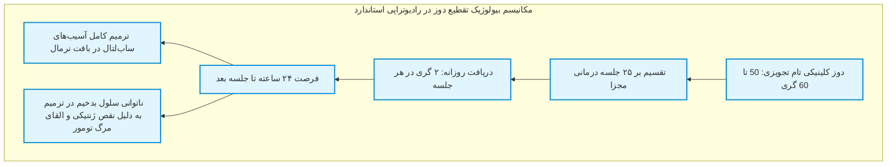

> [!important] چرایی تقطیع دوز (Fractionation) در رادیوتراپی استاندارد
> دوز کلینیکی 50 گری هرگز به صورت یک‌باره در یک روز به بیمار داده نمی‌شود. شیوه استاندارد، **رادیوتراپی تقطیعی یا فرکشنه** است؛ یعنی دوز 50 گری به **25 جلسه تقسیم شده و بیمار روزانه 2 گری (2 Gy/fraction)** دریافت می‌کند. علت رادیوبیولوژیک این امر، فراهم ساختن زمان 24 ساعته میان جلسات جهت **ترمیم بافت‌های سالم مجاور** است؛ سلول‌های سالم قادر به بازیابی آسیب‌های تحت‌کشنده ناشی از پرتو هستند در حالی که سلول‌های تومورال به دلیل نقایص ژنتیکی توان ترمیم را در این فواصل از دست داده و منهدم می‌شوند.

### پارادوکس رادیوتراپی و مفهوم ارگان در معرض خطر (OAR)
هدف رادیوتراپی دو وجه متناقض دارد: **ریشه‌کنی کامل سلول‌های تومور** و **حفظ سلامت بافت‌های نرمال اطراف**.

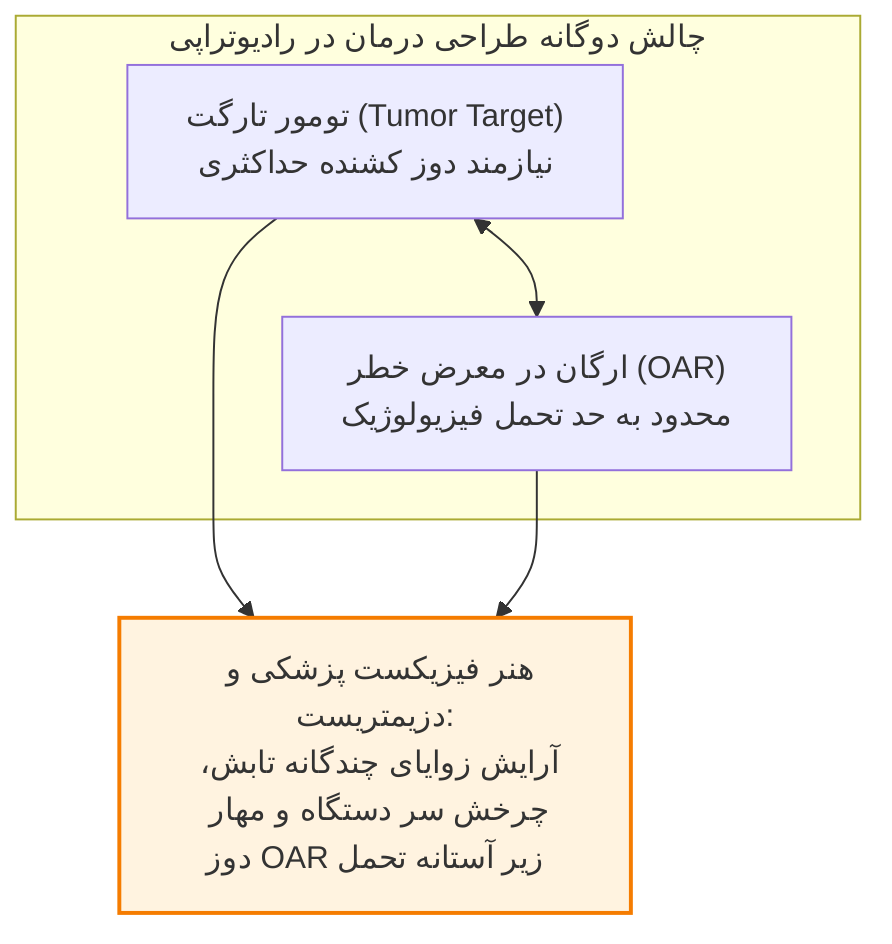

> [!definition] ارگان در معرض خطر (Organ at Risk با نماد OAR)
> بافت‌ها و اندام‌های سالمی که در مجاورت توده سرطانی قرار گرفته‌اند یا حساسیت رادیوبیولوژیک بالایی دارند و دوز دریافتی آن‌ها نباید از حد تحمل بیولوژیک فراتر رود.

پزشک یا فیزیکست اجازه ندارد به بهانه محافظت از بافت سالم، دوز تومور را کاهش دهد؛ زیرا با افت دوز تومور، سلول‌های سرطانی زنده مانده و بیماری **عود مجدد (Recurrence)** خواهد کرد. راه‌حل این معما بر عهده **متخصصین فیزیک پزشکی و دزیمتریست‌ها** است؛ آن‌ها با استفاده از رایانه‌های طراحی درمان، زوایای تابش را طوری تنظیم می‌کنند که پرتوها از چندین جهت مختلف به بدن بتابند و در مرکز (محل تومور) یکدیگر را قطع نمایند؛ در نتیجه تومور دوز تجویزی تام را دریافت کرده اما بافت‌های سالم در هر زاویه، دوزی کمتر از **حد تحمل (Tolerance Dose)** خود متحمل می‌شوند.

## بخش 7: طبقه‌بندی تکنیک‌های رادیوتراپی (EBRT در برابر براکی‌تراپی) و مراجع معتبر درس

پرتودرمانی بالینی بر مبنای فاصله فیزیکی چشمه پرتو از بدن بیمار به دو شاخه اصلی تقسیم می‌گردد:

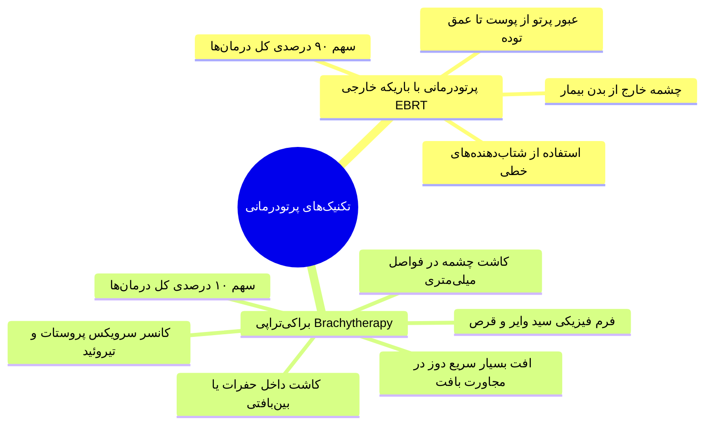

1. **پرتودرمانی با باریکه خارجی (External Beam Radiotherapy با نماد EBRT):** نزدیک به **90% از کل درمان‌های رادیوتراپی** را شامل می‌شود. در این شیوه منبع پرتو خارج از بدن بیمار قرار داشته و اشعه با عبور از پوست به عمق تومور تابانده می‌شود.
2. **براکی‌تراپی یا درمان از راه نزدیک (Brachytherapy با نماد BT):** واژه یونانی *Brachy* به معنای نزدیک است و حدود **10% موارد درمانی** را در بر می‌گیرد. در این تکنیک، چشمه‌های پرتوزا به صورت موقت یا دائم در قالب فرم‌های فیزیکی دانه (Seed)، سیم (Wire) یا قرص مستقیماً درون حفرات طبیعی بدن (*Intracavitary*) نظیر سرویکس رحم یا داخل نسج تومور (*Interstitial*) نظیر پروستات و تیروئید کاشته می‌شوند. مزیت براکی‌تراپی، تابش دوزهای متراکم به تومور و افت بسیار سریع پرتو در بافت‌های نرمال مجاور است.

### کتب و مراجع بنیادین آموزشی درس
1. **کتاب فیزیک پزشکی:** تألیف دکتر محمدباقر عقابیان، انتشارات رویان پژوه.
2. **کتاب فیزیک رادیوتراپی (The Physics of Radiation Therapy):** تألیف پروفسور فائز ام. خان (*Faiz M. Khan*)، انتشارات سبحان.
3. **کتاب فیزیک انکولوژی پرتوی (Radiation Oncology Physics):** تألیف پروفسور پادگورساک (*E. B. Podgorsak*)، ترجمه سرکار خانم دکتر غزاله گرایلی، انتشارات سبحان.
4. **مجموعه اسلایدها و گایدلاین‌های آموزشی آژانس بین‌المللی انرژی اتمی (IAEA)** و گزارش‌های رسمی شورای ملی حفاظت در برابر اشعه (NCRP).

## بخش 8: چک‌لیست طلایی مرور سریع

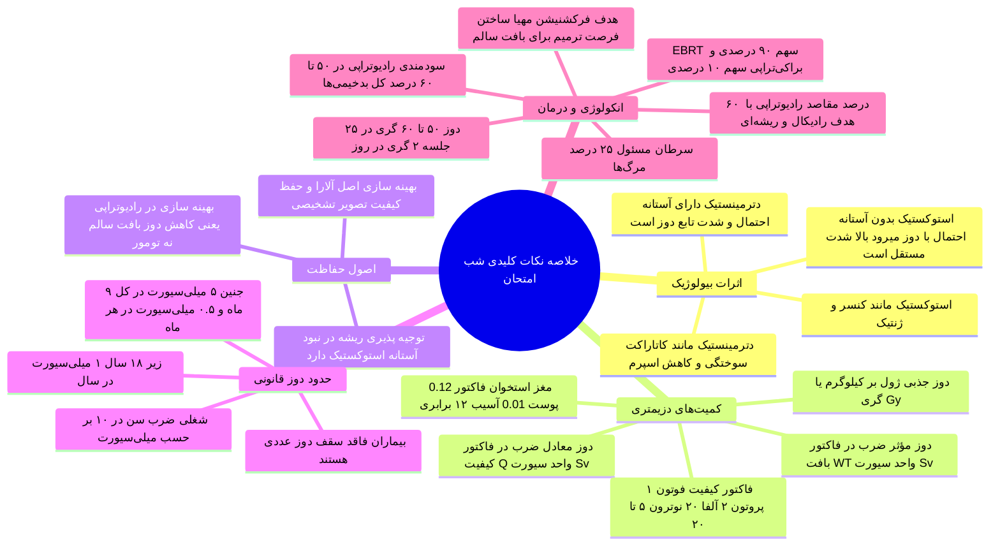

> [!tip] دام‌های تستی و نکات مهم
> 1. **دوز لیمیت بیماران:** بیماران هیچ سقف دوز عددی و لیمیت قانونی ندارند؛ مرز پرتوگیری بالینی بیمار صرفاً بر اساس ضرورت و اصل توجیه‌پذیری معین می‌شود.
> 2. **پرتوگیری همراه بیمار:** همراهان و مراقبان بیمار (نظیر والدینی که کودک را در CT نگه می‌دارند) در طبقه پرتوگیری پزشکی قرار دارند نه پرتوگیری عمومی!
> 3. **تفاوت مفهوم بهینه‌سازی:** در رادیولوژی آلارا یعنی کم کردن دوز بیمار؛ در رادیوتراپی آلارا یعنی تحویل کامل دوز تجویزی به تومور و کم کردن دوز بافت سالم اطراف (OAR).
> 4. **دوزهای دوگانه جنین پرتوکار باردار:** هم سقف کل بارداری (5 میلی‌سیورت) و هم سقف ماهانه (0.5 میلی‌سیورت) باید هم‌زمان رعایت شوند؛ دریافت بیش از 0.5 میلی‌سیورت در یک ماه حتی در صورت پایین ماندن دوز کل، تخلف قانونی است.
> 5. **منع تعلیق پرتوکار باردار:** اعلام بارداری به هیچ وجه نباید به تعلیق، اخراج یا مرخصی اجباری بدون حقوق بینجامد؛ صرفاً انتقال موقت به محیط‌های کم‌پرتو مجاز است.
> 6. **فلسفه نام‌گذاری سیورت:** هرچند دوز معادل از نظر دیمانسیون با دوز جذبی برابر است (هر دو ژول بر کیلوگرم هستند)، اما برای نشان دادن ضرب شدن فاکتور کیفیت پرتو (Q)، نام آن الزاماً سیورت گذاشته شده است.
> 7. **ضریب وزنی مغز استخوان و پوست:** آسیب بیولوژیک مغز استخوان (0.12) نسبت به پوست (0.01) در دوز جذبی یکسان، دقیقاً 12 برابر شدیدتر است.
