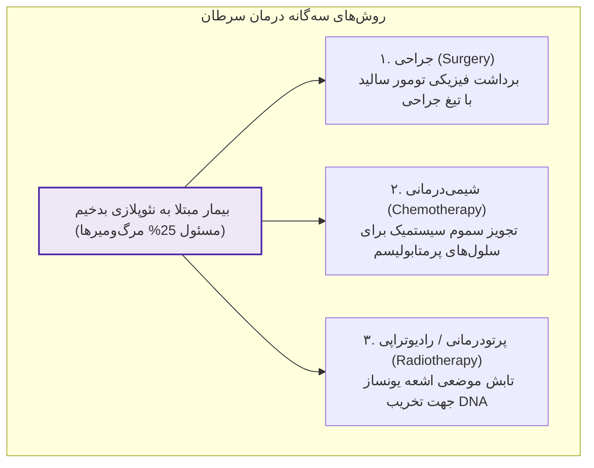
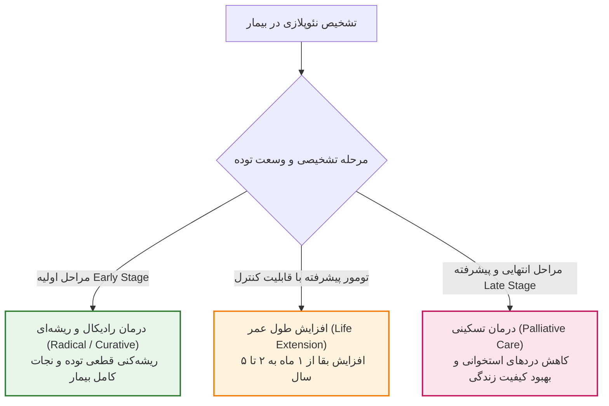
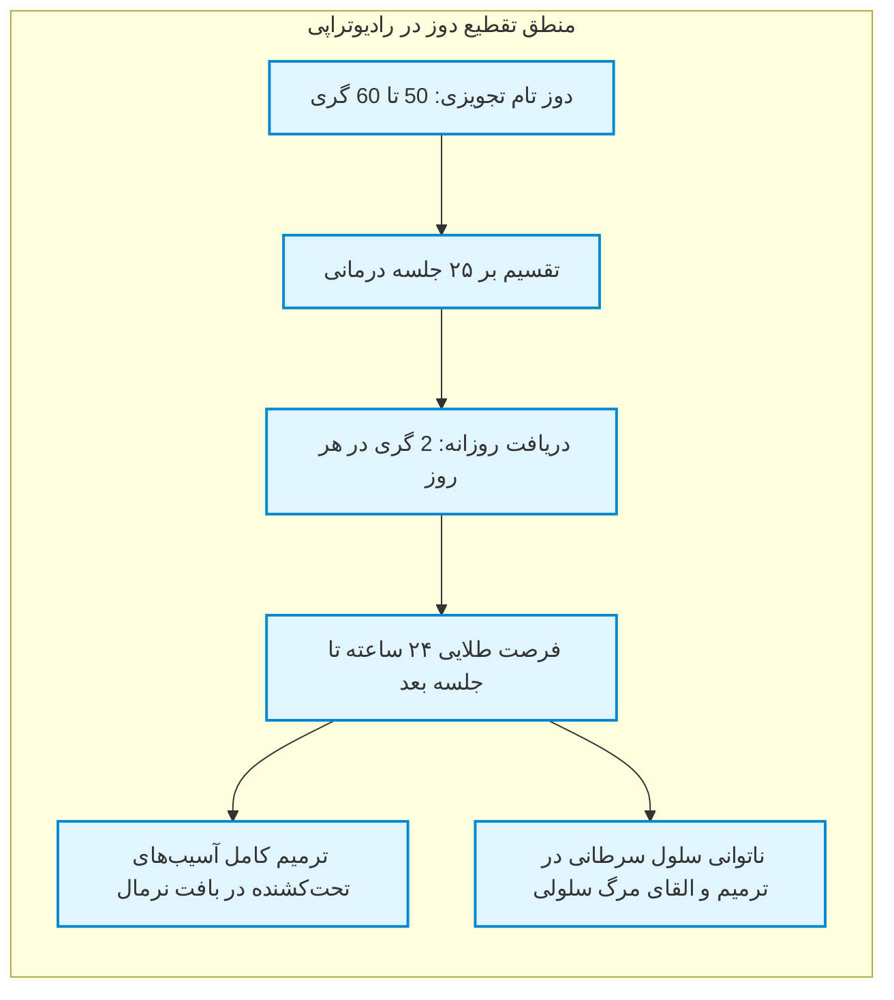
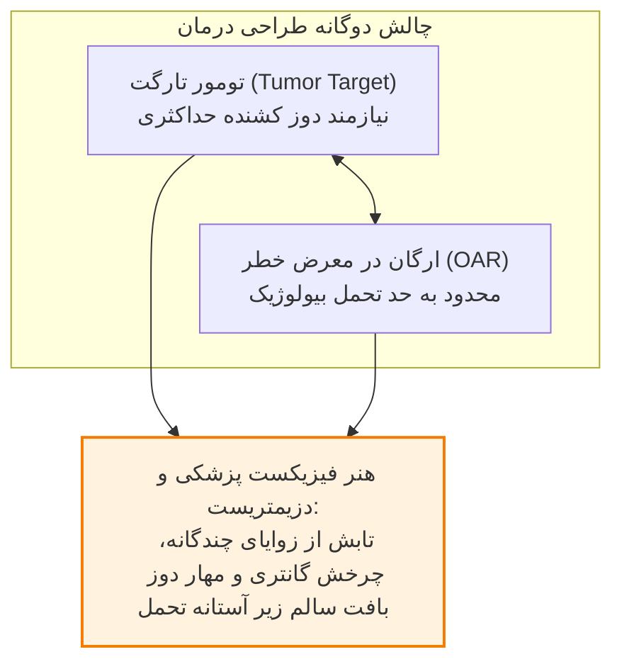
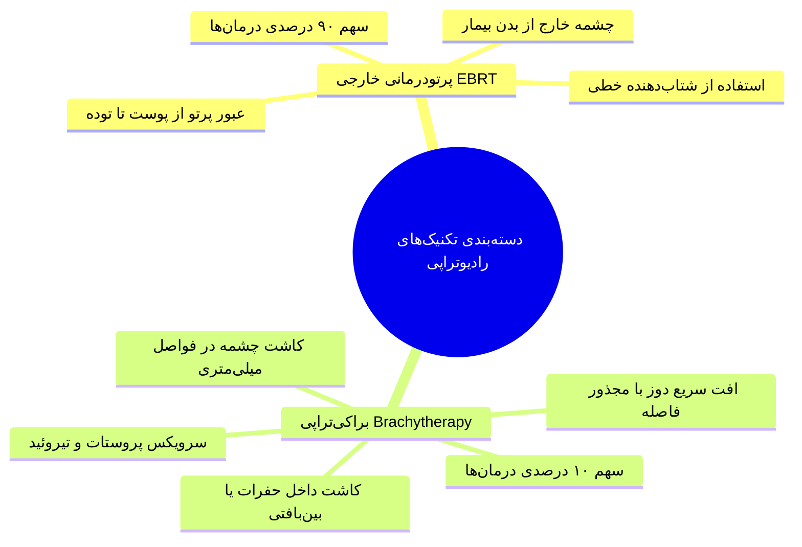
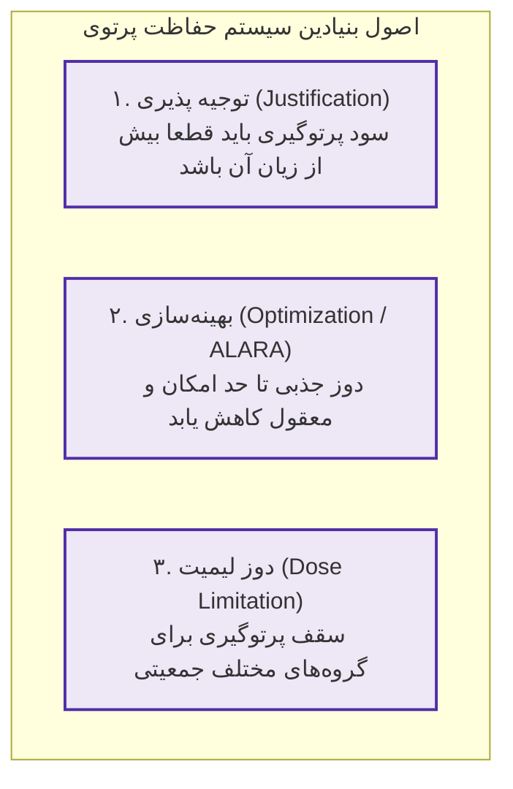
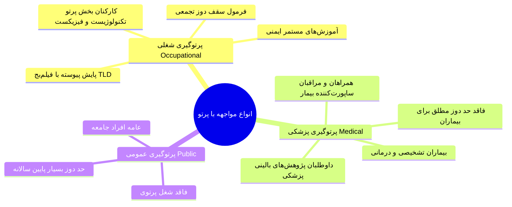
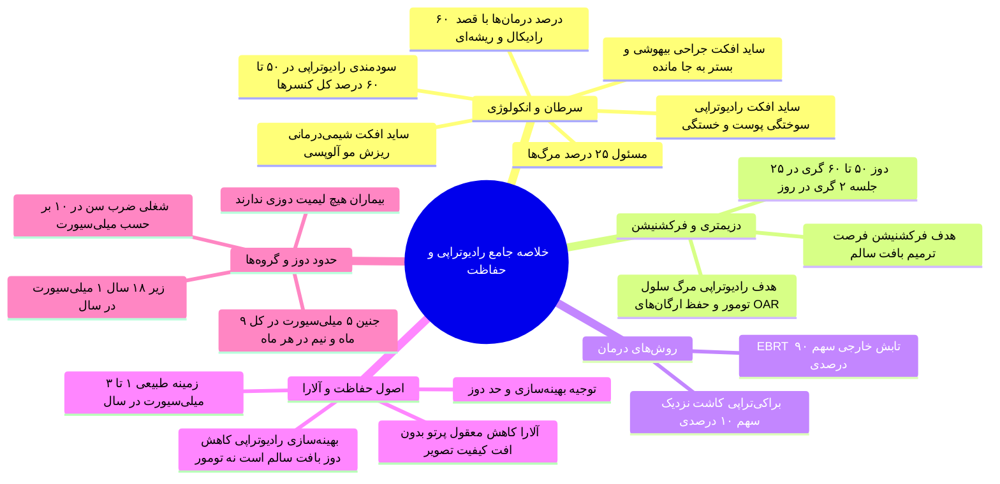

# رادیوتراپی (دکتر گرایی)

## بخش 1: زیست‌شناسی سرطان، اپیدمیولوژی و سه‌گانه درمان‌های انکولوژی

**سرطان** امروزه مسئول **25% از کل مرگ‌ومیرها** در جوامع انسانی است. از منظر بیولوژی سلولی، سلول سرطانی سلولی است که ترمز تقسیم طبیعی خود را از دست داده و با سرعتی سرسام‌آور، کنترل‌نشده و غیرطبیعی نسبت به بافت‌های نرمال مجاور تکثیر می‌شود و آن‌ها را تخریب می‌کند. ویژگی منحصر‌به‌فرد و فوق‌العاده خطیر نئوپلازی‌های بدخیم، قابلیت تهاجم و مهاجرت سلول‌ها از کانون اولیه به سایر ارگان‌های دوردست است؛ پدیده‌ای که **متاستاز (Metastasis)** نامیده می‌شود (نظیر سرطان اولیه پستان که کانون‌های ثانویه در بافت مغز یا استخوان ایجاد می‌کند). در طب انکولوژی سه ستون درمانی اصلی برای مقابله با توده‌های سرطانی وجود دارد که هر یک ویژگی‌ها، مزایا و عوارض جانبی (Side Effects) اختصاصی خود را دارند:

> [!definition] رادیوتراپی یا پرتودرمانی (Radiotherapy / Radiation Therapy)
> شاخه‌ای بالینی از انکولوژی و فیزیک پزشکی که در آن با بهره‌گیری هدفمند از تابش‌های یونساز پرانرژی، ماده ژنتیکی سلول‌های تومورال در یک کانون موضعی نابود شده و از بازسازی و تکثیر آن‌ها پیشگیری به عمل می‌آید.

| روش درمانی                     | سازوکار اثرگذاری بر بافت                                                | مهم‌ترین عوارض جانبی (Side Effects)                                              | محدودیت بنیادین در اجرا                                                   |
| :----------------------------- | :---------------------------------------------------------------------- | :------------------------------------------------------------------------------- | :------------------------------------------------------------------------ |
| **جراحی (Surgery)**            | برداشتن فیزیکی و مکانیکی توده قابل مشاهده با تیغ جراحی                  | عوارض داروهای بیهوشی، خونریزی، سردرد (در جراحی‌های مغز) و درد جراحی              | ناتوانی مطلق در حذف حاشیه‌های میکروسکوپی و بستر سلولی تومور (*Tumor Bed*) |
| **شیمی‌درمانی (Chemotherapy)** | ورود سیستمیک داروهای سایتوتوکسیک به جریان کل خون و مهار سلول‌های پرمصرف | **ریزش مو (Alopecia)** به عنوان بارزترین علامت، تهوع، ضعف ایمنی                  | آسیب به تمامی ارگان‌های تکثیرشونده سالم بدن و عدم توان تمرکز موضعی        |
| **پرتودرمانی (Radiotherapy)**  | یونیزاسیون موضعی اتم‌ها، شکست DNA و تخریب بازگشت‌ناپذیر هسته سلول       | **واکنش‌ها و سوختگی‌های پوستی**، تغییر اشتها و خستگی، اختلالات جنسی، کنسر ثانویه | الزام به رعایت حد تحمل بافت سالم اطراف و ارگان‌های در معرض خطر            |

### چرا رادیوتراپی تنها برای 50 تا 60 درصد بیماران سرطانی به کار می‌رود؟

پرتودرمانی در **50 تا 60 درصد کل بیماران سرطانی** سودمند و کاربردی است. عدم امکان استفاده 100 درصدی از این مدالیته دو دلیل بیولوژیک و ساختاری قطعی دارد:

1. **تومورهای بسیار سطحی و موضعی:** بسیاری از تومورها بسیار سطحی و محدود بوده و جراح می‌تواند بدون نیاز به پرتو، با یک *جراحی* ساده کل توده را از ریشه خارج کند.
2. **سرطان‌های منتشر و سیستمیک مایع:** رادیوتراپی اساساً زمانی کاربرد دارد که توده در تصاویر CT یا MRI به صورت **یک تومور توپر و منسجم (Solid Tumor)** لوکالیزه مشاهده شود. در سرطان‌هایی نظیر *لوسمی (سرطان خون)*، سلول‌های سرطانی در تمام عروق و کل بدن شناور هستند؛ پزشک نمی‌تواند تمام بدن بیمار را زیر تابش پرتوهای سنگین قرار دهد (مگر در موارد استثنایی و پروتکل‌های نادر)، لذا درمان خط اول این کنسرها *سیستمیک* بوده و *شیمی‌درمانی* اولویت دارد.

> [!important] جهش بهره درمانی با رادیوتراپی مدرن
> طبق آمار انکولوژی، از میان جمعیت 50 درصدی نیازمند پرتو، در **60% موارد پرتودرمانی با هدف درمان ریشه‌ای و قطعی** تجویز می‌شود. نکته حائز اهمیت این است که با ورود سامانه‌ها و فناوری‌های مدرن رادیوتراپی به مراکز درمانی کشور، **بهره درمانی (Therapeutic Gain) می‌تواند تا 25% ارتقا یابد**.

## بخش 2: اهداف درمانی، نقش‌های بالینی و مفهوم هم‌افزایی (Adjuvant)

برخلاف باور عمومی که بیمار سرطانی را لاعلاج می‌پندارد، پرتودرمانی بسته به زمان مراجعه و مرحله پیشرفت نئوپلازی می‌تواند نجات‌بخش قطعی بیمار باشد:

1. **درمان رادیکال یا ریشه‌ای (Radical / Curative Treatment):** چنانچه سرطان در مراحل اولیه (*Early Stage*) کشف شود، رادیوتراپی هدف ریشه‌کنی قطعی تومور را دنبال می‌کند و می‌تواند بیمار را به طور کامل به زندگی عادی برگرداند.
2. **افزایش طول عمر بیمار (Prolongation of Survival):** در توده‌های پیشرفته‌تر، هدف پرتو بالا بردن زمان بقای فرد است؛ بیماری که بدون رادیوتراپی ظرف 1 ماه فوت می‌کرد، با مداخله پرتوی 2 تا 5 سال به حیات باکیفیت خود ادامه می‌دهد.
3. **درمان تسکینی (Palliative Treatment):** در مواردی که بیماری به مراحل غیرقابل بازگشت رسیده و امیدی به بقای بلندمدت نیست، رادیوتراپی برای **ارتقای کیفیت زندگی (Quality of Life - QoL)** به کار می‌رود؛ از جمله مهار دردهای طاقت‌فرسای متاستازهای استخوانی، توقف خونریزی‌های تومور یا پیشگیری از نابینایی و فلج عصبی ناشی از فشار توده.

### مفهوم درمان‌های کمکی و ترکیبی (Adjuvant Therapy)

در فیلد بالینی رادیوتراپی به‌ندرت تنهاست و *معمولاً با جراحی یا کموتراپی جفت می‌شود*. وقتی رادیوتراپی به عنوان بازوی مکمل وارد عمل می‌شود، نقش آن **کمکی (Adjuvant)** است:
* **پرتودرمانی پس از جراحی (Post-Operative / Post-op):** جراح توده ماکروسکوپیک بزرگ را برمی‌دارد اما بستر سلولی تومور (*Tumor Bed*) که حاوی سلول‌های بدخیم میکروسکوپی است بر جای می‌ماند. پرتوتابی پس از عمل، این بستر را استریل کرده و ریسک عود مجدد را سرکوب می‌کند (پروتکل بسیار شایع در **سرطان پستان**).
* **پرتودرمانی قبل از جراحی (Pre-Operative / Pre-op):** تابش پرتو پیش از جراحی با هدف کوچک کردن سایز توده برای تسهیل جراحی.
* **رادیوتراپی انحصاری:** در درمان تومورهای **سر و گردن (Head & Neck)**، رادیوتراپی به تنهایی می‌تواند نقش درمان رادیکال اصلی را بر عهده بگیرد.

## بخش 3: دزیمتری کلینیکی، فلسفه تقطیع دوز (Fractionation) و پارادوکس هدف

مقایسه مقادیر تابش در رادیولوژی تشخیصی با رادیوتراپی، تفاوت مقیاس عظیمی را برملا می‌سازد: تابش زمینه طبیعی سالانه حدود 0.002 گری (2 میلی‌سیورت) است، آزمون‌های رادیولوژی و CT دوزی در حد چند میلی‌گری دارند؛ اما در پرتودرمانی دوز کشنده در حدود **50 تا 60 گری (50 to 60 Gy)** به بافت تجویز می‌شود!

> [!important] چرایی تقطیع دوز (Fractionation) در رادیوتراپی استاندارد
> دوز کلینیکی 50 گری هرگز در یک روز و به صورت یک‌جا به بیمار داده نمی‌شود (به جز تکنیک‌های بسیار اختصاصی رادیوسرجری). شیوه روتین، **پرتودرمانی تقطیعی یا فرکشنه (Fractionated)** است؛ یعنی دوز کلینیکی 50 گری به **25 جلسه روزانه تقسیم شده و بیمار هر روز دقیقاً 2 گری (2 Gy/fraction)** پرتو دریافت می‌کند. توجیه رادیوبیولوژیک این امر، فراهم ساختن زمان کافی میان جلسات برای **ترمیم بافت‌های سالم مجاور** است؛ بافت نرمال قادر به بازیابی آسیب‌های تحت‌کشنده ناشی از پرتو است، در حالی که سلول‌های سرطانی نقایص ژنتیکی داشته و توان ترمیم خود را در این فواصل از دست می‌دهند.

### پارادوکس و دوراهی بنیادین رادیوتراپی (The Core Dilemma)

هدف نهایی پرتودرمانی دو وجه متناقض دارد: **نابودی صددرصدی سلول‌های تومور** و **حفظ کامل بافت‌های سالم اطراف**. چالش بزرگ این است که فوتون پرتو در مسیر رسیدن به کانون بدخیم، ناگزیر باید از حجم بافت سالم عبور کند.

> [!definition] ارگان در معرض خطر (Organ at Risk - OAR)
> بافت‌ها و اندام‌های سالمی که در مجاورت بلافصل توده تومورال قرار گرفته‌اند یا حساسیت پرتوی ذاتی بسیار بالایی دارند و *دوز دریافتی آن‌ها تحت هیچ شرایطی نباید از آستانه تحمل فیزیولوژیک فراتر رود*.

پزشک یا فیزیکست *اجازه ندارد به بهانه محافظت از بافت سالم، دوز تومور را کم کند*؛ زیرا با افت دوز، سلول‌های سرطانی زنده مانده و بیماری **عود مجدد (Recurrence)** خواهد کرد. راه‌حل این معما بر عهده **متخصصین فیزیک پزشکی و دزیمتریست‌ها** است؛ آن‌ها با استفاده از رایانه‌های طراحی درمان، زوایای تابش را طوری تنظیم می‌کنند که پرتوها از چندین جهت مختلف به بدن بتابند و در مرکز (محل تومور) یکدیگر را قطع نمایند؛ در نتیجه تومور دوز تجویزی تام را دریافت کرده اما بافت‌های سالم در هر زاویه، دوزی کمتر از **حد تحمل (Tolerance Dose)** خود متحمل می‌شوند.

## بخش 4: طبقه‌بندی تکنیک‌های رادیوتراپی: پرتودرمانی خارجی در برابر براکی‌تراپی

پرتودرمانی بالینی بر مبنای فاصله چشمه پرتو از بدن بیمار به دو شاخه اصلی تقسیم می‌گردد:

1. **پرتودرمانی با باریکه خارجی (External Beam Radiotherapy - EBRT):** نزدیک به **90% کل درمان‌های رادیوتراپی** جهان را شامل می‌شود. در این شیوه منبع پرتو خارج از بدن بیمار قرار داشته و اشعه از پوست عبور کرده تا عمق بافت و تومور نفوذ می‌کند.
2. **براکی‌تراپی یا درمان از راه نزدیک (Brachytherapy):** واژه یونانی *Brachy* به معنای «نزدیک» است و حدود **10% موارد درمانی** را پوشش می‌دهد. در این روش چشمه‌های رادیواکتیو بسته به شکل فیزیکی (سید، سیم، قرص یا تیوب) مستقیماً به صورت موقت یا دائم *درون حفرات طبیعی بدن (Intracavitary)* نظیر سرویکس رحم یا *داخل نسج تومور (Interstitial)* نظیر پروستات و تیروئید کاشته می‌شوند. مزیت براکی‌تراپی، تابش دوزهای فوق‌العاده متراکم به تومور و افت بسیار سریع اشعه در بافت سالم مجاور است.

## بخش 5: اصول سه‌گانه حفاظت پرتوی و بازتعریف بهینه‌سازی (Optimization)

حفاظت در برابر پرتو بر سه اصل استوار است که تحت نظارت سازمان بین‌المللی انرژی اتمی (IAEA) و کمیته‌های علمی تدوین شده است:

> [!definition] اصل آلارا (ALARA Principle)
> سرواژه عبارت *As Low As Reasonably Achievable*؛ به معنای نگه داشتن دوز پرتوگیری افراد در پایین‌ترین سطحی که به صورت معقول، منطقی و عملیاتی دست‌یافتنی باشد.

### تابش‌های زمینه طبیعی و ملاک سنجش «دوز کم»

مفهوم «دوز کم» و «معقول» بر مبنای **تابش‌های زمینه طبیعی (Natural Background Radiation)** تعریف می‌شود. تمامی انسان‌ها روزانه تشعشعات کیهانی، پرتوهای ناشی از خاک، مواد رادیواکتیو استنشاقی هوا (گاز رادون)، مصالح ساختمانی و غذاها را دریافت می‌کنند. میانگین پرتوگیری سالانه یک فرد عادی در جهان حدود **1 تا 3 میلی‌سیورت (1 to 3 mSv/year)** است. اگر پرتوگیری ناشی از یک اقدام در محدوده تابش زمینه باشد، آن را *کم‌دوز (Low Dose)* تلقی می‌کنیم.

> [!important] تله تستی آزمونی: مفهوم رفتار منطقی (Reasonably) در اصل آلارا
> کاهش دوز نباید کیفیت تشخیصی را فدا کند! اگر تکنسین رادیولوژی شدت تابش دستگاه را به بهانه کاهش دوز آن‌قدر پایین بیاورد که تصویر حاصل تار و غیرقابل تشخیص شود، پزشک شکستگی پای بیمار را ندیده و به او اجازه راه رفتن می‌دهد؛ یا مجبور به تکرار مجدد کلیشه گرافی می‌شود. این کار **نقض صریح آلارا** است؛ زیرا هم به سلامت بیمار صدمه زده و هم با تکرار آزمون، دوز دریافتی نهایی بیمار را دوبرابر کرده است. میزان تابش باید تا مرزی پایین آورده شود که **تصویر باکیفیت و استاندارد تشخیصی** همچنان حفظ گردد.

### تفاوت بنیادین مفهوم بهینه‌سازی در «تشخیص» در برابر «رادیوتراپی»

* **بهینه‌سازی در امور تشخیصی (رادیولوژی، CT، ماموگرافی):** دوز دریافتی کل بیمار باید *تا حد ممکن و بر مبنای آلارا کاهش یابد*.
* **بهینه‌سازی در امور درمانی (رادیوتراپی):** مفهوم آلارا به معنای کم کردن دوز تومور نیست! *دوز تومور باید عیناً همان دوز سنگین تجویزی آنکولوژیست باشد*؛ در رادیوتراپی مفهوم بهینه‌سازی یعنی **دوز جذبی بافت‌های سالم اطراف تا حد امکان و به صورت معقول کاهش داده شود**.

## بخش 6: اطلس دسته‌بندی پرتوگیری‌ها، حدود دوز (Dose Limits) و حل سناریوهای چالشی

پرتوگیری‌ها بر پایه ماهیت مواجهه به سه دسته مجزا تقسیم‌بندی شده و قوانین دوز متفاوتی دارند:

1. **پرتوگیری شغلی (Occupational Exposure):** افرادی که کار با اشعه ماهیت حرفه آن‌هاست (تکنولوژیست‌های رادیولوژی و رادیوتراپی، فیزیکست‌های پزشکی). این افراد با دوزیمترهای فردی نظیر **فیلم‌بج (Film Badge)** *به صورت مداوم مانیتور شده* و آموزش‌های دوره‌ای می‌بینند.
2. **پرتوگیری عمومی (Public Exposure):** افراد عادی جامعه که شغل پرتوی ندارند اما ممکن است برحسب موقعیت در معرض تشعشع محیطی قرار گیرند.
3. **پرتوگیری پزشکی (Medical Exposure):** شامل سه گروه است:
   * بیمارانی که به قصد *تشخیص یا درمان* اشعه دریافت می‌کنند.
   * *همراهان و پشتیبانان بیمار* (نظیر والدینی که کودک را حین آزمون نگه می‌دارند).
   * *داوطلبان شرکت در تحقیقات بالینی* و پژوهش‌های پزشکی با رضایت آگاهانه.

> [!important] قانون طلایی: عدم شمول حد دوز (Dose Limit) برای بیماران پزشکی
> برای بیمارانی که تحت آزمون‌های تشخیصی یا رادیوتراپی قرار می‌گیرند، **هیچ سقف دوز عددی و قانونی وجود ندارد!** دوز پرتو بر مبنای ضرورت بالینی تجویز می‌شود. حد دوزها صرفاً برای پرتوگیری‌های شغلی و افراد عامه جامعه وضع شده‌اند.

### فرمول محاسباتی سقف دوز تجمعی شغلی (NCRP)

کمیته ملی حفاظت و اندازه‌گیری پرتوی (NCRP) برای حداکثر دوز تجمعی مجاز یک پرتوکار در طول حیات شغلی دو گایدلاین تاریخی ارائه داده است:

* **فرمول سنتی و قدیمی NCRP (بر حسب رم):**

$$
\text{Dose Limit (rem)} \le (\text{Age} - 18) \times 5
$$

*(مثال: برای پرتوکار 20 ساله: $(20 - 18) \times 5 = 10\text{ rem}$)*

* **فرمول مدرن و استاندارد فعلی NCRP (بر حسب میلی‌سیورت):**

$$
\text{Cumulative Effective Dose (mSv)} \le \text{Age} \times 10
$$

*(مثال: برای یک پرتوکار 20 ساله، دوز تجمعی تمام دوران زندگی نباید از $20 \times 10 = 200\text{ mSv}$ فراتر رود).*

> [!tip] تبدیل واحدهای پرتوی در آزمون‌ها
> * $1\text{ mSv} = 0.1\text{ rem}$
> * $10\text{ mSv} = 1\text{ rem}$
> * $1\text{ rem} = 0.01\text{ Sv} = 10\text{ mSv}$

### حفاظت پرتوی ویژه: دانش‌آموزان و جنین پرتوکار باردار

* **افراد زیر 18 سال و کارآموزان:** سقف دوز سالانه پرتوگیری نباید از **1 میلی‌سیورت در سال (0.1 rem/year)** تجاوز کند.
* **جنین پرتوکار باردار:** به دلیل آسیب‌پذیری مفرط بافت‌های در حال تمایز جنین، دو محدودیت سخت‌گیرانه هم‌زمان اعمال می‌شود:
  1. **دوز کل بارداری (تجمعی 9 ماهه):** نباید از **5 میلی‌سیورت (0.5 rem)** بیشتر شود.
  2. **دوز ماهانه جنین:** در هیچ ماهی نباید از **0.5 میلی‌سیورت در ماه (0.05 rem/month)** تخطی کند (توزیع یکنواخت الزامی است و نباید جهش ماهانه رخ دهد).

> [!important] حقوق قانونی و شغلی پرتوکار باردار
> با اعلام بارداری، کارفرما به هیچ عنوان حق **اخراج، بیکار کردن یا تحمیل مرخصی اجباری بدون حقوق** به پرتوکار باردار را ندارد! مسئول فیزیک بهداشت موظف است شرایط محیط کار را بازبینی کند؛ در صورتی که دوز محیط زیر سقف جنین باشد فرد به کار ادامه می‌دهد و چنانچه بالاتر باشد، باید **محل خدمت وی موقتاً تغییر یابد** (مثلاً انتقال موقت از اتاق درمان یا تصویربرداری به بخش پذیرش، اداری و منشی‌گری).

---

### تحلیل و حل سناریوهای سه‌گانه پرونده‌های بالینی

1. **سناریوی آقای جوزف (دریافت 2 میلی‌سیورت هنگام نگه‌داشتن فرزند در دستگاه):**
   * *تحلیل بالینی:* مواجهه ایشان در دسته **پرتوگیری پزشکی (همراه و مراقب بیمار)** طبقه‌بندی می‌شود. میزان 2 میلی‌سیورت دقیقاً در محدوده تابش زمینه طبیعی سالانه (1 تا 3 میلی‌سیورت) قرار دارد و کاملاً ایمن است. آقای جوزف هیچ منعی برای همراهی مجدد در صورت لزوم یا انجام فعالیت‌های عادی زندگی تا پایان سال ندارد.
2. **سناریوی رزیدنت بالینی (ثبت 12 میلی‌سیورت در فیلم‌بج هنگام آزمون باریوم):**
   * *تحلیل بالینی:* مواجهه از نوع **پرتوگیری شغلی** است. با توجه به سقف مجاز سالانه کارکنان پرتوی (20 تا 50 میلی‌سیورت در سال)، مقدار 12 میلی‌سیورت از سقف قانونی رد نشده است. بنابراین استاد نباید به رزیدنت مرخصی اجباری بدهد؛ بلکه او باید به کار خود ادامه دهد اما نحوه استفاده از پیش‌بند سربی و فاصله‌گیری از تیوب مورد بازبینی قرار گیرد.
3. **سناریوی بیمار معترض به دوز 25 میلی‌سیورتی ناشی از 2 بار اسکن CT:**
   * *تحلیل بالینی:* بیمار تحت **پرتوگیری پزشکی** قرار داشته است. طبق اصول بین‌المللی حفاظت پرتوی، بیماران مشمول قانون سقف دوز عددی نمی‌شوند و هیچ کوتاهی متوجه تکنولوژیست یا پزشک نیست؛ شکایت قانونی بیمار به دلیل ضرورت تشخیصی اقدامات، کاملاً رد و نامعتبر خواهد بود.

## بخش 7: چک‌لیست طلایی مرور سریع شب آزمون

> [!tip] دام‌های تستی و نکات مهم
> 1. **دوز لیمیت بیماران:** بیماران هیچ سقف دوز عددی مجاز ندارند؛ مرز پرتوگیری بالینی بیمار بر اساس اصل توجیه‌پذیری و ضرورت تشخیصی/درمانی تعیین می‌گردد.
> 2. **پرتوگیری همراه بیمار:** همراهان و مراقبان بیمار (مانند والدین حین آرام کردن کودک در CT) در دسته پرتوگیری پزشکی قرار می‌گیرند نه پرتوگیری عمومی!
> 3. **تفاوت مفهوم Optimization در رادیوتراپی و رادیولوژی:** در رادیولوژی آلارا یعنی کم کردن دوز بیمار؛ در رادیوتراپی آلارا یعنی رساندن کامل دوز سنگین تجویزی به تومور و کاهش حداکثری دوز بافت‌های سالم اطراف (*OAR*).
> 4. **دوز جنین پرتوکار باردار:** هم سقف کل دوران بارداری (5 میلی‌سیورت) و هم سقف هر ماه (0.5 میلی‌سیورت) باید هم‌زمان رعایت شوند؛ دریافت بیش از 0.5 میلی‌سیورت در یک ماه حتی با وجود پایین ماندن دوز کل، تخلف قانونی است.
> 5. **وضعیت کاری پرتوکار باردار:** اعلام بارداری به هیچ وجه نباید منجر به تعلیق، اخراج یا مرخصی اجباری شود؛ صرفاً انتقال موقت به محیط‌های کم‌پرتو صورت می‌پذیرد.
> 6. **مزیت بیولوژیک رادیوتراپی فرکشنه:** تقطیع دوز 50 گری به جلسات 2 گری روزانه، امکان ترمیم آسیب‌های DNA را برای سلول‌های سالم در فواصل 24 ساعته فراهم می‌سازد، مزیتی که سلول‌های بدخیم فاقد آن هستند.