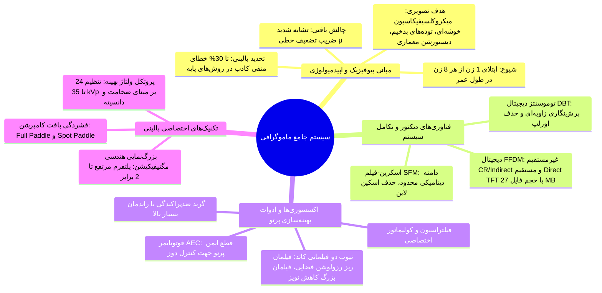
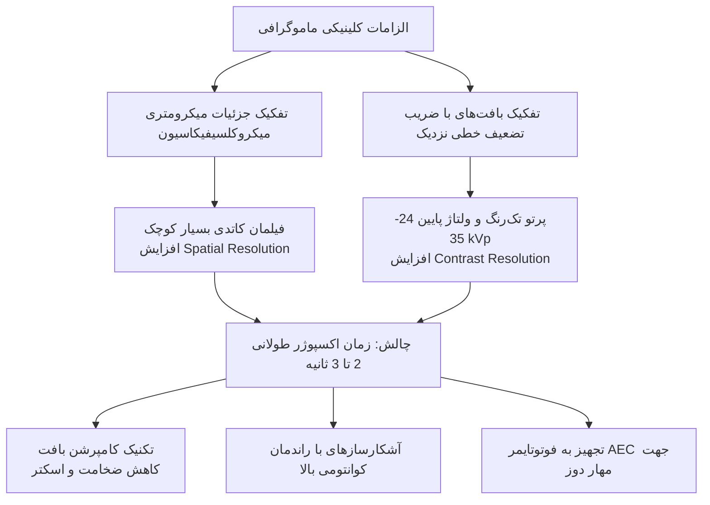
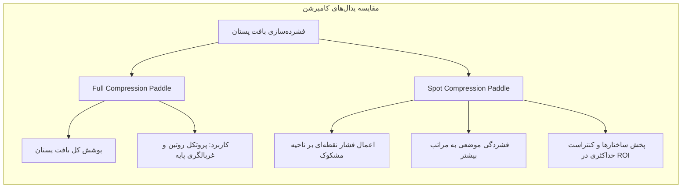
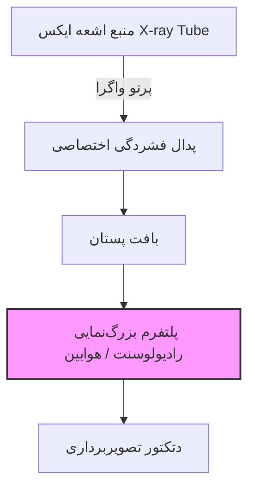

# رادیوگرافی - ماموگرافی

> [!abstract] تعریف رادیوگرافی پستان (Mammography)
> یک مدالیته تخصصی رادیوگرافی با پرتو ایکس تشخیصی، بهینه‌سازی‌شده منحصراً جهت تفکیک بافت‌های نرم (*Soft Tissue Radiography*) ساختار پستان، ارزیابی پاتولوژی‌های انکولوژیک و به‌ویژه غربالگری (*Screening*) و تشخیص زودهنگام (*Diagnostic*) کارسینوم پستان در مراحل پیش‌بالینی.

---

## ۱. اپیدمیولوژی، مبانی بیوفیزیک بافت و ضرورت مدالیته اختصاصی

### ۱.۱. توجیه بالینی و ضرورت غربالگری تخصصی
سرطان پستان شایع‌ترین بدخیمی در زنان بوده و از **هر 8 زن، 1 نفر** در طول حیات خود به آن مبتلا می‌شود. رادیوگرافی جنرال توانایی تفکیک ضایعات اولیه پستان را به دلایل برهم‌کنش پرتو با ماده ندارد. چالش بالینی عمده در سیستم‌های پایه، گزارش موارد *منفی کاذب* (*False Negative*) تا سقف **30%** است که منجر به تاخیر در درمان قطعی می‌گردد. همچنین، عدم تفکیک دقیق غیرتهاجمی موجب انجام سالانه حجم عظیمی بیوپسی‌های دردناک غیرضروری شده که تا **80%** آن‌ها در ارزیابی‌های هیستوپاتولوژی خوش‌خیم تشخیص داده می‌شوند. طراحی دستگاه اختصاصی ماموگرافی با هدف بیشینه‌سازی دقت تفکیک و تقلیل *بیوپسی‌های غیربدخیم* شکل گرفته است.

### ۱.۲. تظاهرات پاتولوژیک هدف در ماموگرام
سیستم تصویربرداری به گونه‌ای مهندسی شده که حساس به ۴ نشانه کلاسیک بدخیمی باشد:
1. مشاهده توده‌های نامنظم (*Masses*) فاقد کپسول همگن.
2. عدم تقارن بافتی و حاشیه‌های نقطه‌نقطه، سوزنی یا ناهموار (*Spiculated/Irregular Margins*).
3. خوشه‌های میکروکلسیفیکاسیون میکرومتری (*Clustered Microcalcifications*).
4. اعوجاج یا درهم‌ریختگی معماری داخلی بافت پستان (*Architectural Distortion*).

### ۱.۳. فیزیک تضعیف پرتو در بافت نرم (Soft Tissue Contrast)
پستان متشکل از بافت چربی (*Fatty*) و بافت ترشحی-فیبروگلندولار (*Fibroglandular*) است. برخلاف رادیوگرافی اسکلتی-قفسه سینه که کنتراست طبیعی بالا ناشی از تفاوت چگالی هوا، استخوان و آب وجود دارد، در پستان ضریب تضعیف خطی (*Linear Attenuation Coefficient*) بافت‌ها بی‌نهایت به یکدیگر نزدیک است. تفکیک ساختارها تنها از طریق بهره‌برداری ماکسیمم از اثر پدیده‌ *فوتوالکتریک* در محدوده‌های کم‌انرژی فوتونی امکان‌پذیر خواهد بود.

---

## ۲. تمایزات ساختاری اکسیداسیون و سخت‌افزار ماشین ماموگرافی

> [!important] چالش دوگانه ماموگرافی: تفکیک‌پذیری در برابر دوز جذبی
> پستان از حیث رادیوبیولوژی بافتی شدیداً *پرتوحساس* (*Radiosensitive*) تلقی می‌شود. در ماموگرافی برعکس رادیوگرافی روتین، به دلیل استفاده از انرژی‌های فوتونی پایین، زمان تابش طولانی است. چالش بنیادین دستگاه، برقراری تعادل میان *رزولوشن مکانی فوق‌العاده بالا*، *کنتراست بهینه* و *مهار دوز پرتوگیری غده‌ای میانگین* بیمار است.

### ۲.۱. اجزای مدار اشعه ایکس و تفاوت‌های تکنیکی با رادیولوژی عمومی

1. **طراحی کاتد با فیلمان دوگانه (*Dual-Filament Cathode*)**:
   - **فیلمان کوچک (*Small Filament*)**: ابعاد فوکال اسپات را به حداقل رسانده، تاری هندسی را مهار و **رزولوشن فضایی** (*Spatial Resolution*) را جهت رؤیت کلسیفیکاسیون‌های ریز ارتقا می‌دهد.
   - **فیلمان بزرگ (*Large Filament*)**: برای تابش‌های استاندارد با شار الکترونی بالا جهت کاهش *نویز کوانتومی* و ارتقای کنتراست به کار می‌رود.
2. **زمان اکسپوژر طولانی (*Long Exposure Time*)**:
   - زمان پرتودهی در رادیوگرافی کمتر از 1 ثانیه بوده؛ در ماموگرافی این پارامتر معمولاً **بیش از 2 تا 3 ثانیه** تداوم می‌یابد.
3. **سیستم فیلتراسیون و کولیماتور ویژه**:
   - فیلترها طیف ترمز غیرمفید با انرژی بسیار پایین (عامل دوز پوستی) و فوتون‌های با انرژی نفوذ بالا (عامل افت کنتراست) را حذف می‌کنند.
   - کولیماتور هندسه میدان تابش را دقیقاً منطبق بر لبه آشکارساز و بافت پستان تحدید نموده تا از تابش‌گیری دیواره قفسه سینه ممانعت شود.
4. **گرید ضدپراکندگی (*Anti-Scatter Grid*)**:
   - پراکندگی پرتو (*Scatter*) در بافت نرم عامل اصلی محوکننده حاشیه‌های ضایعه است؛ از این رو استفاده از گرید با ضریب خطای حداقلی در ماموگرافی اهمیتی بسیار بیشتر از رادیولوژی عمومی دارد.
5. **دتکتورهای فوق‌حساس**:
   - بهینه‌سازی ضریب تفکیک کوانتومی برای تبدیل حداکثر فوتون‌های دریافتی به سیگنال تشخیصی.
6. **فوتوتایمر یا کنترل خودکار تابش (*AEC / Phototimer*)**:
   - سنسور ایمنی زیر دتکتور که شدت پرتو عبوری از بافت را پایش کرده و به محض رسیدن تابش به حد آستانه جهت ممانعت از پرتودهی بیش از حد، مدار پرتو را قطع می‌کند.

---

## ۳. تکنیک‌های عملیاتی: فشرده‌سازی بافت و بزرگ‌نمایی هندسی

### ۳.۱. تکنیک فشردگی بافت پستان (Compression Technique)
یکی از تمایزات برجسته ماموگرافی نسبت به تمامی مدالیته‌های پرتوتابی تشخیصی، اعمال فشار مکانیکی بر بافت پستان حین تابش توسط پدال فشردگی (*Compression Paddle*) است.

> [!danger] علل چهارگانه فیزیکی-تکنیکی فشردن بافت (کامپرشن)
> 1. **کاهش ضخامت موثر بافت**: کاهش دوز جذبی بیمار به دلیل نفوذپذیری آسان‌تر فوتون‌ها و کاهش نیاز به جریان/ولتاژ مفرط.
> 2. **حذف هم‌پوشانی آناتومیک (*Tissue Overlap Reduction*)**: اجزا و ساختارهای داخلی روی هم منطبق در مسیر پرتو در یک ضخامت کم پخش و تفکیک می‌شوند.
> 3. **مهار فوتون‌های ثانویه و اسکتر (*Scatter Reduction*)**: کاهش ضخامت مستقیماً منبع پراکندگی کامپتون را کاهش داده و کنتراست تصویر را ارتقا می‌دهد.
> 4. **مهار حرکت مکانیکی و تاری ناشی از اکسپوژر**: با توجه به زمان تابش 2 تا 3 ثانیه‌ای، ثابت نگه داشتن بافت مانع تاری حرکتی (*Motion Blur*) می‌گردد.

### ۳.۲. تکنیک بزرگ‌نمایی هندسی (Magnification Technique)
در موارد مشاهده توده‌های نامشخص، کلاسترهای ریز یا اختلال در مارژین بافتی، بدون تغییر در پارامترهای رادیوگرافی اولیه، گرافی مجدد مگنیفاید اخذ می‌شود.

* **مکانیسم هندسی**: یک *پلتفرم مرتفع رادیولوسنت* (بدون تضعیف پرتو) روی دتکتور تعبیه می‌شود. پستان روی پلتفرم قرار گرفته و فاصله شیء تا آشکارساز ($OID$) نسبت به فاصله منبع تا شیء ($SOD$) افزایش می‌یابد.
* **رابطه ضریب بزرگ‌نمایی هندسی (M)**:
$$M = \frac{SID}{SOD} = \frac{a + b}{a}$$
*(در این رابطه a معرف فاصله کانون تیوب تا پلتفرم شیء و b فاصله پلتفرم تا دتکتور است).*
* **میزان بزرگ‌نمایی بالینی**: افزایش ابعاد تصویر تا **2 برابر** ابعاد واقعی، که ارزیابی لبه‌های نامنظم و قطعات کلسیفیه میکرونی را میسر می‌سازد.

---

## ۴. پارامترهای اکسپوژر و متغیرهای کنترلی کیلوولتاژ (kVp)

انتخاب کیلوولتاژ تیوب در ماموگرافی نقشی حیاتی در تعیین کیفیت پرتو دارد. بازه انتخابی بسیار محدودتر از رادیولوژی عمومی است و مبتنی بر دو متغیر مستقل تنظیم می‌شود:
1. **ضخامت فیزیکی پستان فشرده‌شده (*Breast Thickness*)**: ضخامت‌های کم نیازمند انرژی فوتونی کمتر جهت جلوگیری از اشباع آشکارساز هستند.
2. **ترکیب بافتی و دانسیته پستان (*Breast Composition*)**:
   - بافت کاملاً چربی (*Fatty Breast*).
   - بافت مختلط با نسبت 50% چربی و 50% فیبروگلندولار (*50% Fatty-Glandular*).
   - بافت متراکم و کاملاً ترشحی-فیبروگلندولار (*Dense Glandular*).

| پله ولتاژی انتخابی | ماهیت بافتی و ضخامت تیپیک پستان | هدف فیزیکی اعمال پارامتر |
| :--- | :--- | :--- |
| **24 kVp** | پستان کوچک و عمدتاً متراکم از بافت چربی (*Fatty*) | ماکسیمم‌سازی پدیده فوتوالکتریک، ایجاد حداکثر کنتراست ذاتی |
| **28 kVp** | پروتکل استاندارد، ضخامت متوسط با نسبت بافتی 50% Fatty-Glandular | ایجاد تعادل بهینه بین دوز دریافتی و کنتراست بافتی |
| **33 kVp** | پستان‌های با ضخامت بالا یا دانسیته بافتی فیبروگلندولار زیاد | نفوذپذیری فوتونی بهینه جهت عبور از حجم بالای بافت بدون جذب کامل |
| **35 kVp** | پستان‌های بسیار حجیم، بسیار متراکم و ضخیم (*Dense Glandular*) | جلوگیری از پدیده عدم نفوذ پرتو و کنترل زمان تابش طولانی تیوب |

> [!important] تنظیم دقیق ولتاژ تیوب
> تنظیم کیلوولتاژ دقیقاً در مقادیر پایین کالیبره می‌شود تا طیف پرتو فاقد فوتون‌های پرانرژی تضعیف‌کننده کنتراست بافت نرم باشد؛ کاهش هر کیلوولت کنتراست را ارتقا داده اما دوز پوستی را تشدید می‌نماید.

---

## ۵. مقایسه جامع فناوری‌های تکاملی آشکارسازی در ماموگرافی

گذر از سیستم‌های آنالوگ به دیجیتال و توموسنتز سه‌بعدی پاسخی مهندسی به محدودیت‌های ذاتی تصویربرداری بافت نرم بوده است.

| مولفه و پارامتر ارزیابی | ماموگرافی فیلم-صفحه (Screen-Film) | ماموگرافی دیجیتال (Digital Mammography) | توموسنتز دیجیتال پستان (DBT) |
| :--- | :--- | :--- | :--- |
| **دامنه دینامیکی (Dynamic Range)** | بسیار باریک و محدود؛ پرتو کمتر یا بیشتر از حد منجر به خرابی کل گرافی می‌شود. | بسیار وسیع؛ خطی بودن پاسخ دتکتور با پردازش پس از اخذ تصویر. | فوق‌العاده بالا همراه با پردازش مقطعی داده‌های حجیم لایه‌ای. |
| **نمایش خط کانتور پوست (Skin Line)** | غیرقابل رؤیت به دلیل افت شدت پرتو و عدم توانایی فیلم در ثبت گرادیان حاشیه‌ای. | کاملاً واضح و پیوسته به دلیل بازه روشنایی و کنتراست ارتقایافته دتکتور. | بازسازی کامل خط پوست به صورت مقطعی بدون سوپرایمپوزیشن ساختارها. |
| **رزولوشن و کنتراست بافت نرم** | رزولوشن مکانی خوب اما کنتراست بافتی بسیار آسیب‌پذیر در برابر دوز نامناسب. | رزولوشن مکانی عالی و کنتراست بافت نرم بسیار چشمگیر و قابل دستکاری. | برترین کیفیت تشخیصی؛ حذف کامل مشکل اورلپ بافتی از طریق برش‌های نازک. |
| **معماری آشکارساز و انواع** | فیلم رادیولوژی اختصاصی همراه با صفحات تشدیدکننده فسفری. | تقسیم به سیستم‌های فسفری اسکن‌شونده CR، غیرمستقیم Indirect و مستقیم Direct TFT. | آرایه‌های فلت پنل سرعت‌بالا همگام با گردش تیوب در یک زاویه مشخص کمانی. |
| **حجم داده و ذخیره‌سازی** | فیزیکی (آرشیو نگاتیو روی فیلم‌های حساس به نور). | فرمت دیجیتال استاندارد؛ حجم هر نما در سیستم دایرکت تا **27 مگابایت (27 MB)**. | مجموعه‌ای حجیم از تصاویر خام و تصاویر بازسازی‌شده چندمگابایتی برشی. |

> [!warning] نکته امتحانی درباره حجم فایل دایرکت
> حجم بالای داده خام در ماموگرافی دیجیتال مستقیم بر پایه ترانزیستورهای لایه‌نازک (*Direct TFT*) به اندازه **27 MB** به ازای *هر تک تصویر* نشان‌دهنده ماتریکس بسیار فشرده، اندازه پیکسل فوق‌العاده کوچک و نیاز مبرم به پهنای باند و فضای آرشیو وسیع در پکس (*PACS*) ماموگرافی است.

---

## ۶. دسته‌بندی و مقایسه تکنولوژی‌های ماموگرافی دیجیتال

دستگاه‌های دیجیتال امروزی به ۳ دسته اصلی انشعاب می‌یابند:
1. **رادیوگرافی کامپیوتری (*Computed Radiography - CR*)**: استفاده از کاست‌های فسفری ذخیره‌ساز photostimulable phosphor و اسکنر لیزری مجزا.
2. **ماموگرافی دیجیتال غیرمستقیم (*Indirect Flat Panel*)**: تبدیل فوتون ایکس به نور مرئی توسط سنتیلاتور سزیم یدید ($CsI$) و سپس تبدیل نور به بار الکتریکی به واسطه آرایه فتودیود آمورف سیلیکون ($a\text{-}Si$).
3. **ماموگرافی دیجیتال مستقیم (*Direct Flat Panel - Direct TFT*)**: فاقد مرحله نوری؛ تبدیل مستقیم فوتون ایکس به بارهای الکتریکی توسط لایه فتوکانداکتور سلنیوم آمورف ($a\text{-}Se$) و ثبت بی‌واسطه در پیکسل‌های آرایه نازک ترانزیستوری TFT که منجر به حداقل پخش سیگنال، مهار تاری نوری و ایجاد بالاترین رزولوشن مکانی در ارزیابی میکروکلسیفیکاسیون‌ها می‌گردد.
