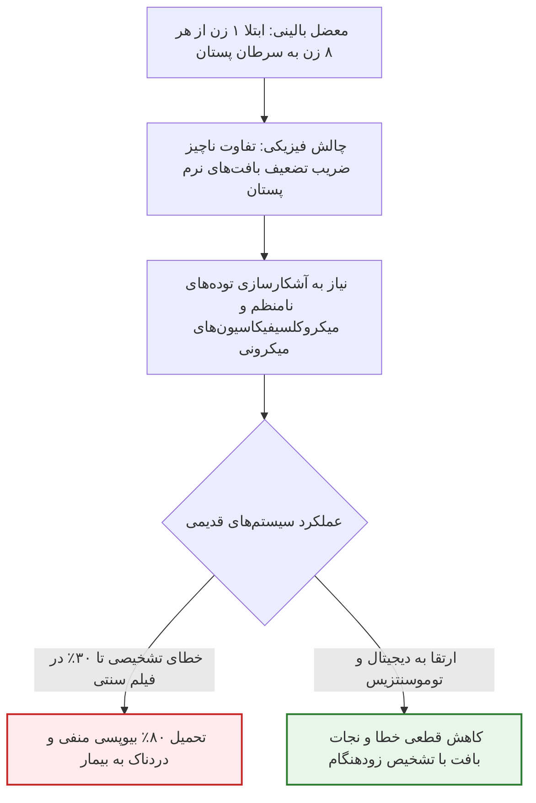
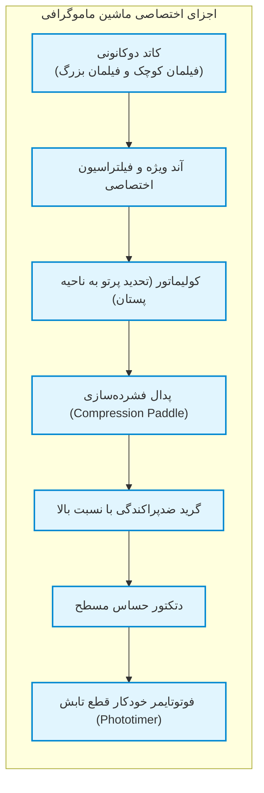
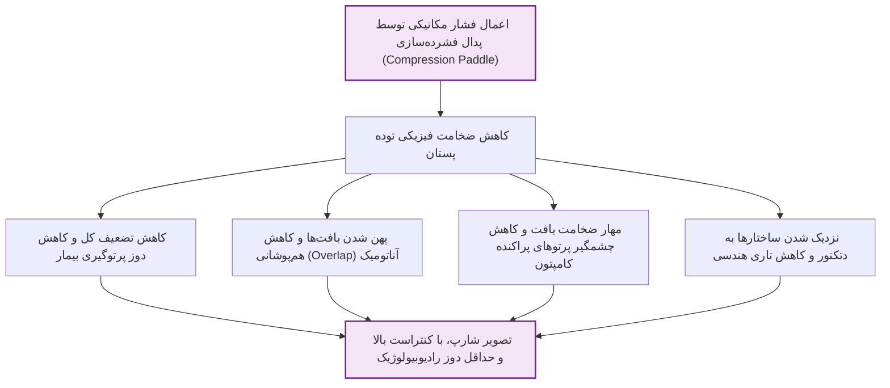
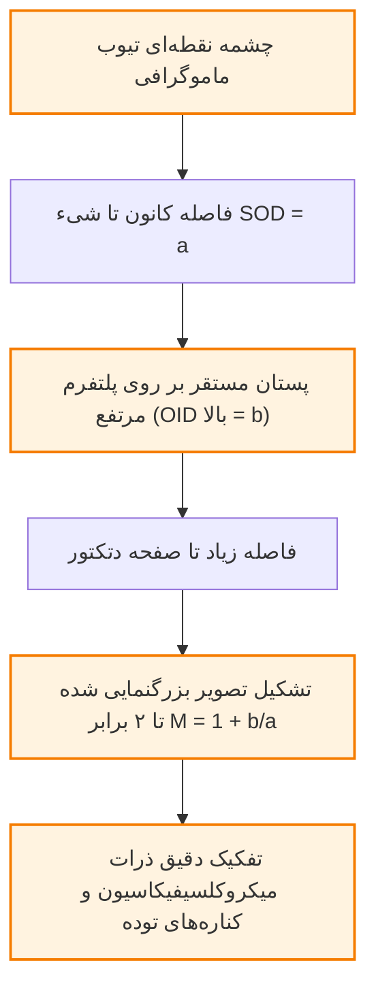
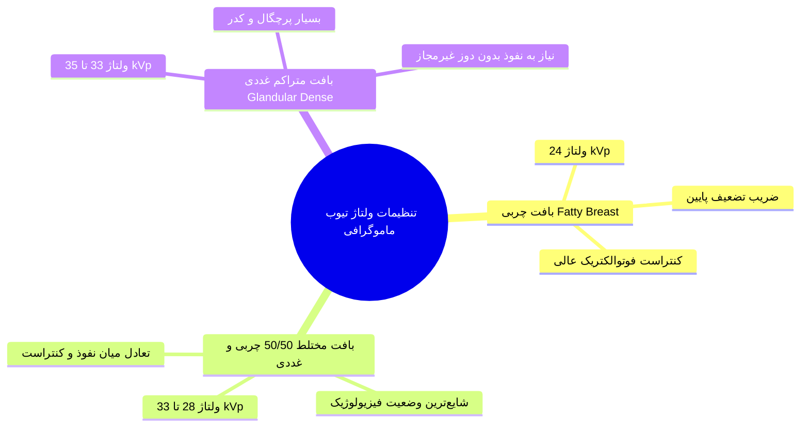
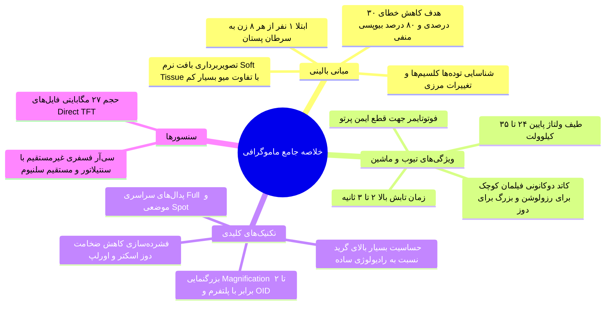

# رادیوگرافی - ماموگرافی

## بخش 1: ماهیت بالینی، ضرورت اپیدمیولوژیک و چالش رادیوگرافی بافت نرم

**ماموگرافی (Mammography)** یک تکنیک تخصصی تصویربرداری رادیوگرافیک پرتو ایکس است که به‌طور اختصاصی برای بررسی آناتومی و پاتولوژی بافت پستان مهندسی شده است. اهمیت حیاتی این مدالیته در غربالگری (*Screening*) و تشخیص زودهنگام (*Diagnostic*) **سرطان پستان** نهفته است؛ بیماری خطیری که از نظر اپیدمیولوژیک **از هر 8 زن، 1 نفر** در طول حیات خود آن را تجربه می‌کند. بزرگ‌ترین چالش فیزیکی در رادیوگرافی پستان این است که بافت هدف، فاقد ساختارهای با تباین شدید ناشی از عدد اتمی بالا نظیر استخوان است. پستان کاملاً از جنس **بافت نرم (Soft Tissue Radiography)** بوده و ضریب تضعیف خطی (مقادیر $\mu$) اجزای درونی آن اعم از چربی، بافت غددی و ضایعات، *فوق‌العاده به هم نزدیک* است. به همین علت، تفاوت کنتراست ذاتی میان بافت‌ها در حالت عادی بسیار ناچیز و ضعیف است. ماموگرافی باید به‌گونه‌ای طراحی شود که بتواند ضمن تفکیک این ضرایب تضعیف بسیار نزدیک، نشانه‌های ظریف و خطرناک بیماری شامل انواع *توده‌ها (Masses)* به‌ویژه موارد دارای مرزهای مضرس، ناهمگن و *نامنظم (Irregularity)*، اعوجاج در معماری بافت (*Architectural Distortion*)، و خوشه‌های ریزآهکی بسیار کوچک (*Clusters of Microcalcifications*) را با وضوح خیره‌کننده آشکار سازد.

> [!definition] ماموگرافی (Mammography)
> تکنیک رادیوگرافی فوق‌تخصصی بافت نرم با *ولتاژ پایین* و *قدرت تفکیک فضایی و کنتراستی بسیار بالا*، با هدف آشکارسازی **توده‌های بدخیم** و **خوشه‌های میکروکلسیفیکاسیون** در پستان جهت غربالگری و پیشگیری از مرگ‌ومیر ناشی از سرطان پستان.

امروزه حدود **80% از بیوپسی‌های پستان** از نظر پاتولوژی **خوش‌خیم** اعلام می‌شوند؛ یعنی بیمار درد و استرس نمونه‌برداری تهاجمی را تحمل می‌کند در حالی که بافت بدخیم نبوده است. از طرفی در سامانه‌های قدیمی، تا مرز **30% خطای تشخیصی** در نتایج ماموگرافی ثبت می‌شد. هدف بنیادین ارتقای فناوری ماموگرافی، *بهینه‌سازی حداکثری کیفیت تصویر* و *بالا بردن حساسیت تشخیصی* است تا از یک سو نرخ خطای منفی کاذب به صفر نزدیک شود و از سوی دیگر، با کاهش موارد مثبت کاذب، از تحمیل این 80% بیوپسی‌های غیرضروری به بانوان جلوگیری به عمل آید.

### مقایسه تطبیقی مدالیته‌های نسلی ماموگرافی

تحول ماموگرافی در سه نسل اصلی ساختاری رخ داده است؛ از فیلم‌های فیزیکی تا سیستم‌های مقطعی سه‌بعدی پیشرفته:

1. **ماموگرافی اسکرین-فیلم (Screen-Film):** سامانه قدیمی و آنالوگ که در آن *دامنه دینامیکی بسیار تنگ و باریک* بود. اگر شدت پرتو کمی کمتر یا بیشتر از حد مجاز می‌شد، فیلم خارج از محدوده خطی قرار گرفته و توان پوشش تصویر را از دست می‌داد. در این سیستم‌ها حتی خط مرزی پوست پستان (Skin Line) نیز به دلیل فقدان کنتراست کافی و سوختگی یا کم‌نوری لبه‌ها، قابل رؤیت نبود.
2. **ماموگرافی دیجیتال (Digital Mammography):** بهره‌گیری از آشکارسازهای دیجیتال مسطح که محدودیت محدوده دینامیکی فیلم را حذف کرده و *کنتراست و رزولوشن فضایی به‌مراتب بالاتری* فراهم می‌آورند. در نوع **Direct TFT**، حجم فایل خام هر تصویر به حدود **27 مگابایت** می‌رسد که نشان‌دهنده عمق اطلاعاتی و محتوای غنی تصویر دیجیتال برای بازنمایی لبه‌ها و میکروکلسیفیکاسیون‌هاست.
3. **دیجیتال توموسنتزیس پستان (Digital Breast Tomosynthesis - DBT):** فناوری برتر امروزی که با ثبت *تعداد زیادی تصویر* با *دوز بسیار پایین* در *زوایای مختلف* و *بازسازی مقطعی سه‌بعدی*، مشکل برهم‌نهی (Superimposition) ساختارهای آناتومیک را به‌طور کامل مرتفع می‌سازد.

| شاخص عملکردی و بالینی | ماموگرافی اسکرین-فیلم (Screen-Film) | ماموگرافی دیجیتال (Digital Mammography) | ماموگرافی توموسنتزیس (DBT) |
| :--- | :--- | :--- | :--- |
| **محدوده دینامیکی (Dynamic Range)** | فوق‌العاده باریک (خطر سوختن یا سفید ماندن) | بسیار وسیع با پاسخ کاملاً خطی سنسور | بسیار وسیع در تمام برش‌های مقطعی |
| **نمایش خط پوست پستان (Skin Line)** | غیرقابل مشاهده و محو | کاملاً تفکیک‌شده و با مرز شارپ | کاملاً واضح به‌صورت لایه‌به‌لایه‌ |
| **اثر برهم‌نهی بافت‌ها (Superimposition)** | شدید (فشردگی کل حجم در یک تصویر مسطح) | وجود دارد ولی با کنتراست بهبودیافته | **به‌طور کامل حذف‌شده از طریق مقاطع سه‌بعدی** |
| **حجم داده و فایل رایانه‌ای** | فاقد فایل (فیلم آنالوگ فیزیکی) | بسیار حجیم (حدود 27 MB در سیستم Direct TFT) | حجم چند برابری به دلیل تصاویر مالتی‌اسلایس |
| **نرخ خطای تشخیصی** | بالا (تا مرز 30% خطا) | متوسط تا کم با پردازش‌های نرم‌افزاری | **کمترین نرخ خطا و کاهش شدید بیوپسی‌های منفی** |

## بخش 2: ساختار سخت‌افزاری دستگاه و مهندسی تیوب پرتو ایکس

دستگاه ماموگرافی از اجزای دقیقی تشکیل شده که برای کار در انرژی‌های بسیار پایین هماهنگ شده‌اند. تیوب ماموگرافی با تیوب رادیوگرافی جنرال تفاوت‌های اساسی دارد؛ زیرا باید به طور هم‌زمان دو مؤلفه متضاد یعنی **رزولوشن فضایی بسیار بالا** (*برای دیدن ذرات کلسیم ریز*) و **کنتراست تفکیکی بافت نرم** را تحت محدودیت شدید دوز تابشی فراهم سازد.

### تفاوت‌های تکنیکی تیوب ماموگرافی در مقایسه با رادیوگرافی جنرال

1. **زمان تابش پرتو (Exposure Time):** در رادیوگرافی ساده، زمان تابش معمولاً بسیار کوتاه و زیر یک ثانیه (مثلاً 0.1 تا 0.5 ثانیه) است تا تاری حرکتی رخ ندهد؛ اما در ماموگرافی به دلیل استفاده از ولتاژهای کاری بسیار پایین و شار فوتونی محدود، نیازمند زمان تابش طولانی‌تر شامل **بیش از 2 تا 3 ثانیه** هستیم.
2. **مدیریت دوز رادیوبیولوژیک پستان:** از آنجا که بافت پستان (به‌ویژه عناصر غددی در حال تکثیر) فوق‌العاده به پرتوگیری حساس و *مستعد آسیب نئوپلاستیک* است، تابش طولانی‌مدت ریسک بیولوژیک دارد. برای کنترل دوز بیمار در این شرایط اکسپوژر طولانی، سه تمهید فنی الزامی است: مهندسی **تیوب فوق‌العاده بهینه**، اعمال **فشرده‌سازی مکانیکی**، و به‌کارگیری **دتکتورهای دیجیتال بسیار حساس**.
3. **طراحی کاتد دوکانونی (Dual-Filament Cathode):** کاتد تیوب ماموگرافی دارای دو فیلمان مجزاست:
   - **فیلمان کوچک (Small Filament):** ابعادی فوق‌العاده ریز دارد. این فیلمان برای ایجاد کانون بسیار کوچک جهت دستیابی به **رزولوشن فضایی حداکثری** و *تفکیک مرزهای میکرونی ضایعات* به کار می‌رود.
   - **فیلمان بزرگ (Large Filament):** برای تأمین *شدت جریان بالاتر (mA بیشتر)*، *تقویت کمیت پرتو*، و *افزایش کنتراست تشخیصی* با **کاهش نویز کوانتومی** در زمان‌های مجاز تابش کاربرد دارد.
1. **سنسور قطع پرتو خودکار یا فوتوتایمر (Phototimer):** قطعه‌ای ایمنی که دقیقاً پرتوگیری دتکتور را رصد کرده و در صورتی که دوز جذبی یا شدت اشعه از *محدوده ایمنی استاندارد* فراتر رود، بلافاصله جریان تابش تیوب را قطع می‌کند تا پستان بیش از حد مجاز اکسپوز نشود.

> [!important] تله تستی: چرا زمان اکسپوژر در ماموگرافی بیش از 2 تا 3 ثانیه است؟
> در ماموگرافی به دلیل استفاده اجباری از کیلوولت‌های بسیار پایین (24 تا 35 kVp)، بازده خروجی فوتون از تیوب به شدت افت می‌کند (به خاطر رابطه مستقیم شدت پرتو با توان دوم ولتاژ: $\text{Quantity} \propto \text{kVp}^2$). برای رساندن تعداد فوتون کافی به دتکتور و جلوگیری از گرسنگی فوتونی و نویز شدید، دستگاه ناگزیر است زمان پرتودهی را تا بالای 2 تا 3 ثانیه افزایش دهد؛ وضعیتی که با طراحی *کاتدهای تخصصی* و *فوتوتایمر* محافظت می‌شود.

## بخش 3: فیزیک فشرده‌سازی بافت پستان (Breast Compression)

پستان در هنگام آزمون ماموگرافی بر روی صفحه تخت نگهدارنده دتکتور قرار گرفته و توسط یک پدال مکانیکی شفاف به نام **کامپرشن پدل (Compression Paddle)** از بالا محکم فشرده و مسطح می‌شود. این مرحله با اینکه ممکن است برای بیمار ناخوشایند و دردناک باشد، نقشی بنیادین و چندوجهی در فیزیک تشکیل تصویر و حفاظت در برابر اشعه ایفا می‌کند.

> [!definition] پدال فشرده‌سازی (Compression Paddle)
> ابزاری مکانیکی در ماشین ماموگرافی با مکانیسم حرکتی عمودی به سمت پایین جهت تخت کردن بافت پستان پیش از تابش اشعه ایکس، با هدف بهبود هندسه تصویر و تقلیل دوز.

### چهار دستاورد فیزیکی و بالینی فشرده‌سازی پستان

1. **کاهش دوز جذبی بیمار:** طبق قانون بیر-لمبرت، تضعیف پرتو با ضخامت محیط رابطه توانی معکوس دارد ($e^{-\mu x}$). با *کاهش ضخامت ($x$)*، اشعه کمتری در بافت تلف شده و پرتوگیری کل بیمار به حداقل می‌رسد.
2. **به حداقل رساندن هم‌پوشانی بافت‌ها (Minimizing Overlapping Anatomy):** با فشرده شدن پستان، *لوبول‌ها و مجاری متراکم غددی* در یک صفحه باریک پخش می‌شوند؛ در نتیجه ساختارهای داخلی روی یکدیگر نیفتاده و تفکیک جزئیات ساختاری و رویت لبه‌های توده‌ها میسر می‌گردد.
3. **سرکوب شدید پراکندگی کامپتون (Reducing Compton Scatter):** ضخامت زیاد منبع اصلی تولید پرتوهای پراکنده است. نازک کردن پستان از حجم پراکندگی درون‌بافتی کاسته و مانع مه‌آلودگی تصویر می‌شود.
4. **تثبیت مکانیکی و رفع تاری حرکتی:** فشرده‌سازی مانع کوچک‌ترین تکان غیرارادی بیمار در حین اکسپوژر چند ثانیه‌ای می‌گردد.

### انواع پدال‌های فشرده‌سازی (Compression Paddles)

* **پدال فشرده‌سازی سراسری (Full Compression Paddle):** این پدال تمام مساحت پستان را از دیواره قفسه سینه تا نیپل به طور یکنواخت فشرده می‌کند و *استاندارد نماهای روتین کرانیوکودال (CC) و مدیولترال مایل (MLO)* است.
* **پدال فشرده‌سازی نقطه‌ای (Spot Compression Paddle):** ابعاد این پدال بسیار کوچک‌تر و موضعی است. هنگامی که رادیولوژیست در نمایه عمومی مشکوک به ضایعه یا اعوجاج ساختاری در ناحیه‌ای خاص می‌شود، با این پدال فشاری عمیق‌تر و موضعی به همان نقطه وارد می‌کند تا با *حداکثر پخش‌شدگی بافت‌های مزاحم اطراف*، **کنتراست و کیفیت موضعی** نقطه مشکوک به اوج برسد.

## بخش 4: هندسه تابش، بزرگنمایی بالینی و کنترل پرتوهای پراکنده

در تصویربرداری ماموگرافی، به دلیل حساسیت مفرط تفکیک بافت نرم، کنترل هندسه پرتو و فیلتر کردن فوتون‌های پراکنده با دقتی مضاعف نسبت به رادیولوژی ساده انجام می‌پذیرد.

### تکنیک بزرگنمایی تشخیصی (Magnification Technique)

در صورت رؤیت *ضایعه مشکوک* یا *خوشه‌های میکروکلسیفیکاسیون ریز*، جهت رؤیت لبه‌ها و جزئیات پاتولوژیک، از آزمون بزرگنمایی استفاده می‌شود. برای این کار، یک **پلتفرم یا پایه شفاف به پرتو ایکس** بر روی دتکتور نصب می‌شود که ارتفاع آن فاصله جسم تا دتکتور (OID) را افزایش می‌دهد. سپس پستان روی این پلتفرم قرار گرفته و پدال فشرده‌سازی آن را تثبیت می‌کند. با افزایش فاصله شیء تا دتکتور ($b$)، بزرگنمایی تشخیصی تا **حدود 2 برابر** شکل می‌گیرد.

فرمول بزرگنمایی ماموگرافی با فیزیک رادیوگرافی انطباق کامل دارد:

$$
M = \frac{\text{Image Size}}{\text{Object Size}} = \frac{a + b}{a} = 1 + \frac{b}{a}
$$

در این رابطه $a$ فاصله چشمه تا پستان و $b$ ارتفاع پلتفرم مگنیفیکاسیون تا دتکتور است. برای جبران تاری هندسی ناشی از بزرگنمایی در این وضعیت، الزاماً باید از **فیلمان کاتدی کوچک** استفاده گردد.

> [!important] حساسیت گرید ضدپراکندگی (Anti-Scatter Grid) در ماموگرافی
> در ماموگرافی، کنتراست ذاتی بافت نرم پستان بسیار ضعیف است؛ بنابراین هر مقدار ناچیزی از پراکندگی کامپتون تصویر را غیرقابل تفسیر می‌کند. به همین علت، گرید ضدپراکندگی در ماموگرافی **اهمیتی به مراتب حیاتی‌تر و حساس‌تر از رادیوگرافی ساده** دارد تا کنتراست ضعیف پستان مخدوش نگردد.

## بخش 5: پروتکل‌های تابش بر اساس ضخامت و ترکیب پستان

تعیین کیلوولت تیوب (kVp) در ماموگرافی به‌شدت وابسته به دو متغیر تعیین‌کننده است: **ضخامت فیزیکی پستان فشرده‌شده** و **ترکیب بافت‌شناسی درون پستان**. محدوده کیلوولت کاری در ماموگرافی بسیار پایین بوده و معمولاً بین **24 تا 35 کیلوولت** تنظیم می‌شود تا برهم‌کنش فوتوالکتریک بیشینه شود.

### تحلیل بالینی ولتاژهای انتخابی

1. **پستان کاملاً چربی (Fatty Breast - 24 kVp):** چربی چگالی و تضعیف بسیار کمی دارد؛ اعمال *ولتاژ بسیار پایین* حدود 24 kVp منجر به پدیده غالب فوتوالکتریک ($Z^3$) شده و بدون بالا بردن دوز بیمار، بالاترین کنتراست را ایجاد می‌کند.
2. **پستان با تراکم متوازن (50% Fatty / 50% Glandular - 28 to 33 kVp):** بافتی مرکب از چربی و عناصر ترشحی که نیازمند *ولتاژهای بینابینی* حدود 28 تا 33 کیلوولت برای عبور یکنواخت پرتو است.
3. **پستان غددی بسیار متراکم (Dense Glandular Breast - 33 to 35 kVp):** بافت غددی جذب بالایی دارد؛ برای نفوذ فوتون‌ها به اعماق پستان چگال، کیلوولت *تا مرز 35 kVp ارتقا می‌یابد* تا از کم‌نور شدن تصویر و خطای ارزیابی پیشگیری شود.

### دسته‌بندی معماری دتکتورهای ماموگرافی دیجیتال

| نوع سامانه آشکارسازی | سازوکار فیزیکی تبدیل پرتو | حجم فایل خروجی رایانه‌ای | جایگاه و ویژگی تشخیصی در ماموگرافی |
| :--- | :--- | :--- | :--- |
| **رادیوگرافی محاسباتی (CR)** | صفحه تحریک‌پذیر نوری فسفری (PSP) و ریدر | متوسط (محدود به قطر لیزر) | قابلیت ارتقای کاست در مراکز سنتی؛ رزولوشن پایین‌تر نسبت به سامانه‌های مدرن |
| **دیجیتال غیرمستقیم (Indirect DR)** | لایه سنتیلاتور + آرایه فوتودایودهای TFT | بالا با کنتراست الکترونیکی | وجود تبدیل واسط اشعه ایکس به نور مرئی با پخش نوری بسیار اندک |
| **دیجیتال مستقیم (Direct TFT)** | تبدیل بی‌واسطه در لایه a-Se به بار الکتریکی | **فوق‌العاده بالا (حدود 27 MB به ازای هر تصویر)** | **ایده‌آل‌ترین سیستم ماموگرافی**؛ بالاترین تفکیک‌پذیری فضایی جهت آشکارسازی میکروکلسیفیکاسیون‌ها |

## بخش 6: چک‌لیست طلایی مرور سریع ماموگرافی

> [!tip] نکات مهم و تله‌های تستی
> 1. **دلیل اختصاصی بودن دستگاه ماموگرافی:** ماموگرافی نوعی رادیوگرافی بافت نرم (*Soft-Tissue Radiography*) است. از آنجا که اختلاف ضریب تضعیف خطی ($\mu$) بین بافت‌های درون پستان بسیار اندک است، با دستگاه‌های رادیولوژی جنرال نمی‌توان کنتراست تفکیکی مناسب را ایجاد کرد.
> 2. **وظیفه حیاتی فوتوتایمر:** دستگاه ماموگرافی مجهز به فوتوتایمر خودکار است تا در صورت بالا رفتن ناخواسته تابش در طول اکسپوژرهای طولانی، پرتو را قطع کرده و مانع تحمیل دوز تابشی مازاد به بافت فوق‌العاده حساس پستان شود.
> 3. **توجیه دوفیلمانی بودن کاتد:** فیلمان کوچک مساحت کانون آند را بسیار ریز کرده و حداکثر رزولوشن فضایی را برای دیدن میکروکلسیفیکاسیون‌ها می‌سازد؛ فیلمان بزرگ شدت جریان (mA) بالا تولید کرده و نویز کوانتومی تصویر را کم می‌کند.
> 4. **چهارگانه طلایی فشرده‌سازی پستان:** فشرده‌سازی هم‌زمان 1) دوز بیمار را به علت کاهش ضخامت کم می‌کند، 2) هم‌پوشانی بافت‌ها را از بین می‌برد، 3) پرتوهای پراکنده کامپتون را مهار می‌کند، و 4) مانع تاری حرکتی ناشی از تکان بیمار می‌شود.
> 5. **کاربرد پدال Spot Compression:** اعمال فشار موضعی شدیدتر در یک نقطه مشکوک و متراکم جهت تفکیک بافت‌های مزاحم روی هم افتاده در همان ناحیه خاص.
> 6. **تکنیک مگنیفیکاسیون و جبران تاری:** در تکنیک بزرگنمایی ماموگرافی، فاصله شیء تا فیلم (OID) با استفاده از پلتفرم افزایش می‌یابد (تا 2 برابر بزرگنمایی)؛ برای رفع تاری هندسی لبه‌ها در این مانور، اپراتور حتماً باید سوییچ دستگاه را روی فیلمان کوچک کاتد قرار دهد.
> 7. **حجم فایل در سیستم مستقیم:** تصاویر دایرکت دیجیتال (Direct TFT) به دلیل رزولوشن لبه‌ای فوق‌العاده بالا، فایل‌هایی حجیم با حجم حدود 27 مگابایت تولید می‌کنند که استاندارد طلایی کشف زودهنگام کلاستر کلسیفیکاسیون‌ها هستند.
