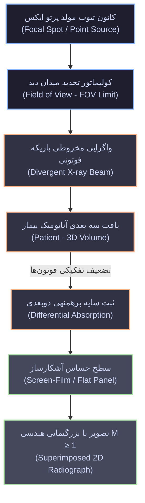
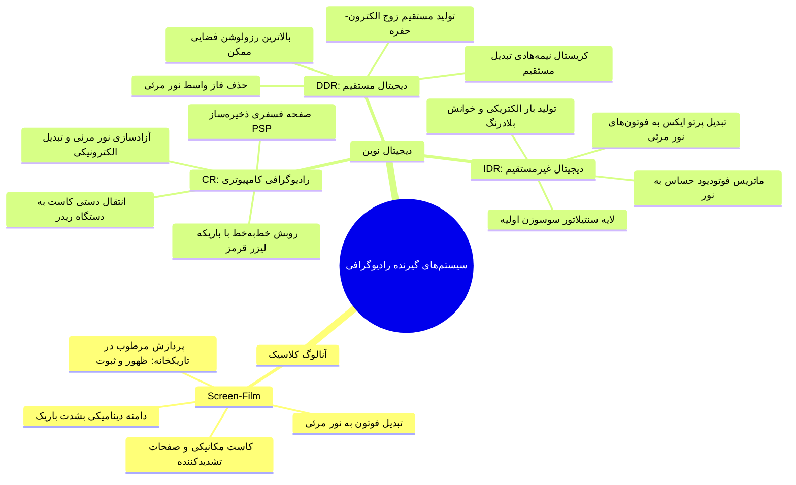
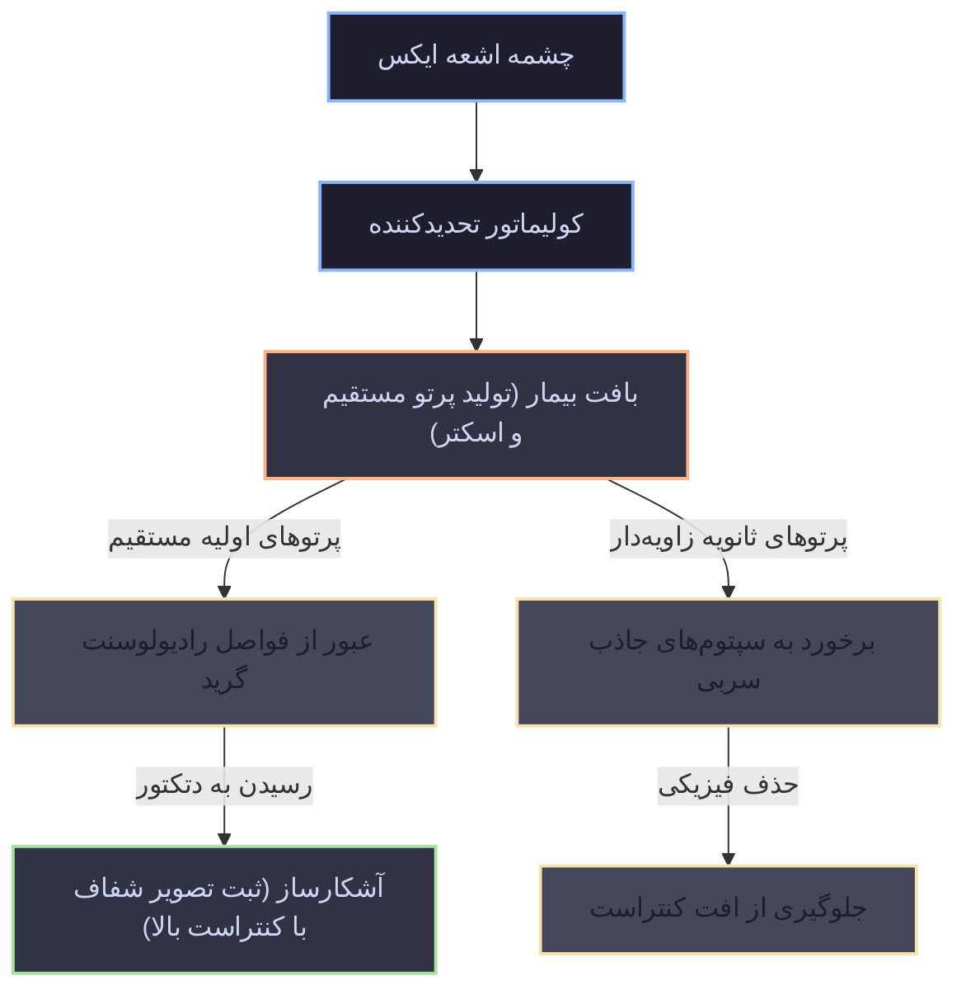
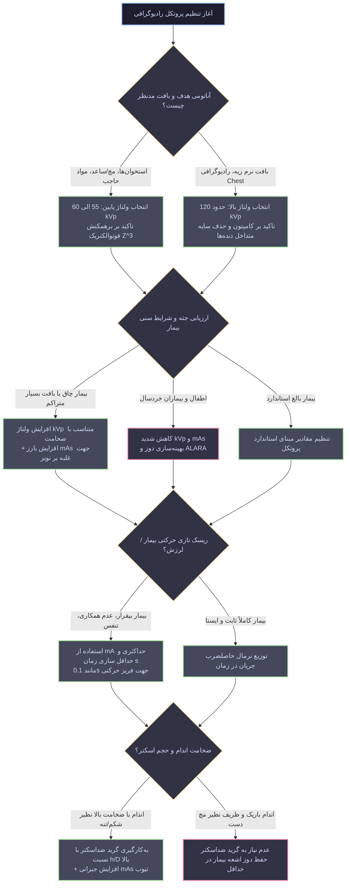

# رادیوگرافی - مبانی فیزیک تصویربرداری

## ۱. اپتیک هندسی، پروژکشن رادیولوژیک و تشکیل سایه

> [!info] تعریف پروژکشن رادیوگرافی و برهمنهی ساختاری
> روش تصویربرداری تشخیصی پزشکی مبتنی بر عبور باریکه واگرای اشعه ایکس از حجم سه‌بعدی بیمار، تضعیف تفکیکی بافتی (*Differential Attenuation*)، و دریافت فوتون‌های باقیمانده توسط آشکارساز دوبعدی. نتیجه مستقیم این فرآیند، فشرده‌سازی اطلاعات عمقی بر پایه اصل **برهمنهی (Superposition)** و ثبت تداخل ارگان‌های واقع در سطوح عمقی مختلف است.

### زنجیره تشکیل سایه و کنترل باریکه اولیه

* **ماهیت سایه رادیولوژیک:** برخلاف نور مرئی که بر روی دیوار سایه یکدست کدر ایجاد می‌کند، پرتو ایکس نفوذپذیر است؛ لذا تصویر نهایی سایه‌ای ساختاریافته شامل **مرز اندام‌ها**، **پارانشیم داخلی بافت**، **حدود اتصالات استخوانی** و **تظاهرات ضایعات پاتولوژیک سایه‌ساز** است.

* **کولیماتور (Collimator):** قطعه تحدیدکننده فیزیکی پرتو در خروجی تیوب؛ وظیفه تطبیق هندسی زاویه پرتو با فیلد بالینی مدنظر (نظیر *محدوده شکم/ابدومن*) به منظور مهار پرتوگیری بافت‌های جنبی سالم و کاستن از حجم تولید پرتوهای پراکنده ثانویه.

* **فواصل استاندارد چشمه تا آشکارساز (SID):** فواصل به شکل بالینی تثبیت شده‌اند؛ فاصله **100 سانتی‌متر** (معادل 40 اینچ) برای عموم اندام‌ها و مفاصل، و فاصله **183 سانتی‌متر** (معادل 72 اینچ) اختصاصاً جهت تصویربرداری قفسه سینه (*Chest X-ray*) به قصد کاهش اعوجاج هندسی و *افت بزرگنمایی کاذب سایه قلب*.

### مکانیک ریاضیاتی بزرگنمایی هندسی (Magnification)

به دلیل نقطه کانون کوچک و زاویه گسیل واگرا (*Divergent Beam*)، پرتوها حین عبور از بدن باز شده و تصویر نهایی روی دتکتور همواره ابعادی فراتر از جسم واقعی دارد. فاکتور بزرگنمایی (**M**) از تناسب مثلثاتی فواصل محاسبه می‌شود:

$$
M = \frac{\text{Image Size}}{\text{Object Size}} = \frac{a + b}{a} = \frac{\text{SID}}{\text{SOD}}
$$

* پارامتر **a** (معادل **SOD**): فاصله کانون چشمه تا شیء (*Source-to-Object Distance*).

* پارامتر **b** (معادل **OID** یا **ODD**): فاصله شیء تا سطح دتکتور (*Object-to-Detector Distance*).

* پارامتر **a + b** (معادل **SID**): فاصله کانون چشمه تا سطح دتکتور (*Source-to-Image Receptor Distance*).

> [!warning] دام تستی: به حداقل رساندن بزرگنمایی و تاری لبه
> برای حذف اعوجاج ابعادی، فاصله شیء تا دتکتور باید به صفر میل کند ($b \to 0$)؛ در این حالت $M \approx 1$ خواهد شد (مثال بالینی: مماس کردن کامل استخوان ساعد یا مچ دست بر سطح کاست). برعکس، هرگونه افزایش در فاصله $b$، بزرگنمایی را **به‌شدت جهش می‌دهد** و باعث ناواضحی لبه‌ها می‌شود.

## ۲. تکنولوژی گیرنده‌های تصویر: فیلم آنالوگ در برابر سیستم‌های دیجیتال

گیرنده‌ها انرژی فوتون‌های پرتو ایکس باقی‌مانده را به دانسیته مرئی یا دیتای دیجیتال تبدیل می‌کنند. تکامل فنی از سیستم‌های کند و تاریکخانه‌ای فیلم-صفحه به پلتفرم‌های نیمه‌هادی آرایه تخت (*FPD*)، انقلابی در عرض دینامیکی و بهره‌وری کوانتومی ایجاد نموده است.

### سیستم فیلم-صفحه (Screen-Film) و موازنه ضخامت اسکرین

ساختار ساندویچی کاست شامل استقرار فیلم دوطرف-امولسیون مابین دو صفحه سوسوزن تشدیدکننده (*Intensifying Screens*) است. فیلم به‌تنهایی راندمان جذبی ناچیزی دارد؛ کریستال‌های فسفر اسکرین فوتون ایکس را از طریق پدیده **سنتیلاسیون** به رگباری از فوتون‌های نور مرئی تبدیل کرده و فیلم توسط نور مرئی اکسپوز می‌شود. پس از اکسپوژر، کاست به **اتاق تاریک (Darkroom)** منتقل و مراحل شیمیایی **ظهور (Development)** و **ثبوت (Fixation)** انجام می‌گیرد.

میزان برهمکنش پرتو ایکس در اسکرین از قانون تضعیف خطی تبعیت می‌کند:

$$
N = N_0 \cdot e^{-\mu x}
$$

که در آن **x ضخامت صفحه اسکرین** است. موازنه اجباری ضخامت اسکرین در جدول زیر تبیین شده است:

| شاخص عملکردی                    | اسکرین ضخیم (Thick Screen)                               | اسکرین نازک (Thin Screen)                             |
| ------------------------------- | -------------------------------------------------------- | ----------------------------------------------------- |
| **راندمان به دام‌اندازی فوتون** | بسیار بالا؛ جذب حداکثری پرتو ایکس ورودی ($N \downarrow$) | پایین‌تر؛ عبور کسر بزرگی از پرتوها بدون رخداد جذب     |
| **بازدهی نور و کنتراست**        | **تقویت چشمگیر کنتراست**؛ امکان کاهش اکسپوژر             | افت کنتراست ظاهری؛ نیازمند اکسپوژر و دوز پرتو بالاتر  |
| **مسیر پیمایش نوری**            | مسیر طولانی فوتون‌های نور مرئی تا امولسیون فیلم          | مسیر حرکتی بسیار کوتاه نور درون فسفر تا رسیدن به فیلم |
| **پخش‌شدگی نور (Light Spread)** | **پخش نوری شدید** و واگرایی گسترده اشعه‌های مرئی         | حداقل انحراف نوری و واگرایی مکانی پرتوهای مرئی        |
| **قدرت تفکیک فضایی (رزولوشن)**  | **افت شدید رزولوشن فضایی**؛ وقوع تاری ساختاری (*Blur*)   | **رزولوشن فضایی عالی**؛ حفظ جزئیات لبه‌های میکروسکوپی |
| **اندیکاسیون انتخابی بالینی**   | بافت‌های نیازمند کنتراست بالا؛ مهار دوز در بافت قطور     | ساختارهای استخوانی ظریف؛ بررسی ترک‌ها و جزئیات دقیق   |

> [!important] قاعده کنترلی موازنه اسکرین
> انتخاب ضخامت اسکرین یک بده‌بستان اجباری (*Trade-off*) است: *اسکرین ضخیم* با پذیرش افت رزولوشن، کنتراست را تقویت و دوز را می‌کاهد؛ *اسکرین نازک* با بهای افزایش دوز بیمار، رزولوشن فضایی و تفکیک لبه‌ها را در اوج نگه می‌دارد.

### تحلیل فیزیکی منحنی مشخصه رادیوگرافیک (H&D Curve)

> [!info] تعریف چگالی نوری یا اپتیکال دنسیتی (Optical Density - OD)
> لگاریتم نسبت شدت نور مرئی تابیده شده به فیلم خام به شدت نور عبور کرده از فیلم پرتودیده. این شاخص معرف ریاضی میزان تیرگی یا روشنایی نقاط فیلم است. با افزایش اکسپوژر و تشدید رسوب نقره فلزی، **اپتیکال دنسیتی افزایش** یافته و فیلم رو به سیاهی می‌رود.

منحنی **H&D** (مخفف *Hurter & Driffield*) رفتار چگالی نوری (OD) را برحسب لگاریتم اکسپوژر ورودی (Log Exposure) توصیف می‌کند:

1. **پاشنه منحنی (ناحیه Underexposure):** ناتوانی فیلم در پاسخ‌دهی به پرتوهای ضعیف؛ سفیدی مطلق، از بین رفتن اطلاعات بافت‌های متراکم.

2. **ناحیه شیب خطی (Linear Region):** تنها محدوده استاندارد فیلم برای تفکیک درجات خاکستری بافتی.

3. **شانه منحنی (ناحیه Overexposure):** اشباع کامل شیمیایی امولسیون ناشی از پرتوگیری افراطی؛ **سوختن فیلم (Burned Film)**، سیاهی مطلق و محو شدن کنتراست ساختاری.

4. **محدودیت بزرگ آنالوگ:** **عرض دینامیکی (Dynamic Range) به‌شدت باریک**؛ کوچک‌ترین خطای تکنسین در تخمین دوز تابشی منجر به سوختن یا سفید ماندن فیلم و اجبار به تکرار پرتودهی بیمار می‌گردد.

## ۳. طبقه‌بندی آشکارسازهای دیجیتال و پردازش سیگنال

سیستم‌های دیجیتال با جایگزینی دتکتورهای صفحه تخت (*FPD*)، محدودیت باریک بودن دامنه دینامیکی اسکرین-فیلم را کاملاً مرتفع ساخته‌اند.

### جدول تطبیقی معماری گیرنده‌های دیجیتال (CR vs IDR vs DDR)

| پارامتر فنی و بالینی          | رادیوگرافی کامپیوتری (CR)                                | دیجیتال غیرمستقیم (IDR)                               | دیجیتال مستقیم (DDR)                                     |
| ----------------------------- | -------------------------------------------------------- | ----------------------------------------------------- | -------------------------------------------------------- |
| **محیط فیزیکی دریافت پرتو**   | صفحه فسفری القاپذیر نوری (**PSP**) مستقر در کاست         | لایه سنتیلاتور سوسوزن جفت‌شده با فوتودیود             | لایه کریستال نیمه‌هادی حساس فوتوالکتریک                  |
| **زنجیره تبدیل انرژی**        | پرتو ایکس ⇦ الکترون به دام افتاده ⇦ فوتون نوری ⇦ دیجیتال | پرتو ایکس ⇦ نور مرئی ⇦ بار الکتریکی فوتودیود          | **پرتو ایکس** ⇦ **بار الکتریکی مستقیم** (حذف واسطه نوری) |
| **مکانیزم بازخوانی داده**     | تحریک نقطه به نقطه توسط **لیزر قرمز رنگ** در دستگاه ریدر | آشکارسازی موازی و بلادرنگ نور با ماتریس فوتودایودها   | جمع‌آوری سریع میدان الکتریکی در ترانزیستور آرایه         |
| **وضعیت پراکندگی نوری**       | وجود دارد (حین گسیل فوتواستیمولیشن در عمق لایه PSP)      | وجود دارد (پخش و پراکندگی پرتوهای نور درون سنتیلاتور) | **صفر مطلق** (فقدان کامل فوتون نوری و پخش شدگی)          |
| **قدرت تفکیک فضایی (شارپنس)** | متوسط؛ متأثر از قطر باریکه لیزر بازخوان                  | خوب؛ وابسته به ضخامت لایه سنتیلاتور                   | **فوق‌العاده عالی؛ بالاترین رزولوشن و ثبت تیز لبه‌ها**   |
| **دستکاری مکانیکی تکنسین**    | دارد؛ نیازمند انتقال فیزیکی کاست به دستگاه اسکنر ریدر    | ندارد؛ ثبت، بازخوانی و ارسال تمام‌خودکار              | ندارد؛ پردازش الکترونیکی مستقیم در کسری از ثانیه         |

> [!info] ارزش‌های عملیاتی پلتفرم‌های دیجیتال نسبت به فیلم
>
> 1. **دسترسی بلادرنگ (Instant Availability):** تشکیل و رویت تصویر در مانیتور در کسری از ثانیه بدون اتلاف وقت تاریکخانه.
>
> 2. **آرشیو و تبادل در بستر PACS:** انتقال امن فایل‌ها بر روی سرورهای بیمارستانی بدون نیاز به انبار فیزیکی فیلم‌ها.
>
> 3. **پردازش‌های نرم‌افزاری ثانویه (Post-processing):** اصلاح نرم‌افزاری روشنایی و کنتراست، اعمال فیلترهای تقویت لبه، و کمک از هوش مصنوعی.
>
> 4. **تله‌رادیولوژی (Teleradiology):** ارسال بی‌درنگ دیتای تصویر از طریق شبکه اینترنت برای مشاوره‌های پزشکی در سراسر جهان.

## ۴. فیزیک برهمکنش پرتو با ماده و بهینه‌سازی پارامترهای تابش

کیفیت تصویر رادیوگرافی و دوز بیمار مستقیماً متأثر از چیدمان فیزیکی پارامترهای تیوب اشعه ایکس شامل ولتاژ قله، حاصلضرب جریان در زمان، و فیلد دید است.

### فیزیک ولتاژ تیوب (kVp): گزینش فوتوالکتریک در برابر کامپتون

ولتاژ تیوب مشخص‌کننده انرژی ماکزیمم و میانگین طیف فوتونی (*کیفیت پرتو*) است. با کنترل ولتاژ، نوع برهمکنش فیزیکی غالب در اتم‌های بدن هدایت می‌شود:

1. **تکنیک ولتاژ پایین (Low kVp - محدوده 55 تا 60 کیلوولت):**

   * **غلبه برهمکنش فوتوالکتریک (Photoelectric Effect):** احتمال رخداد با توان سوم عدد اتمی ($Z^3$) رابطه مستقیم و با توان سوم انرژی فوتون ($1/E^3$) رابطه عکس دارد.

   * **کاربرد بالینی اختصاصی:** تصویربرداری از ارگان‌های غنی از عناصر با عدد اتمی بالا نظیر **استخوان‌ها (کلسیم)**، یا فضاهای آکنده از **مواد حاجب رادیولوژی** (*باریم و ید*) در اندام‌های باریک مانند *مچ و ساعد دست*.

2. **تکنیک ولتاژ بالا (High kVp - محدوده حدود 120 کیلوولت):**

   * **غلبه برهمکنش پراکندگی کامپتون (Compton Scattering):** احتمال برهمکنش فوتوالکتریک به صفر میل کرده و پدیده ناکشسان کامپتون که وابسته به چگالی الکترونی بوده و به عدد اتمی وابسته نیست، حاکم می‌شود.

   * **کاربرد بالینی اختصاصی:** رادیوگرافی قفسه سینه (**Chest X-ray**) با هدف معاینه بافت نرم ریوی و تفکیک عروق پلمونری.

> [!warning] نکته امتحانی فوق‌العاده مهم: منطق فیزیکی High kVp در چست‌رادیوگرافی
> در گرافی قفسه سینه، استخوان‌های متراکم دنده در صورت تابش ولتاژ پایین به علت پدیده فوتوالکتریک سایه سفید شدیدی انداخته و بافت نرم ریه زیرین را کاملاً می‌پوشانند. با افزایش ولتاژ تا **120 kVp**، رخداد فوتوالکتریک مهار شده و دنده‌ها اصطلاحاً *شفاف و محو* می‌گردند. این پدیده کنتراست استخوان را سرکوب کرده و امکان مشاهده دقیق *ضایعات بافت نرم ریه و پارانشیم تنفسی* را فراهم می‌سازد.

### حاصلضرب جریان-زمان (mAs) و دینامیک فریز حرکتی

پارامتر **mAs** کمیت پرتو (*تعداد کل فوتون‌های خارج‌شده از تیوب*) را تنظیم می‌کند و بر نفوذپذیری تک‌تک فوتون‌ها بی‌اثر است.

* **تکنیک فریز کردن حرکتی:** حاصلضرب $mA \times s$ منعطف است. با **افزایش حداکثری جریان تیوب (**$mA \uparrow$**)** می‌توان **زمان پرتودهی را به حداقل رساند (**$s \downarrow$**)** (مانند اکسپوژرهای 0.1s، 0.2s، 0.5s و نهایتاً 1s). این شات کوتاه ارگان را فریز کرده و تاری حرکتی ناشی از لرزش یا تنفس بیمار را مهار می‌کند.

* **مهار نویز کوانتومی (Quantum Mottle):** هرگاه شار فوتونی رسیده به دتکتور ناکافی باشد، نویز تصادفی دانه‌برفی بر سیگنال غلبه می‌کند. در بیماران دارای قطر بافتی زیاد و چاقی مفرط، **افزایش mAs** با بالابردن دانسیته فوتونی، نسبت سیگنال به نویز را در سطح کیفی مطلوب نگه می‌دارد.

## ۵. کنترل پرتوهای پراکنده و فناوری گرید ضداسکتر

> [!info] تعریف پرتو پراکنده (Scatter Radiation)
> فوتون‌هایی که در اثر برهمکنش ناکشسان کامپتون درون بدن بیمار، مسیر خطی خود را از دست داده و با زاویه غیرمستقیم به سمت دتکتور منحرف می‌شوند. این پرتوها فاقد اطلاعات آناتومیک بوده و با ایجاد یک مه خاکستری یکنواخت، کنتراست و مرزهای تشخیصی را از بین می‌برند.

### ساختار مکانیکی گرید و نسبت گرید (Grid Ratio)

گرید ضداسکتر صفحه‌ای مرکب از نوارهای فوق‌العاده باریک سربی جذب‌کننده پرتو است که به صورت موازی چیده شده و بین آن‌ها موادی شفاف به اشعه (مانند آلومینیوم یا فیبر کربن) تعبیه شده است. فوتون‌های هم‌راستای چشمه از شکاف‌ها عبور کرده و فوتون‌های منحرف‌شده با تیغه‌های سربی برخورد نموده و جذب می‌شوند.

توانمندی فیزیکی گرید با **نسبت گرید (Grid Ratio)** محاسبه می‌گردد:

$$
\text{Grid Ratio} = \frac{h}{D}
$$

* کمیت **h**: ارتفاع فیزیکی تیغه‌های سربی.

* کمیت **D**: فاصله آزاد رادیولوسنت بین دو تیغه سربی مجاور.

> \[!important\] موازنه سه‌گانه بالینی: نسبت گرید، نویز و دوز جذبی بیمار
> با افزایش نسبت گرید ($h/D \uparrow$)، زاویه پذیرش فوتون باریک‌تر شده و حذف فوتون‌های پراکنده با راندمان بالاتری رخ می‌دهد که حاصل آن **بهبود چشمگیر کنتراست تصویر** است. با این حال، حذف فوتون‌ها سبب افت شار کلی رسیده به دتکتور و **افزایش نویز کوانتومی** تصویر می‌شود. برای غلبه بر نویز، اپراتور ناچار به **افزایش mAs تیوب** است که مستقیماً موجب **افزایش دوز جذبی پرتوگیری بیمار** خواهد شد.

## ۶. الگوریتم جامع تصمیم‌گیری بالینی و تنظیم اکسپوژر

## ۷. جمع‌بندی نکات طلایی و تله‌های امتحانی

* **تفاوت تاری نوری در اسکرین ضخیم:** اسکرین ضخیم به دام‌اندازی فوتون ایکس را بالا برده ولی به دلیل پیمایش بلند نور و *Light Spread*، تصویر را دچار محوشدگی لبه‌ها (*Blurring*) می‌کند.

* **مکانیزم بازخوانی در CR:** تحریک فسفر تحریک‌پذیر با نور (*PSP*) با **نور لیزر قرمز** و گسیل نور مرئی خط‌به‌خط جهت خوانش توسط دتکتور ریدر.

* **مزیت ذاتی دتکتور مستقیم (DDR):** حذف کامل مرحله نور مرئی؛ فوتون پرتو ایکس مستقیماً در نیمه‌هادی بار الکتریکی می‌سازد؛ در نتیجه *پخش‌شدگی نوری صفر* و رزولوشن در بالاترین حد تئوریک قرار دارد.

* **فلسفه فیزیکی ولتاژ 120 کیلوولت در قفسه سینه:** هدف، کاهش برهمکنش فوتوالکتریک در کلسیم استخوان‌های دنده و شفاف‌سازی آن‌ها به نفع دیده‌شدن ضایعات بافت نرم ریه است.

* **هزینه بالینی افزایش نسبت گرید:** ارتقای نسبت گرید ($h/D$) کنتراست را نجات می‌دهد، اما به علت انسداد بخشی از فوتون‌ها، نویز کوانتومی تصویر را تشدید می‌کند؛ جبران این نویز با بالا بردن mAs، مستقیماً **دوز جذبی بیمار را بالا می‌برد**.
