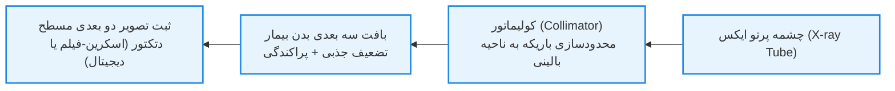
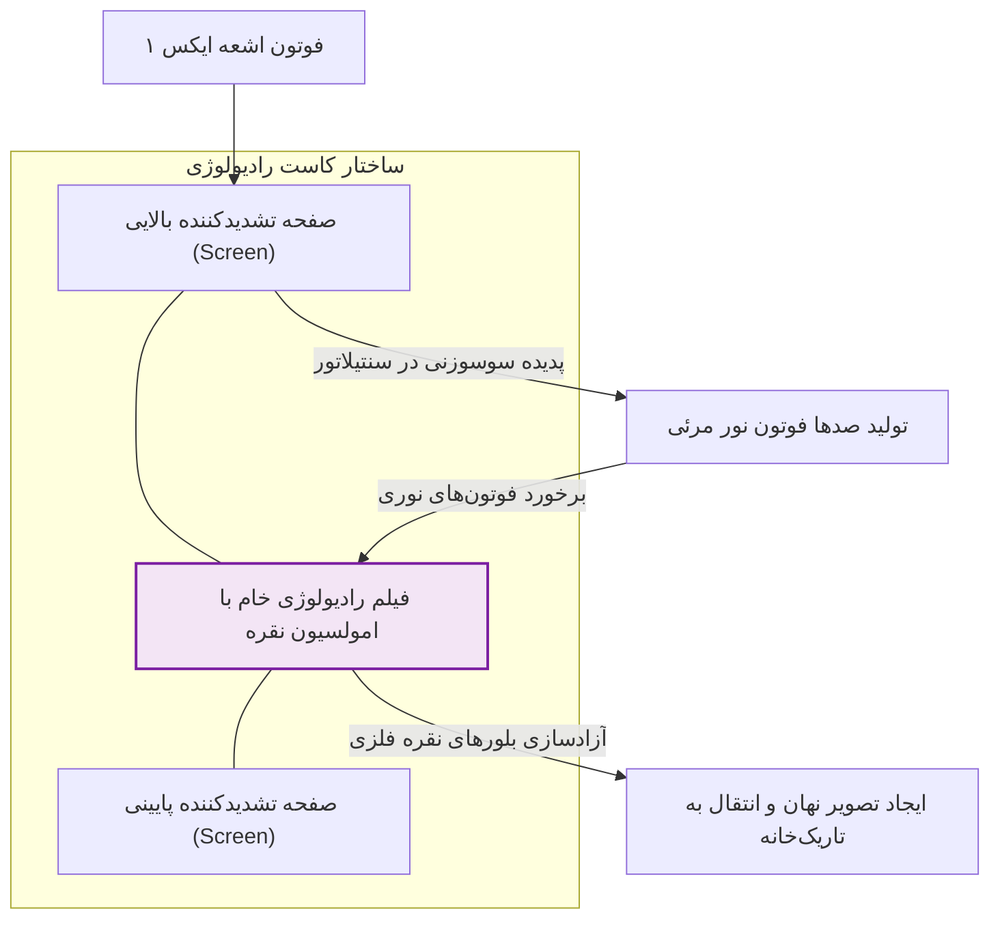
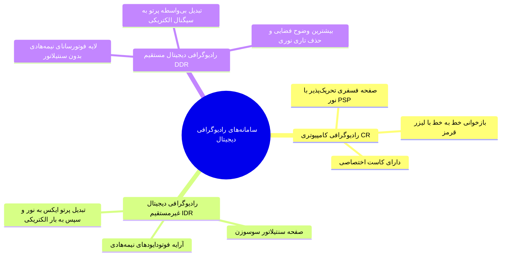
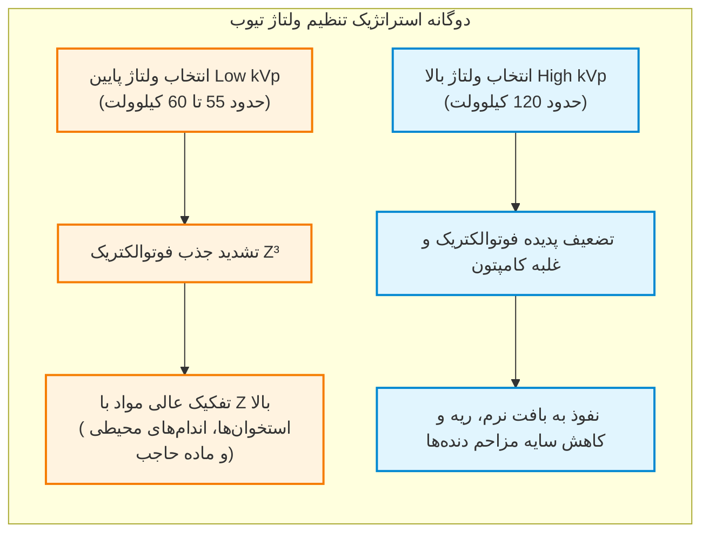
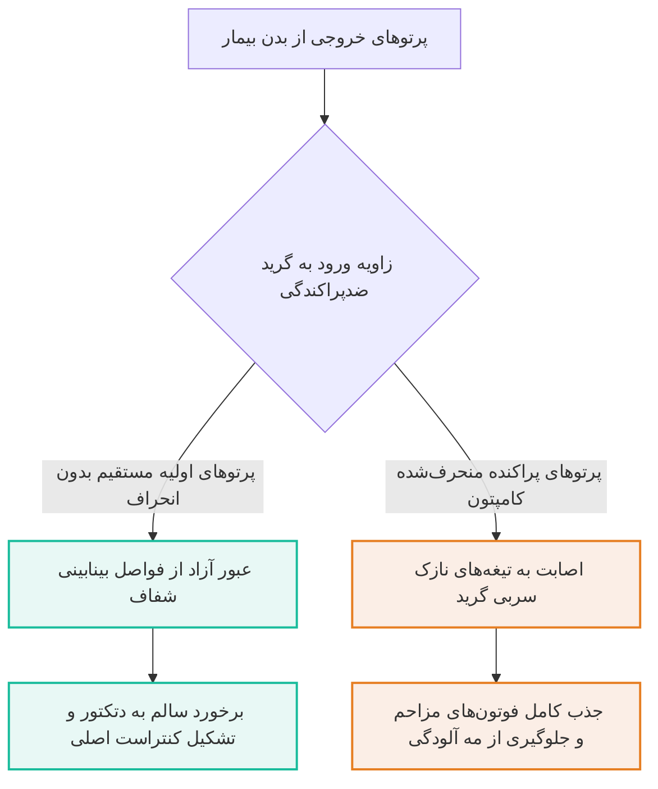
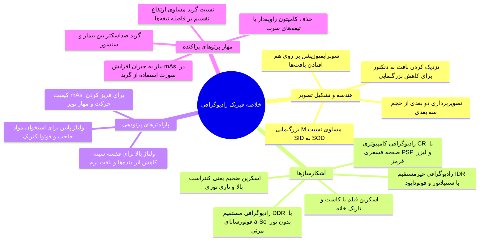

# رادیوگرافی - مبانی فیزیک تصویربرداری

## بخش 1: ماهیت پروژکشن رادیوگرافی و هندسه تشکیل تصویر

رادیوگرافی تصویربرداری پایه‌ای‌ترین و پرکاربردترین روش تشخیصی در پزشکی است که با تاباندن اشعه ایکس به بدن و ثبت پرتوهای عبوری، ساختارهای داخلی را آشکار می‌کند. این آزمون طیف گسترده‌ای از معاینات بالینی را پوشش می‌دهد و برای بررسی تقریباً تمام ارگان‌ها و استخوان‌های بدن به کار می‌رود. برخلاف تصویربرداری روزمره با نور مرئی که فقط سطح مات اجسام را نشان می‌دهد، پرتو ایکس به درون ماده نفوذ می‌کند و با تضعیف و عبور ناهمگن از لایه‌های مختلف، سایه‌ای حاوی اطلاعات بافت‌ها پدید می‌آورد؛ سایه‌ای که در آن *مرز اندام‌ها، پارانشیم بافت‌های درونی، لبه‌های استخوانی، محل اتصالات مفصلی و ردپای ضایعات بیماری‌ها* هویدا می‌شود.

> [!definition] پروژکشن رادیوگرافی (Projection Radiography)
> روشی در تصویربرداری پزشکی که در آن با تاباندن اشعه ایکس از یک منبع نقطه‌ای به حجم سه بعدی بدن بیمار و ثبت پرتوهای خروجی روی دتکتور مسطح، تصویری دو بعدی بر پایه روی هم افتادن ساختارها تشکیل می‌شود.

مفهوم بنیادین در این تکنیک، تبدیل اطلاعات حجمی به یک سطح دو بعدی است که به آن اصطلاحاً *سوپرایمپوزیشن* یا برهم‌نهی آناتومیک می‌گویند؛ یعنی تمام ساختارهایی که در امتداد مسیر خط سیر پرتو ایکس چیده شده‌اند روی همدیگر فشرده و تصویر می‌شوند. زنجیره تصویربرداری شامل منبع تولید اشعه (تیوب)، کولیماتور جهت محدود کردن پهنای تابش به ناحیه هدف (مانند شکم یا اندام‌ها)، بدن بیمار به عنوان محیط تضعیف‌کننده، و نهایتاً گیرنده یا دتکتور در پشت بیمار است که در مدت زمانی بسیار کوتاه (مثلاً 0.1، 0.2، 0.5 یا 1 ثانیه) پرتوها را شکار و ثبت می‌کند.



### هندسه تابش، واگرایی و قانون بزرگنمایی رادیوگرافیک

اشعه ایکس از یک کانون بسیار کوچک در آند تیوب خارج می‌شود و پرتوهایی بازشونده و واگرا تولید می‌کند. به دلیل همین ماهیت واگرایی زاویه‌ای، اندازه سایه هر عضو بر روی فیلم یا دتکتور همواره **بزرگ‌تر از ابعاد فیزیکی واقعی** آن در بدن بیمار خواهد بود. میزان این درشت‌نمایی با **فاکتور بزرگنمایی (Magnification یا M)** سنجیده می‌شود که تابعی از *فاصله کانون تا دتکتور (SID)* و *فاصله کانون تا اندام بیمار (SOD)* است:

$$
M = \frac{\text{Image Size}}{\text{Object Size}} = \frac{\text{SID}}{\text{SOD}} = \frac{a + b}{a} = 1 + \frac{b}{a}
$$

در این رابطه، $a$ فاصله چشمه تا بافت هدف (SOD) و $b$ فاصله بافت بیمار تا صفحه دتکتور (OID) است.
☜ اگر اندام بیمار (مثلاً استخوان مچ دست) مستقیماً روی دتکتور چسبانده شود، فاصله $b$ بسیار کوچک و ناچیز شده و نسبت $b/a$ به صفر میل می‌کند؛ در نتیجه عدد بزرگنمایی تقریباً برابر با 1 می‌شود و تصویر با کمترین تحریف هندسی و نزدیک‌ترین مقیاس به اندازه واقعی تشکیل خواهد شد.
☜ برعکس، هر چقدر اندام از دتکتور دورتر و به چشمه نزدیک‌تر باشد، بزرگنمایی شدیدتر شده و لبه‌های تصویر دچار افت وضوح می‌شوند.
☜ در پروتکل‌های بالینی، فاصله‌های استاندارد مشخصی مانند *100 سانتی‌متر* برای اکثر گرافی‌ها و *183 سانتی‌متر* (معادل 72 اینچ) برای رادیوگرافی قفسه سینه تعریف شده است تا کمترین خطای بزرگنمایی پدید آید.

## بخش 2: سیستم آنالوگ اسکرین-فیلم و چالش‌های اپتیکی

پیش از پیدایش حسگرهای الکترونیکی، ثبت تصویر با سامانه‌های سنتی اسکرین-فیلم انجام می‌شد. اگر فیلم خام رادیولوژی به تنهایی در معرض اشعه قرار گیرد، به خاطر لایه بسیار نازک ژلاتینی، بازده کوانتومی ناچیزی داشته و بخش اعظم پرتوهای ایکس بدون هیچ واکنشی از آن فرار می‌کنند؛ وضعیتی که مستلزم تحمیل دوز تابشی بسیار خطرناک به بیمار است. برای حل این مشکل، فیلم رادیولوژی درون محفظه‌ای درب‌دار به نام **کاست (Cassette)** قرار گرفته و میان دو صفحه تقویت‌کننده سوسوزن یا **اینتنسیفایینگ اسکرین (Intensifying Screen)** محکم فشرده و اصطلاحاً ساندویچ می‌شود.



کریستال‌های سنتیلاتور درون صفحات تشدیدکننده، انرژی فوتون پرتو ایکس فرودی را جذب کرده و آن را به صدها فوتون نور مرئی هم‌سو با طیف حساسیت فیلم تبدیل می‌کنند؛ بنابراین بخش عمده سیاهی فیلم رادیولوژی حاصل برهم‌کنش نور مرئی ساطع‌شده از اسکرین است نه اصابت مستقیم پرتو ایکس! پس از اتمام تصویربرداری، کاست در بسته به **اتاق تاریک (Darkroom)** برده شده و فیلم در آنجا باز و مراحل شیمیایی **ظهور و ثبوت (Developing & Fixing)** انجام می‌پذیرد.

> [!important] تله تستی و موازنه بالینی در ضخامت صفحه اسکرین
> انتخاب ضخامت صفحات تشدیدکننده یک چالش بده‌بستان در فیزیک تصویربرداری است:
> 1. **اسکرین ضخیم:** لایه ضخیم‌تر سنتیلاتور طبق قانون بیر-لمبرت فوتون‌های بیشتری را به دام انداخته و بازده گیراندازی بالایی دارد که *کنتراست را تقویت و دوز بیمار را به شدت کم می‌کند*؛ اما نور مرئی تولیدشده در عمق اسکرین مسیر طولانی‌تری را برای رسیدن به فیلم طی کرده و پخش می‌شود، پدیده‌ای که به **تاری هندسی و افت رزولوشن فضایی (Spatial Resolution)** می‌انجامد.
> 2. **اسکرین نازک:** *جذب فوتون کمتر و نیازمند دوز تابشی بالاتر است*، اما از آنجا که پدیده پخش نور به حداقل می‌رسد، *جزئیات بسیار ریز ساختارها با وضوح بالا تفکیک می‌شوند*.

### منحنی مشخصه فیلم یا رفتار اچ‌اند‌دی (H&D Curve)

نحوه پاسخ فیلم رادیولوژی به مقادیر مختلف تابش توسط منحنی H&D (برگرفته از نام دو دانشمند مبدع، *Hurter and Driffield*) توصیف می‌شود. این نمودار رابطه بین لگاریتم میزان پرتوگیری (Log Exposure) را با دانسیته نوری یا شدت تیرگی فیلم (Optical Density یا OD) نشان می‌دهد. رفتار فیلم فقط در یک بخش میانی شیب‌دار به صورت خطی عمل می‌کند. در *تابش‌های بسیار پایین (ناحیه پنجه یا Toe)*، فیلم پالس نوری کافی دریافت نکرده و **اطلاعات از دست می‌رود**؛ در *مقادیر بسیار بالای تابش (ناحیه شانه یا Shoulder)* نیز **فیلم کاملاً اشباع و به اصطلاح سوخته می‌شود**. این محدوده دینامیکی بسیار تنگ و باریک، بزرگ‌ترین ضعف اسکرین-فیلم است زیرا کوچک‌ترین خطایی در تخمین ضخامت اندام یا تنظیم دستگاه، فیلم را غیرقابل خوانش می‌کند.

```chart
{
  "type": "line",
  "title": "منحنی مشخصه فیلم رادیولوژی (H&D Curve)",
  "data": [
    { "exposure": "1.0 (toe)", "OpticalDensity": 0.18, "BasePlusFog": 0.18 },
    { "exposure": "2.0", "OpticalDensity": 0.22, "BasePlusFog": 0.18 },
    { "exposure": "3.0", "OpticalDensity": 0.45, "BasePlusFog": 0.18 },
    { "exposure": "4.0 (linear region)", "OpticalDensity": 0.85, "BasePlusFog": 0.18 },
    { "exposure": "6.0", "OpticalDensity": 1.45, "BasePlusFog": 0.18 },
    { "exposure": "10.0", "OpticalDensity": 2.10, "BasePlusFog": 0.18 },
    { "exposure": "15.0", "OpticalDensity": 2.55, "BasePlusFog": 0.18 },
    { "exposure": "20.0", "OpticalDensity": 2.85, "BasePlusFog": 0.18 },
    { "exposure": "30.0 (shoulder)", "OpticalDensity": 3.08, "BasePlusFog": 0.18 },
    { "exposure": "50.0", "OpticalDensity": 3.19, "BasePlusFog": 0.18 },
    { "exposure": "100.0", "OpticalDensity": 3.22, "BasePlusFog": 0.18 }
  ],
  "series": ["OpticalDensity", "BasePlusFog"]
}
```

## بخش 3: معماری تصویربرداری دیجیتال (Digital Radiography)

به منظور رفع خطاهای شیمیایی تاریک‌خانه‌ای، کاهش دوز جذبی بیماران و دستیابی به پهنای پویایی گسترده، تکنولوژی‌های آشکارساز مسطح دیجیتال جایگزین فیلم شده‌اند. آشکارسازهای دیجیتال به سه خانواده ساختاری تفکیک می‌گردند:



1. **رادیوگرافی محاسباتی (Computed Radiography - CR):** در این سامانه از کاست‌هایی حاوی صفحات فسفری ویژه با قابلیت تحریک نوری به نام **PSP (Photostimulable Phosphor)** استفاده می‌شود. پس از اکسپوژر، انرژی در ساختار کریستالی فسفر ذخیره شده و تصویر نهان شکل می‌گیرد. سپس کاست وارد *دستگاه بازخوان ویژه (CR Reader)* شده و باریکه یک لیزر قرمز رنگ سطح صفحه را خط‌به‌خط اسکن می‌کند؛ این تحریک لیزری باعث تخلیه انرژی ذخیره‌شده به شکل *نور آبی مرئی* می‌شود که توسط حسگر نوری دریافت و به فایل دیجیتال تبدیل می‌گردد.
2. **رادیوگرافی دیجیتال غیرمستقیم (Indirect DR - IDR):** این سازوکار ساختاری دولایه دارد؛ لایه فوقانی از یک *سنتیلاتور* تشکیل شده که اشعه ایکس را به نور تبدیل می‌کند و لایه زیرین آرایه‌ای از *فوتودایودها و ترانزیستورهای فیلم‌نازک نیمه‌هادی* است که بلافاصله نور مرئی را به بار و سیگنال الکتریکی تبدیل می‌نمایند. علت نام‌گذاری «غیرمستقیم» همین وجود مرحله میانی تبدیل اشعه به نور است.
3. **رادیوگرافی دیجیتال مستقیم (Direct DR - DDR):** در این فناوری پیشرفته، *لایه سنتیلاتور و تبدیل نوری کاملاً حذف شده است*. پرتو ایکس مستقیماً به یک لایه **فوتورسانا (مانند سلنیوم آمورف)** اصابت کرده و جفت‌های الکترون-حفره تولید می‌کند. این بارهای آزاد بدون هیچ‌گونه پخش‌شدگی جانبی تحت میدان الکتریکی به الکترودها هدایت می‌شوند؛ در نتیجه این آشکارسازها بالاترین **تفکیک‌پذیری فضایی (Spatial Resolution)** و دقت لبه‌ای را میان تمامی روش‌ها ارائه می‌دهند.

### تحلیل مقایسه‌ای سامانه‌های آشکارسازی رادیوگرافی

| ویژگی ساختاری و عملکردی | اسکرین-فیلم سنتی (Screen-Film) | رادیوگرافی کامپیوتری (CR) | رادیوگرافی غیرمستقیم (IDR) | رادیوگرافی مستقیم (DDR) |
| :--- | :--- | :--- | :--- | :--- |
| **ماده حسگر اولیه پرتو** | سنتیلاتور اسکرین + امولسیون نقره | پلیت فسفری ذخیره‌ساز (PSP) | سنتیلاتور (CsI یا نمک‌های سوسوزن) | فوتورسانای مستقیم (مانند a-Se) |
| **مرحله واسط نوری** | دارد (تبدیل به نور در کاست) | دارد (نشر نوری ثانویه با تحریک لیزر) | دارد (تبدیل به نور قبل از فوتودایود) | **ندارد (تبدیل مستقیم به جریان الکتریکی)** |
| **فرآیند بازخوانی تصویر** | پردازش شیمیایی تاریک‌خانه (ظهور/ثبوت) | اسکن خطی با پرتوی لیزر قرمز در ریدر | بازخوانی الکترونیکی آرایه‌های مسطح | بازخوانی الکترونیکی بلادرنگ بارها |
| **محدوده دینامیکی و خطا** | بسیار باریک (خطر سوختن یا کم‌نوری) | گسترده با پاسخ تقریباً خطی | بسیار وسیع و مقاوم در برابر خطای تابش | بسیار وسیع با بالاترین بازده سیگنال |
| **وضوح فضایی (Resolution)** | خوب (وابسته به ضخامت اسکرین) | متوسط (محدود به قطر پرتوی لیزر) | بسیار خوب ولی همراه با پخش نور کم | **عالی و بالاترین وضوح در بین روش‌ها** |
| **سرعت آماده‌سازی تصویر** | بسیار کند (نیازمند شستشوی فیلم) | چند دقیقه جهت انتقال کاست به ریدر | آنی و بلادرنگ (ظرف چند ثانیه) | آنی و کاملاً بلادرنگ روی مانیتور |

> [!tip] مزایای بالینی دیجیتال‌سازی در رادیولوژی
> حذف کامل مواد شیمیایی آلاینده و هزینه‌های خرید فیلم، دسترسی لحظه‌ای و بی‌درنگ به تصویر بدون فوت وقت در اورژانس، امکان بهبود کنتراست و روشنایی با نرم‌افزارهای پردازش تصویر، ذخیره‌سازی نامحدود در سامانه‌های آرشیو بیمارستانی (PACS)، و ارسال تصاویر از طریق شبکه اینترنت به سراسر جهان جهت مشاوره تله‌رادیولوژی، رادیوگرافی دیجیتال را به استاندارد بلامنازع جهان مبدل ساخته است.

## بخش 4: تنظیمات تکنیکی و استراتژی‌های بالینی تابش

اپراتور رادیولوژی برای دستیابی به حداکثر کیفیت تصویر و کمترین میزان پرتوگیری بیمار، متغیرهای تابشی را بر مبنای *نوع بافت* و *جثه فرد* مدیریت می‌کند. فاکتورهای تحت کنترل شامل ولتاژ بیشینه تیوب (بر حسب kVp)، جریان لوله (بر حسب mA)، زمان اکسپوژر (بر حسب s) و ابعاد میدان دید با کولیماتور هستند. حاصل‌ضرب جریان تیوب در زمان پرتوگیری کمیت تعیین‌کننده **mAs** را می‌سازد که مستقیماً نمایانگر حجم و کمیت کل فوتون‌های گسیل‌شده است.



### فیزیک انتخاب کیلوولت (kVp) در اندام‌های مختلف

1. **راهبرد کیلوولت پایین (Low kVp):** در تصویربرداری از اندام‌هایی مانند *ساعد و مچ دست*، ولتاژهای پایینی در محدوده 55 تا 60 کیلوولت اعمال می‌شود. در انرژی‌های پایین، احتمال وقوع پدیده **فوتوالکتریک** که با مکعب عدد اتمی ($Z^3$) نسبت مستقیم دارد جهش پیدا می‌کند؛ از این رو بافت‌های غنی از کلسیم و فسفر در **استخوان**، اشعه را به شدت جذب کرده و با کنتراستی فوق‌العاده در برابر بافت همبند اطراف متمایز می‌شوند. این تکنیک همچنین برای برجسته‌سازی **مواد حاجب پرتوپزشکی (Contrast Agents)** نظیر باریوم و ید با عدد اتمی بالا حیاتی است.
2. **راهبرد کیلوولت بالا (High kVp):** برای رادیوگرافی *قفسه سینه* (Chest X-ray)، ولتاژ تا حدود 120 کیلوولت بالا برده می‌شود. در این سطح انرژی، پدیده فوتوالکتریک مهار شده و تضعیف عمدتاً به سازوکار **کامپتون** بدل می‌گردد؛ هدف اصلی از این کار **کمرنگ کردن سایه استخوان دنده‌ها** است تا قفسه استخوانی مانع دیده‌شدن پارانشیم نرم ریه، عروق ریوی و ضایعات خلف دنده‌ای نشود. همچنین کیلوولت بالا قدرت نفوذ دسته پرتو را برای *عبور از بافت‌های بسیار متراکم* فراهم می‌سازد.

> [!important] مدیریت فاکتور mAs و مهار تارشدگی حرکتی
> کمیت mAs کنترل‌کننده شار فوتونی است. *هرچه mAs بالاتر باشد*، اطلاعات ورودی به دتکتور بیشتر شده و *نویز دانه‌ای تصویر افت می‌کند*. با این حال، بالا بودن زمان تابش *خطر لرزش و تاری حرکتی بیمار را بالا می‌برد*.
> کلید مهندسی اکسپوژر این است که با **بالا بردن جریان تیوب (mA) و پایین آوردن زمان تابش (s)**، کمیت mAs حفظ شود تا با فریز کردن حرکات غیرارادی اندام‌ها، تصویری شارپ به دست آید.
> در افراد **چاق** برای حفظ نفوذ و غلبه بر نویز، *افزایش همزمان کیلوولت و mAs الزامی است*؛ در حالی که برای **اطفال**، جهت حفاظت در برابر پرتو، *هر دو پارامتر به حداقل ممکن کاهش می‌یابند*.

### راهنمای تکنیک‌های مرسوم در آزمون‌های بالینی

| اندام هدف و نوع آزمون             | ولتاژ تیوب (kVp)      | شدت باریکه (mAs)      | فاصله چشمه تا فیلم (SID) | هدف و توجیه فیزیکی پروتکل                                                     |
| :-------------------------------- | :-------------------- | :-------------------- | :----------------------- | :---------------------------------------------------------------------------- |
| **اندام‌های انتهایی (ساعد و مچ)** | 55 تا 60              | پایین (حدود 2 تا 5)   | استاندارد 100 سانتی‌متر  | ماکسیمم کردن پدیده فوتوالکتریک جهت نمایش ترک‌ها و ترابکول‌های ریز استخوان     |
| **قفسه سینه (Chest PA)**          | 110 تا 120            | پایین و بسیار سریع    | 183 سانتی‌متر (72 اینچ)  | محو کردن سایه استخوان‌های قفسه سینه، کاهش بزرگنمایی سایه قلب و نمایش بافت ریه |
| **شکم و لگن (Abdomen/Pelvis)**    | 75 تا 85              | متوسط تا بالا         | استاندارد 100 سانتی‌متر  | نفوذ به لایه‌های قطور چربی و عضلات جداره ضمن حفظ کنتراست نسج نرم              |
| **بیماران با چاقی مفرط**          | مقادیر افزایشی بالینی | بالا (تقویت شار پرتو) | 100 سانتی‌متر            | عبور پرتو از ضخامت زیاد بدن و جلوگیری از گرسنگی فوتونی و افت شدید نویز        |
| **تصویربرداری اطفال (Pediatric)** | ولتاژ بسیار پایین     | کمترین حد تابش        | 100 سانتی‌متر            | به حداقل رساندن دوز پرتوگیری تجمعی اندام‌های در حال رشد                       |

## بخش 5: مهار پرتوهای پراکنده و فیزیک گرید (Anti-Scatter Grid)

یکی از مخرب‌ترین عوامل در تنزل کیفیت تصویر رادیوگرافی، فوتون‌های پراکنده حاصل از برهم‌کنش کامپتون در بافت‌های ضخیم بدن بیمار هستند. این فوتون‌ها پس از انحراف زاویه‌ای، به صورت اتفاقی و در مسیرهایی کج به بخش‌های نامربوط دتکتور برخورد می‌کنند؛ نتیجه این پدیده پاشیده شدن یک *لایه خاکستری مهور (Fog)* بر روی تصویر و تخریب کنتراست تشخیصی است. برای مسدود کردن این پرتوهای مزاحم، قطعه‌ای مکانیکی به نام **گرید ضدپراکندگی (Anti-Scatter Grid)** درست میان بیمار و دتکتور قرار داده می‌شود.



گرید متشکل از *نوارهای فوق‌العاده باریک سربی جذب‌کننده پرتو* است که با *ماده‌ای با عبوردهی بالا (مانند آلومینیوم یا فیبر کربن)* از یکدیگر جدا شده‌اند. پرتوهای مفید اولیه که به طور مستقیم از کانون تابش ساطع شده و خط سیر مستقیمی دارند از شکاف‌های نفوذپذیر عبور کرده و به دتکتور می‌رسند؛ اما فوتون‌های پراکنده به دلیل مسیر زاویه‌دار خود با دیواره‌های تیغه‌های سربی برخورد کرده و متوقف می‌شوند.

> [!definition] نسبت گرید (Grid Ratio)
> معیار توانایی گرید در حذف پرتوهای پراکنده که از تقسیم ارتفاع یا ضخامت تیغه‌های سربی ($h$) بر فاصله فضای باز بین دو تیغه مجاور ($D$) به دست می‌آید:
> 
> $$
> \text{Grid Ratio} = \frac{h}{D}
> $$

> [!important] چالش بالینی افزایش نسبت گرید و نحوه جبران آن
> هرچه *نسبت گرید بالاتر* برود (مثلاً از 6:1 به 12:1)، زوایای انحرافی بیشتری توسط تیغه‌های بلندتر به دام می‌افتند و *پاک‌سازی پرتوهای پراکنده کامل‌تر می‌گردد*. با این حال، تیغه‌های سربی ناگزیر بخشی از فوتون‌های اولیه مستقیم را نیز در مسیر قطع می‌کنند؛ در نتیجه شار کل فوتون‌های دریافتی دتکتور به شدت افت کرده و *تصویر دچار نویز و کم‌نوری می‌گردد*. برای پیشگیری از این عارضه، تکنسین باید افت فوتون‌ها را با **افزایش قابل ملاحظه mAs تیوب** جبران کند که مستلزم پذیرش افزایش دوز جذبی بیمار خواهد بود.

## بخش 6: چک‌لیست طلایی مرور سریع



> [!tip] نکات کلیدی و تله‌های تستی احتمالی
> 1. **کاهش بزرگنمایی در عمل:** برای اینکه ابعاد رادیوگرافی دقیق‌ترین مقیاس را داشته باشد، باید فاصله شیء تا دتکتور (OID) به صفر میل کند؛ یعنی اندام کاملاً به دتکتور چسبانده شود.
> 2. **معمای رزولوشن در اسکرین:** افزایش ضخامت صفحه تشدیدکننده بازده جذب و کنتراست را بالا برده و دوز را کم می‌کند، اما به قیمت پخش نور و تخریب شدید وضوح فضایی (Blurring) تمام می‌شود.
> 3. **تفاوت بنیادین CR و DR:** در CR همچنان از کاست استفاده شده و پلیت فسفری PSP باید به صورت فیزیکی به دستگاه ریدر منتقل شود؛ در حالی که سامانه‌های DR آشکارسازهایی یکپارچه و متصل به کامپیوتر هستند.
> 4. **برتری مستقیم (DDR) نسبت به غیرمستقیم (IDR):** در سیستم DDR فوتون ایکس مستقیماً به بار الکتریکی تبدیل می‌شود و هیچ اتلاف و پخش نوری در میان نیست؛ بنابراین بالاترین وضوح لبه‌ای به دست می‌آید.
> 5. **فلسفه کیلوولت بالا در عکس قفسه سینه:** هدف از اعمال ولتاژ بالا در رادیوگرافی سینه، به حداقل رساندن برهم‌کنش فوتوالکتریک در استخوان‌های دنده و محو کردن سایه آن‌هاست تا بافت ریه و عروق در پشت دنده‌ها آشکار شوند.
> 6. **تاوان استفاده از گرید:** گرید کنتراست را با حذف فوتون‌های سرگردان کامپتون به شدت ارتقا می‌دهد، اما به دلیل انسداد بخشی از اشعه مفید، برای جلوگیری از افت سیگنال باید حتماً کمیت mAs دستگاه افزایش یابد.
