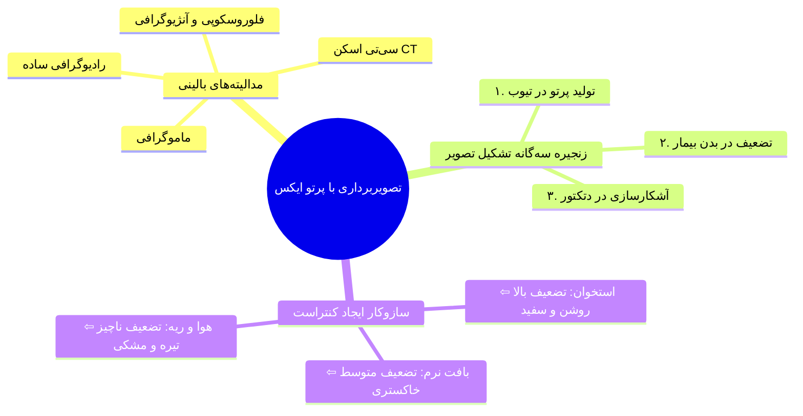
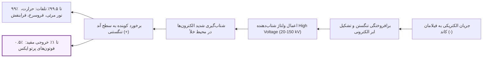
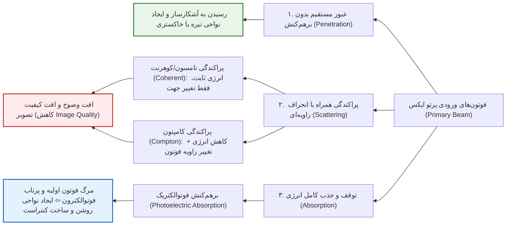
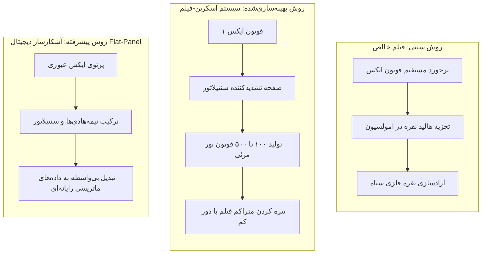

# رادیوگرافی - مقدمات تصویربرداری با پرتوی ایکس

## بخش ۱: آشنایی با تصویربرداری رادیولوژیک و زنجیره تشکیل تصویر

تصویربرداری رادیولوژیک یا *Radiological Medical Imaging* به تمامی تکنیک‌های تصویربرداری پزشکی گفته می‌شود که از تابش پرتوهای ایکس به عنوان منبع انرژی بهره می‌برند. ویژگی منحصربه‌فرد و بنیادین پرتو ایکس در مقایسه با نور مرئی، **قدرت نفوذ به بافت‌های کدر بدن** است؛ نوری که با عبور انتخابی از لایه‌های مختلف آناتومیک، اطلاعات ساختار داخلی بدن را آشکار کرده و به صورت یک تصویر بالینی (*Medical Image*) در اختیار تیم پزشکی قرار می‌دهد.

> [!definition] تصویربرداری رادیولوژیک (Radiological Imaging)
> شاخه‌ای از تصویربرداری تشخیصی پزشکی که با تاباندن فوتون‌های پرتو ایکس به بدن بیمار و ثبت نرخ عبور آن‌ها توسط گیرنده‌ها، ساختارهای آناتومیک درونی را بر پایه تفاوت تضعیف بافتی بازنمایی می‌کند.

دستگاه‌های بالینی متعددی بر پایه این سازوکار فیزیکی بنا شده‌اند که مهم‌ترین آن‌ها عبارتند از:

1. رادیوگرافی ساده و مرسوم (*Conventional Radiography*)

2. ماموگرافی (*Mammography*) برای بررسی تخصصی بافت پستان

3. فلوروسکوپی و آنژیوگرافی (*Fluoroscopy / Angiography*) جهت تصویربرداری دینامیک و عروقی

4. سی‌تی اسکن یا توموگرافی کامپیوتری (*Computed Tomography - CT*)

### زنجیره تشکیل تصویر (The Imaging Chain)

در تمامی سیستم‌های تصویربرداری بر پایه اشعه ایکس، یک زنجیره متوالی و سه‌مرحله‌ای حاکم است:

1. **تولید پرتو (X-ray Production):** گسیل فوتون‌های پرتو ایکس از منبع یا چشمه اختصاصی (*X-ray Source / Tube*).

2. **تضعیف پرتو (X-ray Attenuation):** عبور فوتون‌ها از میان بافت‌های بدن بیمار و تضعیف ناهمگن انرژی دسته پرتو بر اثر برهم‌کنش‌های اتمی.

3. **آشکارسازی پرتو (X-ray Detection):** اندازه‌گیری شدت و تعداد فوتون‌های خارج‌شده از بیمار توسط سنسور یا آشکارساز (*Detector*) و تبدیل آن به مقادیر مرئی روشنایی.

> [!tip] ریشه تشکیل کنتراست تصویر (Image Contrast)
> کنتراست یعنی تفاوت در رنگ و سایه‌های خاکستری تصویر. بافت‌هایی با تضعیف بسیار بالا نظیر **استخوان** مانع از عبور فوتون‌ها می‌شوند؛ بنابراین دتکتور اشعه کمتری دریافت کرده و تصویر طبق قرارداد به رنگ **سفید و کاملاً روشن** درمی‌آید. برعکس، در فضاهای حاوی گاز و هوا مانند **ریه** یا شکاف‌های شکستگی استخوان، کمترین میزان تضعیف رخ داده و حجم انبوهی از فوتون‌ها به دتکتور می‌رسند که نواحی **سیاه یا خاکستری تیره** را رقم می‌زنند. بافت نرم و چربی نیز طیف‌های بینابینی خاکستری را می‌سازند.

## بخش ۲: فیزیک تولید پرتو ایکس (X-ray Production)

پرتو ایکس زمانی تولید می‌شود که الکترون‌های بسیار پرانرژی با سرعت‌های نزدیک به سرعت نور به طور ناگهانی در برخورد با ماده متوقف شوند؛ در این لحظه طبق قوانین بقای انرژی، بخش اندکی از انرژی جنبشی الکترون‌ها به امواج الکترومغناطیسی با طول‌موج کوتاه یعنی فوتون پرتو ایکس تبدیل می‌گردد. برای اجرای این فرایند فیزیکی به **تیوب پرتو ایکس (X-ray Tube)** نیاز است.

> [!definition] تیوب پرتو ایکس (X-ray Tube)
> محفظه‌ای با **خلأ بسیار بالا** که کاتد گسیل‌کننده الکترون و آند هدف را در برابر یکدیگر نگه داشته و *شرایط شتاب‌گیری و برخورد ناگهانی الکترون‌ها* را فراهم می‌آورد.

سه عنصر ساختاری حیاتی در فرایند تولید پرتو عبارتند از:

1. **منبع الکترون آزاد (کاتد / فیلامان):** الکترون‌ها در حالت عادی محکم در پیوند اتم‌ها قرار دارند؛ برای آزادسازی آن‌ها از *رشته تنگستنی فیلامان* استفاده می‌شود که با عبور جریان الکتریکی داغ و برافروخته شده و اطراف آن ابری از الکترون‌های آزاد تحت عنوان **بار فضایی (Space Charge)** پدید می‌آید.

2. **سازوکار شتاب‌دهنده الکترون (ولتاژ بالای خارجی):** با برقراری اختلاف پتانسیل پرفشار بین کاتد منفی و آند مثبت (با ولتاژ اعمالی بین ۲۰,۰۰۰ تا ۱۵۰,۰۰۰ ولت معادل **۲۰ تا ۱۵۰ کیلوولت**)، الکترون‌ها از کاتد دفع و با شتاب خیره‌کننده به سمت آند جذب می‌شوند.

3. **هدف توقف ناگهانی (آند):** صفحه‌ای فلزی با **عدد اتمی بالا** (*غالباً فلز تنگستن*) که الکترون‌ها به سطح آن کوبیده شده و متوقف می‌گردند. محیط داخلی تیوب الزاماً تخلیه شده و **خلأ کامل** است تا الکترون‌ها حین شتاب‌گیری با مولکول‌های هوا برخورد نکنند.

> [!important] بازده بسیار پایین تیوب پرتو ایکس
> تیوب پرتو ایکس دستگاهی به شدت کم‌بازده است؛ حدود **۹۹٪ تا ۹۹.۵٪** از انرژی جنبشی الکترون‌های پرتابی صرف تولید **حرارت، پرتوهای فروسرخ، نور مرئی و ماورای بنفش** شده و تنها **۰.۵٪ تا ۱٪** آن تبدیل به پرتو ایکس مفید می‌گردد. استفاده از آند با عدد اتمی بالا نظیر تنگستن، بیشینه راندمان ممکن را مهیا می‌سازد.

### پارامترهای تنظیمی و مشخصه‌های دسته اشعه خروجی

اپراتور دستگاه رادیولوژی سه متغیر عملیاتی را مستقیماً تنظیم می‌کند:

* **ولتاژ تیوب (*Tube Voltage* بر حسب kV یا kVp):** اختلاف پتانسیل اعمال‌شده میان آند و کاتد (محدوده تشخیصی بین ۲۰ تا ۱۵۰ کیلوولت).

* **جریان تیوب (*Tube Current* بر حسب mA):** نرخ عبور الکترون‌ها در واحد زمان از کاتد به آند که با *شدت دمای فیلامان* تنظیم می‌شود.

* **زمان پرتودهی (*Exposure Time* بر حسب s):** مدت زمان روشن بودن تیوب در طول تصویربرداری.

* حاصل‌ضرب جریان در زمان پرتودهی را کمیت کلیدی **mAs** می‌نامند.

این متغیرها سه ویژگی فیزیکی پرتوی تابشی خروجی را معین می‌کنند:

| ویژگی دسته پرتو        | معادل مفهومی فیزیکی                                    | رابطه تناسبی با پارامترهای تنظیمی دستگاه                                                                                                     | نقش بالینی در تصویربرداری                                                  |
| ---------------------- | ------------------------------------------------------ | -------------------------------------------------------------------------------------------------------------------------------------------- | -------------------------------------------------------------------------- |
| **کمیت (Quantity)**    | تعداد کل فوتون‌ها یا شدت تابش (*Intensity*)            | متناسب با توان دوم ولتاژ، توان اول جریان و زمان، و عدد اتمی آند: $\text{Quantity} \propto (\text{kVp})^2 \times \text{mA} \times s \times Z$ | رساندن شار فوتونی کافی به فیلم جهت جلوگیری از کم‌نور شدن کلینیکی تصویر     |
| **کیفیت (Quality)**    | انرژی فوتون‌ها و قدرت نفوذ پرتو (*Penetrability*)      | مستقیماً متناسب با توان اول ولتاژ تیوب ($\text{kVp}$) و فیلتراسیون دهانه                                                                     | امکان نفوذ اشعه به بافت‌های ضخیم و سخت بدون توقف کامل در لایه‌های سطحی     |
| **پرتودهی (Exposure)** | جریان انرژی تابشی (شار انرژی بر واحد سطح در واحد زمان) | ترکیب هم‌زمان کمیت و کیفیت؛ به شدت متأثر از ولتاژ ($\text{kVp}$) و $\text{mAs}$                                                              | معیار انتقال انرژی تابشی به محیط هدف و پارامتر تعیین‌کننده دوز و کیفیت کلی |

> [!tip] فیلتراسیون تیوب (Tube Filtration) و حفاظت پرتوی
> در دهانه خروجی تیوب همواره یک **تیغه نازک فلزی**، برای نمونه *ورقی آلومینیومی با ضخامت ۲ میلی‌متر* (2mm Al) تعبیه می‌شود. این فیلتر، *فوتون‌های با انرژی فوق‌العاده پایین را جذب و حذف می‌نماید*؛ زیرا این پرتوهای کم‌رمق توانایی عبور از ضخامت بدن بیمار را نداشته، در پوست جذب شده و **صرفاً دوز جذبی و خطر پرتوگیری بیمار را بالا می‌برند** بدون آن‌که کوچک‌ترین نقشی در تشکیل تصویر ایفا کنند.

## بخش ۳: فیزیک تضعیف و برهم‌کنش‌های پرتو ایکس با ماده (X-ray Attenuation)

فوتون‌های حاصل از پرتو ایکس ذرات بی‌نهایت ریزی هستند که مرتبه ابعاد آن‌ها حتی از ابعاد ساختار اتم‌ها نیز کوچک‌تر است. از منظر یک فوتون عبوری، بافت‌های بدن انسان عمدتاً متشکل از فضاهای خالی پهناور میان اتم‌ها، هسته‌ها و الکترون‌هاست.

> [!definition] تضعیف پرتو ایکس (Attenuation)
> حذف و کاهش شدت فوتون‌ها از دسته پرتو اولیه در اثر برهم‌کنش‌های دوگانه *«جذب کامل»* و *«پراکندگی»* در حین عبور از محیط مادی.

هنگامی که پرتوی ورودی با ضخامتی از بافت برخورد می‌کند، سرنوشت فوتون‌ها به یکی از سه مسیر زیر ختم می‌گردد:

### بررسی سه‌گانه برهم‌کنش‌های اتمی پرتو ایکس

تضعیف کلی اشعه حاصل مجموع سه برهم‌کنش است:

| نوع برهم‌کنش                           | الکترون درگیر در اتم                                    | تغییرات انرژی و جهت فوتون فرودی                                                           | وابستگی به انرژی و عدد اتمی ($Z$)                                                    | پیامد بالینی در تصویربرداری                                   |
| -------------------------------------- | ------------------------------------------------------- | ----------------------------------------------------------------------------------------- | ------------------------------------------------------------------------------------ | ------------------------------------------------------------- |
| **جذب فوتوالکتریک (Photoelectric)**    | الکترون‌های مدارهای **داخلی** و به شدت *وابسته به هسته* | **فوتون اولیه به طور کامل نابود شده** و مازاد انرژی به شکل فوتوالکترون پرتاب می‌شود.      | معکوس با مکعب انرژی ($1/E^3$)؛ مستقیم با مکعب عدد اتمی ($Z^3$) و چگالی ماده ($d$) | **عامل اصلی ساخت کنتراست تصویر** و تفکیک بافت نرم از استخوان  |
| **پراکندگی کامپتون (Compton)**         | الکترون‌های مدارهای **بیرونی** و دور با *پیوند ضعیف*    | بخشی از انرژی به الکترون منتقل شده و **فوتون پراکنده با زاویه و انرژی کمتر** خارج می‌شود. | *با افزایش انرژی* نسبت به فوتوالکتریک غالب می‌شود؛ وابستگی اندک به $Z$            | تولید اطلاعات مخدوش در آشکارساز و **کاهش کیفیت و وضوح تصویر** |
| **پراکندگی کوهرنت / رایلی (Coherent)** | *کل مجموعه بار الکتریکی اتم*                            | **بدون هیچ‌گونه تغییر در انرژی فوتون**؛ تنها زاویه فوتون منحرف می‌گردد.                   | احتمال وقوع ناچیز در پرتوهای تشخیصی؛ *در انرژی‌های خیلی پایین*                    | انحراف فوتون‌ها و **تخریب نسبی کنتراست و کیفیت تصویر**        |

> [!important] یکای انرژی الکترون‌ولت (Electron Volt)
> در فیزیک اتمی و رادیولوژی به جای ژول از یکای بسیار کوچک‌تر الکترون‌ولت (eV) استفاده می‌شود؛ به طوری که $1\text{ eV} = 1.6 \times 10^{-19}\text{ J}$ است. فوتون‌های پرتو ایکس تشخیصی معمولاً در بازه کیلوالکترون‌ولت (keV) قرار دارند (برای مثال ۱۰۰ کیلوالکترون‌ولت برابر با ۱۰۰,۰۰۰ الکترون‌ولت است).

> [!important] ترازنامه انرژی در پدیده فوتوالکتریک
> اگر یک فوتون با انرژی 100 keV با الکترون داخلی اتمی که انرژی بستگی آن 33 keV است برخورد کند، فوتون به کل نیست و نابود می‌شود. ۳۳ کیلوالکترون‌ولت صرف کندن پیوند الکترون شده و باقیمانده انرژی یعنی $100 - 33 = 67\text{ keV}$ صرف انرژی جنبشی پرتاب فوتوالکترون (*Photoelectron*) به بیرون از اتم خواهد شد.

> [!tip] نکته طلایی امتحانی: حساسیت مکعبی فوتوالکتریک
> پدیده فوتوالکتریک مستقیماً متناسب با نسبت $Z^3 / E^3$ است:
>
> 1. اگر انرژی دسته فوتون‌ها **۳ برابر** شود، احتمال وقوع فوتوالکتریک $3^3 = 27$ **برابر افت می‌کند**.
>
> 2. اگر عدد اتمی بافت مورد تابش **۲ برابر** شود، احتمال جذب فوتوالکتریک $2^3 = 8$ **برابر جهش می‌یابد**.
>
>    به دلیل همین وابستگی شدید به عدد اتمی ($Z^3$) است که استخوان به وضوح تمام از بافت نرم (نظیر عضله، چربی و پوست) متمایز گشته و سایه‌ای شفاف و سفید روی تصویر می‌اندازد.

## بخش ۴: روابط ریاضی تضعیف خطی و قانون بیر-لمبرت

معیار ریاضی تمایل یک ماده به حذف فوتون‌های پرتو ایکس، **ضریب تضعیف خطی (*Linear Attenuation Coefficient*)** نامیده شده و با نماد یونانی میو ($\mu$) بیان می‌گردد. ضریب تضعیف خطی کل هر محیط مادی، حاصل جمع تک‌تک ضرایب اختصاصی سه برهم‌کنش فوق است:

$$
\mu_{\text{total}} = \mu_{\text{photoelectric}} + \mu_{\text{compton}} + \mu_{\text{coherent}}
$$

قانون بنیادی **بیر-لمبرت (*Beer-Lambert Equation*)** نرخ افت تعداد فوتون‌های عبوری تک‌انرژی را در هنگام گذر از ضخامت یکنواخت $x$ محاسبه می‌کند:

$$
N = N_0 \, e^{-\mu x}
$$

که در آن:

* $N_0$: تعداد فوتون‌های پرتو اولیه فرودی

* $N$: تعداد فوتون‌های عبورکرده و جذب‌نشده

* $e$: عدد نپر (پایه لگاریتم طبیعی $\approx 2.718$)

* $\mu$: ضریب تضعیف خطی کل ماده در انرژی معین (بر حسب $\text{cm}^{-1}$)

* $x$: ضخامت بافت (بر حسب $\text{cm}$)

چنانچه پرتو ناگزیر باشد از لایه‌های آناتومیک متوالی و ناهمگن با بافت‌ها و ضخامت‌های گوناگون (مانند پوست، چربی، عضله و استخوان) گذر کند، معادله به شکل مجموع چندلایه بازنویسی می‌شود:

$$
N = N_0 \, e^{-(\mu_1 x_1 + \mu_2 x_2 + \mu_3 x_3 + \dots + \mu_n x_n)} = N_0 \, e^{-\sum_{i=1}^{n} \mu_i x_i}
$$

### تحلیل مسئله محاسباتی و داده‌های تجربی (پرتو 100 keV)

جدول زیر سهم هر برهم‌کنش را در بافت نرم و استخوان برای فوتون‌های با انرژی 100 keV نشان می‌دهد:

| پارامتر فیزیکی                               | بافت نرم بدن (*Soft Tissue*)           | بافت استخوانی (*Bone*)                    | تفسیر پدیده‌ها                                            |
| -------------------------------------------- | -------------------------------------- | ----------------------------------------- | --------------------------------------------------------- |
| $\mu_{\text{photoelectric}}$                 | $0.0028\text{ cm}^{-1}$                | بزرگ‌تر از بافت نرم                       | در استخوان به علت $Z$ بالاتر، سهم فوتوالکتریک بارزتر است. |
| $\mu_{\text{compton}}$                       | $0.1620\text{ cm}^{-1}$                | بخش عمده ضریب استخوان                     | در انرژی بالای 100 keV کامپتون در هر دو بافت غالب است.    |
| $\mu_{\text{coherent}}$                      | $0.0053\text{ cm}^{-1}$                | ناچیز                                     | سهم همواره بسیار پایینی دارد.                             |
| **ضریب تضعیف کل (**$\mu_{\text{total}}$**)** | $0.1701\text{ cm}^{-1}$                | $0.1860\text{ cm}^{-1}$                   | ضریب استخوان به دلیل چگالی و عدد اتمی بیشتر بالاتر است.   |
| **درصد سهم احتمالات**                        | فوتوالکتریک ۲٪، کامپتون ۹۵٪، کوهرنت ۳٪ | افزایش سهم فوتوالکتریک و کاهش سهم کامپتون | جمع کل احتمالات وقوع برهم‌کنش همواره ۱۰۰٪ است.            |

> [!tip] بررسی عددی عبور پرتو از ضخامت ۱ سانتی‌متر
> فرض کنید $N_0 = 1000$ فوتون با انرژی 100 keV به ضخامت $x = 1\text{ cm}$ از دو بافت نرم و استخوان تابانده شود:
>
> * **بافت نرم:** $N = 1000 \times e^{-0.1701 \times 1} \approx 843$ فوتون عبور می‌کنند.
>
> * **استخوان:** $N = 1000 \times e^{-0.1860 \times 1} \approx 830$ فوتون عبور می‌کنند.
>
>   همین تفاضل کوچک ۱۳ فوتونی در ضخامت یک سانتی‌متری، مبنای تمایز سایه‌ها در سنسور و شکل‌گیری کنتراست تشخیصی است! اگر انرژی فوتون‌ها از 100 keV به مقادیر پایینی چون 20 keV کاهش یابد، جهش فوق‌العاده‌ای در ضریب فوتوالکتریک رخ داده و کنتراست بافتی به مراتب پررنگ‌تر خواهد شد.

## بخش ۵: آشکارسازی پرتو ایکس و تکنولوژی سنسورها (X-ray Detection)

پرتوهای ایکس با چشم غیرمسلح در فضا دیده نمی‌شوند. حسگر یا دتکتور موظف است میزان شار و تضعیف فوتون‌های خروجی را بسنجد و سایه پنهان پرتو را به تصویری بصری یا فایلی عددی ترجمه نماید.

### ۱. فیلم رادیولوژی ساده (*Radiographic Film*)

ساختار آن متشکل از یک لایه پایه پلاستیکی کاملاً شفاف (*Transparent Plastic Substrate*) است که روی یک یا دو سطح آن با لایه‌ای از **امولسیون حساس به نور و اشعه** پوشانده شده است. درون این امولسیون بلورهای **هالیدهای نقره (Silver Halides)** تعبیه گردیده‌اند.

* **مکانیسم سیاه‌شدگی:** با برخورد فوتون پرتو ایکس یا نور، پیوند هالید گسسته شده و **اتم‌های نقره آزاد فلزی** که رنگی سیاه دارند بر جای می‌مانند.

* در مناطقی که فوتون فراوانی به فیلم می‌رسد (نواحی بافت نرم یا هوای آزاد)، حجم عظیمی از نقره آزاد تشکیل شده و فیلم **کاملاً تیره و سیاه** می‌شود. در نقاط استخوانی به سبب تضعیف بالا، فوتون ناچیزی به لایه رسیده، نقره آزاد نشده و فیلم به حالت **شفاف، بیرنگ و سفید** باقی می‌ماند.

### ۲. سیستم فیلم و صفحه تشدیدکننده (*Screen-Film System*)

به دلیل ضخامت بسیار کم امولسیون، استفاده از فیلم خالص بازدهی کوانتومی اسفباری داشته و نیازمند تابش دوزهای فوق‌العاده پرخطر به بیمار است. برای حل این معضل، فیلم در میان دو صفحه تقویت‌کننده به نام **صفحات تشدیدکننده (Intensifying Screen)** احاطه می‌شود.

* صفحات تشدیدکننده از موادی فیزیکی با خاصیت درخشش نوری موسوم به **سنتیلاتور (Scintillator) یا کریستال‌های سوسوزن** ساخته شده‌اند.

* **ضریب تکثیر نوری:** با اصابت تنها **۱ فوتون پرتو ایکس** به این کریستال‌ها، دسته‌ای متراکم حاوی **۱۰۰ تا ۵۰۰ فوتون نور مرئی** گسیل می‌شود!

* از آن‌جا که فیلم حساسیت بالایی به نور مرئی دارد، تصویر با تعداد به مراتب کمتری از فوتون‌های پرتو ایکس شکل گرفته و **دوز دریافتی بیمار به شدت کاهش می‌یابد**.

### ۳. دتکتورهای مدرن دیجیتال (*Digital Detectors*)

در این نسل پردازشی نوین، فیلم شیمیایی و فرایندهای ظهور تاریک‌خانه‌ای به طور کامل منسوخ گردیده‌اند؛ به جای آن از سنسورهای دیجیتال صفحه‌تخت (*Flat Panel Detectors*) ساخته‌شده از تلفیق پیشرفته **مواد نیمه‌هادی و لایه‌های سنتیلاتور** استفاده می‌شود. این حسگرها انرژی پرتوها را بلادرنگ به سیگنال‌های الکتریکی و سپس داده‌های دیجیتال رایانه‌ای تبدیل می‌کنند که مستقیماً در مانیتورها قابل ذخیره‌سازی، تنظیم کنتراست و انتقال شبکه‌ای هستند.

## جمع‌بندی نکات کلیدی و مرور سریع

> [!important\] چک‌لیست مرور سریع شب امتحان
>
> 1. **زنجیره سه‌مرحله‌ای:** منبع تیوب پرتو (تولید) ⇦ بیمار (تضعیف ناهمگن) ⇦ آشکارساز (ثبت و نمایش تصویر).
>
> 2. **تولید پرتو در تیوب:** حاصل برخورد کوبنده الکترون‌های شتاب‌گرفته از کاتد گرم منفی به آند تنگستنی مثبت در خلأ کامل. بازده فوق‌العاده کم (تنها ۰.۵٪ تا ۱٪ اشعه ایکس و ۹۹٪ تا ۹۹.۵٪ اتلاف به صورت حرارت و نور مرئی/UV/فروسرخ).
>
> 3. **فیلتر آلومینیومی:** تعبیه ۲ میلی‌متر آلومینیوم در پنجره تیوب جهت تصفیه فوتون‌های کم‌انرژی بی‌فایده و پایین آوردن دوز جذبی پوست بیمار.
>
> 4. **متغیرهای تابش:**
>
>    * کمیت ($\text{Quantity}$) متناسب با $(\text{kVp})^2 \times \text{mA} \times s \times Z$
>
>    * کیفیت و نفوذ ($\text{Quality}$) متناسب با توان اول کیلوولت تیوب ($\text{kVp}$)
>
> 5. **سرنوشت فوتون‌ها در بافت:**
>
>    * عبور بدون برهم‌کنش (ایجاد تیرگی پس‌زمینه)
>
>    * جذب فوتوالکتریک (عامل اساسی کنتراست، متناسب با $Z^3 / E^3$، جذب تام انرژی)
>
>    * پراکندگی کامپتون (کاهش انرژی و انحراف، مسبب افت کیفیت و وضوح)
>
>    * پراکندگی کوهرنت (حفظ انرژی اولیه با انحراف زاویه، احتمال ناچیز)
>
> 6. **پدیده روشنایی تصویر:** استخوان به دلیل $Z$ بالاتر و چگالی بیشتر فوتوالکتریک بالایی داشته و پرتو را به شدت تضعیف می‌کند؛ در نتیجه فیلم در آن موضع نور ندیده و **سفید** می‌ماند. ریه و گاز تضعیف اندک داشته و تصویر آن **سیاه** می‌شود.
>
> 7. **صفحات تقویت‌کننده (Screen):** استفاده از سنتیلاتورها برای تبدیل ۱ فوتون اشعه ایکس به ۱۰۰ تا ۵۰۰ فوتون نور مرئی به منظور ارتقای ثبت تصویر و تقلیل بارز پرتوگیری بیمار.

