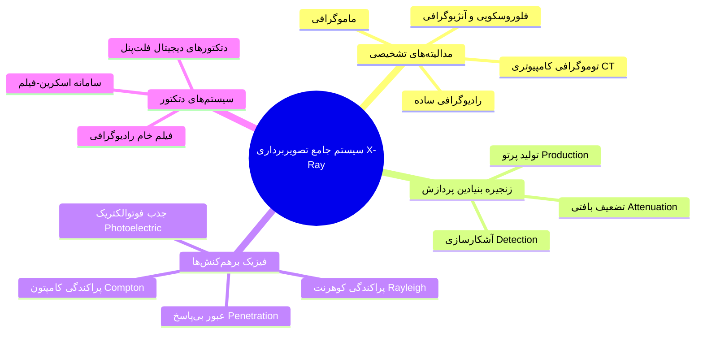
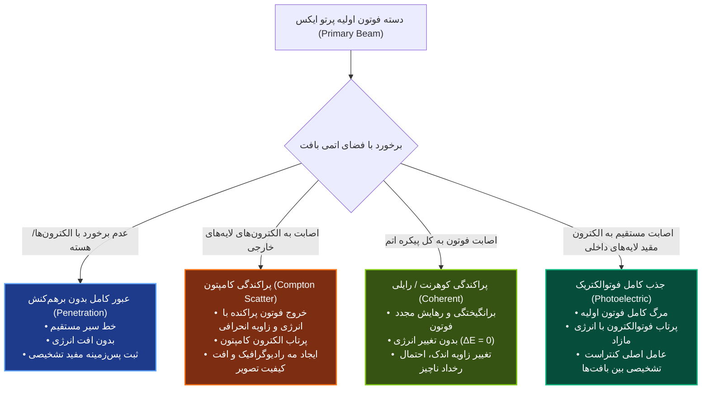
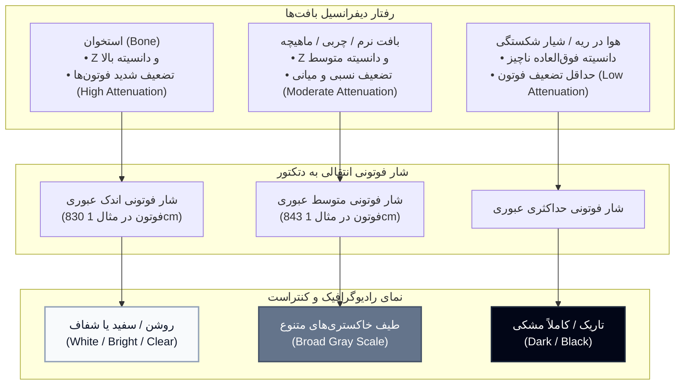

# رادیوگرافی - مقدمات تصویربرداری با پرتوی ایکس

> [!definition] تصویربرداری رادیولوژیک پزشکی (Radiological Medical Imaging)
> چتر واژگانی جامع برای تمامی روش‌های تصویربرداری تشخیصی مبتنی بر به‌کارگیری فوتون‌های پرتو ایکس نظیر رادیوگرافی استاندارد، ماموگرافی، فلوروسکوپی/آنژیوگرافی و توموگرافی کامپیوتری (CT). وجه تمایز بنیادین پرتو ایکس با طیف نور مرئی، توانایی نفوذ عمقی در بافت‌های زیستی، جذب دیفرانسیل و استخراج داده‌های تشخیصی ساختار درونی ارگان‌ها جهت ثبت تصویر پزشکی (Medical Image) است.

---

## ۱. زنجیره بنیادین تصویربرداری رادیولوژیک

فرایند انتقال اطلاعات تشخیصی از چشمه تا پردازشگر نهایی در قالب چرخه‌ای پیوسته با سه فاز متوالی رخ می‌دهد:
1. **تولید پرتو (X-ray Production):** تبدیل کنترل‌شده انرژی پتانسیل الکتریکی به فوتون‌های الکترومغناطیسی پرانرژی درون چشمه تابش (X-ray Source / Tube).
2. **تضعیف درون‌بافتی (X-ray Attenuation):** برخورد دسته اشعه اولیه (Primary Beam) به پیکره بیمار، تجربه جذب و پراکندگی غیریکسان بر مبنای ضخامت، دانسیته و عدد اتمی لایه‌های کالبدی.
3. **آشکارسازی و ثبت تصویر (X-ray Detection):** سنجش شار کوانتومی فوتون‌های انتقالیِ خروجی از بدن بیمار توسط سنسور/دتکتور حساس به اشعه و ترجمه داده‌های تضعیف به سطوح روشنایی و کنتراست.

---

## ۲. مکانیسم فیزیکی و ادوات تولید پرتو ایکس (X-ray Production)

### ارکان سه‌گانه و ساختمان داخلی تیوب (X-ray Tube)
تولید اشعه ایکس بر فرایند *کاهش شتاب آنی ذرات باردار پرسرعت* و تبدیل انرژی جنبشی آن‌ها به تابش الکترومغناطیسی استوار است. تحقق این واکنش مستلزم سه مؤلفه ساختاری هم‌گام درون یک محفظه مسدود است:
1. **چشمه گسیلنده الکترون آزاد (کاتود - Cathode):** رشته فیلامانی از جنس *تنگستن* (Tungsten). عبور جریان الکتریکی بالا منجر به داغ شدن فیلامان، التهاب شدید و رهایش دریایی از الکترون‌های آزاد در فضای پیرامونی می‌گردد که اصطلاحاً پدیده *بار فضایی (Space Charge)* یا ابر الکترونی خوانده می‌شود. قطب کاتود دارای پتانسیل الکتریکی منفی است.
2. **شتاب‌دهنده الکترونی (گرادیان پتانسیل کاتود-آنود):** برقراری ولتاژ خارجی بسیار بالا (High Voltage - HV) مابین قطب منفی (کاتود) و قطب مثبت (آنود). دافعه قطب منفی و جاذبه بار مثبت، الکترون‌های بار فضایی را وادار به جهش و شتاب‌گیری بالستیک با سرعتی نزدیک به *سرعت نور* در راستای آند می‌کند. دامنه ولتاژ عملیاتی در رادیولوژی تشخیصی بین **20,000 تا 150,000 ولت (20 تا 150 کیلوولت / kV)** متغیر است.
3. **هدف ایستاننده ناگهانی (آنود - Anode):** دیسک هدف با بار مثبت الکتریکی، ساخته‌شده از فلزات با *عدد اتمی بالا (High Z)* نظیر تنگستن جهت ارتقای راندمان برخوردهای فیزیکی. توقف فوق‌العاده سریع و ضربه‌ای الکترون‌های پرانرژی روی سطح هدف، موجب استحاله انرژی جنبشی آن‌ها به پرتو ایکس می‌شود.
4. **محفظه خلأ فراگیر (Vacuum Tube Enclosure):** کاتود و آنود درون محفظه شیشه‌ای/فلزی با تخلیه حداکثری هوا تعبیه شده‌اند؛ وجود خلأ مطلق مانع از اتلاف انرژی و تصادم مزاحم الکترون‌ها با مولکول‌های هوا در طول مسیر پرتاب می‌گردد. پرتوهای مفید نهایتاً از پنجره خروجی تیوپ به بیرون هدایت می‌شوند.

> [!important] راندمان ترمودینامیکی و اتلاف انرژی در تیوب پرتو ایکس
> راندمان تولید پرتو ایکس در تارگت‌های رادیولوژی تشخیصی *بسیار نازل* است: حدود **99% تا 99.5%** از کل انرژی جنبشی الکترون‌های پرتابی حین برخورد با تارگت تنگستن مستقیماً به *گرما (حرارت شدید)* و طیف‌های ناخواسته نوری نظیر *فروسرخ (Infrared)، نور مرئی و فرابنفش (Ultraviolet)* بدل می‌گردد. صرفاً سهم ناچیز **0.5% تا 1%** از این انرژی جنبشی به *پرتوی مفید ایکس* تبدیل خواهد شد.

### فاکتورهای تنظیمی تکنسین و مشخصه‌های سه‌گانه دسته اشعه

| متغیر تنظیمی اپراتور | واحد اندازه‌گیری | مشخصه متناظر پرتو | رابطه ریاضی تناسب | اثر فیزیکی و بالینی |
| :--- | :--- | :--- | :--- | :--- |
| **ولتاژ تیوب (Tube Voltage - kV/kVp)** | کیلوولت (kV) | **کمیت (Quantity) و کیفیت (Quality)** | Quantity ∝ (kV)²   Quality ∝ (kV)¹ | ارتقای ولتاژ موجب افزایش ۲ برابری نفوذپذیری و افزایش ۴ برابری تعداد کل فوتون‌ها می‌شود. |
| **جریان تیوب (Tube Current - mA)** | میلی‌آمپر (mA) | **کمیت فوتون‌ها (Quantity / Intensity)** | Quantity ∝ (mA)¹ | تعیین‌کننده آهنگ خروج الکترون از فیلامان در واحد زمان؛ بدون اثر بر انرژی تک‌تک فوتون‌ها. |
| **زمان پرتودهی (Exposure Time - s)** | ثانیه (s) | **کمیت فوتون‌ها (Quantity / Intensity)** | Quantity ∝ (s)¹ | مدت‌زمان پایداری تابش؛ ضرب آن در جریان، پارامتر **mAs** (میلی‌آمپر-ثانیه) را می‌سازد. |
| **عدد اتمی تارگت (Target Z)** | فاقد بعد (Z) | **کمیت فوتون‌ها (Quantity)** | Quantity ∝ Z_target | ویژگی ساختاری تارگت تنگستنی؛ تحت کنترل اپراتور در حین تصویربرداری نبوده و ثابت است. |

> [!definition] تمایز مفاهیم کمیت، کیفیت و اکسپوژر
> - **کمیت پرتو (Quantity / Intensity):** معرف کل فوتون‌های موجود در دسته اشعه که با ضرب **mAs** و توان دوم ولتاژ **(kV)²** همبستگی مستقیم دارد. دو برابر شدن زمان یا جریان، کمیت را دقیقاً دو برابر و دو برابر شدن ولتاژ، کمیت را ۴ برابر می‌کند.
> - **کیفیت پرتو (Quality / Penetrating Power):** شاخص انرژی مؤثر و توان نفوذ پرتو در لایه‌های عمقی بافت بدون جذب زودهنگام؛ مستقیماً تابع توان اول ولتاژ اعمالی **(kV)** و فیلتراسیون تیوپ است.
> - **اکسپوژر / پرتودهی (Exposure):** فلکس یا جریان انرژی؛ محصول برهم‌افزای کمیت و کیفیت (تعداد فوتون × سطح انرژی فوتون) عبوری از واحد سطح در واحد زمان.

> [!important] فلسفه بیوفیزیکی تعبیه فیلتراسیون تیوپ (Tube Filtration)
> در دهانه خروجی تیوپ، یک ورقه فیلتر فلزی از جنس آلومینیوم (مانند **2 میلی‌متر آلومینیوم**) کار گذاشته می‌شود. فوتون‌های کم‌انرژی («نرم») به‌دلیل برد ضعیف، توان عبور از عمق پیکره و رسیدن به دتکتور را ندارند؛ این فوتون‌ها صرفاً در لایه‌های سطحی و پوست بیمار جذب شده و دوز جذبی بیولوژیک و خطرات پرتودهی را بدون کوچک‌ترین سهمی در تشکیل تصویر بالا می‌برند. ورقه آلومینیومی این طیف غیرمفید کم‌انرژی را حذف و *میانگین کیفیت (انرژی مؤثر)* پرتو عبوری را ارتقا می‌دهد.

---

## ۳. فیزیک برهم‌کنش پرتو با ماده و مکانیسم‌های تضعیف (Attenuation)

ابعاد کوانتومی فوتون پرتو ایکس در مقایسه با ابعاد هسته و فواصل اوربیتال‌های الکترونی بسیار ناچیز است؛ فلذا اتم‌های بیولوژیک بخش اعظم حجم خود را به‌صورت فضای خالی در برابر فوتون عابر نمایان می‌سازند. بر این مبنا، فوتون‌ها در مواجهه با ارگانیسم انسانی به سه شیوه سرنوشت‌ساز عمل می‌کنند:

### تحلیل تفصیلی برهم‌کنش‌های سه‌گانه

#### ۱. جذب فوتوالکتریک (Photoelectric Absorption)
حادثه‌ای کوانتومی که طی آن فوتون فرودی با الکترون‌های مقید لایه‌های درونی اتم (نزدیک هسته با بار مثبت قوی و انرژی بستگی بالا) شاخ‌به‌شاخ تصادم کرده و کل انرژی خود را به آن می‌سپارد؛ بدین‌ترتیب *عمر فوتون خاتمه یافته و جذب کامل صورت می‌پذیرد*. بخشی از انرژی فوتون صرف فائق آمدن بر انرژی بستگی (Binding Energy) الکترون شده و باقیمانده، به صورت انرژی جنبشی به الکترون کنده شده که اکنون **فوتوالکترون (Photoelectron)** نامیده می‌شود، منتقل می‌گردد.
- *محاسبه بقای انرژی طبق مثال منبع:*
  $$E_{kinetic} = E_{photon} - E_{binding}$$
  با ورود فوتون اولیه **100 keV** و برخورد به مداری با انرژی بستگی **33 keV**:
  انرژی مازاد پرتاب فوتوالکترون = 100 - 33 = **67 keV**.
- *واحدهای انرژی در فیزیک پرتو:* ژول (J) واحد کلاسیک انرژی است اما برای مقیاس‌های ذرات باردار، الکترون‌ولت (eV) کاربرد دارد:
  **1 eV = 1.6 × 10⁻¹⁹ J**؛ بنابراین 100 keV معادل 100,000 الکترون‌ولت است.

> [!important] قانون تناسبات بنیادین فوتوالکتریک (تله پرتکرار امتحانی)
> احتمال رخداد جذب فوتوالکتریک مستقیماً با **توان سوم عدد اتمی بافت (Z³)** و **چگالی جرمی** رابطه مستقیم داشته و با **توان سوم انرژی فوتون (E³)** رابطه معکوس دارد:
> $$\text{Probability of PE} \propto \frac{Z^3}{E^3}$$
> - *اثر انرژی:* ۳ برابر شدن انرژی فوتون فرودی، احتمال رخداد فوتوالکتریک را به میزان **27 برابر (3³)** سرکوب می‌نماید.
> - *اثر جنس بافت:* ۲ برابر شدن عدد اتمی بافت، احتمال این برهم‌کنش را **8 برابر (2³)** ارتقا می‌بخشد. به دلیل بالاتر بودن خیره‌کننده Z استخوان نسبت به بافت نرم، تمایز بافتی فوق‌العاده در عکس شکل می‌گیرد.

#### ۲. پراکندگی کامپتون (Compton Scattering)
اصابت فوتون پرتو ایکس به الکترون‌های سست اوربیتال‌های محیطی (دور از هسته با انرژی بستگی اندک). کسری از انرژی فوتون صرف یونیزاسیون و گسیل این الکترون شده و باقیمانده فوتون اولیه با *انرژی کاسته‌شده* و *راستای منحرف‌شده* تحت نام **فوتون پراکنده (Scattered Photon)** به جهات گوناگون (روبه‌جلو، پهلوها، بازگشت به عقب یا بازجذب در بافت) گسیل می‌گردد.
- *اثر بر تصویر:* تخریب وضوح و کاهش شدید کیفیت تصویر (Image Quality Degradation) از طریق تزریق فوتون‌های حاوی اطلاعات مکانی غلط به آشکارساز.

#### ۳. پراکندگی همدوس / رایلی (Coherent / Rayleigh Scattering)
پدیده‌ای با احتمال وقوع بسیار نازل که در آن فوتون فرودی کل ساختار اتم را به ارتعاش و برانگیختگی می‌کشاند. حین بازگشت اتم به تراز پایه، فوتونی با **انرژی کاملاً یکسان با فوتون فرودی (ΔE = 0)** اما در زاویه‌ای دچار تغییر جهت بازتاب می‌گردد. مشارکت آن در تضعیف کلی اندک بوده اما در افت وضوح تشخیصی نقش سوء دارد.

| شاخص مقایسه‌ای | جذب فوتوالکتریک (Photoelectric) | پراکندگی کامپتون (Compton) | پراکندگی کوهرنت / رایلی (Coherent) |
| :--- | :--- | :--- | :--- |
| **ناحیه برهم‌کنش اتمی** | الکترون‌های عمیق لایه‌های داخلی | الکترون‌های سست لایه‌های خارجی | کل ساختار اتم |
| **سرنوشت انرژی فوتون** | جذب کامل و نابودی (انتقال 100% انرژی) | افت نسبی انرژی فوتون اولیه | **بدون تغییر انرژی (انرژی اولیه = انرژی نهایی)** |
| **انحراف راستای فوتون** | فوتونی باقی نمی‌ماند | انحراف جهتی در تمامی زوایا | انحراف جهت جزئی بدون افت انرژی |
| **محصول ذره‌ای آزادشده** | فوتوالکترون پرسرعت | الکترون کامپتون و فوتون پراکنده | فاقد پرتاب الکترون ثانویه |
| **نقش در فرایند تصویربرداری** | **عامل اصلی ایجاد کنتراست تشخیصی** | تضعیف دسته اشعه اما **عامل افت کیفیت تصویر** | تضعیف بسیار جزئی اما **کاهش کیفیت تصویر** |
| **همبستگی با انرژی پرتو** | افت شدید با توان سوم انرژی (معکوس با E³) | با فوتون‌های با انرژی بالاتر غالب‌تر است | صرفاً در فوتون‌های انرژی پایین محدود است |
| **همبستگی با عدد اتمی بافت** | افزایش شدید با توان سوم عدد اتمی (Z³) | تقریباً ناوابسته به Z (وابسته به دانسیته الکترونی) | وابسته به اندازه اتم اما در مقیاس بالینی بسیار کم |

---

## ۴. مدلسازی ریاضی تضعیف بافتی و تشکیل کنتراست رادیوگرافیک

> [!definition] تضعیف (Attenuation) و ضریب تضعیف خطی (μ)
> تضعیف یعنی حذف فیزیکی فوتون‌ها از دسته پرتو اولیه حین نفوذ در ماده، حاصل جمع جبری جذب کامل (فوتوالکتریک) و اتلاف حاصل از تغییر مسیرها (پراکندگی کامپتون و کوهرنت).
> ضریب تضعیف خطی (Linear Attenuation Coefficient - μ) شاخص احتمال حذف باریکه در واحد ضخامت از ماده با واحد معکوس طول (cm⁻¹) است و به‌صورت مجموع ضرایب تک‌تک برهم‌کنش‌ها تعریف می‌شود:
> $$\mu_{total} = \mu_{photoelectric} + \mu_{compton} + \mu_{coherent}$$

### فرمولاسیون معادله بیر-لمبرت (Beer-Lambert Equation)

1. **مدل همگن تک‌لایه‌ای:**
   تعداد فوتون‌های تک‌انرژی عبوری از بافتی معین با ضریب تضعیف خطی μ و ضخامت یکنواخت x:
   $$N = N_0 \times e^{-\mu x}$$
   - **N₀:** تعداد فوتون‌های اولیه تابیده‌شده.
   - **N:** تعداد فوتون‌های عبورکرده و ثبت‌شده در دتکتور.
   - **e:** پایه لگاریتم طبیعی یا عدد نپر (تقریباً معادل **2.7**).
   - **μ:** ضریب تضعیف خطی ویژه بافت هدف (cm⁻¹).
   - **x:** ضخامت بافت بر حسب سانتی‌متر (cm).

2. **مدل واقع‌گرایانه چندلایه‌ای بافت‌های ناهمگن بیولوژیک (بدن انسان):**
   پرتو در مسیر آناتومیک به‌ترتیب از لایه‌های متمایز پوست، چربی زیرپوستی، فیبر عضلانی و اسکلت استخوانی می‌گذرد؛ بنابراین توان ضریب جذب به‌صورت سیگمای مجموع عبارات تضعیف هر لایه اعمال می‌شود:
   $$N = N_0 \times e^{-(\mu_1 x_1 + \mu_2 x_2 + \mu_3 x_3 + \dots + \mu_n x_n)}$$

### شبیه‌سازی عددی تفکیک بافت نرم و استخوان (شرایط تابش: 100 keV و ضخامت 1 cm)
اطلاعات تجربی و استاندارد بهینه‌سازی‌شده برای فوتون‌های تک‌انرژی 100 keV عبوری از ضخامت **1 سانتی‌متر**:
- **مشخصات بافت نرم (Soft Tissue):**
  - ضریب فوتوالکتریک: **0.0028** (سهم احتمال: **1.7%** یا حدود 2%)
  - ضریب کامپتون: **0.1620** (سهم احتمال: **95.3%** یا حدود 95%)
  - ضریب کوهرنت: **0.0053** (سهم احتمال: **3%**)
  - ضریب تضعیف خطی کل بافت نرم: 0.0028 + 0.1620 + 0.0053 = **0.1701 cm⁻¹** (یا حدود 0.171).
  - مجموع درصدهای وقوع: **100%**.
- **مشخصات استخوان (Bone):**
  - به دلیل عدد اتمی بالاتر، سهم برهم‌کنش فوتوالکتریک در استخوان نسبت به بافت نرم شدیداً بالاتر و کامپتون کمتر است.
  - ضریب تضعیف خطی کل استخوان: **0.1860 cm⁻¹**.
- **محاسبه شار کوانتومی خروجی با تابش فرضی N₀ = 1000 فوتون اولیه:**
  - *تعداد فوتون عبوری از بافت نرم:*
    $$N_{soft} = 1000 \times e^{-(0.1701 \times 1)} = 843\text{ Photon}$$
  - *تعداد فوتون عبوری از استخوان:*
    $$N_{bone} = 1000 \times e^{-(0.1860 \times 1)} = 830\text{ Photon}$$

> [!important] تله تستی پیرامون احتمال وقوع در تراز انرژی بالا
> در انرژی بالای **100 keV**، برهم‌کنش غالب در بافت نرم کامپتون (حدود 95%) است و فوتوالکتریک صرفاً سهم ناچیز 1.7% تا 2% دارد؛ اگر انرژی باریکه به **20 keV** کاهش یابد، احتمال فوتوالکتریک به‌شدت جهش یافته و سهم کامپتون تنزل می‌کند، هرچند در تمامی شرایط جمع احتمال رخداد سه‌گانه همواره معادل **100%** خواهد بود.

---

## ۵. فناوری‌ها و روش‌های آشکارسازی پرتو ایکس (X-ray Detection)

هدف دتکتور سنجش اختلاف شار فوتون‌های عبوری از نقاط مختلف آناتومیک و تبدیل آن به یک تصویر مرئی با سطوح خاکستری قابل درک برای مغز و چشم انسان است.

### ۱. فیلم رادیولوژی ساده (Radiographic Film)
- **ساختار فیزیکی:** یک لایه پایه پلاستیکی کاملاً شفاف (Transparent Plastic Substrate) که روی یک یا دو وجه آن لایه امولسیون شیمیایی حساس به نور/اشعه نشانده شده است.
- **مکانیسم شیمیایی:** امولسیون حاوی ترکیبات میکروکریستالی **هالیدهای نقره (Silver Halides - AgX)** نظیر هالوژن و یون نقره است. تابش مستقیم پرتو ایکس یا نور، پیوند شیمیایی را شکسته و **نقره فلزی آزاد (Metallic Silver)** به رنگ کدر و *سیاه* را رسوب می‌دهد.
- **تولید کنتراست روی فیلم:**
  - *نقاط استخوانی:* تضعیف بالا در استخوان مانع عبور پرتو می‌شود ⇦ فوتون بسیار کمی به فیلم می‌رسد ⇦ نقره فلزی آزاد نمی‌شود ⇦ زمینه اولیه حفظ شده و ناحیه به رنگ **سفید/روشن (شفاف و بی‌رنگ)** باقی می‌ماند.
  - *نواحی پیرامونی، عضلات، چربی و هوای آزاد:* فوتون‌های فراوانی از بدن عبور کرده و به دتکتور برخورد می‌کنند ⇦ تجزیه حداکثری هالید نقره و تشکیل نقره آزاد سیاه ⇦ ظاهر فیلم به سمت **مشکی، تیره و خاکستری فشرده** سوق پیدا می‌کند.

### ۲. سامانه فیلم-صفحه تشدیدکننده (Screen-Film Technology)
به‌کارگیری فیلم رادیولوژی خام به تنهایی به دلیل ضخامت بسیار نازک امولسیون، راندمان جذبی به شدت پایینی دارد و نیازمند دوز تابشی مهلک برای بیمار خواهد بود. جهت غلبه بر این نقیصه، فیلم رادیولوژی در میان دو ورقه موسوم به **صفحه تقویت‌کننده / تشدیدکننده (Intensifying Screen)** احاطه ساندویچی می‌شود.
- **ساختار سنتیلاتور:** لایه‌های اسکرین از مواد فسفری موسوم به **سنتیلاتور یا مواد سوسوزن (Scintillator)** تشکیل شده‌اند. این کریستال‌ها که می‌توانند طبیعی یا سنتتیک آزمایشگاهی باشند، ویژگی اپتیکی منحصربه‌فردی دارند: به محض جذب یک فوتون ایکس پرانرژی، برانگیخته شده و رگباری معادل **100 تا 500 فوتون نور مرئی** گسیل می‌کنند.
- **مکانیسم ارتقا:** فیلم رادیوگرافی حساسیت فوق‌العاده بالایی به نور مرئی دارد. تکثیر 500 برابری حامل‌های اطلاعات، بازده دتکتور را چندین برابر افزایش داده و با ثبت کنتراست عالی، امکان دستیابی به تصویر واضح را با دوز تابشی به مراتب پایین‌تر به بیمار فراهم می‌آورد. این فناوری در رادیوگرافی معمول و ماموگرافی کاربرد تاریخی و استاندارد دارد.

### ۳. دتکتورهای دیجیتال فلت‌پنل (Digital Flat-Panel Detectors)
نسل نوین آشکارسازی که نیاز به فیلم فیزیکی و ظهور شیمیایی را به کلی منسوخ کرده است:
- متکی بر لایه‌های **نیمه‌هادی (Semiconductors)** مستقل یا ترکیبی متصل به لایه‌های سنتیلاتوری نوری.
- تبدیل بلادرنگ و مستقیم/غیرمستقیم شار فوتونی ایکس به بارهای الکتریکی و سیگنال‌های دیجیتال صفر و یک.
- ثبت الکترونیکی اطلاعات بر روی ماتریس‌های رایانه‌ای و انتقال داده‌ها به نمایشگرهای تخصصی و فایل‌های تصویری پزشکی جهت بایگانی و پردازش نرم‌افزاری.
