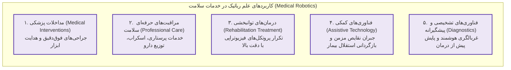
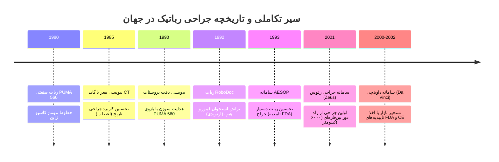
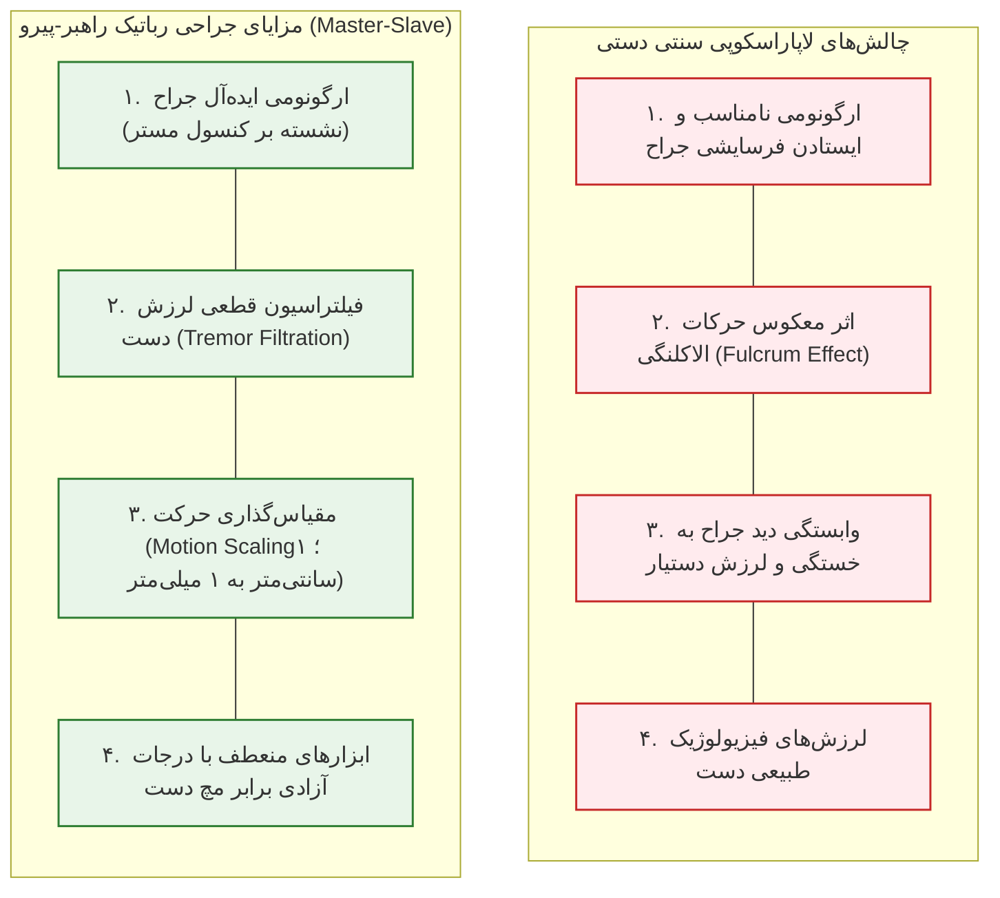
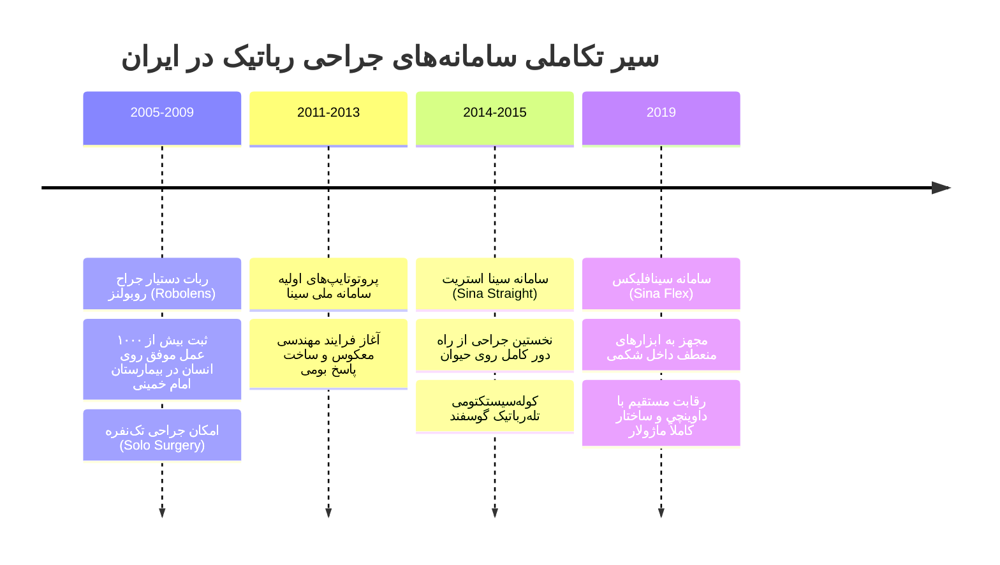
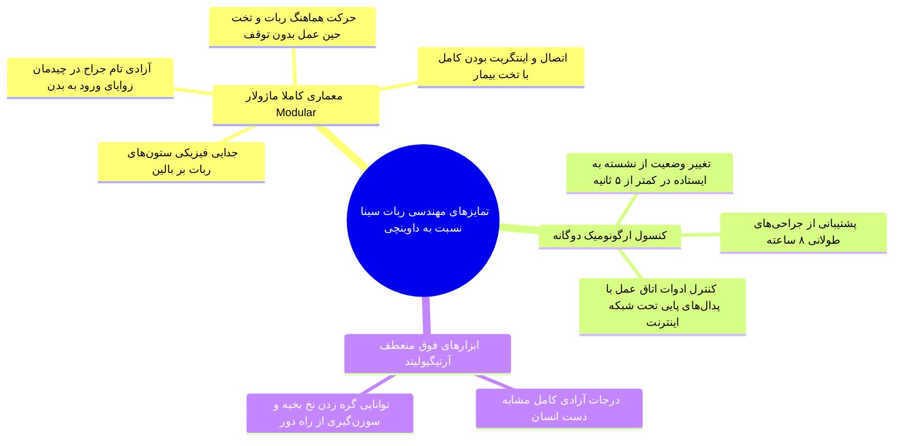
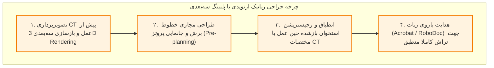
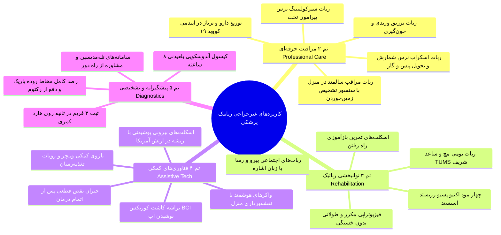
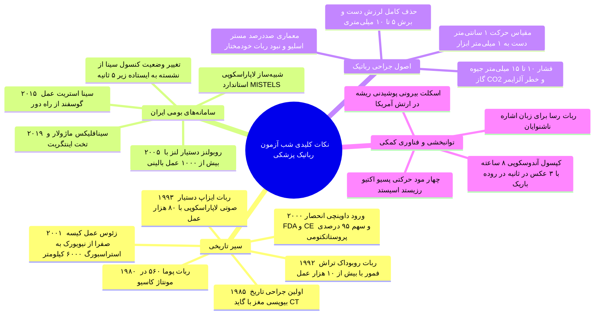

# رباتیک در پزشکی (دکتر میرباقری)

## بخش 1: فلسفه، نقشه راه و پنج تم نوآورانه رباتیک در خدمات سلامت

**علم رباتیک در پزشکی (Medical Robotics)** از نوظهورترین شاخه‌های مهندسی پزشکی است که سابقه‌ای فراتر از چند دهه در جهان ندارد و در مقایسه با پیشرفت‌های صنعتی، این فناوری هنوز در اکثر کشورهای دنیا در مرحله جنینی (Infancy Stage) قرار دارد و هر روز مرزهای جدیدی از نوآوری را تجربه می‌کند. ورود سامانه‌های رباتیک به نظام سلامت با هدف حذف خطای انسانی، افزایش دقت در مقیاس‌های میکرونی، مهار لرزش دست، ممانعت از خستگی مفرط کادر درمان، و ارائه خدمات در محیط‌های آلوده یا پرخطر تعریف شده است. تمامی کاربردهای بالینی و توانبخشی این علم بر مبنای کارکرد به **پنج تم نوآورانه (Innovative Themes)** تقسیم‌بندی می‌شوند:

> [!definition] رباتیک پزشکی (Medical Robotics)
> شاخه‌ای بین‌رشته‌ای از علوم پزشکی، مکانیک، الکترونیک و هوش مصنوعی که با به‌کارگیری بازوهای مکانیکی دقیق و سامانه‌های رایانه‌ای، مداخلات تشخیصی، جراحی، توانبخشی و مراقبتی را با نظارت یا هدایت مستقیم متخصص سلامت ارتقا می‌بخشد.

1. **مداخلات پزشکی (Medical Interventions):** *گسترده‌ترین و تثبیت‌شده‌ترین* بخش رباتیک بالینی که شامل جراحی‌های کم‌تهاجمی رباتیک، هدایت بیوپسی‌ها و مداخلات ارتوپدی است.
2. **خدمات سلامت حرفه‌ای (Professional Care):** ربات‌هایی که به عنوان دستیار کادر درمان در محیط بیمارستان، اتاق عمل و منازل سالمندان مستقر شده و وظایف مراقبتی، بهداشتی و لجستیکی را انجام می‌دهند.
3. **درمان‌های توانبخشی (Rehabilitation Treatment):** سامانه‌هایی که در مراحل فعال درمانی، حرکات فیزیوتراپی مکرر و خسته‌کننده را با دقت و انطباق کامل بر وضعیت بیمار به اجرا درمی‌آورند.
4. **فناوری‌های کمکی (Assistive Technology):** ابزارهایی تخصصی برای بیمارانی که فرایند درمان آن‌ها خاتمه یافته اما دچار ناتوانی‌های مزمن و پایدار حرکتی هستند؛ این ربات‌ها نقص عملکردی عضو ازدست‌رفته را جبران می‌کنند.
5. **درمان‌های پیشگیرانه و تشخیصی (Preventive Therapies & Diagnostics):** سامانه‌های تشخیصی مقدم بر درمان که به کشف زودهنگام کانون‌های بیماری در بدن بدون آسیب تهاجمی می‌پردازند.

## بخش 2: تبارشناسی و تاریخچه تکاملی جراحی رباتیک در جهان

پیوند میان رباتیک و اتاق عمل از صنایع خودروسازی و خطوط مونتاژ آغاز شد؛ در سال **1980 میلادی**، برای نخستین بار ربات صنعتی **PUMA 560** در خطوط مونتاژ کارخانه کاسیو ژاپن به کار گرفته شد. تنها پنج سال بعد یعنی در سال **1985**، جراحان با اعمال اصلاحات فنی از همین بازوی PUMA 560 در حوزه *جراحی اعصاب (Neurosurgery)* برای انجام **بیوپسی مغز تحت گاید سی‌تی اسکن (CT-guided Brain Biopsy)** استفاده کردند؛ رویدادی تاریخی که *نقطه تولد جراحی رباتیک* لقب گرفت زیرا در مغز کوچک‌ترین خطا یا لرزش دست به فاجعه می‌انجامید. در سال **1990** از همین ربات جهت انجام **بیوپسی بافت پروستات** استفاده شد. دهه **1990 میلادی** را باید دوران شکوفایی و زایش رسمی ربات‌های تخصصی جراحی دانست:

* **سامانه RoboDoc (سال 1992):** *نخستین ربات تخصصی ارتوپدی* که بر اساس برنامه‌ریزی سه‌بعدی کامپیوتری و گاید CT، شکستگی‌های استخوان فمور و تراش محل کارگذاری پروتز سر هیپ را با دقتی فراتر از دست انسان انجام داد و **بیش از 10,000 عمل موفق روی انسان** ثبت کرد.
* **سامانه کمراهولدر AESOP (سال 1993):** شرکت *Computer Motion* که پروژه‌های فضایی ناسا را انجام می‌داد، *نخستین ربات دستیار جراح* تحت عنوان **AESOP** (Automated Endoscopic System for Optimal Positioning) را به بازار معرفی کرد. این بازو وظیفه *نگهداری لنز دوربین لاپاراسکوپی* را بر عهده داشت تا لرزش دست دستیار جراح حذف شود. ایزاپ اولین رباتی بود که گواهی ورود به بازار آمریکا (**تاییدیه FDA**) را دریافت کرد و در بازه پنج‌ساله 1993 تا 1998 **بیش از 80,000 عمل جراحی لاپاراسکوپی** را پشتیبانی نمود. با این حال به دلیل کنترل صوتی (*Voice-Controlled*)، چنانچه جراح دچار سرماخوردگی می‌شد، سامانه صدای او را شناسایی نمی‌کرد؛ همین نقص همراه با مشکلات چرخش تصویر باعث افت عملکرد به **20,000 عمل** در پنج‌ساله دوم شد و شرکت سازنده در **سال 2003** منحل و توسط کمپانی رقیب خریداری گردید.
* **سامانه جراحی زئوس (Zeus - سال 2001):** شاهکار مهندسی شرکت کامپیوتر موشن که در تاریخ **7 سپتامبر 2001** (چند روز پیش از وقایع 11 سپتامبر) *نخستین جراحی رباتیک بین‌قاره‌ای* از راه دور را به ثبت رساند؛ جراح مستقر در **نیویورک** از فاصله 6,000 کیلومتری عمل جراحی برداشتن کیسه صفرا (کوله سیستکتومی) را روی بیماری در بیمارستان **استراسبورگ فرانسه** با موفقیت اجرا کرد.
* **سامانه جراحی داوینچی (Da Vinci - سال 2000 تا 2002):** با خریداری کامپیوتر موشن توسط کمپانی **اینتویتیو سرجیکال (Intuitive Surgical)**، ربات جراح داوینچی متولد شد. این سامانه تنها دارنده تاییدیه‌های معتبر **FDA آمریکا** و **CE اروپا** در این کلاس بالینی است. امروزه از میان 10 میلیون عمل جراحی شکمی سالانه در آمریکا و اروپا، حدود **10% (معادل 1 میلیون عمل در سال)** توسط داوینچی انجام می‌گیرد؛ این سهم در اعمال فوق‌تخصصی نظیر **رادیکال پروستاتکتومی (Radical Prostatectomy) در آمریکا به بیش از 90 تا 95 درصد می‌رسد**.

## بخش 3: فیزیک جراحی لاپاراسکوپی و معماری سامانه‌های راهبر-پیرو (Master-Slave)

برای درک اهمیت جراحی رباتیک، شناخت چالش‌های بیومکانیکی *جراحی باز (Open Surgery)* و *لاپاراسکوپی مرسوم (Conventional Laparoscopy)* الزامی است. در جراحی باز، دسترسی به ارگان‌های خلفی شکم نیازمند ایجاد **شکاف‌های عمیق 10 تا 20 و حتی 20 تا 30 سانتی‌متری** بر روی پوست بیمار است که منجر به دردهای وحشتناک پس از عمل، عفونت، اسکار بدشکل و نقاهت طولانی می‌گردد. در لاپاراسکوپی با ایجاد **چند سوراخ مینیاتوری 5 تا 10 میلی‌متری** و دمیدن گاز دی‌اکسید کربن با فشار **10 تا 15 میلی‌متر جیوه**، احشای شکم پایین رانده شده و فضایی گنبدی‌شکل پدید می‌آید. با این حال لاپاراسکوپی دستی دو چالش بزرگ ایجاد می‌کند:

> [!definition] اثر معکوس و اهرمی دیواره شکم (Fulcrum Effect)
> در لاپاراسکوپی سنتی به دلیل پین شدن میله ابزار در محل ورود به دیواره شکم، حرکات دست جراح معکوس می‌شود؛ حرکت دادن دسته ابزار به سمت راست، سر ابزار درون شکم را به چپ می‌برد و بالا بردن دست، نوک ابزار را پایین می‌کشد.

> [!important] قانون طلایی: عدم وجود ربات خودمختار در اتاق عمل
> در کل دنیا **هیچ ربات جراحی که به صورت مستقل و بدون نظارت انسان تصمیم‌گیری یا عمل کند وجود ندارد!** تمامی سامانه‌های جراحی بالینی الزاماً از نوع **راهبر-پیرو (Master-Slave)** هستند. *کنسول جراحی (Master)* حرکات دستان پزشک را دریافت کرده و بازوهای مکانیکی متصل به *بیمار (Slave)* تحت سوپروایزری صددرصدی جراح، عین حرکات را در داخل بدن بازتولید می‌کنند.

### سه دستاورد طلایی مهندسی در معماری جراحی رباتیک

1. **مقیاس‌گذاری حرکت (Motion Scaling):** تنظیم نرم‌افزاری نسبت جابه‌جایی بازوی جراح به نوک ابزار؛ برای نمونه اگر دست جراح روی هندل مستر **1 سانتی‌متر جابه‌جا شود، نوک ربات در بدن تنها 1 میلی‌متر حرکت می‌کند**. این سازوکار به جراح اجازه می‌دهد کارهای ظریف میکرونی را ده برابر بزرگ‌تر و با ضریب اطمینان خیره‌کننده انجام دهد.
2. **فیلتراسیون لرزش‌های فیزیولوژیک دست (Tremor Filtration):** سامانه‌های رایانه‌ای فرکانس‌های لرزش ناخواسته دست جراح (به ویژه لرزش‌های خستگی ناشی از جراحی‌های فرسایشی) را حذف کرده و *حرکتی کاملاً صیقلی* به نوک ابزار تحویل می‌دهند.
3. **حفاظت پرسنلی و ارگونومی جراح:** جراح به جای ساعت‌ها ایستادن در پوزیشن‌های طاقت‌فرسا بر بالین بیمار، بر روی صندلی کنسول با دید سه‌بعدی می‌نشیند. افزون بر این، جراح از خطرات بریدگی دستکش، ترشح خون‌آلوده، استنشاق **گازهای بیهوشی**، تابش اشعه و **گاز کربن دی‌اکسید (CO₂) شکم که اثبات شده در درازمدت خطر آلزایمر به همراه دارد** در امان خواهد بود.

## بخش 4: جدول جامع مقایسه تطبیقی انسان جراح در برابر ربات جراح

علم پزشکی به این نتیجه قطعی رسیده است که نباید ربات را جایگزین انسان کرد؛ بلکه به دلیل هم‌پوشانی نقاط قوت یکی با نقاط ضعف دیگری، تلفیق این دو عامل موفقیت کلینیکی است:

| شاخص بالینی و مهندسی | قابلیت‌ها و محدودیت‌های انسان جراح | قابلیت‌ها و محدودیت‌های ربات جراح |
| :--- | :--- | :--- |
| **قضاوت بالینی و تصمیم‌گیری** | **بسیار قوی و منعطف**؛ درک شرایط بحرانی ناگهانی (مانند پارگی عروق) | **بسیار ضعیف و ناتوان**؛ عدم توان تصمیم‌گیری خارج از کدهای از‌پیش‌تعریف‌شده |
| **خستگی‌پذیری و پایداری عملکرد** | افت شدید دقت و لرزش دست با افزایش زمان جراحی | **خستگی‌ناپذیر و پایدار**؛ عملکرد کاملاً یکنواخت حتی در جراحی‌های 8 ساعته |
| **تلفیق داده‌ها و حس‌ها** | یکپارچه‌سازی بی‌نظیر حواس پنج‌گانه (لمس، بوی بافت، رنگ خون) | **متکی بر داده‌های پردازش‌شده دیجیتال**؛ ناتوانی در دریافت حواس کیفی و لمس آزاد |
| **دقت هندسی و مقیاس حرکت** | محدود به ابعاد بالای 1 میلی‌متر با لرزش طبیعی دست | **فوق‌العاده بالا در مقیاس میکرومتر** با فیلتراسیون لرزش و اسکیلینگ حرکتی |
| **ابعاد مجری نهایی (End-Effector)** | دست انسان حجیم بوده و نیازمند برش‌های پوستی 20 تا 30 سانتی‌متری است | **ابزارهای مینیاتوری 5 تا 10 میلی‌متری** با درجات آزادی مچ دست (EndoWrist) |
| **تطبیق با بافت‌های تغییرشکل‌پذیر** | عالی؛ واکنش بلادرنگ تجربی به بافت‌های نرم و ناهمگن | ضعیف؛ چالش بزرگ در مدل‌سازی ریاضی رفتارهای غیرخطی بافت نرم زنده |
| **ایمنی در برابر آلاینده‌های اتاق عمل** | آسیب‌پذیر در برابر اشعه، گاز CO₂، گاز بیهوشی و عفونت‌های خونی | **کاملاً مقاوم** در برابر پرتوها، پاتوژن‌های خونی و گازهای شیمیایی |

## بخش 5: سامانه ملی ربات جراح سینا (Sina) و افتخارات بومی ایران

کشور ایران از سال **2003 میلادی** به عنوان یکی از قطب‌های مستعد فناوری رباتیک در جهان اسلام شناخته شد. در حوزه رباتیک جراحی، محققان دانشگاه علوم پزشکی تهران با همکاری دانشگاه صنعتی شریف پروژه‌های افتخارآفرینی را به ثبت رساندند:

* **ربات دستیار جراح روبولنز (Robolens):** این ربات که بین دستان جراح در *لاپاراسکوپی* مستقر می‌شد، هدایت لنز تصویربرداری را بر عهده داشت و امکان *جراحی تک‌نفره (Solo Surgery)* را مهیا ساخت. روبولنز در سال **2005** تست بالینی شد و **تا سال 2009 بیش از 1,000 عمل جراحی روی انسان** در *مجتمع بیمارستانی امام خمینی (ره) تهران* با موفقیت انجام داد. این سامانه در کتب مرجع جراحی رباتیک جهان به عنوان **یکی از 5 تا 6 ربات دستیار در تاریخ که روی انسان کار کرده‌اند** ثبت گردیده است.
* **سامانه ملی جراحی رباتیک سینا (Sina Surgical System):** پاسخ بومی به تحریم‌های پزشکی و عدم واگذاری ربات داوینچی به ایران. مسیر توسعه آن از پروتوتایپ‌های 2011 و 2013 عبور کرد تا اینکه در سال **2014 و 2015 مدل سینا استریت (Sina Straight)** *نخستین عمل جراحی از راه دور کامل* را روی نمونه حیوانی (عمل کوله سیستکتومی گوسفند) با حضور جراح در ساختمانی مجزا ثبت نمود. در سال **2019 مدل سینافلیکس (Sina Flex)** مجهز به بازوهای منعطف داخلی به بازار آموزشی و پیش‌بالینی عرضه شد.

### سامانه شبیه‌ساز آموزش جراحی لاپاراسکوپی ایران

به منظور ارتقای هماهنگی سه‌بعدی چشم و دست جراحان از طریق مانیتورهای دو بعدی، شبیه‌ساز مجازی بومی بر اساس **استاندارد بین‌المللی میستلز (MISTELS)** ساخته شد. این دستگاه دارای نرم‌افزاری با سیستم اختصاصی لاگین دانشجو، آنالیز دینامیک حرکات ابزار و **تولید خودکار کارنامه پیشرفت (PDF Report) و منحنی یادگیری (Learning Curve)** است که مستقیماً برای استاد ارسال می‌شود و در دانشگاه‌های علوم پزشکی جایگزین تست‌های پرهزینه حیوانی و پیش‌بالینی شده است.

## بخش 6: رباتیک در ارتوپدی، چشم‌پزشکی و میکرو/نانوربات‌ها

مداخلات رباتیک فراتر از شکم، هندسه جراحی‌های استخوان و بافت‌های ظریف را دگرگون کرده است:

* **رباتیک ارتوپدی (Acrobat و RoboDoc):** در جراحی سنتی استخوان به دلیل نبود گوشه‌های قائمه و لبه‌های مسطح، جراح قادر به اندازه‌گیری میلی‌متری زوایای تراش نیست. در سامانه **Acrobat** جهت *تعویض ناکامل مفصل زانو (Partial Knee Replacement)* و ربات **RoboDoc** برای *تعویض مفصل ران (Total Hip Replacement)*، ابتدا تصویر CT سه‌بعدی بیمار در نرم‌افزار آنالیز شده و جای پروتز مخروطی با دقت شبیه‌سازی می‌گردد (*Pre-planning*). حین عمل، سیستم نویگیشن استخوان بیمار را با نقشه CT انطباق داده (*Registration*) و بازوی رباتیک تراش‌های استخوانی را دقیقاً مطابق با زوایای پیش‌بینی‌شده پیاده می‌نماید.
* **ربات جراح چشم دانشگاه جانز هاپکینز:** جهت انجام اعمال ظریف شبکیه؛ ابزار جراحی توسط دست جراح و بازوی ربات به صورت مشترک نگه داشته می‌شود و ربات از طریق سنسورهای حس نیرو، حرکات ناخواسته و لرزش میکرونی را فیلتر کرده و حرکت نرم ابزار را هدایت می‌کند.
* **میکرو و نانوربات‌های مینیاتوری گوارشی:** ربات‌هایی با ساختار بیومیمتیک (الهام‌گرفته از سوسک) مجهز به میکروکمرا و بازوهای مکانیکی ظریف جهت نفوذ به مجاری باریک صفراوی و عروق خونی و برداشتن بافت‌ها و پولیپ‌های میکرومتری.

## بخش 7: اطلس کاربردی تم‌های ۲ تا ۵: مراقبت حرفه‌ای، توانبخشی، کمکی و پیشگیرانه

### ۱. تم خدمات سلامت حرفه‌ای (Professional Care)
* **ربات اسکراب‌نرس (Scrub Nurse Robot):** تحویل ابزارهای جراحی (پنس، قیچی، گاز) به جراح؛ این ربات‌ها تعداد ابزار تحویل‌شده و بازگشتی را به صورت لحظه‌ای می‌شمارند تا از فاجعه جا ماندن گاز و ابزار در شکم بیمار پیشگیری شود.
* **ربات سیرکولیتینگ‌نرس (Circulating Nurse Robot):** جابه‌جایی وسایل در فضای غیراستریل دور تخت جراحی.
* **ربات‌های تریاژ، دارورسان و ضدعفونی در اپیدمی کووید-19:** جایگزینی کادر پرستاری جهت کاهش تماس فیزیکی و قطع زنجیره انتقال ویروس.
* **ربات‌های حمل بیمار و مراقبت سالمند:** ممانعت از صدمات دیسک کمر پرسنل در جابه‌جایی بیماران سنگین‌وزن و مانیتورینگ علائم حیاتی سالمندان تنها در منزل به همراه سنسورهای هشدار زمین‌خوردن (Fall Detection) و تماس خودکار با اورژانس.

### ۲. تم درمان‌های توانبخشی (Rehabilitation Treatment)
فیزیوتراپی شامل پروتکل‌های حرکتی تکراری، فرسایشی و خسته‌کننده برای فیزیوتراپ است. ورود ربات‌ها اجازه می‌دهد تمرینات با دقت ثابت در قالب محیط‌های واقعیت مجازی بازی‌گونه (*Gamification*) اجرا شوند.
* **ربات توانبخشی مچ دست و ساعد (طراحی دانشگاه شریف و علوم پزشکی تهران):** بازتوانی حرکات اکستنشن، فلکشن، پرونیشن و سوپینیشن با پشتیبانی از **چهار مود کاری بالینی**:
  1. *پسیو (Passive):* ربات کل نیروی حرکت عضو کاملاً فلج را تامین می‌کند.
  2. *اکتیو (Active):* بیمار به صورت مستقل و کامل دامنه حرکتی را می‌پیماید.
  3. *اکتیو-اسیستد (Active-Assisted):* بیمار بخشی از حرکت را آغاز کرده و ربات در تکمیل دامنه به او کمک می‌کند.
  4. *اکتیو-رزیستد (Active-Resisted):* ربات در برابر حرکت بیمار مقاومت مکانیکی ایجاد کرده تا عضله تقویت شود.
* **ربات‌های اجتماعی (Social Robots):** ربات فرانسوی-ژاپنی **پپرو (PaPeRo)** و ربات ایرانی **رسا (Rasa - دانشگاه صنعتی شریف)** که با زبان اشاره با کودکان و توان‌خواهان ناشنوا تعامل برقرار می‌نماید.

### ۳. تم فناوری‌های کمکی (Robotic Assistive Technology)
فناوری‌هایی که در صورت قطع امید از بهبودی بالینی و ماندگاری نقص عضو، به کمک توان‌خواه می‌آیند:
* **تجهیزات تحمل‌کننده وزن دست و بازوی متصل به ویلچر:** بازوهای الکترومکانیکی برای باز کردن در، خرید، گرفتن بشقاب و غذا خوردن مستقل.
* **سامانه رابط مغز و کامپیوتر (BCI) جهت نوشیدن آب:** از طریق کاشت تراشه الکترونیکی در جمجمه بیمار مبتلا به فلج کامل چهاراندام، امواج کورتکس مغز رمزگشایی شده و به محض شکل‌گیری قصد ذهنی نوشیدن آب، بازوی رباتیک لیوان را به دهان فرد نزدیک می‌کند.
* **واکرهای هوشمند موتوریزه با قابلیت نقشه‌برداری:** مجهز به سنسورهای ممانعت از برخورد با موانع و هدایت افراد نابینا در محیط ساختمان بر اساس نقشه داخلی.
* **اسکلت‌های بیرونی پوشیدنی (Wearable Exoskeletons):** سامانه‌هایی که نخستین بار در ارتش آمریکا برای حمل کوله‌پشتی‌های سنگین پیاده‌نظام توسعه یافتند؛ امروزه نمونه‌های دارنده تاییدیه FDA با مهار وزن و تامین گشتاور مفاصل، راه رفتن مجدد بیماران پاراپلژیک را در معیت واکر و همراه میسر ساخته‌اند.

### ۴. تم فناوری‌های تشخیصی و پیشگیرانه (Preventive Therapies & Diagnostics)
* **کپسول آندوسکوپی بلعیدنی (Capsule Endoscopy):** کپسولی مینیاتوری حاوی دوربین و فرستنده بی‌سیم که توسط بیمار بلعیده شده و طی یک سفر **8 ساعته** با حرکات دودی (Peristalsis) طول لوله گوارش را طی می‌کند. این سامانه با نرخ **3 عکس در ثانیه (3 fps)** تصاویر را به هاردی که بر کمربند بیمار بسته شده مخابره می‌نماید و در نهایت از طریق رکتوم دفع می‌شود. مزیت بی‌رقیب آن، بررسی کامل **مخاط روده باریک (Small Intestine)** است که برای آندوسکوپ و کولونوسکوپ‌های سنتی غیرقابل دسترسی بود.
* **پزشکی از راه دور (Telemedicine):** ربات‌های پایش تشخیصی علائم بالینی و برقراری ارتباط ویدئوکنفرانس جراح با مناطق محروم.

## بخش 8: چک‌لیست طلایی مرور سریع شب امتحان

> [!tip] دام‌های تستی احتمالی
> 1. **ماهیت خودمختاری ربات‌ها:** در اتاق عمل هیچ ربات اتونوموس (خودمختار) وجود ندارد؛ تمامی سامانه‌ها از نوع راهبر-پیرو (*Master-Slave*) بوده و تصمیم‌گیرنده نهایی صددرصد جراح انسان است.
> 2. **اولین کاربرد جراحی رباتیک:** بیوپسی مغز در سال 1985 با ربات PUMA 560 تحت هدایت CT اسکن بود (نه جراحی لاپاراسکوپی یا ارتوپدی!).
> 3. **اولین جراحی از راه دور بین‌قاره‌ای:** توسط سامانه زئوس (Zeus) در سال 2001 میان نیویورک و استراسبورگ فرانسه با فاصله 6,000 کیلومتر انجام شد (نه داوینچی!).
> 4. **آمار داوینچی:** سهم داوینچی در کل جراحی‌های شکمی حدود 10% است، اما در جراحی اختصاصی رادیکال پروستاتکتومی در آمریکا به 90 تا 95 درصد می‌رسد.
> 5. **ویژگی متمایز ربات سینا ایرانی نسبت به داوینچی:** طراحی کاملاً ماژولار هدهای مجزا و اینتگریت بودن ربات‌ها با تخت جراحی (حرکت همزمان با تخت)، به همراه قابلیت تغییر وضعیت ارگونومیک کنسول به حالت ایستاده در کمتر از 5 ثانیه.
> 6. **تفاوت فناوری‌های کمکی (Assistive) و توانبخشی (Rehabilitation):** توانبخشی در طول فرایند فعال درمان جهت بازگرداندن سلامت به کار می‌رود؛ فناوری کمکی زمانی وارد عمل می‌شود که درمان پایان یافته و نقص عضو دائمی است.
> 7. **مشخصات فنی کپسول آندوسکوپی:** مدت زمان پیمایش 8 ساعت، نرخ ثبت تصویر 3 فریم در هر ثانیه، ضبط روی هارد کمری و خروج از طریق رکتوم؛ با هدف انحصاری پایش روده باریک.