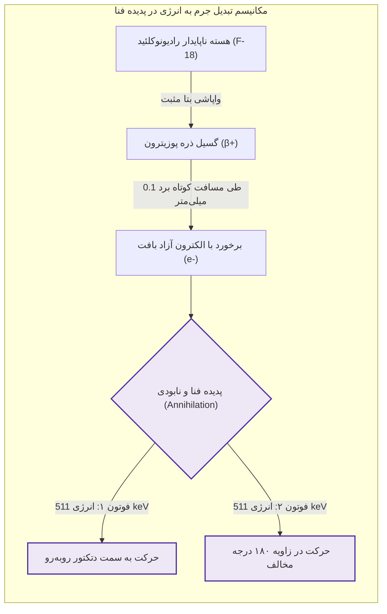
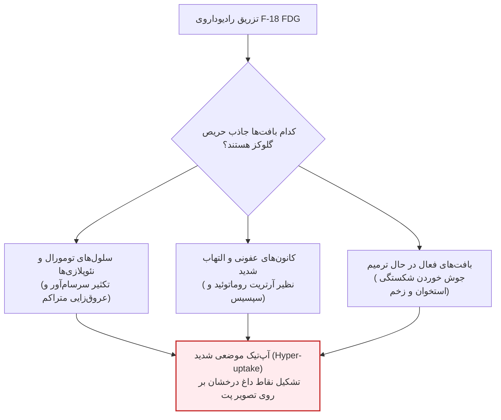
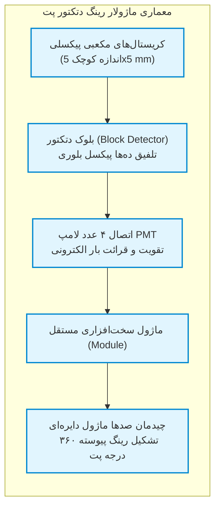
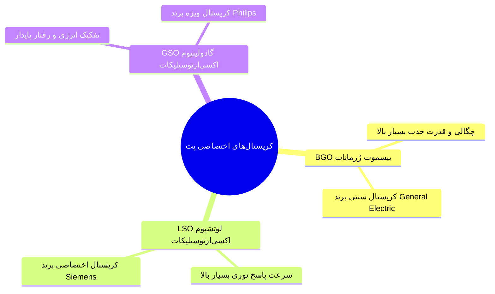
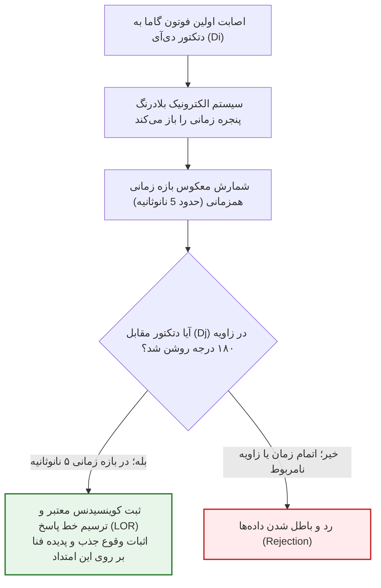
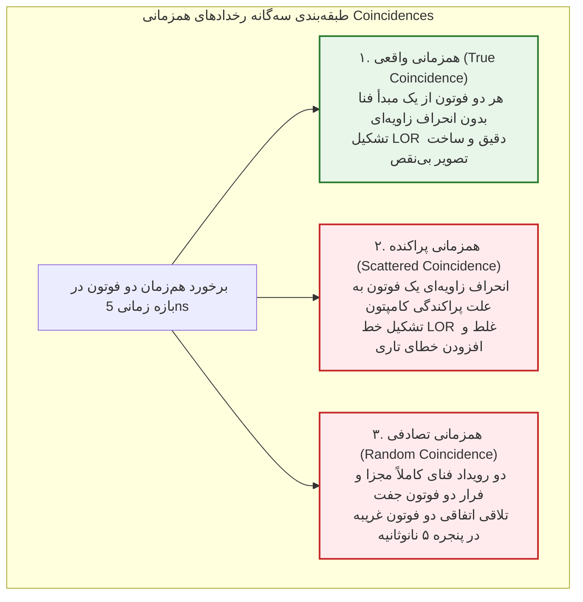
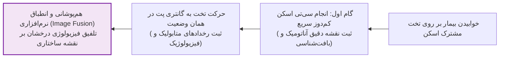
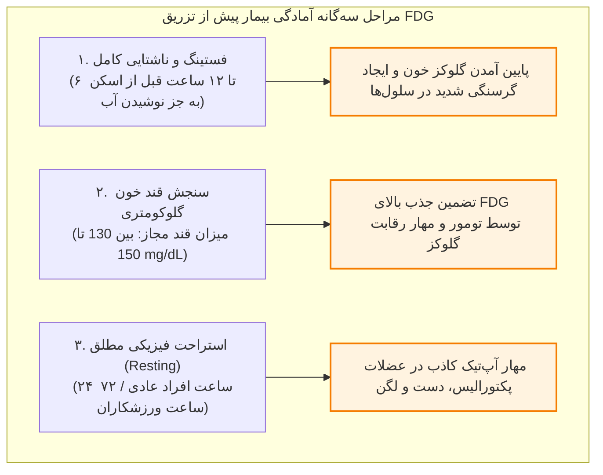
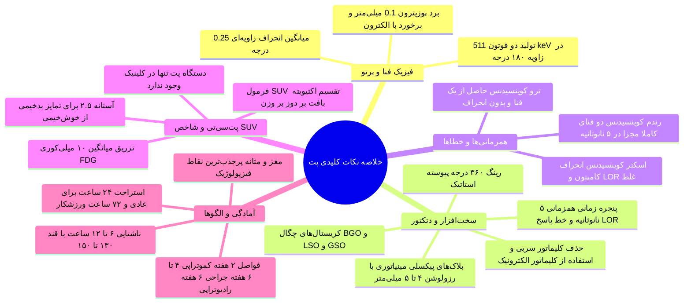

# پزشکی هسته‌ای - PET (دکتر عباس‌پور)

## بخش 1: مبانی فیزیک واپاشی بتا مثبت و پدیده نابودی (Annihilation)

تصویربرداری توموگرافی گسیل پوزیترون یا **پت (PET - Positron Emission Tomography)** *پیشرفته‌ترین مدالیته تصویربرداری سه‌بعدی عملکردی (Functional Imaging)* در پزشکی هسته‌ای است. تفاوت بنیادین این سامانه با سیستم‌های پیشین نظیر اسپکت (SPECT) در نوع واپاشی هسته‌ای رادیوایزوتوپ‌های تجویزی نهفته است؛ در حالی که ایزوتوپ‌های اسپکت (نظیر تکنسیم-99m) از بدو گسیل، *فوتون‌های گامای منفرد (Single Photons)* ساطع می‌کنند، رادیونوکلئیدهای مورد استفاده در پت همگی **گسیل‌کننده پوزیترون (Positron Emitters)** هستند. *پوزیترون (ذره بتا مثبت یا β⁺)* پادذره باردار مثبت الکترون است که از هسته ناپایدار خارج می‌شود. پوزیترون به دلیل داشتن بار مثبت و برخورد با دریای چگال الکترون‌های مداری ماده، پس از طی مسافتی بسیار کوتاه در حد **کسری از میلی‌متر (حدود 0.1 mm)** متوقف شده و با یک الکترون آزاد موجود در بافت وارد واکنش مرگبار کوانتومی به نام **پدیده فنا یا نابودی (Annihilation)** می‌گردد. در اثر این برخورد، کل جرم هر دو ذره نابود شده و طبق رابطه هم‌ارزی جرم و انرژی، *دو فوتون گامای هم‌زمان* با انرژی دقیقاً **511 keV** در *دو جهت تقریباً مخالف* پدید می‌آیند.

> [!definition] پدیده فنا یا نابودی (Annihilation)
> برهم‌کنش بنیادین فیزیکی میان ذره پوزیترون گسیل‌شده از هسته رادیواکتیو با یک الکترون محیطی بافت انسان، که طی آن جرم دو ذره محو شده و دو فوتون گامای پرانرژی 511 keV با زاویه 180 درجه در خلاف جهت یکدیگر متولد می‌شوند.

پرتوهای حاصل از پدیده فنا به صورت دو خط سیر کاملاً روبه‌روی هم با زاویه اسمی **180 درجه** به سمت مرزهای خارجی بدن حرکت می‌کنند؛ البته به علت تکانه باقیمانده ناچیز ذرات پیش از توقف کامل، این زاویه مطلق نبوده و انحراف زاویه‌ای میانگینی در حدود **0.25 درجه (زاویه واقعی حدود 179.75 درجه)** وجود دارد. از آنجا که آشکارسازهای پت این دو فوتون هم‌زاد گاما را به صورت هم‌زمان ثبت می‌کنند، دستگاه به جای آشکارسازی مستقیم پوزیترون، عملاً **شکارچی جفت‌فوتون‌های نابودی گاما** است؛ فرایندی که اطلاعات فضایی بی‌نظیری در اختیار رایانه بازساز تصویر قرار می‌دهد.

## بخش 2: شیمی رادیوداروها و اطلس ردیاب‌های بالینی پت

ماده پرتوزا به‌تنهایی ارزش تشخیصی ندارد و باید به یک ترکیب حامل بیولوژیک پیوند بخورد (*Labeling*). در تصویربرداری پت، ایزوتوپ استاندارد و بنیادین **فلوئور-18 (F-18)** است که با نیمه‌عمر فیزیکی **110 دقیقه** توسط شتاب‌دهنده سیکلوترون تولید می‌گردد. مشهورترین، رایج‌ترین و استانداردترین رادیوداروی جهان در این مدالیته، ترکیب فلوئور-18 با آنالوگ قند گلوکز است که تحت عنوان **فلورودئوکسی‌گلوکز یا اف‌دی‌جی (F-18 FDG)** شناخته می‌شود و عملاً هویت و پیدایش پت با نام آن گره خورده است.

> [!definition] رادیوداروی F-18 FDG
> آنالوگ نشان‌دارشده قند گلوکز با اتم رادیواکتیو فلوئور-18، که به علت شباهت ساختاری به گلوکز وارد مسیر متابولیک سلول‌های با سوخت‌وساز بالا (سلول‌های سرطانی، کانون‌های عفونت و بافت‌های در حال بازسازی) شده و در آنجا به دام می‌افتد (*Metabolic Trapping*).

سلول‌های بدخیم به علت میتوز پیوسته، سرعت رشد بسیار بالا و عروق‌زایی فراوان (Vascularization)، وابستگی تام به مصرف قند دارند؛ با تزریق وریدی FDG، این مولکول‌ها مستقیماً وارد این سلول‌های پرمصرف شده و تجمع می‌یابند. البته پدیده مصرف حریصانه قند تنها مختص تومورها نیست؛ هر کانون بیماری‌زا که متابولیسم فعال، خون‌رسانی شدید یا فعالیت ایمنی داشته باشد، نظیر **عفونت‌های حاد (Infection)**، **التهاب‌های مزمن و فعال (مانند آرتریت روماتوئید)** و **بافت‌های در حال ترمیم و جوش خوردن استخوان**، مصرف گلوکز را به شدت بالا برده و رادیودارو را جذب می‌کنند که در اسکن پت به شکل مناطق پرجذب هویدا می‌شوند.

### رادیوداروهای نوین و کیت‌های مولکولی نسل جدید در پت

هرچند FDG یک ردیاب عمومی فوق‌العاده برای اکثریت قریب به اتفاق سرطان‌هاست، پزشکی هسته‌ای مدرن به سمت ردیاب‌های کاملاً اختصاصی و گیرنده‌محور حرکت کرده است که امروزه در مراکز درمانی پیشرفته دنیا و ایران نیز تولید و به کار گرفته می‌شوند:

1. **کیت پی‌اس‌ام‌ای (PSMA):** این کیت اختصاصی که قابلیت اتصال به رادیوایزوتوپ فلوئور-18 یا **گالیوم-68 (Ga-68)** را دارد، با اتصال به *آنتی‌ژن غشایی اختصاصی پروستات*، استاندارد طلایی و بی‌رقیب تصویربرداری و استیجینگ **سرطان پروستات (Prostate Cancer)** به شمار می‌رود.
2. **کیت دوتاتاتیت (DOTATATE):** کیت پپتیدی هدفمند که به *گیرنده‌های سوماتواستاتین* در سطح سلول‌های توموری متصل شده و به طور ویژه برای شناسایی **تومورهای نورواندوکرین (NETs)** طراحی شده است.
3. **کیت فپی (FAPI):** این ردیاب که به *پروتئین فعال‌کننده فیبروبلاست* متصل می‌شود، در بسیاری از **تومورهای توپر (Solid Tumors)** نتایجی با شفافیت و کنتراست به مراتب درخشان‌تر و برتر از FDG معمولی تولید می‌کند.

## بخش 3: معماری سخت‌افزاری دستگاه، دتکتور رینگی و کلیماتور الکترونیک

تفاوت ساختاری دستگاه پت با گاما کمرا و اسپکت چشمگیر است؛ در پت هدهای آشکارساز روبه‌روی هم قرار نگرفته و هیچ بخش مکانیکی حول تنه بیمار چرخش مداری انجام نمی‌دهد! سیستم سخت‌افزاری پت متشکل از یک **رینگ بسته کامل آشکارساز (Detector Ring)** است که به صورت محیطی پیوسته با زاویه 360 درجه دورتادور تخت بیمار را می‌پوشاند. از آنجا که پدیده فنا هم‌زمان در نقاط مختلف بدن رخ می‌دهد، این رینگ مدور اجازه می‌دهد تمام فوتون‌های ساطع‌شده در زوایای فضایی گوناگون بدون اتلاف زمان و فوتون بلافاصله شکار شوند.

> [!important] دتکتورهای بلوکی پیکسلی (Pixelated Block Detectors)
> در گاما کمرا از یک صفحه تخت کریستالی بزرگ و یکپارچه NaI استفاده می‌شود که دقت فضایی متوسطی دارد؛ اما در پت، آشکارسازها از قطعات مینیاتوری مکعبی مستقل با ابعاد حدود **5 در 5 میلی‌متر** ساخته شده‌اند که به صورت فشرده کنار هم چفت می‌شوند. در پشت هر بلوک دتکتور معمولاً **4 لامپ تکثیرکننده نوری (PMT)** نصب شده است. این ساختار موزاییکی و پیکسلی تفکیک مکانی نقاط را به شدت افزایش داده و رزولوشن فضایی پت را به **4 تا 5 میلی‌متر (و در سامانه‌های پیشرفته 3 تا 4 میلی‌متر)** ارتقا می‌دهد؛ عددی که تقریباً دو برابر برتر از رزولوشن 8 تا 12 میلی‌متری اسپکت است و شناسایی گره‌های تومورال بسیار ریز را میسر می‌سازد.

در دستگاه پت از کریستال سنتیلاتور NaI(Tl) استفاده نمی‌شود؛ زیرا انرژی فوتون‌های فنا (511 keV) بسیار فراتر از توان مهار یدید سدیم با چگالی متوسط است. در عوض از *کریستال‌های بسیار چگال و سنگین* نظیر **BGO (بیسموت ژرمانات - مورد استفاده شرکت جنرال الکتریک GE)**، **LSO (لوتشیوم اکسی‌ارتوسیلیکات - مورد استفاده زیمنس Siemens)** و **GSO (گادولینیوم اکسی‌ارتوسیلیکات - مورد استفاده فیلیپس Philips)** بهره گرفته می‌شود که فوتون 511 keV را با بازدهی کوانتومی بالا به نور مرئی تبدیل می‌نمایند.

### حذف کلیماتور فیزیکی و معجزه کلیماتور الکترونیکی (Electronic Collimation)

در دستگاه گاما کمرا یک صفحه ضخیم سربی با هزاران سوراخچه (کلیماتور) نصب می‌شود تا پرتوهای مورب را جذب و فدا کند؛ این کار بیش از 99 درصد فوتون‌های تشخیصی را از بین می‌برد و راندمان را به شدت پایین می‌آورد. **در دستگاه پت هیچ کلیماتور فیزیکی سربی وجود ندارد!** وظیفه تعیین مسیر پرتوها به صورت کاملاً دیجیتال و الگوریتمی از طریق **کلیماتور الکترونیکی (Electronic Collimation)** انجام می‌گیرد.

> [!definition] خط پاسخ (Line of Response - LOR)
> خط هندسی فرضی مستقیمی که مراکز دو دتکتور فعال‌شده در یک رخداد هم‌زمان را به یکدیگر متصل می‌کند؛ با فرض حرکت مخالف دو فوتون با زاویه 180 درجه، کانون دقیق پدیده فنا حتماً در نقطه‌ای بر روی همین خط LOR قرار داشته است.

هنگامی که نخستین فوتون به یک دتکتور اصابت می‌کند، سامانه‌های پردازشی بلافاصله یک پنجره زمانی موقت به پهنای بسیار کوتاه حدود **5 نانوثانیه (5 ns)** باز می‌کنند. اگر در طول این بازه زمانی 5 نانوثانیه‌ای، یک فوتون دیگر به یکی از دتکتورهای کمان روبه‌رویی که در امتداد زاویه 180 درجه قرار دارد برخورد کند، سیستم این رخداد را یک **همزمانی (Coincidence)** معتبر تلقی کرده، بین آن دو دتکتور یک خط پاسخ (LOR) رسم می‌کند و موقعیت بازسازی می‌شود. *عدم وجود تیغه‌های سربی کلیماتور* باعث می‌شود حساسیت و بهره‌وری فوتونی پت ده تا صد برابر بیشتر از اسپکت باشد.

## بخش 4: انواع رخدادهای همزمانی و مدیریت نویز و خطاها (Coincidences)

سیستم الکترونیکی پت هر دو فوتونی را که در بازه زمانی 5 نانوثانیه به دو دتکتور روبه‌رو برخورد کنند ثبت می‌نماید، اما در عمل تمام این جفت‌فوتون‌ها حامل اطلاعات صحیح آناتومیک نیستند. در پردازش پت سه رخداد همزمانی مستقل وجود دارد:

> [!important] آنالیز و مقایسه رخدادهای سه‌گانه همزمانی
> 1. **همزمانی واقعی (True Coincidence):** دو فوتون **حاصل از یک پدیده فنای واحد** (به اصطلاح «دارای پدر و مادر یکسان») به صورت مستقیم و بدون کوچک‌ترین برخورد یا تغییر جهت از بدن عبور کرده و به دتکتورهای روبه‌رو می‌رسند. خط LOR حاصل از این رخداد *صددرصد درست* بوده و پایه کنتراست و کیفیت نهایی تصویر است.
> 2. **همزمانی پراکنده (Scattered Coincidence):** هر دو فوتون **از یک نقطه فنا متولد** شده‌اند، اما یکی از آن‌ها حین گذر از بافت‌های متراکم بدن با الکترون برخورد کرده، دچار پدیده **پراکندگی کامپتون (Compton Scatter)** شده و مسیرش کج می‌شود. *با این حال، فوتون منحرف‌شده تصادفاً در بازه 5 نانوثانیه به دتکتور مجاور می‌رسد*. مدار الکترونیک قادر به درک انحراف نیست و یک خط LOR کج و غلط میان دو دتکتور رسم می‌کند که منشأ ضایعه را در موقعیتی غیرواقعی نشان داده و زمینه تصویر را تار می‌نماید.
> 3. **همزمانی تصادفی (Random Coincidence):** در **دو نقطه کاملاً متفاوت** از بدن دو پدیده فنا رخ می‌دهد. از هر کدام از این وقایع، یک فوتون بدون ثبت شدن از فضای بین دتکتورها فرار می‌کند؛ اما فوتون باقیمانده از رویداد اول و فوتون باقیمانده از رویداد دوم *کاملاً اتفاقی* ظرف پنجره 5 نانوثانیه‌ای به دو دتکتور مقابل هم می‌رسند! سیستم گمان می‌کند این دو فوتون هم‌ریشه هستند و یک LOR دروغین میان آن‌ها می‌کشد.

خطاهای ناشی از رخدادهای *پراکنده (Scatter)* و *تصادفی (Random)* کیفیت تصویر را به شدت تخریب و موقعیت تومورها را مخدوش می‌کنند. به همین دلیل فیزیکست‌های پزشکی و مهندسان هسته‌ای، الگوریتم‌های پس‌پردازش ریاضی و مدل‌سازی‌های پیچیده‌ای درون نرم‌افزار تعبیه کرده‌اند تا مقادیر تخمینی این دو مؤلفه مخدوش‌کننده را به طور کامل از ماتریس داده‌ها کم و کسر کرده و تنها همزمانی‌های واقعی (Trues) را در بازسازی نهایی به کار گیرند.

## بخش 5: فناوری تلفیقی پت/سی‌تی (PET/CT) و شاخص کمی جذب استاندارد (SUV)

تصاویر پت اطلاعات متابولیک بی‌همتایی دارند، اما رزولوشن ساختاری آن‌ها در بهترین شرایط حدود 4 میلی‌متر است؛ در حالی که مدالیته‌های ساختاری نظیر سی‌تی اسکن رزولوشنی در حد دهم میلی‌متر و حتی میکرومتر فراهم می‌سازند. اگر پزشکی تنها تصویر پت را ببیند، توده پرجذب و داغی را مشاهده می‌کند ولی به درستی نمی‌داند این ضایعه دقیقاً روی لبه استخوان، داخل پارانشیم غده یا در جداره عروق قرار دارد. برای رفع این نقیصه بنیادین، سامانه‌های **پت/سی‌تی (PET/CT)** توسعه یافتند.

> [!important] تله تستی آزمونی: وضعیت دستگاه‌های پت در کلینیک
> در پزشکی هسته‌ای امروزی، **دستگاه پت تنها (Standalone PET) به هیچ عنوان در بخش‌های بالینی وجود ندارد** و تمام دستگاه‌های فعال به صورت هیبرید پت/سی‌تی (PET/CT) تولید و نصب می‌شوند؛ زیرا در انکولوژی، رادیوتراپیست و جراح نیازمند مشخص کردن مرزهای میلی‌متری تومور بر روی تصویر سی‌تی هستند. (تنها با پیشرفت‌های آینده هوش مصنوعی ممکن است در آینده سی‌تی مجدداً حذف گردد). برعکس، در مدالیته اسپکت، هم دستگاه اسپکت تنها و هم سیستم اسپکت/سی‌تی کاربرد دارند.

### آنالیز کمی تومور با شاخص جذب استاندارد (SUV)

پت صرفاً یک تصویر کیفی چشمی ارائه نمی‌دهد، بلکه یک ابزار **سنجش کمّی (Quantitative)** فوق‌العاده دقیق است. پزشک برای قضاوت در خصوص میزان خباثت ضایعه یا اثربخشی شیمی‌درمانی، شاخصی عددی به نام **مقدار جذب استاندارد (Standardized Uptake Value - SUV)** را محاسبه می‌نماید. فرمول دقیق این شاخص کمی عبارت است از:

$$
\text{SUV} = \frac{\text{Tissue Activity Concentration}}{\frac{\text{Injected Activity}}{\text{Body Weight}}}
$$

که در آن اجزا به شرح زیر هستند:
1. **غلظت اکتیویته بافت هدف (Tissue Activity):** مقدار رادیواکتیویته ثبت‌شده درون حجم توده یا ارگان (مثلاً کبد) بر حسب مگابکرل بر میلی‌لیتر که توسط نرم‌افزار خوانده می‌شود.
2. **اکتیویته تزریق‌شده (Injected Dose):** مقدار کل دوز رادیوداروی کشیده‌شده در سرنگ که پیش از تزریق با دستگاه دوز کالیبراتور اندازه گرفته شده است (به طور میانگین حدود **10 میلی‌کوری یا 10 mCi** از داروی FDG).
3. **وزن بدن بیمار (Body Weight):** برای نرمال‌سازی دوز بر حجم توزیع بیولوژیک در افراد چاق یا لاغر.

> [!important] علت نیاز به فرمول SUV با وجود مشخص بودن دوز تزریقی
> ممکن است این پرسش مطرح شود که چرا وقتی ۱۰ میلی‌کوری به بیمار تزریق شده، باید مجدداً اکتیویته بافت محاسبه شود؟ دو دلیل قطعی فیزیکی وجود دارد: 1) تمام دوز تزریقی به ارگان هدف نمی‌رود بلکه در سراسر بدن، مثانه و بافت‌های دیگر پخش می‌شود؛ 2) از لحظه تزریق تا شروع تصویربرداری و محاسبه SUV، مدت زمانی طولانی می‌گذرد و رادیودارو هم دچار واپاشی فیزیکی (*Decay*) و هم دفع فیزیولوژیک کلیوی (*Washout*) شده و غلظت آن در ارگان افت می‌کند.

> [!tip] قانون سرانگشتی آستانه تشخیصی SUV در تومورها
> به عنوان یک معیار بالینی و راهنمای سرانگشتی، عدد **SUV = 2.5** به عنوان خط آستانه (Threshold) در نظر گرفته می‌شود:
> * چنانچه مقدار **SUV بیشتر از 2.5** باشد، ضایعه به شدت مشکوک به **توده‌های بدخیم سرطانی (Malignant)** است.
> * چنانچه مقدار **SUV کمتر از 2.5** باشد، ضایعه عموماً در دسته **ضایعات غیربدخیم و خوش‌خیم (Benign / Non-malignant)** طبقه‌بندی می‌گردد.
> *(البته این عدد یک معیار سرانگشتی عمومی است و برای ارگان‌های مختلف با پایه مصرف متفاوت، آستانه‌های اختصاصی وجود دارد).*

## بخش 6: پروتکل‌های آماده‌سازی بیمار و تفسیر الگوهای بالینی

به دلیل ماهیت متابولیک و مصرف گلوکز در سلول‌ها، رادیوداروی FDG *به شدت مستعد ایجاد خطاهای تشخیصی* در صورت عدم رعایت پروتکل‌های ورودی است. کارشناسان و کادر تصویربرداری موظفند چک‌لیست سخت‌گیرانه‌ای را پیش از تزریق اجرا نمایند:

1. **پروتکل استراحت فیزیکی (Physical Resting):** بیمار معمولی باید حداقل **24 ساعت قبل از اسکن** و ورزشکاران حرفه‌ای حداقل **72 ساعت قبل از آزمون** از هرگونه تمرین بدنی سنگین، ورزش یا پیاده‌روی طولانی اکیداً خودداری نمایند. در صورت عدم رعایت، عضلات مخطط (مانند عضلات پکتورالیس قفسه سینه، بازوها و کمربند لگنی) به شدت هایپراکتیو شده و FDG را با ولع می‌بلعند؛ پدیده‌ای که در تصویر به شکل *لکه‌های تیره عضلانی* ظاهر شده و ممکن است به اشتباه سرطان یا متاستاز لنفاوی تشخیص داده شود!
2. **پروتکل ناشتایی (Fasting):** بیمار باید بین **6 تا 12 ساعت پیش از اسکن** کاملاً ناشتا باشد (مصرف آب آزاد است). ناشتایی باعث افت قند فیزیولوژیک سرم شده و سلول‌های تومورال را در حالت گرسنگی مفرط قرار می‌دهد تا با تزریق FDG، بیشترین درصد دارو وارد توده شود. اگر بیماری فقط 45 دقیقه ناشتا باشد، FDG به جای تومور در عضلات سرتاسر بدن جذب می‌شود.
3. **اندازه‌گیری قند خون ناشتا:** قند خون بیمار پیش از ورود به اتاق تزریق اندازه گرفته می‌شود؛ محدوده ایمن و استاندارد معمولاً بین **130 تا 150 mg/dL** است. اگر قند خون فراتر از این محدوده باشد، رقابت مولکول‌های قند طبیعی مانع ورود FDG به تومور شده و اسکن لغو یا مشروط می‌گردد.
4. **فواصل زمانی اجباری با مداخلات درمانی قبلی:**
   * **شیمی‌درمانی (Chemotherapy):** باید حداقل **2 هفته فاصله** میان آخرین جلسه شیمی‌درمانی و اسکن پت لحاظ شود.
   * **اعمال جراحی (Surgery):** باید حداقل **4 تا 6 هفته فاصله** رعایت گردد؛ زیرا بافت‌های در حال التیام زخم مقادیر انبوهی گلوکز مصرف می‌کنند و ضایعه کاذب می‌سازند.
   * **پرتودرمانی (Radiotherapy):** باید حداقل **6 هفته فاصله** رعایت شود؛ فرایند ترمیم سلولی و التهاب شدید پرتوی می‌تواند تا هفته‌ها پاسخ کاذب ایجاد کند.

### توزیع فیزیولوژیک و نرمال FDG در بدن (Normal Biodistribution)

در ارزیابی بالینی، دیدن جذب دارو در ارگان‌های زیر کاملاً طبیعی بوده و نباید به اشتباه با تومور خلط گردد:
* **مغز (Brain):** سلول‌های نورونی مصرف‌کننده انحصاری قند هستند؛ بنابراین کورتکس مغز در *تمام اسکن‌های نرمال پت* به صورت ساختاری به رنگ تیره و با آپ‌تیک ماکسیمم دیده می‌شود.
* **حلق و اوروفارنکس (Oropharynx):** در صورت *صحبت کردن یا بلع بیمار* در حین اسکن، جذب موضعی در حنجره و تارهای صوتی پدید می‌آید.
* **عضله قلب (Myocardium):** به ویژه در *بطن چپ* به علت کار مداوم مکانیکی دارای جذب متغیر تا شدید است.
* **کلیه‌ها، حالب‌ها و مثانه (Bladder):** مسیر طبیعی *دفع ادراری* رادیوداروی FDG است و **همواره دارای اکتیویته بسیار درخشان و داغ است**.
* **دستگاه گوارش (GI Tract):** روده‌ها به علت *حرکات دودی* و *باکتری‌های هم‌زیست* جذب خفیف فیزیولوژیک دارند.

## بخش 7: جدول جامع مقایسه تطبیقی مدالیته‌های اسپکت (SPECT) و پت (PET)

| پارامتر ارزیابی                 | توموگرافی رایانه‌ای تک‌فوتونی (SPECT)                      | توموگرافی گسیل پوزیترون (PET)                             |
| :------------------------------ | :--------------------------------------------------------- | :-------------------------------------------------------- |
| **ماهیت واپاشی و پرتو ساطع**    | رادیونوکلئیدهای گسیل‌کننده فوتون گامای منفرد (Single)      | واپاشی پوزیترونی (β⁺) و وقوع *پدیده فنا (Annihilation)*   |
| **نحوه آشکارسازی پرتو**         | *ثبت تک‌فوتون گاما (Single Photon Detection)*              | ثبت هم‌زمان جفت‌فوتون با *همزمانی (Coincidence)*          |
| **نوع کلیماتور مورد استفاده**   | **کلیماتور فیزیکی سربی** (جذب و اتلاف بیش از ۹۹٪ فوتون‌ها) | **کلیماتور الکترونیکی دیجیتال** (پنجره ۵ نانوثانیه و LOR) |
| **انرژی فوتون‌های دریافتی**     | طیف متغیر انرژی‌های پایین تا متوسط (70 تا 300 keV)         | **انرژی ثابت و تک‌انرژی دقیق 511 keV**                    |
| **هندسه ساختار آشکارسازها**     | ۱ تا ۲ هد مسطح بزرگ با چرخش مکانیکی گانتری                 | **رینگ کامل پیوسته ۳۶۰ درجه ثابت** بدون چرخش              |
| **ساختار کریستال سنسور**        | صفحه یکپارچه بزرگ سنتیلاتور NaI:Tl                         | دتکتورهای بلوکی پیکسلی (BGO, LSO, GSO)                    |
| **رزولوشن فضایی (Spatial Res)** | ضعیف‌تر (محدوده 8 تا 12 میلی‌متر)                          | **بسیار بالا و برتر (محدوده 4 تا 5 میلی‌متر)**            |
| **حساسیت و بازدهی آشکارساز**    | پایین‌تر به دلیل فدا شدن پرتوها در سپتای سربی              | **فوق‌العاده بالا** به دلیل حذف کلیماتور سربی و رینگ ۳۶۰  |
| **رادیوداروی استاندارد طلایی**  | **تکنسیم-99m** با نیمه‌عمر *۶ ساعت* (Tc-99m MIBI / MDP)    | **فلوئور-18** با نیمه‌عمر *۱۱۰ دقیقه* (F-18 FDG)          |
| **وضعیت تجهیزات در کلینیک**     | به هر دو شکل اسپکت تنها و اسپکت/سی‌تی (SPECT/CT)           | **صرفاً به صورت سیستم هیبرید پت/سی‌تی (PET/CT)**          |

## بخش 8: چک‌لیست طلایی مرور سریع شب آزمون

> [!tip] دام‌های تستی و نکات مهم
> 1. **زاویه واقعی فوتون‌های فنا:** هرچند زاویه اسمی 180 درجه است، اما به دلیل تکانه باقیمانده پوزیترون پیش از واکنش نابودی، میانگین زاویه در بافت حدود 179.75 درجه بوده و حدود 0.25 درجه عدم انطباق فضایی پدید می‌آید.
> 2. **پدر و مادر فوتون‌ها در انواع همزمانی:** در همزمانی واقعی (*True*) و پراکنده (*Scatter*)، هر دو فوتون حاصل یک پدیده فنای مشترک هستند (از یک پدر و مادر)؛ اما در همزمانی تصادفی (*Random*) دو فوتون از دو رویداد کاملاً مستقل و بی‌ارتباط با یکدیگر سرچشمه می‌گیرند.
> 3. **تفاوت رزولوشن فضایی اسپکت و پت:** پت رزولوشنی در حدود 4 تا 5 میلی‌متر دارد و قادر است ضایعات 3 تا 4 میلی‌متری را ببیند؛ در حالی که اسپکت رزولوشنی حدود 8 تا 12 میلی‌متر داشته و ضایعات زیر 4 میلی‌متر در آن غیرقابل تفکیک و محو هستند.
> 4. **دلیل نوسان SUV در اثر زمان تزریق:** به دلیل واپاشی رادیواکتیو F-18 با نیمه‌عمر 110 دقیقه و دفع داروی FDG از طریق ادرار، غلظت داروی باقی‌مانده در بافت به طور پیوسته کاهش می‌یابد؛ لذا اکتیویته بافت باید دقیقاً در لحظه تصویربرداری مورد محاسبه قرار گیرد.
> 5. **تله عضلات پکتورالیس در ورزش:** عدم رعایت استراحت 24 ساعته پیش از اسکن پت، باعث هایپراکتیو شدن عضلات سینه (پکتورالیس) و کمربند شانه‌ای و جذب شدید FDG می‌گردد که این نمای کاذب نباید با کنسر پستان یا درگیری غدد لنفاوی زیربغل اشتباه گرفته شود.