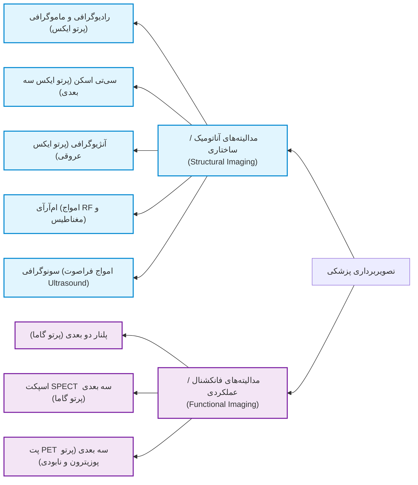
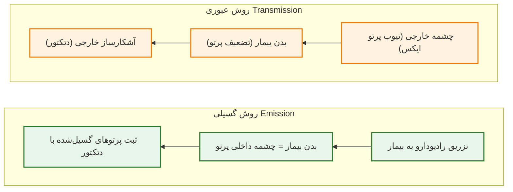
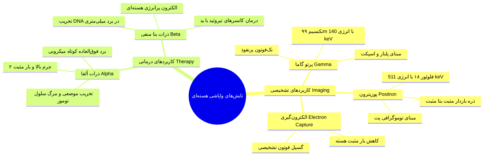
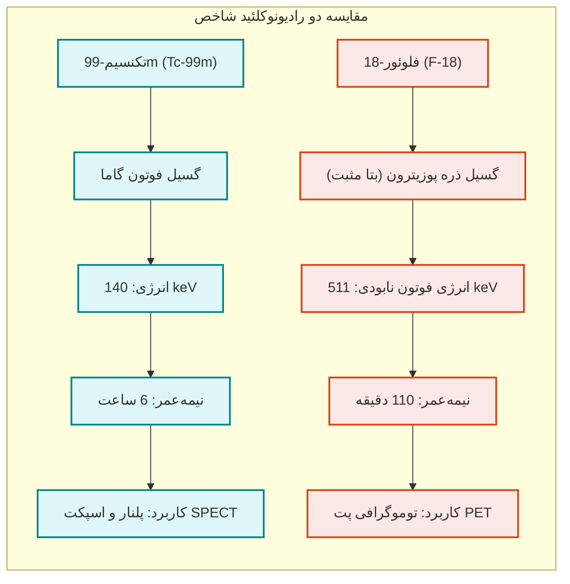
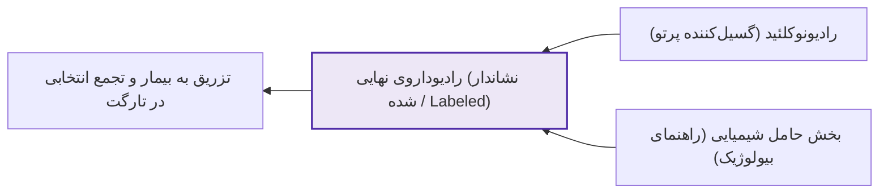
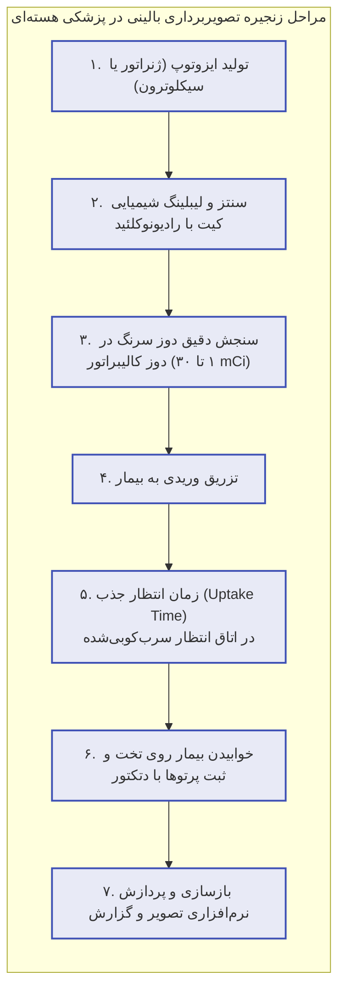
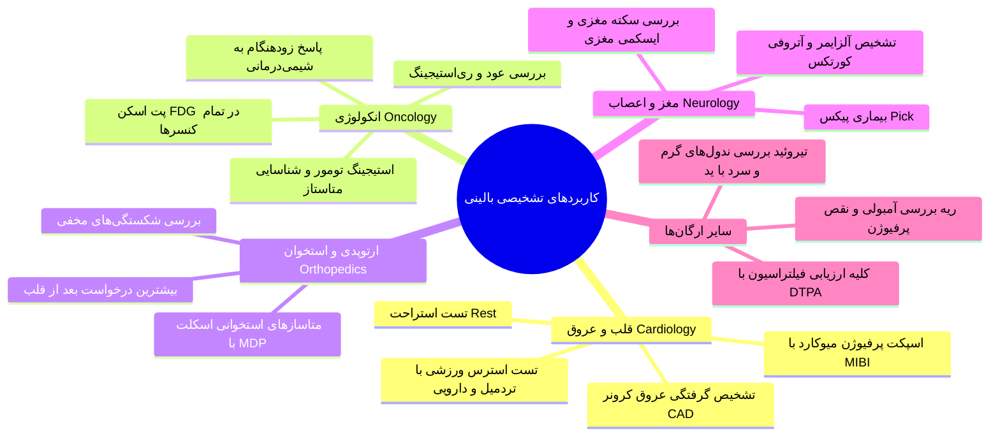
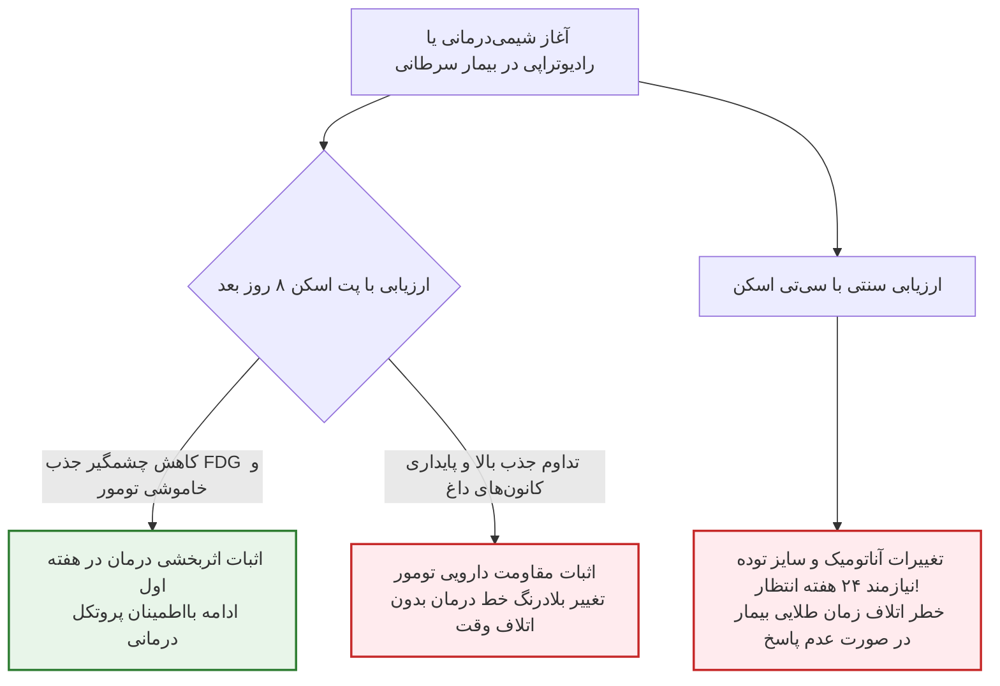
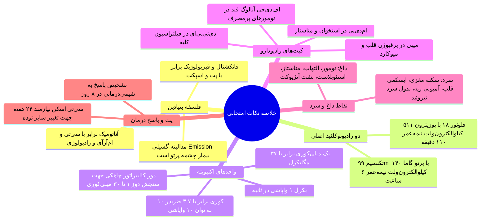

# پزشکی هسته‌ای - مبانی، فیزیک و کاربردهای بالینی (دکتر عباس‌پور)

## بخش 1: فلسفه وجودی، تمایزهای بنیادین و طبقه‌بندی مدالیته‌ها

پزشکی هسته‌ای (Nuclear Medicine) رویکردی کاملاً متفاوت به بدن انسان دارد؛ در حالی که روش‌های تصویربرداری مرسوم نظیر رادیوگرافی ساده، سی‌تی اسکن (CT)، ماموگرافی و ام‌آر‌آی (MRI) همگی در دسته **تصویربرداری ساختاری یا آناتومیک (Structural / Anatomical Imaging)** قرار می‌گیرند و جزئیات مورفولوژیک، مرزهای بافتی، ماده خاکستری و سفید مغز یا بطن‌ها را با وضوح فضایی بسیار بالا به نمایش می‌گذارند، پزشکی هسته‌ای یک روش **تصویربرداری عملکردی و متابولیک (Functional / Physiological Imaging)** است. در این روش هدف ما تماشای زیبایی‌های ظاهری آناتومی نیست، بلکه می‌خواهیم بدانیم سلول‌ها و بافت‌ها از نظر فیزیولوژی چگونه کار می‌کنند؛ آیا سوخت‌وساز طبیعی دارند، خون‌رسانی به آن‌ها برقرار است یا دچار اختلال عملکرد شده‌اند. به همین دلیل، رزولوشن فضایی تصاویر پزشکی هسته‌ای در مقایسه با سی‌تی یا ام‌آر‌آی پایین‌تر است، اما اطلاعات بیولوژیکی بی‌نظیری در اختیار پزشک می‌گذارد که هیچ مدالیته آناتومیکی توان رقابت با آن را ندارد.

> [!definition] تصویربرداری پزشکی هسته‌ای (Nuclear Medicine Imaging)
> شاخه‌ای از تصویربرداری تشخیصی و درمانی که با وارد کردن ترکیبات رادیواکتیو به درون بدن بیمار و ردیابی پرتوهای گسیل‌شده، اطلاعات فیزیولوژیک، متابولیک و مولکولی بافت‌ها و ارگان‌ها را در قالب تصاویر دو یا سه‌بعدی ثبت می‌کند.

### مقایسه ماهیت چشمه: عبوری (Transmission) در برابر گسیلی (Emission)

تفاوت بنیادین دیگر به محل قرارگیری چشمه تابش مربوط می‌شود:
1. **تصویربرداری عبوری (Transmission Imaging):** در تمام مدالیته‌های رادیولوژی جنرال، CT و ماموگرافی، چشمه تولید پرتو (تیوب پرتو ایکس) **خارج از بدن بیمار** قرار دارد. دسته پرتو پس از خروج از تیوب، از بدن عبور کرده، تضعیف شده و پرتوهای باقی‌مانده توسط دتکتور روبه‌رو شکار می‌شوند.
2. **تصویربرداری گسیلی (Emission Imaging):** در پزشکی هسته‌ای چشمه خارجی وجود ندارد، بلکه چشمه تابش دقیقاً **داخل بدن خود بیمار** است! ما ماده رادیواکتیو را به بیمار تزریق یا خورانده و بیمار را به یک منبع فعال گسیل‌کننده پرتو تبدیل می‌کنیم. سپس دتکتورهای بیرونی، فوتون‌های ساطع‌شده از درون ارگان‌ها را دریافت و تصویر را بازسازی می‌نمایند.

### بعد زمانی و هندسی: از تصویربرداری دو بعدی پلنار تا توموگرافی اسپکت و پت

تاریخچه پزشکی هسته‌ای همانند رادیولوژی سنتی سیر تکاملی از ۲ بعد به ۳ بعد را پیموده است. در ابتدا، تصویربرداری به شیوه **پلنار (Planar Imaging)** انجام می‌شد که تصویری دو بعدی مشابه گرافی ساده است؛ یعنی تمامی بافت‌های قدامی و خلفی بر روی یک صفحه فشرده شده و پدیده *برهم‌نهی (Superimposition)* مانع از دیدن عمق واقعی ضایعه می‌شد. برای حل این مشکل، تکنیک‌های توموگرافیک مقطعی سه‌بعدی به دنیای پزشکی هسته‌ای معرفی شدند:

* **تصویربرداری پلنار دو بعدی (Planar Imaging):** دو آشکارساز ثابت تخت در بالا و پایین بیمار قرار می‌گیرند و هم‌زمان نماهای قدامی (*Anterior / AP*) و خلفی (*Posterior / PA*) را بدون نیاز به جابه‌جایی یا چرخاندن بیمار ثبت می‌کنند. پرتو مورد استفاده گاما است.
* **اسپکت (SPECT - Single Photon Emission Computed Tomography):** همان سیستم گاما کمرا است که دتکتورهای آن قابلیت *چرخش ۳۶۰ درجه* حول بدن بیمار را دارند. با ثبت تصاویر متعدد در زوایای مختلف، مقاطع سه‌بعدی توموگرافیک بازسازی می‌شوند. پرتو مورد استفاده **تک‌فوتون گاما** (عمدتاً از *تکنسیم-99m*) است.
* **پت (PET - Positron Emission Tomography):** مدرن‌ترین سامانه که در آن دتکتورها به صورت یک **رینگ کامل استاتیک** دورتادور بیمار چیده شده‌اند و نیازی به چرخش مکانیکی ندارند. پرتو مورد استفاده حاصل از **واپاشی پوزیترون** (عمدتاً از *فلوئور-18*) است.

| شاخص مقایسه‌ای | تصویربرداری پلنار (Planar) | توموگرافی اسپکت (SPECT) | توموگرافی پت (PET) | رادیوگرافی و سی‌تی اسکن |
| :--- | :--- | :--- | :--- | :--- |
| **هندسه تشکیل تصویر** | دو بعدی سطحی (دارای Superimposition) | سه بعدی مقطعی (Tomographic) | سه بعدی مقطعی پیوسته رینگی | دو بعدی (رادیولوژی) / سه بعدی (CT) |
| **مکانیسم پرتو و آشکارسازی** | تک‌فوتون گاما (دتکتور تخت ثابت) | تک‌فوتون گاما (دتکتور چرخان) | فوتون‌های جفت ناشی از نابودی پوزیترون | تضعیف دسته فوتون‌های پرتو ایکس |
| **نوع اطلاعات خروجی** | فانکشنال و متابولیک کلی | فانکشنال سه‌بعدی با تفکیک عمق | فانکشنال فوق‌دقیق مولکولی و متابولیک | صرفاً آناتومیک و مورفولوژیک ساختاری |
| **هندسه آرایش دتکتورها** | دو دتکتور مسطح ثابت بالا و پایین | یک تا سه هد چرخان دور بدن | رینگ کامل دایره‌ای ۳۶۰ درجه ثابت | تیوب و دتکتور چرخان در گانتری |

## بخش 2: فیزیک واپاشی هسته‌ای، انواع رادیونوکلئیدها و روش‌های تولید

مواد رادیواکتیو موادی ذاتاً ناپایدارند که برای رسیدن به پایداری انرژی مازاد هسته خود را در قالب ذرات یا امواج الکترومغناطیسی گسیل می‌کنند. این گسیل خودبه‌خودی را **واپاشی رادیواکتیو** می‌نامند. در حالی که در طبیعت ایزوتوپ‌های سنگینی مثل اورانیوم وجود دارند، رادیونوکلئیدهای کاربردی در پزشکی **همگی مصنوعی** بوده و با مهندسی هسته‌ای تولید می‌شوند تا نیمه‌عمر مناسب و نوع تابش اختصاصی برای سلامت انسان داشته باشند.

> [!important] تمایز پرتوی تشخیصی و پرتوی درمانی در پزشکی هسته‌ای
> پزشکی هسته‌ای صرفاً برای تصویربرداری نیست!
> در **تصویربرداری تشخیصی** ما به پرتوهایی با *قدرت نفوذ بالا* نیاز داریم که بتوانند از ضخامت بدن خارج شده و به دتکتور برسند بدون آن‌که دوز موضعی زیادی به بیمار تحمیل کنند؛ از این رو از **گاما، پوزیترون و گیراندازی الکترون (EC)** استفاده می‌شود.
> در مقابل، در **پزشکی هسته‌ای درمانی (Radionuclide Therapy)**، هدف ما نابودی بافت تومورال و سلول‌های سرطانی است؛ بنابراین از ذراتی با *برد بسیار کوتاه* و *انتقال انرژی خطی بالا* نظیر **ذرات آلفا و بتا منفی** استفاده می‌کنیم تا بدون آسیب به بافت‌های سالم مجاور، تمام انرژی کشنده خود را درون توده سرطانی تخلیه نمایند.

### دو رادیونوکلئید کلیدی و طلایی در پزشکی هسته‌ای

در میان طیف وسیع رادیونوکلئیدها (شامل کربن، نیتروژن، اکسیژن، فسفر، گالیوم، ایندیوم و ید)، دو عنصر بیشترین حجم کاربرد روزمره بالینی را به خود اختصاص داده‌اند:
1. **تکنسیم-99m (Tc-99m):** سلطان تصویربرداری **SPECT** و **پلنار**! این ایزوتوپ یک تابش‌کننده خالص *گاما* با انرژی بسیار ایده‌آل **140 keV** و نیمه‌عمر فیزیولوژیک **6 ساعت** است. انرژی 140 keV *به اندازه کافی نفوذکننده* است که از بدن خارج شود و از طرفی انرژی آن برای *گیراندازی بهینه* در کریستال‌های گاما کمرا عالی است.
2. **فلوئور-18 (F-18):** ستون فقرات تصویربرداری **PET**! این ایزوتوپ با گسیل ذره *پوزیترون* واپاشی می‌کند. پوزیترون پس از طی مسافتی میکرونی با یک الکترون آزاد برخورد کرده و پدیده **نابودی (Annihilation)** رخ می‌دهد که حاصل آن *دو فوتون گامای هم‌زمان* با زاویه *۱۸۰ درجه* و انرژی دقیق **511 keV** است. نیمه‌عمر فلوئور-18 برابر با **110 دقیقه** است.

> [!tip] تله تستی امتحانی: چرا نمی‌توان F-18 را در اسپکت یا Tc-99m را در پت استفاده کرد؟
> فلوئور-18 پوزیترون‌زا است و فوتون‌های نابودی آن انرژی بسیار بالای 511 keV تولید می‌کنند که کریستال‌های نازک و کولیماتورهای سربی اسپکت قادر به مهار و ثبت آن‌ها نیستند.
> از سوی دیگر، تکنسیم-99m فوتون تکی 140 keV تولید می‌کند و فاقد پوزیترون است؛ در حالی که اساس کار پت ثبت هم‌زمان دو فوتون منطبق حاصل از پوزیترون است.

### تجهیزات سه‌گانه ساخت و تولید رادیوایزوتوپ‌ها

1. **ژنراتور هسته‌ای (Radionuclide Generator):** دستگاهی کاملاً جمع‌وجور به اندازه یک سطل زباله کوچک که مستقیماً در داروخانه هسته‌ای بیمارستان‌ها مستقر می‌شود. ژنراتور بر مبنای *واپاشی ایزوتوپ مادر* با نیمه‌عمر بلندتر، ایزوتوپ دختر یعنی **تکنسیم-99m** را به شکل *مداوم تولید و شستشو (Elution)* می‌کند.
2. **سیکلوترون (Cyclotron):** شتاب‌دهنده ذرات حلقوی پرقدرت و بسیار گران‌قیمت که *پروتون‌ها را شتاب داده و به هسته تارگت می‌کوبد* تا ایزوتوپ‌های با نیمه‌عمر کوتاه مانند **فلوئور-18** بسازد. در ایران مراکزی چون بیمارستان مسیح دانشوری، بیمارستان شریعتی و بیمارستان هاشمی رفسنجانی مجهز به سیکلوترون جهت تولید F-18 هستند.
3. **راکتور اتمی (Nuclear Reactor):** تأسیسات عظیم هسته‌ای صنعتی (مانند راکتور تحقیقاتی تهران و راکتور اراک) که از طریق *بمباران نوترونی سوخت و تارگت‌ها*، ایزوتوپ‌های خاص تشخیصی و درمانی (نظیر **ید-131** و **مولیبدن-99** مادر تکنسیم) را فراهم می‌آورند.

## بخش 3: شیمی رادیوداروها، مکانیسم‌های هدف‌گیری و دزیمتری

یک داروی رادیواکتیو صرفاً ماده پرتوزای خالص نیست؛ تزریق تکنسیم یا رادیونوکلئید خالی به بیمار ارزش تشخیصی موضعی ندارد، زیرا نمی‌داند باید به کدام ارگان برود! رادیودارو از ترکیب دو جزء مستقل تشکیل می‌شود:

> [!definition] رادیودارو (Radiopharmaceutical)
> فرآورده‌ای دارویی مرکب از دو بخش مجزا:
> ۱) **ماده رادیونوکلئید** به عنوان نشان‌گر ساطع‌کننده پرتو،
> ۲) **بخش حامل یا ترکیب شیمیایی (Chemical Compound)** به عنوان راه‌بلد و هدایت‌کننده بیولوژیک دارو به سمت بافت، ارگان یا گیرنده سلولی هدف.

### اطلس ترکیبات شیمیایی و کیت‌های تشخیصی در پزشکی هسته‌ای

* **تکنسیم + ام‌دی‌پی (Tc-99m + MDP):** حامل متیلن دی‌فسفونات وارد چرخه استخوان‌سازی و *متابولیسم هیدروکسی‌آپاتیت* شده و منحصراً جذب **اسکلت و ضایعات استخوانی** می‌گردد.
* **تکنسیم + دی‌تی‌پی‌ای (Tc-99m + DTPA):** از طریق *فیلتراسیون گلومرولی کلیه* دفع می‌شود و مستقیماً برای ارزیابی **عملکرد و فیلتراسیون کلیه‌ها** (و در برخی موارد *تصویربرداری مغز*) به کار می‌رود.
* **تکنسیم + میبی (Tc-99m + MIBI):** ماده سستامیبی به پتانسیل *غشای میتوکندری* سلول‌های زنده قلب متصل می‌شود و **خون‌رسانی و پرفیوژن عضله میوکارد قلب** را مشخص می‌کند؛ همچنین در بررسی *نودول‌های مشکوک پستان* کاربرد دارد.
* **ترکیبات ید (Iodine - I-131 / I-123):** به علت سازوکار *پمپ ید در سلول‌های فولیکولار*، اختصاصاً جذب **غده تیروئید و تومورهای نورواندوکرین** شده و برای اسکن و درمان تیروتوکسیکوز یا سرطان تیروئید استفاده می‌شود.
* **فلوئور-18 + گلوکز = اف‌دی‌جی (F-18 + Glucose = FDG):** شاهکار پت! آنالوگ قند گلوکز موسوم به فلورودئوکسی‌گلوکز. سلول‌های *سرطانی* و کانون‌های *التهابی* شدید به علت تکثیر سریع، عروق‌زایی فراوان (Vascularization) و سوخت‌وساز بالا، حریص مصرف قند هستند. تزریق FDG سبب تجمع شدید رادیودارو در این سلول‌ها شده و کانون‌های بیماری را چون مشعلی درخشان آشکار می‌سازد.

### دزیمتری فیزیکی، یکاها و مفهوم نیمه‌عمر بالینی

تزریق رادیودارو به بیمار باید با دقت میلی‌متری محاسبه شود تا ضمن به دست آمدن تصویری باکیفیت، از پرتوگیری خطرناک بیمار، کادر درمان و همراهان پیشگیری گردد.

1. **یکاهای رادیواکتیویته:**
   - **بکرل (Bq):** یکای استاندارد بین‌المللی (SI) برابر با **1 واپاشی در هر ثانیه (1 dps)**.
   - **کوری (Ci):** یکای سنتی و رایج برابر با $3.7 \times 10^{10}$ واپاشی در ثانیه.
   - در بخش‌های بالینی از ضریب **میلی‌کوری** استفاده می‌شود: *1 mCi معادل 37 MBq*.
   - **محدوده دوز تزریقی معمول:** در آزمون‌های بالینی روتین بسته به وزن بیمار، سن و پروتکل ارگان هدف، معمولاً بین **1 تا 30 میلی‌کوری (mCi)** رادیودارو تجویز می‌گردد.
2. **کالیبراتور دوز (Dose Calibrator):** پیش از تزریق، سرنگ حاوی دارو درون یک چمبر یونیزاسیون چاهکی شیلددار به نام دوز کالیبراتور قرار می‌گیرد تا مقدار دقیق اکتیویته بر حسب میلی‌کوری یا مگابکرل خوانده شده و با وزن و اردر بیمار تطبیق داده شود.
3. **نیمه‌عمر فیزیکی (Physical Half-Life / T1/2):** مدت زمانی که طی آن نیمی از هسته‌های ناپایدار رادیواکتیو واپاشی می‌کنند. انتخاب نیمه‌عمر نوعی موازنه ظریف است؛ نیمه‌عمر نباید آن‌قدر کوتاه باشد که فرصت رسیدن به بافت و تصویربرداری مهیا نشود و نباید آن‌قدر طولانی باشد که بیمار تا روزها پس از ترخیص منبع تابش پرتو به خانواده و جامعه باشد:
   - **نیمه‌عمر F-18 (110 دقیقه):** پزشک دقیقاً حدود ۲ ساعت فرصت دارد تا تزریق، جذب و اسکن پت را به سرانجام برساند.
   - **نیمه‌عمر Tc-99m (6 ساعت):** زمان کافی فراهم می‌کند تا دارو در بافت‌هایی با جذب کند (مانند استخوان که ۲ تا ۳ ساعت زمان نیاز دارد) رسوب کند و سپس تصویربرداری با کمترین نویز انجام شود.

> [!important] حفاظت پرتوی: بیمار به عنوان یک چشمه متحرک رادیواکتیو
> از لحظه تزریق رادیودارو، بیمار خودش به یک چشمه فعال تابش فوتون‌های گاما تبدیل می‌شود! به همین جهت، بیماران نباید در فضای عمومی یا کنار سایر مراجعین بنشینند، بلکه در **اتاق‌های انتظار با دیوارهای سربی (Lead Shielded Waiting Rooms)** نگهداری می‌شوند تا زمان جذب دارو سپری شده و وارد اتاق تصویربرداری شوند.

## بخش 4: ساختار گاما کمرا، دستگاه پت و الگوریتم اجرای آزمون

### ساختار فیزیکی تجهیزات تصویربرداری هسته‌ای

* **گاما کمرا و اسپکت (Gamma Camera / SPECT):** دارای یک یا دو هد آشکارساز بزرگ شامل *صفحات سنتیلاتور نایداید سدیم (NaI:Tl)* و *لوله‌های تکثیرکننده نوری (PMT)* است. در تصویربرداری پلنار، دو هد ثابت در بالا و پایین قرار می‌گیرند. در حالت اسپکت، این دو هد بر روی یک گانتری مکانیکی سوار بوده و به آرامی در مدارهای زاویه‌ای دور بدن بیمار می‌چرخند تا اسلایس‌های توموگرافیک از زوایای مختلف به دست آیند.
* **سیستم پت (PET Scanner):** در پت هیچ هدی دور بیمار نمی‌چرخد! سیستم از یک حلقه بسته شامل هزاران کریستال سنتیلاتور با چگالی بالا تشکیل شده که کل محیط ۳۶۰ درجه اطراف تخت بیمار را می‌پوشانند. این آشکارسازها رخدادهای هم‌زمان دو فوتون 511 keV ناشی از نابودی پوزیترون را در دو نقطه متقابل دایره شناسایی می‌کنند (*Coincidence Detection*).

## بخش 5: اطلس کاربردهای بالینی، انکولوژی و تفسیر الگوهای جذب

پزشکی هسته‌ای تقریباً در تمام فیلدهای تخصصی طب بالینی کاربرد تشخیصی تعیین‌کننده دارد. الگوهای جذب رادیودارو بر مبنای فیزیولوژی بافت شکل می‌گیرند و به دو دسته تقسیم می‌شوند: **نقاط داغ (*Hot Spots / Hyper-uptake*)** که نشان‌دهنده افزایش متابولیسم، خون‌رسانی زیاد یا تکثیر سلولی است، و **نقاط سرد (*Cold Spots / Photopenic*)** که از دست رفتن خون‌رسانی، مرگ بافت، آتروفی یا انسداد عروقی را اثبات می‌کند.

### ۱. ارزیابی پرفیوژن عضله قلب (گلد استاندارد عروق کرونر)

نزدیک به **۸۰ تا ۹۰ درصد کل درخواست‌های اسپکت** مربوط به تصویربرداری پرفیوژن میوکارد قلب با رادیوداروی *تکنسیم-میبی (Tc-99m MIBI)* است. پروتکل کاردیاک معمولاً دو مرحله دارد:
* **فاز استرس (Stress Phase):** بیمار روی تردمیل می‌دود یا در صورت ناتوانی حرکتی داروی افزایش‌دهنده ضربان قلب دریافت می‌کند تا میوکارد تشنه خون شود؛ سپس دارو تزریق و اسکن انجام می‌گیرد.
* **فاز استراحت (Rest Phase):** تزریق و اسکن در شرایط عادی و بدون استرس انجام می‌شود.
* **تفسیر بالینی:** تصویر بطن چپ به صورت نعل اسب یا حرف C برعکس نمایان می‌شود. اگر تمام دیواره بطن چپ به طور متقارن و یکدست نارنجی و درخشان باشد، خون‌رسانی سالم است. وجود **ناحیه سرد (نقص جذب)** در فاز استرس که در فاز استراحت بهبود می‌یابد نشان‌دهنده ایسکمی و تنگی سرخرگ کرونر است، در حالی که فقدان پایدار جذب در هر دو فاز نشان از نکروز و سکته قبلی دارد.

### ۲. انکولوژی و انقلاب توموگرافی پت (میراث پروفسور عباس علوی)

در انکولوژی، پت با رادیوداروی FDG استاندارد بی‌رقیب است. نخستین بار در تاریخ، **پروفسور عباس علوی** (دانشمند برجسته ایرانی‌تبار دانشگاه پنسیلوانیا و از بنیان‌گذاران علم پزشکی هسته‌ای نوین) پیشنهاد ساخت و تزریق بالینی F-18 FDG را مطرح و اولین *اسکن پت تمام‌بدن (Whole-Body PET)* را ثبت نمود.
* **توزیع نرمال فیزیولوژیک FDG:** **مغز** به دلیل وابستگی مطلق به قند همواره پرمصرف‌ترین ارگان بوده و شدیداً داغ دیده می‌شود. **قلب** و **مثانه** (به عنوان مسیر نهایی دفع ادراری رادیودارو) نیز آپ‌تیک فیزیولوژیک طبیعی بالایی دارند.
* **ارزیابی پاسخ به درمان و نجات وقت طلایی بیمار:** سی‌تی اسکن و ام‌آر‌آی تنها می‌توانند کوچک شدن فیزیکی تومور را بسنجند؛ پدیده‌ای که ممکن است **۲۴ هفته** به درازا بکشد! اما پت قادر است خاموش شدن متابولیسم سلول‌های سرطانی را تنها **۸ روز (یا حتی ۲۴ تا ۴۸ ساعت)** پس از آغاز شیمی‌درمانی یا پرتودرمانی اثبات کند. اگر بعد از ۸ روز تومور همچنان داغ و فعال باشد، پزشک بلافاصله متوجه مقاومت تومور شده و رژیم دارویی را عوض می‌کند تا ماه‌ها زمان طلایی حیات بیمار نسوزد.

### ۳. نورولوژی، ارتوپدی و سایر ارگان‌ها

* **مغز و اعصاب (Neurology):** در *سکته مغزی (Stroke)*، با بسته شدن رگ خون‌رسانی و گلوکز قطع شده و کانون ایسکمیک به صورت یک **ناحیه کاملاً سرد** هویدا می‌شود. در بیماری آلزایمر (*Alzheimer*) و بیماری پیکس (*Pick's Disease*)، آتروفی نورونی کورتکس و کاهش شدید مصرف گلوکز سال‌ها پیش از دفرمیتی آناتومیک در CT، با پت قابل تشخیص زودهنگام است.
* **اسکلت و استخوان (Orthopedics):** اسکن پلنار تمام‌بدن با Tc-99m MDP کانون‌های *استئوبلاستیک* متاستاز، *ستون فقرات درگیر*، مفاصل *ساکروایلیاک* و *دنده‌ها* را به شکل **نقاط داغ** متعدد نمایش می‌دهد.
* **ریه (Pulmonary):** ارزیابی *آمبولی ریه*؛ بافت سالم ریه رادیودارو را یکنواخت جذب کرده و تیره دیده می‌شود، در حالی که در آمبولی نوک ریه یا سگمان درگیر به صورت یک **نقص سرد و بی‌رنگ** نمایان می‌گردد.
* **تیروئید (Thyroid):** بررسی ندول‌های تیروئیدی؛ ندول‌های با عملکرد ضعیف به صورت **ندول سرد (Cold Nodule)** و ندول‌های پرکار اتونوم به شکل **ندول گرم (Hot Nodule)** تظاهر می‌کنند.

> [!tip] تله تستی بالینی: آرتیفکت محل تزریق آنژیوکت
> در اسکن‌های تمام‌بدن استخوان، گاهی یک نقطه فوق‌العاده داغ روی **مچ دست یا بازوی بیمار** دیده می‌شود که نباید به اشتباه شکستگی یا متاستاز تلقی گردد! این تجمع شدید ناشی از *نشت زیرجلدی (Extravasation)* مقدار اندکی از رادیودارو در حین تزریق با آنژیوکت است که همواره در شرح حال و برگه پذیرش بیمار ثبت می‌شود تا با پاتولوژی اشتباه گرفته نشود.

## بخش 6: چک‌لیست طلایی مرور سریع

> [!tip] نکات مهم و تله‌های تستی
> 1. **تفاوت بنیادین ترنسمیشن و امیشن:** در رادیولوژی چشمه پرتو بیرون بدن است (ترنسمیشن)، اما در پزشکی هسته‌ای چشمه رادیواکتیو درون خود بدن بیمار قرار دارد (امیشن).
> 2. **پرتوهای تصویربرداری در برابر درمان:** برای تصویربرداری الزاماً فوتون‌های پرنفوذ گاما و پوزیترون (۵۱۱ کیلوالکترون‌ولت) به کار می‌روند؛ اما برای درمان از ذرات کوتاه‌برد آلفا و بتا منفی با تخریب شدید موضعی DNA استفاده می‌شود.
> 3. **انرژی و نیمه‌عمر دو ایزوتوپ پایه:** تکنسیم-99m دارای انرژی 140 keV و نیمه‌عمر 6 ساعت است. فلوئور-18 دارای انرژی 511 keV ناشی از نابودی پوزیترون و نیمه‌عمر 110 دقیقه است.
> 4. **رابطه تبدیل واحدها:** یک بکرل معادل یک واپاشی بر ثانیه است. یک میلی‌کوری معادل ۳۷ مگابکرل ($37 \text{ MBq}$) است.
> 5. **علت انتخاب گلوکز در FDG:** تومورها و بافت‌های بدخیم به دلیل میتوز سریع، تکثیر سلولی بالا و عروق‌زایی فراوان، مصرف گلوکز بسیار بیشتری نسبت به بافت نرمال دارند.
> 6. **پایش پاسخ به درمان:** برتری کلیدی پت نسبت به سی‌تی اسکن در انکولوژی، ارزیابی موفقیت درمان در روز هشتم بر پایه مهار فیزیولوژی سلول است، در حالی که سی‌تی اسکن برای نشان دادن تغییرات فیزیکی اندازه تومور به ۲۴ هفته زمان نیاز دارد.
> 7. **آرایش دتکتورها:** در اسپکت دتکتورها دور بیمار چرخش فیزیکی دارند، اما در پت دتکتورها به صورت یک رینگ ثابت ۳۶۰ درجه به دور بیمار چیده شده‌اند و نیازی به چرخش ندارند.