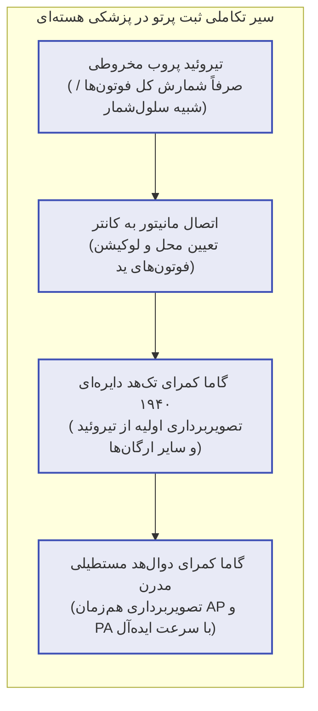
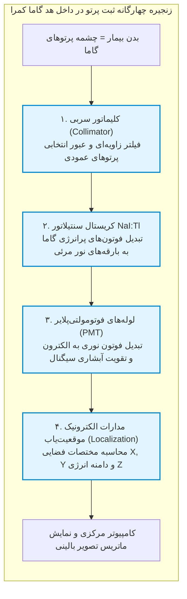
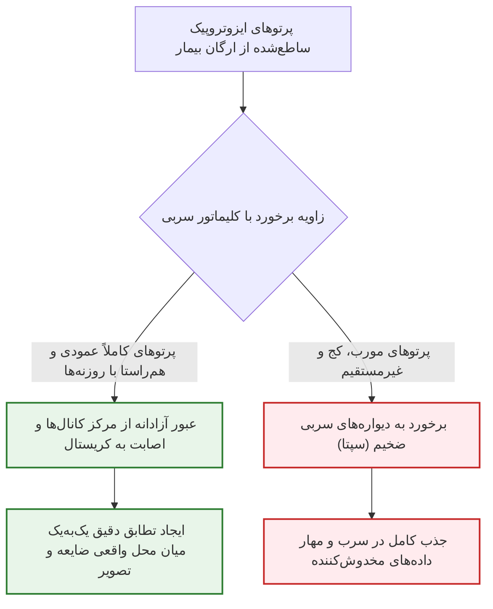
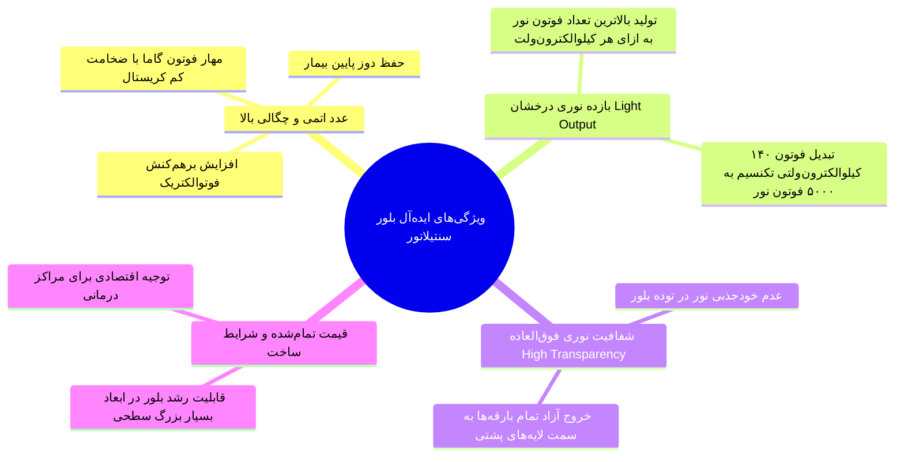
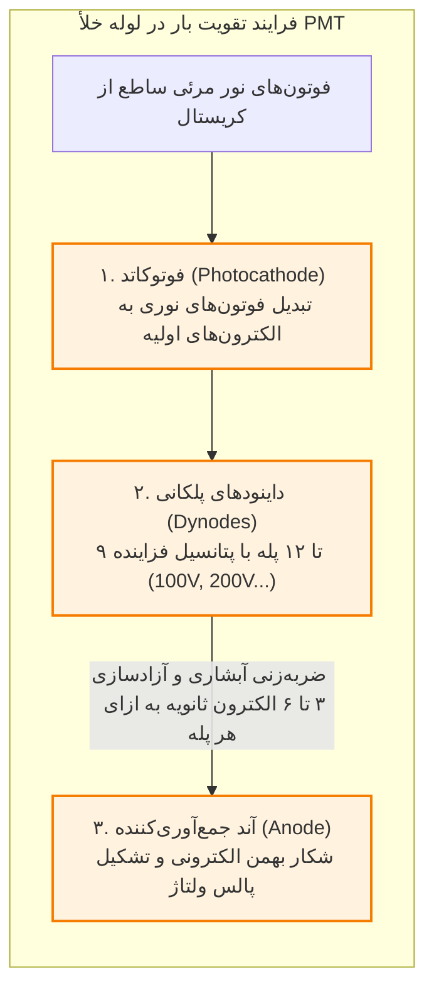
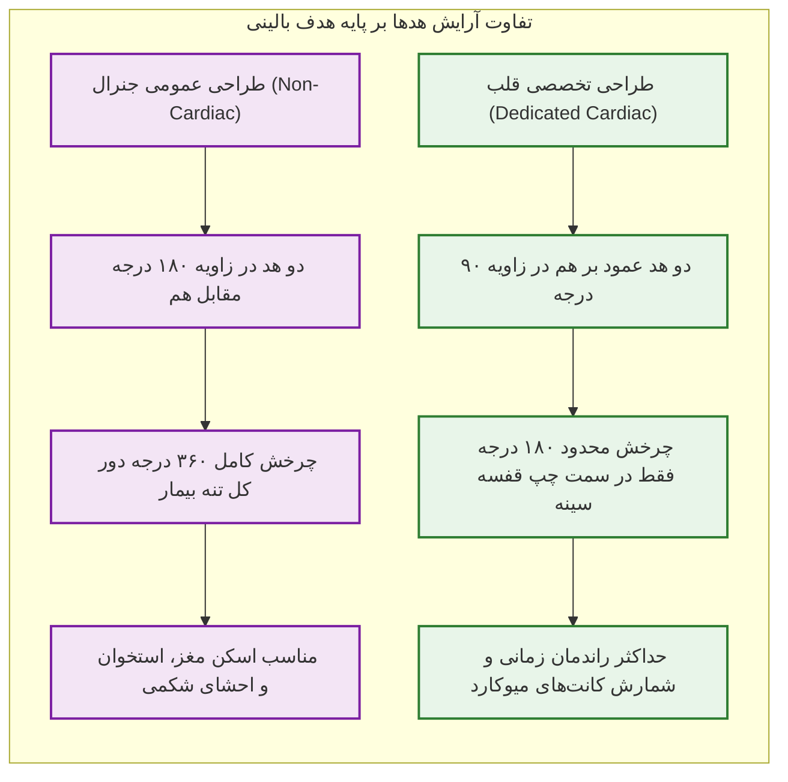
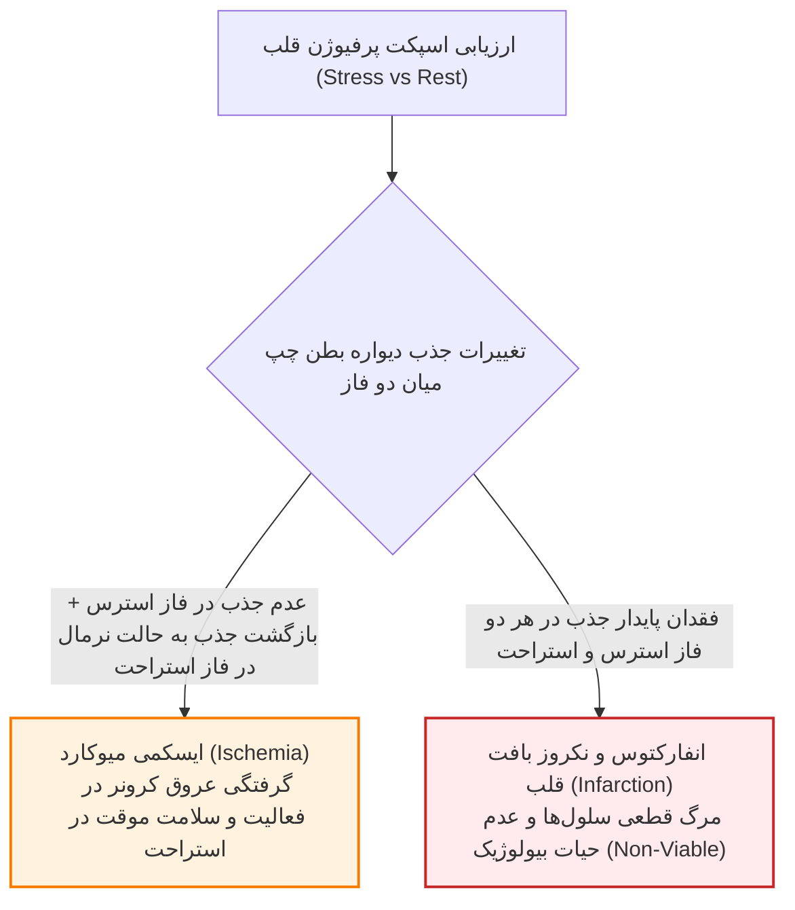
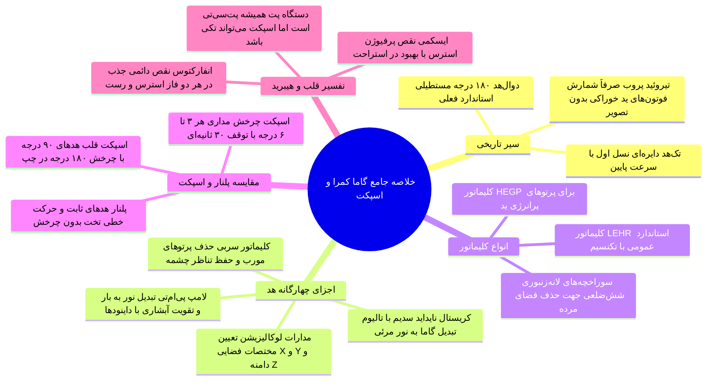

# پزشکی هسته‌ای - گاما کمرا و اسپکت (دکتر عباس‌پور)

## بخش 1: تاریخچه، سیر تحول و فلسفه تکامل گاما کمرا

داستان پیدایش تصویربرداری در پزشکی هسته‌ای با یک نیاز ساده درمانی در دهه 1940 میلادی آغاز شد. نخستین بار پزشکان از ایزوتوپ رادیواکتیو ید خوراکی برای مهار و سوزاندن کانون‌های بدخیم سرطان تیروئید استفاده کردند؛ زیرا غده تیروئید به‌طور طبیعی جاذب حریص عنصر ید در بدن است. پس از خوراندن رادیوداروی ید، این چالش بزرگ به وجود آمد که پزشک از کجا بداند آیا داروی پرتوزا واقعاً به مقدار کافی در تیروئید تجمع یافته و درمان اثربخش است یا خیر؟ برای پاسخ به این معما، سامانه‌ای ابتدایی به نام **پروب تیروئیدی یا تیروئید آپ‌تیک (Thyroid Probe / Uptake System)** ابداع گردید.

> [!definition] تیروئید پروب (Thyroid Probe)
> یک حسگر مخروطی ساده تک‌کاناله که با قرارگیری در برابر گردن بیمار، نرخ مطلق فوتون‌های گسیل‌شده از تیروئید را می‌شمرد؛ این دستگاه فاقد تصویر بود و عملکردی صرفاً کمّی مشابه دستگاه‌های شمارشگر ذرات داشت.

تیروئید پروب هرگز تصویری از بافت تشکیل نمی‌داد، بلکه صرفاً خروجی عددی ثبت می‌کرد که اگر تعداد پرتوها از حد آستانه بالاتر می‌رفت، اطمینان از جذب دارو حاصل می‌شد. گام بزرگ بعدی در تاریخ این رشته، اتصال مدارات نمایشی و مانیتور به آشکارسازها بود تا مشخص شود فوتون‌ها دقیقاً از کدام مختصات غده خارج شده‌اند. با موفقیت‌آمیز بودن نمایش تصویری تیروئید و ورود رادیوایزوتوپ‌های عمومی‌تری نظیر تکنسیم-99m، مهندسان پزشکی سیستم‌های تصویربرداری از تمامی ارگان‌های بدن را توسعه دادند که در نهایت منجر به ساخت نخستین **گاما کمرا (Gamma Camera)** شد.

### تحول هندسی و معماری هدها در دستگاه‌های گاما کمرا

دستگاه‌های گاما کمرای نسل اول دارای یک تک‌هد دایره‌ای بودند که برای پوشش کلینیکی باید یک‌بار در نمای قدامی و سپس با چرخش دستی یا مکانیکی در نمای خلفی قرار می‌گرفتند. این فرایند به‌شدت زمان‌بر بود و سرعت پذیرش بخش را پایین می‌آورد. برای رفع این نقیصه، مهندسی دستگاه‌ها دستخوش دگرگونی شد:

1. **سامانه تک‌هد (Single-Head):** دارای یک آشکارساز بود؛ سرعت اسکن بسیار پایینی داشت و امروزه به‌طور کامل منسوخ گردیده است.
2. **سامانه دوال‌هد (Dual-Head):** *استاندارد طلایی* و *رایج‌ترین* سیستم حاضر در بیمارستان‌ها و مراکز پزشکی هسته‌ای است. این سیستم دارای دو آشکارساز روبه‌روی هم با زاویه 180 درجه است که با یک‌بار خوابیدن بیمار، هم‌زمان نماهای قدامی (AP) و خلفی (PA) را ثبت می‌کند و تعادل فوق‌العاده‌ای میان قیمت دستگاه و سرعت اسکن برقرار می‌سازد.
3. **سامانه‌های سه‌هد و چهارهد (Triple-Head / Quad-Head):** سامانه‌هایی با تعداد هدهای بالاتر که سرعت تصویربرداری را به‌شدت بالا می‌برند؛ اما به دلیل پیچیدگی‌های مکانیکی و قیمت بسیار سنگین، کاربرد محدودی داشته و در روتین بیمارستانی کشورها کمتر مشاهده می‌شوند.

## بخش 2: ساختار سخت‌افزاری و کالبدشکافی درونی هد گاما کمرا

سیستم مدرن گاما کمرا از یک شاسی حلقوی بزرگ به نام **گانتری (Gantry)**، یک تخت متحرک بیمار، دو هد آشکارساز مستطیلی سوار بر گانتری، و یک مانیتور محلی در کنار تخت برای کنترل موقعیت صحیح بیمار توسط کارشناس پیش از عزیمت به اتاق کنترل تشکیل شده است. در فرایند بالینی، بدن بیمار پس از دریافت رادیودارو نقش **چشمه فعال گسیل‌کننده فوتون‌های گاما (Active Source)** را بازی می‌کند. پرتوهای تابش‌شده از درون ارگان‌ها وارد هد گاما کمرا شده و یک مسیر مهندسی چهارمرحله‌ای را تا تشکیل تصویر طی می‌کنند.

> [!definition] هد گاما کمرا (Detector Head)
> بخش فوق‌العاده حساس گیرنده در ماشین پزشکی هسته‌ای که با تلفیق اپتیک هسته‌ای، فیزیک حالت جامد و مدارات الکترونیکی سریع، فوتون‌های گامای خروجی از بیمار را در چهار گام متوالی ثبت و به تصویر ترجمه می‌کند.

## بخش 3: فیزیک کلیماتور، هندسه روزنه‌ها و تطابق فضایی

فوتون‌های گاما درون بافت‌های بدن در تمامی جهات فضایی به صورت کاملاً تصادفی و همسانگرد یا *ایزوتروپیک (Isotropic)* شلیک می‌شوند. اگر این پرتوها بدون هیچ‌گونه فیلتری مستقیماً وارد کریستال شوند، فوتون‌های یک نقطه از بافت به نقاط نامربوط و متفاوتی از سطح کریستال برخورد کرده و پردازشگر گمان می‌کند یک چشمه کشیده و بسیار وسیع در بدن وجود دارد؛ پدیده‌ای که منجر به **پخش‌شدگی شدید (Spreading)**، تخریب تفکیک فضایی و از بین رفتن کامل مرزهای آناتومیک می‌گردد. برای پیشگیری از این خطای فاحش، نخستین لایه در هد گاما کمرا **کلیماتور (Collimator)** است.

> [!definition] کلیماتور (Collimator)
> صفحه‌ای مستحکم از جنس سرب با چگالی بالا که هزاران سوراخچه ریز با دیواره‌های سربی موازی (سپتا) در آن تعبیه شده و تنها به فوتون‌های زاویه عمود اجازه عبور می‌دهد تا تناظر هندسی میان چشمه و تصویر حفظ گردد.

کلیماتور با اینکه بخش بسیار بزرگی از فوتون‌های خروجی را در دیواره‌های سربی خود متوقف و فدا می‌کند، با حفظ فوتون‌های عمودی باعث می‌شود اندازه و موقعیت تصویر دقیقاً منطبق بر اندازه و مکان واقعی ضایعه در بدن بیمار باشد. سوراخچه‌های کلیماتورهای پیشرفته امروزی به شکل **شش‌ضلعی (Hexagonal)** مهندسی می‌شوند تا بدون ایجاد کوچک‌ترین فضای مرده و هدررفت فضا در کنار یکدیگر چفت شوند.

### دسته‌بندی و اطلس کلیماتورهای بالینی

طراحی کلیماتور تابع موازنه حساس میان سه متغیر فیزیکی است: **قطر** سوراخچه‌ها، **طول** یا ارتفاع کانال‌ها (*Septa Length*)، و **ضخامت** تیغه‌های سربی جداکننده (*Septa Thickness*). از آنجا که انرژی ایزوتوپ‌های پزشکی با یکدیگر تفاوت چشمگیری دارد (برای مثال انرژی فوتون تکنسیم حدود 140 keV بوده ولی پرتوهای ساطع‌شده از برخی ایزوتوپ‌های ید می‌تواند تا محدوده 360 تا 600 keV بالا برود)، *نمی‌توان از یک کلیماتور یکسان برای همه داروها استفاده کرد*.

| تیپ اختصاصی کلیماتور               | قطر سوراخچه و مشخصات سپتا             | محدوده انرژی پرتو                      | موارد کاربرد بالینی و اولویت تصویربرداری                                    |
| :--------------------------------- | :------------------------------------ | :------------------------------------- | :-------------------------------------------------------------------------- |
| **LEGP (انرژی پایین جنرال)**       | قطر سوراخچه‌های بزرگ، سپتای نازک‌تر   | فوتون‌های کم‌انرژی (زیر 150 keV)       | اسکن‌های عمومی با *تکنسیم-99m* بدون نیاز به رزولوشن بالا                    |
| **LEHR (انرژی پایین های‌رزولوشن)** | قطر سوراخچه‌های ریز، سپتای فشرده      | فوتون‌های کم‌انرژی (140 keV)           | **پرکاربردترین کلیماتور بخش‌ها**؛ استاندارد طلایی اسکن *استخوان* و *قلب* |
| **ULEHR (اولترا های‌رزولوشن)**     | سوراخچه‌های فوق‌العاده باریک و متراکم | فوتون‌های کم‌انرژی اختصاصی             | تفکیک جزئیات ساختارهای مینیاتوری نظیر **غده تیروئید**                       |
| **MEGP / MEHR (انرژی متوسط)**      | سپتاهای ضخیم‌تر جهت جلوگیری از نشت    | فوتون‌های انرژی متوسط (150 تا 300 keV) | رادیونوکلئیدهایی نظیر ایندیوم-111 یا گالیوم-67                              |
| **HEGP / UHEGP (انرژی بالا)**      | سپتاهای فوق‌العاده ضخیم و سنگین سربی  | فوتون‌های پرانرژی (بالای 300 keV)      | تصویربرداری تشخیصی و پایش درمانی با **ایزوتوپ‌های پرانرژی ید**              |
| **پین‌هول (Pin-Hole)**             | تک‌سوراخچه مخروطی شکل معکوس           | انرژی‌های پایین و متوسط                | بزرگنمایی هندسی **ضایعات کوچک** در *مفاصل اطفال* یا *تیروئید*               |

> [!tip] تله تستی امتحانی: کلیماتور آچارفرانسه در مراکز پزشکی هسته‌ای
> به دلیل محدودیت بودجه در خرید کلیماتورهای متعدد، **کلیماتور LEHR (Low Energy High Resolution)** در اکثر بخش‌های پزشکی هسته‌ای نصب بوده و به عنوان کلیماتور پایه برای ارزیابی اکثریت مراجعین که داروی تکنسیم دریافت می‌کنند استفاده می‌شود؛ اما چنانچه اردر اسکن ید با انرژی بالا برای بیمار ثبت شود، جابه‌جایی کلیماتور و بستن کلیماتور سپتا-ضخیم HEGP برای مهار نشت اشعه الزامی است.

## بخش 4: فیزیک کریستال سنتیلاتور و تکثیر سیگنال در لامپ فوتومولتی‌پلایر

فوتون‌های گاما ذرات پرنفوذی هستند که بار الکتریکی ندارند و تقویت مستقیم آن‌ها با مدارهای الکترونیکی غیرممکن است؛ بنابراین باید ابتدا در یک گام واسط به بارقه‌های نوری مرئی بدل شده و سپس به سیگنال الکتریکی تبدیل شوند.

بلور بی‌رقیب در گاما کمرا، **یدید سدیم فعال‌شده با تالیوم یا NaI(Tl)** است. این ترکیب سنتیلاتور با دارا بودن عدد اتمی مناسب، خروجی نوری عالی، شفافیت اپتیکی بالا و قیمت متعادل به عنصر ثابت گاما کمرا تبدیل شده است (درحالی‌که در سیستم‌های پت از کریستال‌های متفاوتی نظیر BGO، LSO، GSO و LaBr₃ استفاده می‌شود). تناسب تولید نور در NaI(Tl) *کاملاً خطی* است؛ فوتون 140 keV تکنسیم حدود 5000 فوتون نوری و فوتونی با انرژی نصف آن (70 keV) دقیقاً 2500 فوتون نور مرئی تولید می‌کند.

### ساختار و سازوکار لامپ تکثیرکننده نوری (PMT)

بارقه‌های نوری خروجی از کریستال به خودی خود بسیار ضعیف‌تر از آن هستند که بتوانند در مدارهای پردازشی رایانه به کار گرفته شوند؛ لذا پشت سر لایه سنتیلاتور، آرایه‌ای فشرده از **لامپ‌های تکثیرکننده نوری (Photomultiplier Tubes - PMT)** تعبیه شده است. این لامپ‌ها دارای محفظه شیشه‌ای خلأ بوده و درون آن‌ها سه بخش اصلی مستقر است:

1. **فوتوکاتد (Photocathode):** لایه‌ای حساس به نور در ورودی لامپ که با دریافت فوتون‌های نوری مرئی، الکترون‌های ضعیفی آزاد می‌کند.
2. **داینودها (Dynodes):** زنجیره‌ای متشکل از **9 تا 12 صفحه فلزی با شیب ولتاژ فزاینده**. الکترون به سمت داینود اول با پتانسیل مثبت شتاب می‌گیرد؛ در اثر برخورد محکم با سطح آن، **3 تا 6 الکترون ثانویه** کنده می‌شود. این الکترون‌ها به سوی داینود بعدی با ولتاژ بالاتر جذب می‌شوند و این واکنش زنجیره‌ای آبشاری، *ضریب تقویت (Gain)* عظیمی را بدون نویز ناخواسته خلق می‌کند.
3. **آند (Anode):** آخرین الکترود که بهمن میلیونی الکترون‌ها را شکار کرده و به صورت یک پالس جریان الکتریکی دقیق به خارج گسیل می‌دارد.

> [!important] مدارات الکترونیک موقعیت‌یاب (Localization Electronics)
> پالس‌های حاصل از آرایه PMT وارد مدارهای آنالیزگر پوزیشن می‌شوند. این مدارها با مقایسه شدت سیگنال‌های دریافتی از لامپ‌های مجاور، مختصات دقیق دو بعدی (X و Y) و همچنین ارتفاع پالس متناسب با انرژی پرتو (Z) را در کسر کوچکی از ثانیه محاسبه کرده و به رایانه ارسال می‌کنند تا پیکسل متناظر در تصویر روشن شود.

## بخش 5: مقایسه روش‌های تصویربرداری با گاما کمرا: پلنار، اسپکت جنرال و اسپکت قلبی

با استفاده از یک دستگاه گاما کمرا می‌توان هم آزمون‌های دو بعدی مسطح و هم تصویربرداری‌های مقطعی توموگرافیک سه بعدی را اجرا نمود:

* **تصویربرداری پلنار دو بعدی (Planar):** بیمار روی تخت مستقر شده و دو هد دستگاه در بالا و پایین ثابت می‌مانند؛ تخت بیمار به آرامی در طول گانتری گام برمی‌دارد و بدون هیچ‌گونه چرخش زاویه‌ای در هدها، تصاویر تمام‌بدن ثبت می‌گردند. ضعف اصلی این شیوه برهم‌نهی ساختارها و مشخص نبودن عمق بافتی ضایعات است.
* **توموگرافی اسپکت (SPECT):** هدهای آشکارساز حول محور طولی بدن بیمار شروع به چرخش مداری می‌کنند. این چرخش معمولاً با گام‌های زاویه‌ای **3 تا 6 درجه‌ای** صورت می‌پذیرد. در هر زاویه توقف، سیستم به مدت حدود **30 ثانیه** اطلاعات فوتون‌ها را گردآوری کرده و سپس به زاویه بعد می‌رود (*Step-and-Shoot*). یک اسکن اسپکت کامل معمولاً نزدیک به **15 دقیقه** زمان می‌برد و تصاویر توموگرافیک با کنتراست عالی و تفکیک عمق دقیق ایجاد می‌نماید.

### فیزیک گاما کمرای زاویه 90 درجه اختصاصی قلب

حدود **80 تا 90 درصد کل درخواست‌های اسپکت** در بیمارستان‌ها مربوط به بررسی پرفیوژن عضله قلب است. قلب در سمت چپ قفسه سینه مستقر بوده و سمت راست قفسه سینه فاقد بافت قلبی است. در هدهای جنرال 180 درجه، دستگاه مجبور است یک چرخش بیهوده 360 درجه‌ای انجام دهد؛ اما در سیستم‌های اختصاصی قلب (یا دستگاه‌هایی نظیر سامانه‌های بیمارستان شریعتی که قابلیت چیدمان 90 درجه دارند)، دو هد آشکارساز عمود بر یکدیگر فیکس می‌شوند.

> [!important] مزیت پیکربندی هدهای 90 درجه در اسکن قلب
> این سیستم تنها یک **قوس 180 درجه‌ای** حول قفسه سینه چپ را طی می‌کند (از نمای قدامی چپ تا خلفی چپ). در نتیجه، آشکارسازها در کمترین فاصله به قلب قرار گرفته، فوتون‌های مفید بسیار بیشتری شکار می‌شوند، سرعت اکسپوژر بالا می‌رود و کیفیت تصویر مقاطع بازسازی‌شده بطن چپ ارتقا می‌یابد.

## بخش 6: کاربردهای بالینی، تحلیل الگوهای قلبی و فناوری تلفیقی SPECT/CT

در تحلیل آزمون اسپکت قلب با رادیوداروی تکنسیم-میبی، دیواره میوکارد بطن چپ به شکل یک نعل اسب یا حرف **C برعکس** هویدا می‌شود که در شرایط فیزیولوژیک سالم، رنگ نارنجی و جذب یکدست دارد. پروتکل اسکن در دو فاز مستقل مقایسه می‌گردد:

در فاز استرس (ورزش روی تردمیل یا استرس دارویی با تحریک ضربان قلب)، اگر عروق کرونر دچار تنگی باشند، خون‌رسانی افت کرده و نقص جذب یا **منطقه سرد (Cold Defect)** شکل می‌گیرد؛ چنانچه همین منطقه در فاز استراحت خون‌گیری کامل داشته باشد نشان‌دهنده ایسکمی برگشت‌پذیر است، اما اگر بافت در فاز استراحت نیز کدر و بی‌رنگ بماند نشانگر انفارکتوس قدیمی و اسکار مرده قلبی است.

### تولد سیستم‌های تلفیقی و هیبرید اسپکت/سی‌تی (SPECT/CT)

تصاویر اسپکت اطلاعات متابولیک بی‌نظیری در اختیار می‌گذارند اما رزولوشن آناتومیک بسیار پایینی دارند و اغلب تشخیص دقیق مرز ضایعه با ساختارهای مجاور دشوار است. در سیستم هیبرید **اسپکت/سی‌تی (SPECT/CT)**، یک گانتری سی‌تی اسکن تشخیصی مستقیماً در امتداد هدهای گاما کمرا نصب شده است. بیمار بدون نیاز به تغییر پوزیشن، ابتدا تحت تصویربرداری عملکردی اسپکت و سپس تحت مقطع‌نگاری ساختاری سی‌تی قرار می‌گیرد و تصاویر نهایی بر روی یکدیگر منطبق (*Image Fusion*) می‌شوند.

> [!important] تله تستی آزمونی: قانون سامانه‌های هیبرید در پزشکی هسته‌ای
> در پزشکی هسته‌ای امروزی، دستگاه‌های **پت (PET) الزاماً و همواره به صورت هیبرید پت/سی‌تی (PET/CT)** تولید می‌شوند و هرگز دستگاه پت تکی در بالین وجود ندارد؛ اما در سیستم‌های اسپکت، هم دستگاه **اسپکت تنها (Standalone SPECT)** و هم سیستم ترکیبی پیشرفته **اسپکت/سی‌تی (SPECT/CT)** در بیمارستان‌ها به صورت فعال به کار گرفته می‌شوند.

## بخش 7: چک‌لیست طلایی مرور سریع

> [!tip] دام‌های تستی و نکات مهم
> 1. **سرنوشت نبود کلیماتور:** حذف کلیماتور باعث برهم خوردن تناظر هندسی و پهن شدن غیرواقعی سیگنال چشمه بر کل سطح دتکتور می‌گردد؛ بنابراین کلیماتور برای تولید رزولوشن فضایی الزامی است هرچند حساسیت را کم می‌کند.
> 2. **مکانیزم تقویت داینودها:** در لامپ PMT، ولتاژ پله‌پله بین داینودها افزایش می‌یابد و هر الکترون با اصابت به هر پله موجب کنده شدن 3 تا 6 الکترون جدید می‌گردد که تقویت آبشاری را پدید می‌آورد.
> 3. **دلیل استفاده از هدهای 90 درجه در اسکن کاردیاک:** از آنجا که قلب در سمت چپ قفسه سینه متمرکز است، چرخش 180 درجه‌ای هدهای عمود بر هم در سمت چپ، تمامی کانت‌های تشخیصی را در کمترین زمان و با بالاترین کنتراست ممکن استخراج می‌کند.
> 4. **تفاوت بنیادین ایسکمی و انفارکتوس:** در ایسکمی، منطقه سرد میوکارد در فاز استراحت مجدداً روشن و رنگی می‌شود؛ اما در بافت مرده و انفارکت‌شده دیواره قلب در هر دو فاز استرس و استراحت کدر و خاموش باقی می‌ماند.